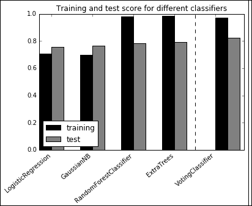
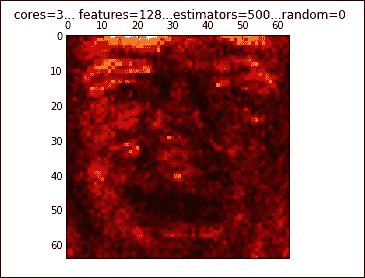
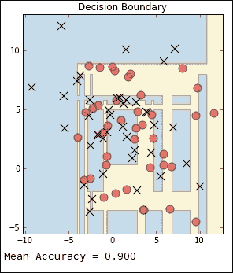
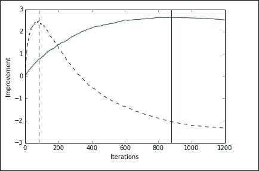

# 八、集成学习

创建机器学习集成的动机来自清晰的直觉，并且基于丰富的理论历史。在许多自然和人工系统中，多样性使它们对扰动更有弹性。同样，我们已经看到，对大量测量结果进行平均通常可以得到更稳定的模型，该模型不太容易受到随机波动的影响，例如数据收集中的异常值或误差。

在本章中，我们将把这个相当大而多样的空间分成以下几个主题:

*   “类型”集合
*   制袋材料
*   随机森林
*   助推

# 集合型式

集成技法可以大致分为两种类型:

*   **平均法**:这是法，其中几个估计量独立运行，它们的预测值被平均。这包括随机森林和装袋方法。
*   **Boosting 方法**:这是中的方法，使用基于错误率的数据的加权分布，依次构建弱学习者。

集成方法使用多个模型来获得比任何单个组成模型更好的性能。其目的不仅是建立多样化和健壮的模型，而且在诸如处理速度和返回时间等限制内工作。当处理大型数据集和快速响应时，这可能是一个重大的发展瓶颈。故障排除和诊断是使用所有机器学习模型的一个重要方面，尤其是当我们处理可能需要几天运行的模型时。

可以创建的机器学习集成的类型和模型本身一样多种多样，主要考虑围绕三件事:我们如何划分数据，我们如何选择模型，以及我们使用什么方法来组合它们的结果。这种简单的说法实际上包含了一个非常大而多样的空间。

# 装袋

打包，也称为**自举聚合**，有几种风格，它们是通过从训练数据中抽取随机子集的方式来定义的。最常见的是，装袋是指抽取样品进行替换。因为样本被替换，所以生成的数据集可能包含重复项。这也意味着数据点可能会从特定生成的数据集中排除，即使该生成的数据集与原始数据集大小相同。每个生成的数据集都是不同的，这是一种在集合中的模型之间创建多样性的方法。我们可以使用以下示例计算样本中未选择数据点的概率:


这里， *n* 是自举样本数。每个 *n* 自举样本产生不同的假设。通过平均模型或者通过选择大多数模型预测的类别来预测类别。考虑一组线性分类器。如果我们使用多数投票来确定预测的类，我们创建一个分段线性分类器边界。如果我们将投票转换为概率，那么我们将实例空间划分为多个片段，每个片段都可能有不同的分数。

还应该提到的是，使用特征的随机子集是可能的，有时也是可取的；这叫做 **子空间采样**。Bagging 估计器最适合复杂模型，如完全开发的决策树，因为它们可以帮助减少过度拟合。它们提供了一种简单、现成的方法来改进单一模型。

Scikit-learn 实现了一个`BaggingClassifier`和`BaggingRegressor`对象。以下是它们最重要的一些参数:

<colgroup><col style="text-align: left"> <col style="text-align: left"> <col style="text-align: left"> <col style="text-align: left"></colgroup> 
| 

参数

 | 

类型

 | 

描述

 | 

默认

 |
| --- | --- | --- | --- |
| `base_estimator` | 估计量 | 这就是这个集成所基于的模型。 | 决策图表 |
| `n_estimators` | （同 Internationalorganizations）国际组织 | 这是基础估计量的数。 | Ten |
| `max_samples` | Int 或 float | 这是要抽取的样本数量。若浮绘`max_samples*X.shape[0]`。 | One |
| `max_features` | Int 或 float | 这是要绘制的特征数量。若浮绘`max_features*X.shape[1]`。 | One |
| `bootstrap` | 布尔代数学体系的 | 这些是替换抽取的样本。 | 真实的 |
| `bootstrap_features` | 布尔代数学体系的 | 这些是替换绘制的特征。 | 错误的 |

作为一个例子，下面的片段实例化了一个 bagging 分类器，该分类器包括 50 个决策树分类器基估计器，每个估计器建立在一半特征和一半样本的随机子集上:

```py
from sklearn.ensemble import BaggingClassifier
from sklearn.tree import DecisionTreeClassifier
from sklearn import datasets

bcls=BaggingClassifier(DecisionTreeClassifier(),max_samples=0.5, max_features=0.5, n_estimators=50)
X,y=datasets.make_blobs(n_samples=8000,centers=2, random_state=0, cluster_std=4)
bcls.fit(X,y)
print(bcls.score(X,y))

```

## 随机森林

基于树的模型特别适合集成，主要是因为它们对训练数据的变化非常敏感。当与 **子空间采样**一起使用时，树模型可以非常有效，导致模型更加多样化，并且由于集成中的每个模型只处理特征的子集，因此减少了训练时间。这使用特征的不同随机子集构建每棵树，因此被称为**随机森林**。

随机林通过查找林中单个树中分区的交集来划分实例空间。它定义了一个比林中任何单独的树创建的分区都更精细的分区，也就是说，它将包含更多的细节。原则上，一个随机森林可以映射回一个单独的树，因为每个交集对应于两个不同树的分支的组合。随机森林可以被认为是本质上是基于树的模型的替代训练算法。bagging 集成中的线性分类器能够学习单个线性分类器无法学习的复杂决策边界。

`sklearn.ensemble`模块有两种基于决策树的算法，随机森林和极随机树。它们都通过在构造中引入随机性来创建不同的分类器，并且都包括用于分类和回归的类。对于`RandomForestClassifier`和`RandomForestRegressor`类，每个树都是使用自举样本构建的。模型选择的分割不是所有要素中的最佳分割，而是从要素的随机子集中选择的。

## 多余的树

与随机森林一样，`extra trees`方法使用特征的随机子集，但是使用随机生成的最佳阈值集而不是使用最具区别性的阈值。这是以偏差的小幅增加为代价来降低方差的。两个班是`ExtraTreesClassifier`和`ExtraTreesRegressor`。

我们来看一个分类器和`extra trees`分类器的例子。在这个例子中，我们使用`VotingClassifier`来组合不同的分类器。投票分类器可以帮助平衡单个模型的弱点。在本例中，我们向函数传递四个权重。这些权重决定了每个模型对整体结果的贡献。我们可以看到，这两个树模型在训练数据上表现过度，但在测试数据上表现更好。我们还可以看到`ExtraTreesClassifier`在测试集上取得了比`RandomForest`对象稍好的结果。此外，`VotingClasifier`对象在测试集上的表现优于其所有组成分类器。值得一提的是，在不同的权重和不同的数据集上运行时，可以看到每个模型的性能是如何变化的:

```py
from sklearn import cross_validation
import numpy as np
import matplotlib.pyplot as plt
from sklearn.linear_model import LogisticRegression
from sklearn.naive_bayes import GaussianNB
from sklearn.ensemble import RandomForestClassifier
from sklearn.ensemble import ExtraTreesClassifier
from sklearn.ensemble import VotingClassifier
from sklearn import datasets

def vclas(w1,w2,w3, w4):

 X , y = datasets.make_classification(n_features= 10, n_informative=4, n_samples=500, n_clusters_per_class=5)
 Xtrain,Xtest, ytrain,ytest= cross_validation.train_test_split(X,y,test_size=0.4)

 clf1 = LogisticRegression(random_state=123)
 clf2 = GaussianNB()
 clf3 = RandomForestClassifier(n_estimators=10,bootstrap=True, random_state=123)
 clf4= ExtraTreesClassifier(n_estimators=10, bootstrap=True,random_state=123)

 clfes=[clf1,clf2,clf3,clf4]

 eclf = VotingClassifier(estimators=[('lr', clf1), ('gnb', clf2), ('rf', clf3),('et',clf4)],
 voting='soft',
 weights=[w1, w2, w3,w4])

 [c.fit(Xtrain, ytrain) for c in (clf1, clf2, clf3,clf4, eclf)]

 N = 5
 ind = np.arange(N)
 width = 0.3
 fig, ax = plt.subplots()

 for i, clf in enumerate(clfes):
 print(clf,i)
 p1=ax.bar(i,clfes[i].score(Xtrain,ytrain,), width=width,color="black")
 p2=ax.bar(i+width,clfes[i].score(Xtest,ytest,), width=width,color="grey")
 ax.bar(len(clfes)+width,eclf.score(Xtrain,ytrain,), width=width,color="black")
 ax.bar(len(clfes)+width *2,eclf.score(Xtest,ytest,), width=width,color="grey")
 plt.axvline(3.8, color='k', linestyle='dashed')
 ax.set_xticks(ind + width)
 ax.set_xticklabels(['LogisticRegression',
 'GaussianNB',
 'RandomForestClassifier',
 'ExtraTrees',
 'VotingClassifier'],
 rotation=40,
 ha='right')
 plt.title('Training and test score for different classifiers')
 plt.legend([p1[0], p2[0]], ['training', 'test'], loc='lower left')
 plt.show()

vclas(1,3,5,4)

```

您将观察以下输出:



树模型允许我们根据它们贡献的样本的预期分数来评估特征的相对等级。这里，我们使用一个来评估分类任务中每个特征的重要性。特征的相对重要性基于它在树中的表示位置。树顶部的特征有助于最终决定更大比例的输入样本。

以下示例使用`ExtraTreesClassifier`类来映射要素重要性。我们使用的数据集由 10 张图片组成，每张 40 人，共 400 张图片。每张图片都有一个标签，表明这个人的身份。在这个任务中，每个像素都是一个特征；在输出中，像素的亮度代表特征的相对重要性。像素越亮，特征越重要。请注意，在这个模型中，最亮的像素在前额区域，我们应该小心如何解释这一点。由于大多数照片都是从头顶上方照射的，这些像素的重要性显然很高，这可能是因为前额往往被更好地照射，因此揭示了关于个人的更多细节，而不是一个人前额的内在属性来表明他们的身份:

```py
import matplotlib.pyplot as plt
from sklearn.datasets import fetch_olivetti_faces
from sklearn.ensemble import ExtraTreesClassifier
data = fetch_olivetti_faces()
def importance(n_estimators=500, max_features=128, n_jobs=3, random_state=0):
 X = data.images.reshape((len(data.images), -1))
 y = data.target
 forest = ExtraTreesClassifier(n_estimators,max_features=max_features, n_jobs=n_jobs, random_state=random_state)
 forest.fit(X, y)
 dstring=" cores=%d..." % n_jobs + " features=%s..." % max_features +"estimators=%d..." %n_estimators + "random=%d" %random_state 
 print(dstring)
 importances = forest.feature_importances_
 importances = importances.reshape(data.images[0].shape)
 plt.matshow(importances, cmap=plt.cm.hot)
 plt.title(dstring)
 #plt.savefig('etreesImportance'+ dstring + '.png')
 plt.show()

importance()

```

前面代码的输出如下:



# 助推

在本书的前面，我介绍了 PAC 学习模型的思想和概念类的思想。一个相关的想法是 **弱可学性**。在这里，集成中的每一个学习算法只需要表现得比机会稍好。例如，如果集合中的每个算法至少有 51%的时间是正确的，则弱可学习性的标准得到满足。事实证明，PAC 和弱可学习性的思想本质上是相同的，只是对于后者，我们放弃了算法必须达到任意高精度的要求。然而，它只是比随机假设表现得更好。你可能会问，这有什么用？通常更容易找到粗略的*经验法则*而不是高度精确的预测法则。这种弱学习模式的表现可能只是略好于偶然性；然而，如果我们通过在数据的不同加权分布上多次运行*来提升*这个学习者，并通过组合这些学习者，我们有希望构建一个单一的预测规则，它的性能比任何单个弱学习规则都好得多。

助推是一个简单而有力的想法。它通过考虑模型的训练误差来扩展 bagging。例如，如果我们训练一个线性分类器，发现它错误地分类了某一组实例。如果我们在包含这些错误分类实例的副本的数据集上训练一个后续模型，那么我们会期望这个新训练的模型在测试集上会表现得更好。通过在训练集中包含错误分类实例的副本，我们将数据集的平均值向这些实例转移。这迫使学习者专注于最难分类的例子。在实践中，这是通过赋予错误分类的实例更高的权重，然后修改模型来考虑这一点来实现的，例如，在线性分类器中，我们可以使用加权平均来计算类均值。

从一个总和为 1 的统一权重数据集开始，我们运行分类器，可能会对一些实例进行错误分类。为了增加这些实例的权重，我们给它们分配了总权重的一半。例如，考虑一个给我们以下结果的分类器:

<colgroup><col style="text-align: left"> <col style="text-align: left"> <col style="text-align: left"> <col style="text-align: left"></colgroup> 
|   | 

预测阳性

 | 

预测负值

 | 

总数

 |
| --- | --- | --- | --- |
| **实际位置。** | Twenty-four | Sixteen | Forty |
| **实际负值。** | nine | Fifty-one | Sixty |
| **总计** | Thirty-three | Sixty-seven | One hundred |

误差率为 *ɛ = (9 + 16)/100 = 0.25* 。

我们希望将错误权重的一半分配给错误分类的样本，由于我们从总和为 1 的统一权重开始，因此分配给错误分类示例的当前权重只是错误率。因此，为了更新权重，我们将它们乘以因子 *1/2ɛ* 。假设错误率小于 0.5，这将导致错误分类示例的权重增加。为了确保权重总和仍然为 1，我们将正确分类的示例乘以 *(1-ɛ)* 。在这个例子中，错误分类样本的初始权重的错误率是. 25，我们希望它是. 5，也就是总权重的一半，所以我们将这个初始错误率乘以 2。正确分类实例的权重为*1/2(1-ɛ= 2/3*。将这些权重考虑到下表中:

<colgroup><col style="text-align: left"> <col style="text-align: left"> <col style="text-align: left"> <col style="text-align: left"></colgroup> 
|   | 

预测阳性

 | 

预测负值

 | 

总数

 |
| --- | --- | --- | --- |
| **实际位置。** | Sixteen | Thirty-two | Forty-eight |
| **实际负值。** | Eighteen | Thirty-four | Sixty |
| **总计** | Thirty-three | Sixty-seven | One hundred |

我们需要的最后一块是一个置信因子 *α* ，它被应用于集合中的每个模型。这用于基于来自每个单独模型的加权平均值进行集合预测。我们希望随着误差的减小，这个数值会增加。确保这种情况发生的常见方法是将置信因子设置为以下值:


因此，我们得到了一个数据集，如下所示:


然后，我们初始化一个相等的加权分布，如下所示:


使用弱分类器 *h <sub>t</sub>* ，我们可以编写一个更新的规则如下:


使用归一化因子，如下所示:


请注意，*exp(-y<sub>I</sub>h<sub>t</sub>(x<sub>I</sub>)*为正且大于 1，如果*-y<sub>I</sub>h<sub>t</sub>(x<sub>I</sub>)*为正，如果 *x <sub>i</sub>* 为错误分类，则会出现这种情况。结果是，更新规则将增加错误分类示例的权重，并降低正确分类样本的权重。

我们可以按如下方式编写最终的分类器:


## Adaboost

其中最流行的增强算法被称为 **AdaBoost** 或**自适应增强**。这里，决策树分类器被用作基础学习器，并且它在不可线性分离的数据上建立决策边界:

```py
import numpy as np
import matplotlib.pyplot as plt
from sklearn.ensemble import AdaBoostClassifier
from sklearn.tree import DecisionTreeClassifier
from sklearn.datasets import make_blobs

plot_colors = "br"
plot_step = 0.02
class_names = "AB"
tree= DecisionTreeClassifier()
boost=AdaBoostClassifier()
X,y=make_blobs(n_samples=500,centers=2, random_state=0, cluster_std=2)
boost.fit(X,y)
plt.figure(figsize=(10, 5))

# Plot the decision boundaries
plt.subplot(121)
x_min, x_max = X[:, 0].min() - 1, X[:, 0].max() + 1
y_min, y_max = X[:, 1].min() - 1, X[:, 1].max() + 1
xx, yy = np.meshgrid(np.arange(x_min, x_max, plot_step),
 np.arange(y_min, y_max, plot_step))

Z = boost.predict(np.c_[xx.ravel(), yy.ravel()])
Z = Z.reshape(xx.shape)
cs = plt.contourf(xx, yy, Z, cmap=plt.cm.Paired)
plt.axis("tight")

for i, n, c in zip(range(2), class_names, plot_colors):
 idx = np.where(y == i)
 plt.scatter(X[idx, 0], X[idx, 1],
 c=c, cmap=plt.cm.Paired,
 label="Class %s" % n)
plt.title('Decision Boundary')

twoclass_output = boost.decision_function(X)
plot_range = (twoclass_output.min(), twoclass_output.max())
plt.subplot(122)
for i, n, c in zip(range(2), class_names, plot_colors):
 plt.hist(twoclass_output[y == i],
 bins=20,
 range=plot_range,
 facecolor=c,
 label='Class %s' % n,
 alpha=.5)
x1, x2, y1, y2 = plt.axis()
plt.axis((x1, x2, y1, y2))
plt.legend(loc='upper left')
plt.ylabel('Samples')
plt.xlabel('Score')
plt.title('Decision Scores')
plt.show()
print("Mean Accuracy =%f" % boost.score(X,y))

```

以下是前面命令的输出:



## 梯度助推

梯度树增强对于回归和分类问题都是非常有用的算法。它的一个主要优势是它自然地处理混合数据类型，并且它对异常值也相当健壮。此外，它比许多其他算法具有更好的预测能力；然而，它的顺序体系结构使它不适合并行技术，因此，它不能很好地扩展到大型数据集。对于类数较多的数据集，建议改用`RandomForestClassifier`。梯度增强通常使用决策树来建立基于弱学习者集合的预测模型，对代价函数应用优化算法。

在下面的示例中，我们创建了一个构建梯度增强分类器的函数，并绘制了其累积损失与迭代次数的关系图。`GradientBoostingClassifier`类有一个`oob_improvement_`属性，用于计算每次迭代的测试损失估计值。与之前的迭代相比，这让我们减少了损失。这对于确定最佳迭代次数是非常有用的启发。这里，我们绘制了两个梯度增强分类器的累积改进。每个分类器都是相同的，但是学习速率不同，虚线为 *.01* ，实线为 *.001* 。

学习率缩小了每棵树的贡献，这意味着在估计器的数量上有一个折衷。在这里，我们实际上看到，与具有较低学习率的模型相比，具有较大学习率的模型似乎更快地达到其最佳性能。然而，这种模式似乎取得了更好的整体效果。在实践中通常发生的是`oob_improvement`在大量迭代中以悲观的方式偏离。让我们来看看以下命令:

```py
import numpy as np
import matplotlib.pyplot as plt
from sklearn import ensemble
from sklearn.cross_validation import train_test_split
from sklearn import datasets

def gbt(params, X,y,ls):
 clf = ensemble.GradientBoostingClassifier(**params)
 clf.fit(X_train, y_train)
 cumsum = np.cumsum(clf.oob_improvement_)
 n = np.arange(params['n_estimators'])
 oob_best_iter = n[np.argmax(cumsum)]
 plt.xlabel('Iterations')
 plt.ylabel('Improvement')
 plt.axvline(x=oob_best_iter,linestyle=ls)
 plt.plot(n, cumsum, linestyle=ls)

X,y=datasets.make_blobs(n_samples=50,centers=5, random_state=0, cluster_std=5)
X_train, X_test, y_train, y_test = train_test_split(X, y, test_size=0.5, random_state=9)

p1 = {'n_estimators': 1200, 'max_depth': 3, 'subsample': 0.5,
 'learning_rate': 0.01, 'min_samples_leaf': 1, 'random_state': 3}
p2 = {'n_estimators': 1200, 'max_depth': 3, 'subsample': 0.5,
 'learning_rate': 0.001, 'min_samples_leaf': 1, 'random_state': 3}

gbt(p1, X,y, ls='--')
gbt(p2, X,y, ls='-')

```

您将观察到以下输出:



# 集合策略

我们研究了两种广泛的集成技术:打包，应用于随机森林和额外的树，以及增强，特别是 AdaBoost 和梯度树增强。当然还有许多其他的变体以及它们的组合。在这一章的最后一节，我想研究一些为特定任务选择和应用不同系综的策略。

一般来说，在分类任务中，有三个原因可以解释为什么模型可能会对测试实例进行错误分类。首先，如果来自不同类别的特征由相同的特征向量描述，这可能是不可避免的。在概率模型中，当类分布重叠时会发生这种情况，因此一个实例对于几个类具有非零的可能性。这里我们只能近似一个目标假设。

分类错误的第二个原因是模型不具备充分表达目标假设的表达能力。例如，如果数据不能线性分离，即使最好的线性分类器也会对实例进行错误分类。这是由于分类器的偏差。尽管没有单一的一致同意的方法来测量偏差，我们可以看到非线性决策边界比线性决策边界具有更小的偏差，或者更复杂的决策边界比简单的决策边界具有更小的偏差。我们还可以看到，树模型的偏差最小，因为它们可以继续分支，直到每个叶子只覆盖一个实例。

现在，似乎我们应该尽量减少偏见；然而，在大多数情况下，降低偏差往往会增加方差，反之亦然。正如你可能已经猜到的，方差是分类错误的第三个来源。高方差模型高度依赖于训练数据。例如，最近邻分类器将实例空间分割成单个训练点。如果决策边界附近的训练点被移动，那么该边界将改变。树模型也是高方差的，但原因不同。考虑我们以这样一种方式改变训练数据，即在树根处选择不同的特征。这可能会导致树的其余部分不同。

线性分类器的袋装集成能够通过分段构造来学习更复杂的决策边界。集成中的每个分类器创建一段决策边界。这表明 bagging，实际上任何集成方法，都能够减少高偏差模型的偏差。然而，我们在实践中发现，提升通常是减少偏见的更有效方式。

### 注

Bagging 主要是一种方差减少技术，boosting 主要是一种偏差减少技术。

Bagging 集成在高方差模型(如复杂树)中最有效，而 boosting 通常用于高偏差模型(如线性分类器)。

我们可以从**利润**的角度来看提振。这可以理解为距决策边界的有符号距离；正号表示正确的类别，负号表示错误的类别。可以证明的是，即使样本已经在决策边界的正确一侧，提升也可以增加这一裕度。换句话说，即使训练误差为零，boosting 也可以继续提高测试集的性能。

## 其他方法

集合方法的主要变化是通过改变基本模型的预测组合方式来实现的。我们实际上可以将这定义为一个学习问题，假设一组基本分类器的预测作为特征来学习一个 **元模型**，该模型最好地组合了它们的预测。学习线性元模型被称为**叠加**或**叠加泛化**。堆叠使用所有学习者的加权组合，并且在分类任务中，使用诸如逻辑回归的组合器算法来进行最终预测。不像装袋或助推，也像装桶一样，堆叠通常用于不同类型的模型。

典型的堆叠程序包括以下步骤:

1.  将训练集分成两个不连贯的集合。
2.  在第一套基础上训练几个基础学习者。
3.  在第二组测试基础学习者。
4.  使用上一步的预测来训练更高水平的学习者。

请注意，前三个步骤与交叉验证相同；然而，基础学习者不是采取赢家通吃的方法，而是被组合在一起，可能是非线性的。

这个主题的一个变体是**逆势**。这里，选择算法用于为每个问题选择最佳模型。例如，这可以通过给每个模型的预测赋予权重来使用感知来选择最佳模型。由于有大量不同的模型，有些模型比其他模型需要更长的训练时间。在集成中使用这种方法的一种方式是首先使用快速但不精确的算法来选择哪个较慢但更精确的算法可能做得最好。

我们可以使用一组不同的基础学习者来融合多样性。这种多样性来自不同的学习算法，而不是数据。这意味着每个模型可以使用相同的训练集。通常，基本模型由相同类型但具有不同超参数设置的集合组成。

总的来说，集成由一组基本模型和一个元模型组成，它们被训练来找到组合这些基本模型的最佳方式。如果我们使用一组加权模型，并以某种方式组合它们的输出，我们假设如果一个模型的权重接近于零，那么它对输出的影响将非常小。可以想象，基础分类器具有负权重，并且在这种情况下，相对于其他基础模型，它的预测将被反转。我们甚至可以更进一步，甚至在训练基础模型之前，就试图预测它的表现。这有时被称为**元学习**。这包括，首先，在大量数据集合上训练各种模型，并构建一个模型来帮助我们回答一些问题，例如哪个模型在特定数据集上可能优于另一个模型，或者数据是否表明特定(元)参数可能效果最好？

请记住，当在所有可能问题的空间上进行评估时，没有任何学习算法能够胜过另一个算法，例如，如果所有可能的序列都是可能的，则预测下一个数字是一个序列。当然，现实世界中的学习问题具有非均匀分布，这使得我们能够在这些问题上建立预测模型。元学习的重要问题是如何设计元模型所基于的特征。它们需要结合训练模型和数据集的相关特征。该必须包括除特征数量和类型以及样本数量之外的数据方面。

# 总结

在这一章中，我们研究了 scikit-learn 中的主要集成方法及其实现。很明显，这里有很大的工作空间，找到最适合不同类型问题的技术是关键的挑战。我们看到，偏差和方差的问题都有各自的解决方案，理解每个问题的关键指标至关重要。获得好的结果通常需要大量的实验，使用本章中描述的一些简单技术，你可以开始你的机器学习集成之旅。

在下一章，也是最后一章，我们将介绍最重要的主题——模型选择和评估，并从不同的角度研究一些现实世界的问题。