# 一、机器学习和 Python 入门

相信未来 30 年，**人工智能** ( **AI** )将超越人类知识。不管是否会导致失业，分析和**机器学习**技能正变得越来越重要。事实上，这一点已经被最有影响力的商业领袖所强调，包括微软联合创始人比尔·盖茨、特斯拉首席执行官埃隆·马斯克和前谷歌执行董事长埃里克·施密特。

在这一章中，我们将从机器学习的基本但重要的概念开始我们的机器学习之旅。我们将从机器学习是什么，为什么我们需要它，以及它在过去几十年的发展开始。然后，我们将讨论典型的机器学习任务，并探索使用数据和模型的几种基本技术。

在这一章的最后，我们还将为 Python 设置软件，Python 是机器学习和数据科学最流行的语言，以及这本书所需的库和工具。

我们将详细讨论以下主题:

*   机器学习的重要性
*   机器学习的核心——用数据概括
*   过度装配和装配不足
*   偏差-方差权衡
*   避免过度拟合的技术
*   数据预处理技术
*   特征工程技术
*   模型聚合技术
*   设置 Python 环境
*   安装主要的 Python 包
*   引入 TensorFlow 2

# 机器学习导论

在第一部分中，我们将通过简单介绍机器学习、我们为什么需要它、它与自动化有何不同以及它如何改善我们的生活来开启我们的机器学习之旅。

**机器学习**是 1960 年左右发明的一个术语，由两个词组成— **机器**，对应于计算机、机器人或其他设备，以及**学习**，指的是旨在获取或发现事件模式的活动，我们人类擅长这种活动。有趣的例子包括面部识别、翻译、回复电子邮件和做出数据驱动的商业决策。在这本书里，你会看到更多的例子。

## 理解为什么我们需要机器学习

为什么我们需要机器学习，为什么我们希望机器像人类一样学习？我们可以从三个主要角度来看:维护、风险缓解和优势。

当然，首先也是最重要的是，计算机和机器人可以全天候工作，不会感到疲劳、需要休息、请病假或罢工。从长远来看，机器的成本要低得多。此外，对于涉及各种巨大数据集或复杂计算的复杂问题，让计算机完成所有工作要合理得多，更不用说智能了。由人类设计的算法驱动的机器能够学习潜在的规则和固有的模式，使它们能够执行任务。

学习机器比人类更适合常规、重复或乏味的任务。除此之外，机器学习的自动化可以减轻疲劳或注意力不集中带来的风险。

自动驾驶汽车，如*图 1.1* 所示，就是一个很好的例子:车辆能够通过感知其环境来导航，并在没有人为输入的情况下做出决策。另一个例子是在生产线上使用机械臂，这能够显著降低伤害和成本。

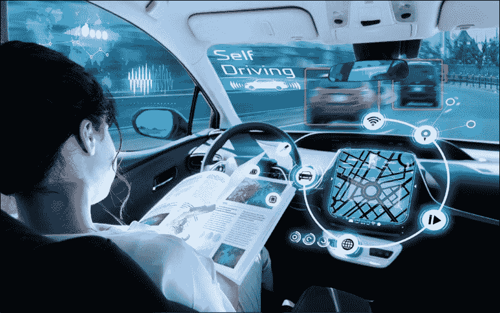

图 1.1:自动驾驶汽车的示例

让我们假设人类不疲劳或者我们有资源雇佣足够的轮班工人；机器学习还会有一席之地吗？当然会！有许多案例，报告的和未报告的，机器的表现与领域专家相当，甚至更好。由于算法是为了从基础事实中学习而设计的，而最好的深思熟虑的决定是由人类专家做出的，所以机器的表现可以和专家一样好。

事实上，即使是最好的专家也会犯错。通过利用个体专家的集体智慧，机器可以最大限度地减少做出错误决定的机会。一项主要研究表明，在诊断某些类型的癌症方面，机器比医生更好，这证明了这种哲学(https://www.nature.com/articles/d41586-020-00847-2)。**alpha go**([https://deep mind . com/research/case-studies/alpha go-the-story-total](https://deepmind.com/research/case-studies/alphago-the-story-so-far))可能是最著名的机器击败人类的例子。

此外，从经济和社会障碍的角度来看，部署学习机器比培训个人成为专家更具可扩展性。我们可以在一周内在全球范围内分发数千台诊断设备，但几乎不可能招募和分配同等数量的合格医生。

你可能会反驳这一点:如果我们有足够的资源和能力雇佣最好的领域专家，然后汇总他们的意见——机器学习还会有一席之地吗？可能不会(至少现在不会)——学习机器可能不会比最聪明的人类的共同努力表现得更好。然而，装备有学习机的个人可以胜过最好的专家组。这其实是一个新兴的概念，叫做**基于 AI 的辅助**或者 **AI 加人类智能**，其主张将机器和人类的努力结合起来。我们可以用下面的不等式来总结前面的陈述:

*人类+机器学习→最聪明不知疲倦的人类≥机器学习>人类*

涉及机器人的医疗操作是人类和机器学习协同的一个很好的例子。*图 1.2* 显示了手术室内外科医生旁边的机械臂:

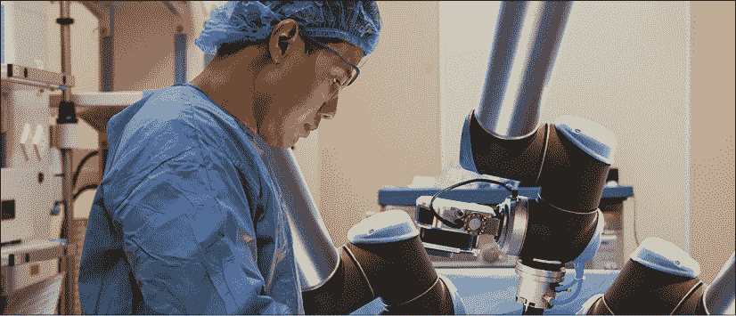

图 1.2:人工智能辅助手术

## 区分机器学习和自动化

那么，机器学习是否简单地等同于自动化涉及到手工或人工策划的规则集的编程和执行？一个流行的神话说，机器学习和自动化是一样的，因为它执行指导和重复的任务，并且不再思考。如果这个问题的答案是*是的*，为什么我们不能雇佣很多软件程序员，继续编写新规则或者扩展旧规则呢？

一个原因是，随着时间的推移，定义、维护和更新规则变得越来越昂贵。一个活动或事件的可能模式的数量可能是巨大的，因此，穷尽所有枚举实际上是不可行的。当涉及到动态的、不断变化的或实时发展的事件时，它变得更具挑战性。开发学习算法来命令计算机学习、提取模式，并从丰富的数据中自己解决问题，要容易得多，也更有效率。

机器学习与传统编程的区别见*图 1.3* :

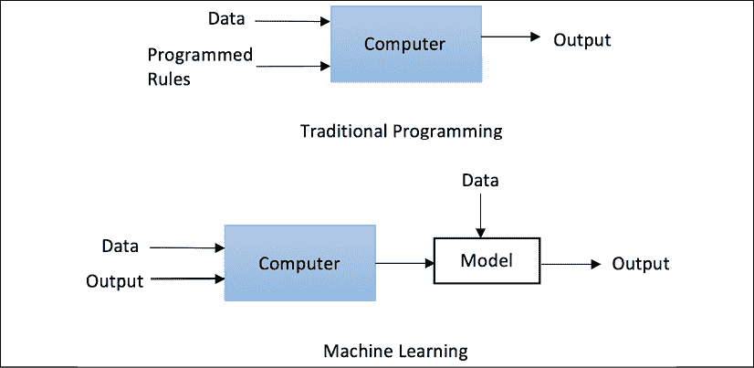

图 1.3:机器学习与传统编程的对比

在传统编程中，计算机遵循一组预定义的规则来处理输入数据并产生结果。在机器学习中，计算机试图模仿人类思维。它与输入数据、预期结果和环境进行交互，并导出由一个或多个数学模型表示的模式。这些模型随后被用于与未来的输入数据进行交互并生成结果。与自动化不同的是，机器学习环境中的计算机没有接收到明确且有指导意义的编码。

数据量呈指数级增长。如今，大量的文本、音频、图像和视频数据难以理解。**物联网** ( **物联网**)是一种新型互联网的最新发展，将日常设备互联。物联网将使来自家用电器和自动驾驶汽车的数据脱颖而出。这一趋势可能会继续，我们将有更多的数据生成和处理。除了数量之外，由于存储成本更低，过去几年中可用数据的质量一直在提高。这促进了机器学习算法和数据驱动解决方案的发展。

## 机器学习应用

电商公司阿里巴巴联合创始人马云在一次演讲中解释说，IT 是过去 20 年的重点，但未来 30 年，我们将处于**数据技术**(**DT**)([https://www . alizila . com/jack-Ma-不要害怕-更聪明-计算机/](https://www.alizila.com/jack-ma-dont-fear-smarter-computers/) )的时代。在信息技术时代，得益于计算机软件和基础设施，公司变得更大更强。现在，大多数行业的企业已经收集了大量数据，现在是利用数据挖掘来挖掘见解、导出模式和促进新业务增长的合适时机。广义而言，机器学习技术使企业能够更好地了解客户行为，与客户互动，并优化运营管理。

对于我们个人来说，机器学习技术已经让我们的生活一天比一天好。我们都很熟悉的机器学习的一个应用是垃圾邮件过滤。另一个是在线广告，根据广告商收集的关于我们的信息自动提供广告。请继续关注接下来的几章，在这里您将学习如何开发算法来解决这两个问题以及更多。

搜索引擎是机器学习的应用，没有它我们无法想象生活。它涉及信息检索，解析我们寻找的内容，查询相关的顶级记录，并应用上下文排名和个性化排名，根据主题相关性和用户偏好对页面进行排序。电子商务和媒体公司一直走在使用推荐系统的前列，这有助于客户更快地找到产品、服务和文章。

机器学习的应用是无限的，我们每天都在听到新的例子:信用卡欺诈检测、总统选举预测、即时语音翻译和 robo advisors——随便你怎么说！

在 1983 年的战争游戏电影中，一台电脑做出了可能导致第三次世界大战的生死抉择。据我们所知，当时的技术还不能完成这样的壮举。然而，在 1997 年，深蓝超级计算机确实击败了一位世界象棋冠军。2005 年，一辆斯坦福自动驾驶汽车在沙漠中独自行驶了 130 多英里。2007 年，另一个团队的汽车在正常的城市交通中行驶了 60 多英里(https://en . Wikipedia . org/wiki/DARPA _ Grand _ Challenge _(2007))。2011 年，沃森电脑在与人类对手(https://en . Wikipedia . org/wiki/Watson _(computer))的较量中胜出。如前所述，AlphaGo 计划在 2016 年击败了世界上最好的 Go 玩家之一。如果我们假设计算机硬件是限制因素，那么我们可以尝试推断未来。一位著名的美国发明家和未来学家雷·库兹韦尔(Ray Kurzweil)就做到了这一点，根据他的说法，我们可以预计人类水平的智能将在 2029 年左右出现。下一步是什么？

迫不及待地展开自己的机器学习之旅？让我们从先决条件和机器学习的基本类型开始。

# 了解先决条件

模仿人类智能的机器学习是人工智能的一个分支，人工智能是计算机科学中与创建系统相关的一个领域。软件工程是计算机科学的另一个领域。一般来说，我们可以把 Python 编程称为一种软件工程。机器学习也与线性代数、概率论、统计学和数学优化密切相关。我们通常基于统计学、概率论和线性代数建立机器学习模型，然后使用数学优化来优化模型。

阅读这本书的大多数人应该对 Python 编程有一个好的，或者至少是足够的了解。那些对数学知识不自信的人可能想知道应该花多少时间学习或复习上述科目。不要惊慌:在这本书里，我们将让机器学习为我们工作，而不涉及任何数学细节。它只需要一些概率论和线性代数的基础 101 知识，这有助于我们理解机器学习技术和算法的机制。这变得更加容易，因为我们将从零开始构建模型，并使用我们喜欢和熟悉的 Python 语言的流行包。

对于想学习或温习概率论和线性代数的同学，可以随意搜索基础概率论和基础线性代数。网上有很多资源，比如关于概率 101 的[https://people.ucsc.edu/~abrsvn/intro_prob_1.pdf](https://people.ucsc.edu/~abrsvn/intro_prob_1.pdf)，关于基础线性代数的[http://www.maths.gla.ac.uk/~ajb/dvi-ps/2w-notes.pdf](http://www.maths.gla.ac.uk/~ajb/dvi-ps/2w-notes.pdf)。

那些想系统学习机器学习的人可以报读计算机科学、 **AI** ，以及最近的数据科学硕士项目。还有各种数据科学训练营。然而，新兵训练营的选择通常更严格，因为他们更注重工作，而且项目持续时间通常很短，从 4 周到 10 周不等。另一个选择是免费的**大规模开放在线课程** ( **MOOCs** )，这是吴恩达流行的机器学习课程。最后但同样重要的是，行业博客和网站是我们跟上最新发展的绝佳资源。

机器学习不仅是一项技能，也是一项运动。我们可以参加几个机器学习比赛，比如卡格尔([www.kaggle.com](http://www.kaggle.com))——有时是为了体面的现金奖励，有时是为了欢乐，大多数时候是为了发挥自己的长处。然而，为了赢得这些竞争，我们可能需要利用某些技术，这些技术只在竞争的环境中有用，而不是在试图解决业务问题的环境中有用。没错没错，**没有免费午餐**定理([https://en.wikipedia.org/wiki/No_free_lunch_theorem](https://en.wikipedia.org/wiki/No_free_lunch_theorem))适用于此。

接下来，我们将看看机器学习的三种类型。

# 开始学习三种机器学习

机器学习系统被输入数据——可以是数字的、文本的、视觉的或视听的。系统通常有一个输出——这可以是一个浮点数，例如自动驾驶汽车的加速度，也可以是一个整数，代表一个类别(也称为**类**，例如图像识别中的猫或老虎)。

机器学习的主要任务是探索和构建能够从历史数据中学习并对新的输入数据做出预测的算法。对于数据驱动的解决方案，我们需要定义(或让它由算法定义)一个名为**损失**或**成本函数**的评估函数，该函数衡量模型的学习程度。在这个设置中，我们创建了一个优化问题，目标是以最有效的方式学习。

根据学习数据的性质，机器学习任务可以大致分为以下三类:

*   **无监督学习**:当的学习数据只包含的指示信号，没有任何附加的描述时，就要靠我们自己去发现下面数据的结构，去发现隐藏的信息，或者决定如何描述数据。这种学习数据称为**无标签**数据。无监督学习可用于检测异常情况，如欺诈或有缺陷的设备，或为营销活动将具有类似在线行为的客户分组。使数据更容易理解的数据可视化和从有噪声的数据中提取相关信息的降维也属于无监督学习的范畴。
*   **监督学习**:当学习数据除了指示信号之外，还带有描述、目标或期望输出时，学习目标是找到将输入映射到输出的一般规则。这种学习数据叫做**标注**数据。学习到的规则然后被用来用未知输出标记新数据。标签通常由事件记录系统提供或由人类专家评估。此外，如果可行的话，它们也可以由人工评分员制作，例如通过众包。监督学习通常用于日常应用，例如人脸和语音识别、产品或电影推荐、销售预测和垃圾邮件检测。
*   **强化学习**:学习数据提供反馈，使系统适应动态条件，最终达到某个目标。系统根据反馈响应评估其性能，并做出相应的反应。最著名的例子包括工业自动化机器人、自动驾驶汽车和象棋大师阿尔法戈。强化学习和监督学习的关键区别在于与环境的交互。

下图描述了机器学习任务的类型:

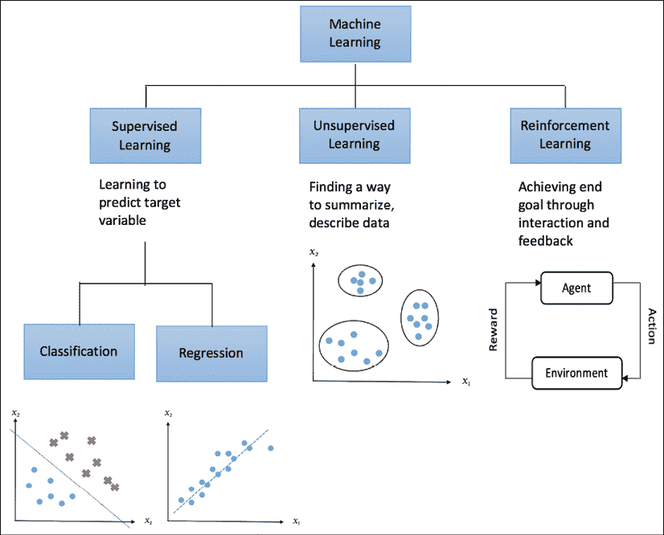

图 1.4:机器学习任务的类型

如图所示，我们可以将监督学习进一步细分为回归和分类。**回归**训练并预测连续值响应，例如预测房价，而**分类**试图找到合适的类别标签，例如分析积极/消极情绪并预测贷款违约。

如果不是所有的学习样本都贴了标签，但是有的贴了标签，那么我们就会有**半监督** **学习**。这个除了少量的标记数据之外，还利用未标记的数据(通常是大量的)进行训练。半监督学习应用于获取完全标注数据集成本较高，标注小子集更为实用的情况。例如，通常需要熟练的专家来标记高光谱遥感图像，而获取未标记的数据相对容易。

对抽象的概念感到有点困惑？别担心。在本书的后面，我们将会遇到许多这类机器学习任务的具体例子。例如在*第二章*、*用朴素贝叶斯*构建电影推荐引擎，我们将深入研究监督学习分类及其流行算法和应用。同样的，在*第七章*、*用回归*预测股价，我们将探讨监督学习回归。我们将在*第 9 章*、*中重点介绍无监督技术和算法，用文本分析技术*挖掘 20 个新闻组数据集。最后但同样重要的是，第三个机器学习任务，强化学习，将在*第 14 章*、*利用强化学习在复杂环境中做出决策*中介绍。

除了根据学习任务对机器学习进行分类，我们还可以按时间顺序对其进行分类。

## 机器学习算法发展简史

事实上，我们有一个完整的机器学习算法动物园，随着时间的推移，它经历了不同的流行。我们可以将它们大致分为四种主要方法:基于逻辑的学习、统计学习、人工神经网络和遗传算法。

基于逻辑的系统首先占据主导地位。他们使用人类专家指定的基本规则，通过这些规则，系统试图使用形式逻辑、背景知识和假设进行推理。**统计学习**理论试图找到一个函数来形式化变量之间的关系。20 世纪 80 年代中期，**人工神经网络**(**ann**)脱颖而出，直到 90 年代才被统计学习系统推到一边。人工神经网络模仿动物大脑，由相互连接的神经元组成，这些神经元也是对生物神经元的模仿。他们试图模拟输入和输出值之间的复杂关系，并捕捉数据中的模式。**遗传算法** ( **GA** )在上世纪 90 年代风靡一时。他们模仿生物的进化过程，试图用变异、交叉等方法寻找最优解。

我们目前在深度学习方面看到了一场革命，我们可能会考虑神经网络的重塑。深度学习一词是在 2006 年左右创造的，指的是具有多层的深度神经网络。深度学习的突破是**图形处理单元** ( **图形处理器**)的集成和利用的结果，这大大加快了计算速度。

GPU 最初是为了渲染视频游戏而开发的，在并行矩阵和向量代数方面非常出色。人们认为深度学习类似于人类的学习方式。因此，它可能能够兑现有感知能力的机器的承诺。当然，在本书中，我们将在*第 12 章*、*用卷积神经网络*对服装图像进行分类，以及*第 13 章*、*用循环神经网络*对序列进行预测中，在*第 8 章*、*用人工神经网络*对股价进行预测后，深入挖掘深度学习。

我们中的一些人可能听说过摩尔定律——一个声称计算机硬件随着时间呈指数增长的经验观察。这项法律最早是由英特尔的联合创始人戈登·摩尔在 1965 年制定的。根据法律，芯片上的晶体管数量应该每两年翻一番。在下图中，您可以看到该定律很好地成立(气泡的大小对应于图形处理器中的平均晶体管数量):

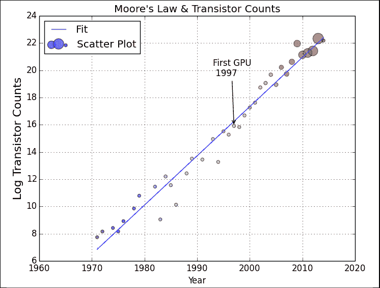

图 1.5:过去几十年的晶体管数量

共识似乎是摩尔定律应该在几十年内继续有效。这使得雷·库兹韦尔关于到 2029 年实现真正的机器智能的预测有了一定的可信度。

# 挖掘机器学习的核心

在讨论了机器学习算法的分类之后，我们将挖掘机器学习的核心——用数据进行概括，不同的概括级别，以及达到正确概括级别的方法。

## 用数据概括

数据的好处是世界上有很多数据。糟糕的是，很难处理这些数据。挑战来自数据的多样性和噪音。我们人类通常处理进入我们耳朵和眼睛的数据。这些输入被转换成电信号或化学信号。在非常基本的层面上，计算机和机器人也用电信号工作。这些电信号然后被转换成 1 和 0。然而，在这本书里，我们用 Python 编程，在那个层次上，我们通常将数据表示为数字、图像或文本。实际上，图像和文本不是很方便，所以我们需要将图像和文本转换成数值。

尤其是在监督学习的背景下，我们有一个类似于为考试而学习的场景。我们有一套练习题和实际考试。我们应该能够在不知道答案的情况下回答考试问题。这被称为**概括**——我们从练习题中学习一些东西，并且希望能够将这些知识应用到其他类似的问题中。在机器学习中，这些练习题被称为**训练集**或**训练样本**。这就是机器学习模型衍生模式的地方。而实际考试是**测试套**或**测试样品**。它们是模型最终适用的地方。学习效果通过学习模型和测试的兼容性来衡量。有时，在练习题和实际考试之间，我们有模拟考试来评估我们在实际考试中的表现，并帮助复习。这些模拟考试在机器学习中被称为验证集或**验证样本**。它们帮助我们验证模型在模拟环境中的表现，然后我们相应地微调模型以获得更高的点击率。

例如，一个老式的程序员会和一个商业分析师或其他专家交谈，然后实施一个税收规则，将某个值乘以另一个相应的值。在机器学习环境中，我们可以给计算机一堆输入输出的例子；或者，如果我们想更有野心，我们可以把实际的税收文本输入程序。我们可以让机器消耗数据，并计算出税收规则，就像自动驾驶汽车不需要大量明确的人工输入一样。

在物理上，我们几乎有同样的情况。我们想知道宇宙是如何运作的，并用数学语言表述规律。由于我们不知道实际的功能，我们所能做的就是测量产生的误差，并尽量减少它。在监督学习任务中，我们将结果与期望值进行比较。在无监督学习中，我们用相关的度量标准来衡量我们的成功。例如，我们希望数据集群被很好地定义；度量可以是一个集群内的数据点有多相似，以及两个集群的数据点有多不同。在强化学习中，程序评估其移动，例如，在国际象棋游戏中使用预定义的函数。

除了用数据进行正确的泛化之外，还可以有两个层次的泛化，过拟合和欠拟合，我们将在下一节进行探讨。

## 过拟合、欠拟合和偏差方差权衡

让我们详细看看这两个层次，并探讨偏差-方差权衡。

### 过度拟合

达到合适的模型是机器学习任务的目标。如果模型过度膨胀怎么办？**过度拟合**意味着模型非常适合现有观测**但无法预测未来的新观测。让我们看看下面的类比。**

 **如果我们为了一次考试而经历了许多练习题，我们可能会开始想办法回答与主题材料无关的问题。比如只给 5 道练习题，我们可能会发现，如果一道题中出现两次*土豆*，一次*西红柿*，三次*香蕉*，答案总是 *A* ，如果一道题中出现一次*土豆*，三次*西红柿*，两次*香蕉*，答案总是 *B* 。然后，我们可以得出结论，这总是正确的，并在以后应用这样的理论，即使主题或答案可能与土豆、西红柿或香蕉无关。或者，更糟糕的是，我们可能一字不差地记住每个问题的答案。然后我们会在练习题上得高分，这让我们希望实际考试中的问题和练习题是一样的。然而，在现实中，我们会在考试问题上得分很低，因为在考试中很少出现完全相同的问题。

记忆现象会导致过度拟合。当我们过度从训练集中提取太多信息并使我们的模型与它们很好地配合时，这种情况就会发生，这在机器学习中被称为**低偏差**。如果你需要快速回顾一下偏差，这里是:**偏差**是平均预测和真实值之间的差。其计算如下:


这里， *ŷ* 是预测。然而，与此同时，过度拟合并不能帮助我们归纳出新的数据并从中得出真正的模式。因此，该模型在以前从未见过的数据集上表现不佳。这种情况我们在机器学习中称之为**高方差**。再次，快速回顾一下方差:*方差*衡量预测的范围，即预测的可变性。它可以计算如下:


以下示例演示了过度拟合的典型实例，其中回归曲线试图完美地容纳所有观察到的样本:

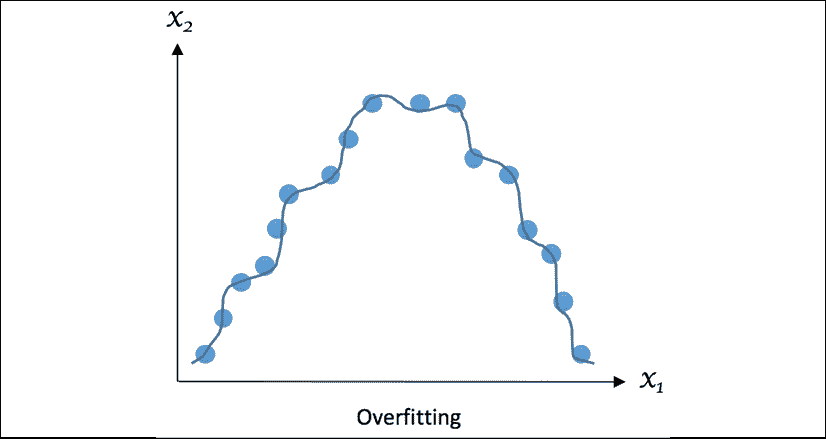

图 1.6:过拟合的例子

当我们试图基于相对于少量观测值的太多参数而不是底层关系来描述学习规则时，就会出现过拟合，比如前面的土豆和番茄的例子，我们只从五个学习样本中推导出三个参数。当我们使模型过于复杂，以至于它适合每个训练样本时，也会发生过度拟合，例如记忆所有问题的答案，如前所述。

### 装配不足

相反的情况是**下压**。当模型不足时，它在训练集上表现不好，在测试集上也不会表现好，这意味着它无法捕捉数据的潜在趋势。如果我们没有使用足够的数据来训练模型，可能会出现拟合不足，就像如果我们没有复习足够的材料，我们会考试不及格一样；如果我们试图用错误的模型来拟合数据，这种情况也可能发生，就像如果我们采取错误的方法，以错误的方式学习，我们在任何练习或考试中都会得低分一样。我们称这些情况中的任何一种为机器学习中的高**偏差**；尽管它的方差很低，因为训练集和测试集中的表现相当一致，但方式很糟糕。

以下示例显示了典型的欠拟合是什么样子，其中回归曲线没有足够好地拟合数据或捕捉到足够多的数据底层模式:

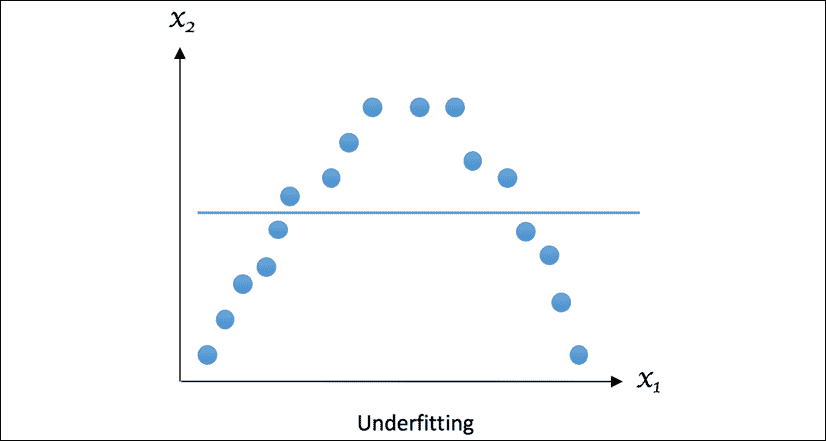

图 1.7:装配不足的例子

现在，让我们看看一个合适的例子应该是什么样子:

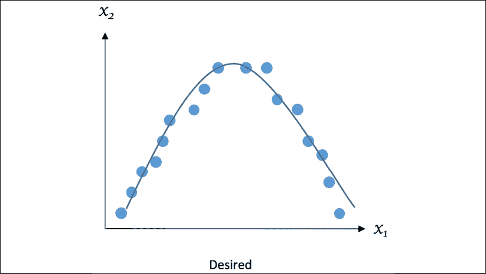

图 1.8:所需配件的示例

### 偏差-方差权衡

显然，我们希望避免过度拟合和欠拟合。回想一下**偏差**是学习算法中不正确假设产生的误差；高偏置导致欠拟合。**方差**测量模型预测对数据集变化的敏感度。因此，我们需要避免偏差或方差变高的情况。那么，这是否意味着我们应该始终尽可能降低偏差和方差？如果可以的话，答案是肯定的。但是，在实践中，它们之间有一个明显的权衡，其中减少一个增加另一个。这就是所谓的**偏差-方差权衡**。听起来很抽象？让我们看下一个例子。

假设我们被要求建立一个模型，根据电话民意调查数据预测候选人成为美国下一任总统的概率。投票是使用邮政编码进行的。我们从一个邮政编码中随机选择样本，我们估计候选人获胜的可能性为 61%。然而，事实证明他在选举中失败了。我们的模式哪里出错了？我们首先想到的是只有一个邮政编码的小样本。这也是高偏差的一个来源，因为一个地理区域的人们倾向于共享相似的人口统计数据，尽管这导致估计的低方差。那么，我们能简单地通过使用大量邮政编码的样本来修复它吗？是的，但是不要这么早就高兴。这可能同时导致估计值的方差增加。我们需要找到最佳的样本量——实现最低总体偏差和方差的最佳邮政编码数量。

最小化模型的总误差需要仔细平衡偏差和方差。给定一组训练样本， *x* <sub xmlns:epub="http://www.idpf.org/2007/ops" class="Subscript--PACKT-">1</sub> ，*x*T7】2，…， *x* <sub xmlns:epub="http://www.idpf.org/2007/ops" class="" style="font-style: italic;">n</sub> ，以及它们的目标， *y* <sub xmlns:epub="http://www.idpf.org/2007/ops" class="Subscript--PACKT-">1</sub> ， *y* <sub xmlns:epub="http://www.idpf.org/2007/ops" class="Subscript--PACKT-">2</sub> ，…，*y*t23】n，我们要找到一个回归函数【T25 我们用**均方误差** ( **均方误差**)来衡量估计误差，回归模型有多好(或多差):


*E* 表示期望。这个误差可以按照解析推导分解为偏差和方差分量，如下式所示(虽然需要一点基础概率论才能理解):

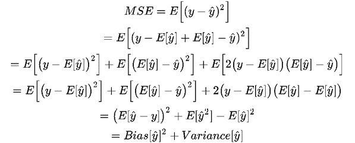

*偏差*项测量估计的误差，而*方差*项描述估计值 *ŷ* 围绕其平均值*e[ŷ】*移动的程度。学习模型 *ŷ(x)* 越复杂，训练样本越大，偏差越小。然而，这也将产生更多向模型的转移，以便更好地适应增加的数据点。因此，差异将被解除。

我们通常采用交叉验证技术以及正则化和特征约简来找到平衡偏差和方差的最优模型，并减少过拟合。接下来我们将讨论这些。

你可能会问，为什么我们只想要解决过度装配:装配不足怎么办？这是因为欠拟合很容易识别:只要模型在训练集上运行不佳，就会出现欠拟合。我们需要找到一个更好的模型或调整一些参数来更好地拟合数据，这在任何情况下都是必须的。另一方面，过拟合很难发现。通常，当我们实现了一个在训练集上表现良好的模型时，我们会过于高兴，认为它马上就可以投入生产了。这可能非常危险。相反，我们应该采取额外的步骤来确保出色的性能不是由于过度拟合造成的，出色的性能适用于除训练数据之外的数据。

## 避免交叉验证的过度拟合

作为的温柔提醒，本书后面会多次看到交叉验证在行动。因此，如果你发现这一部分很难理解，不要惊慌，因为你很快就会成为这方面的专家。

回想一下，在练习题和实际考试之间，有模拟考试，我们可以评估自己在实际考试中的表现，并利用这些信息进行必要的复习。在机器学习中，验证过程有助于评估模型如何在模拟环境中推广到独立或不可见的数据集。在传统的验证设置中，原始数据被分成三个子集，通常 60%用于训练集，20%用于验证集，其余的(20%)用于测试集。如果我们在划分后有足够的训练样本，并且我们只需要模拟性能的粗略估计，那么这个设置就足够了。否则，交叉验证更可取。

在一轮交叉验证中，原始数据分为两个子集，分别用于**训练**和**测试**(或**验证**)。记录测试性能。类似地，在不同的分区下执行多轮交叉验证。最终对所有轮次的测试结果进行平均，以生成更可靠的模型预测性能估计。交叉验证有助于减少可变性，从而限制过度拟合。

当训练规模非常大时，将其分为训练、验证和测试(三个子集)并对后两者进行性能检查就足够了。在这种情况下，交叉验证不太可取，因为为每一轮训练一个模型需要很高的计算成本。但是如果你负担得起，没有理由不使用交叉验证。当规模不是那么大的时候，交叉验证绝对是一个不错的选择。

主要有两种正在使用的交叉验证方案:穷举和非穷举。在**穷举方案**中，我们省略了每轮中固定数量的观测值作为测试(或验证)样本，并将剩余的观测值用作训练样本。重复这一过程，直到所有可能的不同样本子集都用于测试一次。例如，我们可以应用**留一-排除-交叉验证** ( **LOOCV** )，其让每个样本在测试组中出现一次。对于大小为 *n* 的数据集，LOOCV 需要 *n* 轮交叉验证。当 *n* 变大时，这可能会很慢。下图展示了 LOOCV 的工作流程:


图 1.9:留一出交叉验证的工作流程

另一方面，**非穷举方案**顾名思义，并没有尝试所有可能的分区。这种方案最广泛使用的类型是 **k 倍交叉验证**。我们先将原始数据随机拆分成 **k 个大小相等的**折。在每次试验中，这些折叠中的一个成为测试集，其余的数据成为训练集。

我们重复这个过程 *k* 次，每个折叠是一次指定的测试集。最后，我们对 *k* 组测试结果进行平均，以便进行评估。 *k* 的常用值是 3、5 和 10。下表说明了五重设置:

<colgroup><col> <col> <col> <col> <col> <col></colgroup> 
| 轮次 | 折叠 1 | 折叠 2 | 折叠 3 | 折叠 4 | 折叠 5 |
| one | **测试** | 培养 | 培养 | 培养 | 培养 |
| Two | 培养 | **测试** | 培养 | 培养 | 培养 |
| three | 培养 | 培养 | **测试** | 培养 | 培养 |
| four | 培养 | 培养 | 培养 | **测试** | 培养 |
| five | 培养 | 培养 | 培养 | 培养 | **测试** |

表 1.1:5 重交叉验证的设置

与 LOOCV 相比，k 倍交叉验证的方差通常较低，因为我们使用的是大量样本，而不是单一样本进行验证。

我们还可以多次将数据随机分成训练集和测试集。这在形式上被称为**坚守**法。这种算法的问题是，有些样本可能永远不会出现在测试集中，而有些样本可能会在测试集中被多次选择。

最后但同样重要的是，**嵌套交叉验证**是交叉验证的组合。它包括以下两个阶段:

*   **内部交叉验证**:这个阶段是为了寻找最佳匹配，可以作为 *k* 折叠交叉验证来实现
*   **外部交叉验证**:此阶段用于绩效评估和统计分析

我们将在整本书中非常密集地应用交叉验证。在此之前，接下来让我们用一个类比来看看交叉验证，这将有助于我们更好地理解它。

一位数据科学家计划开车上班，他的目标是每天早上 9 点前到达。他需要决定出发时间和路线。他在某些周一、周二和周三尝试这两个参数的不同组合，并记录每次尝试的到达时间。然后他想出最好的时间表，并每天应用它。然而，它并不像预期的那样运行良好。

事实证明，调度**模型**对前三天收集的数据点过度填充，可能在周四和周五效果不佳。更好的解决方案是在周四和周五测试从周一到周三得出的参数的最佳组合，并基于一周中不同的学习日和测试日重复这个过程。这种类比的交叉验证确保了所选的时间表在整个星期都有效。

总之，交叉验证通过结合对不同数据子集的预测性能度量，得出了更准确的模型性能评估。这种技术不仅减少了方差，避免了过拟合，而且还提供了模型在实践中的一般表现。

## 利用正则化避免过度拟合

另一种防止过度拟合的方法是**正则化**。回想一下模型不必要的复杂性是过度拟合的一个来源。正则化给我们试图最小化的误差函数增加了额外的参数，以便惩罚复杂的模型。

根据奥卡姆剃刀原理，更简单的方法更受青睐。威廉·奥康是一位僧侣和哲学家，大约在 1320 年，他提出了一个想法，即最简单的符合数据的假设应该是首选。一个理由是，我们可以发明比复杂模型更少的简单模型。例如，直觉上，我们知道高多项式模型比线性模型多。原因是一条线( *y* = *ax* + *b* )只受两个参数控制——截距 *b* 和斜率 *a* 。一条线的可能系数跨越二维空间。二次多项式为二次项增加了一个额外的系数，我们可以用这些系数跨越一个三维空间。因此，用**高阶多项式函数**更容易找到完美捕捉所有训练数据点的模型，因为它的搜索空间比线性函数大得多。然而，这些容易获得的模型比线性模型泛化能力差，线性模型更容易过度拟合。当然，更简单的模型需要更少的计算时间。下图显示了我们如何分别尝试将线性函数和高阶多项式函数拟合到数据中:

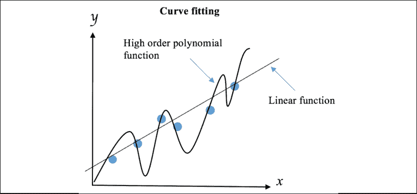

图 1.10:用线性函数和多项式函数拟合数据

线性模型更可取，因为它可以更好地推广到从基础分布中提取的更多数据点。我们可以使用正则化通过对高阶多项式施加惩罚来减少它们的影响。这将抑制复杂性，即使从训练数据中学习到不太精确和不太严格的规则。

从*第 5 章*、*开始，我们将经常使用正则化来用逻辑回归*预测在线广告点击率。现在，让我们来看一个可以帮助您更好地理解正则化的类比。

一位数据科学家想让他的机器看门狗具备识别陌生人和朋友的能力。他提供了以下学习样本:

<colgroup><col> <col> <col> <col> <col> <col></colgroup> 
| 男性的 | 年纪轻的 | 高的 | 带着眼镜 | 灰色 | 朋友 |
| 女性的 | 中间 | 平均的 | 不戴眼镜 | 黑色 | 陌生人 |
| 男性的 | 年纪轻的 | 短的 | 带着眼镜 | 白 | 朋友 |
| 男性的 | 年长的 | 短的 | 不戴眼镜 | 黑色 | 陌生人 |
| 女性的 | 年纪轻的 | 平均的 | 带着眼镜 | 白 | 朋友 |
| 男性的 | 年纪轻的 | 短的 | 不戴眼镜 | 穿红衣 | 朋友 |

表 1.2:机器人看门狗的训练样本

机器人可以快速学习以下规则:

*   任何一个中等身材，不戴眼镜，穿着黑色衣服的中年女性都是陌生人
*   任何不戴眼镜、穿黑色衣服的高级矮个子男性都是陌生人
*   其他人都是他的朋友

虽然这些完全符合训练数据，但它们似乎过于复杂，不太可能很好地推广给新访客。相比之下，数据科学家限制了学习方面。一个宽松的规则可以很好地适用于数百名其他游客，它可能是这样的:任何不戴眼镜穿黑色衣服的人都是陌生人。

除了惩罚复杂性之外，我们还可以尽早停止培训程序，作为一种正规化的形式。如果我们限制模型学习的时间，或者我们设置一些内部停止标准，它更有可能产生一个更简单的模型。模型的复杂性将以这种方式控制，因此，过拟合变得不太可能。这种方法在机器学习中被称为**提前停止**。

最后但同样重要的是，值得注意的是，正则化应该保持在一个中等水平，或者更准确地说，微调到一个最佳水平。太小的正则化不会产生任何影响；太大的正则化将导致拟合不足，因为它会使模型偏离基本事实。我们将在*第 5 章*、*用逻辑回归预测在线广告点击率*、*第 7 章*、*用回归算法预测股价*、*第 8 章*、*用人工神经网络预测股价*中探讨如何实现最优正则化。

## 通过特征选择和降维避免过度拟合

我们通常将数据表示为数字网格(一个**矩阵**)。每一列代表一个变量，我们称之为机器学习中的**特征**。在监督学习中，变量之一实际上不是特征，而是我们试图预测的标签。在监督学习中，每一行都是我们可以用来训练或测试的例子。

特征的数量对应于数据的维度。我们的机器学习方法取决于维度的数量与示例的数量。例如，文本和图像数据的维度非常高，而股市数据的维度相对较少。

拟合高维数据在计算上很昂贵，并且由于高复杂性而容易过度拟合。更高的维度也不可能可视化，因此我们不能使用简单的诊断方法。

不是所有的特征都有用，它们可能只会给我们的结果增加随机性。因此，做好特征选择通常很重要。**特征选择**是挑选重要特征子集的过程，用于更好的模型构建。实际上，并非数据集中的每一个特征都携带了对鉴别样本有用的信息；有些功能要么是冗余的，要么是不相关的，因此可以很少损失地丢弃。

原则上，特征选择归结为关于是否包括特征的多个二元决策。对于 *n* 个特征，我们得到 *2* <sup class="" style="font-style: italic;">n</sup> 个特征集，对于大量的特征来说，这可能是一个非常大的数目。例如，对于 10 个特征，我们有 1，024 个可能的特征集(例如，如果我们决定穿什么衣服，特征可以是温度、雨、天气预报和我们要去哪里)。基本上，我们有两个选择:要么从所有的特征开始，迭代地移除特征，要么从最小的特征集开始，迭代地添加特征。然后，我们为每次迭代获取最佳特征集并进行比较。在某一点上，暴力评估变得不可行。因此，发明了更先进的特征选择算法来提取最有用的特征/信号。我们将在*第 5 章*、*中详细讨论如何使用逻辑回归*预测在线广告点击率。

另一种常见的降维方法是将高维数据转换为低维空间。这被称为**降维**或**特征投影**。我们将在*第 9 章*、*利用文本分析技术挖掘 20 个新闻组数据集*、*第 10 章*、*利用聚类和主题建模发现新闻组数据集中的底层主题*、*第 11 章*、*机器学习最佳实践*中对此进行详细介绍。

在本节中，我们已经讨论了机器学习的目标是如何找到对数据的最佳泛化，以及如何避免不良泛化。在接下来的两个部分中，我们将探索在机器学习的各个阶段更接近目标的技巧，包括下一部分的数据预处理和特征工程，以及之后的建模。

# 数据预处理和特征工程

**数据挖掘**，90 年代的流行语，是数据科学(数据的科学)的前身。数据挖掘社区中流行的一种方法被称为**跨行业数据挖掘标准流程**(**CRISP-DM**)([https://en . Wikipedia . org/wiki/跨行业 _ 标准 _ 流程 _for_data_mining](https://en.wikipedia.org/wiki/Cross-industry_standard_process_for_data_mining) )。CRISP-DM 创建于 1996 年，机器学习基本继承了其阶段和总体框架。

CRISP-DM 由以下阶段组成，这些阶段并不相互排斥，可以并行发生:

*   **业务理解**:这个阶段经常由专门的领域专家负责。通常情况下，我们让一个商人来制定一个商业问题，比如销售某个产品的更多单元。
*   **数据理解**:这也是可能需要领域专家输入的阶段；然而，通常技术专家需要参与的不仅仅是业务理解阶段。领域专家可能精通电子表格程序，但对复杂的数据有困难。在这本机器学习书中，通常将称为**探索阶段**。
*   **数据准备**:这个也是一个只有微软 Excel 知识的领域专家未必能帮到你的阶段。这是我们创建训练和测试数据集的阶段。在这本书中，它通常被称为**预处理阶段**。
*   **建模**:这是大多数人联想到机器学习的阶段。在这个阶段，我们制定一个模型，并拟合我们的数据。
*   **评估**:在这个阶段，我们评估模型与数据的吻合程度，以检查我们是否能够解决我们的业务问题。
*   **部署**:这个阶段通常包括在生产环境中设置系统(拥有一个单独的生产系统被认为是好的做法)。通常，这是由专门的团队完成的。

我们将在这一节首先介绍预处理阶段。

## 预处理和探索

当我们学习时，我们需要高质量的学习材料。我们不能从胡言乱语中学习，所以我们会自动忽略任何没有意义的东西。机器学习系统不能识别乱码，所以我们需要通过清理输入数据来帮助它。人们常说，清理数据是机器学习的一大部分。有时候，清洁已经为我们完成了，但你不应该指望它。

要决定如何清理数据，我们需要熟悉数据。有一些项目试图自动探索数据，并做一些智能的事情，例如生成报告。目前，不幸的是，我们总体上没有一个坚实的解决方案，所以你需要做一些工作。

我们可以做两件不互相排斥的事情:第一，扫描数据，第二，可视化数据。这也取决于我们处理的数据类型——我们是否有一个由数字、图像、音频、文本或其他东西组成的网格。

最后，数字网格是最方便的形式，我们将一直致力于拥有数字特征。让我们假设在这一部分的剩余部分有一个数字表。

我们想知道特征是否有缺失值，这些值是如何分布的，我们有什么类型的特征。值可以近似遵循正态分布、二项式分布、泊松分布或其他分布。特征可以是二元的:是或否，正或负，以此类推。它们也可以是绝对的:属于一个类别，例如，大陆(非洲、亚洲、欧洲、南美、北美等等)。分类变量也可以排序，例如，高、中、低。特征也可以是定量的，例如，以度为单位的温度或以美元为单位的价格。现在，让我来谈谈我们如何应对这些情况。

## 处理缺失值

我们经常错过某些特征的值。这可能会因为各种原因而发生。它可能不方便，昂贵，甚至不可能总是有价值。也许我们过去无法测量某个数量，是因为我们没有合适的设备，或者只是不知道这个特性是相关的。然而，我们被过去缺失的价值观所困。

有时，很容易发现我们缺少值，我们可以通过扫描数据或计算某个特性的值的数量，并将该数字与基于行数的预期值的数量进行比较来发现这一点。某些系统使用例如 999，999 或-1 等值对缺失值进行编码。如果有效值远小于 999，999，这是有意义的。如果你幸运的话，你将会得到关于以数据字典或元数据的形式创建数据的人所提供的特性的信息。

一旦我们知道我们缺少价值观，问题就来了，如何处理它们。最简单的答案就是无视他们。然而，有些算法无法处理缺失的值，程序只会拒绝继续。在其他情况下，忽略缺失值会导致结果不准确。第二种解决方案是用一个固定值替换缺失值——这被称为**输入**。我们可以估算某个特征有效值的算术平均值****中值**或**模式**。理想情况下，我们会对某种可靠的变量有一些先验知识。例如，我们可能知道某一地点的季节性平均温度，并能够推测某一日期缺少的温度值。我们将在*第 11 章*、*机器学习最佳实践*中详细讨论缺失数据的处理。同样，以下章节中的技巧将在后面的章节中讨论和运用，以防你感到失落。**

 **## 标签编码

人类能够应对各种类型的价值观。机器学习算法(有一些例外)需要数值。如果我们提供像`Ivan`这样的字符串，除非我们使用专门的软件，否则程序不知道该做什么。在这个例子中，我们处理的是一个分类特征——可能是名字。我们可以将每个唯一的值视为一个标签。(在这个特殊的例子中，我们还需要决定如何处理这个案例——`Ivan`和`ivan`一样吗？).然后，我们可以用一个整数来替换每个标签— **标签编码**。

以下示例显示了标签编码的工作原理:

<colgroup><col> <col></colgroup> 
| 标签 | 编码标签 |
| 非洲 | one |
| 亚洲 | Two |
| 欧洲 | three |
| 南美。参见 AMERICA | four |
| 北美洲 | five |
| 其他的 | six |

表 1.3:标签编码示例

在某些情况下，这种方法可能会有问题，因为学习者可能会得出有顺序的结论(除非是预期的，例如，*坏=0* ，*好=1* ，*好=2* ，*好=3* )。在前一个映射表中，前一种情况下的`Asia`和`North America`编码后相差`4`，这有点反直觉，因为很难量化。下一节中的一次性编码采用了另一种方法。

## 一次性编码

**一对 K** 或**一热编码**方案使用虚拟变量对分类特征进行编码。最初，它应用于数字电路。虚拟变量有二进制值，如位，因此它们取值 0 或 1(相当于真或假)。例如，如果我们想对大陆进行编码，我们会有虚拟变量，例如`is_asia`，如果大陆是`Asia`则为真，否则为假。一般来说，我们需要的虚拟变量和唯一标签减去 1 的数量一样多。我们可以从虚拟变量中自动确定一个标签，因为虚拟变量是排他的。

如果虚拟变量都有一个假值，那么正确的标签就是我们没有虚拟变量的标签。下表说明了各大洲的编码:

<colgroup><col> <col> <col> <col> <col> <col></colgroup> 
| 标签 | Is _ 非洲 | Is_asia | Is _ 欧洲 | Is_sam | Is_nam |
| 非洲 | one | Zero | Zero | Zero | Zero |
| 亚洲 | Zero | one | Zero | Zero | Zero |
| 欧洲 | Zero | Zero | one | Zero | Zero |
| 南美。参见 AMERICA | Zero | Zero | Zero | one | Zero |
| 北美洲 | Zero | Zero | Zero | Zero | one |
| 其他的 | Zero | Zero | Zero | Zero | Zero |

表 1.4:一个热编码的例子

编码产生了一个矩阵(数字网格)，其中有许多零(假值)和偶然的一(真值)。这种类型的矩阵称为**稀疏矩阵**。稀疏矩阵表示由`scipy`包很好地处理，应该不是问题。我们将在本章后面讨论`scipy`包。

## 缩放比例

不同特征的值可以相差几个数量级。有时，这可能意味着较大的值支配较小的值。这取决于我们使用的算法。为了让某些算法正常工作，我们需要扩展数据。

我们可以应用以下几种常见策略:

*   标准化去除了特征的平均值，除以标准差。如果特征值是正态分布，我们会得到一个**高斯**，以零为中心，方差为 1。
*   如果特征值不是正态分布，我们可以去掉中位数，除以四分位数范围。**四分位数区间**是第一个四分位数和第三个四分位数之间的区间(或第 25 个<sup class="Superscript--PACKT-">和第 75 个<sup class="Superscript--PACKT-">百分位)。</sup></sup>
*   将要素缩放至范围是介于 0 和 1 之间的范围的常见选择。

我们将在整本书的许多项目中使用这种方法。

数据预处理的高级版本通常称为特征工程。我们接下来会谈到这一点。

## 特征工程

**特征工程**是创建或改进特征的过程。与其说它是一门科学，不如说它是一门黑暗的艺术。特征通常是基于常识、领域知识或先前的经验创建的。特征创建有一些常见的技术；但是，不能保证创建新功能会改善您的结果。我们有时能够使用无监督学习发现的聚类作为额外的特征。**深度神经网络**通常能够自动导出特征**。**

 **我们将简要介绍几种技术，如多项式特征、幂变换和宁滨。

## 多项式变换

如果我们有两个特征， *a* 和 *b* ，就可以怀疑存在多项式关系，比如*a*<sup class="Superscript--PACKT-">2</sup>+*ab*+*b*<sup class="Superscript--PACKT-">2</sup>。我们可以把总和中的每一项都看作是一个特征——在前面的例子中，我们有三个特征，分别是 *a* 、 *b* ，以及*a*<sup class="Superscript--PACKT-">2</sup>+*ab*+*b*<sup class="Superscript--PACKT-">2</sup>。中间的产品 *ab* 叫做一个**交互**。一个交互不一定是一个产品——虽然这是最常见的选择——它也可以是一个和，一个差，或者一个比。如果我们使用比率来避免被零除，我们应该在除数和被除数上加一个小常数。

多项式关系的特征数和多项式的阶数不受限制。然而，如果我们遵循奥卡姆剃刀，我们应该避免高阶多项式和许多特征的相互作用。实际上，复杂的多项式关系往往更难计算，而且容易过度拟合，但如果你真的需要更好的结果，它们可能值得考虑。我们将在*第 11 章*、*机器学习最佳实践*中的*最佳实践 12–在没有领域专业知识的情况下执行特征工程*部分看到多项式变换的作用。

## 动力转换

幂变换是我们可以用来变换数值特征以便更好地符合正态分布的函数。对于数量级不同的值，一个非常常见的变换是取**对数**。

取零值和负值的对数是没有定义的，所以我们可能需要在取对数之前给相关特征的所有值加上一个常数。我们还可以求正值的平方根，对值求平方，或者计算我们喜欢的任何其他幂。

另一个有用的力量变换是 **Box-Cox 变换**，以它的创造者，两位统计学家乔治·Box 和大卫·罗克斯比·科克斯的名字命名。Box-Cox 变换试图找到将原始数据转换为更接近正态分布的数据所需的最佳能力。如果您感兴趣，转换定义如下:


## 扔掉

有时，将特征值分成几个面元是有用的。例如，我们可能只对某一天是否下雨感兴趣。给定降水值，我们可以对这些值进行二值化，这样，如果降水值不为零，我们就得到一个真值，否则就得到一个假值。我们还可以使用统计数据将值划分为高、低和中频段。在市场营销中，我们通常更关心年龄组，比如 18 到 24 岁，而不是特定的年龄，比如 23 岁。

宁滨进程不可避免地会导致信息的丢失。然而，根据你的目标，这可能不是一个问题，实际上减少了过度拟合的机会。当然，速度会提高，内存或存储需求和冗余会减少。

任何真实世界的机器学习系统都应该有两个模块:一个数据预处理模块，我们在本节中刚刚介绍过，还有一个建模模块，接下来将介绍。

# 组合模型

模型接收数据(通常是预处理的)并产生预测结果。如果我们采用多种模式会怎么样；我们会通过结合单个模型的预测做出更好的决策吗？我们将在本节中讨论这一点。

我们先打个比方。在高中，我们和其他学生坐在一起，一起学习，但是我们不应该在考试期间一起工作。原因当然是老师想知道我们学了什么，如果只是抄朋友的考试答案，可能什么都没学到。晚年，我们发现团队合作很重要。例如，这本书是整个团队的产品，或者可能是一组团队的产品。

显然，一个团队可以比一个人产生更好的结果。然而，这与奥卡姆剃刀相违背，因为与团队将产生的结果相比，一个人可以提出更简单的理论。然而，在机器学习中，我们更喜欢让我们的模型与以下方案合作:

*   投票和平均
*   制袋材料
*   助推
*   堆垛

让我们现在进入每一个。

## 投票和平均

这可能是最容易理解的模型聚合类型。这只是意味着最终输出将是多个模型预测输出值的**多数**或**平均值**。也可以为集合中的单个模型分配不同的权重，例如，一些更可靠的模型可能会获得两票。

尽管如此，结合彼此高度相关的模型的结果并不能保证显著的改善。最好通过使用不同的特征或不同的算法来使模型多样化。如果你发现两个模型是强相关的，例如，你可以决定从集合中移除其中一个，并按比例增加另一个模型的权重。

## 制袋材料

**Bootstrap aggregation**，或 **bagging** ，是加州大学柏克莱分校杰出的统计学家 Leo Breiman 于 1994 年提出的一种算法，它将**Bootstrap**应用于机器学习问题。引导是一种统计过程，它通过对数据进行采样和替换，从现有数据集创建多个数据集。自举可用于测量模型的属性，如偏差和方差。

通常，打包算法遵循以下步骤:

1.  我们通过替换采样从输入训练数据生成新的训练集
2.  对于每个生成的训练集，我们拟合一个新模型
3.  我们通过平均或多数投票来组合模型的结果

下图说明了打包的步骤，以分类为例(圆圈和十字表示来自两个类的样本):

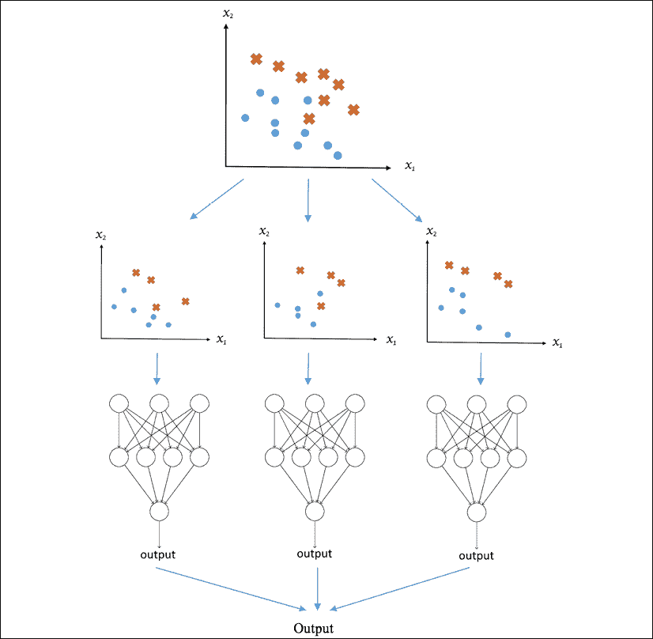

图 1.11:分类打包工作流程

可以想象，套袋可以减少过拟合的机会。

我们将在*第 4 章*、*中深入研究用基于树的算法*预测在线广告点击率。

## 助推

在监督学习的背景下，我们将**弱学习者**定义为只比基线好一点点的学习者，例如随机分配班级或平均值。就像蚂蚁一样，学习能力弱的人个人也很弱，但他们一起有能力做令人惊奇的事情。

使用权重考虑每个学习者的力量是有意义的。这个的大致思路叫做**助推**。在 boosting 中，所有模型都是按顺序训练的，而不是像 bagging 那样并行训练。每个模型都是在同一个数据集上训练的，但是每个数据样本都在不同的权重下，考虑到了前一个模型的成功。训练完模型后，会重新分配权重，用于下一轮训练。一般来说，错误预测样本的权重会增加，以强调其预测难度。

下图说明了增强的步骤，同样以分类为例(圆圈和十字表示两个类别的样本，圆圈或十字的大小表示分配给它的权重):

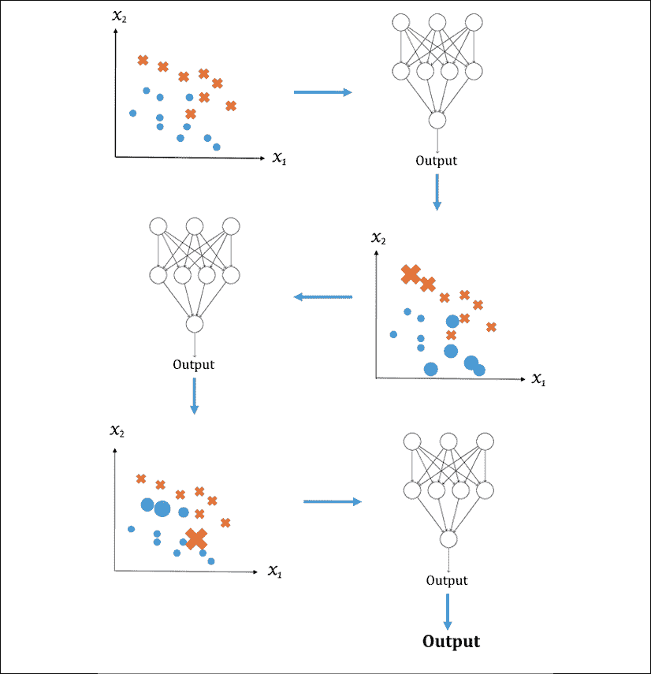

图 1.12:分类助推工作流程

有很多助推算法；增强算法的不同之处主要在于它们的加权方案。如果你已经为考试而学习，你可能已经应用了类似的技术，通过识别你遇到困难的练习题的类型并专注于难题。

图像中的人脸检测基于一个专门的框架，该框架也使用了 boosting。检测图像或视频中的人脸是监督学习。我们给学习者举了包含人脸的区域的例子。这是一种不平衡，因为我们通常有更多的区域(大约 10000 倍以上)没有脸。

级联分类器逐步过滤掉负像区域。在每个渐进阶段，分类器在更少的图像窗口上逐渐使用更多的特征。这个想法是把大部分时间花在包含人脸的图像块上。在这种情况下，增强用于选择特征和组合结果。

## 堆垛

**叠加**取机器学习模型的输出值，然后作为另一种算法的输入值。当然，您可以将高级算法的输出馈送给另一个预测器。可以使用任意拓扑结构，但是出于实际原因，您应该首先尝试简单的设置，这也是奥卡姆剃刀所规定的。

一个有趣的事实是，堆叠通常用于卡格尔竞赛中获胜的模型。例如，奥托集团产品分类挑战赛([www . ka ggle . com/c/Otto-Group-Product-class-challenge](http://www.kaggle.com/c/otto-group-product-classification-challenge))的第一名是由 30 多种不同型号组成的堆叠模型。

到目前为止，我们已经介绍了在整个数据预处理和建模阶段更容易达到机器学习模型的正确泛化所需的技巧。我知道你迫不及待地想开始机器学习项目。让我们通过设置工作环境来做好准备。

# 安装软件和设置

正如书名所说，Python 是我们将在整本书中用来实现所有机器学习算法和技术的语言。我们还将利用许多流行的 Python 包和工具，如 NumPy、SciPy、TensorFlow 和 scikit-learn。在这一章的最后，请确保您正确设置了工具和工作环境，即使您已经是 Python 专家或者可能熟悉其中一些工具。

## 设置 Python 和环境

我们将在本书中使用 Python 3。大家可能知道，2020 年以后不再支持 Python 2，所以强烈建议从 Python 3 开始或者切换到 Python 3。相信我，过渡很顺利。但是如果您坚持使用 Python 2，您应该仍然能够修改代码来为您工作。Anaconda Python 3 发行版是数据科学和机器学习从业者的最佳选择之一。

**Anaconda** 是一款免费的 Python 发行版，用于数据分析和科学计算。它有自己的包管理器`conda`。发行版([https://docs.anaconda.com/anaconda/packages/pkg-docs/](https://docs.anaconda.com/anaconda/packages/pkg-docs/)，视你的 OS，或 3.7、3.6、或 2.7 版本而定)包含 600 多个 Python 包(截至 2020 年)，非常方便。对于休闲用户来说，**Miniconda**([https://conda.io/miniconda.html](https://conda.io/miniconda.html))配送可能是更好的选择。Miniconda 包含`conda`包管理器和 Python。显然，Miniconda 占用的磁盘空间比 Anaconda 少得多。

安装 Anaconda 和 Miniconda 的步骤类似。您可以按照[https://docs . conda . io/projects/conda/en/latest/user-guide/install/](https://docs.conda.io/projects/conda/en/latest/user-guide/install/)的说明进行操作。首先，您必须为您的操作系统和 Python 版本下载适当的安装程序，如下所示:


图 1.13:基于您的操作系统的安装条目

按照操作系统中列出的步骤操作。您可以在图形用户界面和命令行界面之间进行选择。我个人觉得后者更容易。

我能够使用 Python 3 安装程序，尽管在我安装它时，我的系统中的 Python 版本是 2.7。这是可能的，因为 Anaconda 自带 Python。在我的机器上，`Anaconda`安装程序在我的主目录中创建了一个`anaconda`目录，需要大约 900 MB。类似地，`Miniconda`安装程序会在您的主目录中安装一个`miniconda`目录。

设置好之后，请随意摆弄它。验证您是否正确设置了 Anaconda 的一种方法是在 Linux/Mac 上的终端或 Windows 上的命令提示符下输入以下命令行(从现在开始，我们将只提到终端):

```py
python 
```

前面的命令行将显示您的 Python 运行环境，如下图所示:


图 1.14:终端运行“python”后的截图

如果这不是您看到的，请检查系统路径或 Python 运行的路径。

在这一节的最后，我想强调为什么 Python 是机器学习和数据科学最流行的语言。首先，Python 以其高可读性和简单性而闻名，这使得构建机器学习模型变得容易。我们花在担心获得正确语法和编译上的时间更少，因此，有更多的时间来找到正确的机器学习解决方案。其次，我们有大量用于机器学习的 Python 库和框架可供选择:

<colgroup><col> <col></colgroup> 
| 数据分析 | NumPy，SciPy，熊猫 |
| 数据可视化 | Matplotlib，Seaborn |
| 建模 | scikit-learn， TensorFlow， Hard |

表 1.5:机器学习的流行 Python 库

下一步包括设置我们将在本书中使用的一些软件包。

## 安装主要的 Python 包

对于本书中的大多数项目，我们将使用`NumPy`([http://www.numpy.org/](http://www.numpy.org/))、`scikit-learn`([http://scikit-learn.org/stable/](http://scikit-learn.org/stable/))和`TensorFlow`([https://www.tensorflow.org/](https://www.tensorflow.org/))。在接下来的章节中，我们将介绍几个 Python 包的安装，我们将在本书中主要使用这些包。

### NumPy

NumPy 是用 Python 进行机器学习的基础包。它提供了强大的工具，包括:

*   *N* 维数组`ndarray`类和几个代表矩阵和数组的子类
*   各种复杂的数组函数
*   有用的线性代数能力

NumPy 的安装说明可以在[http://docs.scipy.org/doc/numpy/user/install.html](http://docs.scipy.org/doc/numpy/user/install.html)找到。或者，更简单的方法是在命令行中使用`pip`安装它，如下所示:

```py
pip install numpy 
```

要为 Anaconda 用户安装`conda`，请运行以下命令行:

```py
conda install numpy 
```

验证安装的快速方法是将其导入外壳，如下所示:

```py
>>> import numpy 
```

如果看不到错误信息，则说明安装正确。

### 我的天啊

在机器学习中，我们主要使用 NumPy 数组来存储数据向量或由特征向量组成的矩阵。SciPy([https://www.scipy.org/scipylib/index.html](https://www.scipy.org/scipylib/index.html))使用 NumPy 阵列，并提供各种科学和数学功能。在终端安装`SciPy`也类似，如下:

```py
pip install scipy 
```

### 熊猫

我们也在本书后面使用`pandas`库([https://pandas.pydata.org/](https://pandas.pydata.org/))进行数据角力。获得`pandas`的最佳途径是通过`pip`或`conda`:

```py
conda install pandas 
```

### Scikit-learn

`scikit-learn`库是一个 Python 机器学习包，针对性能进行了优化，因为许多代码的运行速度几乎与等效的 C 代码一样快。同样的说法也适用于 NumPy 和 SciPy。Scikit-learn 要求同时安装 NumPy 和 SciPy。正如[http://scikit-learn.org/stable/install.html](http://scikit-learn.org/stable/install.html)的安装指南所述，安装 scikit-learn 最简单的方法是使用`pip`或`conda`如下:

```py
pip install -U scikit-learn 
```

### TensorFlow

TensorFlow 是一个 Python 友好的开源库，由谷歌大脑团队发明，用于高性能数值计算。它通过基于 Python 的便捷前端 API 和基于高性能 C++的后端执行，使机器学习更快，深度学习更容易。此外，它允许在中央处理器和图形处理器之间轻松部署计算，这使得昂贵和大规模的机器学习成为可能。在这本书里，我们将重点讨论作为我们计算平台的 CPU。因此，根据[https://www.tensorflow.org/install/](https://www.tensorflow.org/install/)，安装 TensorFlow 2 是通过以下命令行完成的:

```py
pip install tensorflow 
```

还有很多其他的包我们会集中使用，比如 **Matplotlib** 用于绘图和可视化， **Seaborn** 用于可视化， **NLTK** 用于自然语言处理， **PySpark** 用于大规模机器学习， **PyTorch** 用于强化学习。当我们在本书中第一次遇到任何软件包时，我们将提供它的安装细节。

## 引入 TensorFlow 2

TensorFlow 为我们提供了一个端到端的可扩展平台，用于实现和部署机器学习算法。TensorFlow 2 在很大程度上是从其第一个成熟的 1.0 版本重新设计的，并于 2019 年底发布。

TensorFlow 因其深度学习模块而广为人知。然而，它最强大的点是**计算图**，算法就是建立在这个基础上的。基本上，计算图用于通过张量传达输入和输出之间的关系。例如，如果我们想要评估一个线性关系， *y = 3 * a + 2 * b* ，我们可以在下面的计算图中表示它:

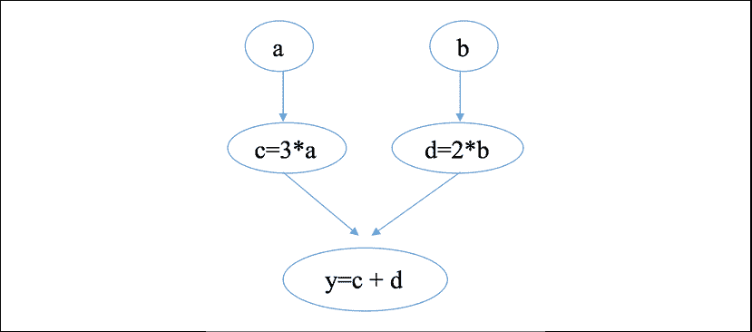

图 1.15:y = 3 * a+2 * b 机器的计算图

这里，a 和 b 是输入张量，c 和 d 是中间张量，y 是输出。

你可以把计算图想象成一个由边连接的节点网络。每个节点都是一个张量，每个边都是一个取其输入节点并向其输出节点返回值的运算或函数。为了训练机器学习模型，TensorFlow 构建计算图，相应地计算**梯度**(梯度是提供到达最优解的最陡方向的向量)。在接下来的章节中，你会看到一些使用`TensorFlow`训练机器学习模型的例子。

最后，如果你对探索 TensorFlow 和计算图感兴趣，我们强烈建议你去 https://www.tensorflow.org/guide/data。

# 摘要

我们刚刚完成了 Python 和机器学习旅程的第一英里！在这一章中，我们熟悉了机器学习的基础知识。我们从机器学习的意义、机器学习的重要性及其简史开始，并研究了最近的发展。我们还学习了典型的机器学习任务，并探索了使用数据和模型的几种基本技术。现在我们已经掌握了基本的机器学习知识，并且已经设置了软件和工具，让我们为前面的真实机器学习示例做好准备。

在下一章中，我们将构建一个电影推荐引擎，作为我们的第一个机器学习项目！

# 练习

1.  你能说出机器学习和传统编程(基于规则的自动化)的区别吗？
2.  什么是过度拟合，我们如何避免？
3.  说出两种特征工程方法。
4.  说出两种组合多个模型的方法。
5.  如果你感兴趣，安装 Matplotlib([https://matplotlib.org/](https://matplotlib.org/))。我们将在整本书中使用它进行数据可视化。******