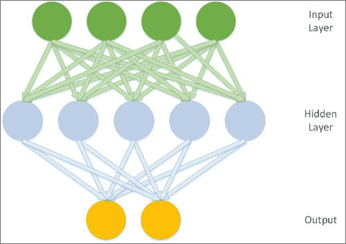
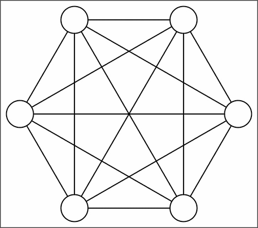
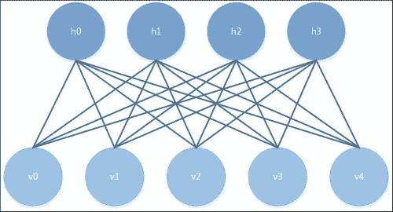
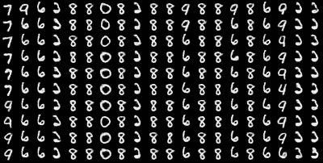
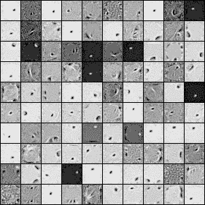

# 第二章。深度信念网络

在前一章中，我们研究了一些广泛使用的降维技术，这些技术使数据科学家能够更深入地了解数据集的本质。

接下来的几章将集中在一些更复杂的技术上，借鉴深度学习的领域。本章致力于建立对如何应用**受限玻尔兹曼机器** ( **RBM** )和管理深度学习架构的理解，人们可以通过链接 RBMs 来创建深度学习架构——深度信念网络 ( **DBN** )。DBNs 是可训练的，可以有效解决文本、图像和声音识别中的复杂问题。它们被领先的公司用于物体识别、智能图像搜索和机器人空间识别。

我们要做的第一件事是在 DBN 的算法中获得坚实的基础；与聚类或 PCA 不同，这段代码并没有被数据科学家广泛知晓，我们将对其进行一定深度的回顾，以构建强大的工作知识。一旦我们完成了理论的工作，我们将在此基础上通过代码逐步推进，使理论成为焦点，并允许我们将技术应用于现实世界的数据。对这些技术的诊断并不琐碎，需要严格，因此我们将强调思维过程和诊断技术，它们使我们能够有效地观察和控制您的实现的成功。

到本章结束时，您将了解 RBM 和 DBN 算法是如何工作的，知道如何使用它们，并对自己提高结果质量的能力充满信心。综上所述，本章内容如下:

*   神经网络——入门
*   受限玻尔兹曼机器
*   深层信念网络

# 神经网络——入门

RBM 是递归神经网络的一种形式。为了理解 RBM 是如何工作的，有必要对神经网络有一个更全面的了解。了解人工神经网络(为了简单起见，以下称为神经网络)算法的读者将在以下描述中找到熟悉的元素。

有许多关于神经网络的非常详细的理论描述；我们不会详细讨论翻新这块土地。为了本章的目的，我们将首先描述神经网络的组成部分、常见的体系结构和流行的学习过程。

## 神经网络的组成

对于不熟悉的读者来说，神经网络是一类数学模型，用于训练在一组输入特征上产生和优化函数(或分布)的定义。给定神经网络应用的具体目标可以由操作员使用性能度量(通常是成本函数)来定义；这样，神经网络可以用于分类、预测或转换它们的输入。

神经网络中神经这个词的使用是从高压生物隐喻中汲取灵感来启发机器学习研究的长期传统的产物。因此，人工神经网络算法最初是从生物神经元结构中提取的(现在仍然经常提取)。

神经网络由以下要素组成:

*   一个学习过程:一个神经网络通过调整其节点权重函数内的参数进行学习。这是通过将性能度量的输出(如前所述，在监督学习环境中，这通常是成本函数，相对于网络的目标输出的某种不准确性度量)馈送到网络的学习函数中来实现的。该学习函数输出所需的权重调整(从技术上讲，它通常计算偏导数——梯度下降所需的项。)来最小化成本函数。
*   一组神经元或权重:每个包含一个权重函数(激活函数)操纵输入数据。激活函数在网络之间可以有很大变化(一个众所周知的例子是双曲正切)。关键要求是权重必须是自适应的，也就是说，可以根据学习过程的更新进行调整。为了进行非参数建模(也就是说，在不定义概率分布细节的情况下进行有效建模)，有必要同时使用可见单元和隐藏单元。隐藏的单位永远不会被观察到。
*   连接功能:它们控制哪些节点可以将数据中继到其他哪些节点。节点可能能够以不受限制或受限制的方式自由地相互中继输入，或者它们可能在输入数据必须以定向方式流过的层中更结构化。有各种各样的互连模式，不同的模式产生非常不同的网络属性和可能性。

利用这一组元素，我们能够构建广泛的神经网络，从熟悉的有向无环图(也许最著名的例子是 **【多层感知器】**(**【MLP】**)到创造性的替代方案。我们在前一章中使用的**自组织映射** ( **SOM** )是一种神经网络，具有独特的学习过程。我们将在本章后面讨论的算法，RBM 算法，是另一种具有一些独特性质的神经网络算法。

## 网络拓扑

神经网络中的神经元是如何连接的有许多变化，结构决定是决定网络学习能力的一个重要因素。无监督学习中的常见拓扑往往不同于有监督学习中的常见拓扑。我们在上一章中讨论的 SOM 是一种常见且现在很熟悉的无监督学习拓扑。

正如我们所看到的，SOM 直接将单个输入案例投影到每个节点包含的权重向量上。然后，它继续对这些节点重新排序，直到数据集的适当映射收敛为止。SOM 的实际结构是基于训练细节、给定训练实例的具体结果以及在构建网络时做出的设计决策的变体，但是正方形或六边形网格结构正变得越来越普遍。

监督学习中非常常见的拓扑类型是三层前馈网络，经典情况是 MLP。在这个网络拓扑模型中，网络中的神经元被分成层，每一层都与“超越”它的层通信。第一层包含输入到隐藏层。隐藏的层使用权重激活(使用正确的激活函数，例如 sigmoid 或 gauss，MLP 可以充当通用函数逼近器)开发数据表示，激活值被传送到输出层。输出层通常提供网络结果。因此，该拓扑如下所示:



其他网络拓扑提供不同的功能。例如，玻尔兹曼机器的拓扑结构与前面描述的不同。玻尔兹曼机器包含隐藏和可见的神经元，就像三层网络中的神经元一样，但是所有这些神经元在有向循环图中相互连接:



这种拓扑结构使得玻尔兹曼机器是随机的——概率性的而不是确定性的——并且能够在给定足够复杂的问题的情况下以几种方式之一发展。玻尔兹曼机器也是生成的，这意味着它能够完全(概率地)建模所有的输入变量，而不是使用观察到的变量来专门建模目标变量。

哪种网络拓扑合适在很大程度上取决于您的具体挑战和所需的输出。每一个在某些领域都很强大。此外，这里描述的每种拓扑结构都伴随着一个学习过程，使网络能够迭代地收敛到(理想的)最优解。

有各种各样的学习过程，具体的过程和拓扑或多或少是相互兼容的。学习过程的目的是使网络能够迭代地调整其权重，从而创建输入数据的越来越精确的表示。

与网络拓扑一样，需要考虑大量的学习过程。有些熟悉是假设的，并且存在大量关于学习过程的优秀资源(本章末尾给出了一些好的例子)。这一部分将重点介绍学习过程的一般特征，而在本章的后面，我们将更详细地看一个具体的例子。

如上所述，神经网络中学习的目标是迭代地改善模型上的权重分布，使得它以越来越高的精度逼近输入数据下的函数。这个过程需要一个性能度量。这可能是一种分类误差度量，通常用在有监督的分类环境中(即 MLP 网络中的反向传播学习算法)。在随机网络中，它可能是概率最大化项(例如基于能量的网络中的能量)。

在任一情况下，一旦有了增加概率的措施，网络就有效地尝试使用优化方法来减少该措施。在许多情况下，网络的优化是使用**梯度下降**来实现的。就梯度下降算法方法而言，在给定的训练迭代中，性能度量值的大小类似于梯度的斜率。因此，最小化性能度量是一个将梯度下降到该组权重的误差度量最低的点的问题。

下一次迭代的网络更新的大小(算法的学习速率)可能会受到性能度量的影响，也可能是硬编码的。

网络调整的权重更新可能来自误差表面本身；如果是这样，您的网络通常会有一种计算梯度的方法，即导出更新需要调整网络激活的权重函数参数的值，以便继续降低性能度量。

在回顾了网络拓扑和学习方法的一般概念之后，让我们开始讨论一个特定的神经网络，RBM。正如我们将看到的，RBM 是强大的深度学习算法的关键部分。

# 受限玻尔兹曼机

RBM 是本章主题“深度学习架构——DBN”的基础部分。以下部分将首先介绍 RBM 背后的理论，包括建筑结构和学习过程。

接下来，我们将直接进入 RBM 类的代码，在代码中的理论元素和函数之间建立联系。最后，我们将讨论成果管理制的应用以及与实施 RBM 相关的实际因素。

## 介绍 RBM

玻尔兹曼机器是一种特殊类型的随机递归神经网络。它是一个基于能量的模型，这意味着它使用能量函数将能量值与网络的每个配置相关联。

在前一节中，我们简要讨论了玻尔兹曼机器的结构。如上所述，玻尔兹曼机器是一个有向循环图，其中每个节点都连接到所有其他节点。这个属性使它能够以一种循环的方式建模，这样模型的输出就可以随着时间的推移而变化和查看。

玻尔兹曼机器中的学习循环包括最大化训练数据集的概率 *X* 。如上所述，所使用的具体性能度量是能量，其特征是数据集 *X* 的概率的负对数，给定模型参数向量*θ*。该度量被计算并用于更新网络的权重，以最小化网络中的自由能。

玻尔兹曼机器在处理图像数据方面特别成功，包括照片、面部特征和笔迹分类上下文。

不幸的是，玻尔兹曼机器对于更具挑战性的最大似然问题并不实用。这是因为机器的扩展能力存在挑战；随着节点数量的增加，计算时间呈指数级增长，最终使我们处于无法计算网络自由能的境地。

### 注

对于那些对底层形式推理感兴趣的人来说，发生这种情况是因为一个数据点的概率， *x* ，*p(x；θ)*，必须全部集成到 *1* 上 *x* 。要实现这一点，我们需要使用一个分区函数 *Z* ，用作归一化常数。( *Z* 是一个常数，使得非负函数乘以 *Z* 将使非负函数在所有输入上积分为*1*；在这种情况下，越过所有 *x* 。)

概率模型函数是一组正态分布的函数。为了得到我们模型的能量，我们需要区分每个模型的参数；然而，由于分区功能，这变得复杂。每个模型参数都会产生依赖于其他模型参数的方程，如果没有(潜在的)非常昂贵的计算，我们最终会发现自己无法计算能量，计算成本会随着网络规模的扩大而增加。

为了克服玻尔兹曼机的弱点，需要对网络拓扑和训练过程都进行调整。

### 拓扑

带来效率提升的主要拓扑变化是节点间连通性的限制。首先，必须防止同一层内节点之间的连接。此外，必须防止所有跳过层的连接(即非连续层之间的直接连接)。具有这种结构的玻尔兹曼机器被称为 RBM，如下图所示:



这种拓扑的一个优点是隐藏层和可见层在给定的条件下彼此独立。因此，可以使用另一层的激活从一层取样。

### 训练

我们之前观察到，对于玻尔兹曼机器，机器的训练时间缩放非常差，因为机器被放大到额外的节点，使我们处于无法评估我们试图在训练中使用的能量函数的位置。

RBM 通常是使用一种以不同学习算法为核心的程序进行训练的，即 **【永久对比发散】** ( **PCD** )算法，该算法提供了最大似然的近似值。PCD 不评估能量函数本身，而是允许我们估计能量函数的梯度。有了这些信息，我们可以在最陡的梯度方向上进行非常小的调整，通过这些调整，我们可以根据需要朝着局部最小值前进。

PCD 算法由两个阶段组成。这些被称为正相和负相，每个相对模型的能量有相应的影响。正相位增加了训练数据集 *X* 的概率，从而降低了模型的能量。接下来，负相位使用来自模型的采样方法来估计负相位梯度。负相位的总体效果是降低模型生成样本的概率。

在负相位和整个更新过程中的采样是使用一种称为 **吉布斯采样**的采样形式来实现的。

### 注

吉布斯抽样是算法的**马氏链蒙特卡罗** ( **MCMC** )族的变体，并且从近似的多元概率分布中抽样。这意味着，在构建我们的概率模型时，不是使用求和计算(就像我们可能做的那样，例如，当我们抛硬币一定次数时；在这种情况下，我们可以将头部尝试的次数相加，作为所有尝试总数的一部分)，而是近似积分的值。如何通过逼近一个积分来创建一个概率模型的主题值得比这本书给它更多的时间。因此，本章的*进一步阅读*部分提供了一个很好的论文参考。现在要记住的要点(并且剥离出很多重要的细节！)是，我们不是对每种情况精确地求和一次，而是基于所讨论的数据的(通常是非均匀的)分布进行采样。吉布斯抽样是一种基于模型中所有其他参数值的概率抽样方法。一旦获得新的参数值，它将立即用于其他参数的采样计算。

你们中的一些人可能会问为什么 PCD 是必要的。为什么不用更熟悉的方法，比如带线搜索的梯度下降？简单地说，我们不能轻易计算网络的自由能，因为这种计算涉及到网络所有节点的集成。当我们指出玻尔兹曼机器的巨大弱点时，我们认识到了这一局限性——随着节点数量的增加，计算时间呈指数级增长，这使我们处于一种情况，即我们试图最小化一个我们无法计算其值的函数！

PCD 提供的是一种估计能量函数梯度的方法。这使得网络的自由能近似成为可能，这对于应用来说是足够快的，并且已经被证明通常是准确的。(有关性能比较，请参考*进一步阅读*部分。)

正如我们之前看到的，RBM 概率模型函数是我们模型参数的联合分布，使得 Gibbs 抽样是合适的！

初始化 RBM 中的训练循环包括几个步骤:

1.  我们获得当前迭代激活的隐藏层权重值。
2.  我们使用上一次迭代的吉布斯链的状态作为输入，执行正相位脉冲编码。
3.  我们使用吉布斯链的预先存在的状态来执行光子晶体的负相位。这给了我们自由能值。
4.  我们使用我们计算的能量值更新隐藏层上激活的权重。

该算法允许 RBM 迭代地向降低的自由能值前进。RBM 继续训练，直到训练数据集的概率积分为 1，自由能等于 0，此时 RBM 收敛。

现在我们有机会回顾一下 RBM 的拓扑和训练过程，让我们应用该算法对一个真实数据集进行分类。

## RBM 的应用

现在我们已经有了 RBM 算法的一般工作知识，让我们通过代码创建一个 RBM。我们将使用一个 RBM 类来对 MNIST 手写数字数据集进行分类。我们将要查看的代码执行以下操作:

*   它设置了 RBM 的初始参数，包括层大小、可共享的偏差向量和与外部网络结构连接的可共享权重矩阵(这支持深度信念网络)
*   它定义了隐藏层和可见层之间的通信和推理功能
*   它定义了允许我们更新网络节点参数的功能
*   它定义了为学习过程处理有效采样的函数，使用 PCD-k 来加速采样(使得在合理的时间范围内进行计算成为可能)
*   它定义了计算模型自由能的函数(用于计算 PCD-k 更新所需的梯度)
*   它确定了**伪似然** ( **PL** )，可用作对数似然代理来指导选择合适的超参数

让我们开始检查我们的`RBM`课:

```py
class RBM(object):
    def __init__(
        self,
        input=None,
        n_visible=784,
        n_hidden=500,
        w=None,
        hbias=None,
        vbias=None,
        numpy_rng=None,
        theano_rng=None
    ):
```

我们需要构建的第一个元素是一个`RBM`构造器，我们可以用它来定义模型的参数，比如可见和隐藏节点的数量(`n_visible`和`n_hidden`)以及可以用来调整 RBM 的推理函数和 CD 更新执行方式的附加参数。

`w`参数可以用作共享权重矩阵的指针。正如我们将在本章后面看到的，这在实现 DBN 时变得更加相关；在这种架构中，权重矩阵需要在网络的不同部分之间共享。

`hbias`和`vbias`参数类似地用作共享隐藏和可见(分别)单元偏置向量的可选参考。同样，这些在数据库网络中使用。

`input`参数使 RBM 能够从上到下连接到其他图形元素。例如，这允许人们将限制性商业惯例连锁化。

设置好这个构造函数后，我们接下来需要充实前面的每个参数:

```py
        self.n_visible = n_visible
        self.n_hidden = n_hidden

        if numpy_rng is None:
            numpy_rng = numpy.random.RandomState(1234)

        if theano_rng is None:
            theano_rng = RandomStreams(numpy_rng.randint(2 ** 30))
```

这是相当简单的事情；我们为 RBM 设置了可见节点和隐藏节点，并设置了两个随机数生成器。`theano_rng`参数稍后将在我们的代码中用于从 RBM 的隐藏单位中取样:

```py
        if W is None:
            initial_W = numpy.asarray(
                numpy_rng.uniform(
                    low=-4 * numpy.sqrt(6\. / (n_hidden + n_visible)),
                    high=4 * numpy.sqrt(6\. / (n_hidden + n_visible)),
                    size=(n_visible, n_hidden)
                ),
                dtype=theano.config.floatX
            )
```

该代码切换`W`的数据类型，以便在 GPU 上运行。接下来，我们使用`theano.shared`设置共享变量，这允许变量的存储在它出现的函数之间共享。在当前示例中，我们创建的共享变量将是权重向量(`W`)以及隐藏和可见单元的偏差变量(`hbias`和`vbias`)。当我们继续创建具有多个组件的深度网络时，以下代码将允许我们在网络的各个部分之间共享组件:

```py
            W = theano.shared(value=initial_W, name='W', borrow=True)

        if hbias is None: 
            hbias = theano.shared(
                value=numpy.zeros(
                    n_hidden,
                    dtype=theano.config.floatX
                ),
                name='hbias',
                borrow=True
            )

        if vbias is None:
            vbias = theano.shared(
                value=numpy.zeros(
                    n_visible,
                    dtype=theano.config.floatX
                ),
                name='vbias',
                borrow=True
            )
```

此时，我们准备如下初始化输入层:

```py
        self.input = input
        if not input:
            self.input = T.matrix('input')

        self.W = W
        self.hbias = hbias
        self.vbias = vbias
        self.theano_rng = theano_rng
        self.params = [self.W, self.hbias, self.vbias]
```

由于我们现在有了一个初始化的`input`层，我们的下一个任务是创建我们在本章前面描述的符号图。实现这一点需要创建功能来管理网络的层间传播和激活计算操作:

```py
def propup(self, vis):
        pre_sigmoid_activation = T.dot(vis, self.W) + self.hbias
        return [pre_sigmoid_activation, T.nnet.sigmoid(pre_sigmoid_activation)]

    def propdown(self, hid):
        pre_sigmoid_activation = T.dot(hid, self.W.T) + self.vbias
        return [pre_sigmoid_activation, T.nnet.sigmoid(pre_sigmoid_activation)]
```

这两个功能将一层单元的激活传递给另一层。第一个函数将可见单元的激活向上传递给隐藏单元，以便隐藏单元可以根据可见单元的样本来计算它们的激活。第二个函数执行相反的操作——将隐藏层的激活向下传播到可见单元。

或许值得问一下为什么我们要同时创造`propup`和`propdown`。正如我们回顾的那样，PCD 只要求我们从隐藏单元中执行采样。那么`propup`有什么价值呢？

简而言之，当我们想要从 RBM 取样以回顾其进展时，从可见层取样变得有用。在我们的 RBM 正在处理视觉数据的大多数应用中，定期从可见层获取采样输出并绘制出来是非常有价值的，如下例所示:



正如我们在这里看到的，在迭代的过程中，我们的网络开始改变它的标签；在第一种情况下，`7`变形为`9`，而在其他地方`9`变成了`6`，网络逐渐达到了 3 度的定义。

正如我们之前所讨论的，对您的 RBM 的运营有尽可能多的看法是有帮助的，以确保它提供有意义的结果。从它产生的输出中取样是提高这种可见性的一种方法。

有了关于可见层激活的信息，我们可以从隐藏层传递一个单元激活的样本，给定隐藏节点的激活:

```py
    def sample_h_given_v(self, v0_sample):

 pre_sigmoid_h1, h1_mean = self.propup(v0_sample)
    h1_sample = self.theano_rng.binomial(size=h1_mean.shape,
    n=1, p=h1_mean, dtype=theano.config.floatX)

    return [pre_sigmoid_h1, h1_mean, h1_sample]
```

同样，我们现在可以从给定隐藏单元激活信息的可见层进行采样:

```py
    def sample_v_given_h(self, h0_sample):
    pre_sigmoid_v1, v1_mean = self.propdown(h0_sample)
      v1_sample = self.theano_rng.binomial(size=v1_mean.shape,
      n=1, p=v1_mean, dtype=theano.config.floatX)

      return [pre_sigmoid_v1, v1_mean, v1_sample]
```

我们现在已经实现了执行吉布斯采样步骤所需的连接和更新循环，如本章前面所述。接下来，我们应该定义这个采样步骤！

```py
    def gibbs_hvh(self, h0_sample):

        pre_sigmoid_v1, v1_mean, v1_sample = 
        self.sample_v_given_h(h0_sample)
        pre_sigmoid_h1, h1_mean, h1_sample = 
        self.sample_h_given_v(v1_sample)
        return [pre_sigmoid_v1, v1_mean, v1_sample,
                pre_sigmoid_h1, h1_mean, h1_sample]
```

如上所述，我们需要一个类似的函数来从可见层进行采样:

```py
    def gibbs_vhv(self, v0_sample):

        pre_sigmoid_h1, h1_mean, h1_sample = 
        self.sample_h_given_v(v0_sample)
        pre_sigmoid_v1, v1_mean, v1_sample = 
        self.sample_v_given_h(h1_sample)
        return [pre_sigmoid_h1, h1_mean, h1_sample,
                pre_sigmoid_v1, v1_mean, v1_sample]
```

到目前为止，我们已经编写的代码为我们提供了一些模型。它建立了节点和层以及层与层之间的连接。我们已经编写了所需的代码，以便根据隐藏层的吉布斯采样来更新网络。

我们仍然缺少的是允许我们执行以下操作的代码:

*   计算模型的自由能。正如我们所讨论的，该模型使用能量作为术语来执行以下操作:
    *   使用我们的 Gibbs 抽样步长代码实现 PCD，并设置 Gibbs 步长计数参数 *k = 1* ，计算梯度下降的参数梯度
    *   创建一种方法，将 PCD(计算的梯度)的输出馈送到我们之前定义的网络更新代码
*   开发在整个培训过程中跟踪我们 RBM 的进展和成功的方法。

首先，我们将创建计算 RBM 自由能的方法。请注意，这是隐藏层概率分布的逆对数，我们之前讨论过:

```py
  def free_energy(self, v_sample):

        wx_b = T.dot(v_sample, self.W) + self.hbias
        vbias_term = T.dot(v_sample, self.vbias)
        hidden_term = T.sum(T.log(1 + T.exp(wx_b)), axis=1)
        return -hidden_term - vbias_term
```

接下来，我们将实现 PCD。此时，我们将设置几个有趣的参数。`lr`是学习速率的缩写，是一个用于调整学习速度的可调参数。`k`参数指向 PCD 要执行的步骤数(还记得本章前面的 PCD-k 符号吗？).

我们讨论的 PCD 包含两个阶段，正和负。以下代码计算光子晶体二极管的正相位:

```py
def get_cost_updates(self, lr=0.1, persistent = , k=1):

        pre_sigmoid_ph, ph_mean, ph_sample =  
        self.sample_h_given_v(self.input)

            chain_start = persistent
```

同时，以下代码实现了 PCD 的负相。为此，我们使用安诺的扫描操作扫描`gibbs_hvh`功能`k`次，每次扫描执行一个吉布斯采样步骤。完成负相后，我们获得自由能值:

```py
        (
            [
                pre_sigmoid_nvs,
                nv_means,
                nv_samples,
                pre_sigmoid_nhs,
                nh_means,
                nh_samples
            ],
            updates
        ) = theano.scan(
            self.gibbs_hvh,
            outputs_info=[None, None, None, None, None, chain_start],
            n_steps=k
        )

        chain_end = nv_samples[-1]

        cost = T.mean(self.free_energy(self.input)) - T.mean(
            self.free_energy(chain_end))

        gparams = T.grad(cost, self.params, 
        consider_constant=[chain_end])
```

写完执行整个 PCD 过程的代码后，我们需要一种方法将输出馈送到我们的网络。在这一点上，我们能够将我们的 PCD 学习过程与代码联系起来，以更新我们之前回顾的网络。前面的更新字典指向`gibbs_hvh`功能的`theano.scan`。大家可能还记得，`gibbs_hvh`目前包含`theano_rng`随机状态的规则。我们现在需要做的是将新的参数值和包含 Gibbs 链状态的变量添加到字典中(即`updates`变量):

```py
        for gparam, param in zip(gparams, self.params):
            updates[param] = param - gparam * T.cast(
                lr,
                dtype=theano.config.floatX
            )

            updates = nh_samples[-1]
            monitoring_cost =  
            self.get_pseudo_likelihood_cost(updates)

        return monitoring_cost, updates
```

我们现在几乎拥有了让我们的 RBM 运转起来所需的所有部件。显然缺少的是一种在培训期间或完成后检查培训的方法，以确保我们的 RBM 正在学习数据的适当表示。

我们之前讨论过如何训练 RBM，特别是分区函数带来的挑战。此外，在代码的前面，我们实现了一种方法，通过它我们可以在训练期间检查 RBM；我们创建了`gibbs_vhv`函数来从模型中执行吉布斯采样。

在我们之前关于如何验证 RBM 的讨论中，我们讨论了可视化绘制 RBM 创建的过滤器。我们将很快回顾如何实现这一点。

最后一种可能性是使用 PL 的逆对数作为可能性本身的更易处理的代理。从技术上讲，对数概率是以所有其他数据点为条件的每个数据点(每个`x`)的对数概率之和。如前所述，对于更大维度的数据集，这变得过于昂贵，因此使用了 log-PL 的随机近似。

我们引用了一个函数，该函数将使我们能够在`get_cost_updates`函数中获得 PL 成本，特别是`get_pseudo_likelihood_cost`函数。现在是充实这个函数并获得伪似然的时候了:

```py
def get_pseudo_likelihood_cost(self, updates):

        bit_i_idx = theano.shared(value=0, name='bit_i_idx')
        xi = T.round(self.input)

        fe_xi = self.free_energy(xi)

        xi_flip = T.set_subtensor(xi[:, bit_i_idx], 1 - xi[:, 
        bit_i_idx])

        fe_xi_flip = self.free_energy(xi_flip)

        cost = T.mean(self.n_visible * 
        T.log(T.nnet.sigmoid(fe_xi_flip - fe_xi)))

        updates[bit_i_idx] = (bit_i_idx + 1) % self.n_visible

        return cost
```

我们现在已经填写了缺失组件列表中的每一个元素，并且已经完整地回顾了`RBM`类。我们已经探索了每个元素是如何与 RBM 背后的理论联系在一起的，现在应该对 RBM 算法的工作原理有了一个彻底的了解。我们了解我们的 RBM 将会取得什么样的成果，并将很快能够对其进行审查和评估。简而言之，我们准备训练我们的 RBM。开始 RBM 的训练就是运行下面的代码，它会触发`train_set_x`功能。我们将在本章后面更深入地讨论这个函数:

```py
    train_rbm = theano.function(
        [index],
        cost,
        updates=updates,
        givens={
            x: train_set_x[index * batch_size: (index + 1) * 
            batch_size]
        },
        name='train_rbm'
    )

    plotting_time = 0.
    start_time = time.clock()
```

更新了 RBM 的更新和训练集后，我们开始了训练。在每个时期内，我们先对训练数据进行训练，然后将权重绘制为矩阵(如本章前面所述):

```py
    for epoch in xrange(training_epochs):

        mean_cost = []
        for batch_index in xrange(n_train_batches):
            mean_cost += [train_rbm(batch_index)]

        print 'Training epoch %d, cost is ' % epoch, 
        numpy.mean(mean_cost)

        plotting_start = time.clock()
        image = Image.fromarray(
            tile_raster_images(
                X=rbm.W.get_value(borrow=True).T,
                img_shape=(28, 28),
                tile_shape=(10, 10),
                tile_spacing=(1, 1)
            )
        )
        image.save('filters_at_epoch_%i.png' % epoch)
        plotting_stop = time.clock()
        plotting_time += (plotting_stop - plotting_start)

    end_time = time.clock()

    pretraining_time = (end_time - start_time) - plotting_time

    print ('Training took %f minutes' % (pretraining_time / 60.))
```

权重往往绘制得相当清晰，类似于 Gabor 滤波器(通常用于图像边缘检测的线性滤波器)。如果数据集是在相当低噪声的背景上手写的字符，您往往会发现权重跟踪使用的笔画。对于照片，过滤器将近似跟踪图像中的边缘。下图显示了输出示例:



最后，我们创建持久吉布斯链，我们需要它来导出我们的样本。如前所述，以下函数执行单个 Gibbs 步骤，然后更新链:

```py
plot_every = 1000

    (
        [
            presig_hids,
            hid_mfs,
            hid_samples,
            presig_vis,
            vis_mfs,
            vis_samples
        ],
        updates
    ) = theano.scan(
        rbm.gibbs_vhv,
        outputs_info=[None, None, None, None, None, persistent_vis_chain],
        n_steps=plot_every
    )
```

该代码运行我们之前描述的`gibbs_vhv`功能，绘制网络输出样本供我们检查:

```py
    updates.update({persistent_vis_chain: vis_samples[-1]})
    sample_fn = theano.function(
        [],
        [
            vis_mfs[-1],
            vis_samples[-1]
        ],
        updates=updates,
        name='sample_fn'
    )

    image_data = numpy.zeros(
        (29 * n_samples + 1, 29 * n_chains - 1),
        dtype='uint8'
    )
    for idx in xrange(n_samples):

        vis_mf, vis_sample = sample_fn()
        print ' ... plotting sample ', idx
        image_data[29 * idx:29 * idx + 28, :] = tile_raster_images(
            X=vis_mf,
            img_shape=(28, 28),
            tile_shape=(1, n_chains),
            tile_spacing=(1, 1)
        )

    image = Image.fromarray(image_data)
    image.save('samples.png')
```

在这一点上，我们有一整个 RBM。我们有 PCD 算法和使用该算法和吉布斯采样更新网络的能力。我们有几个可见的输出方法，这样我们就可以评估我们的 RBM 训练得有多好。

然而，我们还没有完成！接下来，我们将开始了解 RBM 最常见和最强大的应用。

## RBM 的进一步应用

我们可以使用 RBM 作为最大似然算法本身。它的功能与其他算法相当好。有利的是，它可以被放大到可以学习高维数据集的程度。然而，这并不是 RBM 真正的优势所在。

RBM 最常用作称为 DBN 的高效深层网络架构的预处理机制。数据库网络是学习和分类一系列图像数据集的极其强大的工具。它们具有很好的归纳未知案例的能力，是可用的最佳图像学习工具之一。由于这个原因，数据库网络在世界上许多顶尖的技术和数据科学公司都在使用，主要用于图像搜索和识别。

# 深度信念网络

DBN 是一个图形模型，使用多个堆叠的径向基函数构建。当第一 RBM 基于来自训练数据的像素的输入训练特征层时，后续层将先前层的激活视为像素，并尝试学习后续隐藏层中的特征。这经常被描述为学习数据的表示，并且是深度学习中的一个常见主题。

应该有多少个多重成果管理制取决于手头的问题需要什么。从实用的角度来看，这是在提高精度和增加计算成本之间的权衡。每层径向基函数都会提高训练数据对数概率的下限。换句话说；随着每增加一层功能，DBN 几乎不可避免地变得不那么糟糕。

就层大小而言，减少连续径向基函数的隐藏层中的节点数量通常是有利的。人们应该避免这样的情况，即 RBM 的可见单位至少与它之前的 RBM 的隐藏单位一样多(这增加了简单地学习网络的身份功能的风险)。

当连续的径向基函数在层大小上减小时，直到最终的 RBM 具有接近数据中方差维数的层大小，这可能是有利的(但决不是必要的)。将 MLP 附加到层具有太多节点的 DBN 的末尾会损害分类性能；这就像试图把吸管固定在软管的末端！即使是拥有许多神经元的 MLP 也可能无法在这样的环境中成功训练。与此相关，已经注意到，即使层不包含非常多的节点，只要有足够的层，或多或少任何功能都可以被建模。

确定数据中方差的维度不是一项简单的任务。可以支持这项任务的一个工具是 PCA 正如我们在上一章中看到的，PCA 可以使我们对输入数据中存在多少有意义大小的分量有一个合理的概念。

## 训练一个 DBN

训练一个 DBN 通常是贪婪地进行的，也就是说，它训练在每一层进行局部优化，而不是试图达到全局最优。学习过程如下:

*   DBN 的第一层是使用我们在前面讨论 RBM 学习时看到的方法训练的。因此，第一层使用隐藏单元上的吉布斯采样将其数据分布转换为后验分布。
*   这个分布比输入数据本身更有利于 RBM 训练，所以下一个 RBM 层学习这个分布！
*   连续的 RBM 层继续在前一层输出的样本上训练。
*   该架构中的所有参数都是使用性能度量来调整的。

这种性能度量可能会有所不同。正如本章前面所讨论的，它可能是梯度下降中使用的对数似然代理。在有监督的上下文中，可以添加分类器(例如，MLP)作为体系结构的最后一层，预测精度可以用作微调深层体系结构的性能度量。

让我们继续在实践中使用 DBN。

## 应用 DBN

讨论了 DBN 和围绕它的理论，是时候建立我们自己的了。我们将以类似于 RBM 的方式工作，在初始化和训练我们的网络以看到它的实际运行之前，先通过一堂`DBN`课，将代码与理论联系起来，讨论应该期待什么以及如何检查网络的性能。

让我们来看看我们的`DBN`课:

```py
class DBN(object):

    def __init__(self, numpy_rng, theano_rng=None, n_ins=784,
                 hidden_layers_sizes=[500, 500], n_outs=10):

        self.sigmoid_layers = []
        self.rbm_layers = []
        self.params = []
        self.n_layers = len(hidden_layers_sizes)

        assert self.n_layers > 0

        if not theano_rng:
            theano_rng = RandomStreams(numpy_rng.randint(2 ** 30))

        self.x = T.matrix('x')
        self.y = T.ivector('y')
```

`DBN`类包含许多需要进一步解释的参数。用于确定初始权重的`numpy_rng`和`theano_rng`参数在我们对`RBM`课程的考试中已经很熟悉了。`n_ins`参数是指向 DBN 输入的尺寸(特征)的指针。`hidden_layers_sizes`参数是隐藏图层大小的列表。该列表中的每个值将指导`DBN`构造器创建相关大小的 RBM 图层；您会注意到，`n_layers`参数是指网络中的层数，由`hidden_layers_sizes`设置。调整该列表中的值使我们能够使其图层大小从输入图层大小逐渐减小到越来越简洁的表示，如本章前面所讨论的。

还值得注意的是`self.sigmoid_layers`将存储 MLP 组件(DBN 的最后一层)，而`self.rbm_layers`存储用于预训练 MLP 的 RBM 层。

完成此操作后，我们执行以下操作来完成我们的 DBN 体系结构:

*   我们创建`n_layers`乙状结肠层
*   我们连接乙状结肠层形成 MLP
*   我们为每个 sigmoid 层构造一个 RBM，在每个 sigmoid 层和 RBM 之间有一个共享的权重矩阵和隐藏的偏差

下面的代码用 sigmoid 激活创建`n_layers`多个层；首先创建输入图层，然后创建隐藏图层，其大小对应于我们的`hidden_layers_sizes`列表中的值:

```py
       for i in xrange(self.n_layers):

            if i == 0:
                input_size = n_ins
            else:
                       input_size = hidden_layers_sizes[i - 1]
            if i == 0:
                layer_input = self.x
            else:
                layer_input = self.sigmoid_layers[-1].output

            sigmoid_layer = HiddenLayer(rng=numpy_rng,
                                        input=layer_input,
                                        n_in=input_size,
                                        n_out=hidden_layers_sizes[i],
                                        activation=T.nnet.sigmoid)
            self.sigmoid_layers.append(sigmoid_layer)

            self.params.extend(sigmoid_layer.params)
```

接下来，我们创建一个与 sigmoid 层共享权重的 RBM。这直接利用了我们之前描述的`RBM`类:

```py
            rbm_layer = RBM(numpy_rng=numpy_rng,
                            theano_rng=theano_rng,
                            input=layer_input,
                            n_visible=input_size,
                            n_hidden=hidden_layers_sizes[i],
                            W=sigmoid_layer.W,
                            hbias=sigmoid_layer.b)
            self.rbm_layers.append(rbm_layer)
```

最后，我们在 DBN 的末端添加一个逻辑回归层，从而形成一个 MLP:

```py
        self.logLayer = LogisticRegression(
            input=self.sigmoid_layers[-1].output,
            n_in=hidden_layers_sizes[-1],
            n_out=n_outs)
        self.params.extend(self.logLayer.params)

        self.finetune_cost = self.logLayer.negative_log_likelihood(self.y)

        self.errors = self.logLayer.errors(self.y)
```

既然我们已经把放在了我们的`MLP`类中，让我们构建`DBN`。以下代码使用`28 * 28`输入(即 MNIST 图像数据中的`28*28`像素)、三个尺寸逐渐减小的隐藏层和`10`输出值(针对 MNIST 数据集中的每个`10`手写数字类别)构建网络:

```py
    numpy_rng = numpy.random.RandomState(123)
    print '... building the model'
    dbn = DBN(numpy_rng=numpy_rng, n_ins=28 * 28,
              hidden_layers_sizes=[1000, 800, 720],
              n_outs=10)
```

正如本节前面所讨论的，DBN 分两个阶段进行训练——逐层预训练，其中每一层获取前一层的输出进行训练，然后是微调步骤(反向传播)，允许在整个网络中调整权重。第一阶段，预处理，通过在每一层的 RBM 内执行一步 PCD 来实现。以下代码将执行此预处理步骤:

```py
    print '... getting the pretraining functions'
    pretraining_fns = 
    dbn.pretraining_functions(train_set_x=train_set_x,
    batch_size=batch_size, k=k)

    print '... pre-training the model'
    start_time = time.clock()

    for i in xrange(dbn.n_layers):
        for epoch in xrange(pretraining_epochs):
            c = []
            for batch_index in xrange(n_train_batches):
                c.append(pretraining_fns[i](index=batch_index,
                                            lr=pretrain_lr))
            print 'Pre-training layer %i, epoch %d, cost ' % (i, epoch),
            print numpy.mean(c)

    end_time = time.clock()
```

然后通过以下命令运行预训练的 DBN:

```py
python code/DBN.py

```

### 注

请注意，即使使用 GPU 加速，这段代码也会花费相当多的时间进行预处理，因此建议您连夜运行。

## 验证 DBN

整个 DBN 的验证是以一种非常熟悉的方式完成的。我们可以使用交叉验证的最小验证误差作为一个误差度量。然而，最小交叉验证误差可能会低估交叉验证数据的预期误差，因为元参数可能会过度适应新数据。

因此，我们应该使用交叉验证错误来调整元参数，直到交叉验证错误最小化。然后，我们应该将我们的 DBN 暴露给坚持的测试集，使用测试误差作为我们的验证度量。我们的`DBN`班正是执行这个训练过程。

然而，这并没有告诉我们，如果网络不能充分训练，该怎么办。如果我们的 DBN 表现不佳，我们该怎么办？

首先要做的是识别潜在的原因，在这方面，有一些常见的罪犯。我们知道底层 RBM 的训练也相当棘手，任何一个单独的层都可能无法训练。令人欣慰的是，我们的`RBM`类让我们能够利用和查看每一层生成的权重(过滤器)，我们可以绘制这些权重来查看我们的网络试图表示什么。

此外，我们想问我们的网络是过度匹配，还是匹配不足。这两种情况都是完全可能的，认识到这是如何以及为什么会发生是很有用的。在拟合不足的情况下，训练过程可能根本无法为模型找到好的参数。当您使用较大的网络来解决较大的问题空间时，这种情况尤其常见，但即使在一些较小的模型中也可以看到。如果你认为你的 DBN 可能会出现装配不足，你有几个选择。首先是简单地缩小隐藏层的大小。这可能行得通，也可能行不通。一个更好的选择是逐渐缩小你的隐藏层，这样每一层都可以学习到前一层的精细版本。如何做到这一点，如何急剧缩减，何时停止都是第一种情况下的试错和长期基于经验的学习的问题。

过拟合是一种众所周知的现象，在这种现象中，您的算法会过度专门针对所提供的训练数据进行训练。这类问题通常是在交叉验证时发现的(在交叉验证时，您的错误率会急剧增加)，但可能非常有害。解决过度拟合问题的方法确实存在；可以增加训练数据集的大小。一种更严格的贝叶斯方法是附加一个额外的标准(例如，先验)，用于降低拟合训练数据的价值。提高分类性能的一些最有效的方法是预处理方法，我们将在[第 6 章](06.html "Chapter 6. Text Feature Engineering")、*文本特征工程*和[第 7 章](07.html "Chapter 7. Feature Engineering Part II")、*特征工程第二部分*中讨论。

尽管该代码将从一个预定义的位置(给定一个种子值)初始化，但模型的随机特性意味着它将迅速发散，结果可能会有所不同。在我的系统上运行时，这个 DBN 实现了 1.19%的最小交叉验证误差。更重要的是，在 46 个监督时期后，它实现了 1.30%的测试误差。这些都是好结果；的确，它们可以与领先领域的例子相媲美！

# 进一步阅读

对于神经网络入门，从一系列来源阅读是有意义的。有许多问题需要注意，不同的作者强调不同的材料。凯文·格尼在《神经网络导论》中提供了一个坚实的介绍。

一篇关于马尔可夫链蒙特卡罗基础直觉的优秀文章可以在 http://twiecki.github.io/blog/2015/11/10/mcmc-sampling/获得。

对于那些对支持吉布斯采样的直觉感兴趣的读者来说，菲利普·雷斯尼克和埃里克·哈迪斯蒂的论文《外行的吉布斯采样》提供了一个关于吉布斯如何工作的技术性但清晰的描述。特别值得注意的是有一些非常好的类比！在[https://www.umiacs.umd.edu/~resnik/pubs/LAMP-TR-153.pdf](https://www.umiacs.umd.edu/~resnik/pubs/LAMP-TR-153.pdf)找到他们。

对比发散没有很多好的解释，我喜欢的一个解释是奥利弗·伍德福德在 http://www.robots.ox.ac.uk/~ojw/files/NotesOnCD.pdf 提供的。如果你对大量使用形式表达有点畏惧，我仍然建议你阅读它，因为它清晰地描述了相关的理论和实际问题。

本章使用在 http://deeplearning.net/tutorial/contents.html可获得的安诺文档作为讨论和实施 RBM 和 DBN 课程的基础。

# 总结

这一章我们已经讲了很多内容！在深入研究 RBM 算法和 RBM 代码本身之前，我们首先概述了神经网络，重点介绍了拓扑和学习方法的一般特性。我们带着这种坚实的理解去创造一个 DBN。在这样做的时候，我们将 DBN 理论和代码联系在一起，然后启动我们的 DBN 来处理 MNIST 数据集。我们在一个 10 类问题中进行了图像分类，取得了极具竞争力的结果，分类误差在 2%以下！

在下一章中，我们将通过向您介绍另一种深度学习架构来继续巩固您对深度学习的掌握— **堆叠去噪自动编码器** ( **SDA** )。