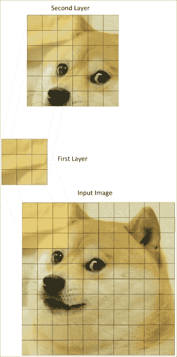
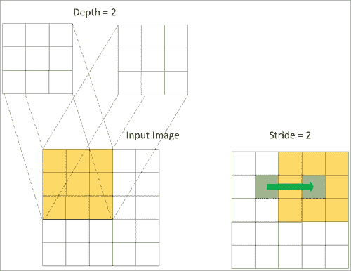
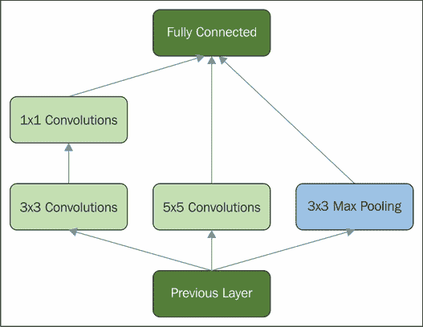
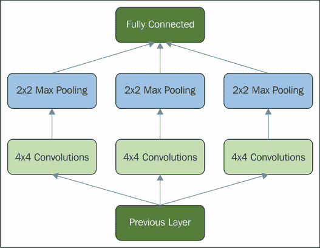
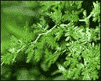
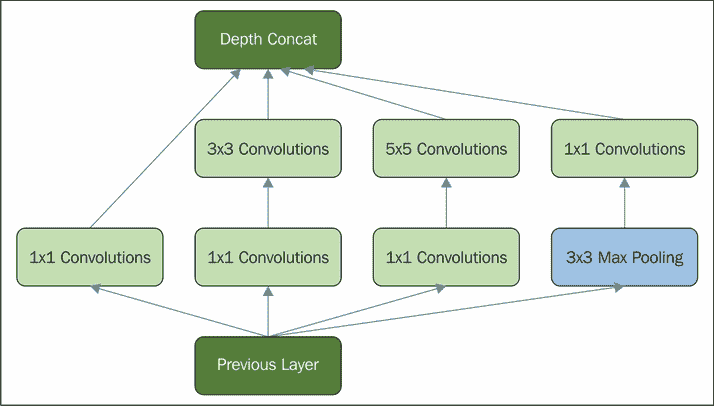
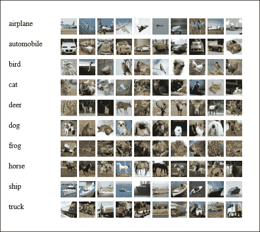

# 第四章。卷积神经网络

在本章中，您将通过以下步骤学习如何应用卷积神经网络(也称为 CNN 或 convnet)，这可能是最著名的深度架构:

*   看看 convnet 的拓扑和学习过程，包括卷积层和池层
*   了解我们如何将 convnet 组件结合到成功的网络架构中
*   使用 Python 代码应用 convnet 架构，以解决一个众所周知的图像分类任务

# 介绍美国有线电视新闻网

在机器学习领域，人们一直倾向于开发并行生物结构的代码结构。最明显的例子之一是 MLP 神经网络，它的拓扑结构和学习过程受到人脑神经元的启发。

事实证明，这种偏好非常有效；擅长特定任务集的专门优化生物结构的可用性为我们提供了丰富的模板和线索，从中可以设计和创建有效的学习模型。

卷积神经网络的设计灵感来自视觉皮层——大脑中处理视觉输入的区域。视觉皮层有几个特化，使它能够有效地处理视觉数据；它包含许多在视野重叠区域检测光的受体细胞。所有的受体细胞都受到相同的卷积运算，也就是说，它们都以相同的方式处理它们的输入。这些专门化被结合到 convnets 的设计中，使得它们的拓扑结构明显不同于其他神经网络。

可以有把握地说，美国有线电视新闻网(简称 convnets)是当前人工智能和机器学习领域许多最有影响力的进步的基础。美国有线电视新闻网的变体被应用于现有的一些最复杂的视觉、语言和解决问题的应用程序。一些例子包括:

*   谷歌开发了一系列专门的 convnet 架构，包括 22 层 convnet 架构**。此外，谷歌的 DeepDream 程序也使用了卷积神经网络，该程序因过度训练、致幻图像而闻名。**
***   卷积网被教授玩游戏 **Go** (一个长期的人工智能挑战)，对高排名玩家的胜率在 85%到 91%之间。*   脸书在人脸验证中使用卷积网(**深度人脸**)。*   百度、微软研究公司、国际商用机器公司和推特是使用 convnets 解决围绕试图交付下一代智能应用程序的挑战的许多其他团队之一。**

 **近年来，物体识别挑战，如 2014 年 **ImageNet** 挑战，一直由采用专门 convnet 实现或结合 con vnet 与其他架构的多模型集成的赢家主导。

虽然我们将在[第 8 章](08.html "Chapter 8. Ensemble Methods")、*集成方法*中介绍如何创建和有效应用集成，但本章重点介绍卷积神经网络在大规模视觉分类上下文中的成功应用。

## 了解 convnet 拓扑

卷积神经网络的体系结构应该相当熟悉；网络是一个非循环的图，由越来越少的节点组成的层组成，其中每一层都馈入下一层。这在许多著名的网络拓扑中是非常熟悉的，例如 MLP。

也许卷积神经网络和大多数其他网络之间最直接的区别是，convnet 中的所有神经元都是相同的！所有神经元拥有相同的参数和权重值。如您所见，这将立即减少由网络控制的参数值的数量，带来显著的效率节约。它通常还能提高网络学习率，因为需要管理和计算的自由参数更少。正如我们将在本章后面看到的，共享权重还使 convnet 能够学习特性，而不管它们在输入中的位置如何(例如，输入图像或音频信号)。

卷积网络和其他体系结构之间的另一个很大的区别是节点之间的连通性是有限的，例如开发空间局部连通性模式。换句话说，给定节点的输入将只限于那些受体场连续的节点。这可以是空间连续的，如在图像数据的情况下；在这种情况下，每个神经元的输入最终将从图像的连续子集中提取。在音频信号数据的情况下，输入可能是连续的时间窗口。

为了更清楚地说明这一点，让我们以一个输入图像为例，讨论卷积网络如何处理特定节点上的部分图像。卷积神经网络第一层的节点将被分配输入图像的子集。在这种情况下，假设他们每个人取图像的 3×3 像素子集。我们的覆盖范围覆盖了整个图像，在节点输入的区域之间没有任何重叠，也没有任何间隙。(请注意，对于 convnet 实现，这些条件都不是自动成立的。)每个节点被分配一个 3×3 像素的图像子集(节点的感受野)，并输出该输入的变换版本。我们暂时不考虑这种转变的细节。

该输出通常由第二层节点接收。在这种情况下，假设我们的第二层从第一层的节点获取所有输出的子集。例如，它可能获取原始图像的连续 6×6 像素子集；也就是说，它有一个感受野，正好覆盖来自层之前的的四个节点的输出。当直观地解释时，这变得更加直观:



每一层都是 **可组合的**；一个卷积层的输出可以作为输入馈送到下一层。这提供了与我们在[第 3 章](03.html "Chapter 3. Stacked Denoising Autoencoders")、*堆叠去噪自动编码器*中看到的效果相同的效果；连续的层开发了越来越高级的抽象特征的表示。此外，随着我们向下构建——添加层——表示对更大的像素空间区域产生响应。最终，通过堆叠层，我们可以朝着整个输入的全局表示的方向努力。

### 理解卷积层

如上所述，为了防止每个节点学习一个不可预测的(而且很难调的！)设置非常局部的自由参数，层中的权重在整个层中共享。完全准确地说，卷积层中应用的滤波器是一组滤波器，它们在输入数据集中滑动(卷积)。这产生了输入的二维激活图，称为特征图。

过滤器本身受制于四个超参数:大小、深度、步幅和零填充。过滤器的大小是相当不言自明的，是过滤器的面积(显然，通过乘以高度和宽度找到；过滤器不必是方形的！).更大的过滤器往往会重叠更多，正如我们将看到的，这可以提高分类的准确性。然而，至关重要的是，增加滤波器尺寸将产生越来越大的输出。正如我们将看到的，管理卷积层的输出大小是控制网络效率的一个重要因素。

深度定义层中连接到输入的同一区域的节点数。理解深度的诀窍是认识到观察图像(对于人或网络)涉及处理多种不同类型的属性。任何看过 Photoshop 中所有图像调整滑块的人都知道这可能意味着什么。深度有时本身就是一个维度；它几乎与图像的复杂性有关，不是根据图像的内容，而是根据准确描述图像所需的通道数量。

深度有可能描述颜色通道，节点被映射以识别输入中的绿色、蓝色或红色。顺便说一句，这导致了深度被设置为 3(特别是在第一卷积层)的常见惯例。非常重要的是要认识到，一些节点通常学习表达输入图像的不太容易描述的属性，这恰好使 convnet 能够更准确地学习该图像。增加深度超参数有助于使节点能够编码更多关于输入的信息，以及随之而来的问题和好处。

因此，将深度参数设置为过小的值往往会导致较差的结果，因为网络不具备准确表征输入数据所需的表达深度(就通道数而言)。这是一个类似于没有足够功能的问题，只是它更容易修复；人们可以向上调整网络的深度，以提高 convnet 的表达深度。

同样，将深度参数设置为过小的值可能是多余的，或者对性能有害。如果有疑问，可以考虑在网络配置期间通过超参数优化、弯头方法或其他技术来测试适当的深度值。

**步幅** 是神经元间距的度量。步幅值为 1 将导致输入的每个元素(对于图像，可能是每个像素)成为过滤器实例的中心。这自然会导致高度重叠和非常大的产出。增加步幅会减少感受野的重叠，输出的大小也会减少。虽然调整 convnet 的步长是一个权衡精度与输出大小的问题，但使用较小的步长通常是个好主意，这样效果会更好。此外，步长值为 1 使我们能够在池层管理下采样和规模缩减(我们将在本章后面讨论)。

下图以图形方式显示了**深度**和**步幅**:



最后一个超参数，零填充，提供了一个有趣的便利。零填充是将每个感受野的外部值(边界)设置为零的过程，其效果是减小该层的输出大小。可以将场边界周围的一个或多个像素设置为零，从而相应地减小输出大小。当然，也有限制；显然，设置零填充和跨步以使输入区域不被过滤器触摸不是一个好主意！更一般地说，增加零填充度会导致效率下降，这与通过粗编码学习特征的难度增加有关。(参见本章*理解汇集层*部分。)

然而，零填充非常有帮助，因为它使我们能够将输入和输出大小调整为相同。这是很常见的做法；使用零填充来确保输入层和输出层的大小相等，我们能够轻松管理步幅和深度值。如果不以这种方式使用零填充，我们将需要做大量的工作来跟踪输入大小和管理网络参数，以使网络正常运行。此外，零填充还可以提高性能，因为如果没有零填充，convnet 会逐渐降低滤波器边缘的内容质量。

当我们定义 convnet 时，为了校准连续层的节点数、适当的跨距和填充，我们需要知道前一层输出的大小。我们可以计算图层输出的空间大小( *O* )作为输入图像大小( *W* )、滤镜大小( *F* )、步幅( *S* )和应用的零填充量( *P* )的函数，如下所示:


如果 *O* 不是整数，过滤器不会整齐地平铺在输入上，而是延伸到输入的边缘。这可能会在训练时导致一些问题(通常涉及抛出异常)！通过调整步幅值，可以找到 *O* 的整数解，有效训练。在给定其他超参数值和输入大小的情况下，步幅被限制在可能的范围内是正常的。

我们已经讨论了正确配置卷积层所涉及的超参数，但是我们还没有讨论卷积过程本身。卷积是一种数学运算符，就像加法或求导一样，在信号处理应用和许多其他有助于简化复杂方程的应用中大量使用。

粗略地说，卷积是对两个函数的运算，例如产生第三个函数，它是两个原始函数之一的修改版本。对于 convnet 中的卷积，第一个分量是网络的输入。在卷积应用于图像的情况下，卷积应用于二维(图像的宽度和高度)。输入图像通常是三个像素矩阵，红色、蓝色和绿色通道各一个，每个通道的值介于 *0* 和中的 *255* 之间。

### 注

此时，值得引入一个 **张量**的概念。Tensor 是一个常用来指代输入数据的 n 维数组或矩阵的术语，通常应用于深度学习环境中。它实际上类似于矩阵或数组。我们将在本章和[第 9 章](09.html "Chapter 9. Additional Python Machine Learning Tools")、*附加 Python 机器学习工具*中更详细地讨论张量(我们将在这里查看 **张量流**库)。值得注意的是，术语 tensor 正在注意到机器学习社区中使用的复苏，主要是通过谷歌机器智能研究团队的影响。

卷积运算的第二个输入是卷积核，它是一个浮点数矩阵，作为输入矩阵的过滤器。该卷积运算的输出是特征图。卷积运算的工作原理是在输入中滑动过滤器，在每个实例中计算两个参数的点积，并将其写入要素图。在卷积层的步距为 1 的情况下，该操作将在输入图像的每个像素上执行。

卷积的主要优点是减少了对特征工程的需求。创建和管理复杂的内核并执行所需的高度专业化的特征工程过程是一项艰巨的任务，由于在一种环境中工作良好的特征工程过程在大多数其他环境中可能工作不佳，这一任务变得更具挑战性。当我们在[第 7 章](07.html "Chapter 7. Feature Engineering Part II")、*特征工程第二部分*中详细讨论特征工程时，卷积网提供了一个强大的替代方案。

然而，美国有线电视新闻网逐步提高他们的内核过滤给定输入的能力，从而自动优化他们的内核。这个过程是通过同时并行学习多个内核来加速的。这就是我们在前面章节中遇到的特性学习。特征学习可以在时间和增加许多问题的可访问性方面提供巨大的优势。与我们早期的 SDA 和 DBN 实现一样，我们希望将我们学习的特征传递给一个简单得多的浅层神经网络，该网络使用这些特征对输入图像进行分类。

### 了解汇集层

堆叠卷积层允许我们创建一个拓扑，该拓扑可以有效地为复杂、有噪声的输入数据创建作为特征图的特征。然而，卷积层不是深度网络的唯一组成部分。用汇集层编织卷积层是很常见的。汇集是对要素地图的操作，其中多个要素值被聚合为单个值，主要使用最大值(**最大汇集**)、平均值(**平均值汇集**)或求和(**总和汇集**)操作。

共享是一种相当自然的方法，它提供了巨大的优势。如果我们不聚合要素地图，我们往往会发现自己拥有大量的要素。本章稍后我们将分类的 **CIFAR-10** 数据集包含 60，000 张 32 x 32 像素的图像。如果我们假设学习了每幅图像的 *200 个*特征——超过 8×8 个输入——那么在每次卷积时，我们会发现自己的输出向量大小为*(32–8+1)*(32–8+1)* 200 个*，或者每幅图像的 *125，000 个*特征。卷积产生大量的特征，这些特征往往会使计算非常昂贵，并且还会引入严重的过拟合问题。

池操作提供的另一个主要优势是，它提供了一定程度的健壮性，可以应对建模高噪声、高维数据时出现的许多小偏差和差异。具体来说，池化防止网络过于具体地学习特征的位置(过拟合)，这显然是图像处理和识别设置中的关键要求。有了池，网络不再关注输入中特征的精确位置，获得了更强的概括能力。这叫做**平移不变性**。

最大池化是最常用的池化操作。这是因为它专注于所讨论的最具响应性的特征，理论上，这些特征应该使它成为图像识别和分类目的的最佳候选。通过类似的逻辑，最小池往往适用于需要采取额外步骤来防止过度敏感的分类或过度拟合发生的情况。

出于显而易见的原因，谨慎的做法是开始使用快速应用和直接的池化方法(如最大池化)进行建模。然而，当在以后的迭代中寻求网络性能的额外提高时，重要的是要看看您的池操作是否可以改进。在定义自己的池操作方面没有任何真正的限制。事实上，找到一种更有效的子采样方法或替代聚合可以大大提高模型的性能。

就`theano`代码而言，最大池实现非常简单，可能如下所示:

```py
from theano.tensor.signal import downsample

input = T.dtensor4('input')
maxpool_shape = (2, 2)
pool_out = downsample.max_pool_2d(input, maxpool_shape, ignore_border=True)
f = theano.function([input],pool_out)
```

`max_pool_2d`函数取 n 维`tensor`和降尺度因子，在本例中为`input`和`maxpool_shape`，后者是长度的元组`2`，包含输入图像的宽度和高度降尺度因子。`max_pool_2d`操作然后在向量的两个尾部维度上执行最大池化:

```py
invals = numpy.random.RandomState(1).rand(3, 2, 5, 5)

pool_out = downsample.max_pool_2d(input, maxpool_shape, ignore_border=False)
f = theano.function([input],pool_out)
```

`ignore_border`决定边界值是被考虑还是被丢弃。假设`ignore_border = True`，该最大池操作产生以下结果:

```py
[[ 0.72032449  0.39676747]
[ 0.6852195   0.87811744]]

```

如您所见，池化是一个简单的操作，可以提供引人注目的结果(在本例中，输入是一个 5×5 的矩阵，简化为 2×2)。然而，汇集并非没有批评者。特别是，杰弗里·辛顿提供了这个非常令人愉快的声音:

> *“卷积神经网络中使用的汇集操作是一个很大的错误，它工作如此出色的事实是一场灾难。*
> 
> *如果池没有重叠，那么池会丢失关于东西在哪里的有价值的信息。我们需要这些信息来检测物体各部分之间的精确关系。确实，如果池足够重叠，特征的位置将通过“粗略编码”被精确地保留(参见我在 1986 年关于“分布式表示”的论文，以获得这种效果的解释)。但我不再相信粗略编码是表示对象相对于观察者的姿态的最佳方式(我所说的姿态是指位置、方向和比例)。”*

这是一个大胆的声明，但它有意义。Hinton 告诉我们，作为一种聚合，池操作完成了任何聚合必须做的事情——它将数据简化为一种更简单、信息量更少的格式。这不会有太大的伤害，除了韩丁走得更远。

即使我们将每个池的数据减少到单个值，我们仍然可以希望多个池在空间上重叠的事实仍然会呈现特征编码。(这是韩丁提到的粗编码。)这也是相当直观的概念。想象一下，你正在收听一个嘈杂的无线电频率信号。即使你只听懂了三分之一的单词，你也有可能从航运预报中分辨出遇险信号！

然而，Hinton 接着观察到，粗编码在学习姿势(位置、方向和比例)方面没有那么有效。相对于一个对象，视点有如此多的排列，以至于两幅图像不太可能是相似的，而且各种各样的可能构成对使用池的卷积网络来说是一个挑战。这表明，不克服这一挑战的架构可能无法突破图像分类的上限。

然而，至少目前的普遍共识是，即使承认了所有这些，在效率和翻译不变性方面，继续在 convnets 中使用池操作仍然是非常有利的。现在，争论是这是我们最好的了！

与此同时，辛顿提出了一种转换自动编码器的替代方案。转换自动编码器为需要高精度的学习任务(如面部识别)提供了精度改进，在这种情况下，合并操作会导致精度降低。如果您有兴趣了解有关转换自动编码器的更多信息，请阅读本章的*进一步阅读*部分。

因此，我们花了相当多的时间来研究卷积神经网络——它的组成部分，它们是如何工作的，以及它们的超参数。在我们继续将理论付诸行动之前，值得讨论一下如何将所有这些理论组成部分整合到一个工作架构中。为此，让我们讨论一下训练 convnet 是什么样子的。

### 训练 convnet

训练卷积网络的方法对于前面章节的读者来说是熟悉的。卷积架构本身用于预处理更简单的网络结构(例如，MLP)。反向传播算法是预处理时计算梯度的标准方法。在这个过程中，每一层承担三项任务:

*   **向前传递**:每个特征图被计算为与相应权重核卷积的所有特征图的总和
*   **向后传递**:通过相对于输出将转置的权重核与梯度进行卷积来计算输入的梯度
*   计算每个内核的损失，根据需要调整每个内核的权重

重复这个过程可以让我们提高内核性能，直到达到一个收敛点。在这一点上，我们希望已经开发了一组特征，足以使覆盖网络能够有效地对这些特征进行分类。

即使在相当先进的图形处理器上，这个过程也可能执行缓慢。最近的一些发展有助于加速训练过程，包括使用快速**傅立叶变换** 来加速卷积过程(对于卷积核与输入图像大小大致相等的情况)。

### 把所有的放在一起

到目前为止，我们已经讨论了创建 CNN 所需的一些元素。下一个讨论主题应该是我们如何着手组合这些组件来创建有能力的卷积网络，以及哪些组件组合可以很好地工作。我们将从一些预先运行的 convnet 实现中获得指导，因为我们对通常做的事情以及可能做的事情有了一个了解。

可能最著名的卷积网络实现是 Yann LeCun 的 **LeNet** 。自从 1980 年末的 LeNet-1 以来，LeNet 已经经历了几次迭代，但是在执行包括手写数字和图像分类在内的任务方面越来越有效。LeNet 使用交替卷积和汇集层构建，由 MLP 覆盖，如下所示:


每一层都是部分连接的，正如我们之前讨论的，MLP 是一个完全连接的层。在每一层，使用多个特征图(通道)；这给了我们能够创建更复杂的过滤器组的优势。正如我们将看到的，在一个层中使用多个通道是高级用例中使用的一种强大的技术。

通常使用最大池层来降低输出的维度以匹配输入，并通常管理输出量。如何实现池化，特别是关于卷积层和池化层的相对位置，是一个在不同实现之间往往会有所不同的因素。通常情况下，将一个层开发为一组操作，这些操作馈入并被馈入单个 **完全连接的**层，如下例所示:



虽然这种网络结构在实践中行不通，但它很好地说明了一个事实，即网络可以通过多种方式由您所了解的组件构建而成。这个网络是如何构建的，它变得有多复杂，应该由网络要解决的挑战来驱动。不同的问题需要截然不同的解决方案。

对于我们将在本章后面讨论的 LeNet 实现，每一层都包含多个并行的卷积层，每个卷积层后面都有一个最大池层。示意性地，LeNet 层如下图所示:



这种架构将使我们能够快速轻松地开始查看一些初始用例，但是一般来说，对于我们将在本书后面遇到的一些最先进的应用程序来说，这种架构的性能并不好。鉴于这一事实，有一些更广泛的深度学习架构设计来解决最具挑战性的问题，其拓扑值得讨论。最著名的 convnet 架构之一是谷歌的 **【盗梦空间】**网络，现在更普遍地被称为谷歌网。

GoogLeNet 旨在应对涉及互联网质量图像数据的计算机视觉挑战，即在真实环境中捕获的图像，其中图像的姿态、光照、遮挡和杂乱变化很大。GoogLeNet 应用于 2014 年 ImageNet 挑战赛取得了值得注意的成功，在测试数据集上仅实现了 6.7%的错误率。ImageNet 图像是小的、高粒度的图像，取自许多不同的类。多个类可能看起来非常相似(例如树的变种)，网络架构必须能够找到越来越具有挑战性的类区别才能成功。举一个具体的例子，考虑下面的 ImageNet 图像:



考虑到这个问题的需求，用于赢得 ImageNet 14 的 GoogLeNet 架构在几个关键方面偏离了 LeNet 模型。谷歌网的基本层设计被称为初始模块，由以下组件组成:



这里使用的 1×1 卷积层后面是**整流线性单元** ( **ReLU** )。这种方法在语音和音频建模环境中大量使用，因为 ReLU 可以用来有效地训练深度模型，而无需预处理，也不会面临一些挑战其他激活类型的梯度消失问题。有关 ReLU 的更多信息，请参见本章的*进一步阅读*部分。 **DepthConcat** 元素提供了一个连接函数，该函数合并了多个单元的输出，大大提高了训练时间。

GoogLeNet 将这种类型的层链接起来，以创建一个完整的网络。的确，盗梦空间模块通过 GoogLeNet 的重复(九次！)表明网络中的**网络中的** ( **NIN** )(由链式网络模块创建的深度架构)方法将继续成为深度学习领域的有力竞争者。本章的“进一步阅读”部分提供了描述谷歌网络并演示初始模型如何集成到网络中的论文。

除了盗梦空间模块堆叠的规律性之外，谷歌网还有一些其他的惊喜要给我们。前几层通常更简单，首先使用单通道卷积和最大池层。此外，在几个点上，谷歌网引入了一个使用平均池层的主结构的分支，馈入辅助 softmax 分类器。这些分类器的目的是改善在网络低层传播回来的梯度信号，从而在早期和中期网络层实现更强的性能。谷歌网没有一个庞大且潜在模糊的反向传播过程，而是有几个中间更新源。

从这个实现中真正重要的是，GoogLeNet 和其他顶级 convnet 架构主要是成功的，因为它们能够使用我们在本章中讨论的高可用性组件找到有效的配置。既然我们已经有机会讨论了卷积网络的体系结构和组件，并有机会讨论如何使用这些组件来构建一些高度先进的网络，现在是时候应用这些技术来解决我们自己的问题了！

## 申请美国有线电视新闻网

我们将使用图像数据来测试我们的 convnet。我们在前面几章中处理的图像数据，包括 MNIST 数字数据集，是一个有用的训练数据集(具有许多有价值的现实应用，如自动支票读取！).然而，它在一个重要方面不同于几乎所有的照片或视频数据；大多数视觉数据都非常嘈杂。

问题变量可以包括姿势、光照、遮挡和杂乱，这些变量可以独立表达，也可以大量组合表达。这意味着创建一个对数据集中所有噪声属性都不变的函数的任务具有挑战性；该函数通常非常复杂和非线性。在[第 7 章](07.html "Chapter 7. Feature Engineering Part II")*特征工程第二部分*中，我们将讨论美白等技术如何帮助缓解其中一些挑战，但正如我们将看到的，即使是这样的技术本身也不足以产生良好的分类(至少，不需要非常大的时间投入！).到目前为止，图像数据中噪声问题的最有效解决方案，正如我们已经在多个上下文中看到的，是使用深度架构，而不是广泛的架构(也就是说，具有很少的高维层的神经网络，容易出现有问题的过拟合和泛化问题)。

从前面几章的讨论中，深层架构的原因可能已经很清楚了；深层体系结构的连续层重用前面层中执行的推理和计算。因此，深度体系结构可以构建一个由网络的连续层顺序改进的表示，而无需对任何单个层执行大量的重新计算。这使得在没有大量特征工程的情况下，在相对短的时间内以高精度实现对大数据集的噪声照片数据进行分类的挑战性任务。

既然我们已经讨论了建模图像数据的挑战以及在这种环境下深度架构的优势，让我们将 convnet 应用于现实世界的分类问题。

和前面的章节一样，我们将从一个玩具示例开始，我们将使用它来熟悉我们的深层网络的架构。这一次，我们将接受一个经典的图像处理挑战，CIFAR-10。CIFAR-10 是一个由 10 类 60，000 个 32 x 32 彩色图像组成的数据集，每个类包含 6，000 个图像。数据已经分成五个训练批次，一个测试批次。每个数据集中的类和一些图像如下:



虽然在某种程度上，该行业已经着手处理其他数据集，如 ImageNet，但长期以来，CIFAR-10 一直被认为是图像分类方面的障碍，许多数据科学家试图创建将数据集分类到人类精确水平的体系结构，其中人类错误率估计约为 6%。

2014 年 11 月，卡格尔举办了一场竞赛，其目标是尽可能准确地对 CIFAR-10 进行分类。本次比赛的最高得分条目产生了 95.55%的分类准确率，结果使用了卷积网络和网络中的网络方法。我们将在[第 8 章](08.html "Chapter 8. Ensemble Methods")、*集成方法*中讨论对该数据集进行分类的挑战，以及我们可以采用的一些更先进的技术；现在，让我们从卷积网络的分类开始。

对于我们的第一次尝试，我们将应用一个相当简单的卷积网络，目标如下:

*   对图像应用滤镜并查看输出
*   看到我们的转换创造的重量
*   理解有效和无效网络的输出之间的差异

在这一章中，我们将采取一种我们以前没有采取过的方法，当你在野外使用这些技术时，这将对你非常重要。我们在本章前面看到了为解决不同问题而开发的深度体系结构在许多方面可能存在结构差异。

能够创建特定于问题的网络体系结构非常重要，这样我们就可以调整我们的实现来适应一系列现实问题。为了做到这一点，我们将使用模块化的组件来构建我们的网络，这些组件可以以几乎任何必要的方式进行重组，而无需太多额外的努力。我们在本章前面已经看到了模块化的影响，如何将这种影响应用到我们自己的网络中是值得探索的。

正如我们在本章前面所讨论的那样，当任务是对多达数万或数十万张图像的非常大且各种各样的数据集进行分类时，convnets 变得特别强大。因此，让我们有点雄心勃勃，看看我们是否可以应用 convnet 来对 CIFAR-10 进行分类。

在建立卷积网络时，我们将首先定义一个可用的类，并初始化相关的网络参数，特别是权重和偏差。这种方法对于前面章节的读者来说是熟悉的。

```py
class LeNetConvPoolLayer(object):

    def __init__(self, rng, input, filter_shape, image_shape,   
    poolsize=(2, 2)):

        assert image_shape[1] == filter_shape[1]
        self.input = input

        fan_in = numpy.prod(filter_shape[1:])
        fan_out = (filter_shape[0] * numpy.prod(filter_shape[2:])                               
                  numpy.prod(poolsize))

        W_bound = numpy.sqrt(6\. / (fan_in + fan_out))
        self.W = theano.shared(
            numpy.asarray(
                rng.uniform(low=-W_bound, high=W_bound, 
                size=filter_shape),
                dtype=theano.config.floatX
            ),
            borrow=True
        )
```

在进入创造偏见之前，值得回顾一下我们目前所掌握的情况。`LeNetConvPoolLayer`类旨在根据 LeNet 层结构实现一个完整的卷积和池层。这个类包含几个有用的初始参数。

从前面的章节中，我们熟悉了用于将权重初始化为随机值的`rng`参数。我们也可以识别`input`参数。在大多数情况下，图像输入往往采取符号图像张量的形式。该图像输入由`image_shape`参数进行整形；这是描述输入维度的长度为 4 的元组或列表。当我们穿过连续的层时，`image_shape`会逐渐减少。作为一个元组，`image_shape`的维度只是指定输入的高度和宽度。作为长度 4 的列表，参数按顺序如下:

*   批次大小
*   输入要素图的数量
*   输入图像的高度
*   输入图像的宽度

而`image_shape`指定输入的大小，`filter_shape`指定过滤器的尺寸。作为长度 4 的列表，参数按顺序如下:

*   要应用的过滤器(通道)数量
*   输入要素图的数量
*   过滤器的高度
*   过滤器的宽度

然而，高度和宽度可以在没有任何附加参数的情况下输入。这里的最后一个参数`poolsize`描述了缩小系数。这表示为长度为 2 的列表，第一个元素是行数，第二个元素是列数。

定义了这些值之后，我们立即应用它们来更好地定义`LeNetConvPoolLayer`类。在定义`fan_in`时，我们将每个隐藏单元的输入设置为输入要素图数量的倍数，即过滤器高度和宽度。简单来说，我们还定义了`fan_out`，一个梯度，它被计算为输出要素地图数量(要素高度和宽度)除以池大小的倍数。

接下来，我们继续将偏差定义为一组一维张量，每个一维张量对应一个输出特征图:

```py
        b_values = numpy.zeros((filter_shape[0],),  
        dtype=theano.config.floatX)
        self.b = theano.shared(value=b_values, borrow=True)

        conv_out = conv.conv2d(
            input=input,
            filters=self.W,
            filter_shape=filter_shape,
            image_shape=image_shape
        )
```

通过这个函数调用，我们定义了一个卷积运算，它使用了我们之前定义的过滤器。有时，看到需要知道多少理论才能有效地应用单个函数，这可能有点令人吃惊！下一步是使用`max_pool_2d`创建类似的池操作:

```py
        pooled_out = downsample.max_pool_2d(
            input=conv_out,
            ds=poolsize,
            ignore_border=True
        )

        self.output = T.tanh(pooled_out + self.b.dimshuffle('x', 
                      0, 'x', 'x'))

        self.params = [self.W, self.b]

        self.input = input
```

最后，我们加入偏置项，首先将其重塑为形状张量(`1`、`n_filters`、`1`、`1`)。这具有简单的效果，导致偏差影响每个要素地图和迷你地图。此时，我们已经拥有了构建基本 convnet 所需的所有组件。让我们继续创建自己的网络:

```py
    x = T.matrix('x')   
    y = T.ivector('y') 
```

这个过程相当简单。我们按顺序构建层，将参数传递给我们之前指定的类。让我们从构建第一层开始:

```py
    layer0_input = x.reshape((batch_size, 1, 32, 32))

    layer0 = LeNetConvPoolLayer(
        rng,
        input=layer0_input,
        image_shape=(batch_size, 1, 32, 32),
        filter_shape=(nkerns[0], 1, 5, 5),
        poolsize=(2, 2)
    )
```

我们从重塑输入开始，将其扩展到所有预期的迷你批次。由于 CIFAR-10 图像的尺寸为 32 x 32，因此我们将此输入尺寸用于高度和宽度尺寸。过滤过程将每个维度的输入大小减少到 32- 5+1，即 28。汇集在每个维度中减少一半，以创建形状的输出层`(batch_size, nkerns[0], 14, 14)`。

这是一个完整的第一层。接下来，我们可以使用相同的代码在上面附加第二层:

```py
    layer1 = LeNetConvPoolLayer(
        rng,
        input=layer0.output,
        image_shape=(batch_size, nkerns[0], 14, 14),
        filter_shape=(nkerns[1], nkerns[0], 5, 5),
        poolsize=(2, 2)
    )
```

按照之前的图层，该图层的输出形状为(`batch_size, nkerns[1], 5, 5)`)。到目前为止，一切顺利！让我们将此输出馈入下一个完全连接的 sigmoid 层。首先，我们需要将输入形状展平为二维。根据我们到目前为止输入网络的值，输入将是一个形状矩阵 *(500，1250)* 。因此，我们将设置一个合适的`layer2`:

```py
    layer2_input = layer1.output.flatten(2)

    layer2 = HiddenLayer(
        rng,
        input=layer2_input,
        n_in=nkerns[1] * 5 * 5
        n_out=500,
        activation=T.tanh
    )
```

这使我们处于一个很好的位置来完成这个网络的架构，通过添加一个最终的逻辑回归层来计算完全连接的 sigmoid 层的值。

让我们试试这段代码:

```py
    x = T.matrix(CIFAR-10_train)   
    y = T.ivector(CIFAR-10_test)

Chapter_4/convolutional_mlp.py
```

我们获得的结果如下:

```py
Optimization complete.
Best validation score of 0.885725 % obtained at iteration 17400, with test performance 0.902508 %
The code for file convolutional_mlp.py ran for 26.50m

```

这个准确度分数在验证时相当不错。这不是人类水平的准确性，正如我们所确定的，大约是 94%。同样，这不是我们用 convnet 能达到的最好分数。

例如，本章的进一步阅读部分提到了在 Torch 中实现的 convnet，该 conv net 使用了 dropout(我们在[第 3 章](03.html "Chapter 3. Stacked Denoising Autoencoders")、*堆叠去噪自动编码器*)和 **批处理归一化**的组合(一种旨在减少训练过程中协变量漂移的归一化技术；关于这项技术的进一步技术说明和论文，请参考进一步阅读部分)，验证准确率为 92.45%。

然而，88.57%的得分也在这个范围内，这可以让我们相信，我们距离解决 CIFAR-10 问题的有效网络架构已经不远了。更重要的是，你已经学到了很多关于如何有效地配置和训练卷积神经网络的知识。

# 进一步阅读

最近对卷积网络的兴趣过剩意味着我们被宠坏了，无法选择进一步阅读。对于不熟悉的读者来说，一个很好的选择是安德烈·卡普西的课程笔记:[http://cs231n.github.io/convolutional-networks/](http://cs231n.github.io/convolutional-networks/)。

对于对特定同类最佳实施的更深入细节感兴趣的读者，本章中提到的一些网络如下:

谷歌的谷歌网(http://www.cs.unc.edu/~wliu/papers/GoogLeNet.pdf)

谷歌深度思维的围棋程序 alpha Go([https://gogameguru.com/i/2016/03/deepmind-mastering-go.pdf](https://gogameguru.com/i/2016/03/deepmind-mastering-go.pdf))

脸书面部识别的深度人脸架构

ImageNet LSVRC-2010 竞赛获奖网络，这里由 Krizhevsky、Sutskever 和 hint on([http://www.cs.toronto.edu/~fritz/absps/imagenet.pdf](http://www.cs.toronto.edu/~fritz/absps/imagenet.pdf))描述

最后，Sergey Zagoruyko 的带有批处理规范化的 ConvNet 的 Torch 实现可以在这里获得:[http://torch.ch/blog/2015/07/30/cifar.html](http://torch.ch/blog/2015/07/30/cifar.html)。

# 总结

在这一章中，我们涉及了很多方面。我们首先介绍了一种新的神经网络，convnet。我们以最普遍的形式探索了 convnet 的理论和架构，并讨论了一些最先进的网络设计原则，这些原则直到 2015 年年中才在谷歌和百度等组织中得到发展。我们建立了对拓扑以及网络运行方式的理解。

在此之后，我们开始使用 convnet 本身，将其应用于 CIFAR-10 数据集。我们使用模块化 convnet 代码创建了一个功能架构，在对 10 类图像数据进行分类时达到了合理的精度水平。虽然我们肯定离人类的准确性水平还有一段距离，但我们正在逐渐缩小差距！[第八章](08.html "Chapter 8. Ensemble Methods")、*合奏法*将从你在这里学到的东西中吸取，将这些技巧及其应用提升到一个新的水平。**