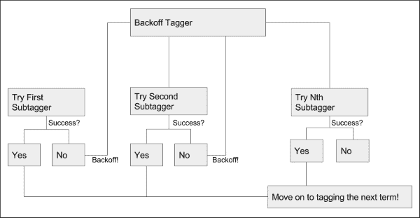
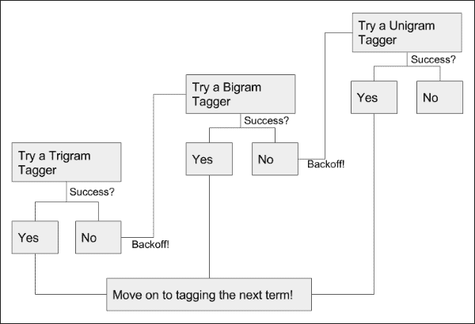
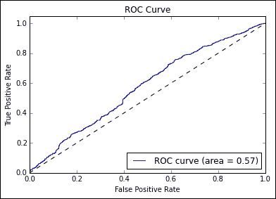
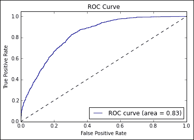

# 六、文本特征工程

# 简介

在前面的章节中，我们花时间评估了能够分析复杂或挑战性数据的强大技术。然而，对于最困难的问题，正确的技巧只会让你走得更远。

深度学习和监督学习试图解决的持续挑战是，找到解决方案通常需要相关团队的多项重大投资。在旧的模式下，人们经常不得不执行特定的准备任务，这需要时间、专业技能和知识。通常，甚至使用的技术也是特定于领域和/或特定于数据类型的。通过这个过程，特征被导出，被称为特征工程。

到目前为止，我们研究的大部分深度学习算法都是为了帮助寻找方法，避免需要执行大量的特征工程。然而，与此同时，特征工程继续被视为顶级 ML 从业者的一项非常重要的技能。以下引述来自卡格尔的主要竞争对手，通过大卫·科福德·温德对卡格尔博客的贡献:

|   | *“你使用的功能比其他任何东西都更能影响结果。据我所知，没有一种算法能够补充正确的特征工程所带来的信息增益。”* |   |
|   | --(Luca massaron) |

|   | *“特征工程当然是 Kaggle 比赛中最重要的方面之一，也是一个人应该花最多时间的部分。数据中通常有一些隐藏的特征，可以大大提高你的表现，如果你想在排行榜上获得好的位置，你必须找到它们。如果你在这里搞砸了，你多半不会再赢了；总有一个人会发现所有的秘密。然而，还有其他重要的部分，比如你如何表述这个问题。你会使用回归模型或分类模型，甚至两者结合，还是需要某种排名。这一点以及功能工程对于在这些比赛中取得好成绩至关重要。也有一些比赛不再需要(手动)特征工程；比如图像处理比赛。当前最先进的深度学习算法可以为您做到这一点。”* |   |
|   | -- *(约瑟夫·费格尔)* |

这里有几个关键主题；特征工程功能强大，即使是极少量的特征工程也能对一个人的分类器产生很大的影响。如果你想得到最好的结果，经常需要使用特征工程技术。最大化机器学习算法的有效性需要一定数量的特定领域和特定数据类型的知识(秘密)。

再引用一句话:

|   | *“对于大多数卡格尔竞赛来说，最重要的部分是功能工程，这很容易学习。”* |   |
|   | - *(蒂姆萨利曼)* |

蒂姆没有错；在本章中，您将学到的大部分内容都是直观、有效的技巧和转换。本章将从自然语言处理和金融时间序列应用程序中，向您介绍一些应用于文本和时间序列数据的最有效和最常用的准备技术。我们将介绍这些技术是如何工作的，人们应该期望看到什么，以及人们如何诊断它们是否如期望的那样工作。

# 文本特征工程

在前面的章节中，我们已经讨论了一些方法，通过这些方法我们可以获取数据集并提取有价值特征的子集。这些方法具有广泛的适用性，但是在处理非数值/非分类数据，或者不容易转换为数值或分类数据的数据时，这些方法的帮助较小。特别是，在处理文本数据时，我们需要应用不同的技术。

我们将在本节中研究的技术分为两大类——清洁技术和功能准备技术。这些通常以大致的顺序实现，我们将相应地研究它们。

## 清理文本数据

当我们处理自然文本数据时，应用了一组不同的方法。这是因为在现实世界的上下文中，自然干净的文本数据集的想法是非常不安全的；文本数据充斥着拼写错误、表情符号之类的非字典构造，在某些情况下，还有 HTML 标记。因此，我们需要非常彻底地清洁。

在这一节中，我们将使用一个相当粗糙的真实数据集，使用一些有效的文本清理技术。具体来说，我们将使用 2012 年卡格尔竞赛的无常数据集，该竞赛的目标是创建一个模型，准确检测社会评论中的侮辱。

是的，我指的是网络巨魔检测。

我们开始吧！

### 用漂亮的字体清理文字

我们的第一步应该是手动检查输入数据。这非常关键；有了文本数据，需要尝试初步了解数据中存在哪些问题，从而识别出需要清理的地方。

通读一个充满可恶的互联网评论的数据集有点痛苦，所以这里有一个示例条目:

<colgroup><col style="text-align: left"> <col style="text-align: left"> <col style="text-align: left"></colgroup> 
| 

身份证明

 | 

日期

 | 

评论

 |
| --- | --- | --- |
| `132` | `20120531031917Z` | `"""\xa0@Flip\xa0how are you not ded"""` |

我们有一个似乎不需要太多工作的 ID 字段和日期字段。然而，文本字段非常具有挑战性。从这一个案例中，我们已经可以看到拼写错误和 HTML 包含。此外，数据集中的许多条目包含绕过发誓过滤的尝试，通常是在单词中间包含一个空格或标点元素。其他数据质量问题包括多个元音字母(扩展一个单词)、非 ascii 字符、超链接...名单还在继续。

清理此数据集的一个选项是使用正则表达式，该表达式在输入数据上运行以消除数据质量问题。然而，问题格式的数量和种类使得使用基于正则表达式的方法不切实际，至少从一开始是这样。我们很可能会错过很多案例，也会误判所需准备的数量，导致我们过于积极地清理，或者不够积极；具体来说，我们可能会切入真实的文本内容或留下部分标签。我们需要的是一个解决方案，它将首先解决大多数常见的数据质量问题，这样我们就可以用基于脚本的方法专注于剩余的问题。

进入`BeautifulSoup`。`BeautifulSoup`是一个非常强大的文本清理库，除了其他功能之外，它还可以删除 HTML 标记。让我们来看看这个关于巨魔数据的库:

```py
from bs4 import BeautifulSoup
import csv

trolls = []
with open('trolls.csv',  'rt') as f:
    reader = csv.DictReader(f)
    for line in reader:
        trolls.append(BeautifulSoup(str(line["Comment"]), "html.parser"))

print(trolls[0])

eg = BeautifulSoup(str(trolls), "html.parser")

print(eg.get_text())
```

<colgroup><col style="text-align: left"> <col style="text-align: left"> <col style="text-align: left"></colgroup> 
| 

身份证明

 | 

日期

 | 

评论

 |
| --- | --- | --- |
| `132` | `20120531031917Z` | `@Flip how are you not ded` |

正如我们所看到的，我们已经在提高文本数据的质量方面取得了进展。然而，从这些例子中也可以清楚地看出，还有很多工作要做！如上所述，让我们继续使用正则表达式来帮助进一步清理和标记我们的数据。

### 管理标点和标记

标记化是从文本流中创建一组标记的过程。许多标记是单词，而其他标记可能是字符集(例如笑脸或其他标点字符串，例如`????????`)。

现在，我们已经从初始数据集中移除了许多 HTML 丑陋之处，我们可以采取措施进一步提高文本数据的整洁度。为此，我们将利用`re`模块，它允许我们对正则表达式使用操作，例如子串替换。在这次传递中，我们将对输入文本执行一系列操作，主要集中在用标记替换变量或有问题的文本元素。让我们从一个简单的例子开始，用`_EM`令牌替换电子邮件地址:

```py
text = re.sub(r'[\w\-][\w\-\.]+@[\w\-][\w\-\.]+[a-zA-Z]{1,4}', '_EM', text)
```

同样，我们可以移除 URL，用`_U`标记替换它们:

```py
text = re.sub(r'\w+:\/\/\S+', r'_U', text)
```

我们可以自动删除多余或有问题的空白和换行符、连字符和下划线。此外，我们将开始处理多个字符的问题，这些字符通常用于非正式对话中的强调。扩展系列的标点符号在这里使用`_BQ`、`BX`等编码进行编码；这些较长的标签用于区别于更直接的`_Q`和`_X`标签(分别指问号和感叹号的使用)。

我们还可以使用正则表达式来管理额外的字母；通过将这样的字符串最多减少到两个字符，我们能够将组合的数量减少到可管理的数量，并使用`_EL`标记对减少的组进行标记:

```py
# Format whitespaces
text = text.replace('"', ' ')
text = text.replace('\'', ' ')
text = text.replace('_', ' ')
text = text.replace('-', ' ')
text = text.replace('\n', ' ')
text = text.replace('\\n', ' ')
text = text.replace('\'', ' ')
text = re.sub(' +',' ', text) 
text = text.replace('\'', ' ')

#manage punctuation
text = re.sub(r'([^!\?])(\?{2,})(\Z|[^!\?])', r'\1 _BQ\n\3', text)
text = re.sub(r'([^\.])(\.{2,})', r'\1 _SS\n', text) 
text = re.sub(r'([^!\?])(\?|!){2,}(\Z|[^!\?])', r'\1 _BX\n\3', text) 
text = re.sub(r'([^!\?])\?(\Z|[^!\?])', r'\1 _Q\n\2', text) 
text = re.sub(r'([^!\?])!(\Z|[^!\?])', r'\1 _X\n\2', text) 
text = re.sub(r'([a-zA-Z])\1\1+(\w*)', r'\1\1\2 _EL', text) 
text = re.sub(r'([a-zA-Z])\1\1+(\w*)', r'\1\1\2 _EL', text)
text = re.sub(r'(\w+)\.(\w+)', r'\1\2', text)
text = re.sub(r'[^a-zA-Z]','', text)
```

接下来，我们希望开始创建其他感兴趣的标记。其中一个更有用的指标是骂人的`_SW`标记。我们还将使用正则表达式来帮助识别并标记四个桶中的一个；大而快乐的微笑(`_BS`)、小而快乐的微笑(`_S`)、大而悲伤的微笑(`_BF`)和小而悲伤的微笑(`_F`):

```py
text = re.sub(r'([#%&\*\$]{2,})(\w*)', r'\1\2 _SW', text)

text = re.sub(r' [8x;:=]-?(?:\)|\}|\]|>){2,}', r' _BS', text) 
text = re.sub(r' (?:[;:=]-?[\)\}\]d>])|(?:<3)', r' _S', text) 
text = re.sub(r' [x:=]-?(?:\(|\[|\||\\|/|\{|<){2,}', r' _BF', text) 
text = re.sub(r' [x:=]-?[\(\[\|\\/\{<]', r' _F', text)
```

### 注

由于它们的用法经常变化，所以表情符号很复杂；虽然这一系列的角色相当流行，但绝不完整；例如，有关一系列非 ascii 表示形式，请参见表情符号。出于几个原因，我们将从这个例子中删除非 ascii 文本(类似的方法是使用字典来强制遵从)，但是这两种方法都有一个明显的缺点，即它们从数据集中删除了案例，这意味着任何解决方案都是不完美的。在某些情况下，这种方法可能会导致删除大量数据。因此，一般来说，明智的做法是意识到文本内容中基于字符的图像面临的普遍挑战。

接下来，我们要开始将文本拆分成短语。这是`str.split`的一个简单应用，它使输入能够被视为单词(单词)的向量，而不是长字符串(`re`):

```py
phrases = re.split(r'[;:\.()\n]', text) 
phrases = [re.findall(r'[\w%\*&#]+', ph) for ph in phrases] 
phrases = [ph for ph in phrases if ph] 

words = []

for ph in phrases:
      words.extend(ph)
```

这给了我们以下信息:

<colgroup><col style="text-align: left"> <col style="text-align: left"> <col style="text-align: left"></colgroup> 
| 

身份证明

 | 

日期

 | 

评论

 |
| --- | --- | --- |
| `132` | `20120531031917Z` | `[['Flip', 'how', 'are', 'you', 'not', 'ded']]` |

接下来，我们对单字母序列执行搜索。有时，为了强调，互联网交流包括使用间隔的单字母链。这可以尝试作为一种避免检测诅咒词的方法:

```py
tmp = words
words = []
new_word = ''
for word in tmp:
   if len(word) == 1:
      new_word = new_word + word
   else:
      if new_word:
         words.append(new_word)
         new_word = ''
      words.append(word)
```

到目前为止，我们在清理和提高输入数据的质量方面已经走了很长的路。然而，仍然存在悬而未决的问题。让我们重新考虑我们开始的例子，现在看起来如下:

<colgroup><col style="text-align: left"> <col style="text-align: left"> <col style="text-align: left"></colgroup> 
| 

身份证明

 | 

日期

 | 

话

 |
| --- | --- | --- |
| `132` | `20120531031917Z` | `['_F', 'how', 'are', 'you', 'not', 'ded']` |

我们早期的清理已经忽略了这个例子，但是我们可以看到向量化句子内容以及现在清理的 HTML 标签的效果。我们还可以看到使用的表情已经通过`_F`标签捕捉到了。当我们看一个更复杂的测试用例时，我们会看到更实质性的变化结果:

<colgroup><col style="text-align: left"> <col style="text-align: left"></colgroup> 
| 

生的

 | 

清洁并分离

 |
| --- | --- |
| `GALLUP DAILY\nMay 24-26, 2012 \u2013 Updates daily at 1 p.m. ET; reflects one-day change\nNo updates Monday, May 28; next update will be Tuesday, May 29.\nObama Approval48%-\nObama Disapproval45%-1\nPRESIDENTIAL ELECTION\nObama47%-\nRomney45%-\n7-day rolling average\n\n It seems the bump Romney got is over and the president is on his game`。 | `['GALLUP', 'DAILY', 'May', 'u', 'Updates', 'daily', 'pm', 'ET', 'reflects', 'one', 'day', 'change', 'No', 'updates', 'Monday', 'May', 'next', 'update', 'Tuesday', 'May', 'Obama', 'Approval', 'Obama', 'Disapproval', 'PRESIDENTIAL', 'ELECTION', 'Obama', 'Romney', 'day', 'rolling', 'average', 'It', 'seems', 'bump', 'Romney', 'got', 'president', 'game']` |

但是有两个显著的问题在两个例子中仍然很明显。在第一种情况下，我们有一个拼错的单词；我们需要找到消除这种情况的方法。其次，两个例子中的很多单词(例如。pm)本身并没有太多的信息。我们发现的问题是，特别是对于较短的文本样本，清理后剩下的内容可能只包含一两个有意义的术语。如果这些术语在整个语料库中并不十分常见，那么训练一个分类器来识别这些术语的重要性可能会非常困难。

### 对单词进行标记和分类

我想我们都知道英语单词有几种类型——名词、动词、副词等等。这些通常被称为**词类**。如果我们知道某个单词是形容词，而不是动词或停止词(如 a、the 或 of)，我们可以对其进行不同的处理，或者更重要的是，我们的算法可以！

如果我们能够通过将词类识别和编码为分类变量来执行词性标注，我们就能够通过仅保留有价值的内容来提高数据质量。文本标记选项和技术的范围太广，本章的某一部分无法有效涵盖，因此我们将查看一些适用的标记技术。具体来说，我们将关注 n-gram 标记和 backoff taggers，这是一对互补的技术，允许我们创建强大的递归标记算法。

我们将使用一个名为 **自然语言工具包** ( **NLTK** )的 Python 库。NLTK 提供了广泛的功能，我们将在本章的几个地方依赖它。现在，我们将使用 NLTK 来执行某些单词类型的标记和移除。具体来说，我们将过滤掉停止词。

先来回答显而易见的问题(为什么要消除停止词？)，停止词对大多数文本分析来说几乎没有什么作用，并且可能会造成一定程度的噪音和训练差异，这是事实。幸运的是，过滤停止词非常简单。我们将简单地导入 NLTK，下载并导入字典，然后对预先存在的单词向量中的所有单词执行扫描，删除任何找到的停止单词:

```py
import nltk
nltk.download()
from nltk.corpus import stopwords 

words = [w for w in words if not w in stopwords.words("english")]
```

我相信你会同意这很简单！让我们继续讨论更多的 NLTK 功能，特别是标记。

#### 用 NLTK 标记

标记是识别词类的过程，正如我们前面所描述的，并对每个术语应用标记。

在最简单的形式中，标记可以像对输入数据应用字典一样简单，就像我们之前对 stopwords 所做的那样:

```py
tagged = ntlk.word_tokenize(words)
```

然而，即使是简单的考虑也会清楚地表明，我们对语言的使用要比这允许的复杂得多。我们可以用一个词(如 ferry)作为几个词类之一，决定如何对待每个话语中的每个词可能并不简单。很多时候，只有在给定其他单词及其在短语中的位置的情况下，才能理解正确的标签。

谢天谢地，我们有许多有用的技术可以帮助我们解决语言挑战。

#### 顺序标记

一种顺序标记算法是通过从左到右和逐个标记地运行输入数据集来工作的(因此是顺序的！)，连续标记每个令牌。分配哪个令牌的决定是基于该令牌、其前面的令牌以及这些前面的令牌的预测标签做出的。

在本节中，我们将使用一个 **n-gram tagger** 。n-gram 标记器是一种顺序标记器，用于识别适当的标记。n-gram 标记器在生成标记时会考虑到*(n-1)-多个*先前的位置标记和当前标记。

### 注

为了清楚起见，n-gram 是用于给定元素集合中 n 个元素的连续序列的术语。这可能是字母、单词、数字代码(例如，状态变化)或其他元素的连续序列。n-gram 被广泛用作一种手段，通过使用 n-multi 元素来捕捉元素集合的联合含义——无论是那些短语还是编码的状态转换。

n-gram tagger 最简单的形式是 *n = 1* ，被称为 **unigram tagger** 。通过为每个令牌维护一个有条件的频率分布，单程序标记器的操作非常简单。这种条件频率分布是从术语的训练语料库中建立的；我们可以使用属于 NLTK 中`NgramTagger`类的有帮助的训练方法来实现训练。标记器假设在给定序列中给定标记最频繁出现的标记很可能是该标记的正确标记。如果术语 **carp** 在训练语料库中作为名词出现了四次，作为动词出现了两次，那么单语法标记器会将名词标记分配给任何类型为 carp 的标记。

这对于第一遍标记尝试来说可能足够了，但是很明显，一个只为每组同音异义词提供一个标记的解决方案并不总是理想的。我们可以利用的解决方案是使用数值更大的 n 克 *n* 。例如，通过 *n = 3* (一个T5】三元标记器，我们可以看到标记器如何更容易区分输入*他倾向于在大量*上鲤鱼，而不是*他钓到了一条华丽的鲤鱼*！

然而，这里又一次在标记的准确性和标记的能力之间进行了权衡。随着我们增加 *n* ，我们正在创造越来越长的 n 克，这变得越来越罕见。在很短的时间内，我们最终处于 n-grams 没有出现在训练数据中的情况，导致我们的标记器无法为当前令牌找到任何合适的标记！

在实践中，我们发现我们需要的是一套标签。我们希望最可靠、最准确的标记器在尝试标记给定数据集时有第一次机会，对于任何失败的情况，我们都可以尝试使用更可靠但可能不太准确的标记器。

令人高兴的是，我们想要的已经以退避标签的形式存在了。让我们了解更多！

#### 回退标记

有时，给定的标记器可能会执行不可靠。当标记器具有高精度要求和有限的训练数据时，这尤其常见。在这种时候，我们通常希望构建一个集合结构，让我们同时使用几个标记器。

为此，我们在两种类型的标记器之间进行了区分:**子标记器** 和**回退标记器**。子标签就像我们之前看到的标签一样，依次为**和 **Brill 标签**。标记结构可以包含一种或多种标记符。**

 **如果子标记器不能确定给定令牌的标记，则可以参考回退标记器。回退标记器专门用于组合(一个或多个)子标记的结果，如下图所示:



在简单的实现中，退避标记器将简单地按顺序轮询子标记器，接受提供的第一个非空标记。如果给定令牌的所有子标记都返回 null，则退避标记器将为该令牌分配一个 none 标记。顺序可以确定。

回退一般是和多个不同类型的子进程一起使用；这使得数据科学家能够同时利用多种标记器的优势。根据需要，回退可能指其他回退，这可能会产生高度冗余或复杂的标记结构:



一般来说，回退标记器提供了冗余，使您能够在复合解决方案中使用多个标记器。为了解决我们眼前的问题，让我们实现一系列嵌套的 n-gram 标记器。我们将从三元模型标记器开始，它将使用二元模型标记器作为它的回退标记器。如果这两个标记器都没有解决方案，我们将有一个单一的标记器作为额外的补偿。这可以非常简单地完成，如下所示:

```py
brown_a = nltk.corpus.brown.tagged_sents(categories= 'a')

tagger = None
for n in range(1,4):
  tagger = NgramTagger(n, brown_a, backoff = tagger)

words  = tagger.tag(words)
```

## 从文本数据创建特征

一旦我们参与到深思熟虑的文本清理实践中，我们需要采取额外的步骤来确保我们的文本成为有用的特性。为了做到这一点，我们将研究 NLP 中的另一组主要技术:

*   堵塞物
*   引理
*   用随机森林装袋

### 堵塞

当处理语言数据集时，另一个挑战是许多词干存在多种词形。例如，根舞是其他多个词的词干——舞蹈、舞者、舞蹈等等。通过找到一种将这种多种形式简化为词干的方法，我们发现自己能够改进我们的 n-gram 标记，并应用新技术，如词条统计。

使我们能够将单词缩到词干的技术称为词干分析器。词干分析器通过将单词解析为辅音/元音串并应用一系列规则来工作。最受欢迎的词干器是 **搬运工词干器**，它通过执行以下步骤工作；

1.  通过将(例如， *ies* 变成 *i* 来简化后缀的范围)减少到一个更小的集合。
2.  在几个过程中删除后缀，每个过程都删除一组后缀类型(例如，过去分词或复数后缀，如 y 或 alism)。
3.  删除所有后缀后，通过在需要的地方添加“e”来清理词尾(例如，ceas 变为 stop)。
4.  移除双 l。

搬运工工作效率很高。为了确切了解它的工作原理，让我们来看看它的实际应用吧！

```py
from nltk.stem import PorterStemmer

stemmer = PorterStemmer()

stemmer.stem(words)
```

这个`stemmer`的输出，正如我们先前存在的例子所展示的，是单词的根形式。这可能是一个真实的词，也可能不是；例如，跳舞变成了舞蹈。这还可以，但不是很理想。我们可以做得更好！

为了一致地达到一个真实的单词形式，让我们应用一个稍微不同的技术，引理。引理是一个更复杂的确定词干的过程；与波特词干不同，它对不同的词类使用不同的归一化过程。与波特词干不同，它还寻求找到单词的实际词根。在词干不一定是真词的地方，引理必须是真词。引理化也承担了将同义词简化到词根的挑战。例如，词干分析器可能会将术语书转换为术语书，但它并没有配备处理术语书的工具。引理者可以同时处理书和我，把两个术语都简化为书。

作为必要的先决条件，我们需要每个输入令牌的 POS。谢天谢地，我们已经应用了 POS 标记器，并且可以直接从该过程的结果中工作！

```py
from nltk.stem import PorterStemmer, WordNetLemmatizer

lemmatizer = WordNetLemmatizer()

words = lemmatizer.lemmatize(words, pos = 'pos')
```

现在的输出是我们期望看到的:

<colgroup><col style="text-align: left"> <col style="text-align: left"></colgroup> 
| 

源程序正文

 | 

后记忆障碍

 |
| --- | --- |
| `The laughs you two heard were triggered by memories of his own high-flying exits off moving beasts` | `['The', 'laugh', 'two', 'hear', 'trigger', 'memory', 'high', 'fly', 'exit', 'move', 'beast']` |

我们现在已经成功地提取了输入文本数据，极大地提高了查找算法(如许多基于字典的方法)处理这些数据的效率。我们已经删除了停止字，并用正则表达式方法标记了一系列其他噪声元素。我们还删除了任何 HTML 标记。我们的文本数据已经达到合理的处理状态。我们还需要学习另一项关键技术，它可以让我们从文本数据中生成特征。具体来说，我们可以使用打包来帮助量化术语的使用。

让我们了解更多！

### 套袋和随机林

打包是技术家族的一部分，这些技术统称为子空间方法。方法有几种形式，每种都有一个单独的名称。如果我们从样本案例中抽取随机子集，那么我们正在执行粘贴。如果我们是从有替换的病例中取样，这被称为装袋。如果我们不是从案例中提取，而是使用特征的子集，那么我们就执行属性打包。最后，如果我们选择从样本案例和特征中抽取，我们将采用一种被称为 **随机面片**的技术。

基于特征的技术、属性打包和随机补丁方法在某些环境中非常有价值，尤其是在高维环境中。医学和遗传学领域都倾向于看到大量的高维数据，因此基于特征的方法在这些领域非常有效。

在自然语言处理环境中，专门使用打包是很常见的。在语言数据的上下文中，我们要处理的东西被恰当地称为一袋单词。单词包是一种文本数据准备方法，它通过识别数据集中所有不同的单词(或标记)，然后计算它们在每个样本中的出现次数来工作。让我们从一个演示开始，该演示在数据集的几个示例案例上执行:

<colgroup><col style="text-align: left"> <col style="text-align: left"> <col style="text-align: left"></colgroup> 
| 

身份证明

 | 

日期

 | 

话

 |
| --- | --- | --- |
| `132` | `20120531031917Z` | `['_F', 'how', 'are', 'you', 'not', 'ded']` |
| `69` | `20120531173030Z` | `['you', 'are', 'living', 'proof', 'that', 'bath', 'salts', 'effect', 'thinking']` |

这为我们提供了以下 12 部分的术语列表:

```py
[
 "_F"
 "how"
 "are"
 "you"
 "not"
 "ded"
 "living"
 "proof"
 "that"
 "bath"
 "salts"
 "effect"
 "thinking"
]

```

使用这个列表的索引，我们可以为前面的每个句子创建一个 12 部分的向量。这个向量的值是通过遍历前面的列表并计算数据集中每个句子的每个术语出现的次数来填充的。给定我们先前存在的例子句子和我们从它们创建的列表，我们最终创建了以下包:

<colgroup><col style="text-align: left"> <col style="text-align: left"> <col style="text-align: left"> <col style="text-align: left"></colgroup> 
| 

身份证明

 | 

日期

 | 

评论

 | 

一大堆单词

 |
| --- | --- | --- | --- |
| `132` | `20120531031917Z` | `_F how are you not ded` | `[1, 1, 1, 1, 1, 1, 0, 0, 0, 0, 0, 0, 0]` |
| `69` | `20120531173030Z` | `you are living proof that bath salts effect thinking` | `[0, 0, 1, 1, 0, 0, 1, 1, 1, 1, 1, 1, 1]` |

这是一袋字实现的核心。自然，一旦我们将文本的语言内容翻译成数字向量，我们就能够开始使用技术来增加我们在分类中使用这些文本的复杂性。

一种选择是使用加权条款。我们可以使用术语加权方案来修改每个向量中的值，以便强调指示性的或有助于分类的术语。加权方案可以是简单的掩码，例如指示存在与否的二进制掩码。

如果某些术语的使用频率比正常情况高得多，二进制掩码可能会很有用；在这种情况下，如果不使用二进制掩码，可能需要特定的缩放(例如，对数缩放)。然而，与此同时，术语使用的频率可以提供信息(例如，它可以指示强调)，并且关于是否应用二进制掩码的决定并不总是简单地做出。

另一个加权选项是术语频率-逆文档频率，或 tf-idf。该方案将特定句子和数据集内的使用频率作为一个整体进行比较，如果某个术语在给定样本中的使用频率高于在整个语料库中的使用频率，则使用的值会增加。

tf-idf 的变体经常用于文本挖掘上下文，包括搜索引擎。Scikit-learn 提供了一个 tf-idf 实现，`TfidfVectoriser`，我们将很快使用它来为我们自己使用 tf-idf。

既然我们已经理解了单词包背后的理论，并且可以看到我们可以利用的技术选项的范围，一旦我们开发了单词使用的载体，我们应该讨论如何实现单词包。单词包可以很容易地用作熟悉模型的包装。虽然一般来说，子空间方法可以使用一系列基本模型中的任何一个(支持向量机和线性回归模型是常见的)，但是在一包单词实现中使用随机森林是非常常见的，将准备和学习总结成一个简洁的脚本。在这种情况下，我们将暂时独立使用单词包，通过随机森林实现为下一节保存分类！

### 注

虽然我们将在[第 8 章](08.html "Chapter 8. Ensemble Methods")、*集成方法*中更详细地讨论随机森林(描述了我们可以创建的各种类型的集成)，但现在注意到随机森林是一组决策树是有帮助的。它们是强大的集成模型，要么并行运行(产生投票或其他净结果)，要么相互促进(通过迭代添加一棵新树来模拟解决方案中现有树集无法很好地模拟的部分)。

由于随机森林的强大和易用性，它们通常被用作基准算法。

同样，实现单词包的过程相当简单。我们初始化我们的打包工具(事实上称为矢量器)。注意，在这个例子中，我们对特征向量的大小进行了限制。这很大程度上是为了给自己节省一些时间；每个文档必须与特性列表中的每个项目进行比较，所以当我们开始运行我们的分类器时，这可能需要一点时间！

```py
from sklearn.feature_extraction.text import TfidfVectorizer

vectorizer = TfidfVectorizer(analyzer = "word",   \
                             tokenizer = None,    \
                             preprocessor = None, \
                             stop_words = None,   \
                             max_features = 5000) 
```

我们的下一步是通过`fit_transform`在我们的单词数据上安装矢量器；作为拟合过程的一部分，我们的数据被转换成特征向量:

```py
train_data_features = vectorizer.fit_transform(words)

train_data_features = train_data_features.toarray()
```

这就完成了对文本数据的预处理。我们已经通过一整套文本挖掘技术获取了这个数据集，遍历了每种技术背后的理论和推理作为，并使用了一些强大的 Python 脚本来处理我们的测试数据集。我们现在处于一个很好的位置来尝试一下卡格尔的侮辱检测挑战！

## 测试我们准备的数据

那么，现在我们已经完成了数据集的一些初始准备，让我们来试一试真正的问题，看看我们是如何做的。为了帮助设置场景，让我们考虑一下无常的指导和数据描述:

*这是一个单类分类问题。标签或者是 0 表示中性评论，或者是 1 表示侮辱性评论(中性可以被认为不属于侮辱类。您的预测必须是[0，1]范围内的实数，其中 1 表示 100%有信心预测评论是一种侮辱。*

*   *我们正在寻找旨在侮辱作为更大的博客/论坛对话一部分的人的评论。*
*   *我们不寻找针对非参与者(如名人、公众人物等)的侮辱。).*
*   *侮辱可能包含亵渎、种族诽谤或其他冒犯性语言。但通常情况下，他们不会。*
*   *含有亵渎或种族诋毁的言论，但不一定是对另一个人的侮辱，则被认为不具有侮辱性。*
*   *评论的侮辱性要明显，不能含蓄。*
*   *标签中可能有少量噪音，因为它们没有经过仔细清洁。然而，参赛者可以确信训练和测试数据中的误差是< 1%。*

*还应提醒参赛选手，这一问题往往会严重超标。所提供的数据通常代表完整的测试集，但无论如何都不是详尽的。无常将根据从广泛样本中提取的一组未公布的数据进行最终评估。*

这是非常好的指导，因为它提出了两个特别的注意点。期望的分数是曲线 ( **AUC** )下的 **区域，这是一个对假阳性和不正确阴性结果(特异性和敏感性)都非常敏感的指标。**

指南明确指出，需要连续预测，而不是二进制 *0/1* 输出。这在使用 AUC 时变得至关重要；如果你只使用分类值，即使给出少量不正确的预测也会从根本上降低一个人的分数。这表明，与其使用`RandomForestClassifier`算法，我们更希望使用`RandomForestRegressor`，一种专注于回归的替代方法，然后在 0 和 1 之间重新调整结果。

真正的卡格尔竞赛是在一个更具挑战性和现实的环境中进行的——一个没有正确解决方案的环境。在[第 8 章](08.html "Chapter 8. Ensemble Methods")、*集成方法*中，我们将探索顶级数据科学家如何在这样的环境中做出反应并茁壮成长。目前，我们将利用这一能力来确认我们在测试数据集上是否做得很好。请注意，这一优势也存在风险；如果问题过于严重，我们将需要遵守纪律，以确保我们没有在测试数据上过度训练！

此外，我们还有一个好处，就是能够看到真正的选手表现得有多好。虽然我们将真正的讨论留到[第 8 章](08.html "Chapter 8. Ensemble Methods")、*合奏方法*中，但是可以合理地预计每个高排名选手都提交了相当多的失败尝试；有一个基准将帮助我们判断我们是否朝着正确的方向前进。

具体来说，私人(测试)排行榜的前 14 名参与者设法达到了超过 *0.8* 的 AUC 分数。最佳射手获得了令人印象深刻的 0.84 分*和 0.84 分*，而参赛的 50 支球队中有一半以上的得分超过了 0.77 分*。*

 *正如我们之前讨论的，让我们从随机森林回归模型开始。

### 注

一个随机森林是决策树的集合。

虽然单个决策树可能会受到方差或偏差相关问题的影响，但随机森林能够使用多个平行试验的加权平均值来平衡建模结果。

随机森林的应用非常简单，是应对新数据挑战的良好的第一步技术；在早期对数据应用随机森林分类器使您能够很好地理解初始、基线分类精度是什么样的，并对分类边界是如何形成的给出有价值的见解；在使用数据集的初始阶段，这种洞察力是非常宝贵的。

Scikit-learn 提供了`RandomForestClassifier`来实现随机森林算法的简单应用。

对于第一遍，我们将使用 100 棵树；增加树的数量可以提高分类精度，但需要额外的时间。一般来说，在模型创建的早期阶段尝试快速迭代是明智的；你重复运行模型的速度越快，你就能越快地了解你的结果是什么样的，以及如何改进它们！

我们从开始初始化和训练我们的模型:

```py
trollspotter = RandomForestRegressor(n_estimators = 100, max_depth = 10, max_features = 1000)

y = trolls["y"]

trollspotted = trollspotter.fit(train_data_features, y)
```

然后，我们获取测试数据，并应用我们的模型来预测每个测试用例的得分。我们使用一种简单的拉伸技术重新调整这些分数:

```py
moretrolls = pd.read_csv('moretrolls.csv', header=True, names=['y', 'date', 'Comment', 'Usage'])
moretrolls["Words"] = moretrolls["Comment"].apply(cleaner)

y = moretrolls["y"]

test_data_features = vectorizer.fit_transform(moretrolls["Words"])
test_data_features = test_data_features.toarray()

pred = pred.predict(test_data_features)
pred = (pred - pred.min())/(pred.max() - pred.min())
```

最后，我们应用`roc_auc`函数计算模型的 AUC 分数:

```py
fpr, tpr, _ = roc_curve(y, pred)
roc_auc = auc(fpr, tpr)
print("Random Forest benchmark AUC score, 100 estimators")
print(roc_auc)
```

正如我们所看到的，结果肯定没有达到我们希望的水平:

```py
Random Forest benchmark AUC score, 100 estimators
0.537894912105

```

值得庆幸的是，我们可以尝试在这里配置许多选项:

*   我们处理输入的方法(预处理步骤和标准化)
*   我们的随机森林中估计量的数量
*   我们选择使用的分类器
*   我们的单词包实现的属性(尤其是最大术语数)
*   我们的 n-gram 标记器的结构

接下来，让我们调整单词实现包的大小，将术语上限从稍微任意的 5000 个术语增加到最多 8000 个术语；我们将在一个范围内运行，看看我们能学到什么，而不是只挑选一个值。我们还会将树的数量增加到更合理的数量(在本例中，我们增加到`1000`):

```py
Random Forest benchmark AUC score, 1000 estimators
0.546439310772

```

这些结果略好于前一组，但并不显著。他们离我们想去的地方绝对有一段距离！让我们更进一步，设置一个不同的分类器。让我们尝试一个相当熟悉的选择——SVM。我们将建立我们自己的 SVM 对象来处理:

```py
class SVM(object):

    def __init__(self, texts, classes, nlpdict=None):

        self.svm = svm.LinearSVC(C=1000, class_weight='auto')
        if nlpdict:
            self.dictionary = nlpdict
        else:
            self.dictionary = NLPDict(texts=texts)
        self._train(texts, classes)

    def _train(self, texts, classes):
        vectors = self.dictionary.feature_vectors(texts)
        self.svm.fit(vectors, classes)

    def classify(self, texts):
        vectors = self.dictionary.feature_vectors(texts)
        predictions = self.svm.decision_function(vectors)
        predictions = p.transpose(predictions)[0:len(predictions)]
        predictions = predictions / 2 + 0.5
        predictions[predictions > 1] = 1
        predictions[predictions < 0] = 0
        return predictions
```

虽然`SVM`的工作方式对人类评估来说几乎是不可理解的，但作为一种算法，它可以有效地运行，迭代地将数据集转换成多个额外的维度，以便在最佳类边界创建复杂的超平面。因此，看到我们的分类质量有所提高并不令人感到惊讶:

```py
SVM AUC score
0.625245653817

```

也许我们没有充分了解我们的结果正在发生什么。让我们尝试用不同的方式来衡量绩效。具体来说，让我们看看模型的标签预测和实际目标之间的差异，看看在某些类型的输入下，模型是否更频繁地失败。

所以我们的预测已经走了很远。虽然我们仍有许多选择，但值得考虑使用更复杂的模型集合作为可靠的选择。在这种情况下，利用多个模型而不是一个模型可以使我们获得每个模型的相对优势。要针对此示例尝试合奏，请运行`score_trolls_blendedensemble.py`脚本。

### 注

这套服装是一套混合/叠加服装。我们将在[第八章](08.html "Chapter 8. Ensemble Methods")、*合奏方法*中花更多的时间讨论这个合奏是如何工作的！

绘制结果时，我们可以看到性能有所提高，但幅度远低于我们的预期:



我们显然在根据这些数据构建模型时遇到了一些问题，但是在这一点上，用一个更发达的模型来解决这个问题并没有太大的价值。我们需要回到我们的特性，并致力于扩展特性集。

在这一点上，值得从这场特殊的卡格尔竞赛中最成功的参赛者之一那里得到一些启示。一般来说，得分最高的条目往往是通过发现输入数据周围的所有技巧来开发的。这个数据集来自于一个名为 tuzzeg 的用户。这位选手在 https://github.com/tuzzeg/detect_insults 提供了一个可用的代码库。

Tuzzeg 的实现与我们的不同之处在于更彻底。除了我们使用词性标注构建的基本特征之外，他还使用了基于词性的二元模型和三元模型以及子序列(从 N 个术语的滑动窗口创建)。他处理了多达 7 克的 n 克，并创建了长度为 2、3 和 4 的字符 n 克。

此外，tuzzeg 花时间创建了两种类型的复合模型，这两种模型都被纳入了他的解决方案——句子级别和排名模型。通过将数据中的案例转化为排序的连续值，排名将我们围绕问题本质的合理化向前推进了一步。

同时，他开发的创新句级模型在训练数据中专门针对单句案例进行了训练。为了对测试数据进行预测，他将案例分成几个句子，分别对每个句子进行评估，只对案例中的句子进行最高分。这是为了适应这样一种预期，即在自然语言中，说话者经常将侮辱性评论限制在他们讲话的一个部分。

Tuzzeg 的模型创建了 100 多个特征组(其中基于词干的二元模型是一个示例特征组——二元模型过程创建了一个特征向量意义上的组)，最重要的特征组(按影响排序)如下:

```py
stem subsequence based         0.66
stem based (unigrams, bigrams) 0.18
char ngrams based (sentence)   0.07
char ngrams based              0.04
all syntax                     0.006
all language models            0.004
all mixed                      0.002
```

这很有趣，因为它表明我们目前没有使用的一组功能翻译对于生成可用的解决方案很重要。特别是，基于子序列的特征距离我们的初始特征集只有很短的一步，这使得添加额外的特征变得简单明了:

```py
def subseq2(n, xs):
  l = len(xs)
  return ['%s %s' % (xs[i], xs[j]) for i in xrange(l-1) for j in xrange(i+1, i+n+1) if j < l]

def getSubseq2(seqF, n):
  def f(row):
    seq = seqF(row)
    return set(seq + subseq2(n, seq))
  return f

Subseq2test = getSubseq2(line, 2)
```

这种方法产生了极好的结果。虽然我鼓励您导出 Tuzzeg 自己的解决方案并应用它，但您也可以查看本项目存储库中提供的`score_trolls_withsubseq.py`脚本，了解如何整合强大的附加功能。

添加了这些附加功能后，我们看到 AUC 分数有了显著提高:



运行此代码可以提供非常健康的`0.834` AUC 分数。这只是为了展示深思熟虑和创新的特征工程的力量；虽然本章中生成的特定特征在其他上下文中会很好地为您服务，但是特定的假设(例如多句评论中的敌对评论被隔离到特定的句子中)会导致非常有效的特征。

由于我们在本章中有幸对照测试数据检查了我们的推理，我们不能合理地说我们已经在类似生活的条件下工作了。我们没有通过自己查看测试数据来利用获得测试数据的机会，但是可以公平地说，知道私人排行榜在这次挑战中的得分会让我们更容易找到正确的解决方案。在[第 8 章](08.html "Chapter 8. Ensemble Methods")、*集合方法*中，我们将以更加严谨和现实的方式处理另一个棘手的卡格尔问题。我们还将深入讨论合奏！

# 进一步阅读

本章开头的引文来自可读性很强的卡格尔博客《没有免费预感》。参考[http://blog.kaggle.com/2014/08/01/learning-from-the-best/](http://blog.kaggle.com/2014/08/01/learning-from-the-best/)。

理解 NLP 任务有很多好的资源。一篇相当全面的八部分文章可以在网上找到。

如果您热衷于入门，一个很好的选择是尝试 Kaggle 的 for Knowledge NLP 任务，它非常适合作为本章中描述的技术的测试平台:[https://www . Kaggle . com/c/word 2 vec-NLP-tutorial/details/part-1-for-初学者-单词包](https://www.kaggle.com/c/word2vec-nlp-tutorial/details/part-1-for-beginners-bag-of-words)。

本章引用的卡格尔竞赛可在[https://www . Kaggle . com/c/检测-社交侮辱-评论](https://www.kaggle.com/c/detecting-insults-in-social-commentary)获得。

对于有兴趣进一步描述 ROC 曲线和 AUC 测量的读者，请考虑 Tom Fawcett 的精彩介绍，可在[https://ccrma . Stanford . edu/workshop/mir 2009/references/rocintro . pdf](https://ccrma.stanford.edu/workshops/mir2009/references/ROCintro.pdf)获得。

# 总结

在本章中，我们已经了解了许多有用且高度适用的技能。在这一章中，我们采用了一组凌乱、复杂的文本数据，并通过一系列严格的步骤，将其转化为一大组有效的特性。我们首先学习了一套数据清理技巧，剔除了大量的噪音和问题元素，然后我们使用词性标注和单词包将文本转化为特征。在这个过程中，你学会了应用一套广泛适用且非常有效的技术，使我们能够在许多自然语言处理环境中解决困难的问题。

通过对多个单个模型和集成的实验，我们发现，在一个更智能的算法可能不会产生强有力的结果的地方，彻底和创造性的特征工程可以在模型性能方面产生巨大的改进。***