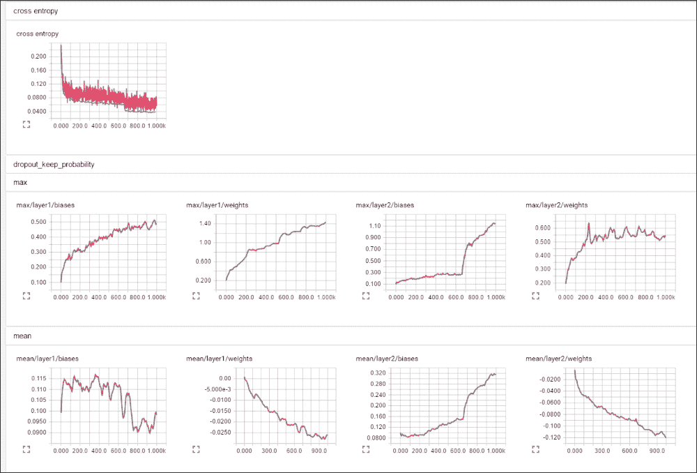
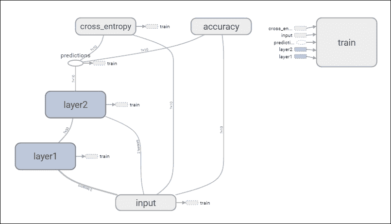
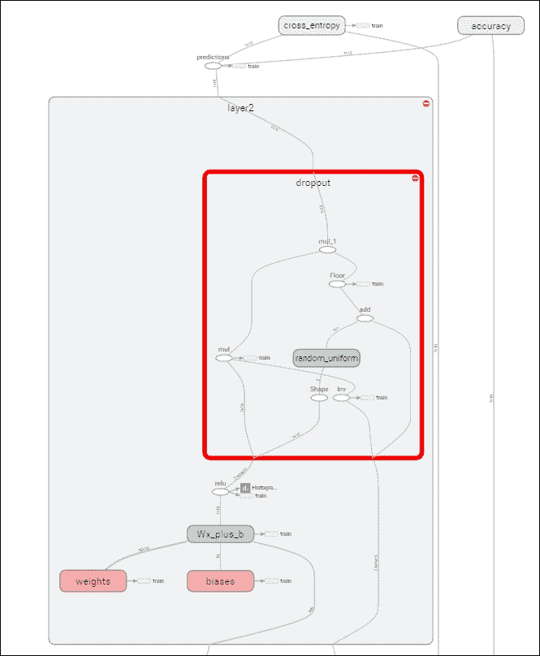

# 九、其他 Python 机器学习工具

在前面八章的过程中，我们研究并应用了一系列技术，这些技术帮助我们丰富和建模许多应用程序的数据。

我们使用 Python 库的组合来处理这些章节中的内容，特别是 NumPy 和 antao，而其他库是在我们需要访问特定算法时使用的。我们没有花太多时间讨论工具方面还存在哪些选项，这些工具的独特优势是什么，或者我们为什么会感兴趣。

这最后一章的主要目标是突出一些您可以使用的其他关键库和框架。这些工具简化了创建和应用模型的过程。本章介绍了这些工具，演示了它们的应用，并提供了大量关于*进一步阅读*的建议。

成功解决数据科学挑战和成功成为数据科学家的一个主要贡献者是对算法和库的最新发展有很好的理解。作为专业人士，数据科学家往往高度依赖他们使用的数据质量，但拥有最佳可用工具也非常重要。

在本章中，我们将回顾数据科学家最近可用的一些最佳工具，确定它们提供的好处，并讨论如何在一致的工作过程中，将它们与本书前面讨论的工具和技术一起应用。

# 替代发展工具

在过去的几年里，出现了许多新的机器学习框架，它们在工作流方面具有优势。通常，这些框架高度关注特定的用例或目标。这使得它们非常有用，甚至可能是必备的工具，但这也意味着您可能需要使用多个工作流改进库。

随着越来越多的新 Python ML 项目被点亮以解决特定的工作流挑战，值得讨论两个库，它们增加了我们现有的工作流，并加速或改进了我们在前面几章中所做的工作。在本章中，我们将介绍**千层面**和 **TensorFlow** ，讨论每个库的代码和功能，并确定为什么每个框架都值得作为工具集的一部分来考虑。

## 千层面介绍

让我们面对它；有时候用 Python 创建模型的时间比我们希望的要长。然而，它们对于更复杂的模型来说可能是有效的，并提供了很大的好处(例如图形处理器加速和可配置性)。当处理简单的情况时，类似于 Anano 的库可能相对复杂。这是不幸的，因为我们经常希望使用简单的模型，例如，当我们建立基准时。

千层面是一个由深度学习和音乐数据挖掘研究人员团队开发的图书馆，作为 Anano 的界面。它是专门为确定一个特定的目标而设计的——允许快速有效地建立新模型的原型。

这个焦点决定了如何创建 Lasagne，以一种比用本机代码编写的相同操作简单得多且更容易理解的方式调用函数并返回表达式或数据类型。

在这一节中，我们将看一下 Lasagne 底层的概念模型，应用一些 Lasagne 代码，并了解该库为我们现有的实践添加了什么。

### 了解千层面

千层面使用层的概念进行操作，这是机器学习中常见的概念。层是一组神经元和操作规则，它们接受输入并生成分数、标签或其他转换。神经网络通常充当一组层，在一端输入数据，在另一端输出值(尽管实现方式各不相同)。

在深度学习环境中，开始将单个层视为一等公民已经变得非常流行。传统上，在机器学习工作中，网络将仅使用几个参数规格(如节点数、偏差和权重值)从层建立。

近年来，寻求额外优势的科学家们开始对单个层的配置越来越感兴趣。如今，在高级机器学习环境中，看到包含子模型和转换输入的层并不罕见。如今，即使是要素也可能根据需要跳过图层，新要素可能会在模型的中途添加到图层中。作为这种改进的一个例子，考虑谷歌用来解决图像识别挑战的卷积神经网络架构。这些网络在层级别进行了广泛的改进，以提高性能。

因此，千层面将图层视为其基本模型组件是有意义的。千层面为模型创建过程增加的是快速直观地将不同层堆叠到模型中的能力。你可以简单地在`lasagne.layers`内调用一个类，将一个类堆叠到你的模型上。这方面的代码非常高效，如下所示:

```py
l0 = lasagne.layers.InputLayer(shape=X.shape)

l1 = lasagne.layers.DenseLayer(
l0, num_units=10, nonlinearity=lasagne.nonlinearities.tanh)

l2 = lasagne.layers.DenseLayer(l1, num_units=N_CLASSES, nonlinearity=lasagne.nonlinearities.softmax)
```

在三个简单的语句中，我们使用简单且可配置的函数创建了网络的基本结构。

这段代码使用三层创建一个模型。层`l0`调用`InputLayer`类，作为我们模型的输入层。该图层基于输入的预期形状(使用`shape`参数定义)，将我们的输入数据集转换为张量。

接下来的层`l1`和`l2`都是完全连接(密集)的层。图层`l2`定义为输出图层，单位数等于类数，而`l1`使用相同的`DenseLayer`类创建`10`单位的隐藏图层。

除了配置`DenseLayer`类可用的标准参数(权重、偏差、单位计数和非线性类型)之外，还可以使用使用不同类别的完全不同的网络类型。千层面为一系列常见的层提供分类，包括密集层、卷积层和汇集层、循环层、归一化层和噪声层等。此外，还有一个特殊用途的层类，它提供了一系列附加功能。

当然，如果需要比这些类提供的更多的定制，用户可以很容易地定义自己的图层类型，并将其与其他千层面类结合使用。然而，对于大多数原型开发和快速迭代开发环境来说，这是大量的预先准备的功能。

千层面提供了类似简洁的界面来定义网络的损失计算:

```py
true_output = T.ivector('true_output')
objective = lasagne.objectives.Objective(l2, loss_function=lasagne.objectives.categorical_crossentropy)

loss = objective.get_loss(target=true_output)
```

这里定义的`loss`函数是许多可用函数中的一个，包括平方误差、二进制和多类情况下的铰链损失以及`crossentropy`函数。还提供了用于验证的准确性评分功能。

有了这两个组件，一个`loss`功能和一个网络架构，我们再次拥有了训练网络所需的一切。为此，我们需要编写更多的代码:

```py
all_params = lasagne.layers.get_all_params(l2)
updates = lasagne.updates.sgd(loss, all_params, learning_rate=1)
train = theano.function([l0.input_var, true_output], loss, updates=updates)

get_output = theano.function([l0.input_var], net_output)

for n in xrange(100):
 train(X, y)
```

这段代码利用`theano`功能来训练我们的示例网络，使用我们的`loss`功能来迭代训练给定的一组输入数据。

## 张量流简介

当我们回顾谷歌在第四章*卷积神经网络*中对 **卷积神经网络** ( **CNN** )的看法时，我们发现了一个令人费解的多层野兽。如何创建和监控此类网络的问题变得越来越重要，因为网络在层数和复杂性上不断扩展，以应对更复杂的挑战。

为了应对这一挑战，谷歌的机器智能研究组织开发并分发了一个名为 TensorFlow 的库，该库的存在是为了能够更容易地细化和建模非常复杂的机器学习模型。

TensorFlow 通过提供两个主要好处来做到这一点；一个清晰简单的编程接口(在本例中是一个 Python API)到熟悉的结构上(例如 NumPy 对象)，以及强大的诊断和图形可视化工具，例如 **TensorBoard** ，以实现对数据架构的明智调整。

### 了解张量流

TensorFlow 使数据科学家能够将数据转换操作设计为跨计算图的流。该图可以扩展和修改，同时可以广泛调整单个节点，从而实现对单个层或模型组件的详细细化。TensorFlow 工作流通常包括两个阶段。其中的第一个阶段被称为构建阶段，在此期间组装图表。

在构建阶段，我们可以使用针对 Tensorflow 的 Python API 编写代码。像 Lasagne 一样，TensorFlow 提供了一个相对简单的界面来编写网络层，只需要我们在创建层之前指定权重和偏差。以下示例显示了在创建(使用一行代码)卷积层和简单的最大池层之前，权重和偏差变量的初始设置。此外，我们使用`tf.placeholder`为输入数据生成占位符变量。

```py
x = tf.placeholder(tf.float32, shape=[None, 784])
y_ = tf.placeholder(tf.float32, shape=[None, 10])

W = tf.Variable(tf.zeros([5, 5, 1, 32]))
b = tf.Variable(tf.zeros([32]))

h_conv = tf.nn.relu(conv2d(x_image, W) + b)
h_pool = max_pool_2x2(h_conv)
```

这个结构可以扩展到包括一个`softmax`输出层，就像我们对千层面所做的那样。

```py
W_out = tf.Variable(tf.zeros([1024,10]))
B_out = tf.Variable(tf.zeros([10]))

y = tf.nn.softmax(tf.matmul(h_conv, W_out) + b_out)
```

同样，我们可以看到在迭代时间上比直接在 antao 和 Python 库中编写有显著的改进。由于是用 C++编写的，TensorFlow 还提供了优于 Python 的性能提升，在执行时间上具有优势。

接下来，我们需要训练和评估我们的模型。在这里，我们需要写一点代码来定义我们用于训练的`loss`函数(在这种情况下是交叉熵)，用于验证的`accuracy`函数和优化方法(在这种情况下是最陡梯度下降)。

```py
cross_entropy = tf.reduce_mean(-tf.reduce_sum(y_ * tf.log(y), reduction_indices=[1]))

train_step = tf.train.GradientDescentOptimizer(0.5).minimize(cross_entropy)

correct_prediction = tf.equal(tf.argmax(y_,1), tf.argmax(y_,1))

accuracy = tf.reduce_mean(tf.cast(correct_prediction, tf.float32))
```

接下来，我们可以简单地开始迭代运行我们的模型。这一切简洁明了:

```py
sess.run(tf.initialize_all_variables())
for i in range(20000):
  batch = mnist.train.next_batch(50)
  if i%100 == 0:
    train_accuracy = accuracy.eval(feed_dict={
        x:batch[0], y_: batch[1], keep_prob: 1.0})
    print("step %d, training accuracy %g"%(i, train_accuracy))
  train_step.run(feed_dict={x: batch[0], y_: batch[1], keep_prob: 0.5})

print("test accuracy %g"%accuracy.eval(feed_dict={
    x: mnist.test.images, y_: mnist.test.labels, keep_prob: 1.0}))
```

### 使用张量流迭代改进我们的模型

甚至从前面部分的单个例子中，我们应该能够认识到张量流给表带来了什么。它为开发复杂的体系结构和训练方法的任务提供了一个简单的界面，使我们更容易访问我们在本书前面学习过的算法。

然而，正如我们所知，开发初始模型只是模型开发过程的一小部分。我们通常需要反复测试和剖析我们的模型，以提高它们的性能。然而，这往往是一个领域，我们的工具在单一的库或技术中不太统一，测试和监控解决方案在不同的模型中不太一致。

TensorFlow 致力于解决如何在迭代过程中更好地洞察我们的模型的问题，即所谓的模型开发的执行阶段。在执行阶段，我们可以利用 TensorFlow 团队提供的工具来探索和改进我们的模型。

也许这些工具中最重要的是 TensorBoard，它为我们构建的模型提供了一个可探索的可视化表示。TensorBoard 提供了几种功能，包括显示基本模型信息(包括测试和/或培训的每次迭代期间的性能测量)的仪表板。



此外，TensorBoard 仪表板提供了较低层次的信息，包括每个模型层的权重、偏差和激活值的值范围图；迭代过程中非常有用的诊断信息。访问这些数据的过程非常简单，而且非常有用。


除此之外，张量积提供了给定模型的张量流的详细图形。张量是一个 n 维的数据数组(在这种情况下，由 n 个特征组成)；当我们使用术语*输入数据集*时，我们往往会想到这一点。应用于张量的一系列运算被称为张量流，在张量流中，这是一个基本概念，原因很简单，也很有说服力。当细化和调试机器学习模型时，重要的是即使在很低的级别上也要有关于模型及其操作的信息。



TensorBoard 图以可变的细节显示了模型的结构。从这个初始视图中，可以深入到模型的每个组件和连续的子元素中。在这种情况下，我们能够查看在第二个网络层的丢弃功能中发生的具体操作。我们可以看到发生了什么，并确定下一次迭代需要调整什么。

这种级别的透明度是不寻常的，当我们想要调整模型组件时，尤其是当模型元素或层表现不佳时(例如，从显示层元参数值的 TensorBoard 图或从整体网络性能来看)，这种透明度非常有帮助。

可以从事件日志中创建 TensorBoards，并在运行 TensorFlow 时生成。这使得在使用 TensorFlow 的日常开发过程中，很容易获得 TensorBoards 的好处。



截至 2016 年 4 月下旬，DeepMind 团队加入了谷歌大脑团队和其他一系列研究人员和开发人员使用 TensorFlow。通过让 TensorFlow 开源并免费提供，谷歌承诺继续支持 TensorFlow，将其作为模型开发和完善的强大工具。

## 知道何时使用这些库

在这一章的一两点，我们可能遇到了*的问题好吧，那么，你为什么不一开始就教我们这个库呢？*当本章呈现出让生活变得更轻松的完美界面时，公平地问一下我们为什么要花时间在蚂蚁函数和其他低级信息中挖掘。

自然，我主张使用现有的最佳工具，尤其是对于原型任务，在这些任务中，工作的价值更多的是理解你所处的大致范围，或者识别特定的问题类别。值得一提的是，在本书的前面，没有使用这两个库展示内容的三个原因。

第一个原因是这些工具只能让你走这么远。他们可以做很多事情，同意，所以根据领域和该领域的问题的性质，一些数据科学家可能能够依靠他们来满足大多数深度学习需求。当然，除了一定程度的性能和问题复杂性之外，您还需要了解在 antio 中构建模型需要什么，从头开始创建自己的评分函数，或者利用本书中描述的其他技术。

决定关注教学底层实现的另一部分是关于相关技术的发展成熟度。在这一点上，千层面和 TensorFlow 绝对值得大家讨论和推荐。在此之前，当这本书的大部分内容被写出来时，在本章中讨论图书馆的风险更大。基于 antio 的项目很多(本章没有讨论的一些更突出的框架有 **Keras** 、 **Blocks** 和T7】派尔恩 2

即使是现在，不同的库和工具完全有可能在一两年后成为讨论的主题或默认的工作环境。这一领域的发展速度极快，这主要是由于关键公司和研究团体的影响，他们不得不随着旧工具达到其有用的极限而不断构建新工具……或者只是变得清楚如何做得更好。

老实说，从更低的层面挖掘的另一个原因是，这是一本复杂的书。它把理论和代码放在一起，用代码来教授理论。抽象出算法是如何工作的，并简单地讨论如何应用它们来破解一个特定的例子可能很有诱惑力。本章中讨论的工具使实践者能够在一些问题上获得非常好的分数，而不必理解被调用的函数。我的观点是，这不是一个很好的培养数据科学家的方法。

如果你要处理微妙而困难的数据问题，你需要能够修改和定义自己的算法。你需要了解如何选择合适的解决方案。要做这些事情，你需要本书提供的细节，甚至更具体的信息，由于(页面)空间和时间的限制，我没有提供。在这一点上，你可以灵活而有知识地应用深度学习算法。

同样，认识到这些工具做得好或不好也很重要。目前，Lasagne 非常适合这个用例，在这个用例中，一个新的模型正在被开发用于基准测试或者早期通过，优先考虑的应该是迭代速度和获得结果。

与此同时，TensorFlow 适合模型的后期开发寿命。当轻松的收益消失，需要花费大量时间调试和改进模型时，TensorFlow 相对快速的迭代是一个明显的优势，但 TensorBoard 提供的诊断工具带来了巨大的附加值。

因此，这两个库在您的工具集中都有一席之地。根据手头问题的性质，这些库和更多库将被证明是有价值的资产。

# 进一步阅读

千层面用户指南非常全面，值得一读。在[http://lasagne.readthedocs.io/en/latest/index.html](http://lasagne.readthedocs.io/en/latest/index.html)找到。

同样，可以在[https://www . TensorFlow . org/versions/r 0 . 9/get _ start/index . html](https://www.tensorflow.org/versions/r0.9/get_started/index.html)找到 TensorFlow 教程。

# 总结

在这最后一章中，我们离开了之前关于算法、配置和诊断的讨论，转而考虑在实现深度学习算法时改善我们体验的工具。

我们发现了使用千层面的优势，千层面是一个与人工智能的接口，旨在加速和简化我们模型的早期原型。同时，我们检查了 TensorFlow，这是谷歌开发的帮助深度学习模型调整和优化的库。TensorFlow 以最少的努力为我们提供了模型性能的显著可见性，并使诊断和调试复杂的深层模型结构的任务不那么具有挑战性。

这两种工具在我们的过程中都有自己的位置，每一种都适合于一组特定的问题。

在这本书的整个过程中，我们已经浏览并回顾了一系列先进的机器学习技术。我们从一个理解一些基本算法和概念的位置，到自信地使用一个非常流行、强大和受欢迎的工具集。

然而，除了技术之外，这本书试图教一个更进一步的概念，一个更难教和更难学的概念，但它支撑了机器学习的最佳表现。

机器学习领域发展非常迅速。这种速度在几乎每周发布在学术期刊或行业白皮书上的新的和改进的分数中显而易见。从 MNIST 这样的训练例子如何从被视为有意义的挑战迅速转变为 Iris 数据集的深度学习版本*玩具问题*就可以看出这一点。与此同时，该领域进入下一个重大挑战；CIFAR-10，CIFAR-100。

同时，磁场循环运动。像 Yann LeCun 这样的学者在 80 年代提出的概念正在复兴，因为计算架构和资源的增长使得它们的使用比大规模的真实数据更可行。为了最大限度地使用许多最新的技术，有必要理解几十年前定义的概念，这些概念本身是在更久以前定义的其他概念的基础上定义的。

这本书试图平衡这些问题。了解前沿和现有技术至关重要；理解将定义新技术的概念或两三年后做出的调整同样重要。

然而，最重要的是，这本书让你了解了这些架构和方法的延展性。在数据科学实践的顶端一直看到的一个概念是，特定问题的最佳解决方案是特定问题的解决方案。

这就是为什么顶级的卡格尔竞赛获胜者会进行大量的特性准备并调整他们的架构。这就是为什么 TensorFlow 被写为允许清晰地看到一个人的架构的粒度属性。拥有熟练调整实现或组合算法的知识和技能是真正掌握机器学习技术的必要条件。

通过本书中回顾的许多技术和例子，我希望关于数据问题的思考方式以及对操作和配置这些算法的信心已经传递给了作为一名实践数据科学家的你。本书中许多推荐的*进一步阅读*的例子很大程度上是为了进一步扩展这些知识，并帮助你发展本书中教授的技能。

除此之外，我祝你在模型构建和配置方面一切顺利。我希望你能亲身体会到这个领域是多么令人愉快和值得！