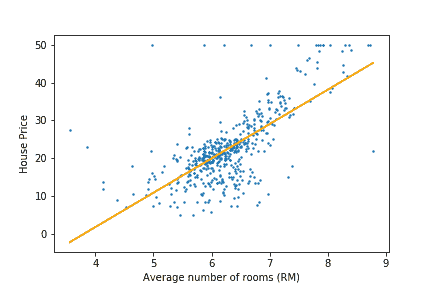
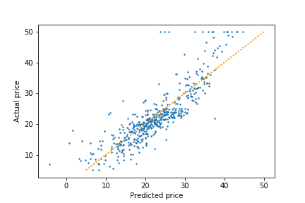
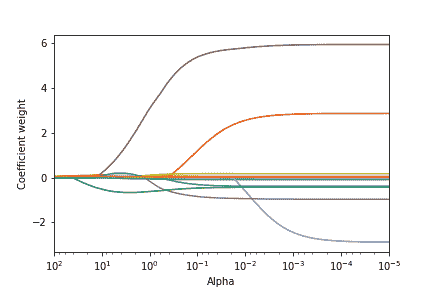
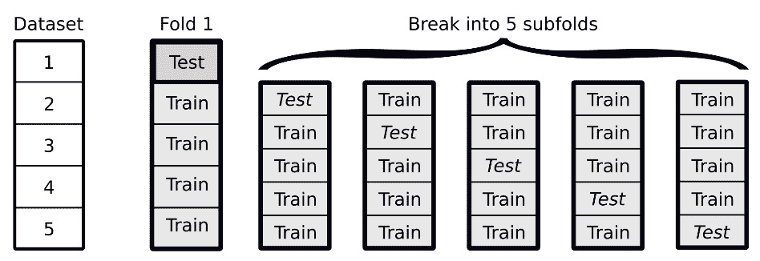
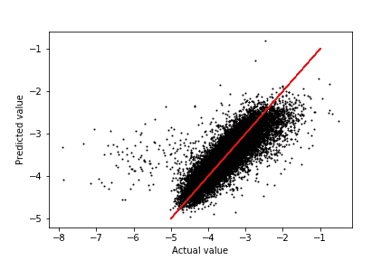
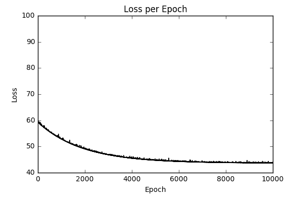
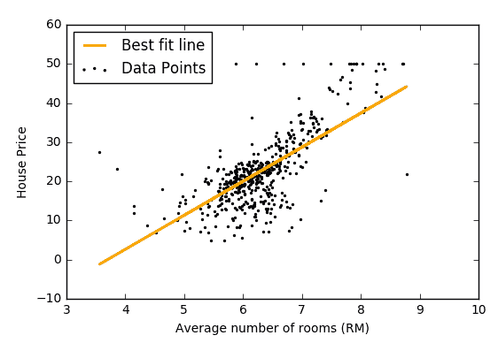

# 回归

你可能已经在高中数学课上学习了回归。你学的具体方法大概就是所谓的**普通最小二乘** ( **OLS** )回归。这项有 200 年历史的技术计算速度很快，可以用于许多现实世界的问题。本章将从回顾它开始，并向您展示如何在 scikit-learn 中使用它。

然而，对于某些问题，这种方法是不够的。当我们有很多特征时尤其如此，当我们的特征多于数据点时，这种方法就完全失败了。在这种情况下，我们需要更先进的方法。这些方法非常现代，在过去的 20 年里有了重大发展。它们被命名为套索、脊或弹性绳。我们将详细讨论这些问题。它们也在 scikit-learn 中提供。在本章中，我们将学习以下内容:

*   如何在 scikit-learn 中使用不同形式的线性回归
*   适当的交叉验证的重要性，特别是当我们有很多特性时
*   何时以及如何使用两层交叉验证来设置超参数

# 回归预测房价

让我们从一个简单的问题开始，即预测波士顿的房价。问题如下:我们被赋予几个人口和地理属性，例如犯罪率或附近的师生比。目标是预测一个特定地区的房子的中值。与分类的情况一样，我们有一些训练数据，希望构建一个可以推广到其他数据的模型。

这是 scikit-learn 附带的内置数据集之一，因此很容易将数据加载到内存中:

```py
from sklearn.datasets import load_boston 
boston = load_boston() 
```

`boston`对象包含多个属性；具体来说，`boston.data`包含输入数据，`boston.target`包含以千美元为单位的房价。

我们将从一个简单的一维回归开始，试图在一个单一的属性上回归价格:附近每个住宅的平均房间数。我们可以使用你可能在高中时第一次看到的标准最小二乘回归方法。

我们的第一次尝试是这样的:

```py
from sklearn.linear_model import LinearRegression 
lr = LinearRegression() 
```

我们从`sklearn.linear_model`模块导入`LinearRegression`并构建一个`LinearRegression`对象。这个对象的行为类似于我们之前使用的 scikit-learn 中的分类器对象。

我们将使用的功能存储在位置`5`。目前，我们只使用一个功能；在本章的后面，我们将使用它们。有关数据的详细信息，您可以咨询`boston.DESCR`和`boston.feature_names`。`boston.target`属性包含平均房价(我们的目标变量):

```py
# Feature 5 is the number of rooms.
x = boston.data[:,5] 
y = boston.target 
x = np.transpose(np.atleast_2d(x)) 
lr.fit(x, y) 
```

这个代码块中唯一不明显的一行是对`np.atleast_2d`的调用，它将`x`从一维数组转换为二维数组。这种转换是必要的，因为`fit`方法期望二维数组作为其第一个参数。最后，为了正确计算维度，我们需要转置这个数组。

请注意，我们正在对`LinearRegression`对象调用名为`fit`和`predict`的方法，就像我们对分类器对象所做的那样，尽管我们现在正在执行回归。API 中的这种规律性是 scikit-learn 的良好特性之一。

我们可以很容易地绘制出`fit`:

```py
from matplotlib import pyplot as plt 
fig,ax = plt.subplots() 
ax.scatter(x, y) 
xmin = x.min() 
xmax = x.max() 
ax.plot([xmin, xmax], 
        [lr.predict(xmin), lr.predict(xmax)], 
        '-', lw=2, color="#f9a602") 
ax.set_xlabel("Average number of rooms (RM)") 
ax.set_ylabel("House Price") 
```

参考下图:



上图显示了所有的点(如点)和我们的拟合(实线)。我们可以看到，视觉上看起来不错，除了一些异常值。

然而，理想情况下，我们希望从数量上衡量这种匹配的好坏。为了能够比较替代方法，这一点至关重要。为此，我们可以测量我们的预测与真实值的接近程度。对于该任务，我们可以使用`sklearn.metrics`模块中的`mean_squared_error`功能:

```py
from sklearn.metrics import mean_squared_error 
```

该函数接受两个参数，真实值和预测值，如下所示:

```py
mse = mean_squared_error(y, lr.predict(x)) 
print("Mean squared error (of training data): {:.3}".format(mse)) 
Mean squared error (of training data): 43.6 
```

这个值有时可能很难解释，最好取平方根，得到**均方根误差** ( **RMSE** ):

```py
rmse = np.sqrt(mse) 
print("RMSE (of training data): {:.3}".format(rmse)) 
RMSE (of training data): 6.6 
```

使用`RMSE`的一个优点是，我们可以通过将其乘以 2 来快速获得非常粗略的误差估计。在我们的情况下，我们可以预计估计价格与实际价格最多相差 13，000 美元。

Root mean squared error and prediction:
Root mean squared error corresponds approximately to an estimate of the standard deviation. Since most data is at most two standard deviations from the mean, we can double our `RMSE` to obtain a rough confident interval. This is only completely valid if the errors are normally distributed, but it is often roughly correct even if they are not.

像`6.6`这样的数字，没有领域知识还是很难马上理解。这是一个好的预测吗？回答这个问题的一个可能方法是将其与最简单的基线，常数模型进行比较。如果我们对输入一无所知，我们能做的最好的事情就是预测输出永远是`y`的平均值。然后，我们可以将该模型的均方误差与零模型的均方误差进行比较。这一思想在**决定系数**中被形式化，定义如下:


在这个公式中， *y <sub>i</sub>* 用指数 *i* 表示元素的值，而是通过回归模型得到的同一元素的估计值。最后，是 *y* 的平均值，代表总是返回相同值的空模型。这与首先计算均方误差与输出方差的比值，最后考虑 1 减去该比值大致相同。这样，完美模型的得分为 1，而空模型的得分为零。请注意，有可能获得一个负的分数，这意味着模型是如此之差，以至于使用平均值作为预测会更好。

使用`sklearn.metrics`模块的`r2_score`可以获得确定系数:

```py
from sklearn.metrics import r2_score 
r2 = r2_score(y, lr.predict(x)) 
print("R2 (on training data): {:.2}".format(r2)) 
R2 (on training data): 0.48 
```

这一衡量标准也被称为`r2`分数。如果您正在使用线性回归并评估训练数据的误差，那么它确实对应于相关系数 r 的平方。但是，这种度量更一般，正如我们所讨论的，甚至可能返回负值。

计算确定系数的另一种方法是使用`LinearRegression`对象的`score`方法:

```py
r2 = lr.score(x,y) 
```

# 多维回归

到目前为止，我们只使用了一个单一的变量进行预测:每个住宅的房间数量。显然，这不是我们能做的最好的。我们现在将使用多维回归，使用我们拥有的所有数据来拟合模型。我们现在试图基于多个输入预测单个输出(平均房价)。

代码看起来很像以前。事实上，这更简单，因为我们现在可以将`boston.data`的值直接传递给`fit`方法:

```py
x = boston.data 
y = boston.target 
lr.fit(x, y) 
```

使用所有输入变量，均方根误差仅为`4.7`，对应于`0.74`的确定系数(计算这些的代码与前面的例子相同)。这比我们之前得到的要好，这表明额外的变量确实有所帮助。但是我们不能再像以前那样轻松地显示回归线了，因为我们有一个 14 维的回归超平面，而不是一条直线！

在这种情况下，一个好的解决方案是绘制预测值与实际值的关系图。代码如下:

```py
p = lr.predict(x) 
fig,ax = plt.subplots() 
ax.scatter(p, y) 
ax.xlabel('Predicted price') 
ax.ylabel('Actual price') 
ax.plot([y.min(), y.max()], [[y.min()], [y.max()]], ':') 
```

最后一条线画了一条对角线，对应于完全一致；一个没有误差的模型意味着所有的点都位于这条对角线上。这有助于可视化:



# 回归的交叉验证

当我们引入分类时，我们强调了交叉验证对于检查预测质量的重要性。执行回归时，并不总是这样做。事实上，到目前为止，我们只讨论了本章中的训练错误。

如果你想自信地推断概括能力，这是一个错误。然而，由于普通最小二乘是一个非常简单的模型，这通常不是一个非常严重的错误。换句话说，过度拟合的量很小。我们仍然应该根据经验来测试这一点，这可以通过 scikit-learn 轻松实现。

我们将使用`Kfold`类构建一个五重交叉验证循环，测试线性回归的泛化能力:

```py
from sklearn.model_selection import KFold, cross_val_predict 
kf = KFold(n_splits=5) 
p = cross_val_predict(lr, x, y, cv=kf) 
rmse_cv = np.sqrt(mean_squared_error(p, y)) 
print('RMSE on 5-fold CV: {:.2}'.format(rmse_cv)) 
RMSE on 5-fold CV: 6.1 
```

通过交叉验证，我们得到了更保守的估计(即误差更大):`6.1`。就像在分类的情况下一样，交叉验证估计是一个更好的估计，表明我们可以在看不见的数据上进行预测。

普通最小二乘法学习时间快，返回简单模型，预测时间快。然而，我们现在将看到更先进的方法，以及为什么它们有时更可取。

# 惩罚或正则化回归

本节介绍惩罚回归，也称为**正则化或惩罚回归**，一类重要的回归模型。

在普通回归中，返回的拟合是训练数据上的最佳拟合。这会导致过度装配。惩罚意味着我们对参数值的过度自信进行惩罚。因此，为了有一个更简单的模型，我们接受稍微差一点的拟合。

另一种思考方式是认为默认情况下输入变量和输出预测之间没有关系。当我们有数据时，我们会改变这种观点，但增加一个惩罚意味着我们需要更多的数据来说服我们这是一种强有力的关系。

Penalized regression is about trade-offs:
Penalized regression is another example of the bias-variance trade-off. When using a penalty, we get a worse fit in the training data, as we are adding bias. On the other hand, we reduce the variance and tend to avoid over-fitting. Therefore, the overall result might generalize better to unseen (test) data.

# L1 和 L2 的点球

我们现在详细探讨这些想法。不关心某些数学方面的读者可以直接跳到下一节，学习如何在 scikit-learn 中使用正则回归。

总的来说，问题是我们得到了训练数据的矩阵 *X* (行是观察值，每列是不同的特征)，以及输出值的向量 *y* 。目标是获得一个权重向量，我们称之为 *b** 。普通最小二乘回归由以下公式给出:


也就是说，我们找到向量 *b* ，它最小化到目标的平方距离 *y* 。在这些方程中，我们忽略了设置截距的问题，假设训练数据已经过预处理，因此 *y* 的平均值为零。

增加惩罚或正则化意味着我们不仅考虑训练数据的最佳拟合，还考虑向量是如何组成的。有两种类型的处罚通常用于回归:L1 和 L2 处罚。L1 惩罚意味着我们用系数绝对值的和来惩罚回归，而 L2 惩罚是用平方和来惩罚。

当我们添加一个 L1 惩罚，而不是前面的等式，我们改为优化以下内容:


这里，我们试图同时使误差变小，但也使系数的值变小(以绝对值计)。使用 L2 惩罚意味着我们使用以下公式:


区别相当微妙:我们现在用系数的平方而不是绝对值来惩罚。然而，结果的差异是巨大的。

Ridge, Lasso, and ElasticNets:
These penalized models often go by rather interesting names. The L1 penalized model is often called the Lasso, while an L2 penalized one is known as Ridge regression. When using both, we call this an `ElasticNet` model.

套索和脊线导致的系数都小于未启用的回归(绝对值较小，忽略符号)。然而，套索还有一个额外的属性:它导致许多系数被设置为零！这意味着最终模型甚至不使用它的一些输入特征；模型为**稀疏**。这通常是一个非常理想的属性，因为模型在单个步骤中执行特征选择和 **r** **分离**。

你会注意到，每当我们增加一个惩罚时，我们也会增加一个权重 *α* ，它决定了我们想要多少惩罚。当 *α* 接近于零时，我们非常接近于未未化回归(其实如果你把 *α* 设置为零，你就简单的执行 OLS)，而当 *α* 较大时，我们有一个和未化非常不一样的模型。

山脊模型比较古老，因为套索很难用纸和笔计算。然而，有了现代计算机，我们可以像使用 Ridge 一样轻松地使用 Lasso，甚至可以将它们组合起来形成松紧带。一`ElasticNet`有两个惩罚，一个是绝对值惩罚，一个是平方惩罚，它求解如下方程:


这个公式是前面两个公式的组合，有两个参数，*α<sub>1</sub>T3*α<sub>2</sub>T7】。在本章的后面，我们将讨论如何为参数选择一个好的值。**

# 在 scikit-learn 中使用套索或弹性网

让我们修改前面的例子来使用弹性线。使用 scikit-learn，很容易将`ElasticNet`回归器替换为我们之前的最小二乘回归器:

```py
from sklearn.linear_model import Lasso 
las = Lasso(alpha=0.5) 
```

现在我们使用`las`，而之前我们使用`lr`。这是唯一需要的改变。结果正是我们所期望的。使用`Lasso`时，训练数据上的`R2`减少到`0.71`(之前是`0.74`，但是交叉验证拟合现在是`0.59`(与线性回归的`0.56`相反)。为了获得更好的泛化能力，我们对训练数据进行了较大误差的处理。

# 可视化套索路径

使用 scikit-learn，我们可以轻松地可视化正则化参数(`alphas`)的值发生变化时会发生什么。我们将再次使用波士顿数据，但现在我们将使用`Lasso regression`对象:

```py
las = Lasso() 
alphas = np.logspace(-5, 2, 1000) 
alphas, coefs, _= las.path(x, y,
                           alphas=alphas) 
```

对于 alphas 中的每个值，`Lasso`对象上的`path`方法返回用该参数值解决`Lasso`问题的系数。因为结果随 alpha 平滑变化，所以可以非常有效地计算。

可视化该路径的一种典型方式是绘制系数随着α减小的值。您可以按如下方式进行:

```py
fig,ax = plt.subplots() 
ax.plot(alphas, coefs.T) 
# Set log scale 
ax.set_xscale('log') 
# Make alpha decrease from left to right 
ax.set_xlim(alphas.max(), alphas.min()) 
```

这导致了下面的图(我们省略了添加轴标签和标题的简单代码):



在该图中， *x* 轴显示从左到右正则化的减少量(α正在减少)。每一行显示不同的系数如何随着α的变化而变化。该图显示，当使用非常强的正则化(左侧，非常高的α)时，最佳解决方案是使所有值都恰好为零。随着正则化变弱，一个接一个地，不同系数的值首先上升，然后稳定。在某个时候，它们都趋于平稳，因为我们可能已经接近未实现的解决方案。

# p 大于 N 的场景

这一节的标题有点行话，你现在就要学会。在 20 世纪 90 年代，首先是在生物医学领域，然后是在网络上，问题开始出现在 P 大于 N 的地方。这意味着特征的数量 P 大于例子的数量 N(这些字母是这些概念的常规统计简写)。

例如，如果您的输入是一组书面文档，一种简单的方法是将字典中每个可能的单词视为一个特征，并在这些特征上进行回归(我们将在后面自己解决一个这样的问题)。在英语中，你有超过 20，000 个单词(这是如果你执行一些词干，只考虑普通单词；如果您跳过这个预处理步骤，它会增加十倍以上)。如果你只有几百个或者几千个例子，你会比例子有更多的特点。

在这种情况下，由于特征的数量大于示例的数量，所以有可能在训练数据上具有完美的拟合。这是一个数学事实，与你的数据无关。实际上，你在解一个线性方程组，方程比变量少。你可以找到一组训练误差为零的回归系数(事实上，你可以找到不止一个完美的解)。

然而，这是一个主要问题，零训练误差并不意味着你的解决方案会很好地推广。事实上，它可能概括得很差。在前面的例子中，正则化可以给你一点额外的提升，但是现在它绝对是一个有意义的结果所必需的。

# 基于文本文档的示例

我们现在来看一个来自卡耐基梅隆大学诺亚·史密斯教授研究小组的研究。这项研究是基于对美国公司向美国证券交易委员会提交的所谓 10-K 报告的挖掘。法律规定所有上市公司都必须提交此类文件。他们研究的目的是根据这条公开信息预测公司股票未来的波动性。在训练数据中，我们实际上使用的是我们已经知道结果的历史数据。

现有 16，087 个例子。这些特征已经为我们进行了预处理，对应不同的单词，总共 150，360 个。因此，我们有比例子多得多的特征，几乎是例子的十倍。在引言中，陈述了普通的最小回归在这些情况下是有用的，现在我们将通过尝试盲目地应用它来了解为什么。

数据集以 SVMLight 格式从多个来源获得，包括该书的配套网站。这是 scikit-learn 可以阅读的格式。正如名字所说，SVMLight 是一个支持向量机实现，也可以通过 scikit-learn 获得；现在，我们只对文件格式感兴趣:

```py
from sklearn.datasets import load_svmlight_file 
data,target = load_svmlight_file('E2006.train') 
```

在前面的代码中，数据是一个稀疏矩阵(也就是说，它的大部分条目是零，因此只有非零条目保存在内存中)，而目标是一个简单的一维向量。我们可以从观察目标的一些属性开始:

```py
print('Min target value: {}'.format(target.min())) 
Min target value: -7.89957807347 

print('Max target value: {}'.format(target.max())) 
Max target value: -0.51940952694 

print('Mean target value: {}'.format(target.mean())) 
Mean target value: -3.51405313669 

print('Std. dev. target: {}'.format(target.std())) 
Std. dev. target: 0.632278353911 
```

所以，我们可以看到数据位于`-7.9`和`-0.5`之间。现在我们对数据有了感觉，我们可以检查当我们使用 OLS 预测时会发生什么。请注意，我们可以使用与前面完全相同的类和方法:

```py
from sklearn.linear_model import LinearRegression 
lr = LinearRegression() 
lr.fit(data,target) 
pred = lr.predict(data) 
rmse_train = np.sqrt(mean_squared_error(target, pred)) 
print('RMSE on training: {:.2}'.format(rmse_train)) 
RMSE on training: 0.0024 

print('R2 on training: {:.2}'.format(r2_score(target, pred))) 
R2 on training: 1.0 
```

由于舍入误差，均方根误差不完全为零，但非常接近。决定系数为`1.0`。也就是说，线性模型报告了对其训练数据的完美预测。这是我们所期待的。

然而，当我们使用交叉验证时(代码与我们之前在 Boston 示例中使用的非常相似)，我们得到了非常不同的东西:`0.75`的`RMSE`，这对应于`-0.42`的负确定系数！这意味着如果我们总是预测`-3.5`的平均值，我们会比使用回归模型时做得更好！这是典型的 P 大于 N 的情况。

Training and generalization error:
When the number of features is greater than the number of examples, you always get zero training errors with OLS, except perhaps for issues due to rounding off. However, this is rarely a sign that your model will do well in terms of generalization. In fact, you may get zero training errors and have a completely useless model.

自然的解决方法是使用正则化来抵消过拟合。将惩罚参数设置为`0.1`后，我们可以尝试与`ElasticNet`学习者进行相同的交叉验证:

```py
from sklearn.linear_model import ElasticNet 
met = ElasticNet(alpha=0.1) 
met.fit(data, target) 
pred = met.predict(data) 

print('[EN 0.1] RMSE on training: {:.2}'.format(np.sqrt(mean_squared_error(target, pred)))) 
[EN 0.1] RMSE on training: 0.4 

print('[EN 0.1] R2 on training: {:.2}'.format(r2_score(target, pred))) 
[EN 0.1] R2 on training: 0.61  
```

因此，我们在训练数据上得到更差的结果。然而，我们更希望这些结果能很好地概括:

```py
kf = Kfold(n_splits=5) 
pred = cross_val_predict(met, data, target, cv=kf) 

rmse = np.sqrt(mean_squared_error(target, pred)) 
print('[EN 0.1] RMSE on testing (5 fold): {:.2}'.format(rmse)) 
[EN 0.1] RMSE on testing (5 fold): 0.4 

print('[EN 0.1] R2 on testing (5 fold): {:.2}'.format(r2_score(target, pred))) 
[EN 0.1] R2 on testing (5 fold): 0.61  
```

确实如此！与 OLS 的情况不同，使用`ElasticNet`，交叉验证的结果与训练数据相同。

然而，这个解决方案有一个问题，那就是阿尔法的选择。当使用默认值(`1.0`)时，结果会大不相同(甚至更糟)。

在这种情况下，我们作弊，因为作者之前尝试了一些值，看看哪些值会给出好的结果。这是无效的，并且会导致对信心的高估(我们正在查看测试数据，以决定使用哪些参数值，以及我们永远不应该使用哪些参数值)。下一节将解释如何正确地做到这一点，以及 scikit-learn 如何支持这一点。

# 以有原则的方式设置超参数

在前面的例子中，我们将惩罚参数设置为`0.1`。我们也可以将它设置为`0.7`或`23.9`。自然，结果每次都会有所不同。如果我们选择一个过大的值，我们就会得到不足。在极端情况下，学习系统将只返回每个等于零的系数。如果我们选择一个太小的值，我们就非常接近 OLS，这个值会过度拟合并且泛化能力很差(正如我们之前看到的)。

我们如何选择一个好的价值？这是机器学习中的一个普遍问题:为我们的学习方法设置参数。一个通用的解决方案是使用交叉验证。我们挑选一组可能的值，然后使用交叉验证来选择哪一个是最好的。这执行更多的计算(如果我们使用五倍，则执行五倍以上)，但总是适用且无偏见的。

不过，我们必须小心。为了获得泛化的无偏估计，必须使用**两级交叉验证**:顶层是估计系统的泛化能力，而第二层是得到好的参数。也就是说，我们将数据分成例如五份。我们从第一个折叠开始，然后学习其他四个折叠。现在，为了选择参数，我们再次将它们分成五个折叠。一旦我们设置了参数，我们就在第一次折叠时进行测试。现在我们再重复四次:



上图显示了如何将单个训练文件夹分解为子文件夹。我们需要对所有其他折叠重复这个过程。在这种情况下，我们看到的是五个外折叠和五个内折叠，但没有理由使用相同数量的外折叠和内折叠；你可以使用任何你想要的号码，只要你保持折叠分开。

这导致了大量的计算，但为了正确地做事，这是必要的。问题是，如果您使用任何数据点来对您的模型做出任何决定(包括设置哪些参数)，您就不能再使用相同的数据点来测试您的模型的泛化能力。这是一个微妙的点，可能不会立即显而易见。事实上，仍然有很多机器学习的用户误解了这一点，高估了他们的系统做得有多好，因为他们没有正确地执行交叉验证！

幸运的是，scikit-learn 使做正确的事情变得非常容易；它提供了名为`LassoCV`、`RidgeCV`和`ElasticNetCV`的类，所有这些类都封装了一个内部交叉验证循环来优化必要的参数(因此在类名的末尾有字母`CV`)。除了我们不需要为 alpha 指定任何值之外，代码几乎与前面的代码完全相同:

```py
from sklearn.linear_model import ElasticNetCV 
met = ElasticNetCV() 
kf = KFold(n_splits=5) 
p = cross_val_predict(met, data, target, cv=kf) 
r2_cv = r2_score(target, p) 
print("R2 ElasticNetCV: {:.2}".format(r2_cv)) 
R2 ElasticNetCV: 0.65 
```

这会导致大量的计算，因此，根据您的计算机的速度，您可能希望在等待时冲泡一些咖啡或茶。通过利用多个处理器，您可以获得更好的性能。这是 scikit-learn 的一个内置特性，通过使用`ElasticNetCV`构造函数的`n_jobs`参数可以非常简单地访问它。要使用四个中央处理器，请使用以下代码:

```py
met = ElasticNetCV(n_jobs=4) 
```

将`n_jobs`参数设置为`-1`以使用所有可用的 CPU:

```py
met = ElasticNetCV(n_jobs=-1) 
```

你可能想知道为什么，如果弹性有两个惩罚——L1 和 L2 惩罚——我们只需要为阿尔法设置一个值。事实上，这两个值是通过分别指定 alpha 和`l1_ratio`变量来指定的。然后*α<sub>1</sub>T5*α*T8】2 设置如下(其中 *ρ* 代表`l1_ratio`):*


在直观意义上，alpha 设置正则化的总量，而`l1_ratio`设置不同类型的正则化，L1 和 L2 之间的权衡。

我们可以要求`ElasticNetCV`对象测试`l1_ratio`的不同值，如下代码所示:

```py
l1_ratio=[.01, .05, .25, .5, .75, .95, .99] 
met = ElasticNetCV(l1_ratio=l1_ratio, n_jobs=-1) 
```

文档中推荐使用这组`l1_ratio`值。它将测试几乎像 Ridge 的车型(当`l1_ratio`是`0.01`或`0.05`时)以及几乎像 Lasso 的车型(当`l1_ratio`是`0.95`或`0.99`时)。因此，我们探索了各种不同的选择。

Because of its flexibility and its ability to use multiple CPUs, `ElasticNetCV` is an excellent default solution for regression problems when you don't have any particular reason to prefer one type of model over the rest. In very simple problems, use ordinary least squares.

综上所述，我们现在可以在这个大数据集上可视化预测与实际拟合:

```py
l1_ratio = [.01, .05, .25, .5, .75, .95, .99] 
met = ElasticNetCV(l1_ratio=l1_ratio, n_jobs=-1) 
pred = cross_val_predict(met, data, target, cv=kf) 
fig, ax = plt.subplots() 
ax.scatter(pred, y) 
ax.plot([pred.min(), pred.max()], [pred.min(), pred.max()]) 
```

这将产生以下图:



我们可以看到，在数值范围的底端，预测不太匹配。这可能是因为目标范围的这一端的元素少了很多(这只会影响一小部分数据点)。

# 用张量流回归

我们将在未来的章节中深入讨论张量流，但是正则化线性回归可以用它来实现，所以了解张量流的工作原理是个好主意。

Details on how TensorFlow is structured will be tackled in [Chapter 8](08.html), *Artificial Neural Networks and Deep Learning*. Some of its scaffolding may seem odd, and there will be lots of magic numbers. Still, we will progressively use more of it for some small examples.

让我们尝试在这个实验中使用波士顿数据集。

```py
import tensorflow as tf
```

TensorFlow 要求您为它处理的所有元素创建符号。这些可以是变量或占位符。前者是张量流将改变的符号，而占位符是张量流从外部强加的。

对于回归，我们需要两个占位符，一个用于输入特征，一个用于我们想要匹配的输出。我们还需要两个变量，一个是斜率，一个是截距。与线性回归相反，我们必须为相同的功能编写更多的代码:

```py
X = tf.placeholder(shape=[None, 1], dtype=tf.float32, name="X")
Y = tf.placeholder(shape=[None, 1], dtype=tf.float32, name="y")
A = tf.Variable(tf.random_normal(shape=[1, 1]), name="A")
b = tf.Variable(tf.random_normal(shape=[1, 1]), name="b")
```

这两个占位符的形状为`[None, 1]`。这意味着它们沿着一个轴具有动态大小，并且在最快的维度上具有 1 的大小(就存储器布局而言)。这两个变量是完全静态的，维度为`[1, 1]`，表示单个元素。它们都将由张量流按照随机变量(均值为`0`方差为`1`的高斯)初始化。

符号的类型可以通过使用`dtype`来设置，或者对于变量，可以从`initial_value`的类型来推断。在本例中，它将始终是一个浮点值。

All symbols can have a name and many TensorFlow functions take a `name` argument. It is good practice to give clear names, as TensorFlow errors will display them. If they are not set, TensorFlow will create new default names that can be difficult to decipher.

现在所有的符号都创建好了，我们现在可以创建`loss`函数了。我们首先创建预测，然后将它与地面真实值进行比较:

```py
model_output = tf.matmul(X, A) + b
loss = tf.reduce_mean(tf.square(Y - model_output))
```

预测的乘法好像转置了，这是由于`X`的定义方式:确实转置了！这允许`model_output`具有动态的第一维度。

我们现在可以用梯度下降最小化这个`cost`函数。首先，我们创建张量流对象:

```py
grad_step = 5e-7
my_opt = tf.train.GradientDescentOptimizer(grad_step)
train_step = my_opt.minimize(loss)
```

The gradient step is a crucial aspect of all TensorFlow objects. We will explore this further later; the important aspect is to know that this step depends on the data and the `cost` function used. There are other optimizers available in TensorFlow; gradient descent is the simplest and one of the most adapted to this case.

我们还需要一些变量:

```py
batch_size = 50
n_epochs = 20000
steps = 100
```

批量表示我们一次要计算多少元素的损失。这也是占位符输入数据的维度，也是我们在优化过程中预测的输出维度。

Epochs 是我们遍历所有训练数据以优化模型的次数。最后，步骤只是我们显示我们优化的`loss`功能信息的频率。

现在我们可以进行最后一步，让 TensorFlow 释放我们拥有的函数和数据:

```py
loss_vec = []
with tf.Session() as sess:
    sess.run(tf.global_variables_initializer())
    for epoch in range(n_epochs):
        permut = np.random.permutation(len(x))
        for j in range(0, len(x), batch_size):
            batch = permut[j:j+batch_size]
            Xs = x[batch]
            Ys = y[batch]

            sess.run(train_step, feed_dict={X: Xs, Y: Ys})

        temp_loss = sess.run(loss, feed_dict={X: x, Y: y})
        loss_vec.append(temp_loss)
        if epoch % steps == 0:
            (A_, b_) = sess.run([A, b])
            print('Epoch #%i A = %s b = %s' % (epoch, np.transpose(A_), b_))
            print('Loss = %.8f' % temp_loss)
            print("")

    prediction = sess.run(model_output, feed_dict={X: trX, Y: trY})
    mse = mean_squared_error(y, prediction)
    print("Mean squared error (on training data): {:.3}".format(mse))
    rmse = np.sqrt(mse)
    print('RMSE (on training data): %f' % rmse)
    r2 = r2_score(y, prediction)
    print("R2 (on training data): %.2f" % r2)
```

我们首先创建一个张量流会话。这将使我们能够在调用`sess.run`时使用这些符号。第一个参数是要调用的函数或要调用的函数列表(它们的结果将是这个调用的返回)，我们必须传递一个字典，`feed_dict`。该字典将占位符映射到实际数据，因此维度必须匹配。

会话中的第一个调用根据我们在声明变量时指定的内容初始化所有变量。然后我们有两个循环，一个关于时代，一个关于批量。

对于每个时期，我们定义训练数据的**排列**。这使数据的顺序随机化。这一点很重要，尤其是对于神经网络来说，这样他们就不会有偏见，所以他们可以一致地学习所有的数据。如果批次大小等于训练数据的大小，那么我们就不需要随机化数据，当我们只有少量数据样本时，通常就是这种情况。对于大型数据集，我们必须使用批处理。每批都将在`train_step`功能中输入，变量将被优化。

在每个时期之后，我们保存所有训练数据的损失，用于显示目的。我们还每隔几个时期显示变量的状态，以监控和检查优化的状态。

最后，我们用我们的模型显示预测输出的均方误差以及`r2`分数。

当然，这个`loss`函数的解是解析已知的，所以我们修改一下:

```py
beta = 0.005
regularizer = tf.nn.l2_loss(A)
loss = loss + beta * regularizer
```

然后，让我们运行完整的优化，以获得拉索的结果。我们可以看到 TensorFlow 在那里并没有真正发光。它非常慢，需要非常多的迭代才能得到与 scikit-learn 所能得到的结果相差甚远的结果。

让我们看一下仅针对此数据集使用要素 5 时运行的一小部分:

```py
Epoch #9400 A = [[ 8.60801601]] b = [[-31.74242401]]
Loss = 43.75216293

Epoch #9500 A = [[ 8.57831573]] b = [[-31.81438446]]
Loss = 43.92549133

Epoch #9600 A = [[ 8.67326164]] b = [[-31.88376808]]
Loss = 43.69957733

Epoch #9700 A = [[ 8.75835037]] b = [[-31.94364548]]
Loss = 43.97978973

Epoch #9800 A = [[ 8.70185089]] b = [[-32.03764343]]
Loss = 43.69329453

Epoch #9900 A = [[ 8.66107273]] b = [[-32.10965347]]
Loss = 43.74081802

Mean squared error (on training data): 1.17e+02
RMSE (on training data): 10.8221888258
R2 (on training data): -0.39
```

以下是`loss`函数的行为:



以下是仅使用第五个功能时的结果:



# 摘要

在这一章中，我们从书中最古老的技巧开始:普通最小二乘回归。尽管已经有几个世纪的历史，但有时它仍然是回归的最佳解决方案。然而，我们也看到了更现代的方法，避免过度拟合，并能给我们更好的结果，尤其是当我们有大量的功能时。我们使用了脊，套索和弹性线；这些是最先进的回归方法。

我们再次看到了依赖训练误差来估计泛化的危险:它可能是一个过于乐观的估计，以至于我们的模型没有训练误差，但我们知道它是完全无用的。当思考这些问题时，我们被引导到两级交叉验证，这是该领域许多人尚未完全内化的一个重要领域。

在本章中，我们能够依靠 scikit-learn 来支持我们想要执行的所有操作，包括实现正确交叉验证的简单方法。带有用于参数优化的内部交叉验证循环(如 scikit-learn by `ElasticNetCV`中所实现的)的 ElasticNets 可能会成为您回归的默认方法。我们还看到了 TensorFlow 在回归中的使用(因此该包不限于神经网络计算)。

使用替代方案的一个原因是当您对稀疏解决方案感兴趣时。在这种情况下，纯套索解决方案更合适，因为它会将许多系数设置为零。它还允许您从数据中发现少量变量，这些变量对输出很重要。除了拥有一个好的回归模型之外，了解这些的身份本身可能也很有趣。

[第 4 章](04.html)*分类 I–检测不良答案*，查看当您的数据没有预定义的分类类别时如何继续。