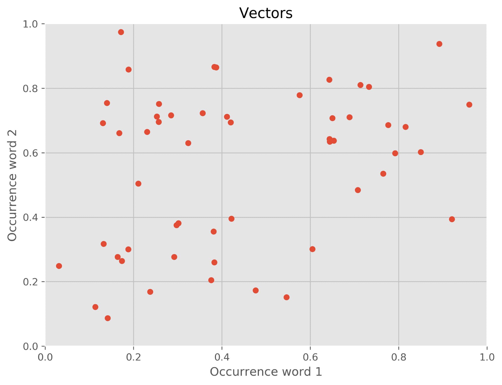
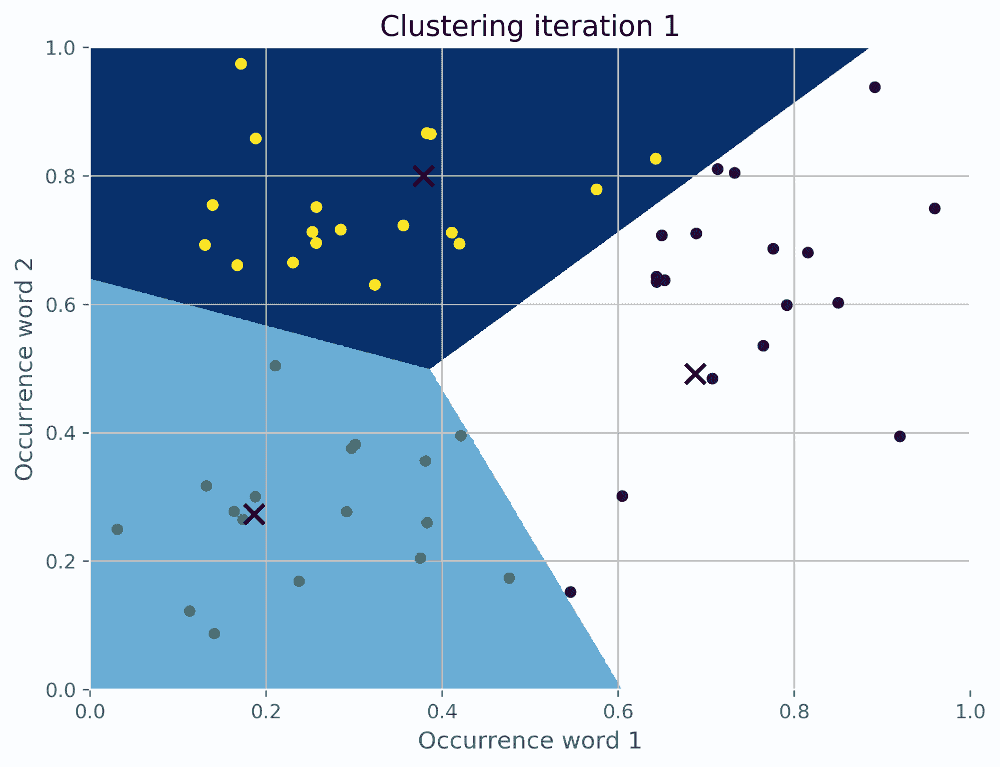
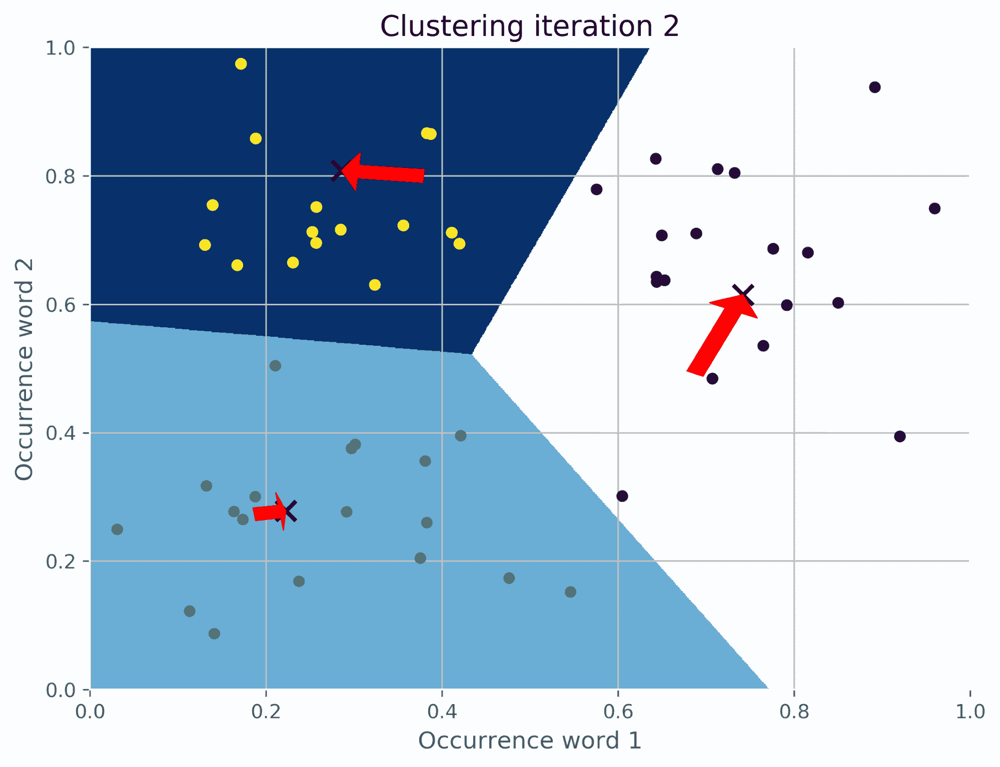
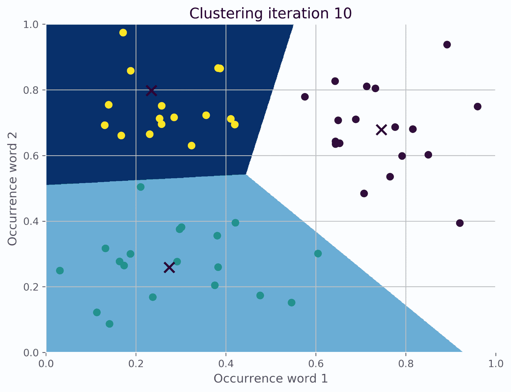

# 聚类–查找相关帖子

直到现在，我们一直认为训练是学习一个把一些数据映射到一些标签的函数。对于本章中的任务，我们可能没有可以用来学习分类模型的标签。例如，这可能是因为它们太贵而无法收集。试想一下，如果获得数百万个标签的唯一方法是让人类手动注释这些标签，成本会有多大。在那种情况下我们能做什么？

我们在数据本身中找到一些模式。这就是我们在这一章要做的，我们再次考虑问答网站的挑战。当用户浏览我们的网站时，也许是因为他们在搜索特定的信息，搜索引擎很可能会给他们一个特定的答案。如果给出的答案不是他们想要的，网站应该给出(至少)相关的答案，这样他们就可以很快看到还有哪些其他答案，并希望留在我们的网站上。

天真的方法是简单地获取帖子，计算它与所有其他帖子的相似度，并将最相似的帖子作为链接显示在页面上。这将很快变得非常昂贵。相反，我们需要一种快速找到所有相关帖子的方法。

在本章中，我们将通过对从文本中提取的特征进行聚类来实现这个目标。聚类是一种排列项目的方法，使得相似的项目在一个聚类中，而不相似的项目在不同的聚类中。我们必须首先解决的棘手问题是如何将文本转化为我们可以用来计算相似度的东西。有了这样的相似性度量，我们将继续研究如何利用它来快速获得包含相似帖子的集群。一旦到了那里，我们只需要检查那些也属于那个集群的文档。为了实现这一点，我们将向您介绍奇妙的`scikit`库，它附带了各种机器学习方法，我们也将在后面的章节中使用。

# 衡量职位的相关性

从机器学习的角度来看，原始文本毫无用处。如果我们设法把它转换成有意义的数字，我们就可以把它输入到我们的机器学习算法中，比如聚类。对于更普通的文本操作也是如此，比如相似性度量。

# 怎么不做呢

一种文本相似性度量是莱文斯坦距离，也称为编辑距离。假设我们有两个词，machine 和 mchiene。它们之间的相似性可以表示为将一个单词变成另一个单词所需的最小编辑集。在这种情况下，编辑距离将是两个，因为我们必须在`m`之后添加一个`a`，并删除第一个`e`。然而，这种算法相当昂贵，因为它受到第一个单词的长度乘以第二个单词的长度的限制。

看看我们的帖子，我们可以通过将整个单词视为字符并在单词级别上执行编辑距离计算来作弊。假设我们有两个帖子叫做，如何格式化我的硬盘，以及硬盘格式化问题(为了简单起见，让我们假设这个帖子只包含标题)。我们将需要五个编辑距离，因为删除，如何，到，格式，我的，然后在最后添加格式和问题。因此，人们可以将两个帖子之间的差异表示为必须添加或删除的单词数量，以便一个文本变形为另一个文本。虽然我们可以加快整个方法的速度，但是时间复杂度保持不变。

但即使它足够快，还有另一个问题。在之前的帖子中，word format 占了两个编辑距离，因为先删除它，再添加它。因此，我们的距离似乎不够稳固，不足以考虑单词重排。

# 怎么做

比编辑距离更稳健的是所谓的**包词**法。它忽略了单词的顺序，简单地使用单词计数作为它们的基础。对于帖子中的每个单词，它的出现都被计算并记录在一个向量中。不出意外，这一步也叫矢量化。向量通常很大，因为它包含的元素和整个数据集中出现的单词一样多。前面提到的两个示例帖子将具有以下字数:

| **字** | **1 号岗位发生的事件** | **岗位 2** 发生情况 |
| 唱片 | one | one |
| 格式 | one | one |
| 怎么 | one | Zero |
| 困难的 | one | one |
| 我的 | one | Zero |
| 问题 | Zero | one |
| 到 | one | Zero |

第 2 篇文章中出现的列和第 1 篇文章中出现的列现在可以被视为向量。我们可以简单地计算所有帖子的向量之间的欧几里得距离，并取最近的一个(太慢了，正如我们之前发现的)。因此，我们可以在后面的聚类步骤中使用它们作为特征向量，具体过程如下:

1.  从每个帖子中提取显著特征，并将其存储为每个帖子的向量
2.  对向量进行聚类
3.  确定有问题的帖子的群
4.  从这个集群中，获取一些与所讨论的帖子具有不同相似性的帖子。这将增加多样性

但是在我们到达那里之前还有一些工作要做。在我们做这项工作之前，我们需要一些数据。

# 预处理–相似性以相似数量的常用词来衡量

正如我们之前看到的，单词包方法既快速又健壮。然而，这并非没有挑战。让我们直接进入它们。

# 将原始文本转换为单词包

我们不需要编写自定义代码来计算单词，并将这些计数表示为向量。Scikit 的`CountVectorizer`方法，工作效率高，而且界面非常方便:

```py
>>> from sklearn.feature_extraction.text import CountVectorizer
>>> vectorizer = CountVectorizer(min_df=1)  
```

`min_df`参数决定`CountVectorizer`如何处理很少的单词(最小文档频率)。如果设置为整数，将删除较少文档中出现的所有单词。如果它是一个分数，所有出现在小于整个数据集的分数的单词都将被删除。`max_df`参数的工作方式类似。如果我们打印实例，我们可以看到 scikit 提供的其他参数及其默认值:

```py
>>> print(vectorizer) 
CountVectorizer(analyzer='word', binary=False, decode_error='strict',
        dtype=&lt;class 'numpy.int64'>, encoding='utf-8', input='content',
        lowercase=True, max_df=1.0, max_features=None, min_df=1,
        ngram_range=(1, 1), preprocessor=None, stop_words=None,
        strip_accents=None, token_pattern='(?u)\b\w\w+\b',
        tokenizer=None, vocabulary=None)
```

我们可以看到，不出所料，计数是在单词层面(`analyzer=word`)完成的，单词是由正则表达式模式`token_pattern`决定的。例如，它将交叉验证分为交叉验证和验证。这个过程也称为标记化。

现在让我们忽略其他参数，考虑下面两个示例主题行:

```py
>>> content = ["How to format my hard disk", 
               " Hard disk format  problems "]
```

我们现在可以将这个主题行列表放入我们的矢量器的`fit_transform()`功能中，该功能完成所有困难的矢量化工作:

```py
>>> X = vectorizer.fit_transform(content)
>>> vectorizer.get_feature_names()
['disk', 'format', 'hard', 'how', 'my', 'problems', 'to']
```

矢量器检测到七个单词，我们可以分别获取它们的计数:

```py
>>> print(X.toarray().transpose())
[[1 1]
 [1 1]
 [1 1]
 [1 0]
 [1 0]
 [0 1]
 [1 0]]
```

这意味着第一句包含除了问题之外的所有单词，而第二句包含除了 how、my 和 to 之外的所有单词。事实上，这些列与我们在上表中看到的相同。从`X`中，我们可以提取一个特征向量，我们将使用它来比较两个文档。

我们将首先从一个天真的方法开始，指出一些我们必须考虑的预处理特性。让我们选择一个随机的帖子，然后为它创建计数向量。然后，我们将它的距离与所有计数向量进行比较，并获取最小的一个。

# 数词

让我们来玩玩具数据集，由以下帖子组成:

| **发布文件名** | **发文内容** |
| `01.txt` | 这是一个关于机器学习的玩具帖子。实际上，它包含的有趣的东西并不多 |
| `02.txt` | 成像数据库会变得很庞大 |
| `03.txt` | 大多数成像数据库会永久保存图像 |
| `04.txt` | 成像数据库存储图像 |
| `05.txt` | 成像数据库存储图像 |

在这个帖子数据集中，我们希望为短帖子成像数据库找到最相似的帖子。

假设帖子位于`"data/toy"`目录下(请查看 Jupyter 笔记本)，我们可以用它来喂养`CountVectorizer`:

```py
    >>> from pathlib import Path # for easy path management
    >>> TOY_DIR = Path('data/toy')
    >>> posts = []
    >>> for fn in TOY_DIR.iterdir():
    ...     with open(fn, 'r') as f:
    ...         posts.append(f.read())
    ...
    >>> from sklearn.feature_extraction.text import CountVectorizer
    >>> vectorizer = CountVectorizer(min_df=1)

```

我们必须通知矢量器完整的数据集，以便它提前知道哪些单词是预期的:

```py
>>> X_train = vectorizer.fit_transform(posts)
>>> num_samples, num_features = X_train.shape
>>> print("#samples: %d, #features: %d" % 
...        (num_samples, num_features))
#samples: 5, #features: 25 
```

不出所料，我们有五个帖子，总共有 25 个不同的单词。将计算以下已标记化的单词:

```py
>>> print(vectorizer.get_feature_names())
['about', 'actually', 'capabilities', 'contains', 'data', 'databases', 'images', 'imaging', 'interesting', 'is', 'it', 'learning', 'machine', 'most', 'much', 'not', 'permanently', 'post', 'provide', 'save', 'storage', 'store', 'stuff', 'this', 'toy']
```

现在我们可以向量化我们的新帖子:

```py
>>> new_post = "imaging databases"
>>> new_post_vec = vectorizer.transform([new_post])  
```

注意`transform`方法返回的计数向量是稀疏的，这是合适的格式，因为数据本身也是稀疏的。也就是说，每个向量不会为每个单词存储一个计数值，因为大多数计数值都为零(帖子不包含该单词)。相反，它使用了内存效率更高的实现方式`coo_matrix`(用于坐标)。例如，我们的新帖子实际上只包含两个元素:

```py
>>> print(new_post_vec)
(0, 7)  1
(0, 5)  1 
```

通过其`toarray()`成员，我们可以再次完全访问`ndarray`:

```py
>>> print(new_post_vec.toarray())
[[0 0 0 0 0 1 0 1 0 0 0 0 0 0 0 0 0 0 0 0 0 0 0 0 0]]  
```

如果我们想用它作为相似度计算的向量，我们需要使用完整的数组。对于相似性度量(幼稚的)，我们计算新帖子和所有旧帖子的计数向量之间的欧几里德距离:

```py
import scipy
def dist_raw(v1, v2): 
    delta = v1-v2
    return scipy.linalg.norm(delta.toarray())
```

`norm()`函数计算欧几里德范数(最短距离)。这只是一个显而易见的第一选择，还有很多更有趣的方法来计算距离。只需看看 Python 论文源代码中两个列表或集合之间的论文距离系数，其中莫里斯·凌很好地呈现了 35 个不同的列表或集合。

有了`dist_raw`，我们只需要遍历所有帖子，记住最近的一个即可。由于我们将在整本书中使用它，让我们定义一个便利函数，该函数以矢量化的形式获取当前数据集和新帖子以及距离函数，并打印出距离函数工作情况的分析:

```py
def best_post(X, new_vec, dist_func):
 best_doc = None
 best_dist = float('inf') # infinite value as a starting point
 best_i = None
    for i, post in enumerate(posts):
 if post == new_post: 
 continue 
  post_vec = X.getrow(i) 
  d = dist_func(post_vec, new_vec) 
  print("=== Post %i with dist=%.2f:n    '%s'" % (i, d, post)) 
  if d < best_dist: 
  best_dist = d 
            best_i = i
    print("n==> Best post is %i with dist=%.2f" % (best_i, best_dist))
```

当我们执行为`best_post(X_train, new_post_vec, dist_raw)`时，我们可以在输出中看到这些帖子以及它们各自到新帖子的距离:

```py
    === Post 0 with dist=4.00:
        'This is a toy post about machine learning. Actually, it contains not much interesting stuff.'
    === Post 1 with dist=1.73:
        'Imaging databases provide storage capabilities.'
    === Post 2 with dist=2.00:
        'Most imaging databases save images permanently.'
    === Post 3 with dist=1.41:
        'Imaging databases store data.'
    === Post 4 with dist=5.10:
        'Imaging databases store data. Imaging databases store data. Imaging databases store data.'

    ==> Best post is 3 with dist=1.41
```

恭喜，我们有了第一个相似性度量。`Post 0`和我们的新帖子最不一样。可以理解的是，它与新帖子没有一个共同的词。我们也可以理解`Post 1`和新帖很像，但不是赢家，因为它比新帖没有包含的`Post 3`多了一个字。

然而看着`Post 3`和`Post 4`，画面就没那么清晰了。`Post 4`同`Post 3`重复三次。所以，它也应该和`Post 3`一样类似于新的岗位。

打印相应的特征向量解释了为什么:

```py
>>> print(X_train.getrow(3).toarray())
[[0 0 0 0 1 1 0 1 0 0 0 0 0 0 0 0 0 0 0 0 0 1 0 0 0]]
>>> print(X_train.getrow(4).toarray())
[[0 0 0 0 3 3 0 3 0 0 0 0 0 0 0 0 0 0 0 0 0 3 0 0 0]]
```

显然，仅使用原始单词的计数是不够的。我们必须对它们进行归一化，以得到单位长度的向量。

# 归一化字数向量

我们将不得不扩展`dist_raw`来计算矢量距离，而不是在原始矢量上，而是在归一化矢量上:

```py
def dist_norm(v1, v2): 
    v1_normalized = v1 / scipy.linalg.norm(v1.toarray()) 
    v2_normalized = v2 / scipy.linalg.norm(v2.toarray()) 
    delta = v1_normalized - v2_normalized 
    return scipy.linalg.norm(delta.toarray())
```

当使用`best_post(X_train, new_post_vec, dist_norm)`执行时，这导致以下相似性测量:

```py
    === Post 0 with dist=1.41:
        'This is a toy post about machine learning. Actually, it contains not much interesting stuff.'
    === Post 1 with dist=0.86:
        'Imaging databases provide storage capabilities.'
    === Post 2 with dist=0.92:
        'Most imaging databases save images permanently.
    '
    === Post 3 with dist=0.77:
        'Imaging databases store data.'
    === Post 4 with dist=0.77:
        'Imaging databases store data. Imaging databases store data. Imaging databases store data.'

    ==> Best post is 3 with dist=0.77
```

现在看起来好多了。岗位 3 和岗位 4 被计算为同等相似。人们可能会争论这么多重复是否会让读者高兴，但就计算帖子中的字数而言，这似乎是正确的。

# 删除不太重要的单词

我们再来看看《邮报 2》。在新帖子里没有的词中，我们有最多的，保存，图像，和永久的。他们对这个职位的整体重要性大不相同。像大多数这样的词经常出现在各种不同的上下文中，被称为停止词。它们携带的信息不多，因此不应该像图像等词汇那样被高度重视，因为这些词汇在不同的语境中并不经常出现。最好的选择是删除所有频繁出现的单词，因为它们无法帮助我们区分不同的文本。这些词被称为停止词。

由于这是文本处理中常见的步骤，因此`CountVectorizer`中有一个简单的参数来实现:

```py
>>> vect_engl = CountVectorizer(min_df=1, stop_words='english')
```

如果你清楚地知道你想删除什么类型的停止词，你也可以传递一个列表。将`stop_words`设置为`english`将使用一组 318 个英语停止词。要找出哪些，可以使用`get_stop_words()`:

```py
>>> sorted(vect_engl.get_stop_words())[0:20]
['a', 'about', 'above', 'across', 'after', 'afterwards', 'again', 'against', 'all', 'almost', 'alone', 'along', 'already', 'also', 'although', 'always', 'am', 'among', 'amongst', 'amoungst'] 
```

新单词列表轻了七个单词:

```py
>>> X_train_engl = vect_engl.fit_transform(posts)
>>> num_samples_engl, num_features_engl = X_train_engl.shape
>>> print(vect_engl.get_feature_names())  
['actually', 'capabilities', 'contains', 'data', 'databases', 'images', 'imaging', 'interesting', 'learning', 'machine', 'permanently', 'post', 'provide', 'save', 'storage', 'store', 'stuff', 'toy']
```

在丢弃停止词之后，我们得出以下相似性度量:

```py
    >>> best_post(X_train_engl, new_post_vec_engl, dist_norm)

    === Post 0 with dist=1.41:
        'This is a toy post about machine learning. Actually, it contains not much interesting stuff.'
    === Post 1 with dist=0.86:
        'Imaging databases provide storage capabilities.'
    === Post 2 with dist=0.86:
        'Most imaging databases save images permanently.'
    === Post 3 with dist=0.77:
        'Imaging databases store data.'
    === Post 4 with dist=0.77:
        'Imaging databases store data. Imaging databases store data. Imaging databases store data.'

    ==> Best post is 3 with dist=0.77  
```

`Post 2`现在和`Post 1`不相上下。但是，由于我们的岗位很短，仅用于演示目的，总体上没有太大变化。当我们查看真实世界的数据时，这将变得至关重要。

# 堵塞物

还有一件事没说。我们把不同变体中相似的词算作不同的词。例如，Post 2 包含成像和图像。把它们算在一起是有意义的。毕竟，他们指的是同一个概念。

我们需要一个将单词简化为特定词干的函数。默认情况下，Scikit 不包含词干分析器。有了**自然语言工具包** ( **NLTK** ，我们可以下载一个免费的软件工具包，它提供了一个词干分析器，我们可以很容易地插入`CountVectorizer`。

# 安装和使用 NLTK

NLTK 是一个简单的`pip install nltk`之外。

要检查安装是否成功，请打开 Python 解释器并键入:

```py
>>> import nltk
```

You will find a very nice tutorial on NLTK in the book *Python 3 Text Processing with NLTK 3 Cookbook *by Jacob Perkins, published by Packt Publishing.
To play around a little bit with a stemmer, you can visit the web page [http://text-processing.com/demo/stem/](http://text-processing.com/demo/stem/).

NLTK 自带不同的词干。这是必要的，因为每种语言都有一套不同的词干规则。对于英语，我们可以取`SnowballStemmer`:

```py
>>> import nltk.stem
>>> s = nltk.stem.SnowballStemmer('english')
>>> s.stem("graphics")
'graphic'
>>> s.stem("imaging")
'imag'
>>> s.stem("image")
'imag'
>>> s.stem("imagination")
'imagin'
>>> s.stem("imagine")
'imagin'
```

The stemming does not necessarily have to result in valid English words.

它也适用于动词:

```py
>>> s.stem("buys")
'buy'
>>> s.stem("buying")
'buy'
```

这意味着它大部分时间都有效:

```py
>>> s.stem("bought")
'bought' 
```

# 用 NLTK 的词干分析器扩展矢量器

在我们把帖子输入`CountVectorizer`之前，我们需要阻止它们。该类提供了几个钩子，通过这些钩子我们可以自定义舞台的预处理和标记化。预处理器和标记器可以在构造函数中设置为参数。我们不想将词干分析器放入其中的任何一个，因为我们将不得不自己进行标记化和规范化。相反，我们覆盖`build_analyzer`方法:

```py
import nltk.stem
english_stemmer = nltk.stem.SnowballStemmer('english')
class StemmedCountVectorizer(CountVectorizer): 
    def build_analyzer(self): 
        analyzer = super(StemmedCountVectorizer, self).build_analyzer()
        return lambda doc: (english_stemmer.stem(w) for w in  analyzer(doc))

vect_engl_stem = StemmedCountVectorizer(min_df=1, stop_words='english')
```

这将为每个帖子执行以下过程:

1.  将预处理步骤中的原始帖子小写(在父类中完成)。
2.  在标记化步骤中提取所有单个单词(在父类中完成)。
3.  将每个单词转换成词干版本(在我们的`build_analyzer`中完成)。

因此，我们现在少了一个功能，因为图像和成像合二为一:

```py
['actual', 'capabl', 'contain', 'data', 'databas', 'imag', 'interest', 'learn', 'machin', 'perman', 'post', 'provid', 'save', 'storag', 'store', 'stuff', 'toy']
```

在我们的帖子上运行我们的新词干向量器，我们看到折叠的图像和图片揭示了实际上，`Post 2`是与我们的新帖子最相似的帖子，因为它包含了两次概念图片:

```py
    === Post 0 with dist=1.41:
        'This is a toy post about machine learning. Actually, it contains not much interesting stuff.'
    === Post 1 with dist=0.86:
        'Imaging databases provide storage capabilities.'
    === Post 2 with dist=0.63:
        'Most imaging databases save images permanently.'
    === Post 3 with dist=0.77:
        'Imaging databases store data.'
    === Post 4 with dist=0.77:
        'Imaging databases store data. Imaging databases store data. Imaging databases store data.'

    ==> Best post is 2 with dist=0.63 
```

# 停止使用类固醇

既然我们已经有了一个合理的方法来从一篇嘈杂的文本帖子中提取一个紧凑的向量，让我们后退一步，思考一下特征值实际上意味着什么。

特征值只是计算文章中出现的术语。我们默默地假设一个术语的较高值也意味着该术语对给定的职位更重要。但是，举例来说，主题这个词呢，它自然出现在每一篇文章中(主题:...)?好的，我们也可以通过`max_df`参数告诉`CountVectorizer`将其删除。例如，我们可以将其设置为`0.9`，这样所有帖子中超过 90%的单词都将被忽略。但是出现在 89%的帖子中的单词呢？我们愿意把`max_df`设多低？问题是，无论我们如何设定，总会有这样一个问题:有些术语比其他术语更具歧视性。

这只能通过计算每个帖子的词条频率来解决，此外，还要对许多帖子中出现的词条频率进行折扣。换句话说，如果某个术语经常出现在某个特定的岗位上，而很少出现在其他地方，那么我们就希望该术语在某个给定的值中具有较高的值。

这正是**术语频率-逆文档频率** ( **TF-IDF** )的作用。TF 代表计算部分，而 IDF 在折扣中考虑了因素。一个天真的实现看起来像这样:

```py
def tfidf(term, doc, corpus):
    tf = doc.count(term) / len(doc)
    idf = np.log(float(len(corpus)) / (len([d for d in corpus if term in d])))
    tf_idf = tf * idf
    print("term='%s'   doc=%-17s tf=%.2f   idf=%.2f   tf*idf=%.2f"%
          (term, doc, tf, idf, tf_idf))
    return tf_idf
```

您可以看到，我们不仅对术语进行了简单的计数，还按照文档长度对计数进行了标准化。这样，较长的文档不会比较短的文档有不公平的优势。当然，为了快速计算，我们会将 IDF 计算移出函数，因为它对所有文档都是相同的值。

对于以下文档，`D`，由三个已经标记化的文档组成，我们可以看到这些术语是如何被区别对待的，尽管每个文档出现的频率都相同:

```py
>>> a, abb, abc = ["a"], ["a", "b", "b"], ["a", "b", "c"]
>>> D = [a, abb, abc]
>>> print("=> tfidf=%.2f" % tfidf("a", a, D))
term='a'   doc=['a']             tf=1.00   idf=0.00
=> tfidf=0.00

>>> print("=> tfidf=%.2f" % tfidf("a", abb, D))
term='a'   doc=['a', 'b', 'b']   tf=0.33   idf=0.00
=> tfidf=0.00

>>> print("=> tfidf=%.2f" % tfidf("a", abc, D))
term='a'   doc=['a', 'b', 'c']   tf=0.33   idf=0.00
=> tfidf=0.00

>>> print("=> tfidf=%.2f" % tfidf("b", abb, D))
term='b'   doc=['a', 'b', 'b']   tf=0.67   idf=0.41
=> tfidf=0.27

>>> print("=> tfidf=%.2f" % tfidf("b", abc, D))
term='b'   doc=['a', 'b', 'c']   tf=0.33   idf=0.41
=> tfidf=0.14

>>> print("=> tfidf=%.2f" % tfidf("c", abc, D))
term='c'   doc=['a', 'b', 'c']   tf=0.33   idf=1.10
=> tfidf=0.37
```

我们看到`a`对于任何文件都没有意义，因为它无处不在。`b`这个词对于文件`abb`比`abc`更重要，因为它在那里出现了两次。

实际上，要处理的角落案例比前面的例子要多。多亏了 scikit，我们不必去想它们，因为它们已经很好地封装在`TfidfVectorizer`中了，而`TfidfVectorizer`继承自`CountVectorizer`。我们不想错过我们的词干:

```py
    from sklearn.feature_extraction.text import TfidfVectorizer

    class StemmedTfidfVectorizer(TfidfVectorizer):

        def build_analyzer(self):
            analyzer = super(TfidfVectorizer, self).build_analyzer()
            return lambda doc: (english_stemmer.stem(w) for w in analyzer(doc))

    vect_tfidf = StemmedTfidfVectorizer(stop_words='english')

```

生成的文档向量将不再包含计数。相反，它们将包含每个术语的单个 TF-IDF 值。

# 我们的成就和目标

我们当前的文本预处理阶段包括以下步骤:

1.  首先，标记文本
2.  接下来是扔掉那些经常出现的对检测相关帖子没有任何帮助的词
3.  扔掉那些很少出现的单词，这样它们就很少有机会出现在未来的帖子中
4.  数着剩下的单词
5.  最后，从计数中计算 TF-IDF 值，考虑整个文本语料库

我们可以再次祝贺自己。通过这个过程，我们能够将一堆有噪声的文本转换成特征值的简洁表示。

但是，尽管单词包方法及其扩展简单而强大，但它也有一些缺点，我们应该意识到:

*   **不覆盖字关系**:用前面提到的矢量化方法，文字、车撞墙、墙撞车，都会有相同的特征向量
*   **它没有正确捕捉否定**:比如文本，我会吃冰淇淋，我不会吃冰淇淋，通过它们的特征向量看起来非常相似，虽然它们包含完全相反的意思。然而，这个问题可以很容易地通过不仅计算单个单词(也称为 unigrams)，而且考虑二元模型(单词对)或三元模型(连续三个单词)来缓解
*   **对于拼错的单词**它完全失败了:虽然对我们来说很明显，数据库和 databas 传达了相同的意思，但是我们的方法会将它们视为完全不同的单词

为了简洁起见，让我们继续使用当前的方法，我们现在可以使用它来高效地构建集群。

# 使聚集

最后，我们有了我们的向量，我们相信它在足够的程度上捕捉了帖子。毫不奇怪，有许多方法可以将它们组合在一起。对聚类算法进行分类的一种方法是区分平面聚类和层次聚类。

平面聚类将帖子分成一组聚类，而不将聚类相互关联。目标只是想出一个分区，使得一个集群中的所有帖子彼此最相似，而与所有其他集群中的帖子不相似。许多平面聚类算法要求预先指定聚类的数量。

在分层聚类中，不必指定聚类的数量。相反，层次聚类创建了聚类的层次结构。当相似的帖子被分组到一个集群中时，相似的集群再次被分组到一个*超级集群*中。例如，在凝聚聚类方法中，这是递归进行的，直到只剩下一个包含所有内容的聚类。在这个层次结构中，人们可以在事后选择期望的集群数量。然而，这是以较低的效率为代价的。

Scikit 在`sklearn.cluster`包中提供了广泛的聚类方法。您可以在[http://scikit-learn.org/stable/modules/clustering.html](http://scikit-learn.org/stable/modules/clustering.html)快速了解它们各自的优缺点。

在接下来的部分中，我们将使用平面聚类方法 K-means。

# k 均值

K-means 是应用最广泛的平面聚类算法。在用期望数量的簇`num_clusters`初始化它之后，它保持所谓的簇形心的数量。最初，它会选择任何`num_clusters`帖子，并将质心设置为它们的特征向量。然后它将遍历所有其他帖子，并为它们分配最近的质心作为它们当前的簇。接下来，它会将每个质心移动到该特定类的所有向量的中间。这当然会改变集群分配。一些哨所现在更靠近另一个集群。因此，它将更新那些已更改帖子的分配。只要质心有相当大的移动，就可以做到这一点。在一些迭代之后，移动将下降到阈值以下，我们认为聚类是收敛的。

让我们用一个只包含两个单词的帖子的玩具例子来演示一下。下图中的每个点代表一个文档:



在运行一次 K-means 迭代后，即以任意两个向量为起点，将标签分配给其余的向量，并将聚类中心更新为该聚类中所有点的中心点，我们得到以下聚类:



由于群集中心已移动，我们必须重新分配群集标签并重新计算群集中心。迭代 2 之后，我们得到以下聚类:



箭头显示了集群中心的移动。经过十次迭代。如下例截图所示，集群中心不再明显移动(scikit 的容差阈值默认为 0.0001):



聚类稳定后，我们只需要记下聚类中心和它们的聚类号。对于每个新的文档，我们必须向量化，并与所有集群中心进行比较。与我们的新帖子向量距离最小的聚类中心属于我们将分配给新帖子的聚类。

# 获取测试数据来评估我们的想法

为了测试聚类，让我们远离玩具文本示例，找到一个类似于我们未来期望的数据的数据集，这样我们就可以测试我们的方法。出于我们的目的，我们需要关于已经分组在一起的技术主题的文档，以便我们可以在稍后将其应用于我们希望收到的帖子时检查我们的算法是否如预期那样工作。

机器学习中的一个标准数据集是`20newsgroup`数据集，它包含来自 20 个不同新闻组的 18，826 篇文章。这些小组的话题中有技术性的，如`comp.sys.mac.hardware`或`sci.crypt`，也有更多与政治和宗教相关的，如`talk.politics.guns`或`soc.religion.christian`。我们将仅限于技术组。如果我们假设每个新闻组是一个集群，我们可以很好地测试我们寻找相关帖子的方法是否有效。

The dataset can be downloaded from [http://people.csail.mit.edu/jrennie/20Newsgroups](http://people.csail.mit.edu/jrennie/20Newsgroups). 

为方便起见，`sklearn.datasets`模块还包含`fetch_20newsgroups`功能，自动下载后台数据:

```py
>>> import sklearn.datasets
>>> all_data = sklearn.datasets.fetch_20newsgroups(subset='all')
>>> print(len(all_data.filenames))
18846
>>> print(all_data.target_names)
['alt.atheism', 'comp.graphics', 'comp.os.ms-windows.misc', 
 'comp.sys.ibm.pc.hardware', 'comp.sys.mac.hardware', 
 'comp.windows.x', 'misc.forsale', 'rec.autos', 'rec.motorcycles', 
 'rec.sport.baseball', 'rec.sport.hockey', 'sci.crypt', 
 'sci.electronics', 'sci.med', 'sci.space', 'soc.religion.christian', 
 'talk.politics.guns', 'talk.politics.mideast', 'talk.politics.misc', 
 'talk.religion.misc']
```

我们可以在训练集和测试集之间进行选择:

```py
>>> train_data = sklearn.datasets.fetch_20newsgroups(subset='train')
>>> print(len(train_data.filenames))
11314
>>> test_data = sklearn.datasets.fetch_20newsgroups(subset='test')
>>> print(len(test_data.filenames))
7532 
```

为了简单起见，我们将仅限于一些新闻组，这样整个实验周期就更短了。我们可以通过`categories`参数实现这一点:

```py
>>> groups = ['comp.graphics', 'comp.os.ms-windows.misc', 
 'comp.sys.ibm.pc.hardware', 'comp.sys.mac.hardware', 
 'comp.windows.x', 'sci.space']
>>> train_data = sklearn.datasets.fetch_20newsgroups(subset='train', 
                    categories=groups)
>>> print(len(train_data.filenames))
3529

>>> test_data = sklearn.datasets.fetch_20newsgroups(subset='test', 
                    categories=groups)
>>> print(len(test_data.filenames))
2349
```

# 将帖子分组

我们已经注意到一件事——真实数据是有噪音的。新闻组数据集也不例外。它甚至包含将导致`UnicodeDecodeError`的无效字符。

我们必须告诉矢量器忽略它们:

```py
>>> vectorizer = StemmedTfidfVectorizer(min_df=10, max_df=0.5,
...              stop_words='english', decode_error='ignore')
>>> vectorized = vectorizer.fit_transform(train_data.data)
>>> num_samples, num_features = vectorized.shape
>>> print("#samples: %d, #features: %d" % (num_samples, num_features))
    #samples: 3529, #features: 4712
```

我们现在有了一个`3529`帖子池，并为每个帖子提取了一个`4712`维度的特征向量。这就是 K-means 作为输入的内容。本章我们将把集群大小固定在`50`上，希望你有足够的好奇心尝试不同的值作为练习:

```py
>>> num_clusters = 50
>>> from sklearn.cluster import KMeans
>>> km = KMeans(n_clusters=num_clusters, n_init=1, verbose=1, random_state=3)
>>> km.fit(vectorized)
```

就这样。我们提供了一个随机状态，这样你就可以得到相同的结果。在现实应用程序中，您不会这样做。拟合后，我们可以得到`km`成员的聚类信息。对于每个已经拟合的矢量化帖子，在`km.labels_`中有一个对应的整数标签:

```py
>>> print("km.labels_=%s" % km.labels_)
km.labels_=[48 23 31 ...,  6  2 22]
>>> print("km.labels_.shape=%s" % km.labels_.shape)
km.labels_.shape=3529 
```

可以通过`km.cluster_centers_`访问集群中心。

在下一节中，我们将看到如何使用`km.predict`将集群分配给新到达的帖子。

# 解决我们最初的挑战

现在，我们将把所有的东西放在一起，并为我们分配给`new_post`变量的以下新帖子演示我们的系统:

```py
new_post = '''
Disk drive problems. Hi, I have a problem with my hard disk.
After 1 year it is working only sporadically now.
I tried to format it, but now it doesn't boot any more.
Any ideas? Thanks. '''
```

正如你之前所学，在你预测
它的标签之前，你首先必须向量化这篇文章:

```py
>>> new_post_vec = vectorizer.transform([new_post])
>>> new_post_label = km.predict(new_post_vec)[0]
```

现在我们已经有了聚类，我们不需要将`new_post_vec`与所有的后向量进行比较。相反，我们只能关注同一组的帖子。让我们从原始数据集中获取它们的索引:

```py
>>> similar_indices = (km.labels_ == new_post_label).nonzero()[0]
```

括号中的比较产生一个布尔数组，`nonzero`将该数组转换为包含`True`元素索引的较小数组。

使用`similar_indices`，我们只需要建立一个帖子列表以及它们的相似度分数:

```py
>>> similar = []
>>> for i in similar_indices:
...    dist = scipy.linalg.norm((new_post_vec - vectorized[i]).toarray())
...    similar.append((dist, train_data.data[i]))
>>> similar = sorted(similar)
>>> print("Count similar: %i" % len(similar))
Count similar: 56
```

我们在帖子的群中找到了`56`个帖子。为了让用户快速了解什么样的类似帖子可用，我们现在可以展示最相似的帖子(`show_at_1`)和两个不太相似但仍然相关的帖子，它们都来自同一个集群:

```py
>>> show_at_1 = similar[0]
>>> show_at_2 = similar[len(similar) // 10]
>>> show_at_3 = similar[len(similar) // 2]
```

下表显示了帖子及其相似度值:

| **位置** | **相似度** | **节选自帖子** |
| one | One point zero three eight | 集成开发环境控制器的启动问题嗨，我有一个多输入/输出卡(集成开发环境控制器+串行/并行接口)和两个软驱(5 1/4，3 1/2)以及一个连接到它的量子驱动器 80AT。我可以格式化硬盘，但无法从它启动。我可以从驱动器 A 引导:(哪个磁盘驱动器不重要)但是如果我从驱动器 A 中取出磁盘并按下重置开关，驱动器 A:的 LED 会继续发光，硬盘根本无法访问。我猜这一定是多 I/O 卡或软盘驱动器设置的问题(跳线配置？)有人知道这可能是什么原因吗。[...] |
| Two | One point one five | 从 B 驱动器启动我有一个 5 1/4 英寸的驱动器作为驱动器 a。如何让系统从我的 3 1/2 英寸驱动器 B 启动？(最理想的情况是，计算机能够从 A 或 B 引导，检查它们以获得可引导磁盘。但是，如果我必须切换电缆，只需切换驱动器，这样它就无法引导 5 个 1/4 英寸的磁盘，这没关系。另外，boot_b 对我来说也没用。[...][...] |
| three | One point two eight | IBM PS/1 vs TEAC FD你好，我已经尝试了我们的国家新闻集团，但没有成功。我试图用一个普通的 TEAC 驱动器替换一个朋友 PS/1-PC 中的原始 IBM 软盘。我已经确定了针脚 3 (5V)和 6 (12V)上的电源，短路了针脚 6 (5.25 英寸/3.5 英寸开关)，并在针脚 8、26、28、30 和 34 上插入了上拉电阻(2K2)。电脑不会抱怨 FD 不见了，但是 FD 的灯一直亮着。驱动器旋转正常。当我插入磁盘，但无法访问它时。TEAC 在普通电脑上运行良好。有没有我漏掉的点？[...][...] |

有趣的是，帖子反映了相似性度量分数。第一篇文章包含了我们新文章中所有的关键词。第二个也是围绕着引导问题，但是是关于软盘而不是硬盘。最后，第三个问题既不是关于硬盘，也不是关于引导问题。尽管如此，所有的帖子，我们会说，属于同一个领域的新帖子。

# 再看看噪音

我们不应该期望完美的聚类，因为来自同一个新闻组(例如，`comp.graphics`)的帖子也被聚类在一起。一个例子会给我们一个快速印象的噪音，我们不得不期待。为了简单起见，我们将关注其中一个较短的帖子:

```py
>>> post_group = zip(train_data.data, train_data.target)
>>> all = [(len(post[0]), post[0], train_data.target_names[post[1]]) 
             for post in post_group]
>>> graphics = sorted([post for post in all if post[2]=='comp.graphics'])
>>> print(graphics[5])
(245, 'From: SITUNAYA@IBM3090.BHAM.AC.UKnSubject: test....(sorry)nOrganization: The University of Birmingham, United KingdomnLines: 1nNNTP-Posting-Host: ibm3090.bham.ac.uk&lt;...snip...>', 
 'comp.graphics')
```

对于这个帖子，没有真正的迹象表明它属于`comp.graphics`，只考虑预处理步骤后剩下的措辞:

```py
>>> noise_post = graphics[5][1]
>>> analyzer = vectorizer.build_analyzer()
>>> print(list(analyzer(noise_post)))
['situnaya', 'ibm3090', 'bham', 'ac', 'uk', 'subject', 'test', 
 'sorri', 'organ', 'univers', 'birmingham', 'unit', 'kingdom', 'line', 
 'nntp', 'post', 'host', 'ibm3090', 'bham', 'ac', 'uk']
```

我们在应用标记化、降级和停止单词删除后收到了这些单词。如果我们也减去那些稍后将通过`min_df`和`max_df`过滤掉的单词，这将在`fit_transform`稍后进行，情况会变得更糟:

```py
>>> useful = set(analyzer(noise_post)).intersection
 (vectorizer.get_feature_names())
>>> print(sorted(useful))
['ac', 'birmingham', 'host', 'kingdom', 'nntp', 'sorri', 'test', 
 'uk', 'unit', 'univers']
```

从 IDF 分数中我们可以看出，大多数单词也经常出现在其他帖子中。请记住，TF-IDF 越高，特定职位的术语就越具有歧视性。由于 IDF 在这里是一个乘法因子，它的低值表明它通常没有很大的价值:

```py
>>> for term in sorted(useful):
...     print('IDF(%-10s) = %.2f' % (term, 
...           vectorizer._tfidf.idf_[vectorizer.vocabulary_[term]]))

IDF(ac        ) = 3.51
IDF(birmingham) = 6.77
IDF(host      ) = 1.74
IDF(kingdom   ) = 6.68
IDF(nntp      ) = 1.77
IDF(sorri     ) = 4.14
IDF(test      ) = 3.83
IDF(uk        ) = 3.70
IDF(unit      ) = 4.42
IDF(univers   ) = 1.91
```

因此，具有最高辨别能力的术语`birmingham`和`kingdom`显然与计算机图形无关，IDF 分数较低的术语也是如此。可以理解的是，来自不同新闻组的帖子将聚集在一起。

然而，对于我们的目标来说，这没什么大不了的，因为我们只对减少我们必须与新帖子进行比较的帖子数量感兴趣。毕竟，我们的训练数据来自的特定新闻组并没有什么特别的兴趣。

# 调整参数

其他参数呢？例如，我们可以调整集群的数量，或者使用矢量器的`max_features`参数(你应该试试！).此外，我们可以使用不同的集群中心初始化。然后还有比 K-means 本身更令人兴奋的替代品。例如，有一些聚类方法允许您使用不同的相似性度量，如余弦相似性、皮尔逊相似性或雅克卡相似性。一个让你兴奋的地方。

但是在你去那里之前，你必须更好地定义你真正的意思。Scikit 有一个完整的包，专门用于这个定义。这个包叫做`sklearn.metrics`，它还包含了一系列不同的度量来衡量聚类质量。也许这应该是现在要做的第一件事——直接进入度量包的来源。

# 摘要

这是一个艰难的旅程——我们讨论了聚类前的预处理，以及一个可以将有噪声的文本转换成有意义的简洁矢量表示的解决方案，我们可以对其进行聚类。如果我们看看我们必须做些什么才能最终实现集群化，这是整个任务的一半以上。但是在路上，我们学到了很多关于文本处理的知识，以及简单的计数如何让你在嘈杂的真实数据中走得更远。

不过，由于 scikit 及其强大的包装，这一旅程变得更加顺畅。还有更多要探索的。在这一章中，我们只是触及了它能力的表面。在[第七章](07.html)、*推荐*中，我们会构建一个推荐系统，我们会看到它更多的力量。