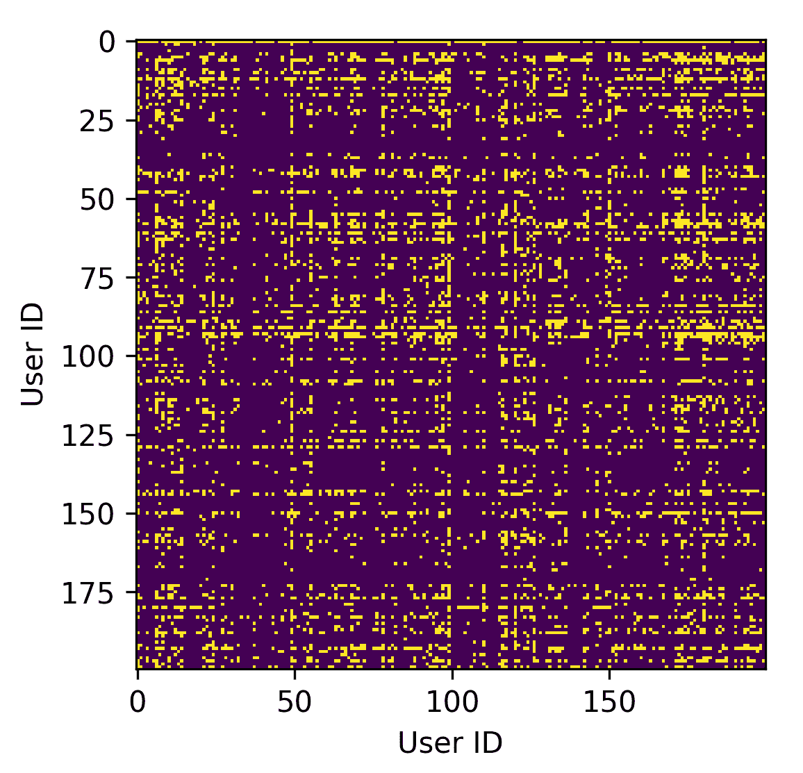
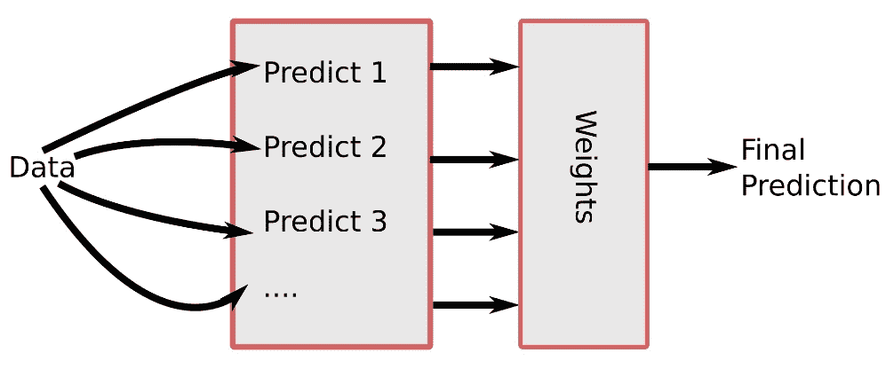
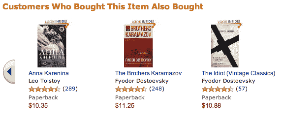
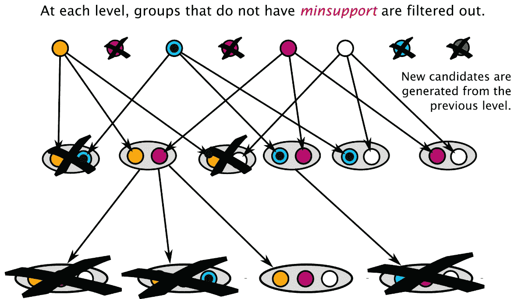

# 推荐

推荐已经成为在线服务和商业的主要内容之一。这种类型的自动化系统可以为每个用户提供个性化的建议列表(无论是要购买的产品列表、要使用的功能还是新的连接)。在本章中，我们将看到自动推荐生成系统的基本工作方式。基于消费者输入生成推荐的领域通常被称为协作过滤，因为用户通过系统协作来为彼此找到最佳项目。

在本章的第一部分，我们将看到如何利用消费者过去的产品评级来预测新的评级。我们从一些有用的想法开始，然后把它们结合起来。当组合它们时，我们使用回归来学习组合它们的最佳方式。这也将允许我们探索机器学习中的一个通用概念:集成学习。

在本章的第二部分，我们将看看一个不同的学习方法建议:篮子分析。与我们有数字评级的情况不同，在购物篮分析设置中，我们所拥有的只是关于购物篮的信息，也就是说，哪些物品是一起购买的。目标是了解推荐。你可能已经看过类似这样的推荐，网购买 *X* 的人也买了 *Y、*。我们将开发自己的类似功能。总之，本章将涵盖以下内容:

*   通过预测产品评级建立推荐系统的不同方法。
*   堆叠作为一种组合多种预测的方式。这是一种结合机器学习方法的通用技术。
*   购物篮分析和关联规则挖掘，仅根据一起消费的项目来构建预测。

# 评级预测和建议

如果你在过去 10 年中使用过任何在线购物系统，你可能已经看到过推荐。有些像亚马逊，买了 *X* 的客户也买了 *Y* ，功能。这些将在*篮子分析*部分讨论。其他推荐是基于预测产品的评级，例如电影。

基于过去产品评级的学习推荐问题因网飞奖而出名，这是网飞发起的一项耗资百万美元的机器学习公开挑战。网飞是一家电影流媒体公司。这项服务的一个显著特点是，它让用户可以选择对他们看过的电影进行评分。然后，网飞利用这些评分向其客户推荐其他电影。在这个机器学习问题中，你不仅有关于用户看了哪些电影的信息，还有关于用户如何评价它们的信息。

2006 年，网飞在其数据库中提供了大量电影的客户评级，以应对公开挑战。目标是改进他们内部的评级预测算法。谁能赢 10%或更多，谁就能赢得 100 万美元。2009 年，一个名为 BellKor's 务实混乱的国际团队能够打破这一纪录并获奖。他们这样做的 20 分钟前，另一个团队，合奏团，也通过了 10%的分数——一个持续了几年的比赛令人兴奋的照片结束。

Machine learning in the real world:
Much has been written about the Netflix Prize, and you may learn a lot by reading up on it. The techniques that won were a mixture of advanced machine learning and a lot of work put into preprocessing the data. For example, some users like to rate everything very highly, while others are always more negative; if you do not account for this in preprocessing, your model will suffer. Other normalizations were also necessary for a good result, bearing in mind factors such as the film's age and how many ratings it received. Good algorithms are a good thing, but you always need to get your hands dirty and tune your methods to the properties of the data you have in front of you. Preprocessing and normalizing the data is often the most time-consuming part of the machine-learning process. However, this is also the place where one can have the biggest impact on the final performance of the system.

关于网飞奖，首先要注意的是它有多难。粗略地说，网飞使用的内部系统比完全没有推荐要好 10%(也就是说，给每部电影分配所有用户的平均值)。目标是在此基础上再提高 10%。总的来说，获胜的系统只比没有个性化好 20%。然而，实现这一目标花费了大量的时间和精力，尽管 20%似乎不多，但结果是一个在实践中有用的系统。

不幸的是，由于法律原因，该数据集不再可用。虽然数据集是匿名的，但有人担心可能会发现谁是客户，并泄露电影租赁的私人细节。然而，我们可以使用具有相似特征的学术数据集。这些数据来自明尼苏达大学的研究实验室 GroupLens。

如何解决网飞式的收视率预测问题？我们将研究两种不同的方法:邻域方法和回归方法。我们还将看到如何结合这些方法来获得一个单一的预测。

# 分为培训和测试

在高层次上，将数据集拆分为训练和测试数据，以便获得系统性能的原则性估计，其执行方式与我们在前面章节中看到的方式相同:我们获取一定比例的数据点(我们将使用 10%)，并将其保留用于测试；其余的将用于训练。

但是，因为在这种情况下数据的结构不同，所以代码也不同。在我们探索的一些模型中，当我们传输数据时，留出 10%的用户是行不通的。

第一步是从磁盘加载数据，我们使用以下函数:

```py
def load(): 
    import numpy as np 
    from scipy import sparse 

    data = np.loadtxt('data/ml-100k/u.data') 
    ij = data[:, :2] 
    ij = 1  # original data is in 1-based system 
    values = data[:, 2] 
    reviews = sparse.csc_matrix((values, ij.T)).astype(float) 
    return reviews.toarray() 
```

请注意，此矩阵中的零条目表示缺少评级:

```py
reviews = load() 
U,M = np.where(reviews) 
```

我们现在使用标准`random`模块选择要测试的指数:

```py
import random 
test_idxs = np.array(random.sample(range(len(U)), len(U)//10)) 
```

现在我们构建`train`矩阵，类似于`reviews`，但是测试条目设置为零:

```py
train = reviews.copy() 
train[U[test_idxs], M[test_idxs]] = 0 
```

最后，`test`矩阵只包含测试值:

```py
test = np.zeros_like(reviews) 
test[U[test_idxs], M[test_idxs]] = reviews[U[test_idxs], M[test_idxs]] 
```

从现在开始，我们将继续获取训练数据，并尝试预测数据集中所有缺失的条目。也就是说，我们将编写代码，为每个用户-电影对分配一个推荐。

# 标准化训练数据

正如我们所看到的，最好对数据进行规范化，以消除明显的电影或用户特定的效果。我们将只使用我们之前使用的一种非常简单的标准化类型:转换为*z*-分数。

不幸的是，我们不能简单地使用 scikit-learn 的规范化对象，因为我们必须处理数据中缺失的值(也就是说，不是所有的电影都由所有用户评分)。因此，我们希望通过实际存在的值的平均值和标准偏差进行标准化。

我们将编写自己的类来忽略丢失的值。这个类将遵循 scikit-learn 预处理 API。我们甚至可以从 scikit-learn 的`TransformerMixin`类中派生出一个`fit_transform`方法:

```py
from sklearn.base import TransformerMixin 
class NormalizePositive(TransformerMixin):
```

我们要选择正常化的轴。默认情况下，我们沿着第一个轴进行标准化，但有时沿着第二个轴进行标准化会很有用。这遵循了许多其他 NumPy 相关函数的约定:

```py
    def __init__(self, axis=0): 
        self.axis = axis 
```

最重要的方法是`fit`法。在我们的实现中，我们计算不为零的值的平均值和标准偏差。请记住，零表示缺少值:

```py
def fit(self, features, y=None): 
```

如果轴是`1`，我们对转置数组的操作如下:

```py
      if self.axis == 1: 
          features = features.T 
      #  count features that are greater than zero in axis 0: 
      binary = (features > 0) 
      count0 = binary.sum(axis=0) 

      # to avoid division by zero, set zero counts to one: 
      count0[count0 == 0] = 1\. 

      # computing the mean is easy: 
      self.mean = features.sum(axis=0)/count0 

      # only consider differences where binary is True: 
      diff = (features - self.mean) * binary 
      diff **= 2 
      # regularize the estimate of std by adding 0.1 
      self.std = np.sqrt(0.1 + diff.sum(axis=0)/count0) 
      return self 
```

我们将`0.1`加到标准差的直接估计中，以避免在只有少数样本时低估标准差的值，所有样本可能完全相同。使用的确切值对最终结果并不重要，但我们需要避免被零除。

`transform`方法需要注意维护二元结构，如下所示:

```py
def transform(self, features): 
    if self.axis == 1: 
         features = features.T 
    binary = (features > 0) 
    features = features - self.mean 
    features /= self.std 
    features *= binary 
    if self.axis == 1: 
        features = features.T 
    return features 
```

请注意，当轴为`1`时，我们如何处理输入矩阵的转换，然后将其转换回来，以便返回值与输入具有相同的形状。`inverse_transform`方法执行逆运算进行变换，如下代码所示:

```py
def inverse_transform(self, features, copy=True):
     if copy:
         features = features.copy()
     if self.axis == 1:
         features = features.T
     features *= self.std
     features += self.mean
     if self.axis == 1:
         features = features.T
     return features 
```

最后，我们添加`fit_transform`方法，顾名思义，它结合了`fit`和`transform`操作:

```py
def fit_transform(self, features):
    return self.fit(features).transform(features)  
```

我们定义的方法(`fit`、`transform`、`transform_inverse`和`fit_transform`)与`sklearn.preprocessing`模块中定义的对象相同。在接下来的部分中，我们将首先归一化输入，生成归一化预测，最后应用逆变换来获得最终预测。

# 推荐的邻域方法

邻域概念可以通过两种方式实现:用户邻域或电影邻域。用户社区基于一个非常简单的概念:了解用户对电影的评价，找到与他们最相似的用户，并查看他们的评价。我们暂时只考虑用户邻居。在本节的最后，我们将讨论如何修改代码来计算电影邻居。

我们现在将探索的一个有趣的技术是只看每个用户给哪些电影评分，甚至不看给了什么评分。即使有一个二元矩阵，当用户评价一部电影时，我们有一个等于 1 的条目，当他们不评价时，我们有一个等于 0 的条目，我们也可以做出有用的预测。事后看来，这是完全有道理的——我们不会完全随机地选择要看的电影，而是选择那些我们已经期望喜欢的电影。我们也不会随机选择给哪些电影评分，但可能只会给那些我们感觉最强烈的电影评分(当然，也有例外，但平均来说，这可能是真的)。

我们可以将矩阵的值可视化为图像，其中每个评级都被描绘为一个小方块。黑色代表没有评级，灰色级别代表评级值。

可视化数据的代码非常简单(您可以对其进行调整，以显示比本书中更大的矩阵部分)，如以下代码所示:

```py
from matplotlib import pyplot as plt 
# Build an instance of the object we defined previously 
norm = NormalizePositive(axis=1)        
binary = (train > 0) 
train = norm.fit_transform(train) 
# plot just 200x200 area for space reasons 
fix, ax = plt.subplots() 
ax.imshow(binary[:200, :200], interpolation='nearest') 
```

下面的截图是这段代码的输出:



我们可以看到矩阵是稀疏的——大多数正方形是黑色的。我们还可以看到，一些用户对电影的评分比其他人高得多，一些电影的评分比其他电影高得多。

我们现在要用这个二元矩阵来预测电影的收视率。一般算法的计算(伪代码)如下:

*   对于每个用户，根据接近程度对其他用户进行排名。对于这一步，我们将使用二进制矩阵，并使用相关性作为接近度的度量(将二进制矩阵解释为 0 和 1 允许我们执行这一计算)。
*   当我们需要估计一个用户(电影对)的评分时，我们会查看所有给该电影评分的用户，并将他们分成两组:最相似的一半和最不相似的一半。然后，我们使用最相似的一半的平均值作为预测。

我们可以使用`scipy.spatial.distance.pdist`函数来获取所有用户之间的距离，作为一个矩阵。该函数返回相关距离，该距离通过反转相关值来转换相关值，因此较大的数字意味着它们不太相似。数学上，相关距离为 *1-r* ，其中 *r* 为相关值。代码如下:

```py
from scipy.spatial import distance 
# compute all pair-wise distances: 
dists = distance.pdist(binary, 'correlation') 
# Convert to square form, so that dists[i,j] 
# is distance between binary[i] and binary[j]: 
dists = distance.squareform(dists) 
```

我们可以用这个矩阵选择每个用户最近的`neighbors`。这些是最像它的用户。我们使用以下代码选择这些`neighbors`:

```py
neighbors = dists.argsort(axis=1) 
```

现在，我们迭代所有用户来估计所有输入的预测:

```py
# We are going to fill this matrix with results 
filled = train.copy() 
for u in range(filled.shape[0]): 
    # n_u is neighbors of user 
    n_u = neighbors[u, 1:] 
    # t_u is training data 

    for m in range(filled.shape[1]): 
        # get relevant reviews in order!
        revs = train[n_u, m] 
        # Only use valid entries: 
        revs = revs[binary[n_u, m]] 

        if len(revs): 
            # n is the number of reviews for this movie 
            n = len(revs) 
            # consider half of the reviews plus one 
            n //= 2 
            n += 1 
            revs = revs[:n] 
            filled[u,m] = np.mean(revs) 
```

前面片段中棘手的部分是通过正确的值来索引，以选择给电影评分的邻居。然后，我们选择最接近用户的那一半(在`rev[:n]`线)并对其进行平均。因为有些电影评论很多，有些评论很少，所以很难找到所有案例的单一用户数量。选择一半的可用数据是比设置固定值更通用的方法。

为了获得最终结果，我们需要对预测进行如下反规格化:

```py
predicted = norm.inverse_transform(filled) 
```

我们可以使用我们在讨论回归时了解到的相同指标([第 2 章](02.html)、*用真实世界的例子进行分类*)。回想一下 *r* 评分范围从`0`(预测不比基线好)到`1`(预测完美)。为了方便起见，我们经常用百分比来表示(从`0`到`100`):

```py
from sklearn import metrics 
r2 = metrics.r2_score(test[test > 0], predicted[test > 0]) 
print('R2 score (binary neighbors): {:.1%}'.format(r2)) 
R2 score (binary neighbors): 29.5% 
```

前面的代码为用户`neighbors`计算结果。也就是说，当试图对用户-电影对进行预测时，它会查看对同一部电影进行评分的相似用户，并对他们进行平均。我们可以用同样的代码通过变换输入矩阵来计算电影`neighbors`。也就是说，现在我们将寻找由同一用户评分的类似电影，并对它们的评分进行平均。

在在线代码库中，推荐代码被包装在一个名为`predict_positive_nn`的函数中，所以我们可以用转置矩阵来调用它，最后转置结果:

```py
predicted = predict_positive_nn(train.T).T 
r2 = metrics.r2_score(test[test > 0], predicted[test > 0]) 
print('R2 score (binary movie neighbors): {:.1%}'.format(r2)) 
R2 score (binary movie neighbors): 29.8% 
```

我们可以看到结果并没有那么不同。

# 建议的回归方法

邻域的一种替代方法是将推荐表述为回归问题，并应用我们在[第 6 章](06.html)、*聚类-查找相关帖子*中学习的方法。

我们首先考虑为什么这个问题不适合分类公式。我们当然可以尝试学习一个五级模型，对每个可能的电影等级使用一个等级。然而，这种方法有两个问题:

*   不同的可能错误完全不同。例如，把一部 5 星电影误认为 4 星电影并不像把一部 5 星电影误认为 1 星电影那样严重
*   中间值有意义。即使我们的输入只是整数值，说预测是 4.3 也是完全有意义的。我们可以看到，这是一个不同于 3.5 的预测，即使它们都四舍五入到 4

这两个因素加在一起意味着分类并不适合这个问题。回归框架更适合。

对于一个基本的方法，我们再次有两个选择:我们可以构建特定于电影或特定于用户的模型。在我们的案例中，我们将首先构建用户特定的模型。这意味着，对于每个用户，我们将用户评价的电影作为我们的目标变量。输入是其他用户的评分。我们假设这将为与我们的用户相似的用户提供高价值(或者为喜欢我们的用户不喜欢的相同电影的用户提供负价值)。

设置`train`和`test`矩阵的方法与之前相同(包括运行标准化步骤)。因此，我们直接跳到学习步骤:

1.  首先，我们实例化一个`regression`对象如下(回想一下，在[第 2 章](02.html)、*用真实世界的例子分类*中，我们已经得出结论，具有自动参数搜索的弹性网是一个很好的通用回归方法):

```py
reg = ElasticNetCV(alphas=[0.0125, 0.025, 0.05, .125, .25, .5, 1., 2., 4.]) 
```

2.  然后，我们构建一个数据矩阵，其中包含每个用户-电影对的评分。我们将其初始化为训练数据的副本:

```py
filled = train.copy() 
```

3.  现在，我们对所有用户进行迭代，每次只根据用户给我们的数据学习一个回归模型:

```py
for u in range(train.shape[0]): 
     curtrain = np.delete(train, u, axis=0) 
     # binary records whether this rating is present 
     bu = binary[u] 
     # fit the current user based on everybody else 
     reg.fit(curtrain[:,bu].T, train[u, bu]) 
     # Fill in all the missing ratings 
     filled[u, ~bu] = reg.predict(curtrain[:,~bu].T) 
```

4.  评估方法可以像以前一样进行:

```py
predicted = norm.inverse_transform(filled) 
r2 = metrics.r2_score(test[test > 0], predicted[test > 0]) 
print('R2 score (user regression): {:.1%}'.format(r2)) 
R2 score (user regression): 32.3% 
```

如前所述，我们可以通过使用转置矩阵来修改这段代码以执行电影回归(有关这方面的示例，请参见伴随代码库)。

# 结合多种方法

我们现在将上述方法结合成一个单一的预测。从直觉上看，这似乎是一个好主意，但我们如何在实践中做到这一点？也许首先想到的是我们可以对预测进行平均。这可能会给出不错的结果，但没有理由认为所有估计的预测都应该被同等对待。可能是其中一个比其他的好。

我们可以尝试加权平均，将每个预测乘以给定的权重，然后将所有预测相加。但是，我们如何找到最佳重量呢？我们当然是从数据中学习的！

Ensemble learning:
We are using a general technique in machine learning that is not just applicable in regression: ensemble learning. We learn an ensemble (that is, a set) of predictors. Then, we combine them to obtain a single output. What is interesting is that we can see each prediction as being a new feature, and we are now just combining features based on training data, which is what we have been doing all along. Note that we are doing this for regression here, but the same reasoning is applicable to classification: you learn several classifiers, then a master classifier, which takes the output of all of them and gives a final prediction. Different forms of ensemble learning differ in how you combine the base predictors.

为了结合这些方法，我们将使用一种称为**堆叠学习**的技术。想法是你学习一组预测器，然后你使用这些预测器的输出作为另一个预测器的特征。您甚至可以有几个层，其中每个层通过使用前一层的输出作为其预测的特征来学习。请看下图:



为了适合这个组合模型，我们将训练数据分成两部分。或者，我们可以使用交叉验证(最初的堆叠学习模型是这样工作的)。然而，在这种情况下，我们有足够的数据，通过留出一些来获得良好的估计。

就像我们在拟合超参数时一样，我们需要两层训练/测试分割:第一层，更高级别的分割，然后在训练分割内部，第二层分割可以适合堆叠的学习者。这类似于我们在使用内部交叉验证循环查找超参数值时如何使用多级交叉验证:

```py
train,test = get_train_test(random_state=12) 
# Now split the training again into two subgroups 
tr_train,tr_test = load_ml100k.get_train_test(train) 

tr_predicted0 = predict_positive_nn(tr_train) 
tr_predicted1 = predict_positive_nn(tr_train.T).T 
tr_predicted2 = predict_regression(tr_train) 
tr_predicted3 = predict_regression(tr_train.T).T 
# Now assemble these predictions into a single array: 
stack_tr = np.array([ 
    tr_predicted0[tr_test > 0], 
    tr_predicted1[tr_test > 0], 
    tr_predicted2[tr_test > 0], 
    tr_predicted3[tr_test > 0], 
    ]).T 

# Fit a simple linear regression 
lr = linear_model.LinearRegression() 
lr.fit(stack_tr, tr_test[tr_test > 0]) 
```

现在，我们将整个过程应用于测试分割并评估:

```py
stack_te = np.array([ 
    tr_predicted0.ravel(), 
    tr_predicted1.ravel(), 
    tr_predicted2.ravel(), 
    tr_predicted3.ravel(), 
    ]).T 
predicted = lr.predict(stack_te).reshape(train.shape) 
```

评价和以前一样:

```py
r2 = metrics.r2_score(test[test > 0], predicted[test > 0]) 
print('R2 stacked: {:.2%}'.format(r2)) 
R2 stacked: 33.15% 
```

堆叠学习的结果比任何单一的方法都要好。很典型的情况是，组合方法是获得少量性能提升的简单方法，但结果并不惊天动地。

通过灵活地组合多种方法，我们可以简单地尝试任何我们想要的想法，方法是将它添加到学习者的组合中，并让系统将其折叠到预测中。例如，我们可以替换最近邻码中的邻域准则。

然而，我们必须小心不要过度填充数据集。事实上，如果我们随机尝试太多的东西，其中一些会在特定的数据集上运行良好，但不会一概而论。即使我们在分割数据，我们也没有严格地交叉验证我们的设计决策。为了有一个好的估计，如果数据丰富，你应该保留一部分数据不动，直到你有一个最终的模型即将投入生产。然后，在这些数据上测试你的模型将会给你一个不偏不倚的预测，告诉你它在现实世界中会有多好的表现。

Of course, collaborative filtering also works with neural networks, but don't forget to keep validation data available for the testing—or, more precisely, validating—your ensemble model.

# 篮子分析

到目前为止，当你对用户喜欢一个产品的程度进行数字评分时，我们所研究的方法效果很好。这种类型的信息并不总是可用的，因为它需要消费者的主动行为。

篮子分析是学习推荐的一种替代模式。在这种模式下，我们的数据只包含一起购买的物品；它不包含任何关于单个项目是否被欣赏的信息。即使用户有时会购买他们后悔的商品，平均来说，知道他们的购买会给你足够的信息来建立好的推荐。获得这些数据往往比评级数据更容易，因为许多用户不会提供评级，而购物篮数据是作为购物的副作用产生的。下面的截图向您展示了亚马逊网站上托尔斯泰经典著作《战争与和平》的网页片段，展示了使用这些结果的常见方式:



当然，这种学习模式不仅适用于购物篮。它适用于任何一种情况，在这种情况下，您将一组对象放在一起，需要推荐另一组对象。例如，向用户推荐额外的收件人写电子邮件是由 Gmail 完成的，并且可以使用类似的技术来实现(我们不知道 Gmail 内部使用哪些方法；也许他们结合了多种技术，就像我们之前做的那样)。或者，我们可以使用这些方法开发一个应用程序，根据您的浏览历史推荐要访问的网页。即使我们正在处理采购，将客户的所有采购组合到一个篮子中也是有意义的，无论这些项目是一起购买的还是在单独的交易中购买的。这取决于业务环境，但请记住，这些技术是灵活的，在许多情况下都是有用的。

Beer and diapers:
One of the stories that is often mentioned in the context of basket analysis is the *diapers and beer* story. When supermarkets first started to look at their data, they found that diapers were often bought together with beer. Supposedly, it was the father who would go out to the supermarket to buy diapers and would then pick up some beer as well. There has been much discussion of whether this is true or just an urban myth. In this case, it seems that it is true. In the early 1990s, Osco Drug discovered that, in the early evening, beer and diapers were bought together, and it did surprise the managers who had, until then, never considered these two products to be similar. What is not true is that this led the store to move the beer display closer to the diaper section. Also, we have no idea whether it was really true that fathers were buying beer and diapers together more than mothers (or grandparents).

# 获得有用的预测

不仅仅是顾客买了 *X* 也买了 *Y* ，尽管这是很多在线零售商的推荐用语(见前面给出的 Amazon.com 截图)；一个真正的系统不能这样工作。为什么不呢？因为这样的系统会被频繁购买的商品所迷惑，并且会简单地推荐没有任何个性化的流行商品。

例如，在一家超市，许多顾客每次购物都会买面包，或者几乎每次都买(为了论证，我们假设 50%的访问以购买面包结束)。所以，如果你专注于任何特定的物品，比如洗碗机肥皂，看看经常用洗碗机肥皂买的东西，你可能会发现面包经常用洗碗机肥皂买。事实上，只是偶然的机会，假设 50%的情况下，当有人购买洗碗机肥皂时，他们会购买面包。然而，面包经常和其他东西一起买，只是因为人们经常买面包。

我们真正要找的是购买了 *X* 的客户比没有购买 *X* 的普通客户更有可能购买 *Y* 。如果你买洗碗机肥皂，你可能会买面包，但不会超过基线。同样，一家书店，不管你已经买了哪些书，只要简单地推荐畅销书，就不能很好地个性化推荐。

# 分析超市购物筐

举个例子，我们来看看比利时一家超市的匿名交易构成的`dataset`。这个`dataset`是由哈塞尔特大学的汤姆·布里斯提供的。出于隐私考虑，数据已被匿名化，因此我们对每个产品只有一个数字，因此每个篮子都由一组数字组成。数据文件可从几个在线来源获得(包括本书的配套网站)。

我们首先加载数据集并查看一些统计数据(这总是一个好主意):

```py
from collections import defaultdict 
from itertools import chain 

# File is downloaded as a compressed file 
import gzip 
# file format is a line per transaction 
# of the form '12 34 342 5...' 
dataset = [[int(tok) for tok in line.strip().split()] 
        for line in gzip.open('retail.dat.gz')] 
# It is more convenient to work with sets 
dataset = [set(d) for d in dataset] 
# count how often each product was purchased: 
counts = defaultdict(int) 
for elem in chain(*dataset): 
    counts[elem] += 1 
```

我们可以看到下表中总结的结果计数:

| **购买次数** | **产品数量** |
| 就一次 | Two thousand two hundred and twenty-four |
| 2 或 3 | Two thousand four hundred and thirty-eight |
| 4 至 7 岁 | Two thousand five hundred and eight |
| 8 至 15 岁 | Two thousand two hundred and fifty-one |
| 16 岁至 31 岁 | Two thousand one hundred and eighty-two |
| 32 至 63 岁 | One thousand nine hundred and forty |
| 64 至 127 | One thousand five hundred and twenty-three |
| 128 至 511 | One thousand two hundred and twenty-five |
| 512 或更多 | One hundred and seventy-nine |

有很多产品只被买过几次。例如，33%的产品被购买四次或更少。然而，这仅占购买量的 1%。这种很多产品只被少量购买的现象，有时被贴上*长尾*的标签，随着互联网使得小众商品的库存和销售变得更加便宜，这种现象才变得更加突出。为了能够为这些产品提供建议，我们需要更多的数据。

有一些篮子分析算法的开源实现，但是没有一个能很好地与 scikit-learn 或我们一直在使用的任何其他包集成。因此，我们将自己实现一个经典算法。这个算法叫做 Apriori 算法，有点老(由 Rakesh Agrawal 和 Ramakrishnan Srikant 在 1994 年发表)，但它仍然有效(算法当然永远不会停止工作；他们只是被更好的想法所取代)。

Apriori 算法获取一组集合(即您的购物篮)，并将非常频繁的集合作为子集返回(即一起成为许多购物篮一部分的项目)。

该算法使用自下而上的方法工作:从最小的候选(由单个元素组成的候选)开始，逐步积累，一次添加一个元素。该算法取一组篮子和应该考虑的最小输入(一个我们称之为`minsupport`的参数)。第一步是考虑所有的篮子，只有一个元件，支撑最小。然后，以各种可能的方式将它们结合起来，构建二元篮子。这些被过滤，以便只保留那些支持最少的。然后，考虑所有可能的三元篮，保留那些具有最小支撑的，以此类推。Apriori 的诀窍是，当构建一个更大的篮子时，它只需要考虑那些由更小的集合构建的篮子。

下图给出了算法的示意图:



我们现在用代码实现这个算法。我们需要定义我们寻求的最低支持:

```py
minsupport = 100 
```

支持是一组产品一起购买的次数。

Apriori 的目标是找到高支持度的项目集。从逻辑上讲，任何具有超过最小支持的项目集只能由本身至少具有最小支持的项目组成:

```py
valid = set(k for k,v in counts.items() 
          if (v >= minsupport)) 
```

我们最初的`itemsets`是单线态(具有单一元素的集合)。特别是，所有至少得到最低限度支持的单身者都很频繁`itemsets`:

```py
 itemsets = [frozenset([v]) for v in valid] 
```

我们需要使用以下代码设置一个索引来加快计算速度:

```py
baskets = defaultdict(set) 

for i, ds in enumerate(dataset):                   
    for ell in ds: 
        baskets[ell].add(i) 
```

也就是说，`baskets[i]`包含数据集中出现`i`的所有元素的索引。现在，我们的循环如下:

```py
itemsets = [frozenset([v]) for v in valid] 
freqsets = [] 
for i in range(16): 
    print(i) 
    nextsets = [] 
    tested = set() 
    for it in itemsets: 
        for v in valid: 
            if v not in it: 
                # Create a new candidate set by adding v to it 
                c = (it | frozenset([v])) 
                # check if we have tested it already 
                if c in tested: 
                    continue 
                tested.add(c) 

                candidates = set() 
                for elem in c: 
                    candidates.update(baskets[elem]) 
                support_c = sum(1 for d in candidates \
                                if dataset[d].issuperset(c)) 
                if support_c > minsupport: 
                    nextsets.append(c) 
    freqsets.extend(nextsets) 
    itemsets = nextsets 
    if not len(itemsets): 
        break 
print("Finished!") 
Finished! 
```

Apriori 算法返回频繁的`itemsets`，即出现在某个阈值以上的篮子(由代码中的`minsupport`变量给出)。

# 关联规则挖掘

频繁项集本身并不是很有用。下一步是建立**关联规则**。因为这个最终目标，篮网分析的整个领域有时被称为关联规则挖掘。

关联规则是一种类型的陈述，如果 *X* ，那么*Y*—例如，如果客户购买了*战争与和平*，那么他们将购买*安娜·卡列尼娜*。注意规则不是确定性的(并不是所有买 *X* 的客户都会买 *Y* ，但总是拼出来就比较麻烦了:如果一个客户买了 *X* ，他们比基线更有可能买*Y*；因此，我们说如果 *X* ，那么 *Y* ，但我们指的是概率意义上的。

有趣的是，前因和结论都可能包含多个对象:购买了 *X* 、 *Y* 、 *Z* 的客户也购买了 *A* 、 *B* 、 *C* 。多个前因可能会让你做出比单个项目更具体的预测。

只要尝试所有可能的 *X* 暗示 *Y* 的组合，你就可以从一个频繁的集合中得到一个规则。很容易生成许多这样的规则。然而，你只想要有价值的规则。因此，我们需要衡量一个规则的价值。一种常用的测量方法叫做升力。升力是通过应用规则获得的概率和基线之间的比率，如下式所示:


在上式中， *P(Y)* 是包含 *Y* 的所有交易的分数，而 *P(Y|X)* 是包含 *Y* 的交易的分数，因为它们还包含 *X* 。使用电梯有助于避免推荐畅销书的问题；对于一本畅销书来说， *P(Y)* 和 *P(Y|X)* 都会很大。因此，电梯将接近 1，该规则将被视为无关紧要。实际上，我们希望升力值至少为 10，甚至可能为 100。

参考以下代码:

```py
minlift = 5.0 
nr_transactions = float(len(dataset)) 
for itemset in freqsets: 
    for item in itemset: 
        consequent = frozenset([item]) 
        antecedent = itemset-consequent 
        base = 0.0 
        # acount: antecedent count 
        acount = 0.0 
        # ccount : consequent count 
        ccount = 0.0 
        for d in dataset: 
            if item in d: base += 1 
            if d.issuperset(itemset): ccount += 1 
            if d.issuperset(antecedent): acount += 1 
        base /= nr_transactions 
        p_y_given_x = ccount/acount 
        lift = p_y_given_x / base 
        if lift > minlift: 
            print('Rule {0} ->  {1} has lift {2}' 
                  .format(antecedent, consequent,lift)) 
```

下表显示了一些结果。计数是指仅包含**结果**(即购买该产品的基本价格)的交易数量、前因中的所有项目以及前因和后果中的所有项目:

| **先行** | **结果** | **后续计数** | **先行计数** | **先行和后续计数** | **抬起** |
| `1378, 1379, 1380` | One thousand two hundred and sixty-nine | 279 人(0.3%) | Eighty | Fifty-seven | Two hundred and twenty-five |
| `48, 41, 976` | One hundred and seventeen | 1026 人(1.1%) | One hundred and twenty-two | Fifty-one | Thirty-five |
| `48, 41, 1,6011` | Sixteen thousand and ten | 1316 人(1.5%) | One hundred and sixty-five | One hundred and fifty-nine | Sixty-four |

例如，我们可以看到，在 80 笔交易中，1378、1379 和 1380 是一起购买的。其中 57 也包括 1269，所以估计的条件概率是 *57/80 ≈ 71* 百分比。相比之下，所有交易中只有 0.3%包含 1269，这让我们提升了 255。

为了能够做出相对可靠的推断，需要在这些计数中有相当数量的事务，这就是为什么我们必须首先选择频繁项集。如果我们从一个不经常出现的项目集中生成规则，那么数量将非常少；因此，相对值将毫无意义(或者受到非常大的误差线的影响)。

请注意，从这个数据集中发现了更多的关联规则:该算法发现了 1030 个规则(要求支持至少 80 个篮子，最小提升量为 5)。与现在的网络相比，这仍然是一个很小的数据集。对于包含数百万个事务的数据集，您可以预期生成数千个规则，甚至数百万个。

然而，对于每个客户或产品，在任何给定的时间，只有几个规则是相关的。所以每个客户只收到少量的推荐。

# 更高级的篮子分析

现在有其他算法比 Apriori 运行得更快。我们之前看到的代码很简单，对我们来说已经足够好了，因为我们只有大约 100，000 个事务。如果我们有几百万，也许值得使用更快的算法。不过，请注意，学习关联规则通常可以在离线状态下完成，在离线状态下，效率并不是很重要。

您还可以使用一些方法来处理时间信息，从而产生考虑到您购买顺序的规则。举个例子，有人为一个大型聚会购买用品，可能会回来拿垃圾袋。第一次去的时候提议用垃圾袋可能是有道理的。然而，向每个购买垃圾袋的人提议派对用品是没有意义的。

# 摘要

在本章中，我们从使用回归进行评级预测开始。我们看到了两种不同的方法，然后通过学习一组权重将它们组合成一个预测。这种集成学习技术——特别是堆叠学习——是一种可以在许多情况下使用的通用技术，而不仅仅是用于回归。它允许你组合不同的想法，即使它们的内部机制完全不同——你可以组合它们的最终输出。

在这一章的后半部分，我们转换了话题，看了另一种产生推荐的模式:购物篮分析，或关联规则挖掘。在这种模式下，我们试图发现购买 *X* 的客户可能对 *Y* 感兴趣的形式的(概率)关联规则。这利用了仅从销售中生成的数据，而不需要用户对项目进行数字评分。这在 scikit-learn 中暂时没有，所以我们编写了自己的代码。

如果你正在使用关联规则挖掘，那么你需要注意不要简单地向每个用户推荐畅销书(否则，个性化的意义何在？).为了做到这一点，我们学习了测量规则相对于基线的值，使用了一种称为规则提升的度量。

在[第八章](08.html)、*人工神经网络和深度学习*中，我们将最终用 TensorFlow 深入学习。我们将学习它的应用编程接口，然后继续学习卷积网络(以及它们如何彻底改变图像处理)，然后学习递归网络。