# 十四、更大的数据

说什么是大数据并不容易。我们将采用一个可操作的定义:当数据大到难以处理时，我们称之为**大数据**。在某些情况下，这可能意味着数十亿字节的数据或数万亿笔交易:无法装入单个硬盘的数据。在其他情况下，它可能会小一百倍，但仍然很难使用。

为什么数据本身会成为一个问题？虽然计算机速度越来越快，内存越来越多，但数据量也在增长。事实上，数据的增长速度超过了计算速度，很少有算法会随着输入数据的大小一起线性扩展；这意味着数据的增长速度超过了我们处理数据的能力。

我们将首先建立在前几章的一些经验的基础上，使用我们可以称之为中等数据设置的东西(不是很大的数据，但也不是很小)。为此，我们将使用一个名为`jug`的包，它允许我们执行以下任务:

*   将您的管道分成多个任务
*   缓存(记忆)中间结果
*   利用多核，包括网格上的多台计算机

下一步是转向真正的大数据，我们将看到如何将云用于计算目的。特别是，您将了解亚马逊网络服务基础设施。在本节中，我们将介绍另一个名为`cfncluster`的 Python 包来管理集群。

# 了解大数据

“大数据”一词并不意味着特定数量的数据，无论是在示例数量上，还是在数据占用的千兆字节、万亿字节或千兆字节数量上。这意味着数据的增长速度超过了处理能力。这意味着以下几点:

*   过去运行良好的一些方法和技术现在需要重做或替换，因为它们不能很好地适应输入数据的新大小
*   算法不能假设所有的输入数据都能存储在内存中
*   管理数据本身成为一项主要任务
*   使用计算机集群或多核机器成为一种必要，而不是一种奢侈

本章将集中讨论这个难题的最后一块:如何使用多核(在同一台机器上或在不同的机器上)来加速和组织计算。这在其他中型数据任务中也很有用。

# 使用 jug 将您的管道分解成任务

通常，我们有一个简单的管道:我们预处理初始数据，计算特征，然后用结果特征调用机器学习算法。

Jug 是本书作者之一路易斯·佩德罗·科埃略开发的一个包。它是开源的(使用自由的麻省理工学院许可证)，在许多领域都很有用，但它是专门针对数据分析问题而设计的。它同时解决了几个问题，例如:

*   它可以将结果存储到磁盘(或数据库)中，这意味着如果你要求它计算你以前已经计算过的东西，结果将从磁盘中读取。
*   它可以在一个集群中使用多个内核甚至多台计算机。Jug 还被设计为在批处理计算环境中运行良好，该环境使用排队系统，如**便携式批处理系统** ( **PBS** )、**负载共享设施** ( **LSF** )或**网格引擎**。当我们构建在线集群并向其分派作业时，将在本章的后半部分使用它。

# jug 中的任务介绍

任务是 jug 的基本构件。任务由函数及其参数值组成。考虑这个简单的例子:

```py
def double(x): 
    return 2*x 
```

在本章中，代码示例通常必须在脚本文件中键入。应该在 shell 中键入的命令将以`$`作为前缀来指示。

一个任务可以用参数`3`来调用`double`。另一个任务是用论点`642.34`呼叫`double`。使用 jug，我们可以如下构建这些任务:

```py
from jug import Task 
t1 = Task(double, 3) 
t2 = Task(double, 642.34) 
```

把这个保存到一个名为`jugfile.py`的文件中(只是一个普通的 Python 文件)。现在，我们可以运行`jug execute`来运行任务。这是您在命令行上键入的内容，而不是在 Python 提示符下键入的内容，因此我们用美元符号(`$`)来显示它:

```py
$ jug execute 
```

您还会得到一些关于任务的反馈(jug 会说运行了两个名为`double`的任务)。再次运行`jug execute`它会告诉你它什么都没做！不需要。在这种情况下，我们收获很少，但是如果任务需要很长时间来计算，这将非常有用。

你可能会注意到，你的硬盘上也出现了一个名为`jugfile.jugdata`的新目录，里面有几个名字奇怪的文件。这是记忆缓存。如果你移除它，`jug execute`将再次运行你所有的任务。

通常，区分纯函数是很好的，纯函数只是接受它们的输入，并从更一般的函数中返回一个结果，这些函数可以执行操作(例如从文件中读取、写入文件、访问全局变量、修改它们的参数或语言允许的任何操作)。一些编程语言，比如 Haskell，甚至在类型系统中区分纯函数和不纯函数。

使用 jug，您的任务不需要非常纯粹。甚至建议您使用任务读入数据或写出结果。然而，访问和修改全局变量不会很好地工作:任务可以在不同的处理器上以任何顺序运行。例外情况是全局常数，但即使这样也可能会混淆记忆系统(如果值在运行之间发生了变化)。同样，您不应该修改输入值。Jug 有一个调试模式(使用`jug execute --debug`)，它会降低你的计算速度，但是如果你犯了这种错误，它会给你有用的错误信息。

前面的代码可以工作，但是有点麻烦。你总是重复`Task(function, argument)`结构。使用一点 Python 魔法，我们可以使代码更加自然，如下所示:

```py
from jug import TaskGenerator 
from time import sleep 

@TaskGenerator 
def double(x): 
    sleep(4) 
    return 2*x 

@TaskGenerator 
def add(a, b): 
    return a + b 

@TaskGenerator 
def print_final_result(oname, value): 
    with open(oname, 'w') as output: 
        output.write('Final result: {}n'.format(value)) 

y = double(2) 
z = double(y) 
y2 = double(7) 
z2 = double(y2) 
print_final_result('output.txt', add(z,z2)) 
```

除了使用`TaskGenerator`，前面的代码可以是标准的 Python 文件！然而，使用`TaskGenerator`，它实际上创建了一系列任务，现在有可能以利用多个处理器的方式运行它。在幕后，装饰者转换你的函数，这样它们在被调用时不会实际执行，而是创建一个`Task`对象。我们还利用了这样一个事实，即我们可以将任务传递给其他任务，这导致了依赖关系的产生。

您可能已经注意到，我们在前面的代码中添加了一些`sleep(4)`调用。这模拟了长时间的计算。否则，这个例子太快了，使用多个处理器没有意义。

我们从运行`jug status`开始，得到如下截图所示的输出:


现在，我们同时启动两个进程(使用`&`操作符，这是后台启动进程的传统 Unix 方式):

```py
$ jug execute &
$ jug execute &  
```

现在，我们再次运行`jug status`:


我们可以看到两个初始的双运算符同时运行。大约 8 秒后，整个过程结束，写入`output.txt`文件。

顺便说一下，如果您的文件被调用了除`jugfile.py`以外的任何东西，那么您必须在命令行上明确指定它。例如，如果您的文件被称为`analysis.py`，您将运行以下命令:

```py
$ jug execute analysis.py  
```

这是不使用`jugfile.py`这个名字的唯一缺点。所以，请随意使用更有意义的名字。

# 从引擎盖下看

jug 是如何工作的？在基础层面，非常简单。`Task`是一个函数加上它的自变量。它的参数可以是值或其他任务。如果一个任务接受其他任务，则这两个任务之间存在依赖关系(并且第二个任务在第一个任务的结果可用之前无法运行)。

基于此，jug 递归计算每个任务的哈希。这个哈希值对整个计算进行编码以获得结果。运行`jug execute`时，每个任务都有一个小循环运行逻辑，如下图所示:

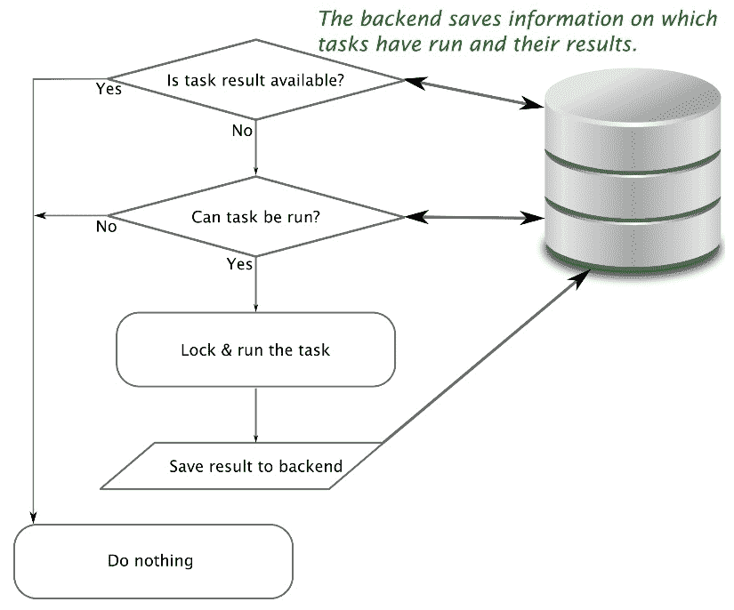

默认后端将文件写入磁盘(在这个有趣的名为`jugfile.jugdata/`的文件夹中)。另一个后端是可用的，它使用一个 Redis 数据库。通过 jug 负责的适当锁定，这也允许许多进程执行任务；每个进程将独立查看所有任务，并运行尚未运行的任务，然后将它们写回共享后端。这可以在同一台机器上工作(使用多核处理器)，也可以在多台机器上工作，只要它们都可以访问同一个后端(例如，使用网络磁盘或 Redis 数据库)。在本章的后半部分，我们将讨论计算机集群，但现在让我们专注于多核。

你也可以理解为什么它能够记住中间结果。如果后端已经有了任务的结果，它就不会再运行了。另一方面，如果您改变任务，即使是以微小的方式(通过改变其中一个参数)，它的散列也会改变。因此，它将被重新运行。此外，所有依赖于它的任务也将改变它们的散列，并且它们也将重新运行。

# 使用 jug 进行数据分析

Jug 是一个通用框架，但它非常适合中等规模的数据分析。开发分析管道时，最好自动保存中间结果。如果您之前已经计算过预处理步骤，并且只是更改您计算的要素，则不希望重新计算预处理步骤。如果您已经计算了要素，但想要尝试将一些新要素合并到组合中，您也不希望重新计算所有其他要素。

Jug 还专门针对 NumPy 阵列进行了优化。每当您的任务返回或接收 NumPy 数组时，您都在利用这种优化。Jug 是这个生态系统的另一部分，所有的东西都在一起工作。

我们现在来回顾一下[第 12 章](12.html)、*计算机视觉*。在那一章中，我们学习了如何计算图像的特征。请记住，基本管道由以下特性组成:

*   正在加载图像文件
*   计算功能
*   结合这些特征
*   标准化特征
*   创建分类器

我们打算重做这个练习，但这次用的是 jug。这个版本的优点是，现在可以添加新的特性或分类器，而不必重新计算所有的管道:

1.  我们从以下几个导入开始:

```py
from jug import TaskGenerator import mahotas as mh from glob import glob 
```

2.  现在，我们定义第一个任务生成器和特征计算函数:

```py
@TaskGenerator 
def compute_texture(im): 
    from features import texture 
    imc = mh.imread(im) 
    return texture(mh.colors.rgb2gray(imc)) 

@TaskGenerator 
def chist_file(fname): 
    from features import chist 
    im = mh.imread(fname) 
    return chist(im) 
```

我们导入的`features`模块是来自[第 12 章](12.html)、*计算机视觉*的模块。

We write functions that take the filename as input instead of the image array. Using the full images would also work, of course, but this is a small optimization. A filename is a string, which is small if it gets written to the backend. It's also very fast to compute a hash if needed. It also ensures that the images are only loaded by the processes that need them.

3.  我们可以在任何功能上使用`TaskGenerator`。即使对于我们没有编写的函数也是如此，例如`np.array`、`np.hstack`或以下命令:

```py
import numpy as np 
to_array = TaskGenerator(np.array) 
hstack = TaskGenerator(np.hstack) 
haralicks = [] 
chists = [] 
labels = [] 

# Change this variable to point to 
# the location of the dataset on disk 
basedir = '../SimpleImageDataset/' 
# Use glob to get all the images 
images = glob('{}/*.jpg'.format(basedir)) 
for fname in sorted(images): 
    haralicks.append(compute_texture(fname)) 
    chists.append(chist_file(fname)) 
    # The class is encoded in the filename as xxxx00.jpg 
    labels.append(fname[:-len('00.jpg')]) 

haralicks = to_array(haralicks) 
chists = to_array(chists) 
labels = to_array(labels) 
```

4.  使用 jug 的一个小不便是，我们必须总是编写函数来将结果输出到文件中，如前面的示例所示。这是为了使用`jug`的额外便利而付出的小小代价:

```py
@TaskGenerator 
def accuracy(features, labels): 
    from sklearn.linear_model import LogisticRegression 
    from sklearn.pipeline import Pipeline 
    from sklearn.preprocessing import StandardScaler 
    from sklearn import model_selection 

    clf = Pipeline([('preproc', StandardScaler()), 
                ('classifier', LogisticRegression())]) 
    cv = model_selection.LeaveOneOut() 
    scores = model_selection.cross_val_score( 
        clf, features, labels, cv=cv) 
    return scores.mean() 
```

5.  注意我们只是在这个函数里面导入`sklearn`。这是一个小优化。这样，`sklearn`只有在真正需要的时候才会导入:

```py
scores_base = accuracy(haralicks, labels) 
scores_chist = accuracy(chists, labels) 
combined = hstack([chists, haralicks]) 
scores_combined = accuracy(combined, labels) 
```

6.  最后，我们编写并调用一个函数来打印出所有结果。它希望它的参数是一个包含算法名称和结果的对列表:

```py
@TaskGenerator 
def print_results(scores): 
    with open('results.image.txt', 'w') as output: 
        for k,v in scores: 
            output.write('Accuracy [{}]: {:.1%}n'.format( 
                k, v.mean())) 

print_results([ 
        ('base', scores_base), 
        ('chists', scores_chist), 
        ('combined' , scores_combined), 
        ]) 
```

7.  就这样。现在，在 shell 上，使用`jug`运行以下命令来运行该管道:

```py
$ jug execute image-classification.py
```

# 重用部分结果

例如，假设您想要添加一个新功能(甚至一组功能)。正如我们在[第 12 章](12.html)、*计算机视觉*中看到的，通过改变特征计算代码，这是很容易做到的。然而，这将意味着再次重新计算所有的特性，这是很浪费的，尤其是如果你想快速测试新的特性和技术。

我们现在添加一组特征，即另一种称为线性二进制模式的纹理特征。这在 mahotas 中实现；我们只需要调用一个函数，但是我们用`TaskGenerator`包装它:

```py
@TaskGenerator 
def compute_lbp(fname): 
    from mahotas.features import lbp 
    imc = mh.imread(fname) 
    im = mh.colors.rgb2grey(imc) 
    # The parameters 'radius' and 'points' are set to typical values 
    # check the documentation for their exact meaning 
    return lbp(im, radius=8, points=6) 
```

我们用一个额外的函数调用替换了前面的循环:

```py
lbps = [] 
for fname in sorted(images): 
    # the rest of the loop as before 
    lbps.append(compute_lbp(fname)) 
lbps = to_array(lbps) 
```

我们称之为`accuracy`具有这些更新的特性:

```py
scores_lbps = accuracy(lbps, labels) 
combined_all = hstack([chists, haralicks, lbps]) 
scores_combined_all = accuracy(combined_all, labels) 

print_results([ 
        ('base', scores_base), 
        ('chists', scores_chist), 
        ('lbps', scores_lbps), 
        ('combined' , scores_combined), 
        ('combined_all' , scores_combined_all), 
        ]) 
```

现在，当您再次运行`jug execute`时，新的特征将被计算，但是旧的特征将从缓存中加载。这是 jug 非常强大的时候。它确保您总是得到您想要的结果，同时避免不必要地重新计算缓存的结果。您还会看到，添加这个特性集改进了前面的方法。

本章不会提到 jug 的所有特性，但这里总结了一些我们在正文中没有提到的最有趣的特性:

*   `jug invalidate`:这说明给定函数的所有结果都应该被认为是无效的，需要重新计算。这也将重新计算任何下游计算，这依赖于(甚至间接地)无效的结果
*   `jug status --cache`:如果`jug status`时间过长，可以使用`--cache`标志缓存状态，加快速度。请注意，这不会检测到对`jugfile`的任何更改，但您始终可以使用`--cache --clear`移除缓存并重新启动
*   `jug cleanup`:这将删除记忆缓存中的任何额外文件。这是一个垃圾收集操作

There are other, more advanced features, which allow you to look at values that have been computed inside the `jugfile`. Read up on features such as barriers in the jug documentation online at [http://jug.rtfd.org](http://jug.rtfd.org/).

# 使用亚马逊网络服务

当你有大量数据和大量计算要执行时，你可能会开始渴望更多的计算能力。亚马逊([http://aws.amazon.com](http://aws.amazon.com/))允许你按小时出租计算能力。因此，您可以获得大量计算能力，而不必承诺购买大量机器(包括管理基础架构的成本)。这个市场还有其他竞争对手，但亚马逊是最大的玩家，所以我们在这里简单介绍一下。

**亚马逊网络服务** ( **AWS** )是一大套服务。我们将只关注**弹性计算云** ( **EC2** )服务。该服务为您提供虚拟机和磁盘空间，可以快速分配和释放。

有三种使用模式。第一种是保留模式，根据这种模式，您可以预付费用以获得更便宜的每小时访问、固定的每小时费率和可变费率，这取决于整个计算市场(当需求较少时，成本较低；当有更多的需求时，价格就会上涨。

除了这种通用系统之外，还有几种不同成本的机器，从单核到具有大量内存甚至图形处理单元的多核系统。我们稍后会看到，您还可以获得几台更便宜的机器，并为自己构建一个虚拟集群。你也可以选择得到一个 Linux 或者 Windows 服务器(Linux 稍微便宜一点)。在这一章中，我们将在 Linux 上处理我们的例子，但是大部分信息对 Windows 机器也是有效的。

测试时，可以在**自由层**使用单机。这可以让你玩转系统，习惯界面，等等。请注意，这台机器包含一个缓慢的中央处理器。

这些资源可以通过网络界面进行管理。但是，也可以通过编程来实现这一点，并编写脚本来分配虚拟机、格式化硬盘以及通过 web 界面执行所有可能的操作。事实上，虽然 web 界面变化非常频繁(而且我们在书中展示的一些截图在付印时可能已经过时)，但编程界面更加稳定，并且自服务推出以来，总体架构保持稳定。

对 AWS 服务的访问是通过传统的用户名/密码系统进行的，尽管亚马逊称用户名为*访问密钥*，密码为密钥。他们这样做可能是为了将它与您用来访问 web 界面的用户名/密码分开。事实上，您可以创建任意多的访问/密钥对，并赋予它们不同的权限。这对于一个更大的团队来说很有帮助，在这个团队中，可以访问整个 web 面板的高级用户可以为权限更少的开发人员创建其他密钥。

Amazon.com has several regions. These correspond to physical regions of the world: West Coast US, East Coast US, several Asian locations, a South American one, and two European ones. If you are transferring data, it's best to keep it close to where you will be transferring to and from. Additionally, keep in mind that if you are handling user information, there may be regulatory issues regarding transfer to another jurisdiction. In this case, do check with an informed counsel on the implications of transferring data about European customers to the US or any other similar transfer.

AWS 是一个非常大的主题，有各种各样的书籍专门涵盖它。本章的目的是让您对 AWS 的可用性和可能性有一个总体印象。本着这本书的实践精神，我们通过举例来做到这一点，但我们不会穷尽所有的可能性。

# 创建您的第一台虚拟机

第一步是去[http://aws.amazon.com/](http://aws.amazon.com/)创建账户。这些步骤类似于任何其他在线服务。一台机器是免费的，但要获得更多，你需要一张信用卡。在这个例子中，我们将使用几台机器，所以如果你想运行它，它可能会花费你几美元。如果你还没有准备好取出信用卡，你当然可以阅读这一章来了解 AWS 提供了什么，而不必通过例子。然后，您可以就是否注册做出更明智的决定:

1.  一旦您注册了 AWS 并登录，您将被带到控制台。在这里，您将看到 AWS 提供的许多服务，如下图所示(这是本书撰写时显示的面板。亚马逊会定期进行细微的更改，因此您可能会看到与我们在书中呈现的略有不同的内容):

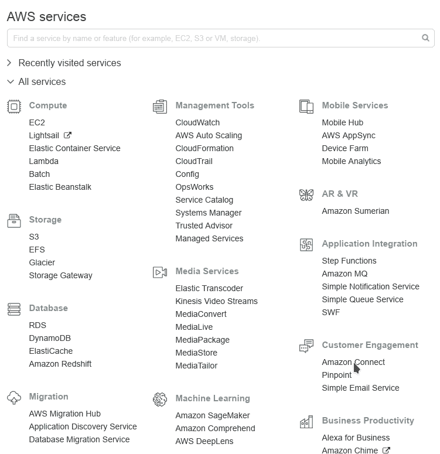

2.  您必须首先使用身份和访问管理服务创建用户。添加一个用户，在截图中称为`aws_ml`，并为其分配编程访问权限:

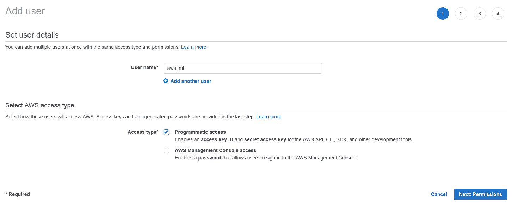

3.  我们为用户创建了一个组(在下面的截图中称为`EC2_FULL`)，并赋予其 AmazonEC2FullAccess 权限。分配正确的权限非常重要，否则后续步骤将失败，并出现权限错误:

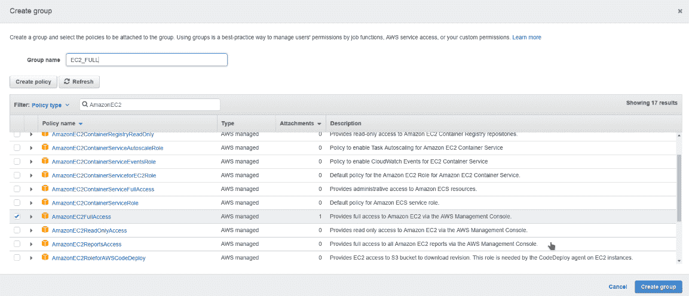

4.  最后，您必须复制信息，即访问密钥。您只需下载 CSV 文件并保存即可。同样，如果不保存此信息，后续步骤将失败:


5.  现在，我们回到控制台，这一次，我们选择并单击 EC2(计算列中的顶部元素)。我们现在看到了 EC2 管理控制台，如下图所示:

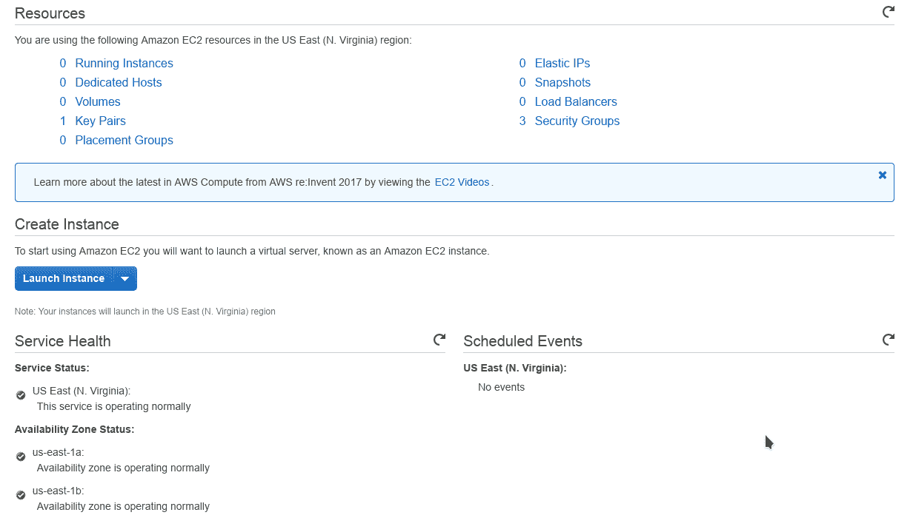

6.  在右上角，您可以选择您的地区(参见亚马逊地区信息框)。请注意，您将只看到您所选地区的信息。因此，如果您错误地选择了错误的区域(或者让机器在多个区域中运行)，您的机器可能不会出现(这似乎是使用 EC2 web 管理控制台的常见陷阱)。
7.  用 EC2 的说法，正在运行的服务器被称为**实例**。我们选择启动实例，这将导致以下屏幕，要求我们选择要使用的操作系统:

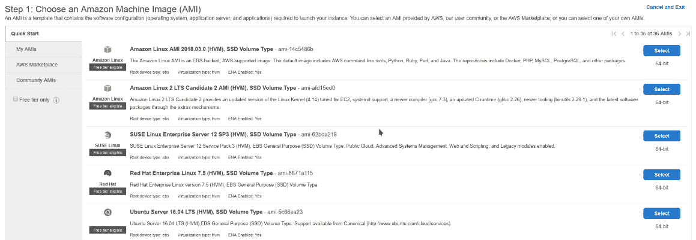

8.  选择 Amazon Linux 选项(如果您熟悉其他提供的 Linux 发行版之一，如 Red Hat、SUSE 或 Ubuntu，也可以选择其中一个，但配置会略有不同)。现在您已经选择了软件，您将需要选择硬件。在下一个屏幕上，您将被要求选择要使用的机器类型:

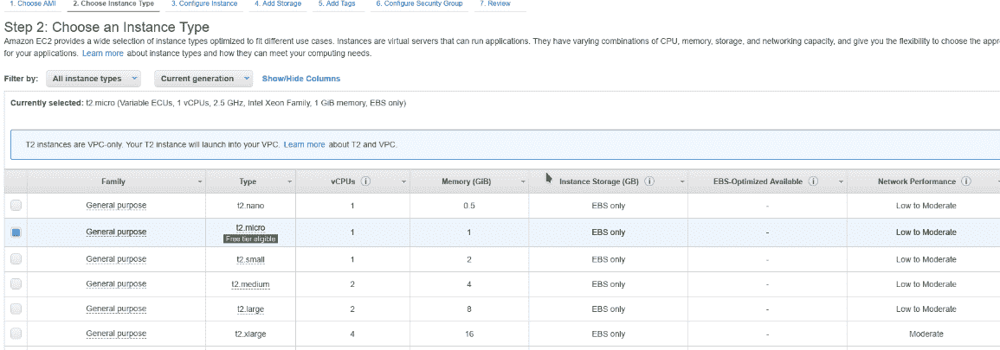

9.  我们将从`t2.micro`型的一个实例开始(该`t1.micro`型是一个更老的，甚至功能更弱的机器)。这是最小的机器，而且是免费的。继续点击“下一步”，接受所有默认值，直到屏幕上出现一个密钥对:

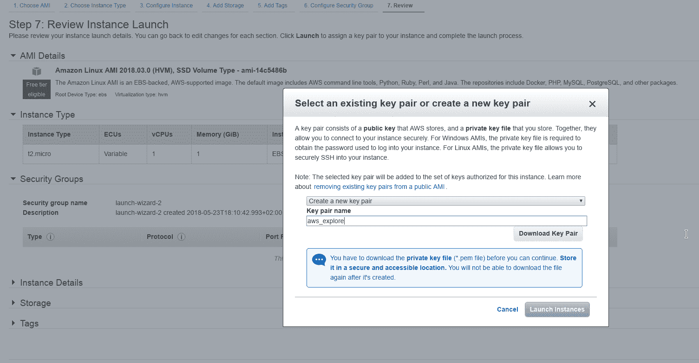

10.  我们将为密钥对选择名称`awskeys`。然后选中创建新的密钥对。命名密钥对文件`awskeys.pem`。下载并保存这个文件到安全的地方！这是**安全外壳** ( **SSH** )密钥，可以让你登录你的云机。接受剩余的默认值，您的实例将启动。
11.  现在，您需要等待几分钟，让实例启动。最终，该实例将以绿色显示，状态为正在运行:

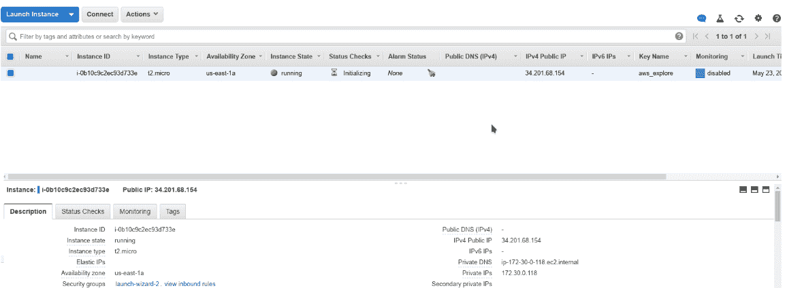

12.  在前面的截图中，您应该会看到可用于登录实例的公共 IP，如下所示:

```py
$ ssh -i awskeys.pem ec2-user@54.93.165.5  
```

13.  因此，我们将调用`ssh`命令，并将之前下载的密钥文件作为身份传递给它(使用`-i`选项)。我们以用户`ec2-user`的身份登录到 IP 地址为`54.93.165.5`的机器上。当然，这个地址在你的情况下会有所不同。如果您为实例选择另一个分发版本，用户名也可能会改变。在这种情况下，请尝试登录为`root`、`ubuntu`(对于 Ubuntu 发行版)或`fedora`(对于 Fedora 发行版)。
14.  最后，如果您运行的是 Unix 风格的操作系统(包括 macOS)，您可能需要调用以下命令来调整其权限:

```py
$ chmod 600 awskeys.pem  
```

这仅设置当前用户的读/写权限。否则 SSH 会给你一个丑陋的警告。

15.  现在你应该可以登录你的机器了。如果一切正常，您应该会看到横幅，如下图所示:

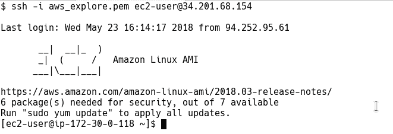

这是一个普通的 Linux 盒子，你有`sudo`权限:你可以以超级用户的身份运行任何命令，只要在它前面加上`sudo`。您可以运行它推荐的`update`命令来使您的机器达到速度。

# 在亚马逊 Linux 上安装 Python 包

如果您喜欢另一个发行版，您可以使用您对该发行版的了解来安装 Python、NumPy 和其他发行版。在这里，我们将在标准的亚马逊发行版上进行:

1.  我们首先安装几个基本的 Python 包，如下所示:

```py
$ curl -O https://repo.continuum.io/miniconda/Miniconda3-latest-Linux-x86_64.sh
$ chmod +x ./Miniconda3-latest-Linux-x86_64.sh
$ bash ./Miniconda3-latest-Linux-x86_64.sh 
```

2.  现在，按照基本说明，按照指示设置`PATH`变量:

```py
$ export PATH=/home/ec2-user/miniconda3/bin:$PATH  
```

3.  现在，我们可以创建一个新的环境，我们称之为`py3.6`(因为它是 Python 3.6 环境)并激活它:

```py
$ conda create -n py3.6 python=3.6 numpy scikit-learn
$ source activate py3.6  
```

4.  要安装`mahotas`和`jug`，我们添加`conda-forge`通道(这样做一般是个好主意；它有许多维护良好的软件包):

```py
$ conda config --add channels conda-forge
$ conda install mahotas imread jug git  
```

# 在我们的云机器上运行 jug

我们现在可以通过将代码存储库克隆到您的机器上来下载这本书的数据和代码:

```py
$ git clone \
    https://github.com/PacktPublishing/Building-Machine-Learning-Systems-with-Python-Third-edition
$ cd BuildingMachineLearningSystemsWithPython
$ cd ch14 
```

最后，我们运行以下命令:

```py
$ jug execute  
```

这很好，但是我们要等很长时间才能得到结果。我们的自由层机器(类型`t2.micro`)速度不是很快，只有一个处理器。所以，我们将升级我们的机器！

我们返回到 EC2 控制台，右键单击正在运行的实例以获得弹出菜单。我们需要首先停止实例。这是相当于关机的虚拟机。你可以随时停止你的机器。在这一点上，你停止支付他们。请注意，您仍在使用磁盘空间，这也有成本，单独计费。您可以终止实例，这也会破坏磁盘。这意味着您会丢失保存在机器上的任何信息。

机器停止后，“更改实例类型”选项变得可用。现在，我们可以选择一个更强大的实例，例如，一个有八个内核的`c5.xlarge`实例。机器仍然关闭，因此您需要再次启动它(相当于启动)。

AWS offers several instance types at different price points. As this information is constantly being revised as more powerful options are introduced and prices change (generally, getting cheaper), we cannot give you many details in the book, but you can find the most up-to-date information on Amazon's website.

我们需要等待实例重新启动。一旦它有了，就像我们以前做的那样查找它的 IP 地址。当您更改实例运行类型时，您的实例将获得分配给它的新地址。

You can assign a fixed IP to an instance using Amazon.com's Elastic IPs functionality, which you will find on the left-hand side of the EC2 console. This is useful if you find yourself creating and modifying instances very often. There is a small cost associated with this feature.

使用`8`内核，您可以同时运行`8` jug 进程，如以下代码所示:

```py
$ # the loop below runs 8 times
$ for counter in $(seq 8); do
> jug execute &
> done 
```

使用`jug status`检查这八个作业实际上是否正在运行。完成工作后(现在应该会很快)，您可以停止机器，并再次将其降级到`t2.micro`实例以节省资金。微观实例
可以免费使用(在一定范围内)，而我们使用的`c5.xlarge`每小时收费 0.170 美元(截至 2018 年 6 月—查看 AWS 网站了解最新信息)。

# 使用 cfncluster 自动生成集群

正如我们刚刚了解到的，我们可以使用 web 界面来生成机器，但是它很快就会变得乏味并且容易出错。幸运的是，亚马逊有一个 API。这意味着我们可以自动编写脚本来执行前面讨论的所有操作。更好的是，其他人已经开发了工具，可以用来机械化和自动化许多你想用 AWS 执行的过程。

亚马逊自己为自己的基础设施提供了许多命令行工具。对于集群供应，该工具称为`cfncluster`。如果您正在使用`conda`，您可以通过以下方式进行安装:

```py
$ conda install cfncluster
```

您可以在本地机器上运行这个:它将使用亚马逊应用编程接口。

第一步是在您的网络浏览器中返回到 AWS 控制台，并向您的 AWS 用户添加管理员访问权限。这是一种蛮力方法；它赋予用户所有管理权限，虽然它在了解 AWS 时很有用，但不建议在生产中使用:

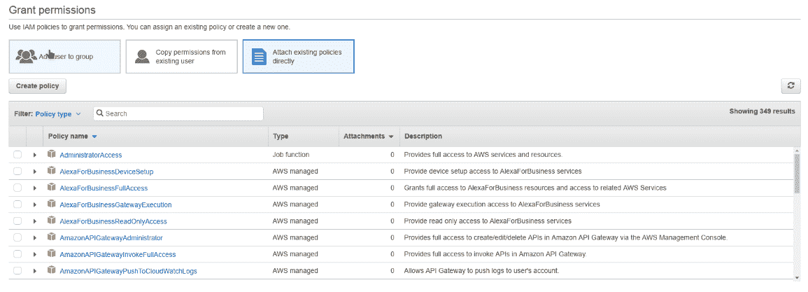

现在，我们使用 VPC 服务在 AWS 上创建了一个新的虚拟私有云。选择所有默认选项:

```py
$ cfncluster configure  
```

从列出的选项中选择。选择正确的密钥很重要(我们之前已经生成了)。这将在`~/.cfncluster/config`中生成一个配置文件。目前，我们将使用所有的默认值，但这是您以后可以更改它们以满足您的需求的地方。

Keys, keys, and more keys:
There are three completely different types of keys that are important when dealing with AWS. First, there is a standard username/password combination, which you use to log in to the website. Second, there is the SSH key system, which is a public/private key system implemented with files; with your public key file, you can log in to remote machines. Third, there is the AWS access key/secret key system, which is just a form of username/password that allows you to have multiple users on the same account (including adding different permissions to each one, but we will not cover these advanced features in this book). To look up our access/secret keys, we go back to the AWS Console, click on our name in the top right, and select Security Credentials. Now, at the bottom of the screen, we should see our access key, which may look something like this: `AAKIIT7HHF6IUSN3OCAA`.

我们现在可以创建集群:

```py
$ cfncluster create public  
```

这可能需要几分钟时间。这将为我们的集群分配两个计算节点和一个主节点(这些是默认值；您可以在`cfncluster`配置文件中更改它们)。过程完成后，您应该会看到输出:

```py
**Output:"MasterPublicIP"="52.86.118.172" **     **
Output:"MasterPrivateIP"="172.30.2.146" 
Output:"GangliaPublicURL"="http://52.86.118.172/ganglia/" 
Output:"GangliaPrivateURL"="****http://172.30.2.146/ganglia/****"**
```

注意打印出来的主节点的 IP 地址(本例中为`52.86.118.172`)。如果您忘记了，可以使用以下命令再次查找:

```py
$ cfncluster status public  
```

所有这些节点都有相同的文件系统，因此我们在主节点上创建的任何内容也将被工作节点看到。这也意味着我们可以在这些集群上使用 jug。

这些集群可以按照您的意愿使用，但是它们配备了作业队列引擎，这使得它们非常适合批量处理。使用它们的过程很简单:

1.  您登录到主节点。
2.  你在主机上准备你的脚本(或者更好的是，事先准备好)。
3.  您向队列提交作业。作业可以是任何 Unix 命令。调度程序会找到空闲节点并运行您的作业。

4.  你等待工作完成。
5.  您在主节点上读取结果。你现在也可以杀死所有的从节点来省钱。无论如何，当你不再需要系统时，不要让它一直运行！否则，这将花费你(美元和美分)。

如前所述，`cfncluster`为其集群提供批量排队系统；您编写一个脚本来执行您的操作，将它放在队列中，它将在任何可用的节点中运行。

和以前一样，我们使用密钥登录主节点:

```py
$ ssh -i awskeys.pem ec2-user@52.86.118.172  
```

像以前一样设置 miniconda(代码库中的 setup— `aws.txt`文件包含所有必要的命令)。我们可以使用与以前相同的`jugfile`系统，只是现在，我们不再直接在主机上运行它，而是在集群上调度它:

1.  首先，编写一个非常简单的包装脚本，如下所示:

```py
#!/usr/bin/env bash
export PATH=$HOME/miniconda3/bin:$PATH
source activate py3.6
jug execute jugfile.py 
```

2.  称之为`run-jugfile.sh`，使用`chmod +x run-jugfile.sh`赋予其可执行权限。现在，我们可以使用以下命令在群集上安排作业:

```py
$ qsub -cwd ./run-jugfile.sh  
```

这将创建两个作业，每个作业都将运行`run-jugfile.sh`脚本，我们简单地称之为 jug。你仍然可以随心所欲地使用大师。特别是，您可以随时运行`jug status`并查看计算状态。事实上，jug 正是在这样的环境下开发的，所以它在其中工作得非常好。

3.  最终，计算会结束。此时，我们需要首先保存我们的结果。然后，我们可以杀死所有的节点。我们创建一个目录`~/results`，并在那里复制我们的结果:

```py
# mkdir ~/results
# cp results.image.txt ~/results  
```

4.  现在，注销集群并返回到我们的工作机:

```py
# exit  
```

5.  现在我们回到了原来的 AWS 机器或您的本地计算机(注意下面代码示例中的`$`符号):

```py
**$ scp -i awskeys.pem -pr** **ec2-user@****52.86.118.172****:****results .** 
```

6.  最后，我们应该杀死所有节点来省钱，如下所示:

```py
$ cfncluster stop public
Stopping the cluster will destroy the compute nodes, but keep the master node running as well as the disk space. This reduces costs to a minimum, but to really destroy all 
$ cfncluster delete public  
```

Terminating will really destroy the filesystem and all your results. In our case, we have copied the final results to safety manually. Another possibility is to have the cluster write to a filesystem, which is not allocated and destroyed by `cfncluster`, but is available to you on a regular instance; in fact, the flexibility of these tools is immense. However, these advanced manipulations cannot all fit in this chapter.
 [](http://star.mit.edu/cluster/) 

# 摘要

我们研究了如何使用 jug，一个小的 Python 框架，以一种利用多核或多台机器的方式来管理计算。虽然这个框架是通用的，但它是专门为满足作者(也是本书的作者)的数据分析需求而构建的。因此，它有几个方面使其适合 Python 机器学习环境的其余部分。

您还了解了 AWS 和亚马逊云。使用云计算通常比建立内部计算能力更有效地利用资源。如果你的需求不是一成不变的，而是在不断变化的，那就更是如此。此外`cfncluster`甚至允许集群在你启动更多作业时自动增长，在它们终止时自动收缩。

这是这本书的结尾。我们已经走了很长的路。您学习了如何执行分类和聚类。您学习了降维和主题建模，以便理解大型数据集。最后，我们看了一些具体的应用(如音乐流派分类和计算机视觉)。对于实现，我们依赖于 Python。这种语言在 NumPy 的基础上构建了一个日益扩展的数值计算包生态系统。只要有可能，我们就依赖 scikit-learn，但在必要时使用其他包。由于它们都使用相同的基本数据结构(NumPy 多维数组)，因此可以无缝地混合不同包的功能。本书中使用的所有包都是开源的，可以在任何项目中使用。

自然，我们没有涵盖每一个机器学习主题。在附录中，我们提供了一些其他资源，这些资源将帮助感兴趣的读者了解更多关于机器学习的知识。