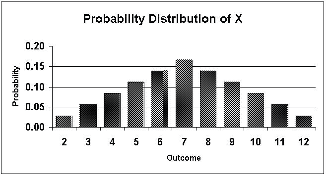
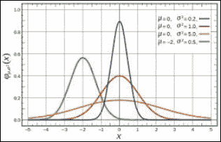
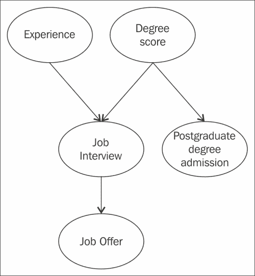

# 第一章。可能性

在我们踏上穿越图形模型的旅程之前，我们必须为自己配备一些有助于理解的工具。我们将首先介绍概率及其概念，如随机变量和分布类型。

然后，我们将试图理解概率可以帮助我们回答的问题类型以及概率的多种解释。最后，我们将快速了解一下贝叶斯规则，它有助于我们理解概率之间的关系，还将了解附带的条件概率和链式规则的概念。

# 概率论

我们经常会遇到这样的情况:我们不得不锻炼自己对事件发生的主观信念；例如，天气或交通等本质上随机的事件。概率也可以理解为主观信念的程度。

当我们谈论天气(例如，今天晚上)时，可以理解为天气可以有多种结果，如下雨、晴天或多云。所有可能结果的空间被称为事件(也称为样本空间)。例如，掷骰子的结果是一组从 1 到 6 的数字。在处理可测量的结果时，例如掷骰子或今天的天气(可能是雨天、晴天或阴天)，我们可以为每个结果分配一个概率值，以概括我们对这些结果的信任程度。用来表达我们信念的记数法的一个例子是 *P(雨天)=0.3* ，可以解读为下雨的概率是 0.3%或者 30%。

Kolmogorov 提出的概率公理陈述如下:

*   The probability of an event is a non-negative real number (that is, the probability that it will rain today may be small, but nevertheless will be greater than or equal to 0). This is explained in mathematical terms as follows:

    

*   The probability of the occurrence of some event in the sample space is 1 (that is, if the weather events in our sample space are rainy, sunny, and cloudy, then one of these events has to occur), as shown in the following formula:

    

*   The sum of the probabilities of mutually exclusive events gives their union, as given in the following formula:

    

当我们讨论骰子或抛硬币的公平(或不公平)时，我们讨论的是概率的另一个关键方面，即模型参数。公平硬币的概念转化为这样一个事实，即控制参数的值为 0.5，有利于头部，这也转化为这样一个事实，即我们假设所有结果的可能性相等。在这本书的后面，我们将研究需要多少参数来完全指定一个概率分布。然而，我们正在超越自己。首先让我们了解一下概率分布。

一个概率分布由与每个可测量结果相关的概率组成。在离散结果(如掷骰子或掷硬币)的情况下，分布由概率质量函数指定，而在连续结果(如一个班级中学生的身高)的情况下，分布由概率密度函数指定。

让我们用一个的例子来看看离散分布。抛硬币有两种结果:正面和反面，一枚公平的硬币会给所有结果分配相同的概率。这意味着概率分布很简单——头部为 0.5，尾部为 0.5。像这样的分布(例如，正面 0.3，反面 0.7)将是对应于有偏硬币的分布。下图显示了掷出两个骰子时数值总和的离散概率分布:

给所有结果分配相等概率的分布称为均匀分布。这是我们将探索的许多发行版之一。

让我们来看看与连续结果相关的常见分布之一，即高斯或正态分布，它呈钟形，因此被称为钟形曲线(尽管还有其他形状类似于钟形的分布)。以下是一些真实世界的例子:

*   一个班级学生的身高是对数正态分布的(如果我们取学生身高的对数并作图，得到的分布是正态分布的)
*   物理实验中的测量误差

高斯分布有两个参数:平均值()和方差()。参数均值和方差分别决定了中间点和远离均值的分布离散度。

下图显示了均值和方差值不同的多个高斯分布。可以看出，方差越大，分布越广，而平均值会移动 *x* 轴上的峰值，如下图所示:

# 概率推理的目标

既然我们已经理解了概率的概念，我们必须问问自己这是如何使用的。我们问的这类问题分为以下几类:

*   第一个问题是参数估计，比如，一个硬币有偏差还是公平？如果有偏差，参数值是多少？
*   The second question is that given the parameters, what is the probability of the data? For example, what is the probability of five heads in a row if we flip a coin where the bias (or parameter) is known.

    上述问题取决于数据(或缺乏数据)。如果我们有一组硬币翻转的观测值，我们可以估计控制参数(即参数估计)。如果我们有一个参数的估计，我们想估计硬币翻转产生的数据的概率(第二个问题)。然后，有时我们会来回改进模型。

*   模型是否适合这个问题，是我们可以询问的第三个问题。有没有一个单一的参数控制投币实验的结果？当我们希望对一个复杂的现象(如交通或天气预测)建模时，模型中肯定存在几个参数，其中数百甚至数千个参数并不罕见。在这种情况下，我们想问的问题是，哪种模型更适合数据？我们将在后面的章节中看到一些关于模型拟合不同方面的例子。

# 条件概率

让我们用一个具体的例子，我们有一群申请工作的候选人。一个事件( *x* )可能是所有获得录用的候选人的集合，而另一个事件( *y* )可能是所有经验丰富的候选人的集合。我们可能想推理一下联合事件的集合()，这是一组有经验的候选人得到了一个报价(联合事件的概率也写成)。提出的问题是，如果我们知道一个事件已经发生，是否会改变另一个事件发生的概率。在这种情况下，如果我们确定某个候选人得到了一份工作，这能告诉我们他们的经历吗？

条件概率正式定义为，可以理解为 *x* 的概率，假设 *y* 发生。分母是联合分布所有可能结果的总和，取值 *x* 相加，即。

# 链式法则

链式法则允许我们利用一组随机变量的条件概率来计算它们的联合分布。换句话说，联合分布是单个条件概率的乘积。从开始，如果是事件，。

我们将在图形模型中详细回到这一点，其中链式规则通过将一个大问题(计算联合分布)拆分成更小的问题(条件概率)来帮助我们分解它。

# 贝叶斯法则

贝叶斯法则是概率论的基础之一，这里就不多赘述了。它来自条件概率的定义，如下式所示:

从公式中，我们可以推断出关于贝叶斯规则的以下内容——我们对我们正在推理的问题抱有先验信念。这就是所谓的前一项。当我们开始看到数据时，我们的信念发生变化，这就产生了我们最终的信念(称为后验)，如下式所示:

让我们用一个例子来看看贝叶斯规则背后的直觉。艾米和卡尔正站在火车站等火车。在过去的一年里，艾米每天都乘同一列火车，这是卡尔第一天来车站。他们之前对火车准点的看法是什么？

在过去的一年里，艾米每天都在赶火车，她总是看到火车在预定的出发时间两分钟内到达。因此，她坚信火车最多会晚点两分钟。由于这是卡尔的第一天，他不知道火车会准时。然而，卡尔在过去的一年里一直在环游世界，去过火车不准时的地方。因此，他不太相信火车会晚点 30 分钟。

第一天，火车晚点了 5 分钟。这个观察对艾米和卡尔的影响是不同的。由于艾米有很强的优先性，她的信念稍微修改了一下，接受了火车可能晚点 5 分钟的事实。卡尔的信念现在改变了，认为这里的火车相当准时。

换句话说，后验信念受到多种方式的影响:当具有强先验的人看到一些观察结果时，他们的后验信念与前验信念相比变化不大。另一方面，当先验较弱的人看到大量的观测值(强似然)时，他们的后验信念会发生很大的变化，并且很大程度上受观测值(似然)而不是前验信念的影响。

让我们看一个贝叶斯规则的数值例子。 *D* 是运动员使用**兴奋剂** ( **PEDs** ) 的赛事。 *T* 是药检返回阳性的事件。在整个讨论中，我们使用质数( *'* )符号来表示事件没有发生；例如， *D'* 代表运动员没有使用 PEDs 的项目。

*P(D|T)* 是在药检返回阳性的情况下，运动员使用 PEDs 的概率。 *P(T|D)* 是在运动员使用 PEDs 的情况下，药检返回阳性的概率。

进行药物测试的实验室声称，它可以在 90%的时间内检测到 PEDs。我们还了解到假阳性率(测试呈阳性但未使用 PEDs 的运动员)为 15%，10%的运动员使用 PEDs。如果药检结果呈阳性，运动员使用 PEDs 的概率有多大？

根据贝叶斯规则的基本形式，我们可以写出下面的公式:

现在，我们有以下数据:

*   *P(T|D)* :等于 0.90
*   *P(T|D')* :这等于 0.15(假设运动员没有使用 PEDs，测试返回阳性)
*   *P(D)*: This is equal to 0.1

    当我们代入这些值时，我们得到的最终值为 0.4，如下式所示:

    

这个结果似乎有点违反直觉，因为尽管 PEDs 检测呈阳性，运动员使用 PEDs 的几率只有 40%。这是因为 PEDs 本身的使用率很低(只有 10%的运动员使用 PEDs)，而且假阳性率相对较高(0.15%)。

# 概率的解释

在前面的例子中，我们注意到了我们是如何拥有先验信念的，并且观测数据的引入可以改变我们的信念。然而，这个观点是对概率的多种解释之一。

第一种(我们已经讨论过了)是贝叶斯解释，认为概率是一种信念程度，信念程度在考虑证据前后变化。

第二种观点被称为频率论解释，其中概率衡量结果的比例，并假设先前的信念是一个没有数据支持的不正确的概念。

为了用一个例子来说明这一点，让我们回到抛硬币实验，我们希望了解硬币的偏差。我们做了两个实验，分别翻转硬币 10 次和 10000 次。在第一个实验中，我们得到 7 个头，在第二个实验中，我们得到 7000 个头。

从频率主义者的观点来看，在这两个实验中，获得头部的概率是 0.7 (7/10 或 7000/10000)。然而，我们可以很容易地说服自己，我们对第二个实验的结果比第一个实验更有信心。这是因为第一个实验的结果有贝叶斯的观点，如果我们有先验的信念，第二个实验的观察会压倒先验，这在第一个实验中是不太可能的。

对于以下部分的讨论，让我们考虑一个公司面试求职者的例子。在邀请候选人参加面试之前，会根据候选人的经验以及候选人在毕业结果中获得的平均绩点对候选人进行筛选。如果候选人通过筛选，他将被要求参加面试。一旦候选人被面试，公司可能会向候选人发出工作邀请(这是基于候选人在面试中的表现)。候选人也在评估攻读研究生学位，候选人是否被录取他选择的研究生学位课程取决于他在学士学位中的成绩。下图直观地展示了我们对影响工作选择(和研究生学位录取)标准的因素之间的关系的理解:

# 随机变量

随机变量的经典概念是其值会因偶然性而变化(维基百科)。大多数程序员都遇到过编程语言标准库中的随机数。从程序员的角度来看，与普通变量不同，随机变量每次读取其值时都会返回一个新值，其中变量的值可能是新调用随机数生成器的结果。

我们早些时候已经看到了事件的概念，以及我们如何从一组可测量的事件中考虑单个事件发生的概率。然而，考虑结果的属性可能是合适的。

在求职者的求职例子中，求职者的属性之一是他的经验。该属性可以采用多个值，例如高度相关或不相关。讨论不同结果中的属性及其值的形式机制被称为随机变量[柯勒等人，2.1.3.1]。

随机变量可以采用分类值(如硬币投掷结果的 *{Heads，Tails}* )或真实值(如一个班级学生的身高)。

# 边际分布

我们已经看到求职示例(在上图中描述)有五个随机变量。分别是*成绩**经历**面试**offer**录取*。这些随机变量有一组对应的事件。

现在，让我们考虑随机变量的子集 *X* ，其中 *X* 只包含*经验*随机变量。该子集包含高度相关的事件*和不相关的事件*。**

 **如果我们在子集 X 中登记所有事件的概率，这将被称为边际分布，其示例可以在下面的公式中找到:

像所有有效分布一样，概率总和应该是 1。

随机变量集(描述边际分布的)可以只包含一个变量(如前面的例子)，也可以包含几个变量，如*{经验、等级、面试}* 。

# 联合配送

我们已经看到边际分布是描述随机变量子集的分布。接下来，我们将讨论描述集合中所有随机变量的分布。这叫做联合分配。让我们看看求职示例中涉及*学位分数*和*经验*随机变量的联合分布:

<colgroup><col style="text-align: left"> <col style="text-align: left"> <col style="text-align: left"> <col style="text-align: left"> <col style="text-align: left"></colgroup> 
| **度评分** | **相关经验** |   |
|   | 高度相关 | 不相关 |   |
| 贫穷的；贫困的 | Zero point one | Zero point one | Zero point two |
| 平均的 | Zero point one | Zero point four | Zero point five |
| 优秀的 | Zero point two | Zero point one | Zero point three |
|   | Zero point four | Zero point six | one |

深灰色单元格中的值是联合分布，浅灰色单元格中的值是边缘分布(有时称为边缘分布，因为它们写在页边距上)。可以观察到，单个边际分布的总和为 1，就像正态概率分布一样。

一旦描述了联合分布，就可以通过对单个行或列求和来找到边际分布。在上表中，如果我们将各列相加，第一列给出了*高度相关*的概率，第二列给出了*不相关*的概率。可以看出，对行应用类似的策略给了我们学位得分的概率。

# 独立

独立事件的概念可以通过看一个例子来理解。假设我们有两个骰子，当我们一起掷骰子时，一个骰子的分数为 2，另一个骰子的分数为 3。不难看出，这两个事件是相互独立的，因为每个骰子的结果不会影响另一个或与之相互作用。

我们可以用多种方式定义独立的概念。假设我们有两个事件 *a* 和 *b* ，这两个事件结合的概率只是它们概率的乘积，如下式所示:

如果我们把的概率写成(即在事件 *a* 已经发生的情况下， *a* 的概率和 *b* 的概率的乘积)，如果事件 *a* 和 *b* 是独立的，它们就分解为。

指定独立性的另一种方式是说 *a* 给 *b* 的概率只是 *a* 的概率，也就是说 *b* 的出现不影响 *a* 的概率，如下式所示:

可见独立性是对称的，即。虽然这种独立性的定义是在事件的背景下，但同样的概念可以推广到随机变量的独立性。

# 条件独立

给定两个事件，确定它们是否独立并不总是明显的。考虑一个求职者，他申请了两家公司的工作，脸书和谷歌。它可能导致两个事件，第一个是候选人接到谷歌的面试电话，另一个事件是他接到脸书的面试电话。知道第一个事件的结果是否能告诉我们第二个事件的概率？是的，确实如此，因为我们可以推断，如果一个候选人足够聪明，能够接到谷歌的电话，他就是一个有前途的候选人，而且接到脸书电话的概率相当高。

到目前为止已经确定的是，这两个事件不是独立的。假设我们得知公司根据候选人的成绩决定发送面试邀请，我们得知候选人的成绩是 A，由此我们推断候选人相当聪明。我们可以推断，由于候选人相当聪明，知道候选人接到谷歌的面试电话不会告诉我们更多关于他感知的智力的信息，也不会改变来自脸书的面试电话的概率。这可以被正式注释为给定谷歌面试呼叫和 A 级的脸书面试呼叫的概率等于给定 A 级的脸书面试呼叫的概率，如下式所示:

换句话说，我们是说来自脸书的邀请是有条件独立于来自谷歌的邀请的，给定的候选人具有 a 级

# 查询类型

了解了联合概率分布和条件概率分布之后，让我们将注意力转向我们可以对这些分布提出的查询类型。

## 概率查询

这是最常见的查询类型，由以下两部分组成:

*   **证据**:这是已经观察到的随机变量的子集 *E*
*   **查询**:这个是随机变量的子集 *Y*

我们希望计算概率的值，它是后验概率或超过 *Y* 的边际概率。再次使用求职者的例子，我们可以计算面试电话的边际分布，条件是*学位分数= A 级*。

## 地图查询

**最大后验概率(MAP** )是对变量的某些子集的最高概率联合赋值。在概率查询的情况下，重要的是概率的值。在地图的情况下，计算联合分配的精确概率值是次要的，相比于寻找所有随机变量的联合分配的任务。

如果概率值相等，可以返回多个联合赋值。我们将从一个例子中看到，在联合赋值的情况下，每个边际值的最高概率可能不是最高的联合赋值(下面的例子来自柯勒等人)。

考虑两个非独立随机变量 *X* 和 *Y* ，其中 *Y* 依赖于 *X* 。下表显示了 *X* 上的概率分布:

<colgroup><col style="text-align: left"> <col style="text-align: left"></colgroup> 
| 

X0

 | 

X1

 |
| --- | --- |
| Zero point four | Zero point six |

我们可以看到随机变量 *X* 的 MAP 赋值是 *X1* ，因为它有更高的值。下表显示了 *X* 和 *Y* 的边际分布:

<colgroup><col style="text-align: left"> <col style="text-align: left"> <col style="text-align: left"></colgroup> 
| 

P(Y&#124;X)

 | 

Y0

 | 

Y1

 |
| --- | --- | --- |
| X0 | Zero point one | Zero point nine |
| X1 | Zero point five | Zero point five |

*X* 和 *Y* 上的联合分布如下表所示:

<colgroup><col style="text-align: left"> <col style="text-align: left"></colgroup> 
| 

分配

 | 

价值

 |
| --- | --- |
| X0，Y0 | Zero point zero four |
| X0，Y1 | Zero point three six |
| X1，Y0 | Zero point three |
| X1，Y1 | Zero point three |

在上表所示的联合分布中，随机变量(X，Y)的 MAP 赋值为(X0，Y1)，而 X (X1)的 MAP 赋值不是联合赋值的 MAP 的一部分。综上所述，MAP 赋值不能简单地取每个随机变量在边际分布中的最大概率值。

另一种不同类型的 MAP 查询是边际 MAP 查询，在边际 MAP 查询中，我们只有构成查询的变量子集，而不是联合分布。在前面的示例中，边际 MAP 查询将是 MAP (Y)，这是 MAP 分配给随机变量 Y 的最大值，可以通过查看联合分布并对 x 的值求和来读取。从下表中，我们可以读取最大值并确定 MAP (Y)是 Y1:

<colgroup><col style="text-align: left"> <col style="text-align: left"></colgroup> 
| 

分配

 | 

价值

 |
| --- | --- |
| Y0 | Zero point three four |
| Y1 | Zero point six six |

### 注

边际查询的数据由萨古尔·斯里哈里通过*查询联合概率分布*获得。你可以在[找到它。](http://www.cedar.buffalo.edu/~srihari/CSE574/Chap8/Ch8-PGM-Directed/8.1.2-QueryingProbabilityDistributions.pdf)

# 总结

在这一章中，我们研究了基本概率、随机变量和贝叶斯定理的概念。我们还通过一个求职者的例子学习了链式法则、联合分布和边际分布，我们将在后面的章节中回到这个例子。掌握了这些主题后，我们现在可以在接下来的章节中继续探索贝叶斯和马尔可夫网络，我们将正式描述这些网络来回答我们在本章中讨论的一些概率查询。虽然这一章完全是理论性的，但从下一章开始，我们将实现 Python 代码来寻找问题的答案。**