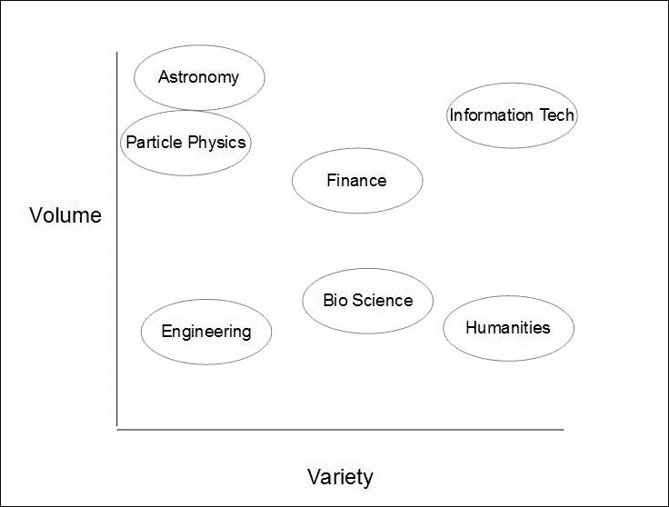
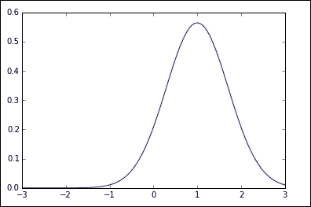
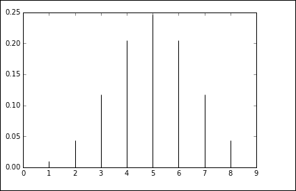
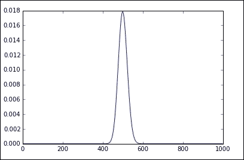
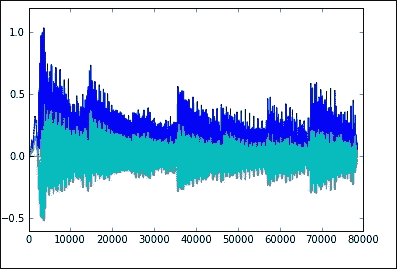
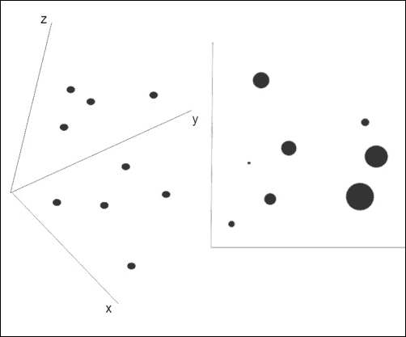

# 第三章。将数据转化为信息

原始数据可以有许多不同的格式，数量和质量各不相同。有时，我们被数据淹没，有时我们努力从数据中获取每一滴信息。数据要成为信息，需要一些有意义的结构。我们经常不得不处理不兼容的格式、不一致、错误和丢失的数据。能够访问数据集的不同部分或基于一些关系标准提取数据子集是很重要的。我们需要发现数据中的模式，并了解数据是如何分布的。我们可以使用许多工具从可视化、运行算法或仅仅查看电子表格中的数据中找到隐藏在数据中的信息。

在本章中，我们将介绍以下广泛的主题:

*   大数据
*   数据属性
*   数据源
*   数据处理和分析

但是首先，让我们来看看下面的解释:

# 什么是数据？

数据可以存储在硬盘上，通过网络传输，或者通过摄像机和麦克风等传感器实时捕捉。如果我们从物理现象中取样，比如视频或录音，那么空间是连续的，实际上是无限的。一旦这个空间被采样，即被数字化，这个空间的有限子集已经被创建，并且至少一些最小的结构已经被强加在它上面。数据在硬盘上，以位编码，给定一些属性，如名称、创建日期等。除此之外，如果要在应用程序中使用数据，我们需要问，“数据是如何组织的，它有效地支持什么类型的查询？”

当面对看不见的数据集时，第一阶段是探索。数据探索包括检查数据的组成部分和结构。它包含多少个样本，每个样本有多少个维度？每个维度的数据类型是什么？我们还应该了解变量之间的关系以及它们是如何分布的。我们需要检查数据值是否符合我们的预期。数据是否有明显的错误或差距？

数据探索必须在特定问题的范围内进行。显然，首先要弄清楚的是数据集是否有可能提供有用的答案。值得我们花时间继续，还是需要收集更多的数据？探索性数据分析不一定是在特定假设的情况下进行的，但也许是在某种意义上，哪些假设可能会提供有用的信息。

数据是支持或否定假设的证据。这个证据只有在可以与一个相互竞争的假设相比较时才有意义。在任何科学过程中，我们都使用控制。为了检验一个假设，我们需要将其与一个等价系统进行比较，在这个等价系统中，我们感兴趣的变量集保持不变。我们应该试图用一种机制和解释来说明因果关系。我们需要一个合理的理由来进行观察。我们还应该考虑现实世界是由多个相互作用的组件组成的，处理多元数据会导致复杂性呈指数级增长。

正是考虑到这些事情，我们正在寻求探索的领域的草图，我们接近新的数据集。我们有一个目标，一个我们希望达到的点，我们的数据是一张穿越这个未知地形的地图。

# 大数据

在全球范围内创建和存储的数据量几乎是不可思议的，而且还在持续增长。大数据是一个描述大量数据的术语，包括结构化数据和非结构化数据。现在，让我们从大数据的挑战开始，深入研究大数据。

## 大数据的挑战

大数据是以三大挑战为特征的。它们如下:

*   数据量
*   数据的速度
*   数据的多样性

### 数据量

体积问题可以从三个不同的方向来处理:**效率**、**伸缩性**和**平行度**。效率是关于最小化算法处理一个信息单元所需的时间。其中的一个组成部分是硬件的底层处理能力。另一个组件，也是我们更能控制的组件，是确保我们的算法不会因为不必要的任务而浪费宝贵的处理周期。

可伸缩性实际上是关于蛮力和尽可能多地向问题扔硬件。考虑到**摩尔定律**，该定律指出计算机功率每两年翻一番的趋势将持续下去，直到达到极限；很明显，可扩展性本身无法跟上不断增长的数据量。在许多情况下，简单地增加更多内存和更快的处理器并不是一个经济高效的解决方案。

并行是机器学习中一个不断发展的领域，它包含了许多不同的方法，从利用多核处理器的能力，到许多不同平台上的大规模分布式计算。最常见的方法可能是在许多机器上简单地运行相同的算法，每台机器都有不同的参数集。另一种方法是将学习算法分解成自适应的查询序列，并并行处理这些查询。这种技术的一个常见实现被称为 **MapReduce** ，或其开源版本 **Hadoop** 。

### 数据速度

速度问题通常从数据生产者和数据消费者的角度来处理。两者之间的数据传输速率称为速度，可以用交互响应时间来衡量。这是从发出查询到发送响应的时间。响应时间受到延迟的限制，例如硬盘读写时间以及通过网络传输数据所需的时间。

数据的生产速度越来越快，这在很大程度上是由移动网络和设备的快速扩张推动的。日常生活中日益增多的仪器仪表正在彻底改变产品和服务的交付方式。这种不断增加的数据流导致了**流处理**的想法。当输入数据的速度使其无法完整存储时，必须进行一定程度的分析，因为数据流本质上决定了哪些数据是有用的，哪些数据应该存储，哪些数据可以丢弃。一个极端的例子是欧洲粒子物理研究所的大型强子对撞机，在那里的绝大多数数据被丢弃。一个复杂的算法必须在数据生成时对其进行扫描，在数据干草堆中寻找信息。处理数据流可能很重要的另一个例子是当应用程序需要立即响应时。这越来越多地用于在线游戏和股市交易等应用。

我们感兴趣的不仅仅是传入数据的速度；在许多应用程序中，特别是在 web 上，系统输出的速度也很重要。考虑像推荐系统这样的应用程序，它们需要处理大量数据，并在网页加载所需的时间内给出响应。

### 数据种类

从不同来源收集数据总是意味着要处理不一致的数据结构和不兼容的格式。这通常也意味着要处理不同的语义，并且必须理解一个可能建立在完全不同的逻辑前提上的数据系统。我们必须记住，通常情况下，数据会被重新用于一个完全不同于其最初用途的应用程序。有各种各样的数据格式和底层平台。将数据转换为一种一致的格式会花费大量时间。即使这样做了，数据本身也需要对齐，以便每条记录由相同数量的特征组成，并以相同的单位进行测量。

考虑从网页获取数据这一相对简单的任务。数据已经通过使用标记语言进行了结构化，通常是 HTML 或 XML，这可以帮助我们获得一些初始结构。然而，我们只需要细读网络就可以发现，没有标准的方式来以信息相关的方式呈现和标记内容。XML 的目的是将与内容相关的信息包含在标记标签中，例如，通过为*作者*或*主题*使用标签。然而，这种标签的使用远非普遍和一致的。此外，网络是一个动态的环境，许多网站经历频繁的结构变化。这些变化通常会破坏期望特定页面结构的 web 应用程序。

下图显示了大数据挑战的两个方面。我已经包括了几个例子，这些领域可能大约位于这个空间。例如，天文学的来源很少。它的望远镜和天文台数量相对较少。然而天文学家处理的数据量是巨大的。另一方面，也许，让我们将其与环境科学进行比较，环境科学的数据来自各种来源，如遥感器、实地调查、经过验证的辅助材料等。



集成不同的数据集可能会花费大量的开发时间；在某些情况下高达 90%。每个项目的数据需求都是不同的，设计过程的一个重要部分是根据这三个元素来定位我们的数据集。

## 数据模型

数据科学家面临的一个基本问题是数据是如何存储的。我们可以谈谈硬件，在这个方面，我们指的是非易失性存储器，比如电脑的硬盘或者闪存盘。解释这个问题的另一种方式(更符合逻辑的方式)是数据是如何组织的？在个人电脑中，最明显的数据存储方式是分层的，在嵌套的文件夹和文件中。数据也可以存储在表格格式或电子表格中。当我们考虑结构时，我们对类别和类别类型以及它们之间的关系感兴趣。在一个表中，我们需要多少列，在一个关系数据库中，表是如何链接的？数据模型不应该试图在数据上强加一个结构，而是应该找到一个最自然地从数据中出现的结构。

数据模型由三个部分组成:

*   **结构**:一个表组织成列和行；树形结构有节点和边，字典有键值对的结构。
*   **约束**:这定义了有效结构的类型。对于一个表，这将包括这样一个事实，即所有的行都有相同数量的列，并且每一列都包含相同的数据类型。例如，列`items sold`将只包含整数值。对于层次结构，约束是只能有一个直接父级的文件夹。
*   **操作**:这包括查找特定值、给定一个键或查找所有售出商品大于 100 的行等操作。这有时被认为是与数据模型分开的，因为它通常是一个更高层次的软件层。然而，所有这三个组件都是紧密耦合的，因此将操作视为数据模型的一部分是有意义的。

为了用数据模型封装原始数据，我们创建了数据库。数据库解决了一些关键问题:

*   **它们允许我们共享数据**:它让多个用户以不同的读写权限访问相同的数据。
*   **他们实施数据模型**:这不仅包括结构强加的约束，比如层次结构中的父子关系，还包括更高级别的约束，比如只允许一个名为*鲍勃*的用户，或者是 1 到 8 之间的数字。
*   **它们允许我们扩展**:一旦数据大于我们的易失性存储器的分配大小，就需要机制来促进数据的传输，也允许高效地遍历大量的行和列。
*   **数据库允许灵活性**:它们本质上试图隐藏复杂性，并提供与数据交互的标准方式。

## 数据分布

数据的一个关键特征是它的概率分布。最常见的分布是正态或高斯分布。这种分布见于许多(所有？)物理系统，它是任何随机过程的基础。正态函数可以用**概率密度函数**来定义:


这里，**δ**(**σ**)为**标准差**、**(**μ**)为**均值**。这个方程简单描述了随机变量 **x** 取给定值的相对可能性。我们可以把标准差解释为钟形曲线的宽度，平均值解释为钟形曲线的中心。有时使用术语**方差**，这只是标准差的平方。标准偏差本质上衡量的是数值的分布情况。作为一般经验法则，在正态分布中，68%的值在平均值的 1 个标准差以内，95%的值在平均值的 2 个标准差以内，99.7%的值在平均值的 3 个标准差以内。**

 **我们可以通过运行下面的代码并使用不同的平均值和方差值调用`normal()`函数来感受这些术语的作用。在这个例子中，我们创建了一个正态分布图，平均值为`1`，方差为`0.5`:

```py
import numpy as np
import matplotlib.pyplot as plt
import matplotlib.mlab as mlab

def normal(mean = 0, var = 1):
 sigma = np.sqrt(var)
 x = np.linspace(-3,3,100)
 plt.plot(x,mlab.normpdf(x,mean,sigma))
 plt.show()

normal(1,0.5)

```



与高斯分布相关的是二项式分布。我们实际上通过重复一个二项式过程获得了一个正态分布，比如抛硬币。随着时间的推移，一半的抛投将导致头部的概率接近。


在这个公式中， **n** 是抛硬币的数量， **p** 是一半抛硬币是正面的概率， **q** 是一半抛硬币是反面的概率( *1-p* )。在一个典型的实验中，比方说确定一系列抛硬币的各种结果的概率， **n** ，我们可以执行这个多次，显然我们执行实验的次数越多，我们对系统统计行为的理解就越好:

```py
from scipy.stats import binom
def binomial(x=10,n=10, p=0.5):
 fig, ax = plt.subplots(1, 1)
 x=range(x)
 rv = binom(n, p)
 plt.vlines(x, 0, (rv.pmf(x)), colors='k', linestyles='-')
 plt.show()
binomial()

```

您将看到以下输出:



离散分布的另一个方面是理解给定数量的事件在特定空间和/或时间内发生的可能性。如果我们知道一个给定的事件以平均速率发生，并且每个事件独立发生，我们可以将其描述为泊松分布。我们可以使用概率质量函数来最好地理解这个分布。这测量了给定事件在给定时间/空间点发生的概率。

泊松分布有两个与之相关的参数:**λ**、 **λ** ，一个大于 0 的实数，以及 *k* ，一个 0、1、2 等整数。


这里，我们使用`scipy.stats`模块生成泊松分布图:

```py
from scipy.stats import poisson
def pois(x=1000):
 xr=range(x)
 ps=poisson(xr)
 plt.plot(ps.pmf(x/2))
pois()

```

上述命令的输出如下图所示:



我们可以用概率密度函数来描述连续的数据分布。这描述了连续随机变量取指定值的可能性。对于单变量分布，即只有一个随机变量的分布，在区间( *a，b* )上找到一个点 *X* 的概率由下式给出:


这描述了采样总体的一部分，其值 **x** 位于 **a** 和 **b** 之间。密度函数真的只有在它们被整合时才有意义，这将告诉我们一个种群围绕某些值分布有多密集。直观上，我们将其理解为这两点之间其概率函数图下的面积。**累积密度函数** ( **CDF** )定义为其概率密度函数的积分， **fx** :


CDF 描述了特定变量的值小于 **x** 的抽样总体的比例。下面的代码显示了一个离散(二项式)累积分布函数。 **s1** 和 **s2** 形状参数决定步长:

```py
import scipy.stats as stats
def cdf(s1=50,s2=0.2):

 x = np.linspace(0,s2 * 100,s1 *2)
 cd = stats.binom.cdf
 plt.plot(x,cd(x, s1, s2))
 plt.show()

```

## 来自数据库的数据

我们通常通过查询语言与数据库交互。最流行的查询语言之一是 MySQL。Python 有一个数据库规范 PEP 0249，它创建了一种一致的方式来处理众多的数据库类型。这使得我们编写的代码在数据库之间更具可移植性，并允许更丰富的数据库连接范围。为了说明这有多简单，我们将以`mysql.connector`类为例。MySQL 是最流行的数据库格式之一，它有一种直截了当的、人类可读的查询语言。为了练习使用这个类，你需要在你的机器上安装一个 MySQL 服务器。这可以从[https://dev.mysql.com/downloads/mysql/](https://dev.mysql.com/downloads/mysql/)获得。

这也应该伴随着一个名为**世界**的测试数据库，其中包括世界城市的统计数据。

确保 MySQL 服务器正在运行，并运行以下代码:

```py
import mysql.connector
from mysql.connector import errorcode

cnx = mysql.connector.connect(user='root', password='password',
 database='world', buffered=True)
cursor=cnx.cursor(buffered=True)
query=("select * from city where population > 1000000 order by population")
cursor.execute(query)
worldList=[]
for (city) in cursor:
 worldList.append([city[1],city[4]])
cursor.close()
cnx.close()

```

## 来自网络的数据

网络上的信息被组织成 HTML 或 XML 文档。标记标签为我们提供了清晰的*钩子*，以便我们对数据进行采样。数字数据通常会出现在表格中，这使得它相对容易使用，因为它已经以有意义的方式构建。让我们来看看一个 HTML 文档的典型摘录:

```py
<table border="0" cellpadding="5" cellspacing="2" class="details" width="95%">
  <tbody>

  <th>Species</th>
  <th>Data1</th>
  <th>data2</th>
  </tr>

  <td>whitefly</td>
  <td>24</td>
  <td>76</td>
  </tr>
  </tbody>
</table>
```

这显示了表格的前两行，有一个标题和一行包含两个值的数据。Python 有一个优秀的库`Beautiful Soup`，用于从 HTML 和 XML 文档中提取数据。在这里，我们将一些测试数据读入一个数组，并将其转换成适合机器学习算法输入的格式，比如线性分类器:

```py
import urllib
from bs4 import BeautifulSoup
import numpy as np

url = urllib.request.urlopen("http://interthing.org/dmls/species.html");
html = url.read()
soup = BeautifulSoup(html, "lxml")
table = soup.find("table")

headings = [th.get_text() for th in table.find("tr").find_all("th")]

datasets = []
for row in table.find_all("tr")[1:]:
 dataset = list(zip(headings, (td.get_text() for td in row.find_all("td"))))
 datasets.append(dataset)

nd=np.array(datasets)
features=nd[:,1:,1].astype('float')
targets=(nd[:,0,1:]).astype('str')
print(features)
print(targets)

```

我们可以看到，这是相对直截了当的。我们需要注意的是，我们正在依赖我们的源网页保持不变，至少在它的整体结构方面是如此。以这种方式从网络上获取数据的一个主要困难是，如果网站所有者决定改变他们页面的布局，它可能会破坏我们的代码。

你可能会遇到的另一种数据格式是 JSON 格式。JSON 最初用于序列化 Javascript 对象，但是不依赖于 JavaScript。它只是一种编码格式。JSON 很有用，因为它可以表示分层和多元数据结构。它基本上是键值对的集合:

```py
{"Languages":[{"Language":"Python","Version":"0"},{"Language":"PHP","Version":"5"}],
"OS":{"Microsoft":"Windows 10", "Linux":"Ubuntu 14"},
"Name":"John\"the fictional\" Doe",
"location":{"Street":"Some Street", "Suburb":"Some Suburb"},
"Languages":[{"Language":"Python","Version":"0"},{"Language":"PHP","Version":"5"}]
}
```

如果我们将前面的 JSON 保存到一个名为`jsondata.json`的文件中:

```py
import json
from pprint import pprint

with open('jsondata.json') as file: 
 data = json.load(file)

pprint(data)

```

## 来自自然语言的数据

自然语言处理是机器学习中比较难做的事情之一，因为它关注的是目前机器不太擅长什么:理解复杂现象中的结构。

作为一个起点，我们可以对我们正在考虑的问题空间做一些陈述。与特定会话中使用的单词子集相比，任何语言中的单词数量通常都很大。与它存在的空间相比，我们的数据是稀疏的。此外，单词往往以预先定义的顺序出现。某些词更有可能一起出现。句子有一定的结构。不同的社交环境，比如在工作、家庭或外出社交；或者在正式的环境中，如与监管机构、政府和官僚机构沟通，都需要使用重叠的词汇子集。从肢体语言、语调、眼神交流等线索来看，社交环境可能是试图从*自然*语言中提取意义时最重要的因素。

要在 Python 中使用自然语言，我们可以使用**自然语言工具包** ( **NLTK** )。如果没有安装，可以执行`pip install -U nltk`命令。

NLTK 也附带了一个庞大的词汇资源库。您需要单独下载这些文件，NLTK 有一个下载管理器，可通过以下代码访问:

```py
import nltk
nltk.download()

```

应该会打开一个窗口，您可以在其中浏览各种文件。这包括一系列书籍和其他书面材料，以及各种词汇模型。要开始，你只需下载软件包，`Book`。

文本语料库是由许多单独的文本文件组成的庞大文本体。NLTK 附带**语料库** 来自各种来源，如古典文学(古腾堡语料库)、网络和聊天文本、路透社新闻，以及包含按体裁分类的文本的语料库，如新闻、社论、宗教、小说等。您也可以使用以下代码加载任何文本文件集合:

```py
from nltk.corpus import PlaintextCorpusReader
corpusRoot= 'path/to/corpus'
yourCorpus=PlaintextCorpusReader(corpusRoot, '.*')

```

`PlaintextCorpusReader`方法的第二个参数是一个正则表达式，指示要包含的文件。在这里，它只是表示该目录中的所有文件都包括在内。第二个参数也可以是文件位置列表，如`['file1', 'dir2/file2']`。

让我们看一下现有的一个语料库，作为示例，我们将加载 Brown 语料库:

```py
from nltk.corpus import brown
cat=brown.categories()
print(cat)

['adventure', 'belles_lettres', 'editorial', 'fiction', 'government', 'hobbies', 'humor', 'learned', 'lore', 'mystery', 'news', 'religion', 'reviews', 'romance', 'science_fiction']

```

布朗语料库是有用的，因为它使我们能够研究体裁之间的系统差异。这里有一个例子:

```py
from nltk.corpus import brown
cats=brown.categories()
for cat in cats:
 text=brown.words(categories=cat)
 fdist = nltk.FreqDist(w.lower() for w in text)
 posmod = ['love', 'happy', 'good', 'clean']
 negmod = ['hate', 'sad', 'bad', 'dirty']

    pcount=[]
 ncount=[] 
 for m in posmod:
 pcount.append(fdist[m])
 for m in negmod:
 ncount.append(fdist[m])

 print(cat + ' positive: ' + str(sum(pcount)))
 print(cat + ' negative: ' + str(sum(ncount)))
 rat=sum(pcount)/sum(ncount)
 print('ratio= %s'%rat )
 print() 

```

在这里，我们通过比较四个积极情感词的出现及其反义词，从不同的体裁中提取情感数据。

## 来自图像的数据

图像是丰富且容易获得的数据来源，并且它们对于学习应用有用，例如对象识别、分组、对象分级以及图像增强。图像，当然，可以放在一起作为一个时间序列。动画图像对演示和分析都很有用；例如，我们可以使用视频来研究轨迹、监控环境和学习动态行为。

图像数据被构造为网格或矩阵，颜色值被分配给每个像素。我们可以通过使用 Python 图像库来了解这是如何工作的。对于本例，您需要执行以下几行:

```py
from PIL import Image
from matplotlib import pyplot as plt
import numpy as np
image= np.array(Image.open('data/sampleImage.jpg'))
plt.imshow(image, interpolation='nearest')
plt.show()
print(image.shape)

Out[10]: (536, 800, 3)

```

我们可以看到这个特定的图像宽 536 像素，高 800 像素。每个像素有 3 个值，分别代表红色、绿色和蓝色的 0 到 255 之间的颜色值。注意坐标系的原点( *0，0* )是左上角。一旦我们将图像作为 NumPy 阵列，我们就可以开始以有趣的方式使用它们，例如，拍摄切片:

```py
im2=image[0:100,0:100,2]

```

## 来自应用程序编程接口的数据

许多社交网络平台都有应用程序编程接口(API)，让程序员可以访问各种功能。这些接口可以生成大量的流数据。这些 API 中有许多对 Python 3 和其他一些操作系统有可变的支持，所以要准备好做一些关于系统兼容性的研究。

获得对平台应用编程接口的访问通常包括向供应商注册应用程序，然后使用提供的安全凭据(如公钥和私钥)来验证您的应用程序。

让我们来看看推特的应用编程接口，它相对容易访问，并且有一个开发良好的 Python 库。首先，我们需要加载推特库。如果还没有，只需在 Python 命令提示符下执行`pip install twitter`命令。

你需要一个推特账户。登录并前往[apps.twitter.com](http://apps.twitter.com)。点击**新建应用**按钮，在**新建应用**页面填写详细信息。提交后，您可以通过从应用程序管理页面点击您的应用程序，然后点击**密钥和访问令牌**选项卡来访问您的凭据信息。

这里我们感兴趣的四个项目是应用编程接口密钥、应用编程接口秘密、访问令牌和访问令牌秘密。现在，创建我们的`Twitter`对象:

```py
from twitter import Twitter, OAuth
#create our twitter object
t = Twitter(auth=OAuth(accesToken, secretToken, apiKey, apiSecret))

#get our home time line
home=t.statuses.home_timeline()

#get a public timeline
anyone= t.statuses.user_timeline(screen_name="abc730")

#search for a hash tag 
pycon=t.search.tweets(q="#pycon")

#The screen name of the user who wrote the first 'tweet'
user=anyone[0]['user']['screen_name']

#time tweet was created
created=anyone[0]['created_at']

#the text of the tweet
text= anyone[0]['text']

```

当然，您需要填写之前从推特获得的授权凭证。请记住在一个公共可访问的应用程序中，您永远不会以人类可读的形式拥有这些凭证，当然也不会在文件本身中，最好在公共目录之外加密。

# 信号

初级科学研究中经常遇到的一种数据形式是各种二进制流。视频和音频传输和存储有特定的编解码器，通常，我们在寻找更高级别的工具来处理每种特定的格式。我们可能会考虑各种信号源，例如来自射电望远镜、相机上的传感器或麦克风的电脉冲。信号都有基于波动力学和谐波运动的相同的基本原理。

通常使用时频分析来研究信号。这里的核心概念是，时间和空间上的连续信号可以分解成频率分量。我们使用所谓的傅立叶变换在时域和频域之间移动。这利用了一个有趣的事实，即任何给定的函数，包括非周期函数，都可以用一系列正弦和余弦函数来表示。这可以通过以下内容来说明:


为了使其有用，我们需要找到*a<sub>n</sub>T3】和*b<sub>n</sub>T7】的值。我们通过将方程的两边乘以余弦、 *mx* 并积分来实现。这里 *m* 是整数。**


这被称为**正交函数，类似于我们如何考虑 *x* 、 *y* 和 *z* 在向量空间中是正交的。现在，如果你能记住你所有的三角函数，你就会知道整数系数的*正弦*乘以*余弦*在负*π*和*π*之间总是零。如果我们做一下计算，原来左手边的中项是零，除了 *n* 等于 *m* 的时候。在这种情况下，术语等于*π*。了解了这一点，我们可以写出以下内容:**

 **

所以，在第一步中，如果我们乘以 *sin mx* 而不是*余弦 mx* ，那么我们就可以推导出 *b <sub>n</sub>* 的值。


我们可以看到，我们已经将一个信号分解为一系列*正弦*值和*余弦*值。这使我们能够分离信号的频率成分。

## 声音数据

音频是最常见且最容易研究的信号之一。我们将使用`soundfile`模块。没有的话可以通过`pip`安装。`soundfile`模块有一个`wavfile.read`类，它以 NumPy 数组的形式返回`.wav`文件数据。要尝试以下代码，您将需要一个名为 `audioSamp.wav`的 16 位短波形文件。可从[davejulian.net/mlbook](http://davejulian.net/mlbook)下载。将其保存在您的数据目录中，即您的工作目录中:

```py
import soundfile as sf
import matplotlib.pyplot as plt
import numpy as np

sig, samplerate = sf.read('data/audioSamp.wav')
sig.shape

```

我们看到声音文件由许多样本表示，每个样本有两个值。这实际上是作为向量的函数，它描述了`.wav`文件。当然，我们可以创建声音文件的片段:

```py
slice=sig[0:500,:]

```

在这里，我们对前 500 个样本进行切片。让我们计算切片的傅立叶变换并绘制出来:

```py
ft=np.abs(np.fft.fft(slice))
Finally lets plot the result
plt.plot(ft)
plt.plot(slice)

```

上述命令的输出如下:



# 清洁数据

为了了解特定数据集可能需要哪些清理操作，我们需要考虑数据是如何收集的。主要的清理操作之一是处理丢失的数据。我们在上一章已经遇到了这样的例子，当时我们检查了温度数据。在这种情况下，数据有一个质量参数，所以我们可以简单地排除不完整的数据。然而，这可能不是许多应用的最佳解决方案。可能需要填写缺失的数据。我们如何决定使用什么数据？就我们的温度数据而言，我们可以用一年中那个时间的平均值来填充缺失的值。请注意，我们预先假定了一些领域知识，例如，数据或多或少是周期性的；它符合季节周期。因此，这是一个公平的假设，即我们可以对我们有可靠记录的每一年的特定日期取平均值。然而，考虑到我们正试图找到一个代表由于气候变化导致的温度升高的信号。在这种情况下，取所有年份的平均值会扭曲数据，并可能隐藏一个可能表明变暖的信号。同样，这需要额外的知识，并且是具体的关于我们实际上想从数据中学到什么。

另一个考虑因素是缺失数据可能是以下三种类型之一:

*   `empty`
*   `zero`
*   `null`

不同的编程环境可能会对这些稍有不同。在这三个中，只有零是可测量的量。我们知道，零可以放在 1、2、3 等之前的数字行上，我们可以将其他数字与零进行比较。所以，通常零被编码为数字数据。空不一定是数字，尽管是空的，但它们可以传递信息。例如，如果表单中有一个*中间名*的字段，而填写表单的人没有*中间名*，那么`empty`字段就准确地代表了一种特定的情况，即没有中间名。这又一次取决于领域。在我们的温度数据中，`empty`字段表示缺少数据，因为没有最高温度对于特定的一天没有意义。另一方面，在计算中，空值意味着与日常使用略有不同的东西。对于计算机科学家来说，空值和无值或零不是一回事。空值不能与其他任何值进行比较；它们表明字段没有条目是有正当理由的。空值不同于空值。在我们的中间名示例中，空值表示该人是否有中间名是未知的。

另一个常见的数据清理任务是将数据转换为特定的格式。出于我们这里的目的，我们感兴趣的最终数据格式是 Python 数据结构，例如 NumPy 数组。我们已经研究了从 JSON 和 HTML 格式转换数据，这是相当直接的。

我们可能会遇到的另一种格式是杂技演员的便携式文档格式(T2)。从 PDF 文件导入数据可能相当困难，因为 PDF 文件是基于页面布局原语构建的，与 HTML 或 JSON 不同，它们没有有意义的标记标签。有几种非 Python 工具可以将 pdf转化为文本，如**pdf text**。这是一个命令行工具，包含在许多 Linux 发行版中，也适用于 Windows。一旦我们将 PDF 文件转换成文本，我们仍然需要提取数据，嵌入文档中的数据决定了我们如何提取它。如果数据与文档的其他部分分离，比如在一个表中，那么我们可以使用 Python 的文本解析工具来提取它。或者，我们可以使用 Python 库来处理 PDF 文档，如 **pdfminer3k** 。

另一个常见的清理任务是在数据类型之间进行转换。在类型之间转换时，总是有丢失数据的风险。当目标类型存储的数据比源类型少时，例如，从浮点数 32 转换为浮点数 16，就会出现这种情况。有时，我们需要在文件级别转换数据。当文件具有隐式类型结构时，例如电子表格，就会出现这种情况。这通常是在创建文件的应用程序中完成的。例如，Excel 电子表格可以保存为逗号分隔的文本文件，然后导入到 Python 应用程序中。

# 可视化数据

我们为什么直观地表示数据有很多原因。在数据探索阶段，我们可以立即了解数据属性。可视化表示用于突出数据中的模式并建议建模策略。探索图通常制作得很快，而且数量很多。我们不太关心审美或风格问题，只是想看看数据是什么样的。

除了使用图表来探索数据，它们还是交流数据信息的主要手段。可视化表示有助于阐明数据属性并激发观众参与度。人类视觉系统是通向大脑的带宽最高的通道，可视化是呈现大量信息的最有效方式。通过创建可视化，我们可以立即获得重要参数的感觉，例如数据中可能存在的最大值、最小值和趋势。当然，这些信息可以通过统计分析从数据中提取，但是，分析可能不会揭示可视化将揭示的数据中的特定模式。目前，人类视觉模式识别系统明显优于机器。除非我们有关于我们在寻找什么的线索，否则算法可能不会挑选出人类视觉系统会选择的重要模式。

数据可视化的核心问题是将数据元素映射到视觉属性。为此，我们首先将数据类型分类为标称、顺序或数量，然后确定哪些视觉属性最有效地表示每种数据类型。名义或分类数据指的是一个名称，如物种、雄性或雌性等等。名义数据没有特定的顺序或数值。序数数据有一个内在的顺序，比如一条街上的门牌号，但它不同于数量数据，因为它并不意味着一个数学区间。例如，房屋号码的乘法或除法没有多大意义。定量数据有一个数值，如大小或体积。显然，某些视觉属性不适合标称数据，例如大小或位置；它们暗示着序数或数量信息。

有时，不能立即清楚特定数据集中的每种数据类型是什么。消除歧义的一种方法是找出适用于每种数据类型的操作。例如，当我们比较名义数据时，我们可以使用 equals，例如，物种**白粉虱**不是等于物种**蓟马**。但是，我们不能使用大于或小于等操作。从序数意义上说，一个物种比另一个物种大是没有意义的。有了序数数据，我们可以应用大于或小于等操作。序数数据有一个隐含的顺序，我们可以映射到一个数字线上。对于定量数据，这包括一个间隔，例如日期范围，我们可以对其应用附加操作，例如减法。例如，我们不仅可以说一个特定的日期发生在另一个日期之后，还可以计算两个日期之间的差异。对于具有固定轴的定量数据，即某个固定量与某个区间的比率，我们可以使用除法等运算。我们可以说一个特定物体的重量是另一个物体的两倍或两倍长。

一旦我们清楚了我们的数据类型，我们就可以开始将它们映射到属性。这里，我们将考虑六个视觉属性。它们是位置、大小、纹理、颜色、方向和形状。其中，只有位置和大小可以准确表示所有三种类型的数据。另一方面，纹理、颜色、方向和形状只能准确地表示名义数据。我们不能说一种形状或颜色大于另一种。但是，我们可以将特定的颜色或纹理与名称相关联。

另一个需要考虑的是这些视觉属性的感知属性。心理学和心理物理学的研究已经证实，视觉属性可以根据它们被感知的准确程度来排序。位置感知最准确，其次是长度、角度、坡度、面积、体积，最后是颜色和密度，感知的准确性最低。因此，给最重要的定量数据分配位置和长度是有意义的。最后，还应该提到的是，在某种程度上，我们可以将序数数据编码为颜色值(从暗到亮)或颜色渐变中的连续数据。我们通常不能用色调来编码这些数据。例如，没有理由认为蓝色比红色大，除非你提到它的频率。


表示序数数据的颜色渐变

接下来要考虑的是我们需要显示的维度数量。对于单变量数据，也就是说，我们只需要显示一个变量，我们有很多选择，如点、线或箱线图。对于双变量数据，我们需要显示两个维度，最常见的是散点图。对于三变量数据，可以使用 3D 绘图，这可用于绘制几何函数，如流形。然而，对于许多数据类型来说，三维图有一些缺点。在三维图上计算相对距离可能是个问题。例如，在下图中，很难测量每个元素的确切位置。但是，如果我们将 *z* 维度编码为大小，则相对值会变得更加明显:



三维编码

将数据编码成可视属性有很大的设计空间。挑战在于找到适合我们特定数据集和目的的最佳映射。出发点应该是以感知最准确的方式编码最重要的信息。有效的可视化编码将描述所有的数据，而不是暗示数据中没有的任何东西。例如，长度意味着定量数据，因此将非定量数据编码成长度是不正确的。另一个需要考虑的方面是一致性。我们应该选择对每种数据类型最有意义的属性，并使用一致且定义良好的视觉样式。

# 总结

您已经了解到有大量的数据源、格式和结构。希望你已经对如何开始与其中一些人合作有了一些了解。重要的是要指出，在任何机器学习项目中，在这个基本级别上处理数据可能占整个项目开发时间的很大一部分。

在下一章中，我们将研究如何通过探索最常见的机器学习模型来使我们的数据发挥作用。****