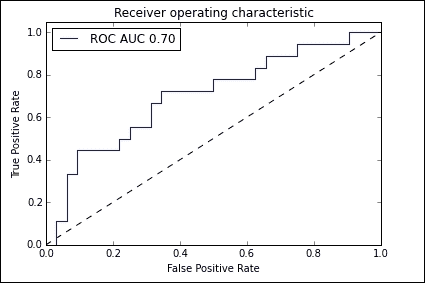
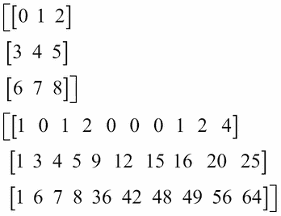
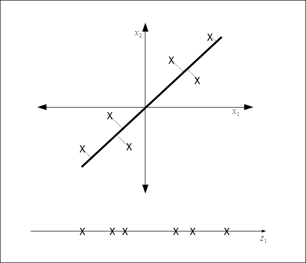
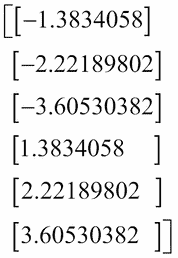

# 第七章。特性–算法如何看待世界

到目前为止，在本书中，我们为创建、提取或以其他方式操作特征提出了许多方法和理由。在这一章中，我们将直接讨论这个话题。正确的特征，有时被称为属性 T2，是机器学习模型的核心组成部分。一个有错误特征的复杂模型是没有价值的。特性是我们的应用程序看待世界的方式。对于除了最简单的任务之外的所有任务，我们将在将特性输入模型之前对其进行处理。我们可以通过许多有趣的方式来做到这一点，这是一个非常重要的话题，用整整一章来讨论它是合适的。

直到最近十年左右，机器学习模型才例行公事地使用成千上万甚至更多的特征。这使我们能够解决许多不同的问题，例如与样本数量相比，我们的特征集很大的问题。两个典型的应用是遗传分析和文本分类。对于遗传分析，我们的变量是一组**基因表达系数**。这些是基于样本中存在的**基因**的数量，例如，取自组织活检。可以执行分类任务来预测患者是否患有癌症。训练样本和测试样本的总数可以小于 100。另一方面，原始数据中的变量数量可能在 6000 到 60000 之间。这不仅会转化为大量的特征，还意味着特征之间的取值范围也相当大。在本章中，我们将涵盖以下主题:

*   特征类型
*   运营和统计
*   结构化特征
*   转变特征
*   主成分分析

# 特征类型

有三种不同类型的特征:数量特征、顺序特征和分类特征。我们也可以考虑第四种类型的特征——布尔型，因为这种类型确实有一些不同的性质，尽管它实际上是一种分类特征。这些特征类型可以根据它们传递的信息量来排序。数量特征具有最高的信息容量，其次是序数、分类和布尔。

让我们看一下表格分析:

<colgroup><col style="text-align: left"> <col style="text-align: left"> <col style="text-align: left"> <col style="text-align: left"> <col style="text-align: left"> <col style="text-align: left"></colgroup> 
| 

特征类型

 | 

命令

 | 

规模

 | 

趋势

 | 

散布

 | 

形状

 |
| --- | --- | --- | --- | --- | --- |
| **定量** | 是 | 是 | 均值 | 范围、方差和标准偏差 | 偏斜度、峰度 |
| **序数** | 是 | 不 | 中位数 | 有多少人 | 钠 |
| **分类** | 不 | 不 | 方式 | 钠 | 钠 |

上表显示了三种类型的功能、它们的统计数据和属性。每个要素从表中下一行的要素继承统计信息。例如，定量特征的中心趋势测量包括中位数和众数。

## 数量特征

数量特征的区别特征是连续的，通常涉及到映射到实数。通常，特征值可以映射到实数的子集，例如，以年表示年龄；但是，在计算统计数据(如平均值或标准偏差)时，必须注意使用满刻度。因为定量特征有一个有意义的数字标度，所以它们经常用在几何模型中。当在树模型中使用它们时，它们会导致二进制拆分，例如，使用阈值，其中高于阈值的值归一个子级，等于或低于阈值的值归另一个子级。树模型对比例的单调变换不敏感，即不改变特征值顺序的变换。例如，对于树模型来说，如果我们以厘米或英寸为单位测量长度，或者使用对数或线性比例，这并不重要，我们只需将阈值更改为相同的比例。树模型忽略了数量特征的尺度，将它们视为序数。基于规则的模型也是如此。对于概率模型，如朴素贝叶斯分类器，需要将定量特征离散到有限数量的箱中，并因此转换为分类特征。

## 序数特征

序数要素是具有不同顺序但没有比例的要素。它们可以被编码为整数值；然而，这样做并不意味着任何规模。一个典型的例子是门牌号。在这里，我们可以通过门牌号码来辨别一所房子在街道上的位置。我们假设 1 号房会在 20 号房之前，10 号和 11 号房会相互靠近。然而，数字的大小并不意味着任何规模；例如，没有理由相信 20 号房会比 1 号房大。序数特征的域是完全有序的集合，例如一组字符或字符串。因为序数特征缺乏线性标度，所以加或减没有意义；因此，对序数要素进行平均等操作通常没有意义，也不会产生任何关于要素的信息。类似于树模型中的数量特征，序数特征导致二元分割。一般来说，序数特征在大多数几何模型中不容易使用。例如，线性模型假设一个欧几里德实例空间，其中的特征值被视为笛卡尔坐标。对于基于距离的模型，如果我们将它们编码为整数，并且它们之间的距离只是它们之间的差异，那么我们可以使用序数特征。这有时被称为 **海明距离**。

## 分类特征

分类特征，有时被称为**名义特征**，没有任何顺序或比例，因此，除了表示一个值最频繁出现的模式之外，不允许任何统计汇总。分类特征通常最好用概率模型来处理；但是，它们也可以在基于距离的模型中使用汉明距离，并且对于相等的值将距离设置为 0，对于不相等的值将距离设置为 1。分类特征的一个子类型是**布尔特征，**映射为真或假的布尔值。

# 操作和统计

特征可以通过可对其执行的允许操作来定义。考虑两个特征:一个人的年龄和电话号码。虽然这两个特征都可以用整数来描述，但它们实际上代表了两种截然不同的信息类型。当我们看到哪些操作可以有效地执行时，这是显而易见的。比如计算一群人的平均年龄，会给我们一个有意义的结果；计算平均电话号码不会。

我们可以把可以对一个特征执行的可能计算的范围称为它的统计量。这些统计数据描述了数据的三个不同方面。这些是——它的**中心倾向**，它的T3】分散，它的T6】形状。

为了计算数据的中心趋势，我们通常使用以下一个或多个统计量:平均值(或平均值)、中值(或有序列表中的中间值)和模式(或所有值的大多数)。模式是唯一可以应用于所有数据类型的统计信息。为了计算中位数，我们需要能够以某种方式排序的特征值，即序数或数量。为了计算平均值，数值必须以某种比例表示，如线性比例。换句话说，它们需要数量特征。

最常见的计算离差的方式是通过方差或标准差的统计。这两者实际上是相同的度量，但尺度不同，标准差很有用，因为它与要素本身的尺度相同。此外，请记住，平均值和中间值之间的绝对差异永远不会大于标准偏差。测量离差的一个更简单的统计量是范围，它只是最小值和最大值之间的差值。当然，从这里，我们可以通过计算中距点来估计特征的中心趋势。测量离差的另一种方法是使用百分位数或十分位数等单位来测量低于特定值的实例的比率。例如，*p*百分位是 *p* 百分比实例低于的值。

测量形状统计稍微复杂一点，可以使用样本的 **中心时刻**的概念来理解。其定义如下:


这里， *n* 为样本数， *μ* 为样本均值， *k* 为整数。当 *k = 1* 时，第一个中心矩为 *0* ，因为这只是平均值的平均偏差，始终为 *0* 。第二个中心矩是与平均值的平均平方偏差，即方差。我们可以定义**偏斜度**如下:


这里 *ơ* 是标准差。如果这个公式给出的值是正的，那么更多的情况下值高于平均值而不是低于平均值。当绘制图表时，数据向右倾斜。当偏斜为负时，反之亦然。

我们可以将**峰度**定义为第四中心时刻的类似关系:


可以证明正态分布的峰度为 3。在高于这个值时，分布将更多*达到峰值*。峰度值低于 3 时，分布将更平坦*。*

 *我们之前讨论了三种类型的数据，即分类数据、顺序数据和数量数据。

机器学习模型将以非常不同的方式对待不同的数据类型。例如，分类特征上的决策树分裂将产生与值一样多的子代。对于序数和数量特征，分割将是二元的，每个父母基于一个阈值产生两个孩子。因此，树模型将数量特征视为序数，而忽略特征尺度。当我们考虑像**贝叶斯分类器**这样的概率模型时，我们可以看到它实际上将序数特征视为分类特征，而它处理数量特征的唯一方法是将它们转化为有限数量的离散值，从而将其转换为分类数据。

一般来说，几何模型需要定量的特征。例如，线性模型在欧几里得实例空间中运行，要素充当笛卡尔坐标。每个要素值都被视为与其他要素值的标量关系。基于距离的模型，如 k-最近邻模型，可以通过将相等值的距离设置为 0，不相等值的距离设置为 1 来合并分类特征。同样，我们可以通过计算两个值之间的值的数量，将序数特征纳入基于距离的模型。如果我们将特征值编码为整数，那么距离就是简单的数值差。通过选择适当的距离度量，可以将序数和分类特征结合到基于距离的模型中。

# 结构化特征

我们假设每个实例可以表示为特征值的向量，并且所有相关方面都由该向量表示。这有时被称为 **抽象**，因为我们过滤掉不必要的信息，用向量来表示现实世界的现象。例如，将列夫·托尔斯泰的全部作品表示为词频向量是一种抽象。我们不假装这个抽象将服务于任何超过一个非常特殊的有限的应用程序。我们可能会了解到托尔斯泰对语言的使用，也许会引出一些关于托尔斯泰创作的情感和主题的信息。然而，我们不太可能对这些作品中描绘的 19 世纪<sup>俄国的广阔背景有任何重要的了解。一个人类读者，或者一个更复杂的算法，将不是从每个单词的计数中，而是从这些单词的结构中获得这些见解。</sup>

我们可以用类似于在数据库编程语言(如 SQL)中考虑查询的方式来考虑结构化特性。一个 SQL 查询可以表示一个变量的集合，用来做一些事情，比如找到一个特定的短语或者找到所有涉及特定字符的段落。我们在机器学习环境中所做的是用这些集合属性创建另一个特性。

结构化特征可以在构建模型之前创建，也可以作为模型本身的一部分创建。在第一种情况下，这个过程可以理解为从一阶逻辑到命题逻辑的转换。这种方法的一个问题是，由于与现有功能的组合，它可能会导致潜在功能数量的激增。另一个要点是，正如在 SQL 中一个子句可以覆盖另一个子句的子集一样，结构特征也可以是逻辑相关的。这在特别适合自然语言处理的机器学习分支中被利用，称为**归纳逻辑编程**。

# 变换特征

当我们转换特征时，我们的目标显然是让它们对我们的模型更有用。这可以通过添加、删除或更改特征所表示的信息来实现。一个共同特征变换是改变特征类型的变换。一个典型的例子是**二值化**，即将一个分类特征转化为一组二值特征。另一个例子是将序数特征变为分类特征。在这两种情况下，我们都会丢失信息。首先，单个分类特征的值是互斥的，这不是通过二进制表示来表达的。在第二种情况下，我们丢失了订购信息。这些类型的转换可以被认为是归纳性的，因为它们由一个定义明确的逻辑过程组成，除了决定首先执行这些转换之外，它不涉及客观的选择。

使用`sklearn.preprocessing.Binarizer`模块可以轻松进行二值化。让我们来看看以下命令:

```py
from sklearn.preprocessing import Binarizer
from random import randint
bin=Binarizer(5)
X=[randint(0,10) for b in range(1,10)]
print(X)
print(bin.transform(X))

```

以下是上述命令的输出:


分类特征通常需要编码成整数。考虑一个非常简单的数据集，只有一个分类特征，城市，有三个可能的值，悉尼、珀斯和墨尔本，我们决定将这三个值分别编码为 0、1 和 2。如果这个信息要用于线性分类器，那么我们把约束写成一个带有权重参数的线性不等式。然而，问题是这个权重不能编码为三路选择。假设我们有两个类，东海岸和西海岸，我们需要我们的模型提出一个决策函数，该函数将反映珀斯位于西海岸，悉尼和墨尔本都位于东海岸的事实。用一个简单的线性模型，当特征以这种方式编码时，那么决策函数就不能得出一个将悉尼和墨尔本放在同一个类中的规则。解决方案是将特征空间放大为三个特征，每个特征都有自己的权重。这个叫做**一热编码**。Sciki-learn 实现`OneHotEncoder()`功能来执行该任务。这是一个估计器，它将每个分类特征的 *m* 个可能值转换成 *m* 个二进制特征。假设我们使用的数据模型由前面示例中描述的城市特征和另外两个特征组成——性别(可以是男性或女性)和职业(可以有三个值——医生、律师或银行家)。因此，举例来说，*来自悉尼的女银行家*将被表示为*【1，2，0】*。为以下示例添加了另外三个示例:

```py
from sklearn.preprocessing import OneHotEncoder
enc = OneHotEncoder()
enc.fit([[1,2,0], [1, 1, 0], [0, 2, 1], [1, 0, 2]])
print(enc.transform([1,2,0]).toarray())

```

我们将获得以下输出:


由于我们在这个数据集中有两个性别、三个城市和三个工作，所以变换数组中的前两个数字代表性别，后三个数字代表城市，最后三个数字代表职业。

## 离散化

我已经简要地提到了与决策树相关的阈值化的思想，其中我们通过找到合适的特征值来分割，从而将序数或数量特征转换为二进制特征。有许多方法，既有监督的，也有无监督的，可用于在连续数据中找到适当的分割，例如，使用中心趋势(监督的)统计，如平均值或中值，或基于信息增益等标准优化目标函数。

我们可以更进一步，创建多个阈值，将一个数量特征转化为一个序数特征。这里，我们将一个连续的数量特征分成许多离散的序数值。这些值中的每一个被称为一个**箱**，每个箱代表原始定量特征上的一个区间。许多机器学习模型需要离散值。使用离散值创建基于规则的模型变得更加容易理解。离散化还使特征更加紧凑，并可能使我们的算法更加高效。

最常见的方法之一是选择箱，使得每个箱具有大约相同数量的实例。这被称为**等频离散化**，如果我们将其应用于两个面元，那么这与使用中值作为阈值是一样的。这种方法非常有用，因为可以通过代表分位数的方式设置仓位边界。例如，如果我们有 100 个箱，那么每个箱代表一个百分点。

或者，我们可以选择边界，使每个面元具有相同的间隔宽度。这叫做**等宽离散化**。计算该面元宽度间隔值的一种方法是简单地用面元数量划分特征范围。有时，特征没有上限或下限，我们无法计算其范围。在这种情况下，可以使用高于和低于平均值的标准偏差的整数。宽度和频率离散化都是无监督的。它们不需要任何关于类标签的知识就能工作。

现在让我们把注意力转向监督离散化。基本上有两种方法:自上而下的或**分裂**，以及**聚集**或自下而上的方法。顾名思义，分裂的工作原理是首先假设所有样本都属于同一个容器，然后逐步分裂容器。凝聚方法从每个实例的一个箱开始，并逐步合并这些箱。这两种方法都需要一些停止标准来决定是否需要进一步拆分。

通过阈值递归划分特征值的过程是划分离散化的一个例子。为了做到这一点，我们需要一个评分函数来找到特定特征值的最佳阈值。一种常见的方法是计算分裂的信息增益或其熵。通过确定特定分割覆盖了多少正样本和负样本，我们可以基于此标准逐步分割特征。

简单的离散化操作可以通过熊猫**切割**和 **qcut** 方法进行。考虑以下示例:

```py
import pandas as pd
import numpy as np
print(pd.cut(np.array([1,2,3,4]), 3, retbins = True, right = False))

```

以下是观察到的输出:


## 正常化

阈值化和离散化，两者都去除了定量特征的尺度，根据应用，这可能不是我们想要的。或者，我们可能想给序数或分类特征增加一个尺度。在无监督的环境中，我们称之为**规范化**。这通常用于处理在不同尺度上测量的定量特征。近似正态分布的特征值可以转换为 *z* 分数。这只是高于或低于平均值的标准偏差的符号数。阳性 *z* 分数表示高于平均值的标准偏差数，阴性 *z* 分数表示低于平均值的标准偏差数。对于某些特征，使用方差可能比使用标准差更方便。

一种更严格的规范化形式以 0 到 1 的比例表示一个特征。如果我们知道一个要素范围，我们可以简单地使用线性缩放，即以最低值和最高值之差除以原始要素值和最低值之差。这表现在以下方面:


这里*f<sub>n</sub>T3】为归一化特征， *f* 为原始特征， *l* 和 *h* 分别为最低值和最高值。在许多情况下，我们可能不得不猜测范围。如果我们对某个特定分布有所了解，例如，在正态分布中，超过 99%的值可能落在平均值的+3 或-3 标准偏差范围内，那么我们可以写出如下线性标度:*


这里， *μ* 为平均值， *ơ* 为标准差。

## 校准

有时，我们需要给一个序数或分类特征增加标度信息。这叫做功能**校准**。这是一种有监督的特征变换，有许多重要的应用。例如，它允许需要缩放特征的模型(如线性分类器)处理分类和序数数据。它还为模型提供了将特征视为序数、类别或数量的灵活性。对于二元分类，我们可以利用正类的后验概率，给定一个特征值，来计算尺度。对于许多概率模型，如朴素贝叶斯，这种校准方法还有一个额外的优点，即一旦校准了特征，模型就不需要任何额外的训练。对于分类特征，我们可以通过简单地从训练集中收集相对频率来确定这些概率。

在某些情况下我们可能需要将数量特征或序数特征转化为类别特征，同时保持一个顺序。我们这样做的主要方式之一是通过**物流校准**的流程。如果我们假设特征以相同的方差正态分布，那么我们可以用给定特征值 *v* 来表示似然比，即正类和负类的比值，如下所示:


其中 d 质数是两类平均值除以标准偏差的差值:


还有， *z* 是 *z* 的分数:


为了抵消不均匀类分布的效应，我们可以使用以下公式计算校准特征:


你可能会注意到，这正是我们用于逻辑回归的 sigmoid 激活函数。总结逻辑校准，我们主要使用三个步骤:

1.  估计正类和负类的类均值。
2.  将特征转换为 *z* 分数。
3.  应用 sigmoid 函数给出校准概率。

有时，我们可能会跳过最后一步，特别是如果我们使用基于距离的模型，其中我们期望比例是相加的，以便计算欧几里德距离。您可能会注意到，我们最终校准的特征在比例上是倍增的。

另一种校准技术**等渗校准**，用于定量和顺序特征。这使用了所谓的 **ROC** 曲线(代表**接收器操作员特征**)，类似于[第 4 章](4.html "Chapter 4. Models – Learning from Information")、*模型–从信息中学习*中讨论逻辑模型时使用的覆盖图。不同的是，使用 ROC 曲线，我们将轴归一化为*【0，1】*。

我们可以使用`sklearn`包来创建 ROC 曲线:

```py
import matplotlib.pyplot as plt
from sklearn import svm, datasets
from sklearn.metrics import roc_curve, auc
from sklearn.cross_validation import train_test_split
from sklearn.preprocessing import label_binarize
from sklearn.multiclass import OneVsRestClassifier

X, y = datasets.make_classification(n_samples=100,n_classes=3,n_features=5, n_informative=3, n_redundant=0,random_state=42)
# Binarize the output
y = label_binarize(y, classes=[0, 1, 2])
n_classes = y.shape[1]
X_train, X_test, y_train, y_test = train_test_split(X, y, test_size=.5)
classifier = OneVsRestClassifier(svm.SVC(kernel='linear', probability=True, ))
y_score = classifier.fit(X_train, y_train).decision_function(X_test)
fpr, tpr, _ = roc_curve(y_test[:,0], y_score[:,0]) 
roc_auc = auc(fpr, tpr)
plt.figure()
plt.plot(fpr, tpr, label='ROC AUC %0.2f' % roc_auc)
plt.plot([0, 1], [0, 1], 'k--')
plt.xlim([0.0, 1.0])
plt.ylim([0.0, 1.05])
plt.xlabel('False Positive Rate')
plt.ylabel('True Positive Rate')
plt.title('Receiver operating characteristic')
plt.legend(loc="best")
plt.show()

```

以下是观察到的输出:



ROC 曲线绘制了不同阈值的真阳性率与假阳性率。在上图中，这由虚线表示。一旦我们构建了 ROC 曲线，我们就可以计算凸包的每一段中的阳性数， *m <sub>i</sub>* ，以及实例总数， *n <sub>i</sub>* 。然后使用以下公式计算校准特征值:


在这个公式中， *c* 是先验概率，即正类概率与负类概率的比值。

到目前为止，在我们关于特征转换的讨论中，我们假设我们知道每个特征的所有值。在现实世界中，情况往往并非如此。如果我们使用概率模型，我们可以通过对所有特征值进行加权平均来估计缺失特征的值。一个重要的考虑是缺失特征值的存在可能与目标变量相关。例如，个人病史中的数据反映了所进行的检测类型，而这又与某些疾病的风险因素评估有关。

如果我们使用的是树模型，我们可以随机选择一个缺失的值，允许模型在其上拆分。然而，这不适用于线性模型。在这种情况下，我们需要通过**插补**的过程来填写缺失的值。对于分类，我们可以简单地使用观察特征的平均值、中值和模式的统计来估算缺失的值。如果我们想考虑特征相关性，我们可以为每个不完整的特征构建一个预测模型来预测缺失值。

由于 scikit-learn 估计器总是假设数组中的所有值都是数字，因此缺失的值，无论是编码为空格、n an 还是其他占位符，都会产生错误。此外，由于我们可能不想丢弃整行或整列，因为这些可能包含有价值的信息，我们需要使用插补策略来完成数据集。在下面的代码片段中，我们将使用`Imputer`类:

```py
from sklearn.preprocessing import Binarizer, Imputer, OneHotEncoder
imp = Imputer(missing_values='NaN', strategy='mean', axis=0)
print(imp.fit_transform([[1, 3], [4, np.nan], [5, 6]]))

```

以下是输出:


很多机器学习算法要求特征是**标准化的**。这意味着，当单个特征看起来或多或少像均值和单位方差接近于零的正态分布数据时，它们将发挥最佳作用。最简单的方法是从每个特征中减去平均值，然后用标准偏差除以该平均值。这可以通过`sklearn.preprocessing()`功能中的`scale()`功能或`standardScaler()`功能来实现。虽然这些函数将接受稀疏数据，但它们可能不应该在这种情况下使用，因为将稀疏数据居中可能会破坏其结构。在这些情况下，建议使用`MacAbsScaler()`或`maxabs_scale()`功能。前者根据每个特征的最大绝对值分别进行缩放和平移。后者将每个特征单独缩放至 *[-1，1]* 的范围。另一个具体的例子是当我们在数据中有异常值时。在这些情况下，建议使用`robust_scale()`或`RobustScaler()`功能。

通常，我们可能希望通过添加多项式项来增加模型的复杂性。这可以使用`PolynomialFeatures()`功能来完成:

```py
from sklearn.preprocessing import PolynomialFeatures
X=np.arange(9).reshape(3,3)
poly=PolynomialFeatures(degree=2)
print(X)
print(poly.fit_transform(X))

```

我们将观察以下输出:



# 主成分分析

**主成分分析** ( **PCA** )是我们可以应用于特征的最常见的降维形式。考虑由两个要素组成的数据集的示例，我们希望将这个二维数据转换为一维数据。一种自然的方法是画一条最接近的线，并将每个数据点投影到这条线上，如下图所示:



主成分分析试图通过最小化数据点和我们试图将数据投影到的直线之间的距离来找到一个表面来投影数据。对于更一般的情况，我们有 *n* 维，我们想把这个空间缩小到 k 维，我们找到 *k* 向量 *u(1)，u(2)、...，u(k)* 将数据投影到其上，以最小化投影误差。也就是说，我们试图找到一个 k 维表面来投影数据。

这表面上看起来像线性回归，但在几个重要方面有所不同。对于线性回归，我们试图预测给定输入变量的某个输出变量的值。在主成分分析中，我们不是试图预测一个输出变量，而是试图找到一个子空间来投射我们的输入数据。如前图所示，误差距离不是点和线之间的垂直距离，如线性回归的情况，而是点和线之间最接近的正交距离。因此，误差线与轴成一定角度，并与我们的投影线成直角。

重要的一点是，在大多数情况下，主成分分析需要对特征进行缩放和均值归一化，也就是说，特征的均值为零，并且具有可比较的值范围。我们可以使用以下公式计算平均值:


通过替换以下内容计算总和:


如果特征具有明显不同的比例，我们可以使用以下方法重新缩放:


这些功能可在`sklearn.preprocessing`模块中获得。

计算低维向量和这些向量上我们投影原始数据的点的数学过程包括首先计算协方差矩阵，然后计算这个矩阵的特征向量。从第一性原理计算这些值是一个相当复杂的过程。幸运的是，`sklearn`包有一个库来完成这个任务:

```py
from sklearn.decomposition import PCA
import numpy as np
X = np.array([[-1, -1], [-2, -1], [-3, -2], [1, 1], [2, 1], [3, 2]])
pca = PCA(n_components=1)
pca.fit(X)
print(pca.transform(X))

```

我们将获得以下输出:



# 总结

我们可以通过多种方式来转换和构建新的特征，以使我们的模型更有效地工作，并给出更准确的结果。一般来说，没有硬性的规则来决定特定模型使用哪种方法。这在很大程度上取决于您使用的特征类型(数量、顺序或分类)。一个好的第一种方法是标准化和缩放特征，如果模型需要，将特征转换为合适的类型，就像我们通过离散化所做的那样。如果模型表现不佳，可能需要应用进一步的预处理，如主成分分析。在下一章中，我们将研究如何通过使用集成来组合不同类型的模型，以提高性能并提供更大的预测能力。*