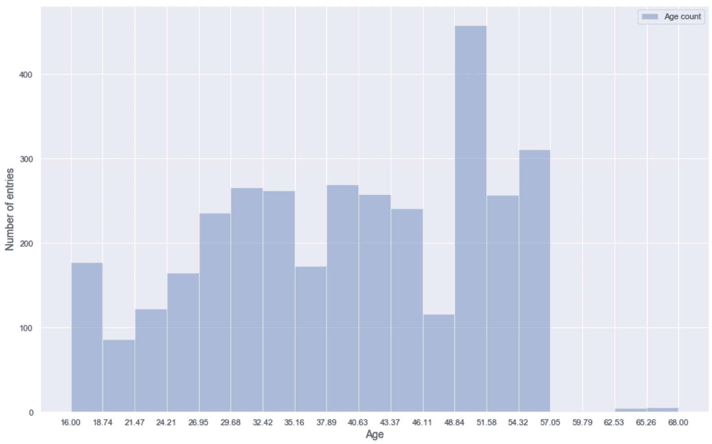
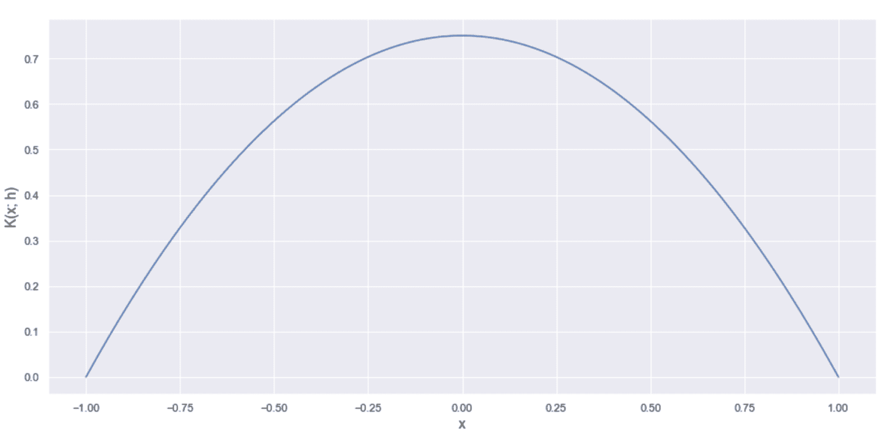
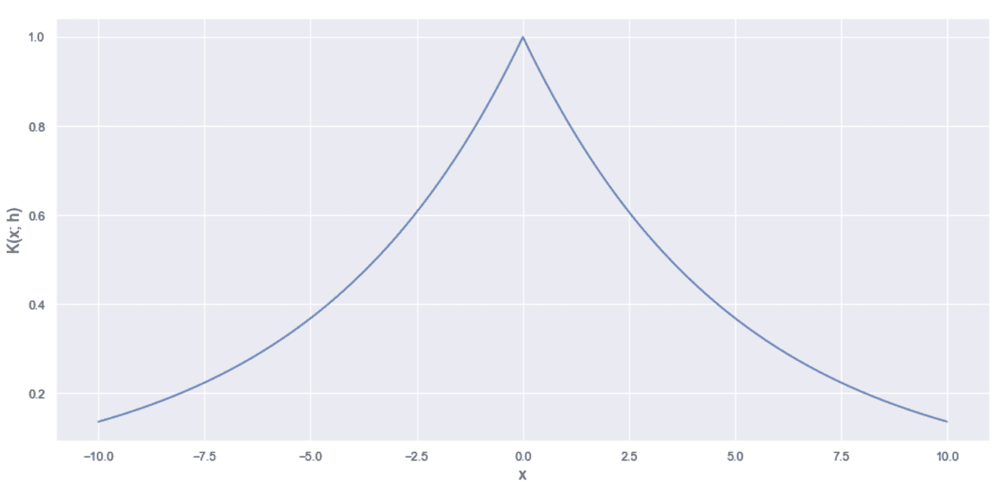
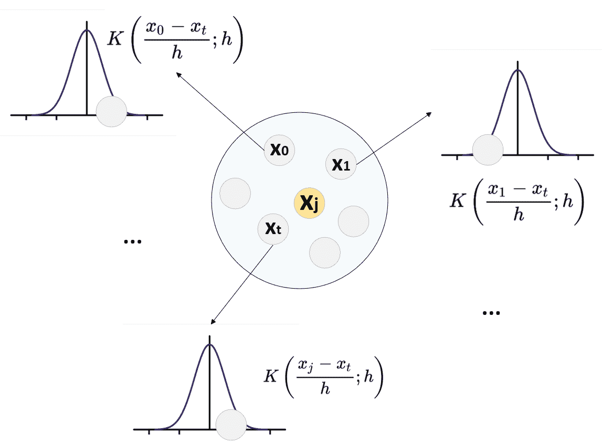
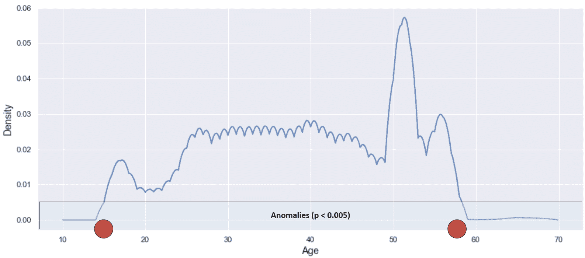
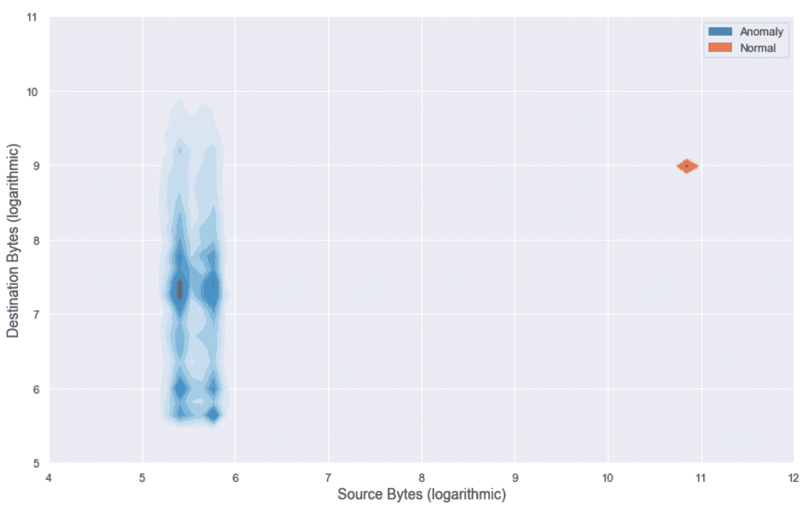
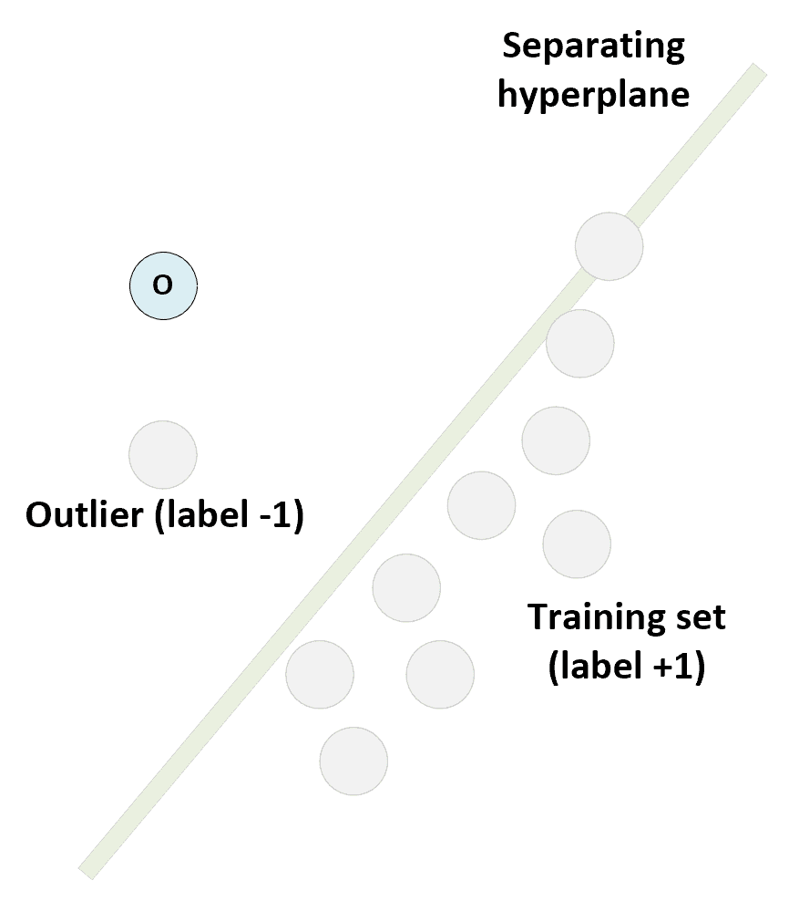
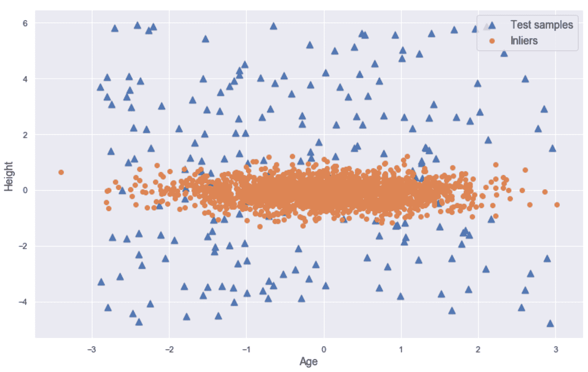
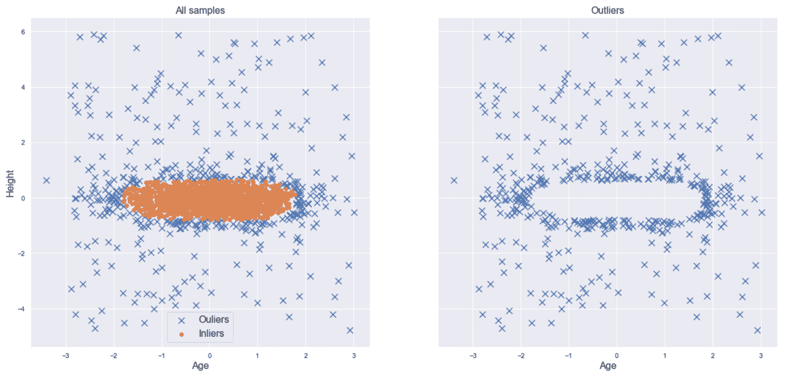
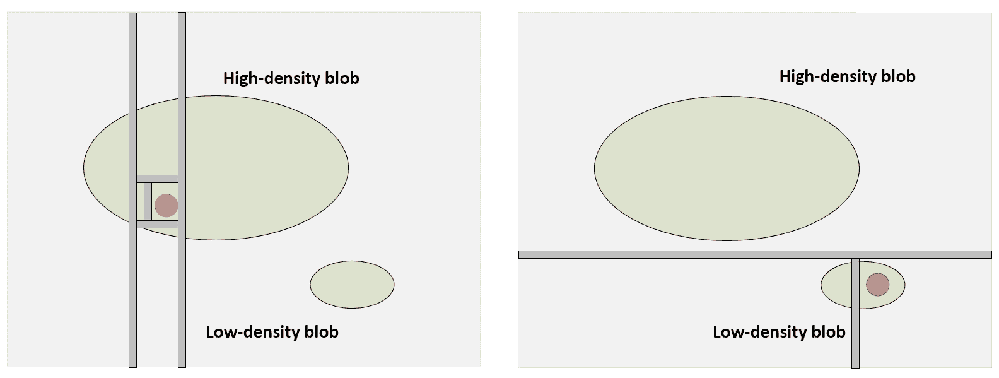

# 异常检测

在本章中，我们将讨论无监督学习的一个实际应用。我们的目标是训练模型，这些模型要么能够重现特定数据生成过程的概率密度函数，要么能够识别给定的新样本是内联样本还是外联样本。一般来说，我们可以说我们要追求的具体目标是发现异常，这些异常往往是模型下可能性极小的样本(即给定概率分布 *p(x) < < λ* 其中 *λ* 是预定义的阈值)或者离主分布质心相当远的样本。

特别是，本章将包括以下主题:

*   概率密度函数及其基本性质简介
*   直方图及其局限性
*   **籽粒密度估算** ( **KDE** )
*   带宽选择标准
*   异常检测的单变量示例
*   使用 KDD 杯 99 数据集的 HTTP 攻击异常检测示例
*   一类支持向量机
*   利用隔离森林进行异常检测

# 技术要求

本章中的代码要求:

*   Python 3.5+(强烈推荐 Anaconda 发行版([https://www.anaconda.com/distribution/](https://www.anaconda.com/distribution/))
*   库:
    *   SciPy 0.19+
    *   NumPy 1.10+
    *   学习 0.20+
    *   熊猫 0.22+
    *   Matplotlib 2.0+
    *   seaborn 0.9+

这些例子可以在 GitHub 资源库[上获得，网址为 https://GitHub . com/packktpublishing/HandsOn-Unsupervised-Learning-with-Python/tree/master/chapter 06](https://github.com/PacktPublishing/HandsOn-Unsupervised-Learning-with-Python/tree/master/Chapter06)。

# 概率密度函数

在前面的所有章节中，我们一直假设我们的数据集是从隐式数据生成过程 *p <sub class="calibre20">data</sub>* 中提取的，并且所有的算法都假设 *x <sub class="calibre20">i</sub> ∈ X* 为**独立同分布** ( **IID** )并且均匀采样。我们假设 *X* 以足够的精度表示 *p <sub class="calibre20">数据</sub>* ，这样算法就可以在有限的初始知识下学会泛化。相反，在本章中，我们感兴趣的是在没有任何特定限制的情况下直接建模 *p <sub class="calibre20">数据</sub>* (例如，高斯混合模型通过对分布的结构施加约束来实现这一目标)。在讨论一些非常强大的方法之前，简要回顾一下在可测子集 *X  ℜn* 上定义的一般连续概率密度函数 *p(x)* 的性质是有帮助的(为了避免混淆，我们将使用 *p(x)* 表示密度函数，使用 *P(x)* 表示实际概率):


例如，单变量高斯分布完全由均值 *μ* 和方差*σ<sup class="calibre27">2</sup>T5 表征:*


因此，*x∑(a，b)* 的概率如下:


即使一个事件在连续空间(例如，高斯)中的绝对概率为零(因为积分具有相同的极值)，概率密度函数也提供了一个非常有用的度量，可以了解一个样本比另一个样本更有可能发生多少。例如:考虑高斯分布 *N(0，1)* ，密度 *p(1) = 0.4* ，而对于 *x = 2* ，密度降低到约 *0.05* 。意思是 *1* 比 *2* 大 0.4 / 0.05 = 8 倍。同样的，我们可以设置一个接受阈值 *α* ，将*p(x<sub class="calibre20">I</sub>)<**α*的所有样本*x<sub class="calibre20">I</sub>T19】定义为异常(例如，在我们的例子中， *α = 0.01* )。这个选择是异常检测过程中至关重要的一步，正如我们将要讨论的，它还必须包括潜在的异常值，然而，这些异常值仍然是常规样本。*

在许多情况下，特征向量是用多维随机变量建模的。例如:数据集 *X  ℜ <sup class="calibre27"> 3 </sup>* 可以用联合概率密度函数 *p(x，y，z)* 来表示。一般情况下，实际概率需要三重积分:


很容易理解，任何使用这种联合概率的算法都会受到复杂性的负面影响。通过假设单个分量的统计独立性，可以获得很强的简化:


不熟悉这个概念的读者可以在考试前想象一群学生。用随机变量建模的特征是学习小时数( *x* )和已完成课程数( *y* )，我们想找出给定这些因素的成功概率 *p(成功|x，y)* (这样的例子是基于条件概率的，但主要概念总是一样的)。我们可以假设，一个学完所有课程的学生，在家需要少学习；然而，这样的选择意味着这两个因素之间的依赖性(和相关性)，这不能再单独评估了。相反，我们可以通过假设没有任何相关性来简化程序，并根据已完成课程的数量和作业的小时数来计算边际成功概率。重要的是要记住，特征之间的独立性不同于随后从分布中提取的样本的独立性。当我们说数据集由 IID 样本组成时，我们指的是概率*p(x<sub class="calibre20">I</sub>| x<sub class="calibre20">I</sub><sub class="calibre20">-1</sub>，x <sub class="calibre20">i</sub> <sub class="calibre20">-2</sub> ，...，p <sub class="calibre20">1</sub> ) =每个样品的 p(x <sub class="calibre20">i</sub> )* 。换句话说，我们假设样本之间没有相关性。这样的条件更容易实现，因为它通常足以混洗数据集以消除任何残留的相关性。相反，特征之间的相关性是数据生成过程的一个特殊属性，无法消除。因此，在某些情况下，我们假设独立性，因为我们知道它的影响可以忽略不计，最终结果不会受到严重影响，而在其他情况下，我们将基于整个多维特征向量来训练模型。我们现在可以定义异常的概念，它将在剩下的部分中使用。

# 异常作为异常值或新奇值

本章的主题是在没有任何监督的情况下自动检测异常。由于模型不是基于标记样本提供的反馈，我们只能依靠整个数据集的属性来找出相似之处并突出不同之处。特别是，我们从一个非常简单但有效的假设出发:常见事件为*正常*，而不太可能发生的事件一般被视为**异常**。当然，这个定义意味着我们正在监控的过程正在正常运行，大多数结果被认为是有效的。例如:一个硅加工厂必须把一个晶片切成相等的块。我们知道它们每一个都是 0.2 × 0.2 英寸(约 0.5 × 0.5 厘米)，每一侧的标准偏差为 0.001 英寸。经过 1，000，000 个处理步骤后，已经确定了该度量。我们是否有权将 0.25 × 0.25 英寸芯片视为异常？当然，我们是。实际上，我们假设每条边的长度都建模为高斯分布(非常合理的选择)*μ= 0.2**σ= 0.001；*三个标准差后，概率下降到几乎为零。因此，例如: *P(边> 0.23) ≈ 0* 这样的尺寸的芯片必须明确视为异常。

显然，这是一个极其简单的例子，不需要任何模型。然而，在现实生活中，密度的结构可能非常复杂，几个高概率区域被低概率区域包围。这就是为什么必须采用更通用的方法来建模整个样本空间。

当然，异常的语义不能标准化，它总是取决于正在分析的具体问题。因此，定义异常概念的一个常见方法是区分**异常值**和**新奇值**。前者是包含在数据集中的样本，即使它们与其他样本之间的距离大于平均值。因此，**异常值检测**过程旨在找出这样的*奇怪的*样本(例如:考虑到前面的例子，0.25 × 0.25 英寸的芯片如果包含在数据集中显然是异常值)。相反，**新颖性检测**的目标略有不同，因为在这种情况下，我们假设使用只包含*正常*样本的数据集；因此，给定一个新的，我们有兴趣理解我们是否可以认为它是从原始数据生成过程中提取的或者是一个异常值(例如:一个新手技术人员问我们这个问题:0.25 × 0.25 英寸的芯片是一个异常值吗？如果我们已经收集了*正常*芯片的数据集，我们可以使用我们的模型来回答这个问题。

描述这种情况的另一种方式是将样本视为一系列可能受可变噪声影响的值: *y(t) = x(t) + n(t)* 。当*| | n(t)| |<|<| | x(t)|*时，样品可归类为*洁净* : *y(t) ≈ x(t)* 。反之，当*| | n(t)|∑| | x(t)| |*(甚至更大)时，则为异常值，不能代表真实的底层过程 *p <sub class="calibre20">数据</sub>* 。由于噪声的平均幅度通常比信号小得多，*P(| | n(t)|∞| | x(t)| |)*的概率接近于零。因此，我们可以将异常想象成受异常外部噪声影响的正常样本。管理异常和噪声样本之间的真正主要区别通常在于检测真正异常和相应标记样本的能力。事实上，虽然有噪声的信号肯定是被破坏的，并且目标是最小化噪声的影响，但是异常可以被人类非常频繁地识别并正确标记。然而，正如已经讨论过的，在本章中，我们有兴趣找出不依赖于现有标签的发现方法。此外，为了避免混淆，我们总是引用异常，每次都定义数据集的内容(只有内联或内联和外联)和我们分析的目标。在下一节中，我们将简要讨论数据集的预期结构。

# 数据集的结构

在标准的有监督(通常也是无监督)任务中，数据集应该是平衡的。换句话说，属于每个类的样本数量应该几乎相同。在本章我们将要讨论的任务中，我们假设有非常不平衡的数据集 *X* (包含 *N* 个样本):

*   *N <sub class="calibre20">异常值</sub> < < N* ，如果存在异常值检测(即数据集部分为*污垢；*(因此，我们需要找出一种方法来过滤掉所有异常值)
*   *N <sub class="calibre20">异常值</sub> = 0* (或者更现实一点， *P(N <sub class="calibre20">异常值</sub> > 0) → 0)* ，如果有新颖性检测(也就是我们一般可以信任已有样本，把注意力集中在新样本上)

这些标准的原因很明显:让我们考虑前面讨论的例子。如果在 1000000 个加工步骤后观察到的异常率等于 0.2%，则有 2000 个异常，这对于一个工作过程来说可能是一个合理的值。如果这样的数字大得多，就意味着系统中应该有更严重的问题，这超出了数据科学家的角色。因此，在这种情况下，我们期望数据集包含大量正确的样本和非常少的异常(甚至为零)。在许多情况下，经验法则是反映潜在的数据生成过程，因此，如果专家可以确认，例如，有 0.2%的异常，比率应该是 *1000÷2* ，以找出一个现实的概率密度函数。在这种情况下，事实上，找出决定异常值可分辨性的因素更为重要。另一方面，如果我们被要求仅执行新颖性检测(例如:区分有效和恶意网络请求)，数据集必须经过验证，以便不包含异常，但同时反映负责所有可能的有效样本的真实数据生成过程。

事实上，如果正确样本的总体是详尽的，任何与高概率区域的大偏差都足以触发警报。相反，真实数据生成过程的有限区域可能导致假阳性结果(也就是说，没有包含在训练集中的有效样本被错误地识别为异常值)。在最坏的情况下，如果特征被改变(也就是说，异常值被错误地识别为有效样本)，噪声很大的子集也可能确定假阴性。然而，在大多数现实生活中，最重要的因素是样本的数量和收集样本的背景。不言而喻，任何模型都必须用将要测试的相同类型的元素来训练。例如:如果化工厂内的测量是使用低精度仪器进行的，则用高精度仪器收集的测试可能不能代表人口(当然，它们比数据集可靠得多)。因此，在进行分析之前，我强烈建议仔细检查数据的性质，并询问是否所有的测试样本都来自同一个数据生成过程。

我们现在可以引入**直方图**的概念，这是估计包含观测值的数据集分布最简单的方法。

# 直方图

找出概率密度函数近似值的最简单方法是基于频率计数。如果我们有一个数据集 *X* 包含 *m* 个样本 *x <sub class="calibre20">i</sub> ∈ ℜ* (为简单起见，我们只考虑单变量分布，但该过程对于多维样本完全等效)，我们可以定义 *m* 和 *M* 如下:


间隔 *(m，M)* 可以分成固定数量的 *b* 箱(其可以具有相同或不同的宽度，表示为 *w(b <sub class="calibre20">j</sub> )* ，使得*n<sub class="calibre20">p</sub>(b<sub class="calibre20">j</sub>)*对应于包含在箱中的样品数量*b<sub class="calibre20">j</sub>T17】。此时，给定一个测试样本 *x <sub class="calibre20">t</sub>* ，很容易理解，通过检测包含 *x <sub class="calibre20">t</sub>* 的仓，并使用以下公式，可以很容易地获得概率的近似值:*


在分析这种方法的利弊之前，让我们考虑一个简单的例子，它基于细分为 10 个不同阶层的人的年龄分布:

```py
import numpy as np

nb_samples = [1000, 800, 500, 380, 280, 150, 120, 100, 50, 30]

ages = []

for n in nb_samples:
    i = np.random.uniform(10, 80, size=2)
    a = np.random.uniform(i[0], i[1], size=n).astype(np.int32)
    ages.append(a)

ages = np.concatenate(ages)
```

The dataset can be reproduced only using the random seed `1000` (that is, setting `np.random.seed(1000)`).

`ages`数组包含了所有的样本，我们想创建一个直方图来初步了解分布。我们将使用 NumPy `np.histrogram()`功能，它提供了所有必要的工具。首先要解决的问题是找出最佳的箱数。对于标准分布来说，这可能很容易，但是当没有关于概率密度的先验知识时，这可能变得极其困难。原因很简单:因为我们需要用一个逐步函数来逼近一个连续函数，所以仓的宽度决定了最终的精度。例如:如果密度是平坦的(例如:均匀分布)，几个面元就足以达到良好的效果。相反，当有峰值时，在函数的一阶导数较大的区域放置更多(更短)的面元，当导数接近零时放置更小的面元(表示平坦区域)会有所帮助。正如我们将要讨论的，使用更复杂的技术，这个过程变得更容易，而直方图通常基于对最佳箱数的更粗略的计算。具体来说，NumPy 允许设置`bins='auto'`参数，该参数强制算法根据定义明确的统计方法(基于弗里德曼双精度估计器和斯特奇公式)自动选择数字:


在上式中，**四分位数区间** ( **IQR** )对应于第 75 <sup class="calibre27">个</sup>和第 25 <sup class="calibre27">个</sup>个百分点之间的差值。由于我们对分布没有一个清晰的概念，我们更喜欢依靠自动选择，如下面的代码片段所示:

```py
import numpy as np

h, e = np.histogram(ages, bins='auto')

print('Histograms counts: {}'.format(h))
print('Bin edges: {}'.format(e))
```

上一个片段的输出如下:

```py
Histograms counts: [177  86 122 165 236 266 262 173 269 258 241 116 458 257 311   1   1   5 6]
Bin edges: [16\.         18.73684211 21.47368421 24.21052632 26.94736842 29.68421053
 32.42105263 35.15789474 37.89473684 40.63157895 43.36842105 46.10526316
 48.84210526 51.57894737 54.31578947 57.05263158 59.78947368 62.52631579
 65.26315789 68\.        ]
```

因此，该算法定义了 19 个仓，并输出了频率计数和边缘(即最小值为`16`，最大值为`68`)。我们现在可以显示直方图:



Histogram of the test distribution

该图证实分布相当不规则，一些区域有被平坦区域包围的峰。如前所述，当查询基于样本属于特定箱的概率时，直方图是有帮助的。例如，在这种情况下，我们可能有兴趣确定一个人的年龄在 48.84 到 51.58 之间的概率(这对应于从 0 开始的第 12 个<sup class="calibre27">箱)。由于所有的箱柜宽度相同，我们可以简单地用*n<sub class="calibre20">p</sub>(b<sub class="calibre20">12</sub>**)*(`h[12]`)和 *m* ( `ages.shape[0]`)之间的比值来近似这样一个值:</sup>

```py
d = e[1] - e[0]
p50 = float(h[12]) / float(ages.shape[0])

print('P(48.84 < x < 51.58) = {:.2f} ({:.2f}%)'.format(p50, p50 * 100.0))
```

输出如下:

```py
P(48.84 < x < 51.58) = 0.13 (13.43%)
```

因此，概率的近似值约为 13.5%，这也由直方图的结构所证实。然而，读者应该已经清楚地理解，这样的方法有明显的局限性。第一个也是最明显的是箱子的数量和宽度。事实上，一个小数字产生的粗略结果不能考虑快速振荡。另一方面，大量的数据会被驱动到一个*带孔的*直方图，因为大部分的箱子都没有样本。因此，考虑到现实生活中可能遇到的所有可能的动态，需要一种更可靠的方法。这是我们将在下一节讨论的内容。

# 核密度估计(KDE)

直方图不连续问题的解决可以用简单的方法有效地解决。给定一个样本 *x <sub class="calibre20">i</sub> ∈ X* ，可以考虑一个超体积(通常是超立方体或超球)，假设我们正在处理多元分布，其中心是 *x <sub class="calibre20">i</sub>* 。这样一个区域的范围是通过一个称为**带宽**的常数 *h* 来定义的(选择这个名称是为了支持值为正的有限区域的含义)。然而，我们现在不是简单地计算属于超体积的样本数量，而是使用平滑核函数 *K(x <sub class="calibre20">i</sub> 来近似这个值；h)* 具有一些重要特征:


此外，出于统计和实际的原因，还需要强制执行以下积分约束(为简单起见，它们仅在单变量情况下显示，但扩展很简单):


在讨论名为**核密度估计** ( **KDE** )的技术之前，展示一下*K()*的一些常见选择是有帮助的。

# 高斯核

这是最常用的内核之一，其结构如下:


下图显示了图形表示:


Gaussian kernel

鉴于其规律性，高斯核是许多密度估计任务的常见选择。但是，由于该方法不允许混合不同的内核，因此选择时必须考虑所有属性。从统计数据中，我们知道高斯分布可以被认为是峰度的平均参考(峰度与峰值和尾部的重量成正比)。为了最大化内核的选择性，我们需要减少带宽。这意味着即使是最小的振荡也会改变密度，结果是非常不规则的估计。另一方面，当 *h* 较大(即高斯的方差)时，近似变得非常平滑，并且可能失去捕获所有峰值的能力。因此，在选择最合适的带宽的同时，考虑其他可以自然简化过程的内核也是有帮助的。

# epanechnikov 核

这个核被提出来最小化均方误差，并且它还具有非常规则的性质(实际上，它可以被想象成倒抛物线)。公式如下:


引入常数 *ε* 对内核进行归一化，满足所有要求(类似的方式，可以在范围上扩展内核( *-h* 、 *h* )以便与其他函数更加一致)。下图显示了图形表示:



Epanechnikov kernel

*h → 0 时，籽粒会变得非常尖。*然而，鉴于其数学结构，它将始终保持非常规则；因此，在大多数情况下，没有必要将其用作高斯核的替代(即使后者具有稍大的均方误差)。此外，由于函数在*x = h(K(x；h) = 0* *对于* *|x| > h* ，它会导致密度估计快速下降，特别是在边界处，例如高斯函数非常平缓地下降。

# 指数核

一个非常峰值的内核是指数内核，其一般表达式如下:


与高斯核相反，这个核有非常重的尾部和一个尖锐的峰值。下图显示了一个图表:



Exponential kernel

可以看到，这样的函数适用于模拟密度高度集中在某些特定点周围的非常不规则的分布。另一方面，当数据生成过程非常规则且表面光滑时，误差会变得非常高。可以用来评估内核(和带宽)性能的一个很好的理论度量是**平均积分平方误差** ( **MISE** )，定义如下:


在之前的公式中， *p <sub class="calibre20">K</sub> (x)* 为估算密度， *p(x)* 为实际密度。遗憾的是， *p(x)* 未知(否则，我们不需要任何估计)；因此，这样的方法只能用于理论评估(例如:Epanechnikov 核的最优性)。然而，很容易理解，每当内核不能靠近实际表面时，MISE 就会变大。由于指数型的跳跃非常突然，它只能在特定的情况下适用。在所有其他情况下，它的行为导致更大的 MISEs，因此其他内核是更好的。

# 均匀核

这是最简单且不太平滑的内核函数，其用法类似于构建直方图的标准过程。它等于以下内容:


显然，在带宽限定的范围内，这是一个恒定的步长，只有在估计不需要平滑时才有帮助。

# 估计密度

一旦选择了一个核函数，就有可能使用 k 近邻方法来构建概率密度函数的完全近似。事实上，给定一个数据集 *X* (为简单起见， *X ∈ ℜ <sup class="calibre27">m</sup>* ，因此这些值是实数)，很容易创建例如一个球树(如[第 2 章](02.html)、*聚类基础*中所讨论的)来以有效的方式划分数据。当数据结构准备好时，可以获得带宽定义的半径内查询点 *x* <sub class="calibre20">*j*</sub> 的所有邻居。假设这样一套是 *X <sub class="calibre20">j</sub> = {x <sub class="calibre20">1</sub> ，...，x <sub class="calibre20">t</sub> }* 且点数为 *N <sub class="calibre20">j</sub>* 。概率密度的估计如下:


不难证明，如果带宽选择得当(作为邻域包含的样本数的函数)， *p <sub class="calibre20">K</sub>* 在概率上收敛于实际的 *p(x)* 。换句话说，如果粒度足够大，近似和真实密度之间的绝对误差收敛到零。 *p <sub class="calibre20">K</sub> (x <sub class="calibre20">j</sub> )* 的构建过程如下图所示:



Density estimation of x<sub class="calibre26">j</sub>. The Kernel functions are evaluated in each point belonging to the neighborhood of x<sub class="calibre26">j</sub>

在这一点上，很自然地会问为什么不对每个查询使用整个数据集，而不是 k-NN 方法？答案很简单，它基于这样的假设:在 *x <sub class="calibre20">j</sub>* 计算的密度函数值可以很容易地使用局部行为进行插值(也就是说，对于多元分布，以 *x <sub class="calibre20">j</sub>* 为中心的球)和*远点*对估计没有影响。因此，我们可以将计算限制在 *X* 的较小子集内，避免包含接近于零的贡献。

在讨论如何确定最佳带宽之前，让我们展示一下之前定义的数据集的密度估计(使用 scikit-learn)。由于我们没有任何特定的先验知识，我们将采用不同带宽(0.1、0.5 和 1.5)的高斯核。所有其他参数保持默认值；但是`KernelDensity`类允许设置度量(默认为`metric='euclidean'`)、数据结构(默认为`algorithm='auto'`，根据维度在球树和 kd 树之间执行自动选择)以及绝对和相对容差(分别为 0 和 10 <sup class="calibre27">-8</sup> )。在许多情况下，没有必要更改默认值；但是，对于具有特定特征的非常大的数据集，例如，更改`leaf_size`参数以提高性能可能会有所帮助(如[第 2 章](https://cdp.packtpub.com/hands_on_unsupervised_learning_with_python/wp-admin/post.php?post=29&action=edit#post_25)、*聚类基础*中所述)。此外，默认度量不能适用于所有任务(例如:标准文档显示了一个基于哈弗斯距离的示例，在处理纬度和经度时可以使用该示例)。其他情况下，最好使用超立方体，而不是球(曼哈顿距离就是这种情况)。

让我们从实例化类和拟合模型开始:

```py
from sklearn.neighbors import KernelDensity

kd_01 = KernelDensity(kernel='gaussian', bandwidth=0.1)
kd_05 = KernelDensity(kernel='gaussian', bandwidth=0.5)
kd_15 = KernelDensity(kernel='gaussian', bandwidth=1.5)

kd_01.fit(ages.reshape(-1, 1))
kd_05.fit(ages.reshape(-1, 1))
kd_15.fit(ages.reshape(-1, 1))
```

此时，可以调用`score_samples()`方法来获得一组数据点的对数密度估计值(在我们的例子中，我们考虑的是 0.05 增量的范围(10，70))。由于数值为 *log(p)* ，需要计算 *e <sup class="calibre27">log(p)</sup>* 才能得到实际概率。

结果图如下图所示:


Gaussian density estimations with bandwidths: 0.1 (top), 0.5 (middle), and 1.5 (bottom)

可以注意到，当带宽很小时(0.1)，由于缺少特定子范围的样本，密度会有强烈的振荡。当 *h = 0.5* 时，轮廓(由于数据集是单变量的)变得更加稳定，但仍有一些由邻域内部方差引起的残留快速变化。当 *h* 变大(在我们的例子中为 1.5)时，这种行为几乎完全消除。一个显而易见的问题是:如何确定最合适的带宽？当然，最自然的选择是最小化 MISE 的 *h* 的值，但是，正如所讨论的，这种方法只能在真实概率密度已知的情况下使用。然而，有几个经验标准已经被证实是非常可靠的。给定完整的数据集 *X ∈ ℜ <sup class="calibre27">m</sup>* ，第一个数据集基于以下公式:


在我们的案例中，我们获得了以下信息:

```py
import numpy as np

N = float(ages.shape[0])
h = 1.06 * np.std(ages) * np.power(N, -0.2)

print('h = {:.3f}'.format(h))
```

输出如下:

```py
h = 2.415
```

因此，建议增加的带宽甚至比我们上次实验中的还要多。因此，第二种方法基于四分位数范围( *IQR = Q3 - Q1* 或相当于第 75 <sup class="calibre27">个</sup>百分位-第 25 <sup class="calibre27">个</sup>百分位)，它对非常强的内部变化更加稳健:


计算如下:

```py
import numpy as np

IQR = np.percentile(ages, 75) - np.percentile(ages, 25)
h = 0.9 * np.min([np.std(ages), IQR / 1.34]) * np.power(N, -0.2)

print('h = {:.3f}'.format(h))
```

现在的输出是:

```py
h = 2.051
```

这个值比前一个值要小得多，说明 *p <sub class="calibre20">K</sub> (x)* 可以用更小的超体积更精确。根据经验，我建议选择带宽最小的方法，即使第二种方法通常在不同的上下文中提供最佳结果。现在让我们使用 *h = 2.0* 和高斯核、Epanechnikov 核和指数核(我们排除了均匀核，因为最终结果相当于直方图)重新执行估算:

```py
from sklearn.neighbors import KernelDensity

kd_gaussian = KernelDensity(kernel='gaussian', bandwidth=2.0)
kd_epanechnikov = KernelDensity(kernel='epanechnikov', bandwidth=2.0)
kd_exponential = KernelDensity(kernel='exponential', bandwidth=2.0)

kd_gaussian.fit(ages.reshape(-1, 1))
kd_epanechnikov.fit(ages.reshape(-1, 1))
kd_exponential.fit(ages.reshape(-1, 1))
```

图形输出如下图所示:


Density estimations with bandwidths equal to 2.0 and Gaussian kernel (top), Epanechnikov kernel (middle), and Exponential kernel (bottom)

不出所料，Epanechnikov 核和指数核都比高斯核更具振荡性(因为当 *h* 小时，它们往往更具峰值)；然而，很明显，中心情节肯定是最准确的(就 MISE 而言)。类似的结果以前已经用高斯核和 *h = 0.5* 得到，但是，在那种情况下，振荡是极不规则的。如上所述，当值达到带宽边界时，Epanechnikov 内核具有非常强的不连续趋势。这种现象可以通过观察估计值的极值立即理解，估计值几乎垂直下降到零。相反， *h = 2* 的高斯估计似乎很平滑，没有捕捉到 50 年到 60 年之间的变化。同样的情况也发生在指数内核上，这也显示了它的特殊行为:非常尖锐的极端。在下面的例子中，我们将使用 Epanechnikov 内核；然而，我邀请读者也检查不同带宽的高斯结果。这种选择有一个精确的理由(没有充分的理由不能放弃):我们认为数据集是详尽的，我们想惩罚所有克服自然极端的样本。在所有其他情况下，非常小的剩余概率是优选的；然而，这种选择必须考虑到每一个具体目标。

# 异常检测

现在让我们应用 Epanechnikov 密度估计来执行异常检测的示例。根据概率密度的结构，我们决定在 *p(x) < 0.005* 处实施截止。这种情况显示在下面的屏幕截图中:



Epanechnikov density estimation with anomaly cut-off

红点表示样本被归类为异常的年龄限制。让我们计算一些测试点的概率密度:

```py
import numpy as np

test_data = np.array([12, 15, 18, 20, 25, 30, 40, 50, 55, 60, 65, 70, 75, 80, 85, 90]).reshape(-1, 1)

test_densities_epanechnikov = np.exp(kd_epanechnikov.score_samples(test_data))
test_densities_gaussian = np.exp(kd_gaussian.score_samples(test_data))

for age, density in zip(np.squeeze(test_data), test_densities_epanechnikov):
    print('p(Age = {:d}) = {:.7f} ({})'.format(age, density, 'Anomaly' if density < 0.005 else 'Normal'))
```

上一个片段的输出如下:

```py
p(Age = 12) = 0.0000000 (Anomaly)
p(Age = 15) = 0.0049487 (Anomaly)
p(Age = 18) = 0.0131965 (Normal)
p(Age = 20) = 0.0078079 (Normal)
p(Age = 25) = 0.0202346 (Normal)
p(Age = 30) = 0.0238636 (Normal)
p(Age = 40) = 0.0262830 (Normal)
p(Age = 50) = 0.0396169 (Normal)
p(Age = 55) = 0.0249084 (Normal)
p(Age = 60) = 0.0000825 (Anomaly)
p(Age = 65) = 0.0006598 (Anomaly)
p(Age = 70) = 0.0000000 (Anomaly)
p(Age = 75) = 0.0000000 (Anomaly)
p(Age = 80) = 0.0000000 (Anomaly)
p(Age = 85) = 0.0000000 (Anomaly)
p(Age = 90) = 0.0000000 (Anomaly)
```

可以看到，函数的突然下降产生了一种垂直分离。一个年龄`15`的人，几乎到了边界( *p(15) ≈ 0.0049* ，而对于上限来说，行为更为激烈。截止年龄约为 58 岁，但年龄为`60`的样本比年龄为 57 岁的样本可能性小 10 倍左右(这也由初始直方图证实)。由于这只是一个说教的例子，很容易发现异常；然而，如果没有标准化的算法，即使是稍微复杂一点的分布也会产生一些问题。特别是在这种特殊情况下，这是一个简单的单变量分布，异常通常位于尾部。

因此，我们假设给定总体密度估计 *p <sub class="calibre20">K</sub> (x)* :


当考虑包含所有样本(正常样本和异常样本)的数据集时，这种行为通常是不正确的，数据科学家在决定阈值时必须小心。即使可以很明显，通过去除数据集中的所有异常来学习正态分布也是一个好主意，这样可以将异常所在的区域变平( *p <sub class="calibre20">K</sub> (x) → 0* )。这样，前面的标准仍然有效，并且很容易比较不同的密度来进行区分。

在继续下一个例子之前，我建议通过创建人工洞和为检测设置不同的阈值来修改初始分布。此外，我邀请读者基于例如年龄和身高生成二元分布(例如:基于一些高斯分布的总和)，并创建一个简单的模型，该模型能够检测其参数非常不可能的所有人。

# 利用 KDD 杯 99 数据集进行异常检测

此示例基于 KDD 杯 99 数据集，该数据集收集了一长串正常和恶意的互联网活动。特别是，我们将重点关注 HTTP 请求的子集，它有四个属性:持续时间、源字节、目标字节和行为(这更像是一个分类元素，但它有助于我们立即访问一些特定的攻击)。由于原始值是零附近的非常小的数字，所有版本(包括 scikit-learn one)都使用公式 *log(x + 0.1)* 对变量进行了重整(因此，在用新样本模拟异常检测时必须应用它)。当然，逆变换如下:


让我们从使用 scikit-learn 内置函数`fetch_kddcup99()`加载和准备数据集开始，选择`percent10=True`将数据限制在原始集合的 10%(非常大)。当然，我邀请读者也用整个数据集和完整的参数列表(包含 34 个数值)进行测试。

在这种情况下，我们还选择了`subset='http'`，它已经准备好包含非常多的正常连接和一些特定的攻击(如在标准的定期日志中):

```py
from sklearn.datasets import fetch_kddcup99

kddcup99 = fetch_kddcup99(subset='http', percent10=True, random_state=1000)

X = kddcup99['data'].astype(np.float64)
Y = kddcup99['target']

print('Statuses: {}'.format(np.unique(Y)))
print('Normal samples: {}'.format(X[Y == b'normal.'].shape[0]))
print('Anomalies: {}'.format(X[Y != b'normal.'].shape[0]))
```

输出如下:

```py
Statuses: [b'back.' b'ipsweep.' b'normal.' b'phf.' b'satan.'] Normal samples: 56516 Anomalies: 2209
```

因此，有四种类型的攻击(其细节在本文中并不重要)具有`2209`恶意样本和`56516`正常连接。为了进行密度估计，我们将把这三个分量作为独立的随机变量(这并不完全正确，但它可以是一个合理的起点)进行一些初步考虑，但最终估计是基于完全联合分布的。当我们想要确定最佳带宽时，让我们执行一个基本的统计分析:

```py
import numpy as np

means = np.mean(X, axis=0)
stds = np.std(X, axis=0)
IQRs = np.percentile(X, 75, axis=0) - np.percentile(X, 25, axis=0)
```

上一个片段的输出如下:

```py
Means: [-2.26381954  5.73573107  7.53879208]
Standard devations: [0.49261436 1.06024947 1.32979463]
IQRs: [0\.         0.34871118 1.99673381]
```

持续时间(第一个分量)的 IQR 为空；因此，大多数价值观是平等的。让我们绘制一个直方图来证实这一点:


Histogram for the first component (duration)

不出所料，这样的成分并不十分显著，因为只有一小部分样本具有不同的值。因此，在这个例子中，我们将跳过它，只处理源和目标字节。现在让我们按照前面的解释计算带宽:

```py
import numpy as np

N = float(X.shape[0])

h0 = 0.9 * np.min([stds[0], IQRs[0] / 1.34]) * np.power(N, -0.2)
h1 = 0.9 * np.min([stds[1], IQRs[1] / 1.34]) * np.power(N, -0.2)
h2 = 0.9 * np.min([stds[2], IQRs[2] / 1.34]) * np.power(N, -0.2)

print('h0 = {:.3f}, h1 = {:.3f}, h2 = {:.3f}'.format(h0, h1, h2))
```

输出如下:

```py
h0 = 0.000, h1 = 0.026, h2 = 0.133
```

排除第一个值，我们需要在`h1`和`h2`之间进行选择。由于这些值的幅度不大，我们希望有很大的选择性，我们将设置 *h = 0.025* 并采用高斯核，这提供了良好的平滑度。包含第一个组件的分割输出(使用 seaborn 可视化库获得，该库包括一个内部 KDE 模块)如下图所示:


Density estimations for normal connections (upper line) and malicious attacks (lower line)

第一行显示正常连接的密度，而较低的是恶意攻击。正如预期的那样，第一个组件(持续时间)在两种情况下几乎相同，可以丢弃。相反，源字节和目标字节表现出非常不同的行为。不考虑对数变换，正常连接平均发送 5 个字节，方差非常低，将潜在范围扩展到区间(4，6)。响应的方差较大，值在 4 到 10 之间，密度从 10 开始非常低。相反，恶意攻击的源字节和目标字节都有两个峰值:较短的字节对应于-2，较高的字节分别对应于约 11 和 9(与正常区域的重叠最小)。即使不考虑完整的联合概率密度，也不难理解大多数攻击发送更多的输入数据，接收更长的响应(而连接持续时间不受强烈影响)。

我们现在可以通过仅选择正常样本(即对应于`Y == b'normal.'`)来训练估计器:

```py
from sklearn.neighbors import KernelDensity

X = X[:, 1:]

kd = KernelDensity(kernel='gaussian', bandwidth=0.025)
kd.fit(X[Y == b'normal.'])
```

让我们计算正常和异常样本的密度:

```py
Yn = np.exp(kd.score_samples(X[Y == b'normal.']))
Ya = np.exp(kd.score_samples(X[Y != b'normal.']))

print('Mean normal: {:.5f} - Std: {:.5f}'.format(np.mean(Yn), np.std(Yn)))
print('Mean anomalies: {:.5f} - Std: {:.5f}'.format(np.mean(Ya), np.std(Ya)))
```

输出如下:

```py
Mean normal: 0.39588 - Std: 0.25755
Mean anomalies: 0.00008 - Std: 0.00374
```

很明显，当例如 *p <sub class="calibre20">K</sub> (x) < 0.05* (考虑三个标准差)对于一个异常，我们得到*p<sub class="calibre20">K</sub>(x)∞(0，0.01))* ，而`Yn`的中位数约为 0.35。这意味着至少一半的样品具有*p<sub class="calibre20">K</sub>**(x)>0.35*。然而，经过简单的计数检查后，我们得到了以下结果:

```py
print(np.sum(Yn < 0.05))
print(np.sum(Yn < 0.03))
print(np.sum(Yn < 0.02))
print(np.sum(Yn < 0.015))
```

输出如下:

```py
3147
1778
1037
702
```

由于有 56，516 个正常样本，我们可以决定选择两个阈值(同时考虑异常异常值):

*   **正常连接**:*p<sub class="calibre20">K</sub>(x)>0.03*
*   **中度预警** : 0.03(涉及 3.1%的正常样本可识别为假阳性)
*   **高警戒** : 0.015(这种情况下，只有 1.2%的正常样本可以触发报警)

此外，在第二个警报中，我们发现:

```py
print(np.sum(Ya < 0.015))
```

输出如下:

```py
2208
```

因此，只有一个异常样本具有 *p <sub class="calibre20">K</sub> (x) > 0.015* (有 2，209 个向量)，这证实了这样的选择是合理的。密度直方图也证实了之前的结果:


Histogram of anomaly (left) and normal (right) densities

正态分布的右尾并不惊人，因为异常高度集中在左侧。在这个领域，也有大部分的异常，因此也是最关键的。原因与特定的域(对于不同类型的请求，输入和输出字节可能非常相似)密切相关，在更稳定的解决方案中，有必要考虑进一步的参数(例如:完整的 KDD 杯 99 数据集)。但是，出于教学目的，我们可以定义一个简单的函数(基于之前定义的阈值)来根据源和目标字节量(非对数)检查连接状态:

```py
import numpy as np

def is_anomaly(kd, source, destination, medium_thr=0.03, high_thr=0.015):
    xs = np.log(source + 0.1)
    xd = np.log(destination + 0.1)
    data = np.array([[xs, xd]])

    density = np.exp(kd.score_samples(data))[0]

    if density >= medium_thr:
        return density, 'Normal connection'
    elif density >= high_thr:
        return density, 'Medium risk'
    else:
        return density, 'High risk'
```

我们现在可以用三个不同的例子来测试这个函数:

```py
print('p = {:.2f} - {}'.format(*is_anomaly(kd, 200, 1100)))
print('p = {:.2f} - {}'.format(*is_anomaly(kd, 360, 200)))
print('p = {:.2f} - {}'.format(*is_anomaly(kd, 800, 1800)))
```

输出如下:

```py
p = 0.30 - Normal connection
p = 0.02 - Medium risk
p = 0.00000 - High risk
```

一般来说，还可以考虑源和目标字节密度的二元图:



Bivariate plot of the source and destination bytes densities

前面的截图证实，虽然攻击通常涉及大量的输入字节，但响应与正常的非常相似，即使它们占据了该区域的极端部分。作为练习，我邀请读者用整个 KDD 杯 99 数据集训练一个模型，并找出检测非常危险和中等风险攻击的最佳阈值。

# 一类支持向量机

schlkopf B，Platt J C，Shawe-Taylor J C，Smola A J 和 Williamson R C 在文章*估计高维分布的支持度，神经计算，2001 年 13 月 7 日*中提出了单类**支持向量机的概念，作为将新奇事物分类为从真实数据生成过程中抽取的样本或离群值的方法。让我们从我们想要实现的目标开始:找到一个无监督的模型，在给定样本 *x <sub class="calibre20">i</sub>* 的情况下，该模型可以产生二进制输出 *y <sub class="calibre20">i</sub>* (传统上，SVMs 结果是双极性的:-1 和+1)，因此，如果 *x <sub class="calibre20">i</sub>* 是内联的 *y <sub class="calibre20">i</sub> = +1* ，反之， *y <sub class="calibre20">i</sub> = -1* 如果 *x <sub class="calibre20">i</sub>* 是一个离群值(更正确的说法是，在前面提到的论文中，作者假设对于构成训练集的大多数内联者来说，结果是 *1* )。 乍一看，这似乎是一个经典的监督问题；然而，这并不是因为它不需要有标签的数据集。事实上，给定包含 *m* 样本*x<sub class="calibre20">I</sub>∈ℜ<sup class="calibre27">n</sup>t41】的数据集 *X* ，将使用单个固定类训练模型，目标是找到一个分离超平面，使 *X* 与原点之间的距离最大化。首先，让我们考虑一个简单的线性情况，如下图所示:***



Linear one-class SVM scenario: the training set is separated from the origin with the largest margin

该模型被训练以找出超平面的参数，这些参数使到原点的距离最大化。超平面一侧的所有样本预计都是内联的，输出标签为 **+1** ，其余所有样本都被认为是外联的，输出标签为 **-1** 。这个标准看起来很有效，但它只适用于线性可分离的数据集。标准支持向量机通过将数据集(通过函数*φ()*)投影到特征空间 D 来解决这个问题，在特征空间 D 中它获得这样的属性:


特别是，考虑到问题的数学本质，如果选择一个内核，投影在计算上就变得轻量级了。换句话说，我们希望使用具有以下属性的函数:


投影函数*φ()*的存在性保证在一个非常容易得到的条件(称为 Mercer 条件)下存在(即在一个实子空间中，核必须是正半定的)。这样选择的原因与问题解决所涉及的过程有严格的关系(更详细的解释可以在*机器学习算法第二版*、*博纳科索格*、 *Packt Publishing* ，2018 中找到)。但是，不熟悉 SVMs 的读者不应该担心，因为我们不打算讨论太多的数学细节。要记住的最重要的事情是，不支持任何内核的通用投影会导致计算复杂性的急剧增加(特别是对于大型数据集)。

*K(，)*最常见的选择之一是径向基函数(已经在[第三章](03.html)、*高级聚类*中进行了分析):


另一个有用的内核是多项式内核:


在这种情况下，指数 *c* 定义多项式函数的次数，该次数与特征空间的维数成比例。然而，内核及其超参数的选择都是依赖于上下文的，并且没有总是有效的通用规则。因此，对于每一个问题，都需要进行初步分析，通常还需要进行网格搜索，以做出最合适的选择。一旦选择了内核，问题可以用下面的方式表示:


没有完整的讨论(这超出了本书的范围)，我们可以将注意力集中在几个重要的元素上。首先，决策功能如下:


解决方案中涉及的数学过程允许我们简化以下表达式，但是，出于我们的目的，最好保留原始表达式。如果读者具有监督学习的基本知识，他们可以容易地理解权重向量和样本的投影之间的点积 *x <sub class="calibre20">i</sub>* 允许确定 *x <sub class="calibre20">i</sub>* 相对于分离超平面的位置。事实上，如果两个向量之间的角度小于 90°(π/2)，点积是非负的。当角度正好为 90°时，它等于零(也就是说，向量是正交的)，当角度在 90°和 180°之间时，它是负的。该过程如下图所示:


Decision process in SVM

权重向量与分离超平面正交。样本 **x** <sub class="calibre20">**i**</sub> 被识别为内联，因为点积为正且大于阈值 *ρ* 。相反， **x <sub class="calibre20">j</sub>** 被标记为异常值，因为决策函数的符号为负。术语*ξ<sub class="calibre20">I</sub>(ξ<sub class="calibre20">I</sub>≥0)*被称为松弛变量，并被引入以允许在离群值和内联值之间有更灵活的边界。事实上，如果这些变量都等于零(为了简单起见，还有 *ρ=1* )，那么施加在优化问题上的条件就变成了:


这意味着所有训练样本必须被视为内联样本，因此，必须选择分离超平面，使得所有 *x <sub class="calibre20">i</sub>* 都在同一侧。然而，通过定义软边界，松弛变量的使用允许更大的灵活性。每个训练样本都与一个变量 *ξ <sub class="calibre20">i</sub>* 相关联，当然，这个问题要求它们最小化。然而，通过这个技巧，一些边界样本也可以位于超平面的相对侧(足够靠近它)，即使它们继续被识别为内联。最后一个要考虑的元素是本文中最重要的元素之一，涉及超参数*ν∞(0，1)* 。在前述论文中，作者证明了每当 *ρ ≠ 0 时，ν* 可以解释为训练样本分数的上界，实际上是离群值。在这一章的开头，我们已经说明了在一个新奇的检测问题中，数据集必须是干净的。不幸的是，这并不总是正确的；因此， *ν* 和松弛变量的联合使用也允许我们处理包含一小部分异常值的数据集。在概率方面，如果 *X* 是从被噪声部分破坏的数据生成过程中提取的， *ν* 是在 *X* 中找到异常值的概率。

现在，让我们分析一个基于用元组(年龄、身高)标识的学生数据集的二维示例。我们将从二元高斯分布和 200 个均匀采样的测试点生成 2000 个内联:

```py
import numpy as np

nb_samples = 2000
nb_test_samples = 200

X = np.empty(shape=(nb_samples + nb_test_samples, 2))

X[:nb_samples] = np.random.multivariate_normal([15, 160], np.diag([1.5, 10]), size=nb_samples)
X[nb_samples:, 0] = np.random.uniform(11, 19, size=nb_test_samples)
X[nb_samples:, 1] = np.random.uniform(120, 210, size=nb_test_samples)
```

由于比例不同，最好在训练模型之前对数据集进行归一化:

```py
from sklearn.preprocessing import StandardScaler

ss = StandardScaler()
Xs = ss.fit_transform(X)
```

下图显示了标准化数据集的图表:



Dataset for the one-class SVM example

主斑点主要由内联体组成，部分测试样本位于同一高密度区域；因此，我们可以合理地假设在包含所有样本的数据集中约有 20%的异常值(因此， *ν=0.2* )。当然，这样的选择是基于我们的一个假设，在任何现实场景中， *ν* 的值必须始终反映数据集中预期异常值的实际百分比。当这条信息不可用时，最好从一个较大的值开始(例如， *ν=0.5* )，并通过减少它来继续，直到找到最佳配置(即，误分类的概率最小)。

同样重要的是要记住，训练过程有时会找到次优解；因此，一些内联可能被标记为异常值。在这些情况下，最好的策略是测试不同核的效果，例如，当使用多项式核时，增加它们的复杂性，直到找到最优解(不一定排除所有错误)。

现在，让我们使用一个径向基函数内核(特别适合高斯数据生成过程)初始化 scikit-learn `OneClassSVM`类的一个实例，并训练模型:

```py
from sklearn.svm import OneClassSVM

ocsvm = OneClassSVM(kernel='rbf', gamma='scale', nu=0.2)
Ys = ocsvm.fit_predict(Xs)
```

我们选择了推荐值`gamma='scale'`，该值基于以下公式:


这种选择通常是最佳的起点，可以改变(根据结果是否不可接受而增加或减少)。在我们的例子中，由于数据集是二维的( *n=2* )和归一化的 *(std(X) = 1)* ， *γ = 0.5* ，这对应于单位方差高斯分布(因此，我们应该期望它是最合适的选择)。此时，我们可以通过突出显示异常值来绘制结果:



Classification result (left). Outliers from the test set (right)

从左图中可以看到，该模型已经成功识别了数据集的高密度部分，并且还将密集斑点外部区域的一些样本标记为异常值。它们对应于二元高斯下的低概率值，在我们的例子中，我们假设它们是应该被滤除的噪声样本。在右图中，只能看到异常区域，当然，这是高密度斑点的补充。我们可以总结说，一级 SVM，即使有点容易过度，也能够帮助我们以非常小的错误概率识别新奇事物。这也是由于数据集的结构(然而，这在许多情况下非常常见)，可以使用径向基函数内核轻松管理。不幸的是，对于高维数据，这种简单性往往会丧失，需要更彻底的超参数搜索来最小化错误率。

# 利用隔离森林进行异常检测

刘 F T，Ting K M，周 z 在文章*隔离森林，*，*第八届 IEEE 国际数据挖掘会议，* 2008)中提出了一种非常强大的异常检测方法，它基于集成学习的一般框架。由于这个主题非常广泛，并且主要涵盖在有监督的机器学习书籍中，我们邀请读者在必要时查看建议的资源之一。相反，在这种情况下，我们将描述模型，而不是非常强烈地引用所有潜在的理论。

先说一个森林是一组独立的模型叫做**决策树**。顾名思义，它们不仅仅是算法，而是划分数据集的一种非常实用的方法。从根开始，对于每个节点，选择一个特征和一个阈值，并将样本分成两个子集(对于非二叉树不是这样，但一般来说，所有涉及的树都是这些模型是二进制的)，如下图所示:


Generic structure of a binary decision tree

在有监督的任务中，选择元组(特征、阈值)是根据特定的标准来选择的，这些标准最小化了子对象的杂质。这意味着目标通常是分割一个节点，使得结果子集包含属于单个类的大多数样本。当然，这很容易理解，当所有的叶子都是纯的或者达到最大深度时，这个过程就结束了。相反，在这个特定的上下文中，我们从一个非常特殊的(但经验证明的)假设开始:如果属于**隔离森林**的树是在每次选择随机特征和随机阈值时生长的，则从根到包含任何内联的叶子的路径的平均长度比隔离离群点所需的路径长。这一假设的原因可以通过考虑一个二维例子很容易理解，如作者所示:



Bidimensional random partitioning. On the left, an inlier is isolated. On the right, an outlier belonging to a low-density region is detected

可以观察到，内联体通常属于高密度区域，需要更多的分区来隔离样本。相反，位于低密度区域的异常值可以用较少的划分步骤来检测，因为所需的粒度与斑点的密度成比例。因此，构建隔离林的目标是测量所有内联器的平均路径长度，并将其与新样本所需的路径长度进行比较。当这样的长度较短时，成为异常值的概率增加。作者提出的异常分数基于指数函数:


在前面的公式中， *m* 是属于训练集 *X* ，*avg(h(X<sub class="calibre20">I</sub>)*是考虑所有树的样本 *x <sub class="calibre20">i</sub>* 的平均路径长度， *c(m)* 是只依赖于 *m* 的归一化项。当 *s(x <sub class="calibre20">i</sub> ，m) → 1* 时，样品*x<sub class="calibre20">I</sub>T19】被确定为异常。因此，由于*s(**)*被限制在 0 和 1 之间，如果我们考虑 0.5 的阈值，则正常样本与值 *s(x <sub class="calibre20">i</sub>* *，m) < < 0.5* 相关联。*

现在让我们考虑一下葡萄酒数据集，它包含 178 个样本 *x <sub class="calibre20">i</sub> ∈ ℜ <sup class="calibre27">13</sup>* ，其中每个特征都是特定的化学属性(例如，酒精、苹果酸、灰分等)，并训练一个隔离森林来检测一种新的葡萄酒是可以被认为是内联的(例如，现有品牌的变体)还是离群的，因为它的化学属性与每个现有样本都不兼容。第一步包括加载和规范化数据集:

```py
import numpy as np

from sklearn.datasets import load_wine
from sklearn.preprocessing import StandardScaler

wine = load_wine()
X = wine['data'].astype(np.float64)

ss = StandardScaler()
X = ss.fit_transform(X)
```

我们现在可以实例化一个`IsolationForest`类并设置最重要的超参数。第一个是`n_estimators=150`，通知模型训练 150 棵树。另一个基本参数(类似于一类支持向量机中的 *ν* )称为`contamination`，其值表示训练集中异常值的预期百分比。因为我们信任数据集，所以我们选择了一个等于 0.01 (1%)的值来处理可以忽略不计的奇怪样本。出于兼容性原因，插入了`behaviour='new'`参数(查看官方文档了解更多信息)`random_state=1000`保证实验的可重复性。一旦类被初始化，就可以训练模型:

```py
from sklearn.ensemble import IsolationForest

isf = IsolationForest(n_estimators=150, behaviour='new', contamination=0.01, random_state=1000)
Y_pred = isf.fit_predict(X)

print('Outliers in the training set: {}'.format(np.sum(Y_pred == -1)))
```

上一个片段的输出是:

```py
2
```

因此，隔离林已经成功识别了 178 个内联器中的 176 个。我们可以接受这个结果，但是，像往常一样，我建议调整参数，以便获得一个与每个特定情况兼容的模型。此时，我们可以生成几个噪声样本:

```py
import numpy as np

X_test_1 = np.mean(X) + np.random.normal(0.0, 1.0, size=(50, 13))
X_test_2 = np.mean(X) + np.random.normal(0.0, 2.0, size=(50, 13))
X_test = np.concatenate([X_test_1, X_test_2], axis=0)
```

测试集被分成两个块。第一个数组`X_test_1`包含噪声水平相对较低的样本( *σ=1* )，而第二个数组`X_test_2`包含更多噪声样本( *σ=2* )。因此，我们预计第一组中的异常值数量较少，第二组中的异常值数量较多。数组`X_test`是两个测试集的有序连接。现在让我们预测一下状态。由于这些值是双极性的，我们希望将它们与训练结果区分开来，因此我们将乘以预测时间`2`(即，`-1`表示训练集中的异常值，`1`表示训练集中的内联值，`-2`表示测试集中的异常值，`2`表示测试集中的内联值):

```py
Y_test = isf.predict(X_test) * 2

Xf = np.concatenate([X, X_test], axis=0)
Yf = np.concatenate([Y_pred, Y_test], axis=0)

print(Yf[::-1])
```

输出如下:

```py
[ 2 2 -2 -2 -2 -2 -2 2 2 2 -2 -2 -2 -2 -2 -2 -2 -2 -2 -2 -2 -2 -2 2 -2 2 2 -2 -2 -2 2 -2 -2 -2 -2 2 2 -2 -2 -2 -2 -2 -2 2 2 -2 2 -2 2 -2 2 2 2 2 2 2 2 2 2 2 2 2 2 2 2 2 2 2 2 2 2 2 2 2 2 2 2 2 2 2 2 2 2 2 2 2 2 2 2 2 2 2 -2 2 2 2 2 2 2 2 1 1 1 1 1 1 1 1 1 1 1 1 1 1 1 1 1 1 1 1 1 1 1 1 1 1 1 1 1 1 1 1 1 1 1 1 1 1 1 1 1 1 1 1 1 1 1 1 1 1 1 1 1 1 1 1 -1 1 1 1 1 1 1 1 1 1 1 -1 1 1 1 1 1 1 1 1 1 1 1 1 1 1 1 1 1 1 1 1 1 1 1 1 1 1 1 1 1 1 1 1 1 1 1 1 1 1 1 1 1 1 1 1 1 1 1 1 1 1 1 1 1 1 1 1 1 1 1 1 1 1 1 1 1 1 1 1 1 1 1 1 1 1 1 1 1 1 1 1 1 1 1 1 1 1 1 1 1 1 1 1 1 1 1 1 1 1 1 1 1 1 1 1 1 1 1 1 1 1]
```

随着顺序的保留和反转，我们可以看到属于`X_test_2`(高方差)的大部分样本被归类为异常，而低方差的大部分样本被识别为内联。为了得到进一步的视觉确认，我们可以执行 t-SNE 降维，考虑到最终结果是二维分布，其与原始(13 维)分布的库尔巴克-莱布勒散度最低。这意味着所得维度的可解释性非常低，并且该图只能用于理解二维空间的哪些区域更有可能被内联体占据:

```py
from sklearn.manifold import TSNE

tsne = TSNE(n_components=2, perplexity=5, n_iter=5000, random_state=1000)
X_tsne = tsne.fit_transform(Xf)
```

结果图如下图所示:


t-SNE plot for the novelty detection with the wine dataset

可以看到，许多接近训练内联器的样本本身就是内联器，一般来说，几乎所有远测试样本都是异常值。然而，由于强降维，很难得出更多的结论。然而，我们知道当噪声足够小时，找到内联的概率很大(这是一个合理的结果)。作为练习，我邀请读者检查单个化学属性(可在[https://sci kit-learn . org/stable/datasets/index . html # wine-dataset](https://scikit-learn.org/stable/datasets/index.html#wine-dataset)上获得)，并针对每个属性或针对组，找出将内联者转化为外联者的阈值(例如，回答这个问题:与训练集兼容的最大酒精量是多少？).

# 摘要

在这一章中，我们讨论了概率密度函数的性质，以及如何利用它们来计算实际概率和相对可能性。我们已经看到了如何创建直方图，这是将值分组到预定义的箱中后表示值的频率的最简单方法。由于直方图有一些重要的限制(它们非常不连续，很难找到最佳的面元大小)，我们引入了核密度估计的概念，这是一种使用平滑函数估计密度的稍微复杂的方法。

我们分析了最常见的核(高斯核、Epanechnikov 核、指数核和均匀核)的特性，以及两种可用于找出每个数据集的最佳带宽的经验方法。使用这样的技术，我们试图解决一个基于合成数据集的非常简单的单变量问题。我们分析了 KDD 杯 99 数据集的 HTTP 子集，其中包含了几个正常和恶意网络连接的日志记录。我们使用 KDE 技术创建了一个基于两个阈值的简单异常检测系统，我们还解释了在处理这类问题时必须考虑哪些因素。

在最后一部分，我们分析了两种常见的方法，可以用来进行新颖性检测。单类支持向量机利用核的能力将复杂的数据集投影到特征空间，在那里它们可以线性分离。下一步是基于假设所有的训练集(除了一小部分)都是内联的，因此它们属于同一个类。该模型以最大化内联体和特征空间原点之间的分离为目标进行训练，结果基于样本相对于分离超平面的位置。相反，隔离森林是基于假设的集成模型，即在随机训练的决策树中，从根到样本的路径对于异常值来说平均较短。

因此，在训练森林之后，可以考虑给定新样本的平均路径长度来计算异常分数。当这样的分数接近 1 时，我们就可以断定出现异常的概率也是非常大的。相反，非常小的分值表明新奇事物反而是潜在的内联。

在下一章中，我们将讨论最常见的降维和字典学习技术，当需要管理具有大量特征的数据集时，这些技术非常有用。

# 问题

1.  一个人身高 1.70 m 的概率是 *p(高)= 0.75* ，而明天要下雨的概率是 *P(雨)= 0.2* 。 *P(高，雨)*的概率是多少？(即一个人身高 1.70 m，明天要下雨的概率)。
2.  给定一个数据集 *X* ，我们构建一个包含 1000 个面元的直方图，我们发现其中许多面元是空的。为什么会这样？
3.  直方图包含三个面元，分别包含 20、30 和 25 个样本。第一个仓的范围为 *0 < x < 2* ，第二个 *2 < x < 4* ，第三个 *4 < x < 6* 。 *P(x) > 2* 的大概概率是多少？
4.  给定正态分布 *N(0，1)* ，样本 *x* 与 *p(x) = 0.35* 是否可以认为是异常？
5.  有 500 个样本的数据集 *X* 有*标准值(X) = 2.5* 和 *IQR 值(X) = 3.0* 。最佳带宽是多少？
6.  一位专家告诉我们，一个分布在两个值附近达到极大的峰值，密度突然从峰值的平均值下降 0.2 个标准差。哪种内核最合适？
7.  给定一个样本 *x* (从 10，000 个样本的流动人群中收集)，我们不确定这是异常还是新奇，因为 *p(x) = 0.0005* 。在另外 10，000 次观察之后，我们重新训练模型并且 *x* 保持 *p(x) < 0.001* 。我们能断定 *x* 是异常吗？

# 进一步阅读

*   *Epanechnikov V . A，多元概率密度的非参数估计，概率论及其应用，14，* 1969

*   《数理统计年鉴》，1962 年

*   *谢瑟·S·J，六种流行的带宽选择方法在一些真实数据集上的性能(附讨论)，计算统计学，7，* 1992

*   *施科尔科夫，普拉特·J·C，肖-泰勒·J·C，斯摩拉·A·J，威廉姆森·R·C，估计高维分布的支持，神经计算，13/7，* 2001

*   *刘 F T，丁 K M，周 z，隔离森林，ICDM 2008* ，*第八届 IEEE 数据挖掘国际会议，2008*

*   《理论神经科学》，麻省理工学院出版社，2005 年

*   *机器学习算法第二版*，*博纳科索格*，*帕克特出版*，2018