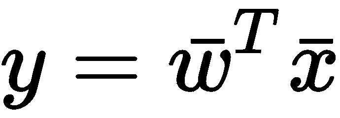
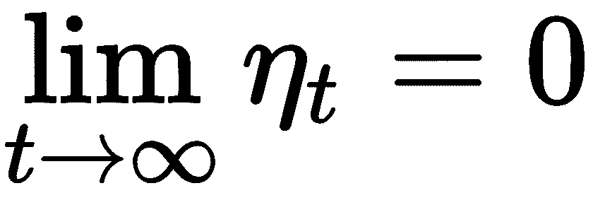
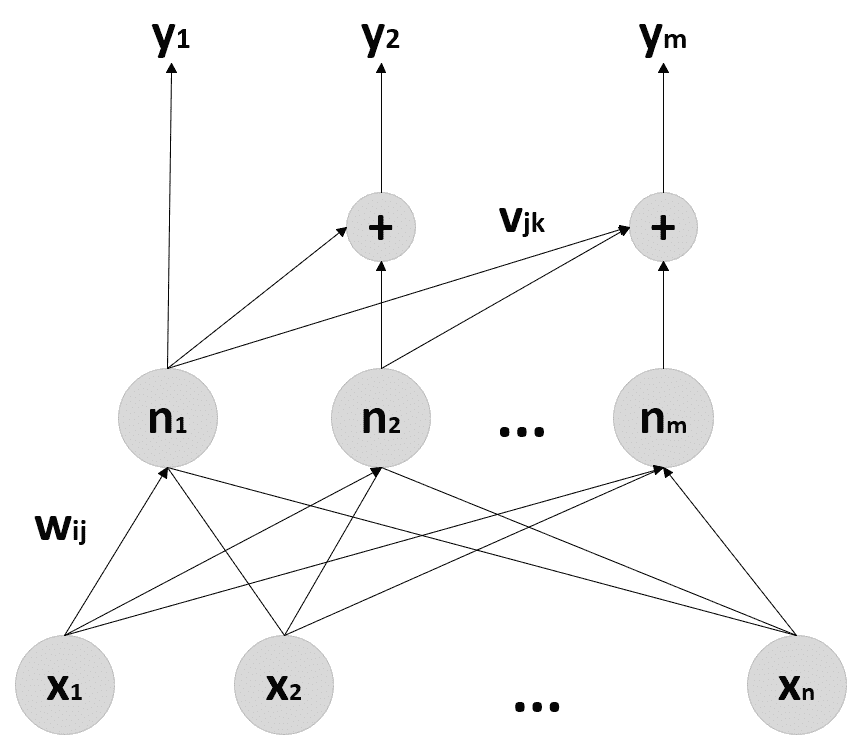
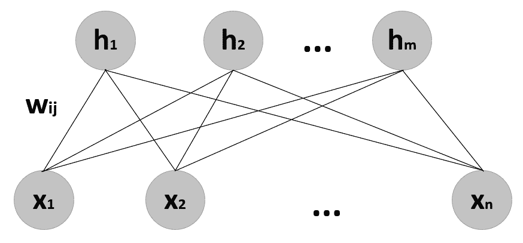
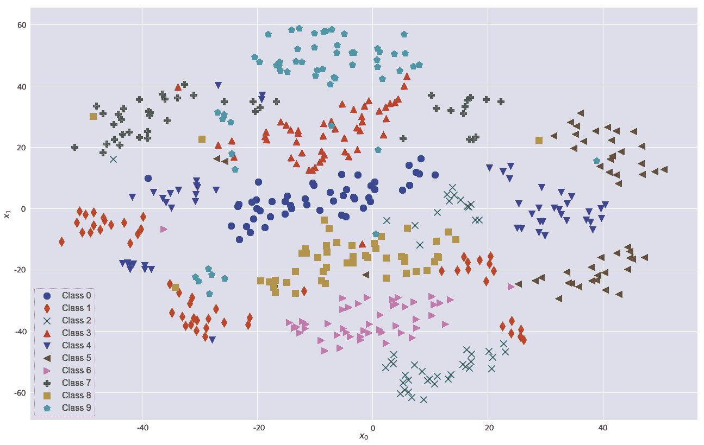

# 无监督神经网络模型

在本章中，我们将讨论一些可用于无监督任务的神经模型。神经网络(通常是深度神经网络)的选择允许您解决具有需要复杂处理单元(例如图像)的特定特征的高维数据集的复杂性。

特别是，我们将涵盖以下内容:

*   自动编码器
*   去噪自动编码器
*   稀疏自动编码器
*   可变自动编码器
*   主成分分析神经网络；
*   桑格网络
*   Rubner-Tavan 的网络
*   无监督的**深度信念网络** ( **DBN** )

# 技术要求

本章中的代码要求如下:

*   Python 3.5+(强烈推荐 [Anaconda 发行版](https://www.anaconda.com/download/)
*   以下库:
    *   SciPy 0.19+
    *   NumPy 1.10+
    *   学习 0.20+
    *   熊猫 0.22+
    *   Matplotlib 2.0+
    *   seaborn 0.9+
    *   张量流 1.5+
    *   深度信仰网络([https://github.com/albertbup/deep-belief-network](https://github.com/albertbup/deep-belief-network))

这些例子可以在 GitHub 资源库中找到，网址为[https://GitHub . com/packktpublishing/HandsOn-Unsupervised-Learning-with-Python/chapter 08](https://github.com/PacktPublishing/HandsOn-Unsupervised-Learning-with-Python/tree/master/Chapter08)。

# 自动编码器

在[第 7 章](07.html)、*降维和分量分析*中，我们讨论了一些常见的方法，这些方法可以用来降低数据集的维数，给定其特有的统计特性(例如，协方差矩阵)。然而，当复杂度增加时，即使**核主成分分析** ( **k** **ernel PCA** )也可能无法找到合适的低维表示。换句话说，信息的丢失可以克服一个阈值，这个阈值保证了有效重建样本的可能性。**自动编码器**是利用神经网络的极端非线性的模型，以便找到给定数据集的低维表示。具体来说，我们假设 *X* 是从数据生成过程中抽取的一组样本， *p <sub class="calibre20">data</sub> (x)* 。为简单起见，我们将考虑*x<sub class="calibre20">I</sub>∈ℜ<sup class="calibre27">n</sup>*，但对支架的结构没有限制(例如，对于 RGB 图像，*x<sub class="calibre20">I</sub>∈ℜ<sup class="calibre27">n×m×3</sup>*)。自动编码器在形式上分为两个部分:一个是编码器，将高维输入转换为较短的代码，另一个是解码器，执行相反的操作(如下图所示):


Structural schema of a generic autoencoder

如果代码是一个 *p* 维向量，编码器可以定义为一个参数化函数，*e()*:


以类似的方式，解码器是另一个参数化函数，*d()*:


因此，一个完整的自动编码器是一个复合函数，给定一个输入样本， *x <sub class="calibre20">i</sub>* ，它提供一个最优重构作为输出:


由于自动编码器通常通过神经网络实现，因此使用反向传播算法训练自动编码器，通常基于均方误差成本函数:


或者，考虑到数据生成过程，我们可以考虑参数化条件分布*q()*来重新表达目标:


因此，成本函数现在可以变成例如 *p <sub class="calibre20">数据</sub>()*和*q()*之间的库尔巴克-莱布勒散度:


由于 *p <sub class="calibre20">数据</sub>* 的熵为常数，可以通过优化过程排除；因此，散度的最小化相当于最小化 *p <sub class="calibre20">数据</sub>* 和 *q* 之间的交叉熵。如果假设 *p <sub class="calibre20">数据</sub>* 和 *q* 为高斯型，则库尔巴克-莱布勒成本函数相当于均方误差，因此两种方法可以互换。在某些情况下，当数据在(0，1)范围内归一化时，可以对 *p <sub class="calibre20">数据</sub>* 和 *q* 采用伯努利分布。形式上，这并不完全正确，因为伯努利分布是二元的并且*x<sub class="calibre20">I</sub>∑{ 0，1 }<sup class="calibre27">d</sup>*；然而，sigmoid 输出单元的使用也保证了连续样本的成功优化，*x<sub class="calibre20">I</sub>∑(0，1) <sup class="calibre27">d</sup>* 。在这种情况下，成本函数如下:


# 深度卷积自动编码器示例

让我们实现一个基于 TensorFlow 和 Olivetti faces 数据集的深度卷积自动编码器(该数据集相对较小，但提供了良好的表达能力)。让我们从加载图像和准备训练集开始:

```py
from sklearn.datasets import fetch_olivetti_faces

faces = fetch_olivetti_faces(shuffle=True, random_state=1000)
X_train = faces['images']
```

这些样本是 400，64 × 64 灰度图像，我们将把它们的大小调整到 32 × 32，以加快计算速度并避免内存问题(此操作会导致视觉精度略有下降，如果您有足够的计算资源，可以将其删除)。我们现在可以定义主要常数(纪元数(`nb_epochs`)、`batch_size`、`code_length`)和`graph`:

```py
import tensorflow as tf

nb_epochs = 600
batch_size = 50
code_length = 256 
width = 32
height = 32

graph = tf.Graph()

```

因此，我们将为 600 个时代训练模型，每批 50 个样本。由于每幅图像为 *64 × 64 = 4，096* ，压缩比为 *4，096/256 = 16* 倍。当然，这种选择并不是一个规则，我邀请您始终检查不同的配置，以便最大限度地提高收敛速度和最终精度。在我们的案例中，我们使用以下层对编码器进行建模:

*   2D 卷积与 16 (3 × 3)滤波器，(2 × 2)步距，ReLU 激活和相同的填充
*   2D 卷积与 32 (3 × 3)滤波器、(1 × 1)步距、ReLU 激活和相同的填充
*   2D 卷积与 64 (3 × 3)滤波器、(1 × 1)步距、ReLU 激活和相同的填充
*   2D 卷积与 128 (3 × 3)滤波器、(1 × 1)步距、ReLU 激活和相同的填充

解码器利用转置卷积序列(也称为**去卷积**):

*   2D 转置卷积具有 128 (3 × 3)个滤波器、(2 × 2)个步长、ReLU 激活和相同的填充
*   2D 转置卷积具有 64 (3 × 3)个滤波器，(1 × 1)步距，ReLU 激活和相同的填充
*   2D 转置卷积具有 32 (3 × 3)个滤波器、(1 × 1)个步长、ReLU 激活和相同的填充
*   具有 1 (3 × 3)滤波器、(1 × 1)步距、Sigmoid 激活和相同填充的 2D 转置卷积

损失函数基于重建图像和原始图像之间差异的 *L <sub class="calibre20">2</sub>* 范数。优化器是亚当，学习率 *η=0.001* 。TensorFlow DAG 的编码器部分如下:

```py
import tensorflow as tf

with graph.as_default():
    input_images_xl = tf.placeholder(tf.float32, 
                                     shape=(None, X_train.shape[1], X_train.shape[2], 1))
    input_images = tf.image.resize_images(input_images_xl, (width, height), 
                                          method=tf.image.ResizeMethod.BICUBIC)

    # Encoder
    conv_0 = tf.layers.conv2d(inputs=input_images,
                              filters=16,
                              kernel_size=(3, 3),
                              strides=(2, 2),
                              activation=tf.nn.relu,
                              padding='same')

    conv_1 = tf.layers.conv2d(inputs=conv_0,
                              filters=32,
                              kernel_size=(3, 3),
                              activation=tf.nn.relu,
                              padding='same')

    conv_2 = tf.layers.conv2d(inputs=conv_1,
                              filters=64,
                              kernel_size=(3, 3),
                              activation=tf.nn.relu,
                              padding='same')

    conv_3 = tf.layers.conv2d(inputs=conv_2,
                              filters=128,
                              kernel_size=(3, 3),
                              activation=tf.nn.relu,
                              padding='same')
```

DAG 的代码部分如下:

```py
import tensorflow as tf

with graph.as_default():   
    # Code layer
    code_input = tf.layers.flatten(inputs=conv_3)

    code_layer = tf.layers.dense(inputs=code_input,
                                 units=code_length,
                                 activation=tf.nn.sigmoid)

    code_mean = tf.reduce_mean(code_layer, axis=1)
```

DAG 的解码器部分如下:

```py
import tensorflow as tf

with graph.as_default(): 
    # Decoder
    decoder_input = tf.reshape(code_layer, (-1, int(width / 2), int(height / 2), 1))

    convt_0 = tf.layers.conv2d_transpose(inputs=decoder_input,
                                         filters=128,
                                         kernel_size=(3, 3),
                                         strides=(2, 2),
                                         activation=tf.nn.relu,
                                         padding='same')

    convt_1 = tf.layers.conv2d_transpose(inputs=convt_0,
                                         filters=64,
                                         kernel_size=(3, 3),
                                         activation=tf.nn.relu,
                                         padding='same')

    convt_2 = tf.layers.conv2d_transpose(inputs=convt_1,
                                         filters=32,
                                         kernel_size=(3, 3),
                                         activation=tf.nn.relu,
                                         padding='same')

    convt_3 = tf.layers.conv2d_transpose(inputs=convt_2,
                                         filters=1,
                                         kernel_size=(3, 3),
                                         activation=tf.sigmoid,
                                         padding='same')

    output_images = tf.image.resize_images(convt_3, (X_train.shape[1], X_train.shape[2]), 
                                           method=tf.image.ResizeMethod.BICUBIC)
```

`loss`函数和 Adam 优化器在以下代码片段中定义:

```py
import tensorflow as tf

with graph.as_default():
    # Loss
    loss = tf.nn.l2_loss(convt_3 - input_images)

    # Training step
    training_step = tf.train.AdamOptimizer(0.001).minimize(loss)
```

一旦定义了完整的 DAG，我们就可以初始化会话和所有变量:

```py
import tensorflow as tf

session = tf.InteractiveSession(graph=graph)
tf.global_variables_initializer().run()
```

一旦初始化了 TensorFlow，就可以开始训练过程，如下所示:

```py
import numpy as np

for e in range(nb_epochs):
    np.random.shuffle(X_train)

    total_loss = 0.0
    code_means = []

    for i in range(0, X_train.shape[0] - batch_size, batch_size):
        X = np.expand_dims(X_train[i:i + batch_size, :, :], axis=3).astype(np.float32)

        _, n_loss, c_mean = session.run([training_step, loss, code_mean],
                                        feed_dict={
                                            input_images_xl: X
                                        })
        total_loss += n_loss
        code_means.append(c_mean)

    print('Epoch {}) Average loss per sample: {} (Code mean: {})'.
          format(e + 1, total_loss / float(X_train.shape[0]), np.mean(code_means)))
```

上一个片段的输出如下:

```py
Epoch 1) Average loss per sample: 11.933397521972656 (Code mean: 0.5420681238174438)
Epoch 2) Average loss per sample: 10.294102325439454 (Code mean: 0.4132006764411926)
Epoch 3) Average loss per sample: 9.917563934326171 (Code mean: 0.38105469942092896)
...
Epoch 600) Average loss per sample: 0.4635812330245972 (Code mean: 0.42368677258491516)
```

在训练过程结束时，每个样本的平均损失约为 0.46(考虑 32 × 32 个图像)，代码的平均值为 0.42。该值表示编码相当密集，因为单个值预期在范围(0，1)内均匀分布；因此，平均值为 0.5。在这种情况下，我们对这个数据不感兴趣，但是我们也将在寻找稀疏性时比较结果。

下图显示了一些示例图像的自动编码器输出:


Sample output of the deep convolutional autoencoder

放大到 64 × 64 部分影响重建质量；然而，通过降低压缩率和增加代码长度可以获得更好的结果。

# 去噪自动编码器

自动编码器的一个非常有用的应用并不严格与它们寻找低维表示的能力相关，而是依赖于从输入到输出的转换过程。特别是，让我们假设一个以零为中心的数据集， *X* ，以及一个噪声版本，其样本具有以下结构:


在这种情况下，自动编码器的目标是去除噪声项并恢复原始样本，*x<sub class="calibre20">I</sub>T3。从数学角度来看，标准和**去噪自动编码器**没有特别的区别；但是，考虑此类型号的容量需求非常重要。由于它们必须恢复原始样本，给定一个损坏的输入(其特征占据更大的样本空间)，图层的数量和尺寸可能比标准自动编码器更大。当然，考虑到复杂性，不经过几次测试是不可能有清晰的洞察力的；因此，我强烈建议从较小的模型开始，增加容量，直到最佳成本函数达到合适的值。对于噪声的添加，有几种可能的策略:*

*   腐蚀每批样品(在整个时代)。
*   使用噪声层作为编码器的输入 1。
*   使用缺失层作为编码器的输入 1(例如，带有椒盐噪声)。在这种情况下，丢失的概率可以是固定的，或者可以在预定义的间隔内随机采样(例如，(0.1，0.5))。

如果假设噪声是高斯噪声(这是最常见的选择)，就有可能同时产生同异方差噪声和异方差噪声。在第一种情况下，所有分量的方差保持不变(即*N(I)∞N(0，σ <sup class="calibre27">2</sup> I)* )，而在后一种情况下，每个分量都有自己的方差。根据问题的性质，另一种解决方案可能更合适；然而，当没有限制时，为了提高系统的整体鲁棒性，最好使用异方差噪声。

# 向深度卷积自动编码器添加噪声

在本例中，我们将修改之前开发的深度卷积自动编码器，以便管理有噪声的输入样本。DAG 几乎是等效的，不同的是，现在，我们需要同时提供噪声图像和原始图像:

```py
import tensorflow as tf

with graph.as_default():
    input_images_xl = tf.placeholder(tf.float32, 
                                     shape=(None, X_train.shape[1], X_train.shape[2], 1))
    input_noisy_images_xl = tf.placeholder(tf.float32, 
                                           shape=(None, X_train.shape[1], X_train.shape[2], 1))

    input_images = tf.image.resize_images(input_images_xl, (width, height), 
                                          method=tf.image.ResizeMethod.BICUBIC)
    input_noisy_images = tf.image.resize_images(input_noisy_images_xl, (width, height), 
                                                method=tf.image.ResizeMethod.BICUBIC)

    # Encoder
    conv_0 = tf.layers.conv2d(inputs=input_noisy_images,
                              filters=16,
                              kernel_size=(3, 3),
                              strides=(2, 2),
                              activation=tf.nn.relu,
                              padding='same')
...
```

`loss`函数当然是通过考虑原始图像来计算的:

```py
...

# Loss
loss = tf.nn.l2_loss(convt_3 - input_images)

# Training step
training_step = tf.train.AdamOptimizer(0.001).minimize(loss)
```

变量标准初始化后，我们可以开始训练过程，考虑一个加性噪声，*N<sub class="calibre20">I</sub>∞N(0，0.45)* (即 *σ ≈ 0.2* ):

```py
import numpy as np

for e in range(nb_epochs):
    np.random.shuffle(X_train)

    total_loss = 0.0
    code_means = []

    for i in range(0, X_train.shape[0] - batch_size, batch_size):
        X = np.expand_dims(X_train[i:i + batch_size, :, :], axis=3).astype(np.float32)
        Xn = np.clip(X + np.random.normal(0.0, 0.2, size=(batch_size, X_train.shape[1], X_train.shape[2], 1)), 0.0, 1.0)

        _, n_loss, c_mean = session.run([training_step, loss, code_mean],
                                        feed_dict={
                                            input_images_xl: X,
                                            input_noisy_images_xl: Xn
                                        })
        total_loss += n_loss
        code_means.append(c_mean)

    print('Epoch {}) Average loss per sample: {} (Code mean: {})'.
          format(e + 1, total_loss / float(X_train.shape[0]), np.mean(code_means)))
```

一旦模型经过训练，就有可能用一些有噪声的样本来测试它。结果显示在下面的截图中:


Noisy samples (upper row); denoised images (lower row)

正如您所看到的，自动编码器已经成功地学会了如何对输入图像进行降噪，即使它们已经非常损坏。我邀请您用其他数据集测试模型，寻找允许合理良好重建的最大噪声方差。

# 稀疏自动编码器

标准自动编码器生成的代码通常很密集；然而，正如[第 7 章](07.html)、*降维和成分分析*中所讨论的，有时，最好使用过完备的字典和稀疏编码。实现这一目标的主要策略是简单地在成本函数中添加一个 *L <sub class="calibre20">1</sub>* 惩罚(在代码层上):


*α* 常数决定了将要达到的稀疏程度。当然，由于*C<sub class="calibre20">s</sub>T5 的最优值与原值不对应，为了达到同样的精度，往往需要更多的纪元和更长的码层。吴恩达提出的另一种方法(在斯坦福大学的*稀疏自动编码器、* CS294A 中)是基于一种稍微不同的方法。代码层被认为是一组独立的伯努利随机变量；因此，给定另一组具有小平均值的伯努利变量(例如，*p<sub class="calibre20">r</sub>∞B(0.05)*)，就有可能尝试找到最佳代码，该代码也使 *z <sub class="calibre20">i</sub>* 和这样的参考分布之间的 kulback-Leibler 散度最小化:*


因此，新的成本函数如下:


最终的效果与使用*L<sub class="calibre20">1</sub>T3】点球取得的效果没有太大区别。事实上，在这两种情况下，模型都被迫学习次优表示，还试图最小化一个目标，如果单独考虑，该目标将导致输出代码始终为空。因此，全代价函数将达到保证重构能力和稀疏性的最小值(稀疏性必须总是与代码长度相平衡)。因此，一般来说，代码越长，可能实现的稀疏性就越大。*

# 向深度卷积自动编码器添加稀疏性约束

在这个例子中，我们希望通过使用*L<sub class="calibre20">1</sub>T4】惩罚来增加代码的稀疏性。DAG 和训练过程与主例完全相同，唯一不同的是`loss`函数，现在变成如下:*

```py
...
sparsity_constraint = 0.01 * tf.reduce_sum(tf.norm(code_layer, ord=1, axis=1))
loss = tf.nn.l2_loss(convt_3 - input_images) + sparsity_constraint
...
```

我们添加了稀疏约束*α= 0.01*；因此，我们可以通过检查平均代码长度来重新训练模型。该过程的输出如下:

```py
Epoch 1) Average loss per sample: 12.785746307373048 (Code mean: 0.30300647020339966)
Epoch 2) Average loss per sample: 10.576686706542969 (Code mean: 0.16661183536052704)
Epoch 3) Average loss per sample: 10.204148864746093 (Code mean: 0.15442773699760437)
...
Epoch 600) Average loss per sample: 0.8058895015716553 (Code mean: 0.028538944199681282)
```

如您所见，代码现在变得非常稀疏，最终平均值约为 0.03。这条信息表明，大多数代码值接近于零，在解码图像时只能考虑其中的少数几个。作为练习，我邀请您分析一组选定图像的代码，试图根据它们的激活/失活来理解它们的值的语义。

# 可变自动编码器

让我们考虑一个数据集， *X* ，来自一个数据生成过程， *p <sub class="calibre20">数据</sub>* 。变分自动编码器是一种生成模型(基于标准自动编码器的主要概念)，由 Kingma 和 Welling(在*自动编码变分贝叶斯中，Kingma D. P .和 Welling m .**ArXiv:1312.6114【stat。ML]* )，旨在再现数据生成过程。为了实现这个目标，我们需要从一个基于一组潜在变量 *z* 和一组可学习参数 *θ* 的通用模型开始。给定一个样本， *x <sub class="calibre20">i</sub> ∈ X* ，模型的概率为 *p(x，z；* *θ)* 。因此，训练过程的目标是找到最大化可能性的最佳参数，*p(x；θ)* ，可通过全联合概率边缘化得到:


前面的表达式很简单，但不幸的是，它很少能以封闭的形式处理。主要原因是我们没有关于先验的有效信息，*p(z；* *θ)* 。而且，即使假设例如*z∨N(0，σ)*(例如 *N(0，I)* )，找到有效样本的概率也极其稀疏。换句话说，给定一个值 *z* ，我们也不太可能生成一个实际上属于 *p <sub class="calibre20">数据</sub>* 的样本。为了解决这个问题，作者提出了一种变分方法，我们将简要地看一下(在前面提到的论文中给出了完整的解释)。假设标准自动编码器的结构，我们可以通过将编码器建模为*q(z | x；θ <sub class="calibre20">q</sub> )* 。此时，我们可以计算*q()*和实际条件概率*p(z | x；θ)* :


当期望值运算符在 *z* 上工作时，可以提取最后一个术语并将其移动到表达式的左侧，如下所示:


经过另一个简单的操作，前面的等式变成如下:


左边是模型下样本的对数似然，右边是一个非负项(KL-散度)和另一个名为**证据下界** ( **ELBO** )的项之和:


正如我们将要讨论的，使用 ELBO 比处理公式的剩余部分更容易，并且，由于 KL-散度不能引入负贡献，如果我们最大化 ELBO，我们也最大化对数似然。

我们之前定义了*p(z；θ) = N(0，I)*；因此，我们可以建模*q(z | x；**【θ)*作为多元高斯，其中两个参数集(均值向量和协方差矩阵)由分裂概率编码器表示。特别地，给定样本 *x* ，编码器现在必须输出均值向量*μ(z | x；θ <sub class="calibre20">q</sub> )* ，协方差矩阵*σ(z | x；θ <sub class="calibre20">q</sub> )* 。为简单起见，我们可以假设矩阵是对角的，因此两个组件具有完全相同的结构。得到的分布是*q(z | x；θ<sub class="calibre20">q</sub>)= N(μ(z | x；θ <sub class="calibre20">q</sub> )，σ(z | x；θ<sub class="calibre20">q</sub>)*；因此，ELBO 的第一项是两个高斯分布之间的负 KL-散度:


在上式中， *p* 是码长，所以是均值和对角协方差向量的维数。右边的表达式非常容易计算，因为*σ*是对角的(即迹是元素的和，行列式是积)。然而，当采用**随机梯度下降** ( **SGD** )算法时，该公式的最大化虽然正确，但不是可微的操作。为了克服这个问题，作者建议重新参数化分布。

当出现批次时，对正态分布进行采样，得到*α∨N(0，I)* 。使用该值，可以通过使用概率编码器的输出来构建所需的样本:*μ(z | x；θ<sub class="calibre20">q</sub>)+ασ(z | x；θ<sub class="calibre20">q</sub>**)<sup class="calibre27">2</sup>*。这个表达式是可微的，因为 *α* 在每批期间是恒定的(当然，作为*μ(z | x；θ <sub class="calibre20">q</sub> )* 和*σ(z | x；θ <sub class="calibre20">q</sub> )* 用神经网络参数化，它们是可微的)。

ELBO 右侧的第二项是 *log p(x|z)的期望值；* *θ)* 。很容易看出，这样的表达式对应于原始分布和重构之间的交叉熵:


这是标准自动编码器的成本函数，假设使用伯努利分布，我们将把它最小化。所以，公式变成如下:


# 深度卷积变分自动编码器示例

在这个例子中，我们想要建立和训练一个基于 Olivetti 人脸数据集的深度卷积变分自动编码器。该结构与我们第一个示例中使用的结构非常相似。编码器有以下几层:

*   2D 卷积与 16 (3 × 3)滤波器，(2 × 2)步距，ReLU 激活和相同的填充
*   2D 卷积与 32 (3 × 3)滤波器、(1 × 1)步距、ReLU 激活和相同的填充
*   2D 卷积与 64 (3 × 3)滤波器、(1 × 1)步距、ReLU 激活和相同的填充
*   2D 卷积与 128 (3 × 3)滤波器、(1 × 1)步距、ReLU 激活和相同的填充

解码器具有以下转置卷积:

*   2D 转置卷积具有 128 (3 × 3)个滤波器、(2 × 2)个步长、ReLU 激活和相同的填充
*   2D 转置卷积具有 128 (3 × 3)个滤波器、(2 × 2)个步长、ReLU 激活和相同的填充
*   2D 转置卷积具有 32 (3 × 3)个滤波器、(1 × 1)个步长、ReLU 激活和相同的填充
*   具有 1 (3 × 3)滤波器、(1 × 1)步距、Sigmoid 激活和相同填充的 2D 转置卷积

噪音的产生完全由 TensorFlow 管理，它基于理论部分解释的技巧。包含图形定义和编码器的 DAG 的第一部分显示在下面的代码片段中:

```py
import tensorflow as tf

nb_epochs = 800
batch_size = 100
code_length = 512
width = 32
height = 32

graph = tf.Graph()

with graph.as_default():
    input_images_xl = tf.placeholder(tf.float32, 
                                     shape=(batch_size, X_train.shape[1], X_train.shape[2], 1))
    input_images = tf.image.resize_images(input_images_xl, (width, height), 
                                          method=tf.image.ResizeMethod.BICUBIC)

    # Encoder
    conv_0 = tf.layers.conv2d(inputs=input_images,
                              filters=16,
                              kernel_size=(3, 3),
                              strides=(2, 2),
                              activation=tf.nn.relu,
                              padding='same')

    conv_1 = tf.layers.conv2d(inputs=conv_0,
                              filters=32,
                              kernel_size=(3, 3),
                              activation=tf.nn.relu,
                              padding='same')

    conv_2 = tf.layers.conv2d(inputs=conv_1,
                              filters=64,
                              kernel_size=(3, 3),
                              activation=tf.nn.relu,
                              padding='same')

    conv_3 = tf.layers.conv2d(inputs=conv_2,
                              filters=128,
                              kernel_size=(3, 3),
                              activation=tf.nn.relu,
                              padding='same')
```

DAG 中定义代码层的部分如下:

```py
import tensorflow as tf

with graph.as_default():
    # Code layer
    code_input = tf.layers.flatten(inputs=conv_3)

    code_mean = tf.layers.dense(inputs=code_input,
                                units=width * height)

    code_log_variance = tf.layers.dense(inputs=code_input,
                                        units=width * height)

    code_std = tf.sqrt(tf.exp(code_log_variance))
```

DAG 的解码器部分如下:

```py
import tensorflow as tf

with graph.as_default():  
    # Decoder
    decoder_input = tf.reshape(sampled_code, (-1, int(width / 4), int(height / 4), 16))

    convt_0 = tf.layers.conv2d_transpose(inputs=decoder_input,
                                         filters=128,
                                         kernel_size=(3, 3),
                                         strides=(2, 2),
                                         activation=tf.nn.relu,
                                         padding='same')

    convt_1 = tf.layers.conv2d_transpose(inputs=convt_0,
                                         filters=128,
                                         kernel_size=(3, 3),
                                         strides=(2, 2),
                                         activation=tf.nn.relu,
                                         padding='same')

    convt_2 = tf.layers.conv2d_transpose(inputs=convt_1,
                                         filters=32,
                                         kernel_size=(3, 3),
                                         activation=tf.nn.relu,
                                         padding='same')

    convt_3 = tf.layers.conv2d_transpose(inputs=convt_2,
                                         filters=1,
                                         kernel_size=(3, 3),
                                         padding='same')

    convt_output = tf.nn.sigmoid(convt_3)

    output_images = tf.image.resize_images(convt_output, (X_train.shape[1], X_train.shape[2]), 
                                           method=tf.image.ResizeMethod.BICUBIC)
```

DAG 的最后一部分包含损失函数和 Adam 优化器，如下所示:

```py
import tensorflow as tf

with graph.as_default():
    # Loss
    reconstruction = tf.nn.sigmoid_cross_entropy_with_logits(logits=convt_3, labels=input_images)
    kl_divergence = 0.5 * tf.reduce_sum(
            tf.square(code_mean) + tf.square(code_std) - tf.log(1e-8 + tf.square(code_std)) - 1, axis=1)

    loss = tf.reduce_sum(tf.reduce_sum(reconstruction) + kl_divergence)

    # Training step
    training_step = tf.train.AdamOptimizer(0.001).minimize(loss)
```

损耗函数由两部分组成:

1.  基于交叉熵的重构损失
2.  码分布与参考正态分布之间的库尔巴克-莱布勒散度

此时，像往常一样，我们可以初始化会话和所有变量，并开始 800 个时期和每批 100 个样本的训练过程:

```py
import tensorflow as tf
import numpy as np

session = tf.InteractiveSession(graph=graph)
tf.global_variables_initializer().run()

for e in range(nb_epochs):
    np.random.shuffle(X_train)

    total_loss = 0.0

    for i in range(0, X_train.shape[0] - batch_size, batch_size):
        X = np.zeros((batch_size, 64, 64, 1), dtype=np.float32)
        X[:, :, :, 0] = X_train[i:i + batch_size, :, :]

        _, n_loss = session.run([training_step, loss],
                                feed_dict={
                                    input_images_xl: X
                                })
        total_loss += n_loss

    print('Epoch {}) Average loss per sample: {}'.format(e + 1, total_loss / float(batch_size)))
```

在训练过程的最后，我们可以测试几个样本的重建。结果如下图所示:


Sample reconstructions produced by the variational autoencoder

作为练习，我邀请读者修改 DAG，以便接受通用输入代码并评估模型的生成属性。或者，可以获取训练样本的代码并应用一些噪声，以便观察对输出重建的影响。

# 基于 Hebbian 的主成分分析

在本节中，我们将分析两个神经模型(桑格和鲁布纳-塔万网络)，它们可以执行**主成分分析** ( **主成分分析**)而不需要特征分解协方差矩阵或执行截断的奇异值分解。它们都是基于**赫布边学习**的概念(更多细节请参考达扬，p .和雅培，L. F .，*理论神经科学，麻省理工学院出版社，* 2005 或博纳科索，g .，*掌握机器学习算法，* Packt，2018)，这是最早关于非常简单神经元动力学的数学理论之一。然而，这样的概念有非常有趣的含义，特别是在组件分析领域。为了更好地理解网络的动力学，快速概述神经元的基本模型将是有帮助的。让我们考虑一个输入， *x ∈ ℜ <sup class="calibre27">n</sup>* ，以及一个权重向量， *w ∈ ℜ <sup class="calibre27">n</sup>* 。神经元执行点积(无偏差)，以产生标量输出， *y* :



现在，如果我们想象两个神经元，第一个叫做突触前单位，另一个叫做突触后单位。 **Hebb 法则**规定突触强度在突触前和突触后单位输出相同符号的值(特别是两者都为正)时必须增加，而在符号不同时必须减弱。这样一个概念的数学表达如下:


常数 *η* 是学习速率。完整的分析超出了本书的范围，但是有可能证明一个赫伯神经元(通过一些非常简单的修改，需要控制 *w* 的生长)修改了突触权重，使得在足够多的迭代之后，它沿着数据集的第一个主成分 *X* 对齐。从这个结果出发(我们就不证明了)，我们可以引入桑格的网络。

# 桑格网络

桑格的网络模型是由桑格提出的(在桑格，T. D .，*单层线性前馈神经网络中的最优无监督学习，神经网络，* 2，1989)，目的是通过在线过程(相反，标准 PCA 是需要整个数据集的批处理)以降序提取数据集的第一个 *k* 主成分， *X* 。即使有一个基于特定版本的奇异值分解的增量算法，这些神经模型的主要优势是它们处理单个样本而不损失性能的内在能力。在展示网络结构之前，有必要先介绍一下对 Hebb 规则的修改，称为 **Oja 规则**:


引入这一规则是为了解决标准 Hebbian 神经元无限增长的问题。其实很容易理解，如果点积 *w <sup class="calibre27">T</sup> x* 为正，δw 会越来越多地通过增加 *w* 的量级来更新权重。因此，在大量迭代之后，模型可能会遇到溢出。Oja 规则通过引入一个自动限制来克服这个问题，该限制迫使权重大小饱和，而不影响神经元找到第一个主成分方向的能力。实际上，用 *w <sub class="calibre20">k</sub>* 表示 *k* <sup class="calibre27">次</sup>迭代后的权重向量，可以证明如下:


桑格的网络是基于欧嘉规则的修改版本，定义为**广义赫布边学习** ( **GHL** )。假设我们有一个数据集， *X，*包含 *m* 向量，*x<sub class="calibre20">I</sub>∈ℜ<sup class="calibre27">n</sup>*。网络结构如下图所示:


Structure of a generic Sanger's network

权重组织成矩阵，*W = { W<sub class="calibre20">ij</sub>}*(*W<sub class="calibre20">ij</sub>T7】是连接突触前单位 *i* 与突触后单位 *j* 的权重)；因此，输出的激活可以通过使用以下公式来计算:*


然而，在这种网络中，我们更感兴趣的是最终的权重，因为它们必须等于第一个 *n 个*主成分。不幸的是，如果我们不加任何修改地应用 Oja 规则，所有的神经元都会找到相同的成分(第一个)；因此，必须采用不同的策略。从理论上，我们知道主成分必须是正交的；因此，如果*w<sub class="calibre20">1</sub>T5】是第一个分量方向的向量，我们可以强制*w<sub class="calibre20">2</sub>T9】与*w<sub class="calibre20">1</sub>T13】正交，依此类推。该方法基于**克-施密特正交化程序**。让我们考虑两个向量——已经收敛的 *w <sub class="calibre20">1</sub>* 和*w<sub class="calibre20">2</sub><sub class="calibre20">0</sub>*，在没有任何干预的情况下，也将收敛到 *w <sub class="calibre20">1</sub>* 。通过考虑这个向量在 *w <sub class="calibre20">1</sub>* 上的投影，我们可以找到 *w <sub class="calibre20">20</sub>* 的正交分量:***


此时，正交分量 *w <sub class="calibre20">2</sub>* 等于以下值:


第三个分量必须正交于 *w <sub class="calibre20">1</sub>* 和 *w <sub class="calibre20">2</sub>* ，因此必须对所有 *n* 单元重复该过程，直到最终收敛。此外，我们现在使用的是已经融合的组件，而是一个并行更新的动态系统；因此，有必要将此过程纳入学习规则，如下所示:


之前的更新是指单个权重， *w <sub class="calibre20">ij</sub>* ，给定一个输入， *x* 。很容易理解，第一部分是标准的赫布规则，而剩下的部分是正交项，它扩展到 *y <sub class="calibre20">i</sub>* 之前的所有单位。

在矩阵形式中，更新如下:


*Tril()*函数计算正方形矩阵的下三角形部分。收敛性证明不是无足轻重的，但是在 *η* 单调递减的温和条件下，可以看到这个模型是如何按降序收敛到第一个 *n* 主成分的:



这样的约束不难实现；但是，一般来说，算法在 *η < 1* 时也能达到收敛，并且在迭代过程中保持不变。

# 桑格网络的一个例子

让我们考虑一个样本二维零中心数据集，它是用 scikit-learn `make_blobs()`效用函数获得的:

```py
import numpy as np

def zero_center(Xd):
    return Xd - np.mean(Xd, axis=0)

X, _ = make_blobs(n_samples=500, centers=3, cluster_std=[5.0, 1.0, 2.5], random_state=1000)
Xs = zero_center(X)

Q = np.cov(Xs.T)
eigu, eigv = np.linalg.eig(Q)

print('Covariance matrix: {}'.format(Q))
print('Eigenvalues: {}'.format(eigu))
print('Eigenvectors: {}'.format(eigv.T))
```

上一个片段的输出如下:

```py
Covariance matrix: [[18.14296606  8.15571356]
 [ 8.15571356 22.87011239]]
Eigenvalues: [12.01524122 28.99783723]
Eigenvectors: [[-0.79948496  0.60068611]
 [-0.60068611 -0.79948496]]
```

特征值分别约为 12 和 29，说明第一主成分(对应转置特征向量矩阵的第一行，所以 *(-0.799，0.6)* )比第二主成分短很多。当然，在这种情况下，我们已经通过特征分解协方差矩阵计算了主成分，但这只是为了教学目的。桑格网络将按降序提取组件；因此，我们期望找到第二列作为权重矩阵的第一列，第一列作为第二列。让我们从初始化权重和训练常数开始:

```py
import numpy as np

n_components = 2
learning_rate = 0.01
nb_iterations = 5000
t = 0.0

W_sanger = np.random.normal(scale=0.5, size=(n_components, Xs.shape[1]))
W_sanger /= np.linalg.norm(W_sanger, axis=1).reshape((n_components, 1))
```

In order to reproduce the example, it's necessary to set the random seed equal to 1,000; that is, `np.random.seed(1000)`.

在这种情况下，我们执行固定次数的迭代(5000 次)；但是，我邀请您修改该示例，以便使用基于两个后续时间步骤计算的权重之差的范数(例如，Frobenius)的容差和停止标准(该方法可以通过避免无用的迭代来加快训练速度)。

下图显示了初始配置:


Initial configuration of the Sanger's network

此时，我们可以开始训练循环，如下所示:

```py
import numpy as np

for i in range(nb_iterations):
    dw = np.zeros((n_components, Xs.shape[1]))
    t += 1.0

    for j in range(Xs.shape[0]):
        Ysj = np.dot(W_sanger, Xs[j]).reshape((n_components, 1))
        QYd = np.tril(np.dot(Ysj, Ysj.T))
        dw += np.dot(Ysj, Xs[j].reshape((1, X.shape[1]))) - np.dot(QYd, W_sanger)

    W_sanger += (learning_rate / t) * dw
    W_sanger /= np.linalg.norm(W_sanger, axis=1).reshape((n_components, 1))

print('Final weights: {}'.format(W_sanger))
print('Final covariance matrix: {}'.format(np.cov(np.dot(Xs, W_sanger.T).T)))
```

上一个片段的输出如下:

```py
Final weights: [[-0.60068611 -0.79948496]
 [-0.79948496  0.60068611]]
Final covariance matrix: [[ 2.89978372e+01 -2.31873305e-13]  
 [-2.31873305e-13 1.20152412e+01]]
```

如您所见，最终协方差矩阵如预期的那样去相关，权重已经收敛到 *C* 的特征向量。重量(主要部件)的最终配置如下图所示:


Final configuration of the Sanger's network

第一主成分对应权重， *w <sub class="calibre20">0</sub>* ，最大， *w <sub class="calibre20">1</sub>* 为第二主成分。我邀请您使用高维数据集测试网络，并基于协方差矩阵的奇异值分解或特征分解，将性能与标准算法进行比较。

# Rubner-Tavan 的网络

另一个可以进行主成分分析的神经网络是由 Rubner 和 Tavan 提出的(在 Rubner，j .和 Tavan，p .，*一个用于主成分分析的自组织网络，欧洲物理学快报，* 10(7)，1989)。然而，他们的方法是基于协方差矩阵的去相关，协方差矩阵是主成分分析的最终结果(也就是说，它就像用自下而上的策略操作，而标准过程是自上而下的)。让我们考虑一个以零为中心的数据集， *X* ，以及一个输出为 *y ∈ ℜ <sup class="calibre27">m</sup>* 向量的网络。因此，输出分布的协方差矩阵如下:




Structure of a generic Rubner-Tavan's network

如您所见，与桑格网络的主要区别在于每个输出单元之前都有求和节点(第一个除外)。这种方法被称为**分层横向连接**，因为每个节点 *y <sub class="calibre20">i</sub> (i > 0)* 都是由一个直接分量 *n <sub class="calibre20">i</sub>* 组成的，加起来就是所有先前的加权输出。因此，假设符号 *v <sup class="calibre27">(i)</sup>* ，表示向量的 *i <sup class="calibre27">th</sup>* 分量， *i* ，网络输出如下:


已经证明，这个模型，有一个特定的权重更新规则(我们将讨论)，收敛到一个单一的，稳定的，不动点，输出被迫成为相互去相关。从模型的结构来看，操作顺序如下:

*   第一个输出保持不变
*   第二输出被迫与第一输出去相关
*   第三输出被迫与第一和第二输出去相关，以此类推
*   最后一个输出被迫与所有先前的输出去相关

经过多次迭代，每一次生产，*y<sub class="calibre20">I</sub>y<sub class="calibre20">j</sub>T5【同】 *i ≠ j* 变为空， *C* 变为对角协方差矩阵。此外，在上述论文中，作者证明了特征值(对应于方差)是按降序排序的；因此，可以通过取包含第一个 *p* 行和列的子矩阵来选择顶部的 *p* 组件。*

Rubner-Tavan 网络通过使用两个不同的规则进行更新，每个权重层一个规则。内部权重 *w <sub class="calibre20">ij</sub>* 通过使用 Oja 规则进行更新:


该规则保证了主成分的提取不会出现*w<sub class="calibre20">ij</sub>T3】的无限增长。相反，外部权重 *v <sub class="calibre20">jk</sub>* 通过使用**反希伯来人规则**来更新:*


前一个公式的第一项*-ηy<sup class="calibre27">(j)</sup>y<sup class="calibre27">(k)</sup>*负责去相关，而第二项类似于 Oja 规则，充当防止权重溢出的自限制正则化器。特别是*-ηy<sup class="calibre27">(I)</sup>y<sup class="calibre27">(k)</sup>*项可以解释为更新规则的反馈信号，*δw<sub class="calibre20">ij</sub>*，受*δv<sub class="calibre20">JK</sub>*项修正的实际输出影响。考虑到桑格网络的行为，不容易理解的是，一旦输出被去相关，内部权重 *w <sub class="calibre20">ij</sub>* 就变成正交的，代表 *X* 的第一主成分。

在矩阵形式中，权重 *w <sub class="calibre20">ij</sub>* 可以立即排列成 *W = {w <sub class="calibre20">ij</sub> }* ，这样在训练过程结束时，每一列都是 *C* 的特征向量(降序)。相反，对于外部砝码 *v <sub class="calibre20">jk</sub>* ，我们需要再次使用*Tril()*运算符:


因此，迭代 *t+1* 时的输出变为如下:


有趣的是，这样的网络有一个循环输出；因此，一旦应用了输入，需要几次迭代才能使 *y* 稳定下来(理想情况下，更新必须持续到*| | y<sup class="calibre27">(t+1)</sup>-y<sup class="calibre27">(t)</sup>| |→0*)。

# 鲁布纳-塔万网络的一个例子

在本例中，我们将使用桑格网络示例中定义的数据集，以便使用鲁布纳-塔万网络执行主成分提取。为了方便起见，让我们重新计算特征分解:

```py
import numpy as np

Q = np.cov(Xs.T)
eigu, eigv = np.linalg.eig(Q)

print('Eigenvalues: {}'.format(eigu))
print('Eigenvectors: {}'.format(eigv.T))
```

上一个片段的输出如下:

```py
Eigenvalues: [12.01524122 28.99783723]
Eigenvectors: [[-0.79948496 0.60068611]
 [-0.60068611 -0.79948496]]
```

我们现在可以初始化超参数，如下所示:

```py
n_components = 2
learning_rate = 0.0001
max_iterations = 1000
stabilization_cycles = 5
threshold = 0.00001

W = np.random.normal(0.0, 0.5, size=(Xs.shape[1], n_components))
V = np.tril(np.random.normal(0.0, 0.01, size=(n_components, n_components)))
np.fill_diagonal(V, 0.0)

prev_W = np.zeros((Xs.shape[1], n_components))
t = 0
```

因此，我们选择使用等于 0.00001 的停止阈值(比较基于权重矩阵的两次连续计算的弗罗贝纽斯范数)和最大 1000 次迭代。我们还设置了五个稳定周期和一个固定的学习速率， *η=0.0001* 。我们可以开始学习过程，如下所示:

```py
import numpy as np

while np.linalg.norm(W - prev_W, ord='fro') > threshold and t < max_iterations:
    prev_W = W.copy()
    t += 1

    for i in range(Xs.shape[0]):
        y_p = np.zeros((n_components, 1))
        xi = np.expand_dims(Xs[i], 1)
        y = None

        for _ in range(stabilization_cycles):
            y = np.dot(W.T, xi) + np.dot(V, y_p)
            y_p = y.copy()

        dW = np.zeros((Xs.shape[1], n_components))
        dV = np.zeros((n_components, n_components))

        for t in range(n_components):
            y2 = np.power(y[t], 2)
            dW[:, t] = np.squeeze((y[t] * xi) + (y2 * np.expand_dims(W[:, t], 1)))
            dV[t, :] = -np.squeeze((y[t] * y) + (y2 * np.expand_dims(V[t, :], 1)))

        W += (learning_rate * dW)
        V += (learning_rate * dV)

        V = np.tril(V)
        np.fill_diagonal(V, 0.0)

        W /= np.linalg.norm(W, axis=0).reshape((1, n_components))

print('Final weights: {}'.format(W))
```

上一个块的输出如下:

```py
Final weights: [[-0.60814345 -0.80365858]
 [-0.79382715 0.59509065]]
```

正如预期的那样，权重收敛到协方差矩阵的特征向量。让我们也计算最终的协方差矩阵，以便检查它的值:

```py
import numpy as np

Y_comp = np.zeros((Xs.shape[0], n_components))

for i in range(Xs.shape[0]):
    y_p = np.zeros((n_components, 1))
    xi = np.expand_dims(Xs[i], 1)

    for _ in range(stabilization_cycles):
        Y_comp[i] = np.squeeze(np.dot(W.T, xi) + np.dot(V.T, y_p))
        y_p = y.copy()

print('Final covariance matrix: {}'.format(np.cov(Y_comp.T)))
```

输出如下:

```py
Final covariance matrix: [[28.9963492 0.31487817]
 [ 0.31487817 12.01606874]]
```

最后的协方差矩阵也是去相关的(误差可以忽略不计)。Rubner-Tavan 的网络通常比 Sanger 的网络更快，因为反 Hebbian 反馈加快了收敛速度；因此，当采用这种模型时，它们应该是首选。然而，为了避免振荡，调整学习速率非常重要。我建议从一个小值开始，稍微增加它，直到迭代次数达到最小值。或者，可以从更高的学习速率开始，允许更快的初始校正，并通过使用线性(如桑格网络)或指数衰减来逐步降低它。

# 无监督深度信念网络

在本节中，我们将讨论一个非常著名的生成模型，在无监督的情况下，可以使用该模型对从预定义的数据生成过程中提取的输入数据集 *X* 进行降维。由于这本书没有特别的先决条件，而且数学复杂性相当高，我们将简要介绍概念，没有证明，也没有对算法的结构进行深入分析。在讨论**深度信念网络** ( **DBN** )之前，有必要介绍另一个模型，**受限玻尔兹曼机** ( **RBM** )，它可以被认为是一个 DBN 的积木。

# 受限玻尔兹曼机器

这个网络，也被称为**调和**，在*动力系统中的信息处理:调和理论的基础* *，并行分布式处理，第 1 卷，麻省理工学院出版社，* 1986)中被提出作为一个概率生成模型。换句话说，RBM 的目标是学习未知的分布(即数据生成过程)，以便生成所有可能的样本。通用结构如下图所示:



Structure of a generic Restricted Boltzmann Machine

神经元 *x <sub class="calibre20">i</sub>* 是可观察的(也就是说，它们代表 RBM 必须学习的过程产生的向量)，而*h<sub class="calibre20">j</sub>T7】是潜在的(也就是说，它们是隐藏的，对 *x <sub class="calibre20">i</sub>* 假设的值有贡献)。没有任何进一步的细节，我们需要说这个模型具有一个**马尔可夫随机场** ( **MRF** )的结构，这得益于同一层的神经元之间没有连接(即描述网络的图是二分图)。MRFs 的一个重要性质是对全联合概率建模的可能性， *p(x，h；θ)* ，吉布斯分布:*


指数 *E(x，h，**【θ】*起着物理系统能量的作用，在我们的例子中，它等于:


这个公式的主要假设是所有的神经元都是伯努利分布的(即 *x <sub class="calibre20">i</sub> ，h<sub class="calibre20">j</sub>∞B(0，1)* )，术语 *b <sub class="calibre20">i</sub>* 和 *c <sub class="calibre20">j</sub>* 是对可观察和潜在单位的偏差。给定一个数据生成过程， *p <sub class="calibre20">数据</sub>* ，一个 RBM 必须被优化，使得可能性，*p(x；**【θ)*，被最大化。跳过所有的中间步骤(可以在前面提到的论文中找到)，可以证明以下几点:


在前面的公式中，*σ()*是 sigmoid 函数。给定这两个表达式，就有可能导出(操作被省略)对数似然相对于所有可学习变量的梯度:


很容易理解，所有梯度的第一项非常容易计算，而所有第二项需要所有可能的可观察值的总和。这显然是一个无法用封闭形式解决的棘手问题。为此，Hinton(在 Hinton，G. *《训练受限玻尔兹曼机器的实用指南》，*多伦多大学计算机科学系，2010)提出了一种称为**对比发散**的算法，可用于寻找近似解。这种方法的解释需要马氏链的知识(这不是先决条件)；然而，我们可以总结这种策略，说它通过有限(和少量)的采样步骤来计算梯度的近似值(通常，一个步骤就足以获得好的结果)。这种方法可以非常有效地训练 RBM，并使深度信念网络易于使用且极其有效。

# 深层信念网络

DBN 是一个基于成果管理制的堆叠模型。通用结构如下图所示:


Structure of a generic DBN

第一层包含可见单元，而其余所有单元都是潜在的。在无监督的情况下，目标是学习未知的分布，找出样本的内部表示。事实上，当潜在单元的数量小于输入单元的数量时，该模型学习如何利用低维子空间对分布进行编码。辛顿和奥森德罗(在辛顿和奥森德罗的《深度信念网的快速学习算法》，神经计算， 18/7，2005)提出了一个逐步贪婪训练过程(通常实现的)。每对层被认为是 RBM，并使用对比发散算法进行训练。一旦训练了一个 RBM，隐藏的层就变成了后续 RBM 的可观察层，这个过程一直持续到最后一层。因此，DBN 开发了一系列内部表示(这就是为什么它被定义为深度网络)，其中每个层次都是在较低层次的特征上训练的。这个过程与变化的自动编码器没有什么不同；然而，在这种情况下，模型的结构更加严格(例如，不可能使用卷积单元)。此外，输出不是输入的重构，而是内部表示。因此，考虑到上一节中讨论的公式，如果有必要反转流程(即，给定内部表示，获取输入)，则有必要从最顶层进行采样，应用以下公式:


当然，这个过程必须向后重复，直到到达实际的输入层。数据库网络非常强大(例如，在天体物理学领域有几个科学应用)，即使它们的结构不像其他更近的模型那样灵活；然而，复杂性通常更高，因此，我总是建议从较小的模型开始，只有在最终精度不足以满足特定目的的情况下，才增加层和/或神经元的数量。

# 无人监管的 DBN 的例子

在本例中，我们希望使用 DBN 来寻找 MNIST 数据集的低维表示。由于这些模型的复杂性很容易增加，我们将把过程限制在 500 个随机样本。该实现基于深信念网络包([https://github.com/albertbup/deep-belief-network](https://github.com/albertbup/deep-belief-network)，支持 NumPy 和 TensorFlow。在前一种情况下，类(名称保持不变)必须从`dbn`包导入，而在后一种情况下，包是`dbn.tensorflow`。在本例中，我们将使用需求较少的 NumPy 版本，但也邀请读者查看 TensorFlow 版本。

让我们从加载和规范化数据集开始，如下所示:

```py
import numpy as np

from sklearn.datasets import load_digits
from sklearn.utils import shuffle

nb_samples = 500

digits = load_digits()

X_train = digits['data'] / np.max(digits['data'])
Y_train = digits['target']

X_train, Y_train = shuffle(X_train, Y_train, random_state=1000)
X_train = X_train[0:nb_samples]
Y_train = Y_train[0:nb_samples]
```

我们现在可以实例化`UnsupervisedDBN`类，其结构如下:

1.  64 个输入神经元(从数据集中隐含检测到)
2.  32 个乙状结肠神经元
3.  32 个乙状结肠神经元
4.  16 个乙状结肠神经元

因此，最后一个表示由 16 个值组成(原始维度的四分之一)。我们正在设置 *η=0.025* 的学习率，每批 16 个样本(当然，为了尽量减少重构误差，请你查看其他配置)。以下代码片段初始化并训练了模型:

```py
from dbn import UnsupervisedDBN

unsupervised_dbn = UnsupervisedDBN(hidden_layers_structure=[32, 32, 16],
                                   learning_rate_rbm=0.025,
                                   n_epochs_rbm=500,
                                   batch_size=16,
                                   activation_function='sigmoid')

X_dbn = unsupervised_dbn.fit_transform(X_train)
```

在训练过程的最后，我们可以在将分布投影到二维空间后，对其进行分析。像往常一样，我们将使用 t-SNE 算法，它保证找到最相似的低维分布:

```py
from sklearn.manifold import TSNE

tsne = TSNE(n_components=2, perplexity=10, random_state=1000)
X_tsne = tsne.fit_transform(X_dbn)
```

下图显示了投影样本的图表:



t-SNE plot of the unsupervised DBN output representations

正如你所看到的，大部分的块是相当内聚的，这表明一个数字的特殊属性已经在低维空间中被成功地表现出来了。在某些情况下，同一个数字组被分成更多的簇，但一般来说，有噪声的(孤立的)点的数量极低。例如，包含数字`2`的组用符号`x`表示。大部分样品在*0<x<sub class="calibre20">0</sub>T32】30，x<sub class="calibre20">1</sub>T33-40*范围内；但是，一个子组也位于范围*-10<x<sub class="calibre20">1</sub><10*内。如果我们检查这个小簇的邻居，他们是由代表数字`8`(由正方形代表)的样本组成的。很容易理解，一些格式错误的二进制与格式错误的八进制非常相似，这证明了原始簇的拆分是正确的。从统计学的角度来看，解释的差异可能会有不同的影响。在某些情况下，几个组件足以确定一个类的特殊特征，但这通常是不正确的。当属于不同类别的样本显示出相似性时，只能通过次要成分的差异来进行区分。当处理包含几乎(甚至部分)重叠样本的数据集时，这一考虑非常重要。当执行降维时，数据科学家的主要任务不是检查总体解释的方差，而是理解是否存在受降维负面影响的区域。在这种情况下，可以定义多个检测规则(例如，当一个样本,*x<sub class="calibre20">I</sub>∈R<sub class="calibre20">1</sub>*或*x<sub class="calibre20">I</sub>∈R<sub class="calibre20">4</sub>→x<sub class="calibre20">I</sub>*具有 *y <sub class="calibre20">k</sub>* 标签)或尽量避免创建这种分割的模型(例如

# 摘要

在这一章中，我们讨论了一些非常常见的用于解决无监督任务的神经模型。自动编码器允许您找到数据集的低维表示，而不会对其复杂性有特定的限制。特别地，深度卷积网络的使用有助于检测和学习高级和低级几何特征，当内部代码也比原始维度短得多时，这可以导致非常精确的重构。我们还讨论了如何为自动编码器增加稀疏性，以及如何使用这些模型对样本进行降噪。标准自动编码器的一个稍有不同的变体是变分自动编码器，它是一个生成模型，可以提高学习数据生成过程的能力，数据集应该从该过程中绘制。

Sanger 和 Rubner-Tavan 的网络是神经模型，能够在没有任何统计预处理的情况下提取数据集的第一个 *k* 主成分。它们还具有以在线方式自然工作的优势(尽管标准主成分分析通常需要整个数据集，即使存在性能略差于离线算法的增量变体)，以及以降序提取组件的优势。我们讨论的最后一个模型是无监督环境下的数据库网络。我们描述了它们的构造块 RBM 的生成属性，然后我们分析了这样的模型如何学习数据生成过程的内部(通常是低维的)表示。

在下一章中，我们将讨论其他神经模型— **生成性对抗网络** ( **GANs** )和**自组织映射** ( **SOMs** )。前者可以学习输入分布，并从中产生新的样本，而后者基于大脑某些特定区域的功能，并训练它们的单位，以便接受特定的输入模式。

# 问题

1.  在自动编码器中，编码器和解码器必须结构对称。这是正确的吗？
2.  给定数据集 *X* 及其变换 *Y* ，基于自动编码器产生的代码， *X* 中包含的所有信息都可以在 *Y* 中找到。这是正确的吗？
3.  一码，*z<sub class="calibre20">I</sub>∑(0，1)<sup class="calibre27">128</sup>T5】有*和(z <sub class="calibre20">i</sub> ) = 36* 。稀疏吗？*
4.  如果 *std(z <sub class="calibre20">i</sub> ) = 0.03* ，是不是代码稀疏？
5.  桑格网络需要协方差矩阵列作为输入向量。这是正确的吗？
6.  我们如何确定由 Rubner-Tavan 网络提取的每个组件的重要性？
7.  给定一个随机向量，*h<sub class="calibre20">I</sub>∈ℜ<sup class="calibre27">m</sup>t5】(*m*是一个 DBN 的输出维数)，有可能确定最可能对应的输入样本吗？*

# 进一步阅读

*   *堆叠去噪自动编码器:利用局部去噪标准在深度网络中学习有用的表示*，*文森特，P.* *，拉罗彻尔，h，拉约伊，I，本吉奥，y，和曼扎戈尔，P.* ，*机器学习研究杂志 11* ，2010
*   *稀疏自动编码器*，CS294A， *Ng，A.* ，*斯坦福大学*
*   *自动编码变分贝叶斯*，*金马。D. P】和*威林* *，m .**ArXiv:1312.6114【stat。ML]**
*   *理论神经科学*，*达扬和阿博特，洛杉矶*，*麻省理工学院出版社，2005 年*
*   *单层线性前馈神经网络中的最优无监督学习*，*神经网络*，*桑格，T. D.* ， *2，1989*
*   *用于主成分分析的自组织网络*，*欧洲物理学快报*，*鲁布纳，j .和塔万，P.* ， *10(7)，1989*
*   *动力系统中的信息处理:和声理论的基础*，*并行分布式处理*，*斯摩棱斯基，保罗*，*第一卷，麻省理工学院出版社，1986 年*
*   *训练受限玻尔兹曼机器实用指南*，*辛顿，G.* ，多伦多大学计算机科学系，2010
*   *深度信念网络的快速学习算法*，*辛顿，奥辛德罗，和特怀威*，*神经计算，18/7，2005*
*   *机器学习算法，第二版*，博纳科尔索，g，Packt，2018
*   *掌握机器学习算法*，博纳科索，g，Packt，2018