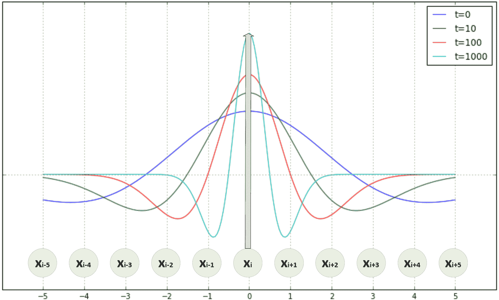
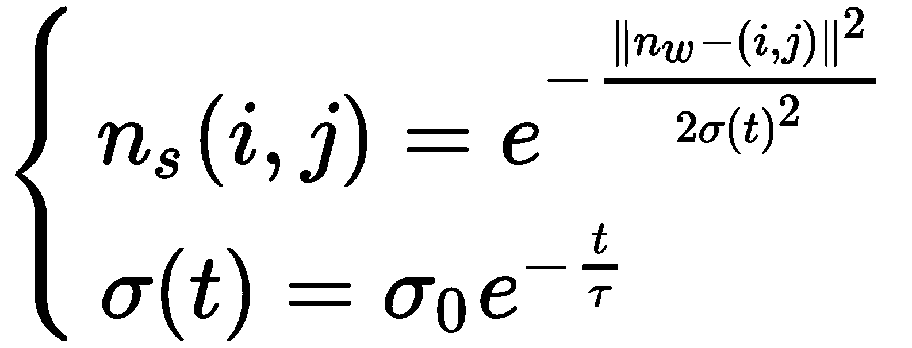
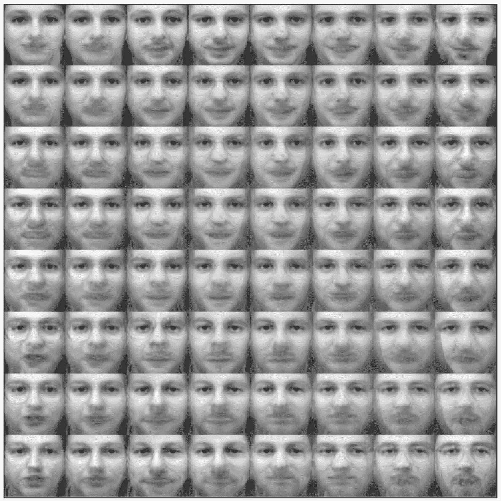

# 九、生成性对抗网络与自监督系统

在这一章中，我们将结束无监督学习的旅程，讨论一些非常流行的神经模型，这些模型可以用来执行数据生成过程，并从中提取新的样本。此外，我们将分析自组织地图的功能，它可以调整它们的结构，以便特定的单元对不同的输入模式做出响应。

特别是，我们将讨论以下主题:

*   **生成性对抗网络** ( **GANs** )
*   **深度卷积 GANs** ( **DCGANs** )
*   **水鹅** ( **WGANs**
*   **自组织地图** ( **SOMs** )

# 技术要求

本章将介绍的代码需要以下内容:

*   Python 3.5+(强烈推荐蟒蛇分布([https://www.anaconda.com/distribution/](https://www.anaconda.com/distribution/))
*   库，如下所示:
    *   SciPy 0.19+
    *   NumPy 1.10+
    *   学习 0.20+
    *   熊猫 0.22+
    *   Matplotlib 2.0+
    *   seaborn 0.9+
    *   张量流 1.5+
    *   Keras 2+(仅适用于数据集实用程序功能)

这些例子可以在 GitHub 资源库中找到，网址为[https://GitHub . com/packktpublishing/HandsOn-Unsupervised-Learning-with-Python/chapter 09](https://github.com/PacktPublishing/HandsOn-Unsupervised-Learning-with-Python/tree/master/Chapter09)。

# 生成性对抗网络

这些生成模型是由古德费勒和其他研究人员提出的(在*生成对抗网络，古德费勒，保罗-阿巴迪，米尔扎，许，沃德-法利，奥扎尔，库维尔和本吉奥，arXiv:1406.2661 [stat。【M1】*)为了利用**对抗性训练的威力，**伴随着深度神经网络的灵活性。不需要太多的技术细节，我们可以引入对抗训练的概念，作为一种基于博弈论的技术，其目标是优化两个相互对抗的代理。当一个代理试图欺骗对手时，另一个代理必须学会如何区分正确和虚假的输入。特别是，氮化镓是一个模型，分为两个明确定义的组成部分:

*   一台**发电机**
*   一个**鉴别者**(也称一个**批评家**)

让我们首先假设我们有一个数据生成过程， *p <sub class="calibre20">data</sub>* ，以及一个数据集， *X* ，从其中抽取的 *m* 个样本:


为简单起见，假设数据集只有一个维度；然而，这不是一种约束，也不是一种限制。生成器是一个参数化函数(通常使用神经网络)，它被馈送有噪声的样本，并提供一个 *n* 维向量作为输出:


换句话说，发生器是在样本 *x ∈ ℜ <sup class="calibre27">n</sup>* 上均匀分布到另一个分布 *p <sub class="calibre20">g</sub> (x)* 的变换。GAN 的主要目标如下:


然而，与自动编码器相反，在自动编码器中，这种目标是通过整个模型的直接训练来实现的，在 GAN 中，目标是通过生成器和鉴别器之间的游戏来实现的，该游戏是另一个参数化函数，该函数获取样本,*x<sub class="calibre20">I</sub>∈ℜ<sup class="calibre27">n</sup>t5 】,并返回一个概率:*


鉴别器的作用是区分从 *p <sub class="calibre20">数据</sub>* 提取的样本(返回大概率)和*g(z；θ <sub class="calibre20">g</sub> )* (返回低概率)。然而，由于生成器的目标是变得越来越能够再现 *p <sub class="calibre20">数据</sub>* ，其作用是学习如何利用从数据生成过程的几乎完美再现中提取的样本来欺骗鉴别器。因此，考虑到鉴别器，目标是最大化以下条件:


但是这是一个**极小极大游戏**，也就是说两个对手 *A* 和 *B* 必须尽量最小化( *A* )和最大化( *B* )，目标一致。在这种情况下，生成器的目标是最小化先前双成本函数的第二项:


事实上，当两个代理成功优化目标时，鉴别器将能够区分从 *p <sub class="calibre20">数据</sub>* 提取的样本和异常值，生成器将能够输出属于 *p <sub class="calibre20">数据</sub>* 的合成样本。但必须明确的是，问题可以用单一目标来表达，训练过程的目标是找出最优的参数集， *θ = {θ <sub class="calibre20">d</sub> ，θ <sub class="calibre20">g</sub> }* ，使鉴别器最大化，而发生器最小化。两个代理必须同时优化，但实际上，过程是交替的(例如，生成器、鉴别器、生成器等)。在更简洁的形式中，目标可以表达如下:


因此，通过解决以下问题可以达到最优:


根据博弈论，这是一个承认一个**纳什均衡**点的非合作博弈。当满足这样的条件时，如果我们假设双方都知道对手的策略，他们就没有理由再改变自己的策略了。在 GAN 的上下文中，这个条件意味着一旦达到平衡(甚至只是理论上)，生成器就可以继续输出样本，确保它们不会被鉴别器误分类。同时，鉴别器没有理由改变策略，因为它可以完美区分 *p <sub class="calibre20">数据</sub>T5】和任何其他分布。从动态的角度来看，两个组件的训练速度是不对称的。虽然生成器通常需要更多的迭代，但鉴别器可以非常快速地收敛。然而，这种过早的收敛对于整体性能来说是非常危险的。事实上，由于鉴频器提供的反馈，发生器也达到了最佳状态。不幸的是，当梯度非常小时，这种贡献变得可以忽略不计，其明显的后果是生成器错过了提高其输出更好样本的能力的机会(例如，当样本是图像时，它们的质量可以保持非常低，即使是复杂的架构)。这种情况不依赖于发生器固有的容量不足，而是依赖于一旦鉴别器收敛(或非常接近收敛)就开始应用的有限数量的校正。在实践中，由于没有具体的规则，唯一有效的建议是在训练过程中检查两个损失函数。如果鉴别器损耗下降得太快，而发生器损耗仍然很大，通常最好用单个鉴别器步骤交错更多的发生器训练步骤。*

# 分析氮化镓

让我们假设我们有一个通过使用数据集 *X* 正确训练的 GAN，该数据集是从 *p <sub class="calibre20">数据</sub> (x)* 中提取的。Goodfellow 等人证明，给定发电机分布 *p <sub class="calibre20">g</sub> (x)* ，最优鉴别器如下:


全局目标可以通过使用最佳鉴别器来重写:


我们现在可以扩展前面的表达式:


现在，让我们考虑两个分布 *a* 和 *b* 之间的库尔巴克-莱布勒散度:


考虑到前面的表达式，经过一些简单的操作，很容易证明以下等式:


因此，目标可以表示为数据生成过程和生成器分布之间的延森-香农散度的函数。与库尔巴克-莱布勒散度的主要区别是: *0 ≤ D <sub class="calibre20">JS</sub> (p <sub class="calibre20">数据</sub> ||p <sub class="calibre20">g</sub> ) ≤ log(2)* ，且对称。这个重构并不奇怪，因为 GAN 的真正目标是成为一个能够成功复制 *p <sub class="calibre20">数据</sub>* 的生成模型，如下图所示:


The goal of a GAN is to move the generative model distribution in the direction of p<sub class="calibre26">data</sub>, trying to maximize the overlap

初始分布一般与目标分布完全不同；因此，一个 GAN 必须重塑并向 *p <sub class="calibre20">数据</sub>* 移动。当重叠完成时，詹森-香农散度达到最小值，优化完成。然而，正如我们将在下一节中讨论的那样，由于詹森-香农发散的性质，这个过程并不总是运行得如此平稳，并且氮化镓可以在离期望的最终配置非常远的地方达到次优最小值。

# 模式崩溃

给定一个概率分布，最常出现的值(在离散情况下)，或对应于概率密度函数最大值的值(在连续情况下)，称为**模式**。如果我们考虑后一种情况，PDF 具有单一最大值的分布称为**单峰**。当有两个局部极大值时，称为**双峰、**等(一般来说，当有多种模式时，分布简称为**多峰**)。下面的截图显示了两个例子:


Examples of unimodal (left) and bimodal (right) distributions

在处理复杂数据集时，我们不能轻易估计模式的数量；然而，有理由假设数据生成过程是多模态的。有时，当样本基于一个共同的结构时，可以有一个主导模式和几个次要模式；但一般来说，如果样本在结构上不同，则出现单一模式的概率非常低(当然，如果同一基本元素有细微的修改，单一模式也是可能的，但这不是一个需要考虑的有效情况)。

现在，让我们假设我们正在处理人脸图片的多模态分布(比如我们将在下一节讨论的例子中的那些)。一个模式的内容是什么？这个问题很难准确回答，但是很容易理解，数据生成过程的一个最大值对应的人脸应该包含数据集中最常见的元素(例如，如果 80%的人有胡子，我们可以合理地假设模式会包含它)。

在使用 GANs 时，我们面临的最著名和最棘手的问题之一被称为**模式崩溃**，它涉及到一个次优的最终配置，其中生成器冻结在一个模式周围，并继续提供与输出相同种类的样本。出现这种情况的原因分析起来极其复杂(确实只有理论)，但如果我们重新思考 minimax 游戏，就能理解为什么会出现这种情况。因为我们要训练两个不同的成分，即使纳什均衡得到保证，经过几次迭代后，鉴别器对最常见的模式变得非常有选择性。当然，由于生成器是为了欺骗鉴别器而训练的，因此实现这一目标的最简单方法是简单地避开远离模式的所有样本。这种行为增加了鉴别器的选择性，并产生了一个反馈过程，使氮化镓崩溃到只有一小部分数据产生过程存在的状态。

在梯度方面，鉴别器为生成器优化提供的信息很快变得非常稀缺，因为最常见的样本不需要任何调整。另一方面，当生成器开始避免所有那些 *p(x)* 不接近最大值的样本时，它们不会将鉴别器暴露给新的、潜在有效的样本，因此梯度将保持非常小，直到它消失为零。不幸的是，没有可以用来避免这个问题的全局策略，但是在本章中，我们将讨论为减轻模式崩溃(WGANs)的风险而提出的方法之一。特别是，我们将把我们的注意力集中在詹森-香农发散的局限性上，在某些情况下，这可能会导致氮化镓在没有大梯度的情况下达到次优配置。在这篇介绍中，重要的是不熟悉这些模型的读者意识到风险，并且能够在模式崩溃发生时识别它。

在这一点上，我们可以转向事物的实际方面，并使用张量流来模拟一个真正的 GAN。

# 深度卷积氮化镓的例子

我们现在可以实现一个 DCGAN，基于在*深度卷积生成对抗网络的无监督表示学习中提出的模型，拉德福德 a，梅兹 l，和钦塔拉 s .，* *arXiv:1511.06434 [cs。LG]* ，Olivetti 面向数据集，该数据集足够小，允许快速训练阶段。

让我们从加载数据集开始，对范围( *-1，1* )中的值进行归一化，如下所示:

```py
from sklearn.datasets import fetch_olivetti_faces

faces = fetch_olivetti_faces(shuffle=True, random_state=1000)

X_train = faces['images']
X_train = (2.0 * X_train) - 1.0

width = X_train.shape[1]
height = X_train.shape[2]
```

下面的截图显示了几个示例人脸:


Sample faces drawn from the Olivetti faces dataset

即使所有脸的结构都类似于相同的图案，眼睛(戴眼镜和不戴眼镜)、鼻子和嘴巴的形状也有细微的差异。而且，有些人留着胡子，表情也大不相同(微笑、严肃、盯着远离镜头的东西等等)。因此，我们需要期待一个多模态分布，可能有一个对应于平均面部结构的主模式，以及几个对应于具有特定共同特征的子集的其他模式。

此时，我们可以定义主要常数，如下所示:

```py
nb_samples = 400
code_length = 512
nb_epochs = 500
batch_size = 50
nb_iterations = int(nb_samples / batch_size)
```

有`400` 64 × 64 灰度样本(对应每个样本 4096 个分量)。在本例中，我们选择使用带有`512`分量的噪声码向量，并用`50`样本批次为`500`时期训练模型。这样的值不是基于黄金法则，因为(特别是对于 GANs)几乎不可能知道哪种设置会产生最佳结果。因此，像往常一样，我强烈建议在做出决定之前检查不同的超参数集。

当训练过程不太长时，可以用一组均匀采样的超参数(例如，*批量∑{ 20，50，100，200}* )来检查发生器和鉴别器的平均损失。例如，如果一个最优值似乎存在于范围( *50，100* )中，一个好的策略是提取一些随机值并重新训练模型。可以重复这样的过程，直到采样值之间的差异可以忽略不计。当然，考虑到这些模型的复杂性，彻底的搜索只能用专用硬件(即多个 GPU 或 TPU)进行；因此，另一个建议是从已测试的配置开始(即使上下文不同)并应用小的修改，以便为特定任务优化它们。在本例中，我们根据原始论文设置了许多值，但我邀请读者在自定义更改后重新运行代码，并观察差异。

我们现在可以为生成器定义 DAG，它基于以下结构:

*   具有 1，024 (4 × 4)个滤波器的 2D 卷积，具有( *1，1* )步距、有效填充和线性输出
*   批处理规范化和泄漏 ReLU 激活(当输入值为负时，这更有效；事实上，当 *x < 0* 时，标准的 ReLU 具有零梯度，而泄漏的 ReLU 具有恒定的小梯度，允许轻微的修改)
*   2D 卷积与 512 (4 × 4)滤波器的( *2，2* )步距，相同的填充和线性输出
*   批量标准化和泄漏 ReLU 激活
*   具有 256 (4 × 4)个滤波器的 2D 卷积，具有( *2，2* )步距、相同的填充和线性输出
*   批量标准化和泄漏 ReLU 激活
*   2D 卷积与 128 (4 × 4)滤波器，具有( *2，2* )步距，相同的填充和线性输出
*   批量标准化和泄漏 ReLU 激活
*   2D 卷积与 1 (4 × 4)过滤器与( *2，2* )步距，相同的填充，和双曲正切输出

生成器的代码如以下代码片段所示:

```py
import tensorflow as tf

def generator(z, is_training=True):
    with tf.variable_scope('generator'):
        conv_0 = tf.layers.conv2d_transpose(inputs=z,
                                            filters=1024,
                                            kernel_size=(4, 4),
                                            padding='valid')

        b_conv_0 = tf.layers.batch_normalization(inputs=conv_0, training=is_training)

        conv_1 = tf.layers.conv2d_transpose(inputs=tf.nn.leaky_relu(b_conv_0),
                                            filters=512,
                                            kernel_size=(4, 4),
                                            strides=(2, 2),
                                            padding='same')

        b_conv_1 = tf.layers.batch_normalization(inputs=conv_1, training=is_training)

        conv_2 = tf.layers.conv2d_transpose(inputs=tf.nn.leaky_relu(b_conv_1),
                                            filters=256,
                                            kernel_size=(4, 4),
                                            strides=(2, 2),
                                            padding='same')

        b_conv_2 = tf.layers.batch_normalization(inputs=conv_2, training=is_training)

        conv_3 = tf.layers.conv2d_transpose(inputs=tf.nn.leaky_relu(b_conv_2),
                                            filters=128,
                                            kernel_size=(4, 4),
                                            strides=(2, 2),
                                            padding='same')

        b_conv_3 = tf.layers.batch_normalization(inputs=conv_3, training=is_training)

        conv_4 = tf.layers.conv2d_transpose(inputs=tf.nn.leaky_relu(b_conv_3),
                                            filters=1,
                                            kernel_size=(4, 4),
                                            strides=(2, 2),
                                            padding='same')

        return tf.nn.tanh(conv_4)
```

代码很简单，但有助于阐明对可变范围上下文(通过命令`tf.variable_scope('generator')`定义)的需求。因为我们需要用另一种方式训练模型，所以当生成器被优化时，只有它的变量必须被更新。因此，我们定义了一个命名范围内的所有层，允许强制优化器只处理所有可训练变量的子集。

鉴别器的 DAG 基于以下对称结构:

*   具有 128 (4 × 4)个滤波器的 2D 卷积，具有( *2，2* )步距、相同的填充和泄漏的 ReLU 输出
*   具有 256 (4 × 4)个滤波器的 2D 卷积，具有( *2，2* )步距、相同的填充和线性输出
*   批量标准化和泄漏 ReLU 激活
*   2D 卷积与 512 (4 × 4)滤波器的( *2，2* )步距，相同的填充和线性输出
*   批量标准化和泄漏 ReLU 激活
*   具有 1，024 (4 × 4)个滤波器的 2D 卷积，具有( *2，2* )步距、相同的填充和线性输出
*   批量标准化和泄漏 ReLU 激活
*   具有 1 (4 × 4)个滤波器的 2D 卷积，这些滤波器具有( *2，2* )步距、有效填充和线性输出(输出预期为 sigmoid，可以表示概率，但我们将直接在损失函数内部执行此转换)

鉴别器的代码如下:

```py
import tensorflow as tf

def discriminator(x, is_training=True, reuse_variables=True):
    with tf.variable_scope('discriminator', reuse=reuse_variables):
        conv_0 = tf.layers.conv2d(inputs=x,
                                  filters=128,
                                  kernel_size=(4, 4),
                                  strides=(2, 2),
                                  padding='same')

        conv_1 = tf.layers.conv2d(inputs=tf.nn.leaky_relu(conv_0),
                                  filters=256,
                                  kernel_size=(4, 4),
                                  strides=(2, 2),
                                  padding='same')

        b_conv_1 = tf.layers.batch_normalization(inputs=conv_1, training=is_training)

        conv_2 = tf.layers.conv2d(inputs=tf.nn.leaky_relu(b_conv_1),
                                  filters=512,
                                  kernel_size=(4, 4),
                                  strides=(2, 2),
                                  padding='same')

        b_conv_2 = tf.layers.batch_normalization(inputs=conv_2, training=is_training)

        conv_3 = tf.layers.conv2d(inputs=tf.nn.leaky_relu(b_conv_2),
                                  filters=1024,
                                  kernel_size=(4, 4),
                                  strides=(2, 2),
                                  padding='same')

        b_conv_3 = tf.layers.batch_normalization(inputs=conv_3, training=is_training)

        conv_4 = tf.layers.conv2d(inputs=tf.nn.leaky_relu(b_conv_3),
                                  filters=1,
                                  kernel_size=(4, 4),
                                  padding='valid')

        return conv_4
```

同样，在这种情况下，我们需要声明一个专用的变量范围。然而，由于鉴别器被用在两个不同的上下文中(即，真实样本的评估和生成样本的评估)，我们需要请求在第二个声明中重用变量。如果没有设置这样的标志，对函数的每次调用都会产生新的变量集，对应于不同的鉴别器。

一旦声明了两个主要组件，我们就可以初始化图形并为 GAN 设置整个 DAG，如下所示:

```py
import tensorflow as tf

graph = tf.Graph()

with graph.as_default():
    input_x = tf.placeholder(tf.float32, shape=(None, width, height, 1))
    input_z = tf.placeholder(tf.float32, shape=(None, code_length))
    is_training = tf.placeholder(tf.bool)

    gen = generator(z=tf.reshape(input_z, (-1, 1, 1, code_length)), is_training=is_training)

    discr_1_l = discriminator(x=input_x, is_training=is_training, reuse_variables=False)
    discr_2_l = discriminator(x=gen, is_training=is_training, reuse_variables=True)

    loss_d_1 = tf.reduce_mean(
            tf.nn.sigmoid_cross_entropy_with_logits(labels=tf.ones_like(discr_1_l), logits=discr_1_l))
    loss_d_2 = tf.reduce_mean(
            tf.nn.sigmoid_cross_entropy_with_logits(labels=tf.zeros_like(discr_2_l), logits=discr_2_l))
    loss_d = loss_d_1 + loss_d_2

    loss_g = tf.reduce_mean(
            tf.nn.sigmoid_cross_entropy_with_logits(labels=tf.ones_like(discr_2_l), logits=discr_2_l))

    variables_g = [variable for variable in tf.trainable_variables() if variable.name.startswith('generator')]
    variables_d = [variable for variable in tf.trainable_variables() if variable.name.startswith('discriminator')]

    with tf.control_dependencies(tf.get_collection(tf.GraphKeys.UPDATE_OPS)):
        training_step_d = tf.train.AdamOptimizer(0.0001, beta1=0.5).minimize(loss=loss_d, var_list=variables_d)
        training_step_g = tf.train.AdamOptimizer(0.0005, beta1=0.5).minimize(loss=loss_g, var_list=variables_g)
```

第一个块包含占位符的声明。为了清楚起见，虽然`input_x`和`input_z`的目的很容易理解，`is_training`可以不那么明显。这个布尔标志的目标是允许在生产阶段禁用批处理规范化(它必须只在训练阶段有效)。接下来的步骤包括声明生成器和两个鉴别器(它们在形式上是相同的，因为变量是共享的，但是一个被馈送真实样本，另一个必须评估生成器的输出)。然后，是时候定义损失函数了，这是基于一个加快计算速度和增加数值稳定性的技巧。

函数`tf.nn.sigmoid_cross_entropy_with_logits()`接受一个*逻辑*(这就是为什么我们没有直接对鉴别器输出应用 sigmoid 变换)，并允许我们执行以下矢量计算:


因此，由于`loss_d_1`是真实样本的损失函数，我们使用运算符`tf.ones_like()`将所有标签设置为 1；因此，sigmoid 交叉熵的第二项变为零，结果如下:


相反，`loss_d_2`恰好需要乙状结肠交叉熵的第二项；因此，我们将所有标签设置为零，以获得损失函数:


同样的概念也适用于发电机损耗函数。接下来的步骤需要定义两个亚当优化器。正如我们之前解释的，我们需要隔离变量，以便执行交错训练；因此，`minimize()`函数现在既有损失，也有必须更新的变量集。在官方 TensorFlow 文档中建议使用上下文声明`tf.control_dependencies(tf.get_collection(tf.GraphKeys.UPDATE_OPS))`，无论何时使用批处理规范化，其目标都是仅在计算平均值和方差后才允许执行训练步骤(有关该技术的更多详细信息，请查看原始论文:*批处理规范化:通过减少内部协变量偏移来加速深度网络训练*， *Ioffe S .和 Szegedy C.* ，*arXiv:1502.03167[cs]。LG]* )。

此时，我们可以创建一个会话并初始化所有变量，如下所示:

```py
import tensorflow as tf

session = tf.InteractiveSession(graph=graph)
tf.global_variables_initializer().run()
```

一旦一切准备就绪，训练过程就可以开始了。下面的代码片段显示了执行鉴别器和生成器交替训练的代码:

```py
import numpy as np

samples_range = np.arange(nb_samples)

for e in range(nb_epochs):
    d_losses = []
    g_losses = []

    for i in range(nb_iterations):
        Xi = np.random.choice(samples_range, size=batch_size)
        X = np.expand_dims(X_train[Xi], axis=3)
        Z = np.random.uniform(-1.0, 1.0, size=(batch_size, code_length)).astype(np.float32)

        _, d_loss = session.run([training_step_d, loss_d],
                                    feed_dict={
                                        input_x: X,
                                        input_z: Z,
                                        is_training: True
                                    })
        d_losses.append(d_loss)

        Z = np.random.uniform(-1.0, 1.0, size=(batch_size, code_length)).astype(np.float32)

        _, g_loss = session.run([training_step_g, loss_g],
                                    feed_dict={
                                        input_x: X,
                                        input_z: Z,
                                        is_training: True
                                        })

        g_losses.append(g_loss)

    print('Epoch {}) Avg. discriminator loss: {} - Avg. generator loss: {}'.format(e + 1, np.mean(d_losses), np.mean(g_losses)))
```

在这两个步骤中，我们向网络馈送一批真实图像(在生成器优化期间不会使用)和统一采样的代码 *Z* ，其中每个组件都是*Z<sub class="calibre20">I</sub>∞U(-1，1)* 。为了降低模式崩溃的风险，我们将在每次迭代开始时对集合进行洗牌。这不是一个稳健的方法，但它至少保证避免了可能导致 GAN 成为次优配置的相互关联。

在训练过程结束时，我们可以生成几个样本人脸，如下所示:

```py
import numpy as np

Z = np.random.uniform(-1.0, 1.0, size=(20, code_length)).astype(np.float32)

Ys = session.run([gen],
                 feed_dict={
                     input_z: Z,
                     is_training: False
                 })

Ys = np.squeeze((Ys[0] + 1.0) * 0.5 * 255.0).astype(np.uint8)
```

结果如下图所示:


Sample faces generated by the DCGAN

可以看到，质量非常高，更长的训练阶段会有所帮助(伴随着更深的超参数搜索)。然而，GAN 已经成功地学会了如何通过使用相同的属性集来生成新面孔。表达式和视觉元素(例如，眼睛形状、眼镜的存在等)都被重新应用于不同的模型，以便产生从相同的原始数据生成过程中绘制的潜在面部。例如，第七个和第八个是基于一个人，具有修改的属性。原图如下:


Original pictures corresponding to one of the Olivetti people

嘴巴的结构对两个生成的样本来说都是通用的，但是观察第二个样本，我们可以确认已经从其他样本中提取了许多元素(鼻子、眼睛、前额和方向)，产生了一张不存在的人的照片。即使模型工作正常，也会出现部分模式崩溃，因为某些面孔(具有相对属性，如眼镜)比其他面孔更常见。相反，一些女性面孔(数据集中的少数)已经与男性属性合并，产生了样本，例如包含生成样本的图像的第一行的第二个或第八个。作为练习，我邀请读者使用不同的参数和其他数据集(包含灰度和 RGB 图像，如 Cifar-10 或 STL-10)重新训练模型。

The screenshots that are shown in this and other examples in this chapter are often based on random generations; therefore, in order to increase the reproducibility, I suggest setting both the NumPy and TensorFlow random seed equal to `1000`. The commands are: `np.random.seed(1000)` and `tf.set_random_seed(1000)`.

# 水来了

给定概率分布 *p(x)* ，集合*D<sub class="calibre20">p</sub>= { x:p(x)>0 }*称为**支持**。如果两个分布 *p(x)* 和 *q(x)* 具有不连续的支撑(即，*d<sub class="calibre20">p</sub>∩d<sub class="calibre20">q</sub>= {∅}*，则 Jensen-Shannon 散度等于 *log(2)* 。这意味着梯度为零，不能再进行任何修正。在涉及 GAN 的一般场景中， *p <sub class="calibre20">g</sub> (x)* 和 *p <sub class="calibre20">数据</sub>* 完全重叠的可能性极小(但是，您可以预期最小重叠)；因此，梯度非常小，权重的更新也很小。这种问题可能会阻碍训练过程，并使氮化镓陷入无法逃脱的次优配置。为此，Arjovsky、Chintala 和 Bottou(在 *Wasserstein GAN、*T30】Arjovsky m .、 *Chintala S.* 、*和 Bottou L.* 、*arXiv:1701.07875【stat。ML]* )提出了一个略有不同的模型，基于一个更稳健的发散度量，称为**瓦瑟斯坦距离**(或地球移动者距离):


为了理解前面的公式，有必要说一下 *∏(p <sub class="calibre20">数据</sub>、p <sub class="calibre20">g</sub> )* 是包含数据生成过程和生成器分布之间所有可能的联合分布的集合。因此，瓦瑟斯坦距离等于范数期望值集合的下确界 *||x - y||* ，假设夫妇( *x，y* )是来自一个分布*μ∈∏(p<sub class="calibre20">数据</sub>，p <sub class="calibre20">g</sub>* *)* 。这样的定义并不是非常直观的，即使这个概念很简单，也可以通过思考两个二维斑点来总结，这两个斑点的距离是两个最近点之间的距离。很明显，不相交支撑的问题被完全克服了，而且，度量也与实际分布距离成正比。不幸的是，我们没有使用有限集合；因此，瓦瑟斯坦距离的计算可能非常低效，几乎不可能用于现实生活中的任务。然而，**坎特罗维奇-鲁宾斯坦定理**(因为超出了本书的范围，所以没有完全分析)允许我们通过使用特殊的支持函数 *f(x)* 来简化表达式:


该定理施加的主要约束是 *f(x)* 必须是一个 L-李普希茨函数，也就是说，给定一个非负常数， *L* ，以下公式适用:


考虑使用神经网络参数化的函数*f()*，全局目标如下:


在这个特定的语境中，鉴别者常常被称为批评家，所以*f(x；θ <sub class="calibre20">c</sub> )* 起这个作用。由于这样的函数必须是 L-Lipschitz，作者建议在应用校正后裁剪所有变量 *θ <sub class="calibre20">c</sub>* :


这种方法不是非常有效，因为它减慢了学习过程；然而，由于函数执行有限组变量的操作，输出被假设总是由一个常数约束，并且可以应用 Kantorovich-Rubinstein 定理。当然，由于参数化经常需要很多变量(有时需要几百万或更多)，所以裁剪常数应该保持非常小(例如 0.01)。此外，由于剪辑的存在影响了批评家的训练速度，因此在每次迭代期间增加批评家训练步骤的数量也是必要的(例如，批评家 5 次，生成器 1 次，等等)。

# 将 DCGAN 转变为 WGAN

在这个例子中，我们将使用时尚 MNIST 数据集(由 Keras 直接提供)实现一个基于 Wasserstein 距离的 DCGAN。这套数据集由 60，000 幅 28 × 28 的服装灰度图像组成，它是由 Zalando 引入的，作为标准 MNIST 数据集的替代，标准数据集的类太容易被许多分类器分离。考虑到这种网络需要的训练时间，我们决定将这个过程限制在 5000 个样本，但是有足够资源的读者可以选择增加或取消这个限制。

第一步包括加载、切片和归一化数据集(在范围( *-1，1* )内)，如下所示:

```py
import numpy as np

from keras.datasets import fashion_mnist

nb_samples = 5000

(X_train, _), (_, _) = fashion_mnist.load_data()
X_train = X_train.astype(np.float32)[0:nb_samples] / 255.0
X_train = (2.0 * X_train) - 1.0

width = X_train.shape[1]
height = X_train.shape[2]
```

下面的截图显示了一些示例:


Samples extracted from the Fashion MNIST dataset

我们现在可以基于 DCGAN 的同一层定义生成器 DAG，如下所示:

*   具有 1，024 (4 × 4)个滤波器的 2D 卷积，具有( *1，1* )步距、有效填充和线性输出
*   批量标准化和泄漏 ReLU 激活
*   2D 卷积与 512 (4 × 4)滤波器的( *2，2* )步距，相同的填充和线性输出
*   批量标准化和泄漏 ReLU 激活
*   具有 256 (4 × 4)个滤波器的 2D 卷积，具有( *2，2* )步距、相同的填充和线性输出
*   批量标准化和泄漏 ReLU 激活
*   2D 卷积与 128 (4 × 4)滤波器，具有( *2，2* )步距，相同的填充和线性输出
*   批量标准化和泄漏 ReLU 激活
*   2D 卷积与 1 (4 × 4)过滤器与( *2，2* )步距，相同的填充，和双曲正切输出

代码如下面的代码片段所示:

```py
import tensorflow as tf

def generator(z, is_training=True):
    with tf.variable_scope('generator'):
        conv_0 = tf.layers.conv2d_transpose(inputs=z,
                                            filters=1024,
                                            kernel_size=(4, 4),
                                            padding='valid')

        b_conv_0 = tf.layers.batch_normalization(inputs=conv_0, training=is_training)

        conv_1 = tf.layers.conv2d_transpose(inputs=tf.nn.leaky_relu(b_conv_0),
                                            filters=512,
                                            kernel_size=(4, 4),
                                            strides=(2, 2),
                                            padding='same')

        b_conv_1 = tf.layers.batch_normalization(inputs=conv_1, training=is_training)

        conv_2 = tf.layers.conv2d_transpose(inputs=tf.nn.leaky_relu(b_conv_1),
                                            filters=256,
                                            kernel_size=(4, 4),
                                            strides=(2, 2),
                                            padding='same')

        b_conv_2 = tf.layers.batch_normalization(inputs=conv_2, training=is_training)

        conv_3 = tf.layers.conv2d_transpose(inputs=tf.nn.leaky_relu(b_conv_2),
                                            filters=128,
                                            kernel_size=(4, 4),
                                            strides=(2, 2),
                                            padding='same')

        b_conv_3 = tf.layers.batch_normalization(inputs=conv_3, training=is_training)

        conv_4 = tf.layers.conv2d_transpose(inputs=tf.nn.leaky_relu(b_conv_3),
                                            filters=1,
                                            kernel_size=(4, 4),
                                            strides=(2, 2),
                                            padding='same')

        return tf.nn.tanh(conv_4)
```

评论家的 DAG 基于以下几层:

*   具有 128 (4 × 4)个滤波器的 2D 卷积，具有( *2，2* )步距、相同的填充和泄漏的 ReLU 输出
*   具有 256 (4 × 4)个滤波器的 2D 卷积，具有( *2，2* )步距、相同的填充和线性输出
*   批量标准化和泄漏 ReLU 激活
*   2D 卷积与 512 (4 × 4)滤波器的( *2，2* )步距，相同的填充和线性输出
*   批量标准化和泄漏 ReLU 激活
*   具有 1，024 (4 × 4)个滤波器的 2D 卷积，具有( *2，2* )步距、相同的填充和线性输出
*   批量标准化和泄漏 ReLU 激活
*   具有 1 (4 × 4)个滤波器的 2D 卷积，具有( *2，2* )步距、有效填充和线性输出

对应的代码块如下:

```py
import tensorflow as tf

def critic(x, is_training=True, reuse_variables=True):
    with tf.variable_scope('critic', reuse=reuse_variables):
        conv_0 = tf.layers.conv2d(inputs=x,
                                  filters=128,
                                  kernel_size=(4, 4),
                                  strides=(2, 2),
                                  padding='same')

        conv_1 = tf.layers.conv2d(inputs=tf.nn.leaky_relu(conv_0),
                                  filters=256,
                                  kernel_size=(4, 4),
                                  strides=(2, 2),
                                  padding='same')

        b_conv_1 = tf.layers.batch_normalization(inputs=conv_1, training=is_training)

        conv_2 = tf.layers.conv2d(inputs=tf.nn.leaky_relu(b_conv_1),
                                  filters=512,
                                  kernel_size=(4, 4),
                                  strides=(2, 2),
                                  padding='same')

        b_conv_2 = tf.layers.batch_normalization(inputs=conv_2, training=is_training)

        conv_3 = tf.layers.conv2d(inputs=tf.nn.leaky_relu(b_conv_2),
                                  filters=1024,
                                  kernel_size=(4, 4),
                                  strides=(2, 2),
                                  padding='same')

        b_conv_3 = tf.layers.batch_normalization(inputs=conv_3, training=is_training)

        conv_4 = tf.layers.conv2d(inputs=tf.nn.leaky_relu(b_conv_3),
                                  filters=1,
                                  kernel_size=(4, 4),
                                  padding='valid')

        return conv_4
```

由于与 DCGAN 没有特别的区别，因此没有必要添加更多的评论。因此，我们可以继续讨论图和整个 DAG 的定义，如下所示:

```py
import tensorflow as tf

nb_epochs = 100
nb_critic = 5
batch_size = 64
nb_iterations = int(nb_samples / batch_size)
code_length = 100

graph = tf.Graph()

with graph.as_default():
    input_x = tf.placeholder(tf.float32, shape=(None, width, height, 1))
    input_z = tf.placeholder(tf.float32, shape=(None, code_length))
    is_training = tf.placeholder(tf.bool)

    gen = generator(z=tf.reshape(input_z, (-1, 1, 1, code_length)), is_training=is_training)

    r_input_x = tf.image.resize_images(images=input_x, size=(64,64),    
                                       method=tf.image.ResizeMethod.BICUBIC)

     crit_1_l = critic(x=r_input_x, is_training=is_training, reuse_variables=False)
     crit_2_l = critic(x=gen, is_training=is_training, reuse_variables=True)

     loss_c = tf.reduce_mean(crit_2_l - crit_1_l)
     loss_g = tf.reduce_mean(-crit_2_l)

     variables_g = [variable for variable in tf.trainable_variables() 
                     if variable.name.startswith('generator')]
     variables_c = [variable for variable in tf.trainable_variables() 
                     if variable.name.startswith('critic')]

     with tf.control_dependencies(tf.get_collection(tf.GraphKeys.UPDATE_OPS)):
         optimizer_c = tf.train.AdamOptimizer(0.00005, beta1=0.5, beta2=0.9).\
                             minimize(loss=loss_c, var_list=variables_c)

         with tf.control_dependencies([optimizer_c]):
             training_step_c = tf.tuple(tensors=[
                                     tf.assign(variable, tf.clip_by_value(variable, -0.01, 0.01))
                                                             for variable in variables_c])

         training_step_g = tf.train.AdamOptimizer(0.00005, beta1=0.5, beta2=0.9).\
                                  minimize(loss=loss_g, var_list=variables_g)
```

通常，第一步包括声明占位符，占位符与 DCGAN 相同。然而，由于模型(特别是卷积或转置卷积的序列)已经针对 64 × 64 图像进行了优化，我们将使用方法`tf.image.resize_images()`来调整原始样本的大小。该操作将导致有限的质量损失；因此，在生产应用程序中，我强烈建议您使用针对原始输入维度优化的模型。在声明了生成器和批评者之后(正如我们在前面的例子中所讨论的，我们需要两个实例共享相同的变量，因为损失函数是单独优化的)，我们可以设置损失。在这种情况下，它们非常简单，计算速度也非常快，但是我们为这种简化付出了代价，网络将能够应用更小的校正。事实上，在这种情况下，我们不是直接最小化批评家损失函数；相反，我们首先用算子`optimizer_c`计算和应用梯度，然后用算子`training_step_c`裁剪所有的临界变量。因为我们只想调用这个操作符，所以我们已经在使用指令`tf.control_dependencies([optimizer_c])`定义的上下文中声明了它。这样，当一个会话被请求计算`traning_step_c`时，TensorFlow 将首先运行`optimizer_c`，但只有当结果准备好时才会执行主命令(简单地剪辑变量)。正如我们在理论中所解释的，这一步是必要的，以保证批评家仍然是一个 L-李普希茨函数，因此，允许使用从坎特罗维奇-鲁宾斯坦定理导出的简化的瓦瑟斯坦距离表达式。

当图形完全定义后，可以创建一个会话并初始化所有变量，如下所示:

```py
import tensorflow as tf

session = tf.InteractiveSession(graph=graph)
tf.global_variables_initializer().run()
```

现在，所有的组件都已经设置好了，我们准备开始训练过程，训练过程分为`nb_critic`(在我们的例子中是五次)批评家训练步骤的迭代和生成器训练步骤的一次执行，如下所示:

```py
import numpy as np

samples_range = np.arange(X_train.shape[0])

for e in range(nb_epochs):
    c_losses = []
    g_losses = []

    for i in range(nb_iterations):
        for j in range(nb_critic):
            Xi = np.random.choice(samples_range, size=batch_size)
            X = np.expand_dims(X_train[Xi], axis=3)
            Z = np.random.uniform(-1.0, 1.0, size=(batch_size, code_length)).astype(np.float32)

            _, c_loss = session.run([training_step_c, loss_c],
                                        feed_dict={
                                            input_x: X,
                                            input_z: Z,
                                            is_training: True
                                        })
            c_losses.append(c_loss)

        Z = np.random.uniform(-1.0, 1.0, size=(batch_size, code_length)).astype(np.float32)

        _, g_loss = session.run([training_step_g, loss_g],
                                    feed_dict={
                                        input_x: np.zeros(shape=(batch_size, width, height, 1)),
                                        input_z: Z,
                                        is_training: True
                                    })

        g_losses.append(g_loss)

    print('Epoch {}) Avg. critic loss: {} - Avg. generator loss: {}'.format(e + 1,
                                                                            np.mean(c_losses),
                                                                            np.mean(g_losses)))
```

在这个过程的最后(可能会很长，尤其是在没有任何 GPU 支持的情况下)，为了获得视觉确认，我们可以再次生成几个样本，如下所示:

```py
import numpy as np

Z = np.random.uniform(-1.0, 1.0, size=(30, code_length)).astype(np.float32)

Ys = session.run([gen],
                  feed_dict={
                      input_z: Z,
                      is_training: False
                  })

Ys = np.squeeze((Ys[0] + 1.0) * 0.5 * 255.0).astype(np.uint8)
```

结果显示在下面的截图中:


Samples generated by the WGAN

可以看到，WGAN 已经收敛到一个相当好的最终配置。图像的质量受到调整大小操作的强烈影响；然而，有趣的是，观察到生成的样本平均比原始样本更复杂。例如，衣服的质地和形状会受到其他因素(例如包和鞋)的影响，结果是不太规则的模型，新样本数量增加。然而，与 Olivetti faces 数据集相反，在这种情况下，更难理解样本是否由异构属性的混合组成，因为数据生成过程(如标准 MNIST)至少有 10 个对应于原始类的主导模式。

WGAN 不会陷入模式崩溃，但是不同区域的强烈分离阻止了模型轻松地合并元素，正如我们对人脸观察到的那样。作为练习，我邀请读者用 Olivetti faces 数据集重复这个示例，找到最佳超参数配置，并将结果与标准 DCGAN 实现的结果进行比较。

# 自组织地图

自组织图是由 Willshaw 和 Von Der Malsburg 首次提出的模型(在《自组织如何建立模式化的神经连接》中，Willshaw，D. J .和 Von Der Malsburg，c .，《伦敦皇家学会学报》，B/194，N. 1117，1976)，目的是找到一种方法来描述许多动物大脑中发生的不同现象。事实上，他们观察到大脑的某些区域可以形成内部组织的结构，这些结构的子成分可以选择性地接受特定的输入模式(例如，某些视觉皮层区域对垂直或水平带非常敏感)。SOM 的中心思想可以通过考虑一个聚类过程来综合，该过程旨在发现样本的低级属性，这要归功于它被分配给一个聚类。主要的实际区别在于，在 SOM 中，单个单元通过一个名为**赢者通吃**的学习过程成为样本总体的一部分(即数据生成过程的一个区域)的代表。这样的训练过程从引发所有单元(我们称之为神经元)的响应开始，并通过减少最活跃单元周围的影响区域来强化所有权重，直到单个单元成为给定输入模式的唯一响应神经元。

该过程如下图所示:



Mexican hat selectivity developed by an SOM

在最初的步骤中，许多单位响应相同的输入模式，但是我们已经可以观察到在*x<sub class="calibre20">I</sub>T3 周围的优势。然而，立即选择该单元可能会导致过早收敛，从而导致精度损失。这就是为什么获胜单位周围的半径逐渐减小的原因(观察一种叫做**墨西哥帽**的现象，因为它的特征形状)。当然，在这个过程中，最初的获胜单位不可能保持稳定；这就是为什么避免半径的快速减少很重要，因为这可能会阻止其他潜在单位被吸引。当一个神经元在特定模式出现时保持最活跃时，它会稍微转换成一个真正的赢家，因此，它会带走所有，因为没有其他单位会被加强。*

一些非常著名和有用的 SOMs 是**科霍宁地图**(首次出现在*拓扑正确特征地图的自组织形成，科霍宁，生物控制论，* 43/1，1982)。它们的结构就像投射到二维流形上的平面(最经典的情况是平面二维区域)，由 *N* 神经元组成。从现在开始，为了简单起见，我们将考虑映射到包含 *k×p* 单位的矩阵上的曲面，每个曲面都使用突触权重*w<sub class="calibre20">ij</sub>∈ℜ<sup class="calibre27">n</sup>*(维度与输入模式相同，*x<sub class="calibre20">I</sub>∈ℜ<sup class="calibre27">n</sup>*)。因此，权重矩阵变为 *W(i，j) ∈ ℜ <sup class="calibre27">k×p×n</sup>* 。从实际的观点来看，在这个模型中，神经元通过相应的权重向量来表示，因为不执行内部变换。当一个模式 *x <sub class="calibre20">i</sub>* 被呈现时，获胜神经元 *n <sub class="calibre20">w</sub>* (作为元组)然后通过使用以下规则被确定:


训练过程通常分为两个截然不同的阶段:**调整**和**收敛**。在调整阶段，更新被扩展到获胜单位的所有邻居，而在后者，只有权重 *W(n <sub class="calibre20">w</sub> )* 将被加强。然而，平稳渐进的下降比快速下降更可取；因此，邻域大小的常见选择 *n <sub class="calibre20">s</sub> (i，j)* 是基于具有指数衰减方差的**径向基函数** ( **径向基函数**):



初始方差(与最大邻域成正比)为 *σ <sub class="calibre20">0</sub>* ，按时间常数 *τ* 呈指数衰减。根据经验，当 *t > 4τ* 时， *σ(t) ≈ 0* ，因此 *τ* 应设置为等于调整阶段训练期数的 1/4<sup xmlns:epub="http://www.idpf.org/2007/ops" class="calibre27">th</sup>:*τ= 0.25t<sub class="calibre20">adj</sub>*。一旦定义了邻域，就可以根据所有成员与每个样本的不同程度来更新它们的权重，*x<sub class="calibre20">I</sub>T21:*


在前面的公式中，学习速率 *η(t)* 也是训练时期的函数，因为最好在早期阶段(特别是在调整阶段)施加更大的灵活性，而在收敛阶段最好设置更小的 *η* ，以便允许更小的修改。衰减学习率的一个非常常见的选择类似于邻域大小:


学习规则的效果是迫使获胜单元的权重更接近特定的模式，因此在训练过程结束时，每个模式都应该引发代表明确定义的特征集的单个单元的响应。形容词“自组织”来源于这样的模型必须优化单元的能力，以便将相似的模式彼此靠近(例如，如果一个竖条引起单元的响应，稍微旋转的竖条应该引起邻居的响应)。

# 科霍宁地图示例

在本例中，我们希望训练一个 8 × 8 的正方形科霍宁地图来接受奥利韦蒂人脸数据集。由于每个样本都是 64 × 64 的灰度图像，我们需要分配一个形状等于(8，8，4，096)的权重矩阵。训练过程可能很长；因此，我们将地图限制为 100 个随机样本(当然，读者可以自由移除这一限制，并使用整个数据集训练模型)。

像往常一样，让我们从加载和规范化数据集开始，如下所示:

```py
import numpy as np

from sklearn.datasets import fetch_olivetti_faces

faces = fetch_olivetti_faces(shuffle=True)
Xcomplete = faces['data'].astype(np.float64) / np.max(faces['data'])
np.random.shuffle(Xcomplete)
X = Xcomplete[0:100]
```

现在，让我们定义距离函数方差的指数衰减函数 *σ(t)* ，以及学习率的指数衰减函数 *η(t)* ，如下所示:

```py
import numpy as np

eta0 = 1.0
sigma0 = 3.0
tau = 100.0

def eta(t):
 return eta0 * np.exp(-float(t) / tau)

def sigma(t):
 return float(sigma0) * np.exp(-float(t) / tau)
```

在这个例子中，我们使用初始学习率*η(0) = 1* 和半径方差 *σ(0) = 3* 。时间常数选择为等于 100，因为我们计划执行 500 次调整迭代和`500`次收敛迭代(`1000`次总迭代)。相应的值在下面的代码片段中声明:

```py
nb_iterations = 1000
nb_adj_iterations = 500
```

此时，我们可以定义权重矩阵(初始化为*w<sub class="calibre20">ij</sub>∞N(0，0.01* )和负责计算获胜单位的函数，基于*L<sub class="calibre20">2</sub>T7】范数的差值 *w - x* ，如下:*

```py
import numpy as np

pattern_length = 64 * 64
pattern_width = pattern_height = 64
matrix_side = 8

W = np.random.normal(0, 0.1, size=(matrix_side, matrix_side, pattern_length))

def winning_unit(xt):
    distances = np.linalg.norm(W - xt, ord=2, axis=2)
    max_activation_unit = np.argmax(distances)
    return int(np.floor(max_activation_unit / matrix_side)), max_activation_unit % matrix_side
```

在开始训练循环之前，有必要预先计算距离矩阵， *dm(x <sub class="calibre20">0</sub> 、y <sub class="calibre20">0</sub> 、x <sub class="calibre20">1</sub> 、y <sub class="calibre20">1</sub> )* ，其中每个元素代表( *x <sub class="calibre20">0</sub> 、y <sub class="calibre20">0</sub>* )与( *x <sub class="calibre20">1</sub> 、y <sub class="calibre20">1)之间的平方欧几里得距离如下面的片段所示，当必须确定获胜单元的邻域时，这一步骤避免了计算开销:</sub>*

```py
import numpy as np

precomputed_distances = np.zeros((matrix_side, matrix_side, matrix_side, matrix_side))

for i in range(matrix_side):
    for j in range(matrix_side):
        for k in range(matrix_side):
            for t in range(matrix_side):
                precomputed_distances[i, j, k, t] = \
                    np.power(float(i) - float(k), 2) + np.power(float(j) - float(t), 2)

def distance_matrix(xt, yt, sigmat):
    dm = precomputed_distances[xt, yt, :, :]
    de = 2.0 * np.power(sigmat, 2)
    return np.exp(-dm / de)
```

函数`distance_matrix()`计算包含以`(xt, yt)`为中心的所有神经元的指数衰减影响的平方矩阵。现在，我们拥有了创建训练过程所需的所有构件，该过程基于我们之前描述的权重更新规则，如下所示:

```py
import numpy as np

sequence = np.arange(0, X.shape[0])
t = 0

for e in range(nb_iterations):
    np.random.shuffle(sequence)
    t += 1

    if e < nb_adj_iterations:
        etat = eta(t)
        sigmat = sigma(t)
    else:
        etat = 0.2
        sigmat = 1.0

    for n in sequence:
        x_sample = X[n]

        xw, yw = winning_unit(x_sample)
        dm = distance_matrix(xw, yw, sigmat)

        dW = etat * np.expand_dims(dm, axis=2) * (x_sample - W)
        W += dW

    W /= np.linalg.norm(W, axis=2).reshape((matrix_side, matrix_side, 1))

    if e > 0 and e % 100 == 0:
        print('Training step: {}'.format(t-1))
```

在每个循环中，执行以下步骤:

1.  输入样本的序列被打乱，以避免相互关联。
2.  计算学习率和距离方差(收敛值为*η<sub class="calibre20">∑</sub>= 0.2*、*σ<sub class="calibre20">∑</sub>= 1*)。
3.  对于每个样本，以下内容适用:
    1.  计算获胜单位。
    2.  计算距离矩阵。
    3.  计算并应用权重更新。
4.  权重被重整，以避免溢出。

现在，我们可以在训练过程结束时显示权重矩阵，如下所示:



Kohonen map weight matrix at the end of the training process

可以看到，每个权重都集中在一个人脸的通用结构上(因为数据集只包含这种模式)；然而，不同的权重对特定的输入属性变得更加敏感。我建议你开始观察左上面部的一个元素(例如眼睛或嘴巴)，然后沿着一个螺旋顺时针方向旋转，该螺旋在中心重物上结束。这样，很容易看到感受野的变化。作为练习，我邀请读者使用其他数据集(例如，MNIST 或时尚 MNIST)测试模型，并对最终权重矩阵执行手动标注(例如，考虑到此示例，特定权重可以表示戴眼镜和大鼻子的笑脸)。在每个元素被标记后，可以投射原始样本，并通过直接提供标记作为输出来检查哪些神经元更容易接受。

# 摘要

在这一章中，我们介绍了 GANs 的概念，讨论了一个 DCGAN 的例子。这种模型能够通过使用一个极小极大游戏中涉及的两个神经网络来学习数据生成过程。生成器必须学习如何返回与训练过程中使用的其他样本无法区分的样本。鉴别者或批评家必须变得越来越聪明，只给有效样本分配高概率。对抗性训练方法是基于这样一种想法，即通过学习如何使用与真实样本具有相同属性的合成样本来欺骗生成器，从而迫使生成器战胜鉴别器。与此同时，生成器被迫通过变得越来越有选择性来战胜鉴别器。在我们的例子中，我们还分析了一个重要的变体，称为 WGAN，它可以在标准模型无法再现有效样本时使用。

自组织神经网络是一种基于大脑特定区域功能的结构，它迫使它们的单位学习输入样本的特定特征。这种模型会自动组织自己，因此对相似模式做出响应的单元会更接近。一旦出现新的样本，计算获胜单位就足够了，即权重与样本距离最短的单位；并且，在标记过程之后，有可能立即理解哪些特征引起了反应(例如，垂直线或高级特征，如眼镜或胡子的存在，或面部的形状)。

# 问题

1.  在 GAN 中，发生器和鉴别器的作用与自动编码器中的编码器和解码器相同。这是正确的吗？
2.  鉴频器能输出 *(-1，1)* 范围内的值吗？
3.  GANs 的问题之一是鉴别器过早收敛。这样对吗？
4.  在瓦瑟斯坦 GAN 中，在训练阶段，批评家(鉴别者)比生成器慢吗？
5.  考虑到前面的问题，速度不同的原因是什么？
6.  *U(-1，0)* 和 *U(1，2)* 之间的延森-香农散度值是多少？
7.  赢家通吃战略的目标是什么？
8.  SOM 培训过程的调整阶段的目的是什么？

# 进一步阅读

*   *生成性对抗网络*、*古德费勒·伊·j .*、*普杰特-阿巴迪·j .*、*米尔扎·m .*、*徐·b .*、*沃德-法利·d .*、*奥萨尔·s .*、*库维尔·a .*、*和本吉奥·y .*、*arXiv:144ML]*
*   *深度卷积生成对抗网络的无监督表征学习*、*拉德福德 A.* 、*梅兹 L.* 、*和钦塔拉 S.* 、 *arXiv:1511.06434 [cs。LG]*
*   *Was*T2【er stein GAN、 *Arjovsky M.* 、 *Chintala S.* 、*和 Bottou L.* 、*ArXiv:1701.07875【stat。ML]*
*   *自组织如何建立模式化的神经连接*，*威尔肖，D. J .和冯德·马尔斯堡，C.* ，*伦敦皇家学会学报*， *B/194* ， *N. 1117* ，1976
*   *拓扑正确特征图的自组织形成*，*科霍宁*，*生物控制论*，43/1，1982
*   *掌握机器学习算法*，*博纳科索格*，*帕克特出版*，2018