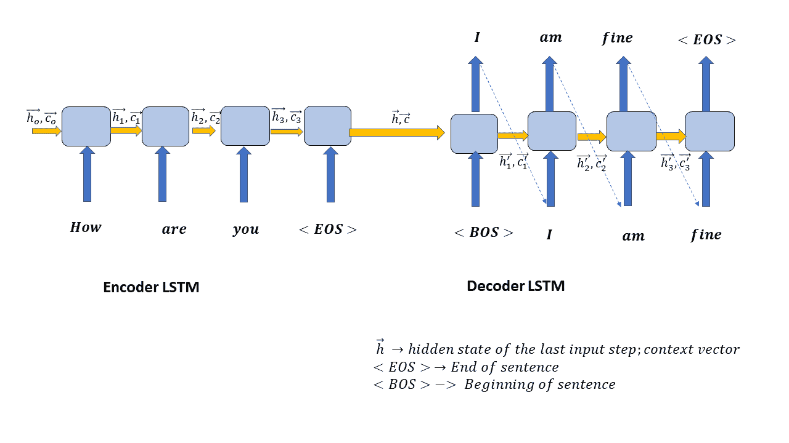
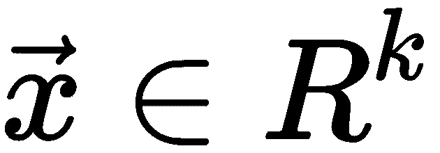
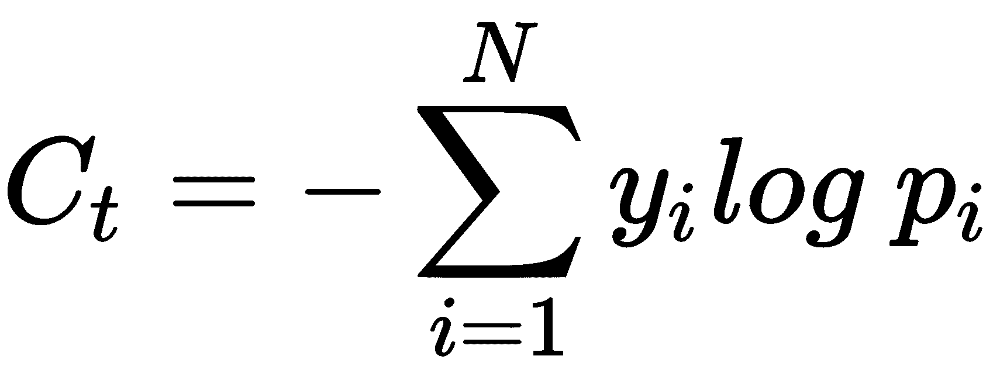
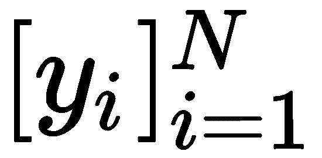

# 面向客户服务的对话式人工智能聊天程序

会话聊天机器人最近产生了大量的炒作，因为它们在增强客户体验方面的作用。现代企业已经开始在几个不同的过程中使用聊天机器人的功能。由于会话式人工智能被广泛接受，通过互联网填写表格或发送信息的繁琐任务变得更加简单。对话聊天机器人的一个期望品质是它应该能够在当前环境中响应用户请求。对话聊天机器人系统中的玩家分别是用户和机器人。使用对话聊天机器人有很多优点，如下表所示:

*   **个性化协助**:为所有客户创造个性化体验可能是一项繁琐的任务，但不这样做可能会让企业遭受损失。对话聊天机器人是为每一位顾客提供个性化体验的便捷选择。
*   **全天候支持** : 全天候使用客服代表费用昂贵。在非办公时间使用 chatbots 进行客户服务，无需雇佣额外的客户代表。
*   **回答的一致性**:聊天机器人提供的回答可能是一致的，而不同的客户服务代表对相同问题的回答可能会有所不同。这样，如果客户对客户服务代表提供的答案不满意，就无需多次致电。
*   **耐心**:虽然客服代表在接待客户时可能会失去耐心，但这对于聊天机器人来说是不可能的。
*   **查询记录** : 聊天机器人查询记录的效率比人类客服代表要高得多。

聊天机器人不是最近才出现的东西，它的起源可以追溯到 20 世纪 50 年代。就在第二次世界大战之后，艾伦·图灵开发了**图灵测试**来观察一个人是否能区分人和机器。多年后的 1966 年，约瑟夫·韦森鲍姆开发了一些名为*伊莱扎*的软件，该软件模仿了一位心理治疗师的语言。工具仍可位于[http://psych.fullerton.edu/mbirnbaum/psych101/Eliza.htm](http://psych.fullerton.edu/mbirnbaum/psych101/Eliza.htm)。

聊天机器人可以执行各种各样的任务，下面的列表显示了其中一些任务，以强调它们的多功能性:

*   回答关于产品的问题
*   向客户提供建议
*   执行句子完成活动
*   对话聊天机器人
*   与客户谈判价格并参与投标

很多时候，企业很难弄清楚他们是否需要聊天机器人。企业是否需要聊天机器人可以通过*图 8.1* 中的流程图来确定:


Figure 8.1: Customer engagement model

作为本章的一部分，我们将涵盖以下主题:

*   Chatbot 架构
*   聊天机器人的 LSTM 序列对序列模型
*   为推特支持的聊天机器人建立一个序列到序列的模型

# 技术要求

您将需要具备 Python 3、TensorFlow 和 Keras 的基本知识

本章代码文件可在 GitHub:
[https://GitHub . com/PacktPublishing/Intelligent-Projects-use-Python/tree/master/chapter 08](https://github.com/PacktPublishing/Intelligent-Projects-using-Python/tree/master/Chapter08)上找到

查看以下视频，查看正在运行的代码:
[http://bit.ly/2G9AyoB](http://bit.ly/2G9AyoB)

# Chatbot 架构

chatbot 的核心组件是它的自然语言处理框架。聊天机器人通过一个通常被称为**解析**的过程，用自然语言处理呈现给它们的数据。解析后的用户输入随后被解释，并且根据用户想要的内容将适当的响应发送回用户，如从输入中解密的那样。chatbot 可能需要从知识库和历史交易数据存储中寻求帮助，以适当地处理用户的请求。

聊天机器人可以大致分为以下两类:

*   **基于检索的模型**:这些模型通常依赖于查找表或知识库从预定义的一组答案中选择一个答案。虽然这种方法看起来很幼稚，但生产中的大多数聊天机器人都是这种类型的。当然，在从查找表或知识库中选择最佳答案方面，可以有不同的复杂程度。
*   **生成模型** : 生成模型动态生成响应，而不是采用基于查找的方法。它们大多是概率模型或基于机器学习的模型。直到最近，马尔可夫链大多被用作生成模型；然而，随着最近深度学习的成功，基于递归神经网络的方法得到了普及。一般来说，LSTM 版本的 RNNs 被用作聊天机器人的生成模型，因为它更擅长处理长序列。

基于检索的模型和生成模型都有各自的优缺点。由于基于检索的模型从一组固定的答案中回答，它们不能处理看不见的问题或没有适当的预定义响应的请求。生成模型更加复杂；他们可以理解用户输入中的实体，并生成类似人类的响应。然而，它们更难训练，并且通常需要更多的数据来训练。他们也容易犯语法错误，这是基于检索的模型所不能犯的。

# 使用 LSTM 的序列到序列模型

序列到序列模型架构非常适合捕获客户输入的上下文，然后基于此生成适当的响应。*图 8.2* 显示了一个序列到序列的模型框架，它可以像聊天机器人一样回答问题:



Figure 8.2: Sequence-to-sequence model using an LSTM

从上图(*图 8.2* )我们可以看到，**编码器 LSTM** 将输入的单词序列编码成隐藏状态向量，和细胞状态向量。向量和是 LSTM 编码器最后一步的隐藏和单元状态。它们将基本上捕捉整个输入句子的上下文。

和形式的编码信息随后被馈送到**解码器 LSTM** 作为其初始隐藏和单元状态。每一步中的**解码器 LSTM** 试图根据当前单词预测下一个单词。这意味着，**解码器 LSTM** 每一步的输入都是当前字。

为了预测第一个单词，LSTM 将被提供一个虚拟的开始关键字 **< BOS >** ，它代表句子的开始。同样的， **< EOS >** dummy 关键字代表句子的结尾，一旦预测到这一点，输出生成就应该停止。

在为每个目标单词训练序列到序列模型的过程中，我们先验地知道*是输入到**解码器 LSTM** 的前一个单词。然而，在推断过程中，我们不会有这些目标词，因此我们必须将前一步作为输入。*

 *# 构建序列对序列模型

我们将用于构建聊天机器人的序列到序列模型的架构将对先前在*图 8.2 中说明的基本序列到序列架构进行轻微修改。*修改后的架构如下图所示(*图 8.3* ):


Figure 8.3: Sequence-to-sequence model 

不是将编码器最后一步的隐藏状态和单元状态馈送到**解码器 LSTM** 的初始隐藏和单元状态，而是在解码器的每个输入步骤馈送隐藏状态。要在任意一步 *t* 预测目标词*w<sub>t</sub>T8】，输入为前一个目标词， *w <sub> t-1 </sub>* ，任意一步， *t-1* ，隐藏状态。*

# 推特上的客户支持

现在我们已经对如何使用递归神经网络构建聊天机器人有了一些想法，我们将使用 20 个大品牌对客户发布的推文的客户服务响应来构建聊天机器人。数据集`twcs.zip`可位于[https://www . kaggle . com/thought vector/customer-support-on-Twitter](https://www.kaggle.com/thoughtvector/customer-support-on-twitter)***。*** 每条推文由`tweet_id`标识，推文内容在`text`字段。客户发布的推文可以通过`in_response_to_tweet_id`字段识别。这应该包含客户推文的空值。对于客户服务推文，此`in_response_to_tweet_id` 字段应指向此推文指向的客户`tweet_id`。

# 为训练聊天机器人创建数据

要提取客户发布的所有入站推文，我们需要提取所有`in_response_to_tweet_id` 字段为`null`的推文。包含客服代表回复的出站文件可以通过推文过滤提取，其中`in_response_to_tweet_id` 字段不为空。一旦我们有了入站和出站文件，我们需要将它们合并在入站文件的`tweet_id`和出站文件的`in_response_to_tweet_id` 上。这将为我们提供客户在中的*推文和客户服务代表在*中的*推文作为回应。数据创建功能可以编码如下:*

```py
    def process_data(self,path):
        data = pd.read_csv(path)

       if self.mode == 'train':
            data = pd.read_csv(path)
            data['in_response_to_tweet_id'].fillna(-12345,inplace=True)
            tweets_in =  data[data['in_response_to_tweet_id'] == -12345]
            tweets_in_out = 
            tweets_in.merge(data,left_on=['tweet_id'],right_on=
            ['in_response_to_tweet_id'])
            return tweets_in_out[:self.num_train_records]
        elif self.mode == 'inference':
            return data

```

# 将文本标记为单词索引

这些推文需要被标记化并转换成数字，然后才能输入神经网络。**计数向量器**用于确定构成聊天机器人词汇空间的固定数量的频繁单词。我们还引入了三个新的标记，分别表示一个句子的开始`(START)`、一个句子的结束(`PAD`)以及任何未知的单词(`UNK`)。此处显示了标记推文的功能，以供参考:

```py
    def tokenize_text(self,in_text,out_text):
        count_vectorizer = CountVectorizer(tokenizer=casual_tokenize, max_features=self.max_vocab_size - 3)
        count_vectorizer.fit(in_text + out_text)
        self.analyzer = count_vectorizer.build_analyzer()
        self.vocabulary = 
        {key_: value_ + 3 for key_,value_ in count_vectorizer.vocabulary_.items()}
        self.vocabulary['UNK'] = self.UNK
        self.vocabulary['PAD'] = self.PAD
        self.vocabulary['START'] = self.START
        self.reverse_vocabulary = 
        {value_: key_ for key_, value_ in self.vocabulary.items()}
        joblib.dump(self.vocabulary,self.outpath + 'vocabulary.pkl')
        joblib.dump(self.reverse_vocabulary,self.outpath + 'reverse_vocabulary.pkl')
        joblib.dump(count_vectorizer,self.outpath + 'count_vectorizer.pkl')
        #pickle.dump(self.count_vectorizer,open(self.outpath + 
        'count_vectorizer.pkl',"wb"))
```

现在，需要将标记化的单词转换为单词索引，以便它们可以被馈送到递归神经网络，如以下代码所示:

```py
def words_to_indices(self,sent):
        word_indices = 
       [self.vocabulary.get(token,self.UNK) for token in self.analyzer(sent)] + 
        [self.PAD]*self.max_seq_len
        word_indices = word_indices[:self.max_seq_len]
        return word_indices
```

我们还希望将递归神经网络预测的单词索引转换成单词以形成句子。该功能可以编码如下:

```py
 def indices_to_words(self,indices):
        return ' '.join(self.reverse_vocabulary[id] for id in indices if id != self.PAD).strip() 

```

# 替换匿名屏幕名称

在我们对推文进行标记化之前，将推文中匿名化的屏幕名称替换为通用名称可能是值得的，这样响应会更好地概括。该功能可以编码如下:

```py
    def replace_anonymized_names(self,data):

        def replace_name(match):
            cname = match.group(2).lower()
            if not cname.isnumeric():
                return match.group(1) + match.group(2)
            return '@__cname__'

        re_pattern = re.compile('(\W@|^@)([a-zA-Z0-9_]+)')
        if self.mode == 'train':

            in_text = data['text_x'].apply(lambda txt:re_pattern.sub(replace_name,txt))
            out_text = data['text_y'].apply(lambda 
            txt:re_pattern.sub(replace_name,txt))
            return list(in_text.values),list(out_text.values)
        else:
            return map(lambda x:re_pattern.sub(replace_name,x),data)

```

# 定义模型

RNN 的 LSTM 版本被用来建立序列到序列模型。这是因为 LSTMs 在记忆长文本序列中的长期依赖关系方面要高效得多。LSTM 架构中的三个门使它能够有效地记住长期序列。一个基本的 RNN 无法记住长期的依赖关系，因为与其架构相关的渐变问题正在消失。

在这个模型中，我们使用了两个 LSTMs。第一个 LSTM 将把输入的推文编码成一个上下文向量。这个上下文向量只不过是编码器 LSTM 的最后一个隐藏状态， *n* 是隐藏状态向量的维数。输入的推文作为单词索引序列输入到编码器 LSTM，其中 *k* 是输入推文的序列长度。在输入 LSTM 之前，这些单词索引被映射到单词嵌入。单词嵌入被封装在嵌入矩阵中， *[W ∈ R <sup>m x N</sup> ，*其中 *N* 表示词汇中单词的数量。

第二个 LSTM 作为解码器工作。它试图将编码器 LSTM 创建的上下文向量解码成有意义的响应。作为该方法的一部分，我们在每个时间步长将上下文向量与前一个单词一起馈送，以生成当前单词。在第一个时间步骤中，我们没有任何先前的单词来限制 LSTM，因此我们使用代理`START`单词来开始从解码器 LSTM 生成单词序列的过程。在推理过程中，我们如何在当前时间步长输入前一个单词不同于我们在训练过程中使用的方法。在训练中，既然我们知道了前面的单词*先验的*，那么在每一个时间步，我们相应的喂养它们没有任何问题。然而，在推断过程中，由于我们在当前时间步长没有实际的前一个单词，所以前一个时间步长的预测单词被馈送。在最终的大软最大值 *N* 之前，每个时间步长 *t* 的隐藏状态通过几个完全连接的层传送。在这个 softmax 层中获得最大概率的单词是时间步长的预测单词。该字然后被馈送到下一步骤的输入端，即解码器 LSTM 的步骤 *t + 1* 。

Keras 中的`TimeDistributed`函数允许在解码器 LSTM 的每个时间步长有效实现预测，如以下代码所示:

```py
    def define_model(self):

        # Embedding Layer
        embedding = Embedding(
            output_dim=self.embedding_dim,
            input_dim=self.max_vocab_size,
            input_length=self.max_seq_len,
            name='embedding',
        )

        # Encoder input

        encoder_input = Input(
            shape=(self.max_seq_len,),
            dtype='int32',
            name='encoder_input',
        )

        embedded_input = embedding(encoder_input)

        encoder_rnn = LSTM(
            self.hidden_state_dim,
            name='encoder',
            dropout=self.dropout
        )
        # Context is repeated to the max sequence length so that the same context 
        # can be feed at each step of decoder
        context = RepeatVector(self.max_seq_len)(encoder_rnn(embedded_input))

        # Decoder    
        last_word_input = Input(
            shape=(self.max_seq_len,),
            dtype='int32',
            name='last_word_input',
        )

        embedded_last_word = embedding(last_word_input)
        # Combines the context produced by the encoder and the last word uttered as 
        inputs
        # to the decoder.

        decoder_input = concatenate([embedded_last_word, context],axis=2)

        # return_sequences causes LSTM to produce one output per timestep instead of 
        one at the
        # end of the intput, which is important for sequence producing models.
        decoder_rnn = LSTM(
            self.hidden_state_dim,
            name='decoder',
            return_sequences=True,
            dropout=self.dropout
        )

        decoder_output = decoder_rnn(decoder_input)

        # TimeDistributed allows the dense layer to be applied to each decoder output    
       per timestep
        next_word_dense = TimeDistributed(
            Dense(int(self.max_vocab_size/20),activation='relu'),
            name='next_word_dense',
        )(decoder_output)

        next_word = TimeDistributed(
            Dense(self.max_vocab_size,activation='softmax'),
            name='next_word_softmax'
        )(next_word_dense)

        return Model(inputs=[encoder_input,last_word_input], outputs=[next_word])

```

# 用于训练模型的损失函数

该模型基于分类交叉熵损失进行训练，以预测解码器 LSTM 的每个时间步长中的目标词。任何步骤中的分类交叉熵损失都将超过词汇表中的所有单词，可以表示如下:



标签代表目标单词的一个热编码版本。只有与实际单词对应的标签才会是*一*；剩下的将是*零点*。术语 *Pi* 表示实际目标单词是由 *i* 索引的单词的概率。为了获得总损失， *C* ，对于每个输入/输出推文对，我们需要总结解码器 LSTM 的所有时间步长上的损失。由于词汇表的大小可能会变得非常大，因此在每个时间步骤中为目标标签创建一个热编码向量将会非常昂贵。`sparse_categorical_crossentropy`的丢失在这里变得非常有益，因为我们不需要将目标单词转换成一个热编码的向量，而是可以将目标单词的索引作为目标标签。

# 训练模型

模型可以用 Adam 优化器训练，因为它可靠地提供了稳定的收敛性。由于 rnn 容易出现爆炸式的梯度问题(尽管这对于 LSTMs 来说问题不大)，如果梯度变得太大，最好对其进行裁剪。给定的模型可以用 Adam 优化器和`sparse_categorical_crossentropy`来定义和编译，如下面的代码块所示:

```py
    def create_model(self):
        _model_ = self.define_model()
        adam = Adam(lr=self.learning_rate,clipvalue=5.0)
        _model_.compile(optimizer=adam,loss='sparse_categorical_crossentropy')
        return _model_
```

现在我们已经了解了所有的基本功能，训练功能可以编码如下:

```py
def train_model(self,model,X_train,X_test,y_train,y_test):
        input_y_train = self.include_start_token(y_train)
        print(input_y_train.shape)
        input_y_test = self.include_start_token(y_test)
        print(input_y_test.shape)
        early = EarlyStopping(monitor='val_loss',patience=10,mode='auto')

        checkpoint = 
        ModelCheckpoint(self.outpath + 's2s_model_' + str(self.version) + 
        '_.h5',monitor='val_loss',verbose=1,save_best_only=True,mode='auto')
        lr_reduce =
        ReduceLROnPlateau(monitor='val_loss',factor=0.5, patience=2, verbose=0, 
         mode='auto')
        model.fit([X_train,input_y_train],y_train, 
              epochs=self.epochs,
              batch_size=self.batch_size, 
              validation_data=[[X_test,input_y_test],y_test], 
              callbacks=[early,checkpoint,lr_reduce], 
              shuffle=True)
        return model

```

在`train_model`函数的开始，我们创建`input_y_train`和`input_y_test`，它们分别是`y_train`和`y_test`的副本，并且从它们偏移一个时间步长，以便它们可以在解码器的每个时间步长充当前一个单词的输入。这些移位序列的第一个字是在解码器 LSTM 的第一时间步馈送的`START`关键字。`include_start_token`自定义实用功能如下:

```py
def include_start_token(self,Y):
    print(Y.shape)
    Y = Y.reshape((Y.shape[0],Y.shape[1]))
    Y = np.hstack((self.START*np.ones((Y.shape[0],1)),Y[:, :-1]))
    return Y
```

回到训练功能`train_model`，我们看到如果损失在`10`时期没有减少，则使用`EarlyStopping`回拨功能启用提前停止。类似地，`ReduceLROnPlateau`回调会将现有的学习率减少一半(`0.5`)，如果错误在两个时期内没有减少的话。只要误差在一个时期内减小，就通过`ModelCheckpoint`回调保存模型。

# 从模型生成输出响应

一旦模型被训练好，我们想用它来生成给定输入推文的响应。在以下步骤中也可以这样做:

1.  用通用名称替换输入推文中的匿名屏幕名称。
2.  将修改后的输入推文转换为单词索引。
3.  将单词索引馈送到编码器 LSTM，将`START`关键字馈送到解码器 LSTM，以生成第一个预测单词。从下一步开始，输入前一时间步的预测单词，而不是`START`关键字。
4.  继续这样做，直到预测到句尾关键字。我们已经用`PAD`表示了这一点。
5.  查看逆词汇词典，从预测单词索引中获取单词。

下面的代码说明了`respond_to_input`功能，该功能可以在给定输入推文的情况下生成输出序列，以供参考:

```py
def respond_to_input(self,model,input_sent):
        input_y = self.include_start_token(self.PAD * np.ones((1,self.max_seq_len)))
        ids = np.array(self.words_to_indices(input_sent)).reshape((1,self.max_seq_len))
        for pos in range(self.max_seq_len -1):
            pred = model.predict([ids, input_y]).argmax(axis=2)[0]
            #pred = model.predict([ids, input_y])[0]
            input_y[:,pos + 1] = pred[pos]
        return self.indices_to_words(model.predict([ids,input_y]).argmax(axis=2)[0])

```

# 把它们放在一起

综上所述，`main`函数可以定义为有两个流程:一个用于训练，另一个用于推理。即使在训练函数中，我们也会对输入的推文序列生成一些响应，以检查我们训练模型的效果。以下代码显示了`main`功能供参考:

```py
    def main(self):
        if self.mode == 'train':

            X_train, X_test, y_train, y_test,test_sentences = self.data_creation()
            print(X_train.shape,y_train.shape,X_test.shape,y_test.shape)
            print('Data Creation completed')
            model = self.create_model()
            print("Model creation completed")
            model = self.train_model(model,X_train,X_test,y_train,y_test)
            test_responses = self.generate_response(model,test_sentences)
            print(test_sentences)  
            print(test_responses)
            pd.DataFrame(test_responses).to_csv(self.outpath + 
            'output_response.csv',index=False)

        elif self.mode == 'inference':

            model = load_model(self.load_model_from)
            self.vocabulary = joblib.load(self.vocabulary_path)
            self.reverse_vocabulary = joblib.load(self.reverse_vocabulary_path)
            #nalyzer_file = open(self.analyzer_path,"rb")
            count_vectorizer = joblib.load(self.count_vectorizer_path)
            self.analyzer = count_vectorizer.build_analyzer()
            data = self.process_data(self.data_path)
            col = data.columns.tolist()[0]
            test_sentences = list(data[col].values)
            test_sentences = self.replace_anonymized_names(test_sentences)
            responses = self.generate_response(model,test_sentences)
            print(responses)
            responses.to_csv(self.outpath + 'responses_' + str(self.version) + 
            '_.csv',index=False)
```

# 调用培训

可以通过运行带有多个参数的`chatbot.py`(参见本项目 GitHub 中的代码)模块来调用培训，如下命令所示:

```py
python chatbot.py --max_vocab_size 50000 --max_seq_len 30 --embedding_dim 100 --hidden_state_dim 100 --epochs 80 --batch_size 128 --learning_rate 1e-4 --data_path /home/santanu/chatbot/data/twcs.csv --outpath /home/santanu/chatbot/ --dropout 0.3 --mode train --num_train_records 50000 --version v1
```

以下是一些重要的参数，以及它们的描述和用于调用 chatbot 序列到序列模型的训练的值:

| **参数** | **描述** | **用于训练的数值** |
| `max_vocab_size` | 要纳入词汇的单词数 | `50,000` |
| `max_seq_len` | 推特的最大长度将被限制为喂给 LSTM | `30` |
| `hidden_state_dim` | 隐藏状态维度的 LSTM | `100` |
| `embedding_dim` | 单词嵌入的维度 | `100` |
| `learning rate` | 用于优化器的起始学习速率 | `0.0001` |
| `dropout` | 用于正规化目的的辍学 | `0.3` |
| `Mode` | 训练/推理 | 训练使用`train`推理使用`inference` |

# 对一些输入推文的推断结果

训练后的序列到序列模型响应一些输入的推文生成一些相关的推文。以下命令显示了示例推理命令。`data_path`参数包含测试输入推文的位置:

```py
python chatbot.py --max_vocab_size 50000 --max_seq_len 30 --embedding_dim 100 --hidden_state_dim 100  --data_path /home/santanu/chatbot/data/test.csv --outpath /home/santanu/chatbot/ --dropout 0.3 --mode inference --version v1 --load_model_from /home/santanu/chatbot/s2s_model_v1_.h5  --vocabulary_path /home/santanu/chatbot/vocabulary.pkl --reverse_vocabulary_path /home/santanu/chatbot/reverse_vocabulary.pkl --count_vectorizer_path /home/santanu/chatbot/count_vectorizer.pkl
```

推断的结果如下表所示:

| **在**发推 | **发微博** |
| `@sprintcare`是最差的客服。 | 嘿，你好！你能告诉我们你账户的电子邮件地址吗？我们去后台看看`/`dn[https://t.co/ldfdzrinat](https://t.co/ldfdzrinat)。 |
| 你们都谎称自己和 T2 有很好的关系。5 条 LTE，还是不会加载什么东西。Smh。 | `@__cname__`对于给您带来的麻烦，我们深表歉意。请给我们发送一封包含您的电子邮件地址的 dm，以便我们连接。 |
| `@__cname__`每当我联系客户支持时，他们都会告诉我我的帐户启用了短码，但在这 4 年中，我从未尝试过[https://t.co/0G98RtNxPK](https://t.co/0G98RtNxPK)。 | `@__cname__`你好，听到这个消息我们很难过。请给我们发一封包含您的电子邮件地址和电话号码的 dm，这样我们就可以对此进行调查。 |
| 其实那是你发给我的一个断掉的链接和不正确的信息[https://t.co/V4yfrHR8VI](https://t.co/V4yfrHR8VI)。 | `@__cname__`嗨，听到这个消息我们很难过。请告诉我们你的联系方式，我们很乐意帮忙。千开 |
| 哟`@Ask_Spectrum`，你的客户服务代表是超级好的——但是如果你们没有得到我的服务，我就开始走神了！ | `@__cname__`对于给您带来的麻烦，我们深表歉意。请给我们发送一封包含您的电子邮件地址的 dm，以便我们连接。 |
| 我的照片几乎每天都在`@Ask_Spectrum`上。我为什么要每月支付 171 美元？[https://t.co/U6ptkQa5Ik](https://t.co/U6ptkQa5Ik)。 | `@__cname__`嗨，听到这个消息我们很难过。请告诉我们你的联系方式，我们很乐意帮忙。千开 |
| 请从`@VerizonSupport`来的人帮助我，我在你们的客户服务方面运气最差。 | `@__cname__`对于给您带来的麻烦，我们深表歉意。请告诉我们您的联系方式和电话号码，以便我们提供帮助。 |
| `@VerizonSupport`我的朋友没有互联网，我们需要一起玩电子游戏，请不要有互联网，我们的技能每时每刻都在下降。 | 嘿，你好！你能告诉我们你账户的电子邮件地址吗？我们去后台看看`/`dn[https://t.co/ldfdzrinat](https://t.co/ldfdzrinat) |
| `@__cname__`试图支付 60 天的账单。没有服务，粗鲁的 CS，和几次转移。查一下我的设备#给我一个账号#！ | `@__cname__`嗨，听到这个消息我们很难过。请告诉我们你的联系方式，我们很乐意帮忙。千开 |
| `@__cname__`是我遇到过最差的 ISP。 | 嘿，你好！你能告诉我们你账户的电子邮件地址吗？我们去后台看看`/`dn[https://t.co/ldfdzrinat](https://t.co/ldfdzrinat) |
| `@__cname__`修复你的应用程序，它甚至不会打开。 | 你好！我们没有关于这个问题的任何信息。请寄给我们一份 dm，上面有您的姓名和电话号码以及完整的服务地址。 |

# 摘要

现在，我们到了这一章的结尾。在浏览了本章中阐述的与 chatbot 和序列到序列模型相关的各种概念后，读者现在应该能够构建自己的 chat bot 实现，并以有趣的方式对其进行扩展。正如我们所知，序列到序列模型不仅适用于聊天机器人，还适用于一系列自然语言处理领域，如机器翻译。本章代码可在 GitHub 位置[https://GitHub . com/PacktPublishing/Python-人工智能-项目/树/主/第 08 章](https://github.com/PacktPublishing/Python-Artificial-Intelligence-Projects/tree/master/Chapter08)找到。

在下一章中，我们将使用强化学习来让赛车学会自己驾驶。我们期待您的参与。*