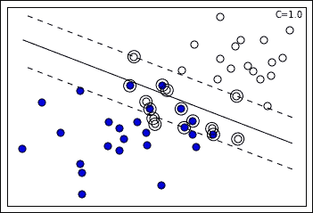
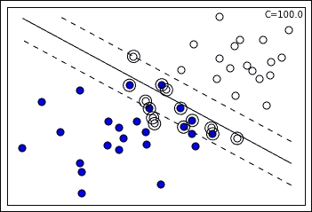
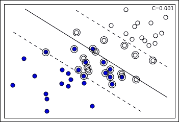
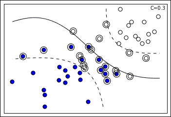
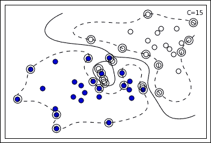
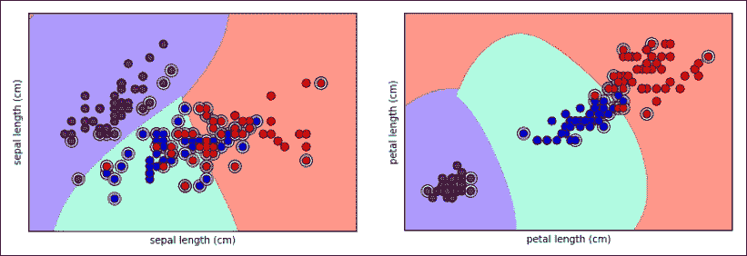

# 第三章。快速 SVM 实现

在前一章中已经试验过在线式学习，与批处理学习相比，您可能会对它的简单性、有效性和可扩展性感到惊讶。尽管一次只学习一个示例，但 SGD 可以很好地逼近结果，就好像所有数据都驻留在核心内存中，而您使用的是批处理算法一样。你所需要的是你的流确实是随机的(数据中没有趋势)，并且学习者很好地适应了问题(学习率通常是固定的关键参数)。

无论如何，仔细检查这些成就，结果仍然只是可与批量线性模型相比，但不能与更复杂的学习者相比，这些学习者的特征是方差高于偏差，例如支持向量机、神经网络或决策树的打包和增强集成。

对于某些问题，如高而宽但稀疏的数据，根据观察，只有线性组合可能就足够了，因为具有更多数据的简单算法往往胜过在更少数据上训练的更复杂的算法。然而，即使使用线性模型，并通过将现有特征显式映射到更高维度的特征(使用不同顺序的交互、多项式展开和核近似)，我们也可以加速和改进响应和特征之间复杂非线性关系的学习。

因此，在这一章中，我们将首先介绍线性支持向量机，作为线性模型的机器学习算法的替代，由不同的方法来解决从数据中学习的问题。然后，我们将演示如何从现有的特征中创建更丰富的特征，以便在面对大规模数据，尤其是高数据(即有许多案例可供学习的数据集)时，以更好的方式解决我们的机器学习任务。

总之，在本章中，我们将涵盖以下主题:

*   介绍支持向量机，并为您提供基本概念和数学公式，以了解它们的工作原理
*   提出具有铰链损失的 SGD 作为大规模任务的可行解决方案，该解决方案使用与批量 SVM 相同的优化方法
*   建议伴随 SGD 的非线性近似
*   提供除了 Scikit-learn 提供的 SGD 算法之外的其他大规模在线解决方案的概述

# 您自己要实验的数据集

与上一章一样，我们将使用来自 UCI 机器学习资源库的数据集，特别是自行车共享数据集(回归问题)和森林覆盖类型数据(多类分类问题)。

如果您以前没有这样做过，或者如果您需要再次下载这两个数据集，您将需要在*数据集中定义的几个函数来亲自尝试真实的东西[第 2 章](02.html "Chapter 2. Scalable Learning in Scikit-learn")、*Scikit 中的可扩展学习-学习*。需要的功能有`unzip_from_UCI` 和`gzip_from_UCI`。两者都有一个到 UCI 存储库的 Python 连接；下载一个压缩文件，并在 Python 工作目录下解压。如果您从 IPython 单元调用函数，您将在 IPython 查找它们的地方找到必要的新目录和文件。*

万一功能对你不起作用，没关系；我们将为您提供直接下载的链接。之后，您所要做的就是将当前工作 Python 目录中的数据解包，您可以通过在您的 Python 接口(IPython 或任何 IDE)上运行以下命令来发现该目录:

```py
In: import os
print "Current directory is: \"%s\"" % (os.getcwd())

Out: Current directory is: "C:\scisoft\WinPython-64bit-2.7.9.4\notebooks\Packt - Large Scale"
```

## 单车共享数据集

数据集由 CSV 格式的两个文件组成，包含 2011 年至 2012 年期间美国华盛顿首都自行车共享系统内每小时和每天租赁的自行车数量。提醒一下，这些数据包含租赁当天的相应天气和季节信息。

下面的代码片段将使用方便的`unzip_from_UCI`包装函数将数据集保存在本地硬盘上:

```py
In: UCI_url = 'https://archive.ics.uci.edu/ml/machine-learning-databases/00275/Bike-Sharing-Dataset.zip'
unzip_from_UCI(UCI_url, dest='bikesharing')

Out: Extracting in C:\scisoft\WinPython-64bit-2.7.9.4\notebooks\bikesharing
    unzipping day.csv
    unzipping hour.csv
```

如果成功运行，代码将指示 CSV 文件保存在哪个目录中，并打印两个解压缩文件的名称。如果不成功，只需从[https://archive . ics . UCI . edu/ml/machine-learning-databases/00275/Bike-Sharing-dataset . zip](https://archive.ics.uci.edu/ml/machine-learning-databases/00275/Bike-Sharing-Dataset.zip)下载该文件，并将两个文件`day.csv`和`hour.csv`解压缩到您之前在 Python 工作目录中创建的名为`bikesharing`的目录中。

## cover type 数据集

covertype 数据集由 Jock A. Blackard、Denis J. Dean 博士、Charles W. Anderson 博士和科罗拉多州立大学捐赠，包含 581，012 个示例和一系列 54 个制图变量，范围从海拔到土壤类型，预计能够预测森林覆盖类型，包括 7 种类型(因此这是一个多类问题)。为了确保与相同数据的学术研究的可比性，说明建议使用前 11，340 条记录进行培训，然后使用 3，780 条记录进行验证，最后使用剩余的 565，892 条记录作为测试示例:

```py
In: UCI_url = 'https://archive.ics.uci.edu/ml/machine-learning-databases/covtype/covtype.data.gz'
gzip_from_UCI(UCI_url)
```

如果在运行代码时出现问题，或者您更喜欢自己准备文件，只需前往 UCI 网站，从[https://archive . ics . UCI . edu/ml/机器学习-databases/covtype/covtype . data . gz](https://archive.ics.uci.edu/ml/machine-learning-databases/covtype/covtype.data.gz)下载数据集，并将其解包到 Python 当前正在处理的目录中。

# 支持向量机

**支持向量机** ( **支持向量机**)是一套用于分类和回归(也用于离群点检测)的监督学习技术，由于特殊函数——核函数的可用性，它可以适用于线性和非线性模型，因此非常通用。这种核函数的特点是能够使用有限的计算量将输入特征映射成新的、更复杂的特征向量。核函数非线性地重组原始特征，使得通过非常复杂的函数映射响应成为可能。从这个意义上说，支持向量机作为通用逼近器可以与神经网络相媲美，因此在许多问题中具有相似的预测能力。

与前一章中看到的线性模型相反，支持向量机最初是作为解决分类问题的一种方法，而不是回归问题。

支持向量机是由数学家弗拉基米尔·瓦普尼克和计算机科学家科琳娜·科尔特斯(但也有许多其他贡献者与瓦普尼克在算法上合作)于 90 年代在美国电话电报公司的实验室发明的。本质上，SVM 试图通过在特征空间中找到一个特定的分类超平面来解决分类问题。这种特定的超平面必须被表征为在类的边界之间具有最大的分隔边界的超平面(该边界旨在作为间隙，类本身之间的空间，没有任何示例)。

这种直觉意味着两个结果:

*   经验上，支持向量机试图通过在训练集中找到一个恰好在观察类中间的解来最小化测试误差，因此该解显然是计算性的(它是基于二次规划的优化—[https://en.wikipedia.org/wiki/Quadratic_programming](https://en.wikipedia.org/wiki/Quadratic_programming))。
*   由于解决方案仅基于相邻示例(称为支持向量)设置的类边界，因此可以忽略其他示例，这使得该技术对异常值不敏感，并且比基于矩阵求逆的方法(如线性模型)占用的内存更少。

给定这样一个算法的总体概述，我们将花费几页指出表征支持向量机的关键公式。尽管对该方法的完整而详细的解释超出了本书的范围，但概述它的工作原理确实有助于弄清楚该技术的幕后发生了什么，并为理解如何将其扩展到大数据提供了基础。

历史上，支持向量机被认为是硬边界分类器，就像感知器一样。事实上，最初设置支持向量机是为了寻找两个分离类的超平面，这两个超平面的倒易距离是最大可能的。这种方法对于线性可分离的合成数据非常有效。无论如何，在硬边界版本中，当 SVM 面对非线性可分离数据时，它只能使用特征的非线性变换来成功。然而，当错误分类错误是由于数据中的噪声而不是非线性时，它们总是被认为是失败的。

因此，通过考虑误差严重程度的成本函数引入了软裕度(因为硬裕度仅在发生误差时才进行跟踪)，从而允许对误差不太大的错误分类情况有一定的容限，因为它们位于分离超平面旁边。

自从引入软边界以来，支持向量机也能够承受噪声引起的不可分性。通过围绕一个松弛变量构建成本函数来引入软边际，该变量近似于错误分类示例的数量。这样的松弛变量也被称为经验风险(从训练数据的角度来看，做出错误分类的风险)。

在数学公式中，给定 n 个示例的矩阵数据集 *X* 和 *m* 特征以及根据`+1`(归属)和`-1`(不归属)表示属于一个类的响应向量，二进制分类 SVM 努力最小化以下成本函数:


在前面的函数中，w 是表示分离超平面和偏差 *b* 的系数向量，表示与原点的偏移。还有λ(`λ``>=0`)，是正则化参数。

为了更好地理解成本函数是如何工作的，有必要将其分为两部分。第一部分是正则项:


正则化项与向量 w 取高值时的最小化过程形成对比。第二项称为损失项或松弛变量，实际上是 SVM 最小化程序的核心:


损失项输出错误分类误差的近似值。事实上，总和将倾向于为每个分类误差增加一个单位值，其总和除以 n，即示例数，将提供分类误差的大致比例。

通常，如在 Scikit-learn 实现中，λ从正则化项中移除，并由错误分类参数 C 乘以损失项来代替:


前一个参数λ和新的 C 之间的关系如下:


这只是一个惯例问题，因为优化公式中从参数λ到 C 的变化并不意味着不同的结果。

损失项的影响由超参数 C 来调节。C 的高值会对错误施加高惩罚，从而迫使 SVM 尝试对所有训练示例进行正确分类。因此，较大的 C 值往往会迫使余量更紧，并考虑较少的支持向量。裕度的这种减小转化为偏差的增加和方差的减小。

这导致我们具体说明某些观察相对于其他观察的作用；事实上，我们将那些分类错误或分类不可信的例子定义为支持向量，因为它们在边界内(噪声观测使分类分离不可能)。只考虑这样的例子，优化是可能的，这使得 SVM 确实是一种内存高效的技术:



在前面的可视化中，可以注意到两组点(蓝色和白色)在两个特征维度上的投影。C 超参数设置为 1.0 的 SVM 解可以很容易地发现分隔线(在图中表示为连续线)，尽管两边都有一些错误分类的情况。此外，由于离分隔线更远的相应类别的支持向量，边界可以被可视化(由两条虚线定义)，是可识别的。在图表中，支持向量用一个外圆标记，你实际上可以注意到一些支持向量在边距之外；这是因为它们是错误分类的情况，SVM 必须出于优化目的跟踪它们，因为它们的误差在损失项中考虑:



随着 C 值的增加，由于 SVM 在优化过程中考虑的支持向量越来越少，余量趋于受限。因此，分隔线的斜率也会改变。

相反，较小的 C 值往往会放宽余量，从而增加方差。极小的 C 值甚至会导致 SVM 考虑边距内的所有示例点。当有许多嘈杂的例子时，较小的 C 值是理想的。这样的设置迫使 SVM 忽略了裕度定义中的许多错误分类的例子(误差的权重较小，因此在搜索最大裕度时它们被容忍得更多。):



继续前面的视觉示例，如果我们减少超参数 C，由于支持向量的数量增加，边界实际上会扩大。因此，保证金是不同的，SVM 解决了一个不同的分界线。在对数据进行测试之前，没有可以被认为是正确的 C 值；正确的值总是必须通过交叉验证凭经验找到。到目前为止，C 被认为是 SVM 中最重要的超参数，是在决定使用什么样的核函数后设置的。

相反，核函数通过以非线性方式组合原始特征，将它们映射到更高维的空间中。以这种方式，原始特征空间中明显不可分离的组可以在更高维的表示中变成可分离的。这样的投影不需要太复杂的计算，尽管当投影到高维度时，将原始特征值显式转换成新特征值的过程会产生特征数量的潜在爆炸。内核函数可以简单地插入到决策函数中，从而取代特征和系数向量之间的原始点积，获得与显式映射相同的优化结果，而不是进行如此繁琐的计算。(这样的封堵被称为内核绝招，因为它真的是数学绝招。)

标准核函数是线性函数(意味着没有变换)、多项式函数、**径向基函数** ( **径向基函数**)和 sigmoid 函数。为了提供一个想法，径向基函数可以表示如下:


基本上，径向基函数和其他内核只是将自己直接插入到之前看到的要最小化的函数的变体中。之前看到的优化函数被称为原始公式，而类似的表达式被称为对偶公式:


尽管在没有数学证明的情况下，从原始公式到对偶公式的转换相当具有挑战性，但重要的是要理解，给定一个通过对例子进行比较的核函数，核技巧只是一个关于它可以展开的无限维特征空间的有限数量计算的问题。这种核心技巧使得该算法对于诸如图像识别或文本分类等相当复杂的问题特别有效(可与神经网络相比):



例如，由于 sigmoid 核，前面的SVM 解是可能的，而下面的是由于径向基函数核:



从视觉上看，径向基函数内核允许对边界进行非常复杂的定义，甚至将其分成多个部分(在前面的例子中，一个飞地是显而易见的)。

径向基函数核的公式如下:


伽马是一个你可以先验定义的超参数。核变换在支持向量周围创建某种分类气泡，从而允许通过合并气泡本身来定义非常复杂的边界形状。

乙状结肠仁的配方如下:


这里，除了γ，还应该选择 r 以获得最佳结果。

显然，基于 sigmoid、RBF 和多项式的解决方案，(是的，它隐式地进行了多项式展开，我们将在下面的段落中讨论。)内核呈现出比估计偏差更多的方差，因此在决定采用它们时需要严格的验证。尽管 SVM 对过度适应有抵抗力，但它肯定不能幸免。

支持向量回归与支持向量分类有关。它仅因符号(更类似于线性回归，使用β而不是系数向量 w)和损失函数而异:


值得注意的是，唯一显著的区别是损失函数 L-ε，如果示例在距离回归超平面一定距离ε内，则损失函数 L-ε对误差不敏感(因此不计算误差)。这种成本函数的最小化优化了回归问题的结果，输出值而不是类。

## 铰链损失及其变体

作为对 SVM 内部螺母和螺栓的总结，请记住算法核心的成本函数是铰链损耗:


如前所述， *ŷ* 表示为 *X* 和系数向量 *w* 的点积与偏差 *b* 之和:


这让人想起*感知器*，这样的损失函数线性地惩罚误差，表示当例子被分类在边缘的错误侧时的误差，与它与边缘本身的距离成比例。虽然是凸的，但缺点是不能处处可微，它有时被总是可微的变量所代替，例如平方铰链损耗(也称为 L2 损耗，而 L1 损耗是铰链损耗):


另一个变型是休伯损失，当误差等于或低于某个阈值 h 时，它是二次函数，否则是线性函数。这种方法混合了基于误差的铰链损失的 L1 和 L2 变体，并且它是一种非常抗异常值的替代方案，因为较大的误差值不平方，因此需要学习 SVM 较少的调整。Huber 损失也是对数损失(线性模型)的一种替代方法，因为它计算速度更快，并且能够提供类别概率的估计(铰链损失不具有这种能力)。

从实践的角度来看，没有特别的报告表明胡贝尔损失或 L2 铰链损失可以始终比铰链损失表现得更好。最后，成本函数的选择可以归结为针对每个不同的学习问题测试可用的函数。(根据无免费午餐定理的原理，在机器学习中没有适合所有问题的解。)

## 了解 Scikit-学习 SVM 实施

Scikit-learn 提供了 SVM 的一个实现使用两个 C++库(带有一个 C API 来与其他语言接口)，一个支持向量机库 ( **LIBSVM** )用于 SVM 分类和回归([http://www.csie.ntu.edu.tw/~cjlin/libsvm/](http://www.csie.ntu.edu.tw/~cjlin/libsvm/))和 LIBLINEAR 用于在大型稀疏数据集上使用线性方法分类问题([http://www.csie.ntu.edu.tw/~cjlin/liblinear/](http://www.csie.ntu.edu.tw/~cjlin/liblinear/))。这两个库都可以自由使用，计算速度非常快，并且已经在许多其他解决方案中进行了测试，`sklearn.svm`模块中的所有 Scikit-learn 实现都依赖于其中的一个，`Perceptron`和`LogisticRegression`类也顺便使用了它们。)让 Python 只是一个方便的包装器。

另一方面，`SGDClassifier`和`SGDRegressor`使用不同的实现，因为 LIBSVM 和 LIBLINEAR 都没有在线实现，都是批处理学习工具。事实上，在操作时，当通过`cache_size`参数为内核操作分配合适的内存时，LIBSVM 和 LIBLINEAR 的性能都是最好的。

分类的实现如下:

<colgroup><col style="text-align: left"> <col style="text-align: left"> <col style="text-align: left"></colgroup> 
| 

班级

 | 

目的

 | 

超参数

 |
| --- | --- | --- |
| `sklearn.svm.SVC` | 二类和多类线性和核分类的 LIBSVM 实现 | c，核，度，γ |
| `sklearn.svm.NuSVC` | 同上 | 核，度，γ |
| `sklearn.svm.OneClassSVM` | 异常值的无监督检测 | 核，度，γ |
| `sklearn.svm.LinearSVC` | 它基于 LIBLINEAR，是一个二元多类线性分类器 | 罚金，损失，C |

关于回归，解决方案如下:

<colgroup><col style="text-align: left"> <col style="text-align: left"> <col style="text-align: left"></colgroup> 
| 

班级

 | 

目的

 | 

超参数

 |
| --- | --- | --- |
| `sklearn.svm.SVR` | 回归的 LIBSVM 实现 | c，核，度，γ，ε |
| `sklearn.svm.NuSVR` | 同上 | 核，度，γ |

如您所见，每个版本都有相当多的超参数需要调整，使用 Scikit-learn 中`grid_search`模块的`GridSearchCV`，当使用默认参数时，SVMs 是很好的学习者，当通过交叉验证进行适当调整时，SVMs 是很好的学习者。

作为一条黄金法则，有些参数对结果的影响更大，因此应事先确定，其他参数则取决于它们的值。根据这样的经验法则，你必须正确设置以下参数(按重要程度排序):

*   `C`:这个就是我们之前讨论过的罚值。减小它会使余量变大，从而忽略更多的噪声，但也会增加计算量。最佳值通常可以在`np.logspace(-3, 3, 7)`范围内找到。
*   `kernel`:这是非线性老黄牛，因为一个 SVM 可以设置为`linear`、`poly`、`rbf`、`sigmoid`，或者自定义内核(针对专家！).广泛使用的当然是`rbf`。
*   `degree`:这个和`kernel='poly'`一起工作，表示多项式展开的维度。它被其他内核忽略。通常，2-5 的值效果最好。
*   `gamma`:这是`'rbf'`、`'poly'`、`'sigmoid'`的系数；较高的值倾向于以更好的方式拟合数据。建议的网格搜索范围是`np.logspace(-3, 3, 7)`。
*   `nu`:这是用`nuSVR``nuSVC`进行回归分类；此参数近似于未按置信度分类的训练点、错误分类的点以及边缘内部或边缘上的正确点。它应该是一个在[0，1]范围内的数字，因为它是相对于您的训练集的一个比例。最后，它作为高比例的 C 扩大了利润。
*   `epsilon`:这个参数通过定义一个ε大范围来指定一个支持向量回归机将接受多少误差，在这个范围内，相对于点的真实值没有损失。建议搜索范围为`np.insert(np.logspace(-4, 2, 7),0,[0])`。
*   `penalty`、`loss`和`dual`:对于线性 SVC，这些参数接受`('l1','squared_hinge',False)`、`('l2','hinge',True)`、`('l2','squared_hinge',True)`和`('l2','squared_hinge',False)`组合。`('l2','hinge',True)`组合相当于`SVC(kernel='linear')`学习者。

作为使用来自 Scikit-learn 的`sklearn.svm`模块的 SVC 和 SVR 进行基本分类和回归的示例，我们将使用 Iris 和 Boston 数据集，这是两个流行的玩具数据集([http://scikit-learn.org/stable/datasets/](http://scikit-learn.org/stable/datasets/))。

首先，我们将加载 Iris 数据集:

```py
In: from sklearn import datasets
iris = datasets.load_iris()
X_i, y_i = iris.data, iris.target
```

然后，我们将用径向基函数核拟合一个支持向量机(根据 Scikit-learn 中的其他已知示例选择了 C 和γ)，并使用`cross_val_score`函数测试结果:

```py
from sklearn.svm import SVC
from sklearn.cross_validation import cross_val_score
import numpy as np
h_class = SVC(kernel='rbf', C=1.0, gamma=0.7, random_state=101)
scores = cross_val_score(h_class, X_i, y_i, cv=20, scoring='accuracy')
print 'Accuracy: %0.3f' % np.mean(scores)

Output: Accuracy: 0.969
```

拟合模型可以为您提供一个索引，指出您的训练示例中有哪些支持向量:

```py
In: h_class.fit(X_i,y_i)
print h_class.support_

Out: [ 13  14  15  22  24  41  44  50  52  56  60  62  63  66  68  70  72  76  77  83  84  85  98 100 106 110 114 117 118 119 121 123 126 127 129 131 133 134 138 141 146 149]
```

以下是 SVC 为 Iris 数据集选择的支持向量的图形表示，用颜色决策边界表示(我们测试了离散的值网格，以便能够为图表的每个区域投影模型将预测的类别):



### 型式

如果你对复制相同的图表感兴趣，你可以看看并调整这个来自[的代码片段。](http://scikit-learn.org/stable/auto_examples/svm/plot_iris.html)

为了测试一个 SVM 回归器，我们决定用波士顿数据集尝试 SVR 。首先，我们将数据集上传到核心内存中，然后我们将示例的顺序随机化，值得注意的是，这样的数据集实际上是以一种微妙的方式排序的，从而使非顺序随机化交叉验证的结果无效:

```py
In: import numpy as np
from sklearn.datasets import load_boston
from sklearn.preprocessing import StandardScaler
scaler = StandardScaler()
boston = load_boston()
shuffled = np.random.permutation(boston.target.size)
X_b = scaler.fit_transform(boston.data[shuffled,:])
y_b = boston.target[shuffled]
```

### 型式

由于我们在 NumPy 包中使用了`random`模块中的`permutation`函数，因此您可能会从以下测试中获得不同的混洗数据集和稍微不同的交叉验证分数。此外，具有不同尺度的特征，将特征标准化是一种好的做法，这样它们将具有零中心均值和单位方差。尤其是在使用内核的 SVM 时，标准化确实至关重要。

最后，我们可以拟合 SVR 模型(我们决定了一些已知有效的 C、γ和ε参数)，并使用交叉验证，通过均方根误差对其进行评估:

```py
In: from sklearn.svm import SVR
from sklearn.cross_validation import cross_val_score
h_regr = SVR(kernel='rbf', C=20.0, gamma=0.001, epsilon=1.0)
scores = cross_val_score(h_regr, X_b, y_b, cv=20, scoring='mean_squared_error')
print 'Mean Squared Error: %0.3f' % abs(np.mean(scores))

Out: Mean Squared Error: 28.087
```

## 通过二次采样追求非线性支持向量机

与其他机器学习算法相比，支持向量机有很多优势:

*   它们可以处理大多数有监督的问题，如回归、分类和异常检测，尽管它们实际上最擅长二进制分类。
*   它们可以很好地处理有噪声的数据和异常值，并且由于它们只处理支持向量，因此它们倾向于不太过度。
*   它们适用于广泛的数据集(特征比示例多)；不过，和其他机器学习算法一样，SVM 可以从降维和特征选择中获益。

作为缺点，我们必须提到以下几点:

*   它们只提供估计值，但不提供概率，除非您通过普拉特缩放进行一些耗时且计算密集型的概率校准
*   它们随着例子的数量呈超线性扩展

特别是，最后一个缺点极大地限制了支持向量机在大型数据集上的使用。该学习技术核心的优化算法——二次规划——在 Scikit-learn 实现中在 *O(特征数量* samples^2 数量)*和 *O(特征数量* samples^3 数量)*之间缩放，这种复杂性严重限制了该算法对于小于`10^4`例数的数据集的可操作性。

同样，正如在上一章中所看到的，当您给出一个批处理算法和太多数据时，只有几个选项:二次采样、并行化和通过流的核外学习。子采样和并行化很少被引用为最佳解决方案，流是实现具有大规模问题的支持向量机的首选方法。

然而，尽管使用较少，但利用储层采样很容易实现二次采样，这可以从来自数据集和无限在线流的流中快速产生随机样本。通过二次采样，您可以生成多个 SVM 模型，这些模型的结果可以进行平均以获得更好的结果。来自多个 SVM 模型的预测甚至可以叠加，从而创建一个新的数据集，并用于构建融合所有预测能力的新模型，这将在[第 6 章](06.html "Chapter 6. Classification and Regression Trees at Scale")、*分级和回归树*中描述。

储层取样是一种算法，用于在事先不知道流有多长的情况下，从流中随机选择样本。事实上，流中的每个观察都有相同的被选择概率。使用从流中的第一个观察值获取的样本进行初始化，样本中的每个元素都可以根据与到目前为止流过的元素数量成比例的概率随时被流中的示例替换。因此，例如，当流的第*I*元素到达时，它有可能被插入来代替样本中的随机元素。这样的插入概率相当于样本维数除以*I*；因此，它相对于流长度逐渐减小。如果流是无限的，则随时停止可确保样本代表到目前为止看到的元素。

在我们的例子中，我们从溪流中随机抽取两个互斥的样本——一个用于训练，一个用于测试。我们将使用原始的有序文件从 Covertype 数据库中提取这样的样本。(由于我们将在取样前对所有数据进行流式处理，随机取样不会受到排序的影响。)我们确定了一个 5000 个示例的训练样本，这个数字应该可以在大多数台式计算机上很好地扩展。至于测试集，我们将使用 20，000 个示例:

```py
In: from random import seed, randint
SAMPLE_COUNT = 5000
TEST_COUNT   = 20000
seed(0) # allows repeatable results
sample = list()
test_sample = list()
for index, line in enumerate(open('covtype.data','rb')):
    if index < SAMPLE_COUNT:
        sample.append(line)
    else:
        r = randint(0, index)
        if r < SAMPLE_COUNT:
            sample[r] = line
        else:
            k = randint(0, index)
            if k < TEST_COUNT:
                if len(test_sample) < TEST_COUNT:
                    test_sample.append(line)
                else:
                    test_sample[k] = line
```

算法应该在数据矩阵的超`500,000`行上以相当快的速度流动。事实上，我们在流式传输过程中确实没有进行任何预处理，以尽可能保持最快的速度。因此，我们现在需要将数据转换为 NumPy 阵列，并对其功能进行标准化:

```py
In: import numpy as np
from sklearn.preprocessing import StandardScaler
for n,line in enumerate(sample):
        sample[n] = map(float,line.strip().split(','))
y = np.array(sample)[:,-1]
scaling = StandardScaler()
X = scaling.fit_transform(np.array(sample)[:,:-1])
```

一旦完成了训练数据 *X* 、 *y* ，我们就要以同样的方式处理测试数据；特别是，我们必须使用标准化参数(平均值和标准偏差)对特征进行标准化，如训练样本中所示:

```py
In: for n,line in enumerate(test_sample):
        test_sample[n] = map(float,line.strip().split(','))
yt = np.array(test_sample)[:,-1]
Xt = scaling.transform(np.array(test_sample)[:,:-1])
```

当训练集和测试集都准备好时，我们可以拟合 SVC 模型和预测结果:

```py
In: from sklearn.svm import SVC
h = SVC(kernel='rbf', C=250.0, gamma=0.0025, random_state=101)
h.fit(X,y)
prediction = h.predict(Xt)
from sklearn.metrics import accuracy_score
print accuracy_score(yt, prediction)

Out: 0.75205
```

## 用 SGD 大规模实现 SVM

考虑到子采样的限制(首先，相对于在较大数据集上训练的模型的欠拟合)，在对应用于大规模流的线性支持向量机使用 Scikit-learn 时唯一可用的选项仍然是`SGDClassifier`和`SGDRegressor`方法，这两种方法都在`linear_model`模块中可用。让我们看看如何最好地使用它们，并在示例数据集上改进我们的结果。

我们将利用本章中看到的前面的例子进行线性和逻辑回归，并将它们转化为有效的 SVM。至于分类，要求你使用`loss`超参数设置损失类型。参数的可能值为`'hinge'`、`'squared_hinge'`和`'modified_huber'`。所有这样的损失函数都在前面介绍过，并在本章讨论 SVM 公式时讨论过。

所有这些都意味着应用软裕度线性 SVM(无核)，从而导致 SVM 抗误分类和噪声数据。但是，您也可以尝试使用损失`'perceptron'`，这是一种导致没有余量的铰链损失的损失类型，当有必要求助于比其他可能的损失选择更偏向的模型时，这是一种合适的解决方案。

当使用这种范围的铰链损耗函数时，要获得最佳结果，必须考虑两个方面:

*   当使用任何损失函数时，随机梯度下降变得懒惰，仅当一个例子违反先前定义的边界时更新系数向量。这与对数或平方误差中的损失函数完全相反，实际上每个例子都被考虑用于系数向量的更新。如果学习中涉及许多特征，这种懒惰的方法会导致系数向量更稀疏，从而减少过拟合。(更密集的向量意味着更多的过拟合，因为一些系数可能比来自数据的信号捕获更多的噪声。)
*   只有`'modified_huber'`损失允许概率估计，使其成为对数损失的可行替代(如在随机逻辑回归中发现的)。当处理多类**1 对全部** ( **OVA** )预测时，改进的 Huber 也表现得更好，因为多个模型的概率输出优于铰链损失的标准决策函数特性(概率比决策函数的原始输出更好，因为它们在相同的尺度上，从 0 到 1 有界)。这个损失函数的工作原理是直接从决策函数中导出一个概率估计值:`(clip(decision_function(X), -1, 1) + 1) / 2`。

至于回归问题，`SGDRegressor`提供两个 SVM 损失选项:

`'epsilon_insensitive'`

`'squared_epsilon_insensitive'`

两者都激活线性支持向量回归，其中ε值内的误差(预测的残差)被忽略。超过ε值后，`epsilon_insensitive`损失按原样考虑误差。`squared_epsilon_insensitive`损失以类似的方式运行，尽管这里的误差越平方越不利，更大的误差对模型构建的影响越大。

在这两种情况下，设置正确的ε超参数至关重要。作为一个默认值，Scikit-learn 建议ε= 0.1，但是您的问题的最佳值必须通过交叉验证支持的网格搜索来找到，我们将在接下来的段落中看到。

请注意，在回归损失中，还有一个`'huber'`损失没有激活 SVM 类型的优化，只是修改了通常的`'squared_loss'`，通过从平方损失切换到线性损失超过ε参数值的距离，对异常值不敏感。

至于我们的例子，我们将重复流过程一定次数，以演示如何设置不同的超参数和变换特征；为了减少重复代码行的数量，我们将使用一些方便的函数。此外，为了加快示例的执行速度，我们将限制算法引用的案例数或容差值。通过这种方式，培训和验证时间都保持在最低限度，没有任何示例会要求您等待超过一杯茶或咖啡的时间。

至于方便的包装函数，第一个函数的目的是最初将部分或全部数据流式传输一次(我们使用`max_rows` 参数设置一个限制)。完成流式传输后，该功能将能够计算出所有分类特征的级别，并记录数字特征的不同范围。提醒一下，录音范围是需要注意的一个重要方面。SGD 和 SVM 都是对不同范围尺度敏感的算法，当处理[-1，1]范围之外的数字时，它们的性能更差。

作为输出，我们的函数将返回两个经过训练的 Scikit-learn 对象:`DictVectorizer`(能够将字典中存在的特征范围转换为特征向量)和`MinMaxScaler`来重新缩放[0，1]范围内的数值变量(有助于保持数据集中的值稀疏，从而保持低内存使用，并在大多数值为零时实现快速计算)。作为一个独特的约束，您需要知道要用于预测模型的数值和分类变量的特征名称。未包含在列表的`binary_features`或`numeric_features`参数中的特征实际上将被忽略。当流没有要素名称时，您需要使用`fieldnames`参数命名它们:

```py
In: import csv, time, os
import numpy as np
from sklearn.linear_model import SGDRegressor
from sklearn.feature_extraction import DictVectorizer
from sklearn.preprocessing import MinMaxScaler
from scipy.sparse import csr_matrix

def explore(target_file, separator=',', fieldnames= None, binary_features=list(), numeric_features=list(), max_rows=20000):
    """
    Generate from an online style stream a DictVectorizer and a MinMaxScaler.

    Parameters
----------
    target file = the file to stream from
    separator = the field separator character
    fieldnames = the fields' labels (can be omitted and read from file)
    binary_features = the list of qualitative features to consider
    numeric_features = the list of numeric futures to consider
    max_rows = the number of rows to be read from the stream (can be None)
    """
    features = dict()
    min_max  = dict()
    vectorizer = DictVectorizer(sparse=False)
    scaler = MinMaxScaler()
    with open(target_file, 'rb') as R:
        iterator = csv.DictReader(R, fieldnames, delimiter=separator)
        for n, row in enumerate(iterator):
            # DATA EXPLORATION
            for k,v in row.iteritems():
                if k in binary_features:
                    if k+'_'+v not in features:
                        features[k+'_'+v]=0
                elif k in numeric_features:
                    v = float(v)
                    if k not in features:
                        features[k]=0
                        min_max[k] = [v,v]
                    else:
                        if v < min_max[k][0]:
                            min_max[k][0]= v
                        elif v > min_max[k][1]:
                            min_max[k][1]= v
                else:
                    pass # ignore the feature
            if max_rows and n > max_rows:
                break
    vectorizer.fit([features])
    A = vectorizer.transform([{f:0 if f not in min_max else min_max[f][0] for f in vectorizer.feature_names_},
{f:1 if f not in min_max else min_max[f][1] for f in vectorizer.feature_names_}])
    scaler.fit(A)
    return vectorizer, scaler
```

### 型式

这个代码片段可以很容易地在你自己的大规模数据机器学习应用程序中重用。如果您的流是在线流(连续流)或过长的流，您可以通过设置`max_rows`参数对观察到的示例数量应用不同的限制。

第二个函数将从数据流中提取数据并将其转换为特征向量，如果提供了合适的`MinMaxScaler`对象而不是`None`设置，则对数字特征进行归一化:

```py
In: def pull_examples(target_file, vectorizer, binary_features, numeric_features, target, min_max=None, separator=',', 
fieldnames=None, sparse=True):
    """
    Reads a online style stream and returns a generator of normalized feature vectors

    Parameters
----------
    target file = the file to stream from
    vectorizer = a DictVectorizer object
    binary_features = the list of qualitative features to consider
    numeric_features = the list of numeric features to consider
    target = the label of the response variable
    min_max = a MinMaxScaler object, can be omitted leaving None
    separator = the field separator character
    fieldnames = the fields' labels (can be omitted and read from file)
    sparse = if a sparse vector is to be returned from the generator
    """
    with open(target_file, 'rb') as R:
        iterator = csv.DictReader(R, fieldnames, delimiter=separator)
        for n, row in enumerate(iterator):
            # DATA PROCESSING
            stream_row = {}
            response = np.array([float(row[target])])
            for k,v in row.iteritems():
                if k in binary_features:
                    stream_row[k+'_'+v]=1.0 
                else:
                    if k in numeric_features:
                        stream_row[k]=float(v)
            if min_max:
                features = min_max.transform(vectorizer.transform([stream_row]))
            else:
                features = vectorizer.transform([stream_row])
            if sparse:
                yield(csr_matrix(features), response, n)
            else:
                yield(features, response, n)
```

给定这两个函数，现在让我们再次尝试对前一章中看到的第一个回归问题(自行车共享数据集)建模，但这次使用的是铰链损失，而不是我们之前使用的均方误差。

作为的第一步，我们提供要流的文件的名称和一个定性和数字变量列表(从文件的头和文件的初始探索中导出)。包装函数的代码将返回一些关于热编码变量和值范围的信息。在这种情况下，大多数变量将是二进制的，这对于稀疏表示来说是一种完美的情况，因为我们数据集中的大多数值都是零:

```py
In: source = '\\bikesharing\\hour.csv'
local_path = os.getcwd()
b_vars = ['holiday','hr','mnth', 'season','weathersit','weekday','workingday','yr']
n_vars = ['hum', 'temp', 'atemp', 'windspeed']
std_row, min_max = explore(target_file=local_path+'\\'+source, binary_features=b_vars, numeric_features=n_vars)
print 'Features: '
for f,mv,mx in zip(std_row.feature_names_, min_max.data_min_, min_max.data_max_):
    print '%s:[%0.2f,%0.2f] ' % (f,mv,mx)

Out:
Features: 
atemp:[0.00,1.00] 
holiday_0:[0.00,1.00] 
holiday_1:[0.00,1.00] 
...
workingday_1:[0.00,1.00] 
yr_0:[0.00,1.00] 
yr_1:[0.00,1.00]
```

您可以从输出中注意到，定性变量已经使用它们的变量名进行了编码，并在下划线字符后添加了它们的值，并转换为二进制特征(当特征存在时，该特征的值为 1，否则设置为零)。请注意，我们总是在中使用带有`average=True`参数的 SGD 模型，以确保更快的收敛(这对应于使用 **平均随机梯度下降** ( **ASGD** )模型，如前一章所述。):

```py
In:from sklearn.linear_model import SGDRegressor
SGD = SGDRegressor(loss='epsilon_insensitive', epsilon=0.001, penalty=None, random_state=1, average=True)
val_rmse = 0
val_rmsle = 0
predictions_start = 16000

def apply_log(x): return np.log(x + 1.0)
def apply_exp(x): return np.exp(x) - 1.0

for x,y,n in pull_examples(target_file=local_path+'\\'+source, 
                           vectorizer=std_row, min_max=min_max,
                           binary_features=b_vars, numeric_features=n_vars, target='cnt'):
    y_log = apply_log(y)
# MACHINE LEARNING
    if (n+1) >= predictions_start:
        # HOLDOUT AFTER N PHASE
        predicted = SGD.predict(x)
        val_rmse += (apply_exp(predicted) - y)**2
        val_rmsle += (predicted - y_log)**2
        if (n-predictions_start+1) % 250 == 0 and (n+1) > predictions_start:
            print n,
            print '%s holdout RMSE: %0.3f' % (time.strftime('%X'), (val_rmse / float(n-predictions_start+1))**0.5),
            print 'holdout RMSLE: %0.3f' % ((val_rmsle / float(n-predictions_start+1))**0.5)
    else:
        # LEARNING PHASE
        SGD.partial_fit(x, y_log)
print '%s FINAL holdout RMSE: %0.3f' % (time.strftime('%X'), (val_rmse / float(n-predictions_start+1))**0.5)
print '%s FINAL holdout RMSLE: %0.3f' % (time.strftime('%X'), (val_rmsle / float(n-predictions_start+1))**0.5)

Out:
16249 07:49:09 holdout RMSE: 276.768 holdout RMSLE: 1.801
16499 07:49:09 holdout RMSE: 250.549 holdout RMSLE: 1.709
16749 07:49:09 holdout RMSE: 250.720 holdout RMSLE: 1.696
16999 07:49:09 holdout RMSE: 249.661 holdout RMSLE: 1.705
17249 07:49:09 holdout RMSE: 234.958 holdout RMSLE: 1.642
07:49:09 FINAL holdout RMSE: 224.513
07:49:09 FINAL holdout RMSLE: 1.596
```

我们现在来尝试一下森林覆盖类型的分类问题:

```py
In: source = 'shuffled_covtype.data'
local_path = os.getcwd()
n_vars = ['var_'+'0'*int(j<10)+str(j) for j in range(54)]
std_row, min_max = explore(target_file=local_path+'\\'+source, binary_features=list(), 
                  fieldnames= n_vars+['covertype'], numeric_features=n_vars, max_rows=50000)
print 'Features: '
for f,mv,mx in zip(std_row.feature_names_, min_max.data_min_, min_max.data_max_):
    print '%s:[%0.2f,%0.2f] ' % (f,mv,mx)

Out:
Features: 
var_00:[1871.00,3853.00] 
var_01:[0.00,360.00] 
var_02:[0.00,61.00] 
var_03:[0.00,1397.00] 
var_04:[-164.00,588.00] 
var_05:[0.00,7116.00] 
var_06:[58.00,254.00] 
var_07:[0.00,254.00] 
var_08:[0.00,254.00] 
var_09:[0.00,7168.00]
...
```

在从流中采样并拟合我们的`DictVectorizer`和`MinMaxScaler`对象之后，我们这次可以使用渐进验证来开始我们的学习过程(在案例用于训练之前，通过在案例上测试模型来给出误差度量)，给定大量可用的示例。代码中的`sample`变量设置的每一个特定数量的例子，脚本都以平均精度报告最近例子的情况:

```py
In: from sklearn.linear_model import SGDClassifier
SGD = SGDClassifier(loss='hinge', penalty=None, random_state=1, average=True)
accuracy = 0
accuracy_record = list()
predictions_start = 50
sample = 5000
early_stop = 50000
for x,y,n in pull_examples(target_file=local_path+'\\'+source, 
                           vectorizer=std_row,
                           min_max=min_max,
                           binary_features=list(), numeric_features=n_vars,
                           fieldnames= n_vars+['covertype'], target='covertype'):
    # LEARNING PHASE
    if n > predictions_start:
        accuracy += int(int(SGD.predict(x))==y[0])
        if n % sample == 0:
            accuracy_record.append(accuracy / float(sample))
            print '%s Progressive accuracy at example %i: %0.3f' % (time.strftime('%X'), n, np.mean(accuracy_record[-sample:]))
            accuracy = 0
    if early_stop and n >= early_stop:
            break
    SGD.partial_fit(x, y, classes=range(1,8))

Out: ...
19:23:49 Progressive accuracy at example 50000: 0.699
```

### 型式

不得不处理超过 575，000 个例子，我们在 50，000 个之后设置学习过程的提前停止。您可以根据您电脑的功率和时间可用性自由修改这些参数。请注意，代码可能需要一些时间。我们在 2.20 千兆赫的英特尔酷睿 i3 处理器上进行了大约 30 分钟的计算。

# 正则化特征选择

在批处理环境中，通常通过以下方式操作特征选择:

*   基于完整性(缺失值的发生率)、方差和变量间高度多重共线性的初步筛选，以获得相关和可操作特征的更清晰数据集。
*   基于特征和响应变量之间的单变量关联(卡方检验、F 值和简单线性回归)的另一个初始过滤，以便立即移除对预测任务没有用处的特征，因为它们与响应很少或没有关系。
*   在建模过程中，递归方法根据特征的能力插入和/或排除特征，以提高算法的预测能力，如在保持样本上测试的那样。使用仅相关特征的较小子集允许机器学习算法较少受过度拟合的影响，因为噪声变量和参数由于特征的高维性而过量。

在在线环境中应用这种方法当然仍然是可能的，但是就所需的时间而言是相当昂贵的，因为完成单个模型需要流传输大量的数据。基于大量迭代和测试的递归方法需要能够适应内存的灵活数据集。如前所述，在这种情况下，二次抽样将是一个很好的选择，以便找出以后应用于更大规模的特征和模型。

继续我们的核心外方法，正则化是理想的解决方案，作为一种选择变量的方式，同时流式传输和过滤掉有噪声或冗余的特征。正则化在在线算法中运行良好，因为在线机器学习算法正在运行并根据示例拟合其系数，而不需要为了选择而运行其他流。正则化实际上只是一个罚值，加入到学习过程的优化中。它依赖于特征系数和一个名为`alpha`的参数设置正则化的影响。当模型更新系数的权重时，正则化平衡介入。这时，如果更新的值不够大，正则化通过减少结果权重来起作用。排除或衰减冗余变量的技巧是通过正则化`alpha`参数实现的，该参数必须根据经验设置在正确的大小，以获得关于要学习的每个特定数据的最佳结果。

SGD 实现了与批处理算法中相同的正则化策略:

*   L1 罚将多余和不那么重要的变量推到零
*   L2 减少了不太重要的功能的重量
*   L1 和 L2 正则化效应的弹性网混合

当存在异常和冗余变量时，L1 正则化是完美的策略，因为它会将这些特征的系数推到零，使它们在计算预测时变得无关紧要。

当变量之间存在许多相关性时，L2 是合适的，因为它的策略只是降低特征的权重，这些特征的变化对于损失函数最小化来说不太重要。对于 L2 来说，所有的变量都在继续对预测做出贡献，尽管有些变量不那么重要。

弹性网使用加权和将 L1 和 L2 混合在一起。这个解决方案很有趣，因为当处理高度相关的变量时，L1 正则化有时是不稳定的，根据所看到的例子选择其中一个。使用`ElasticNet`，许多不寻常的特征仍然会像在 L1 正则化中一样被推到零，但是相关的特征会像在 L2 一样被衰减。

`SGDClassifier`和`SGDRegressor`都可以使用`penalty`、`alpha`和`l1_ratio`参数实现 L1、L2 和弹性网正则化。

### 型式

阿尔法参数是决定什么样的惩罚或两者混合后最关键的参数。理想情况下，您可以使用`10.0**-np.arange(1,7)`生成的值列表测试从`0.1`到`10^-7`范围内的合适值。

如果`penalty`决定选择哪种正则化，`alpha`如上所述，将决定其强度。因为`alpha`是乘以惩罚项的常数；低α值对最终系数的影响很小，而高α值会显著影响最终系数。最后，`l1_ratio`代表当`penalty='elasticnet'`时，L1 处罚相对于 L2 的百分比是多少。

用 SGD 设置正则化非常容易。例如，您可以尝试更改前面的代码示例，在`SGDClassifier`中插入一个惩罚 L2:

```py
SGD = SGDClassifier(loss='hinge', penalty='l2', alpha= 0.0001, random_state=1, average=True)
```

如果你更喜欢测试一个混合了两种正则化方法效果的弹性网，你所要做的就是通过设置`l1_ratio`来明确 L1 和 L2 之间的比率:

```py
SGD = SGDClassifier(loss=''hinge'', penalty=''elasticnet'', \ alpha= 0.001, l1_ratio=0.5, random_state=1, average=True)
```

由于正则化的成功取决于插入正确的惩罚和最佳α，所以在我们的例子中，正则化将在处理超参数优化问题时发挥作用。

# 在 SGD 中包含非线性

将非线性插入线性 SGD 学习器(基本上是一个不用动脑的学习器)的最快方式是将从流中接收到的示例向量转换成新向量，该新向量包括幂变换和一定程度的特征组合。

组合可以表示特征之间的相互作用(说明当两个特征同时对响应有特殊影响时)，因此有助于 SVM 线性模型包含一定量的非线性。例如，双向交互是通过两个特征的相乘来实现的。三向是通过将三个特征相乘等方式实现的，为更高程度的扩展创造了更复杂的交互。

在 Scikit-learn 中，预处理模块包含`PolynomialFeatures`类，可以通过所需次数的多项式展开自动变换特征向量:

```py
In: from sklearn.linear_model import SGDRegressor
from  sklearn.preprocessing import PolynomialFeatures

source = '\\bikesharing\\hour.csv'
local_path = os.getcwd()
b_vars = ['holiday','hr','mnth', 'season','weathersit','weekday','workingday','yr']
n_vars = ['hum', 'temp', 'atemp', 'windspeed']
std_row, min_max = explore(target_file=local_path+'\\'+source, binary_features=b_vars, numeric_features=n_vars)

poly = PolynomialFeatures(degree=2, interaction_only=False, include_bias=False)
SGD = SGDRegressor(loss='epsilon_insensitive', epsilon=0.001, penalty=None, random_state=1, average=True)

val_rmse = 0
val_rmsle = 0
predictions_start = 16000

def apply_log(x): return np.log(x + 1.0)
def apply_exp(x): return np.exp(x) - 1.0

for x,y,n in pull_examples(target_file=local_path+'\\'\
+source,vectorizer=std_row, min_max=min_max, \
sparse = False, binary_features=b_vars,\numeric_features=n_vars, target='cnt'):
    y_log = apply_log(y)
# Extract only quantitative features and expand them
    num_index = [j for j, i in enumerate(std_row.feature_names_) if i in n_vars]
    x_poly = poly.fit_transform(x[:,num_index])[:,len(num_index):]
    new_x = np.concatenate((x, x_poly), axis=1)

    # MACHINE LEARNING
    if (n+1) >= predictions_start:
        # HOLDOUT AFTER N PHASE
        predicted = SGD.predict(new_x)
        val_rmse += (apply_exp(predicted) - y)**2
        val_rmsle += (predicted - y_log)**2
        if (n-predictions_start+1) % 250 == 0 and (n+1) > predictions_start:
            print n,
            print '%s holdout RMSE: %0.3f' % (time.strftime('%X'), (val_rmse / float(n-predictions_start+1))**0.5),
            print 'holdout RMSLE: %0.3f' % ((val_rmsle / float(n-predictions_start+1))**0.5)
    else:
        # LEARNING PHASE
        SGD.partial_fit(new_x, y_log)
print '%s FINAL holdout RMSE: %0.3f' % (time.strftime('%X'), (val_rmse / float(n-predictions_start+1))**0.5)
print '%s FINAL holdout RMSLE: %0.3f' % (time.strftime('%X'), (val_rmsle / float(n-predictions_start+1))**0.5)

Out: ...
21:49:24 FINAL holdout RMSE: 219.191
21:49:24 FINAL holdout RMSLE: 1.480
```

### 型式

`PolynomialFeatures`期望一个密集的矩阵，而不是一个稀疏的矩阵作为输入。我们的`pull_examples`功能允许设置稀疏参数，通常设置为`True`，可以改为设置为`False`，从而返回密集矩阵。

## 尝试显式高维映射

虽然多项式展开是一种非常强大的变换，但是当我们试图将展开到更高的程度，并快速对比由过度参数化(当您有太多冗余和无用的特征时)导致的过度拟合捕捉重要非线性的积极效果时，它们在计算上可能会很昂贵。正如在 SVC 和 SVR 中看到的，内核转换可以帮助我们。SVM 内核转换是隐式的，需要内存中的数据矩阵才能工作。Scikit-learn 中有一类基于随机近似的变换，在线性模型的上下文中，可以获得与核 SVM 非常相似的结果。

`sklearn.kernel_approximation`模块包含一些这样的算法:

*   `RBFSampler`:这近似于径向基函数核的特征图
*   `Nystroem`:这使用训练数据的子集来近似内核映射
*   `AdditiveChi2Sampler`:这近似于加法 chi2 内核的特征映射，一个用于计算机视觉的内核
*   `SkewedChi2Sampler`:这近似于特征映射，类似于计算机视觉中使用的偏斜卡方核

除了Nystroem 方法，前面的类都不需要从你的数据样本中学习，这使得它们非常适合在线学习。他们只需要知道一个示例向量是如何形成的(有多少特征)，然后他们将产生许多随机的非线性，希望这些非线性能够很好地适合您的数据问题。

这些近似算法中没有复杂的优化算法可以解释；事实上，优化本身被随机化所取代，结果很大程度上取决于输出特征的数量，由`n_components`参数指出。输出特征越多，你就越有可能得到正确的非线性来完美地解决你的问题。

重要的是要注意，如果机会在创建正确的特征以提高预测方面真的有如此大的作用，那么结果的可再现性就变得至关重要，你应该努力获得它，否则你将无法以同样的方式持续地重新训练和调整你的算法。值得注意的是，每个类都有一个`random_state`参数，这样就可以控制随机特征的生成，并且以后可以在相同的计算机上重新生成。

科学文章 *A .拉希米和本杰明·雷希特*([http://www . eecs . Berkeley . edu/~ Brecht/papers/07 . rah . rec . nips . pdf](http://www.eecs.berkeley.edu/~brecht/papers/07.rah.rec.nips.pdf))和*随机厨房水槽的加权和:在学习中用随机化代替最小化*中解释了这种特征创建技术的理论基础

就我们的目的而言，只要知道如何实施该技术并使其有助于改进我们的线性和基于 SVM 的 SGD 模型就足够了:

```py
In: source = 'shuffled_covtype.data'
local_path = os.getcwd()
n_vars = ['var_'+str(j) for j in range(54)]
std_row, min_max = explore(target_file=local_path+'\\'+source, binary_features=list(), 
                  fieldnames= n_vars+['covertype'], numeric_features=n_vars, max_rows=50000)

from sklearn.linear_model import SGDClassifier
from sklearn.kernel_approximation import RBFSampler

SGD = SGDClassifier(loss='hinge', penalty=None, random_state=1, average=True)
rbf_feature = RBFSampler(gamma=0.5, n_components=300, random_state=0)
accuracy = 0
accuracy_record = list()
predictions_start = 50
sample = 5000
early_stop = 50000
for x,y,n in pull_examples(target_file=local_path+'\\'+source, 
                           vectorizer=std_row,
                           min_max=min_max,
                           binary_features=list(),
                           numeric_features=n_vars, 
                           fieldnames= n_vars+['covertype'], target='covertype', sparse=False):

    rbf_x = rbf_feature.fit_transform(x)
    # LEARNING PHASE
    if n > predictions_start:
        accuracy += int(int(SGD.predict(rbf_x))==y[0])
        if n % sample == 0:
            accuracy_record.append(accuracy / float(sample))
            print '%s Progressive accuracy at example %i: %0.3f' % (time.strftime('%X'), n, np.mean(accuracy_record[-sample:]))
            accuracy = 0
    if early_stop and n >= early_stop:
            break
    SGD.partial_fit(rbf_x, y, classes=range(1,8))

Out: ...
07:57:45 Progressive accuracy at example 50000: 0.707
```

# 超参数调谐

与批处理学习一样，在测试超参数的最佳组合时，核外算法没有捷径可走；您需要尝试一定数量的组合来找出可能的最佳解决方案，并使用样本外误差测量来评估它们的性能。

由于您实际上不知道您的预测问题是具有简单的平滑凸损失还是更复杂的凸损失，并且您不确切地知道您的超参数是如何相互作用的，因此如果没有尝试足够的组合，很容易陷入一些次优的局部最小值。不幸的是，目前 Scikit-learn 没有为核外算法提供专门的优化程序。考虑到在一个长流上训练一个 SGD 需要很长的时间，当使用这样的技术在你的数据上建立一个模型时，调整超参数真的会成为一个瓶颈。

在这里，我们提出一些经验法则，可以帮助您节省时间和精力，并取得最佳效果。

首先，您可以在一个窗口或一个适合内存的数据样本上调整参数。正如我们在内核支持向量机中看到的，即使你的数据流很大，使用一个储层样本也是相当快的。然后，您可以在内存中进行优化，并使用在流中找到的最佳参数。

正如微软研究院的莱昂·博图在他的技术论文中所说的那样:

> *“随机梯度下降的数学惊人地独立于训练集的大小。”*

所有关键参数都是如此，尤其是学习率；对样本更有效的学习率对完整数据的效果最好。此外，通过尝试在一个小的采样数据集上收敛，可以猜测数据的理想传递次数。根据经验，我们报告了算法检查的`10**6`示例的指示性数量——正如 Scikit-learn 文档所指出的——我们经常发现这个数字是准确的，尽管理想的迭代次数可能会根据正则化参数而变化。

虽然在使用 SGD 时，大部分工作可以在相对较小的规模上完成，但我们必须定义如何解决固定多个参数的问题。传统上，手动搜索和网格搜索是最常用的方法，网格搜索通过系统地测试所有可能的参数组合的重要值来解决问题(例如，使用 10 或 2 的不同幂次的对数标度检查)。

最近，詹姆斯·伯格斯特拉(James Bergstra)和约舒亚·本吉奥(Yoshua Bengio)在他们的论文《超参数优化的随机搜索》中指出了一种基于超参数值随机采样的不同方法。尽管这种方法是基于随机选择的，但当超参数数量较低时，其结果通常与网格搜索相当(但需要较少的运行次数)，当参数较多且并非所有参数都与算法性能相关时，其结果可能超过系统搜索的性能。

我们让读者通过参考前面提到的伯格斯特拉和本吉奥的论文来发现为什么这种简单而有吸引力的方法在理论上如此有效的更多原因。在实践中，在体验了它相对于其他方法的优越性之后，我们提出了一种基于 Scikit-learn 的`ParameterSampler`函数的方法，该方法在下面的示例代码片段中很好地适用于流。`ParameterSampler`能够随机采样不同的超参数集(来自分布函数或离散值列表)，然后通过`set_params`方法应用于您的学习 SGD:

```py
In: from sklearn.linear_model import SGDRegressor
from sklearn.grid_search import ParameterSampler

source = '\\bikesharing\\hour.csv'
local_path = os.getcwd()
b_vars = ['holiday','hr','mnth', 'season','weathersit','weekday','workingday','yr']
n_vars = ['hum', 'temp', 'atemp', 'windspeed']
std_row, min_max = explore(target_file=local_path+'\\'+source, binary_features=b_vars, numeric_features=n_vars)

val_rmse = 0
val_rmsle = 0
predictions_start = 16000
tmp_rsmle = 10**6

def apply_log(x): return np.log(x + 1.0)
def apply_exp(x): return np.exp(x) - 1.0

param_grid = {'penalty':['l1', 'l2'], 'alpha': 10.0**-np.arange(2,5)}
random_tests = 3
search_schedule = list(ParameterSampler(param_grid, n_iter=random_tests, random_state=5))
results = dict()

for search in search_schedule:
    SGD = SGDRegressor(loss='epsilon_insensitive', epsilon=0.001, penalty=None, random_state=1, average=True)
    params =SGD.get_params()
    new_params = {p:params[p] if p not in search else search[p] for p in params}
    SGD.set_params(**new_params)
    print str(search)[1:-1]
    for iterations in range(200):
        for x,y,n in pull_examples(target_file=local_path+'\\'+source, 
                                   vectorizer=std_row, min_max=min_max, sparse = False,
                                   binary_features=b_vars, numeric_features=n_vars, target='cnt'):
            y_log = apply_log(y)

# MACHINE LEARNING
            if (n+1) >= predictions_start:
                # HOLDOUT AFTER N PHASE
                predicted = SGD.predict(x)
                val_rmse += (apply_exp(predicted) - y)**2
                val_rmsle += (predicted - y_log)**2
            else:
                # LEARNING PHASE
                SGD.partial_fit(x, y_log)

        examples = float(n-predictions_start+1) * (iterations+1)
        print_rmse = (val_rmse / examples)**0.5
        print_rmsle = (val_rmsle / examples)**0.5
        if iterations == 0:
            print 'Iteration %i - RMSE: %0.3f - RMSE: %0.3f' % (iterations+1, print_rmse, print_rmsle)
        if iterations > 0:
            if tmp_rmsle / print_rmsle <= 1.01:
                print 'Iteration %i - RMSE: %0.3f - RMSE: %0.3f\n' % (iterations+1, print_rmse, print_rmsle)
                results[str(search)]= {'rmse':float(print_rmse), 'rmsle':float(print_rmsle)}
                break
        tmp_rmsle = print_rmsle

Out:
'penalty': 'l2', 'alpha': 0.001
Iteration 1 - RMSE: 216.170 - RMSE: 1.440
Iteration 20 - RMSE: 152.175 - RMSE: 0.857 

'penalty': 'l2', 'alpha': 0.0001
Iteration 1 - RMSE: 714.071 - RMSE: 4.096
Iteration 31 - RMSE: 184.677 - RMSE: 1.053 

'penalty': 'l1', 'alpha': 0.01
Iteration 1 - RMSE: 1050.809 - RMSE: 6.044
Iteration 36 - RMSE: 225.036 - RMSE: 1.298
```

代码利用了这样一个事实，即自行车共享数据集非常小，不需要任何采样。在其他情况下，通过水库取样或其他取样技术，限制已处理的行数或创建更小的样本是有意义的。如果您想更深入地探索优化，您可以更改`random_tests`变量，固定要测试的采样超参数组合的数量。然后，使用更接近于`1.0`的数字修改`if tmp_rmsle / print_rmsle <= 1.01`条件——如果不是`1.0`本身——从而让算法完全收敛，直到预测能力的某种可能增益可行。

### 型式

虽然建议使用分布函数，而不是从值列表中挑选，但是您仍然可以通过简单地增加可能从列表中挑选的值的数量来适当地使用我们之前建议的超参数范围。例如，对于 L1 和 L2 正则化中的 alpha，您可以使用 NumPy 的函数`arrange`，带有一个小步长，如`10.0**-np.arange(1, 7, step=0.1)`，或者使用 NumPy `logspace`，带有一个高数值作为`num`参数:`1.0/np.logspace(1,7,num=50)`。

## SVM 快速学习的其他选择

尽管 Scikit-learn 包提供了足够的工具和算法来学习内核外的东西，但是在自由软件中还有其他有趣的选择。有些是基于 Scikit-learn 本身使用的相同库，比如 Liblinear/SBM，还有一些是全新的，比如 sofia-ml、LASVM 和 Vowpal Wabbit。例如，基于选择性块最小化并作为原始库([https://www . csie . NTU . edu . tw/~ cjlin/libsvmtols/# large _ linear _ classification _ when _ data _ not _ fit _ in _ memory](https://www.csie.ntu.edu.tw/~cjlin/libsvmtools/#large_linear_classification_when_data_cannot_fit_in_memory))的一个分叉`liblinear-cdblock`实现的 Liblinear/SBMis。Liblinear/SBM 通过使用新的数据样本训练学习者，并将其与已经用于最小化的先前样本混合(因此在算法名称中使用*阻塞的*术语)，实现了在大量无法在内存中拟合的数据上拟合非线性支持向量机。

https://code.google.com/archive/p/sofia-ml/是 T2 的另一个选择。SofiaML 基于一种叫做 Pegasos SVM 的在线 SVM 优化算法。这个算法是一个在线的 SVM 近似，就像另一个软件由利昂·博图([http://leon.bottou.org/projects/lasvm](http://leon.bottou.org/projects/lasvm))创建的叫做 LaSVM。所有这些解决方案都可以处理稀疏的数据，尤其是文本数据，并解决回归、分类和排序问题。到目前为止，我们测试的任何替代解决方案都没有像 Vowpal Wabbit 那样快速和通用，Vowpal Wabbit 是我们将在接下来的章节中介绍的软件，用于演示如何将外部程序与 Python 集成。

### 非线性，更快，带沃帕尔瓦比特

**Vowpal Wabbit** ( **大众**)是一个为快速在线学习者开发的开源项目，最初于 2007 年由来自雅虎的约翰·兰福德、李立宏和亚历克斯·斯特雷尔发布！研究([http://hunch.net/?p=309](http://hunch.net/?p=309))然后又相继被微软研究院赞助，因为约翰·兰福德成为了微软的首席研究员。这个项目已经发展了很多年，到今天已经到了 8.1.0 版本(在这一章写的时候)，有将近一百个贡献者在做这个项目。(关于贡献随时间发展的可视化，在 https://www.youtube.com/watch?v=-aXelGLMMgk有一个使用软件**Gorce**的有趣视频。).到目前为止，大众仍在不断开发，并在每次开发迭代中不断提高其学习能力。

大众汽车引人注目的特性是，与其他可用的解决方案(LIBLINEAR、Sofia-ml、svmsgd 和 Scikit-learn)相比，它非常快。它的秘密很简单，但非常有效:它可以同时加载数据和从中学习。异步线程对流入的示例进行解析，因为许多学习线程在一组不相交的特征上工作，因此即使在解析涉及高维特征创建(例如二次或三次多项式展开)时，也能确保高计算效率。在大多数情况下，学习过程的真正瓶颈是将数据传输到大众的磁盘或网络的传输带宽。

大众汽车可以解决分类(甚至多类和多标签)、回归(OLS 和分位数)和主动学习问题，提供大量附带的学习工具(称为约简)，如矩阵分解、**潜在狄利克雷分配** ( **LDA** )、神经网络、语言模型的 n-grams 和自举。

### 安装大众汽车

大众汽车可以从在线版本库 GitHub([https://github.com/JohnLangford/vowpal_wabbit](https://github.com/JohnLangford/vowpal_wabbit))中检索到，在那里它可以被 Git 克隆或以打包 zip 的形式下载。它是在 Linux 系统上开发的，可以通过一系列简单的 make 和 make install 命令在任何 POSIX 环境下轻松编译。安装的详细说明可以直接在它的安装页面上找到，你可以直接从作者([https://github.com/JohnLangford/vowpal_wabbit/wiki/Download](https://github.com/JohnLangford/vowpal_wabbit/wiki/Download))那里下载 Linux 预编译二进制文件。

不幸的是，在视窗操作系统上运行的大众版本有点难获得。为了创建一个，首先参考大众的文档本身，其中详细解释了一个编译过程。

### 型式

在本书随附的网站上，我们将提供本书使用的大众 8.1.0 版本的 32 位和 64 位 Windows 二进制文件。

### 了解大众数据格式

大众可以使用特定的数据格式工作，并从外壳中调用。约翰·兰福德在他的在线教程中使用了这个样本数据集([https://github.com/JohnLangford/vowpal_wabbit/wiki/Tutorial](https://github.com/JohnLangford/vowpal_wabbit/wiki/Tutorial)，代表三座房屋，它们的屋顶可以被替换。我们觉得向您推荐并一起评论很有趣:

```py
In: 
with open('house_dataset','wb') as W:
    W.write("0 | price:.23 sqft:.25 age:.05 2006\n")
    W.write("1 2 'second_house | price:.18 sqft:.15 age:.35 1976\n")
    W.write("0 1 0.5 'third_house | price:.53 sqft:.32 age:.87 1924\n")

with open('house_dataset','rb') as R:
    for line in R:
        print line.strip()

Out:
0 | price:.23 sqft:.25 age:.05 2006
1 2 'second_house | price:.18 sqft:.15 age:.35 1976
0 1 0.5 'third_house | price:.53 sqft:.32 age:.87 1924
```

文件格式的第一个值得注意的方面是它没有标题。这是因为大众使用哈希技巧将特征分配到一个稀疏向量中，因此事先知道根本不需要的特征。数据块由管道(字符`|`)划分为名称空间，作为不同的特征簇，每个特征簇包含一个或多个特征。

第一个命名空间总是包含响应变量的命名空间。响应可以是指出要回归的数值的实数(或整数)、二进制类或多个类中的一个类。响应总是在线上找到的第一个数字。一个二进制类可以使用`1`为正和`-1`为负进行编码(使用 0 作为响应只允许用于回归)。多个类应该从`1`开始编号，不建议使用间隙号，因为大众要求最后一个类，并考虑`1`和最后一个之间的所有整数。

响应值后紧接着的数字是权重(告诉您是否必须将一个示例视为多个示例或一个示例的一部分)，然后是基数，它起着初始预测的作用(一种偏差)。最后，在撇号字符(`'`)的前面，有一个标签，它可以是一个数字或文本，稍后会在大众输出中找到(在预测中，每个估计都有一个标识符)。重量、基数和标签不是强制性的:如果省略，重量将被估算为`1`，基数和标签无关紧要。

在第一个名称空间之后，您可以添加任意多个名称空间，用数字或字符串标记每个名称空间。为了被认为是命名空间的标签，它应该被粘在管道上，例如，`|label`。

在命名空间的标签之后，可以通过名称添加任何特征。要素名称可以是任何名称，但应该包含一个管道或冒号。您可以将整个文本放在名称空间中，每个单词都将被视为一个特性。每个特征都将被视为有价值的`1`。如果您想分配不同的数字，只需在要素名称的末尾加上一个冒号，然后将其值放在后面。

例如，Vowpal Wabbit 可读的有效行是:

```py
0 1 0.5 'third_house | price:.53 sqft:.32 age:.87 1924
```

在第一个名称空间中，响应为`0`，示例权重为`1`，基数为`0.5`，标签为`third_house`。命名空间是无名的，由`price`(值为`.53`)、`sqft`(值为`.32`)、`age`(值为`.87`)、`1924`(值为`1`)四个特征构成。

如果您在一个示例中有一个特征，但在另一个示例中没有，则算法将在第二个示例中假设特征值为零。因此，像前面例子中的`1924`这样的特征可以作为二进制变量，因为当它存在时，当缺少`0`时，它被自动赋值`1`。这也告诉你大众如何处理缺失值——它会自动将它们视为`0`值。

### 型式

当一个值丢失时，您可以通过放置一个新的特性来轻松处理丢失的值。例如，如果特征是年龄，您可以添加一个新特征`age_missing`，它将是一个二进制变量，值为`1`。当估计系数时，该变量将充当缺失值估计器。

在作者的网站上，你还可以找到一个输入验证器，验证你的输入对大众来说是正确的，显示软件是如何解释的:

[http://hunch.net/~vw/validate.html](http://hunch.net/~vw/validate.html)

### Python 集成

有几个软件包将其与Python(**vowpal _ propowery**、 **Wabbit Wappa** 或 **pyvw** )集成并安装它们在 Linux 系统中很容易，但在 Windows 上就难多了。无论您使用的是 Jupyter 还是 IDE，使用与 Python 脚本集成的大众汽车最简单的方法就是利用`subprocess`包中的`Popen`功能。这使得大众与 Python 并行运行。Python 只需通过捕捉其输出并打印在屏幕上，等待大众完成操作即可:

```py
In: import subprocess

def execute_vw(parameters):
    execution = subprocess.Popen('vw '+parameters, \
                shell=True, stderr=subprocess.PIPE)
    line = ""
    history = ""
    while True:
        out = execution.stderr.read(1)
        history += out
        if out == '' and execution.poll() != None:
            print '------------ COMPLETED ------------\n'
            break
        if out != '':
            line += out
            if '\n' in line[-2:]:
                print line[:-2]
                line = ''
    return history.split('\r\n')
```

这些函数返回学习过程的输出列表，使其易于处理，提取相关的可重用信息(如错误度量)。作为其正确运行的先决条件，将大众可执行文件(即`vw.exe`文件)放在 Python 工作目录或系统路径中可以找到它的地方。

通过调用之前记录的房屋数据集上的函数，我们可以了解它是如何工作的，以及它产生了什么输出:

```py
In:
params = "house_dataset"
results = execute_vw(params)

Out:
Num weight bits = 18
learning rate = 0.5
initial_t = 0
power_t = 0.5
using no cache
Reading datafile = house_dataset
num sources = 1
average  since         example        example  current  current  current
loss     last          counter         weight    label  predict features
0.000000 0.000000            1            1.0   0.0000   0.0000        5
0.666667 1.000000            2            3.0   1.0000   0.0000        5

finished run
number of examples per pass = 3
passes used = 1
weighted example sum = 4.000000
weighted label sum = 2.000000
average loss = 0.750000
best constant = 0.500000
best constant's loss = 0.250000
total feature number = 15
------------ COMPLETED ------------
```

输出的初始行只是调用使用的参数，并确认正在使用哪个数据文件。最有趣的是按流式实例数量报告的递进(按 2 的幂报告，因此实例 1、2、4、8、16 等等)。关于损失函数，基于随后设置的暂停，报告平均损失度量，对于第一次迭代是递增的，其损失通过推迟字母`h`来表示(如果不包括暂停，则可能仅报告样本内度量)。在`example weight`栏中，会报告该示例的权重，然后该示例进一步描述为`current label`、`current predict`，并显示在该行中找到的特征数量(`current features`)。所有这些信息都应该有助于你持续关注学习流和学习过程。

完成学习后，汇报几项措施。平均损失是最重要的，尤其是在使用暂停时。由于比较的原因，使用这种损失是最有用的，因为它可以立即与`best constant's loss`(简单常数的基线预测能力)和使用不同参数配置的不同运行进行比较。

另一个非常有用的集成大众和 Python 的功能是我们准备的自动将 CSV 文件转换为大众数据文件的功能。您可以在下面的代码片段中找到它。这将有助于我们这次使用大众汽车复制以前的自行车共享和 covertype 问题，但它可以很容易地在您自己的项目中重用:

```py
In: import csv

def vw_convert(origin_file, target_file, binary_features, numeric_features, target, transform_target=lambda(x):x,
               separator=',', classification=True, multiclass=False, fieldnames= None, header=True, sparse=True):
    """
    Reads a online style stream and returns a generator of normalized feature vectors

    Parameters
----------
    original_file = the CSV file you are taken the data from 
    target file = the file to stream from
    binary_features = the list of qualitative features to consider
    numeric_features = the list of numeric features to consider
    target = the label of the response variable
    transform_target = a function transforming the response
    separator = the field separator character
    classification = a Boolean indicating if it is classification
    multiclass =  a Boolean for multiclass classification
    fieldnames = the fields' labels (can be omitted and read from file)
    header = a boolean indicating if the original file has an header
    sparse = if a sparse vector is to be returned from the generator
    """
    with open(target_file, 'wb') as W:
        with open(origin_file, 'rb') as R:
iterator = csv.DictReader(R, fieldnames, delimiter=separator)
            for n, row in enumerate(iterator):
                if not header or n>0:
                # DATA PROCESSING
                    response = transform_target(float(row[target]))
                    if classification and not multiclass:
                            if response == 0:
                                stream_row = '-1 '
                            else:
                                stream_row = '1 '
                    else:
                        stream_row = str(response)+' '
                    quantitative = list()
                    qualitative  = list()
                    for k,v in row.iteritems():
                        if k in binary_features:
                            qualitative.append(str(k)+\
'_'+str(v)+':1')
                        else:
                            if k in numeric_features and (float(v)!=0 or not sparse):
                                quantitative.append(str(k)+':'+str(v))
if quantitative:
                        stream_row += '|n '+\
' '.join(quantitative)
                    if qualitative:
                        stream_row += '|q '+\
' '.join(qualitative)
W.write(stream_row+'\n')
```

### 使用 SVM 约简和神经网络的几个例子

大众致力于最小化一般成本函数，如下所示:


与之前看到的其他公式一样，w 是系数向量，并且根据所选的损失函数(OLS、逻辑或铰链)分别为每个*【Xi】*和 *yi* 获得优化。Lambda1 和 lambda2 是正则化参数，默认情况下为零，但可以使用大众命令行中的`--l1`和`--l2` 选项进行设置。

鉴于这样的基本结构，大众已经变得更加复杂和完整，随着时间的推移，使用减少范式。约简只是重用现有算法以解决新问题的一种方式，而不是从头开始编写新的求解算法。换句话说，如果你有一个复杂的机器学习问题 A，你只需要把它简化为 B。解决 B 暗示了 A 的解决方案。这也是合理的，因为人们对机器学习的兴趣越来越大，无法解决的问题数量激增，产生了大量新算法。这是一种有趣的方法，利用了基本算法提供的现有可能性，也是为什么大众在程序保持相当紧凑的情况下，随着时间的推移，其适用性不断增强的原因。如果你对这种方法感兴趣，可以看看约翰·兰福德的这两本教程:[http://hunch.net/~reductions_tutorial/](http://hunch.net/~reductions_tutorial/)和[http://hunch.net/~jl/projects/reductions/reductions.html](http://hunch.net/~jl/projects/reductions/reductions.html)。

出于其他说明的目的，我们将向您简要介绍几个减少，以实现一个 SVM 与一个`RBFkernel`和一个浅层神经网络使用大众在一个纯粹的核心外的方式。为此，我们将使用一些玩具数据集。

这是鸢尾数据集，变成了一个二元分类问题，从濑户和弗吉尼亚猜测鸢尾的颜色:

```py
In: import numpy as np
from sklearn.datasets import load_iris, load_boston
from random import seed
iris = load_iris()
seed(2)
re_order = np.random.permutation(len(iris.target))
with open('iris_versicolor.vw','wb') as W1:
    for k in re_order:
        y = iris.target[k]
        X = iris.values()[1][k,:]
        features = ' |f '+' '.join([a+':'+str(b) for a,b in zip(map(lambda(a): a[:-5].replace(' ','_'), iris.feature_names),X)])
        target = '1' if y==1 else '-1'
        W1.write(target+features+'\n')
```

然后对于一个回归问题，我们将使用波士顿房价数据集:

```py
In: boston = load_boston()
seed(2)
re_order = np.random.permutation(len(boston.target))
with open('boston.vw','wb') as W1:
     for k in re_order:
        y = boston.target[k]
        X = boston.data[k,:]
        features = ' |f '+' '.join([a+':'+str(b) for a,b in zip(map(lambda(a): a[:-5].replace(' ','_'), iris.feature_names),X)])
        W1.write(str(y)+features+'\n')
```

首先，我们将尝试 SVM。`kvsm` 是基于 LaSVM 算法(*具有在线和主动学习的快速核分类器*—[http://www.jmlr.org/papers/volume6/bordes05a/bordes05a.pdf](http://www.jmlr.org/papers/volume6/bordes05a/bordes05a.pdf))的约简，没有偏差项。大众版本通常只在一个过程中工作，对随机选择的支持向量进行 1-2 次再处理(尽管有些问题可能需要多次过程和再处理)。在我们的例子中，我们只是使用了一次传递和几次重新处理，以便在我们的二进制问题上使用径向基函数核(KSVM 只适用于分类问题)。实现的核是线性、径向基函数和多项式。为了让它工作，使用`--ksvm`选项，通过`--reprocess`设置一个重新处理的数字(默认为 1)，选择带有`--kernel`的内核(选项有`linear`、`poly`和`rbf`)。然后，如果内核是多项式，则为`--degree`设置一个整数，如果使用的是径向基函数，则为`--bandwidth`设置一个浮点数(默认值为 1.0)。您还必须强制指定 l2 正则化；否则，减少不会正常工作。在我们的示例中，我们制作了带宽为 0.1:

```py
In: params = '--ksvm --l2 0.000001 --reprocess 2 -b 18 --kernel rbf --bandwidth=0.1 -p iris_bin.test -d iris_versicolor.vw'
results = execute_vw(params)

accuracy = 0
with open('iris_bin.test', 'rb') as R:
    with open('iris_versicolor.vw', 'rb') as TRAIN:
        holdouts = 0.0
        for n,(line, example) in enumerate(zip(R,TRAIN)):
            if (n+1) % 10==0:
                predicted = float(line.strip())
                y = float(example.split('|')[0])
                accuracy += np.sign(predicted)==np.sign(y)
                holdouts += 1            
print 'holdout accuracy: %0.3f' % ((accuracy / holdouts)**0.5)

Out: holdout accuracy: 0.966
```

神经网络是大众的另一个很酷的补充；感谢Paul Mineiro 的工作([http://www . machinedlearnings . com/2012/11/unpimp-you-sigmoid . html](http://www.machinedlearnings.com/2012/11/unpimp-your-sigmoid.html))，大众可以实现一个具有双曲正切( *tanh* )激活和(可选的)脱扣(使用`--dropout`选项)的单层神经网络。虽然只可能决定神经元的数量，但神经约简对回归和分类问题都很有效，并且可以平滑地接受大众作为输入的其他转换(例如二次变量和 n-gram)，使其成为一个非常好的集成、通用(神经网络可以解决相当多的问题)和快速的解决方案。在我们的示例中，我们使用五个神经元和 drop 将其应用于波士顿数据集:

```py
In: params = 'boston.vw -f boston.model --loss_function squared -k --cache_file cache_train.vw --passes=20 --nn 5 --dropout'
results = execute_vw(params)
params = '-t boston.vw -i boston.model -k --cache_file cache_test.vw -p boston.test'
results = execute_vw(params)
val_rmse = 0
with open('boston.test', 'rb') as R:
    with open('boston.vw', 'rb') as TRAIN:
        holdouts = 0.0
        for n,(line, example) in enumerate(zip(R,TRAIN)):
            if (n+1) % 10==0:
                predicted = float(line.strip())
                y = float(example.split('|')[0])
                val_rmse += (predicted - y)**2
                holdouts += 1            
print 'holdout RMSE: %0.3f' % ((val_rmse / holdouts)**0.5)

Out: holdout RMSE: 7.010
```

### 更快的自行车共享

让我们在之前创建的自行车共享示例文件上试试大众，以解释输出组件。作为第一步，您必须将 CSV 文件转换为大众文件，之前的`vw_convert`功能将在这样做时派上用场。和前面一样，我们将使用`vw_convert`函数的`transform_target`参数传递的`apply_log`函数对数值响应进行对数变换:

```py
In: import os
import numpy as np

def apply_log(x): 
    return np.log(x + 1.0)

def apply_exp(x): 
    return np.exp(x) - 1.0

local_path = os.getcwd()
b_vars = ['holiday','hr','mnth', 'season','weathersit','weekday','workingday','yr']
n_vars = ['hum', 'temp', 'atemp', 'windspeed']
source = '\\bikesharing\\hour.csv'
origin = target_file=local_path+'\\'+source
target = target_file=local_path+'\\'+'bike.vw'
vw_convert(origin, target, binary_features=b_vars, numeric_features=n_vars, target = 'cnt', transform_target=apply_log,
               separator=',', classification=False, multiclass=False, fieldnames= None, header=True)
```

几秒钟后，新文件应该准备好了。我们可以立即运行我们的解决方案，这是一个简单的线性回归(大众的默认选项)。学习预计将进行 100 次，由大众自动实施的样本外验证控制(以可重复的方式系统绘制，每 10 次观察中有一次作为验证)。在这种情况下，我们决定在 16，000 个示例后设置保持样本(使用`--holdout_after`选项)。当验证上的验证错误增加(而不是减少)时，大众会在几次迭代后停止(默认为三次，但可以使用`--early_terminate`选项更改数量)，避免过度拟合数据:

```py
In: params = 'bike.vw -f regression.model -k --cache_file cache_train.vw --passes=100 --hash strings --holdout_after 16000'
results = execute_vw(params)

Out: …
finished run
number of examples per pass = 15999
passes used = 6
weighted example sum = 95994.000000
weighted label sum = 439183.191893
average loss = 0.427485 h
best constant = 4.575111
total feature number = 1235898
------------ COMPLETED ------------
```

最终的报告显示，六次通过(100 次可能通过)已经完成，样本外平均损失为 0.428。因为我们对`RMSE`和`RMSLE`感兴趣，所以我们必须自己计算。

然后，我们预测文件(`pred.test`)中的结果，以便能够读取它们，并使用与训练集中相同的保持策略计算我们的误差度量。结果确实比我们之前使用 Scikit-learn 的 SGD 获得的结果好得多(在一小部分时间内):

```py
In: params = '-t bike.vw -i regression.model -k --cache_file cache_test.vw -p pred.test'
results = execute_vw(params)
val_rmse = 0
val_rmsle = 0
with open('pred.test', 'rb') as R:
    with open('bike.vw', 'rb') as TRAIN:
        holdouts = 0.0
        for n,(line, example) in enumerate(zip(R,TRAIN)):
            if n > 16000:
                predicted = float(line.strip())
                y_log = float(example.split('|')[0])
                y = apply_exp(y_log)
                val_rmse += (apply_exp(predicted) - y)**2
                val_rmsle += (predicted - y_log)**2
                holdouts += 1

print 'holdout RMSE: %0.3f' % ((val_rmse / holdouts)**0.5)
print 'holdout RMSLE: %0.3f' % ((val_rmsle / holdouts)**0.5)

Out:
holdout RMSE: 135.306
holdout RMSLE: 0.845
```

### 大众处理的覆盖型数据集

covertype 问题大众也能比我们之前管理的更好更容易解决。这一次，我们需要设置一些参数决定**纠错锦标赛** ( **ECT** ，由大众汽车上的`--ect`参数调用)，其中每个职业在一场淘汰锦标赛中竞争成为一个例子的标签。在很多例子中，ECT 可以胜过**一对所有** ( **OAA** )，但这不是一般规律，ECT 是处理多类问题时需要测试的方法之一。(另一个可能的选择是`--log_multi`，使用在线决策树将样本分割成更小的集合，在这些集合中我们应用单一预测模型。)我们还将学习率设置为 1.0，并使用`--cubic` 参数创建三次多项式展开，指出哪些名称空间必须相互相乘(在这种情况下，三次的名称空间 f 由`nnn`字符串后跟`--cubic`表示。):

```py
In: import os
local_path = os.getcwd()
n_vars = ['var_'+'0'*int(j<10)+str(j) for j in range(54)]
source = 'shuffled_covtype.data'
origin = target_file=local_path+'\\'+source
target = target_file=local_path+'\\'+'covtype.vw'
vw_convert(origin, target, binary_features=list(), fieldnames= n_vars+['covertype'], numeric_features=n_vars,
    target = 'covertype', separator=',', classification=True, multiclass=True, header=False, sparse=False)
params = 'covtype.vw --ect 7 -f multiclass.model -k --cache_file cache_train.vw --passes=2 -l 1.0 --cubic nnn'
results = execute_vw(params)

Out:
finished run
number of examples per pass = 522911
passes used = 2
weighted example sum = 1045822.000000
weighted label sum = 0.000000
average loss = 0.235538 h
total feature number = 384838154
------------ COMPLETED ------------
```

### 型式

为了让这个例子更快，我们将传球次数限制在两次。如果你有时间，把数字提高到 100，看看如何进一步提高获得的精度。

这里，我们不需要进一步检查误差度量，因为报告的平均损失是精度度量 1.0 的补充；我们只是计算它的完整性，确认我们的保持精度正好是`0.769`:

```py
In: params = '-t covtype.vw -i multiclass.model -k --cache_file cache_test.vw -p covertype.test'
results = execute_vw(params)
accuracy = 0
with open('covertype.test', 'rb') as R:
    with open('covtype.vw', 'rb') as TRAIN:
        holdouts = 0.0
        for n,(line, example) in enumerate(zip(R,TRAIN)):
            if (n+1) % 10==0:
                predicted = float(line.strip())
                y = float(example.split('|')[0])
                accuracy += predicted ==y
                holdouts += 1
print 'holdout accuracy: %0.3f' % (accuracy / holdouts)

Out: holdout accuracy: 0.769
```

# 总结

在本章中，我们通过向简单的基于回归的线性模型添加支持向量机，扩展了对核外算法的初步讨论。大部分时间，我们专注于 Scikit-learn 实现——大部分是 SGD——并以可以与 Python 脚本集成的外部工具的概述结束，例如约翰·兰福德的 Vowpal Wabbit。在此过程中，我们通过讨论储层采样、正则化、显式和隐式非线性变换以及超参数优化，完成了对在核外工作时模型改进和验证技术的概述。

在下一章中，我们将涉及更复杂和更强大的学习方法，同时介绍大规模问题中的深度学习和神经网络。如果你的项目围绕着图像和声音的分析，那么到目前为止我们所看到的可能还不是你想要的神奇解决方案。下一章将提供所有期望的解决方案。