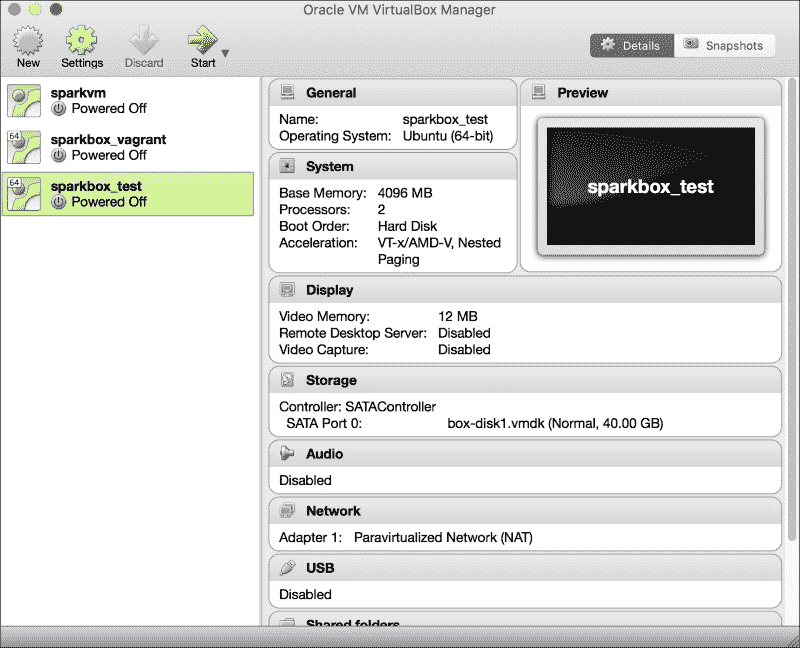
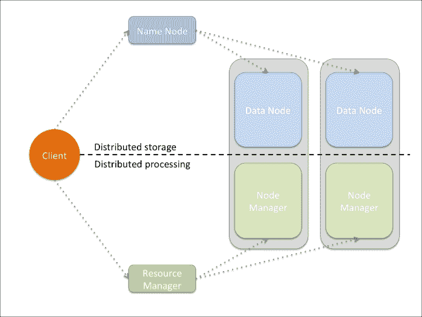
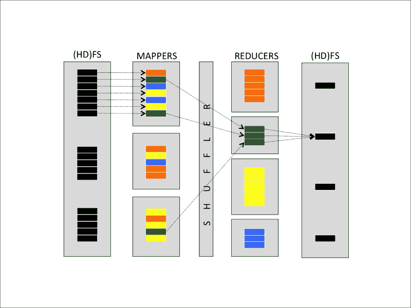
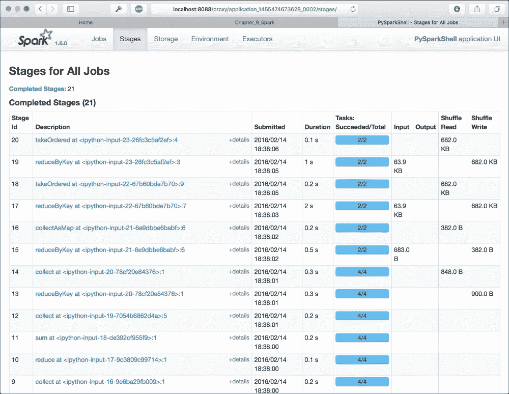

# 八、分布式环境——Hadoop 和 Spark

在本章中，我们将介绍一种处理数据的新方法，水平缩放。到目前为止，我们的注意力主要集中在独立机器上处理大数据；在这里，我们将介绍一些在机器集群上运行的方法。

具体来说，我们将首先说明我们需要集群来处理大数据的动机和环境。然后，我们将通过几个例子(HDFS、MapReduce 和 YARN)介绍 Hadoop 框架及其所有组件，最后，我们将介绍 Spark 框架及其 Python 接口——pySpark。

# 从单机到一堆节点

世界上存储的数据量呈指数级增长。如今，对于一个数据科学家来说，每天必须处理几万亿字节的数据并不是一个不寻常的要求。为了使事情更加复杂，通常数据来自许多不同的异构系统，业务的期望是在短时间内产生一个模型。

因此，处理大数据不仅仅是规模的问题，它实际上是一个三维现象。事实上，根据 3V 模型，基于大数据运行的系统可以使用三个(正交)标准进行分类:

1.  第一个标准是系统归档处理数据的速度。虽然几年前，速度是指一个系统处理一批的速度；如今，速度表示系统是否能够提供流数据的实时输出。
2.  第二个标准是容量，即有多少信息可供处理。它可以用行数、特征数或者仅仅是字节数来表示。对于数据流，容量表示到达系统的数据吞吐量。
3.  最后一个标准是多样性，即数据源的类型。几年前，多样性受到结构化数据集的限制；如今，数据可以是结构化的(表格、图像等)、半结构化的(JSON、XML 等)和非结构化的(网页、社交数据等)。通常，大数据系统试图处理尽可能多的相关来源，混合各种来源。

除了这些标准，最近几年还出现了许多其他的 Vs，试图解释大数据的其他特征。其中一些如下:

*   准确性(提供数据中包含的异常、偏差和噪声的指示；最终，它的准确性)
*   易失性(表示数据可用于提取有意义信息的时间长度)
*   有效性(数据的正确性)
*   值(表示数据的投资回报)

最近几年，所有的 Vs 都大幅增长；现在，许多公司发现他们保留的数据具有巨大的价值，可以货币化，他们希望从中提取信息。技术挑战已经转移到拥有足够的存储和处理能力，以便能够快速、大规模地提取有意义的见解，并使用不同的输入数据流。

当前的计算机，即使是最新最贵的计算机，其磁盘、内存和中央处理器的数量也是有限的。每天处理万亿字节(或千兆字节)的信息看起来非常困难，这就产生了一个快速模型。此外，需要复制包含数据和处理软件的独立服务器；否则，它可能成为系统的单点故障。

因此，大数据的世界已经转向集群:它们由可变数量的不太昂贵的节点组成，并位于高速互联网连接上。通常，一些集群专用于存储数据(大硬盘、小 CPU 和低内存量)，而其他集群专用于处理数据(强大的 CPU、中到大内存量和小硬盘)。此外，如果群集设置正确，它可以确保可靠性(无单点故障)和高可用性。

注意，当我们在分布式环境(像集群)中存储数据时，也要考虑 CAP 定理的局限性；在系统中，我们可以确保以下三个属性中的两个:

*   一致性:所有节点都能够同时向客户端提供相同的数据
*   可用性:对于成功和失败的请求，请求数据的客户端保证总是收到响应
*   分区容差:如果网络出现故障，所有节点都无法联系，系统可以继续工作

具体来说，CAP 定理的结果如下:

*   如果你放弃一致性，你将创建一个数据跨节点分布的环境，即使网络出现一些问题，系统仍然能够对每个请求提供响应，尽管不能保证对同一个问题的响应是相同的(可能不一致)。这种配置的典型例子是 DynamoDB、CouchDB 和 Cassandra。
*   如果您放弃可用性，您将创建一个分布式系统，该系统可能无法响应查询。这个类的例子是分布式缓存数据库，比如 Redis、MongoDb 和 MemcacheDb。
*   最后，如果你在分区容忍度上做了补充，你就陷入了不允许网络分裂的关系数据库的僵化模式中。这一类别包括 MySQL、Oracle 和 SQL Server。

## 为什么我们需要分布式框架？

构建集群最简单的方法是将一些节点用作存储节点，将其他节点用作处理节点。这个配置看起来非常简单，因为我们不需要复杂的框架来处理这种情况。事实上，许多小型集群正是以这种方式构建的:一对服务器处理数据(加上它们的副本)，另一对服务器处理数据。

虽然这看起来是一个很好的解决方案，但由于许多原因，它并不常用:

*   它只适用于令人尴尬的并行算法。如果算法需要在处理服务器之间共享一个公共内存区域，则不能使用这种方法。
*   如果一个或多个存储节点死亡，则不能保证数据一致。(考虑一种情况，其中一个节点及其副本同时死亡，或者一个节点在尚未复制的写操作之后死亡。
*   如果一个处理节点死亡，我们就无法跟踪它正在执行的进程，从而很难在另一个节点上恢复处理。
*   如果网络出现故障，恢复正常后很难预测情况。

现在让我们计算节点故障的概率。是不是稀有到我们可以丢弃？我们是否应该考虑更具体的问题？解决方案很简单:让我们考虑一个 100 节点的集群，其中每个节点在第一年有 1%的故障概率(硬件和软件崩溃的累积)。这 100 个人第一年都活下来的概率有多大？假设每个服务器都是独立的(也就是说，每个节点都可以独立于所有其他节点崩溃，这只是一个乘法:


一开始的结果非常令人惊讶，但这解释了为什么大数据社区在过去十年中非常重视这个问题，并为集群管理开发了许多解决方案。从公式的结果来看，似乎崩溃事件(甚至不止一个)很有可能发生，这一事实要求必须提前想到这种情况，并妥善处理，以确保对数据的操作的连续性。此外，使用廉价的硬件或更大的集群，看起来几乎可以肯定至少有一个节点会出现故障。

### 型式

这里的学习点是，一旦你走向大数据企业，你必须对节点故障采取足够的对策；这是常态而不是例外，应该妥善处理，以确保运营的连续性。

到目前为止，绝大多数集群框架都使用名为*分治*的方法:

*   有专门用于数据节点的模块*，也有专门用于数据处理节点的模块*(也称为工人)。**
***   数据跨数据节点复制，一个节点是主节点，确保写入和读取操作都成功。*   处理步骤在工作节点之间分割。它们不共享任何状态(除非存储在数据节点中)，它们的主节点确保所有任务都以正确的顺序积极执行。**

 **### 注

稍后，我们将在本章中介绍 Apache Hadoop 框架；虽然现在已经是一个成熟的集群管理系统，但它仍然依赖于坚实的基础。在此之前，让我们在机器上设置正确的工作环境。

# 设置虚拟机

建立集群是一项漫长而艰难的工作；高级大数据工程师赚到的(高)工资不仅仅是下载和执行一个二进制应用，而是熟练而谨慎地让集群管理器适应想要的工作环境。这是一个艰难而复杂的操作；这可能需要很长时间，如果结果低于预期，整个企业(包括数据科学家和软件开发人员)将无法提高生产力。在开始构建集群之前，数据工程师必须了解节点、数据、将要执行的操作和网络的每个小细节。输出通常是平衡的、自适应的、快速的、可靠的集群，可以被公司所有的技术人员使用多年。

### 注

拥有少量非常强大的节点的集群比拥有许多不太强大的服务器的集群更好吗？答案应该逐案评估，它高度依赖于数据、处理算法、访问数据的人数、我们想要结果的速度、总体价格、可扩展性的健壮性、网络速度和许多其他因素。简单地说，做出最好的决定一点也不容易！

由于设置环境非常困难，我们作者更愿意为读者提供一个虚拟机映像，其中包含您在集群上尝试某些操作所需的一切。在接下来的几节中，您将学习如何在您的机器上设置一个客户操作系统，该系统包含一个集群的一个节点以及您在真实集群上找到的所有软件。

为什么只有一个节点？由于我们使用的框架不是轻量级的，我们决定采用集群的原子块，确保您在节点中找到的环境与您在现实世界中找到的环境完全相同。为了在您的计算机上运行虚拟机，您需要两个软件:Virtualbox 和游民。两者都是免费开源的。

## 虚拟盒

VirtualBox 是一个开源软件，用于虚拟化 Windows、macOS 和 Linux 主机上的一对多客户操作系统。从用户的角度来看，一台虚拟机看起来就像另一台运行在窗口中的计算机，拥有所有功能。

VirtualBox 因其高性能、简单、干净的**图形用户界面** ( **GUI** )而变得非常受欢迎。使用 VirtualBox 启动、停止、导入和终止虚拟机只需点击一下鼠标。

从技术上讲，VirtualBox 是一个虚拟机管理程序，它支持创建和管理多个**虚拟机** ( **VM** )包括许多版本的 Windows、Linux 和类似 BSD 的发行版。VirtualBox 运行的机器命名为*主机*，而虚拟机命名为*来宾*。注意主人和客人之间没有限制；例如，一个 Windows 主机可以运行 Windows(相同的版本、以前的版本或最近的版本)以及任何与 VirtualBox 兼容的 Linux 和 BSD 发行版。

Virtualbox 通常用于运行特定于操作系统的软件；有些软件只在 Windows 上运行或者只是特定版本的 Windows，有些只在 Linux 上可用，等等。另一个应用是在克隆的生产环境中模拟新功能；在实时(生产)环境中尝试修改之前，软件开发人员通常会在一个克隆上测试它，就像在 VirtualBox 上运行的那样。由于来宾与主机隔离，如果来宾出现问题(甚至格式化硬盘)，这不会影响主机。要拿回它，在做任何危险的事情之前，只要克隆你的机器；你总是能及时找回它。

对于想从头开始的人，VirtualBox 支持虚拟硬盘(包括硬盘、光盘、DVD、软盘)；这使得新操作系统的安装非常简单。例如，如果你想安装一个普通版本的 Linux Ubuntu 14.04，你首先要下载`.iso`文件。您可以简单地将其作为虚拟驱动器添加到 VirtualBox，而不是将其刻录在 CD/DVD 上。然后，由于简单的分步界面，您可以选择硬盘大小和来宾机器的功能(内存、CPU 数量、视频内存和网络连接)。在使用真实 bios 操作时，可以选择引导顺序:选择 CD/DVD 作为更高的优先级，一打开 guest 就可以开始安装 Ubuntu 的过程。

现在，让我们下载 VirtualBox 请记住为您的操作系统选择正确的版本。

### 注

要将其安装到您的计算机上，请按照 https://www.virtualbox.org/wiki/Downloads T2 的说明进行操作。

在写这篇文章的时候，最新版本是 5.1。安装后，图形界面看起来像下面截图中的界面



我们强烈建议您看一看如何在您的机器上设置来宾机器。每个来宾机器将出现在窗口的左侧。(图中可以看到，在我们的电脑上，我们有三位被拦下的客人。)通过点击每个图标上的，右侧将出现虚拟化硬件的详细描述。在示例图像中，如果名为`sparkbox_test`的虚拟机(左边突出显示的那个)被打开，它将在一台虚拟计算机上运行，该计算机的硬件由一个 4GB 的内存、两个处理器、40GB 硬盘和一个带有 NAT 的连接到网络的 12MB 内存的视频卡组成。

## 流浪

游民是一个软件，配置虚拟环境在一个高水平。游民的核心部分是脚本功能，通常用于以编程方式创建和自动指定虚拟环境。游民使用 VirtualBox(以及其他虚拟器)来构建和配置虚拟机。

### 注

要安装它，请遵循 https://www.vagrantup.com/downloads.html T2 的说明。

## 使用虚拟机

安装了 float 和 VirtualBox 后，现在就可以运行集群环境的节点了。创建一个空目录，并将以下游民命令插入名为`Vagrantfile`的新文件中:

```py
Vagrant.configure("2") do |config|
    config.vm.box = "sparkpy/sparkbox_test_1"
    config.vm.hostname = "sparkbox"
    config.ssh.insert_key = false

    # Hadoop ResourceManager
    config.vm.network :forwarded_port, guest: 8088, host: 8088, auto_correct: true

    # Hadoop NameNode
    config.vm.network :forwarded_port, guest: 50070, host: 50070, auto_correct: true

    # Hadoop DataNode
    config.vm.network :forwarded_port, guest: 50075, host: 50075, auto_correct: true

    # Ipython notebooks (yarn and standalone)
    config.vm.network :forwarded_port, guest: 8888, host: 8888, auto_correct: true

    # Spark UI (standalone)
    config.vm.network :forwarded_port, guest: 4040, host: 4040, auto_correct: true

    config.vm.provider "virtualbox" do |v|
      v.customize ["modifyvm", :id, "--natdnshostresolver1", "on"]
    v.customize ["modifyvm", :id, "--natdnsproxy1", "on"]
v.customize ["modifyvm", :id, "--nictype1", "virtio"]
    v.name = "sparkbox_test"
    v.memory = "4096"
    v.cpus = "2"
    end

end
```

从上到下，第一行下载正确的虚拟机(我们作者创建并上传到存储库中)。然后，我们设置一些端口转发给来宾机；这样，您将能够访问虚拟机的一些 web 服务。最后，我们设置节点的硬件。

### 注

该配置是为专用于 4GB 内存和两个内核的虚拟机设置的。如果您的系统不能满足这些要求，请将`v.memory`和`v.cpus`值修改为对您的机器有益的值。请注意，如果您设置的配置不合适，下面的一些代码示例可能会失败。

现在，打开一个终端，导航到包含`Vagrantfile`的目录。在这里，使用以下命令启动虚拟机:

```py
$ vagrant up

```

第一次，这个命令需要一段时间来下载(几乎是 2GB 下载)并构建正确的虚拟机结构。下一次，这个命令花费的时间更少，因为没有更多的东西可以下载。

在本地系统上打开虚拟机后，您可以按如下方式访问它:

```py
$ vagrant ssh

```

该命令模拟 SSH 访问，最终您将进入虚拟机。

### 注

在 Windows 机器上，由于缺少 SSH 可执行文件，此命令可能会失败并出现错误。在这种情况下，下载安装一个 Windows 的 SSH 客户端，比如Putty([http://www.putty.org/](http://www.putty.org/))、CygwinOpenssh([http://www.cygwin.com/](http://www.cygwin.com/))或者 Windows 的 Openssh([http://sshwindows.sourceforge.net/](http://sshwindows.sourceforge.net/))。Unix 系统不应该受到这个问题的影响。

要关闭 if，您首先需要退出机器。从虚拟机内部，只需使用`exit`命令退出 SSH 连接，然后关闭虚拟机:

```py
$ vagrant halt

```

### 注

虚拟机消耗资源。当您使用虚拟机所在目录中的`vagranthalt`命令完成工作时，请记住将其关闭。

前面的命令关闭虚拟机，就像您关闭服务器一样。要删除它并删除其所有内容，请使用`vagrant destroy`命令。小心使用:在破坏了机器之后，您将无法恢复其中的文件。

以下是在虚拟机中使用 IPython (Jupyter)笔记本的说明:

1.  从包含`Vagrantfile`的文件夹中启动`vagrant up`和`vagrant ssh`。您现在应该在虚拟机内部了。
2.  现在，启动脚本:

    ```py
    vagrant@sparkbox:~$ ./start_hadoop.sh

    ```

3.  At this point, launch the following shell script:

    ```py
    vagrant@sparkbox:~$ ./start_jupyter_yarn.sh

    ```

    在本地机器上打开浏览器，指向`http://localhost:8888`。

这是由集群节点支持的笔记本。要关闭笔记本电脑和虚拟机，请执行以下步骤:

1.  要终止 Jupyter 控制台，请按 *Ctrl* + *C* (然后键入 *Y* 表示是)。
2.  终止 Hadoop 框架如下:

    ```py
    vagrant@sparkbox:~$ ./stop_hadoop.sh

    ```

3.  使用以下命令退出虚拟机:

    ```py
    vagrant@sparkbox:~$ exit

    ```

4.  用`vagrant halt`关闭 VirtualBox 机器。

# Hadoop 生态系统

Apache Hadoop 是一个非常流行的软件框架，用于集群上的分布式存储和分布式处理。它的优势在于价格(它是免费的)、灵活性(它是开源的，虽然是用 Java 编写的，但它可以被其他编程语言使用)、可扩展性(它可以处理由成千上万个节点组成的集群)和健壮性(它的灵感来自谷歌发表的一篇论文，自 2011 年以来一直存在)，使它成为处理和处理大数据的事实标准。此外，Apache 基金会的许多其他项目扩展了它的功能。

## 建筑

从逻辑上讲，Hadoop 由两部分组成:分布式存储(HDFS)和分布式处理(纱和 MapReduce)。虽然代码非常复杂，但整体架构相当容易理解。客户端可以通过两个专用模块访问存储和处理；然后，他们负责在所有理论节点上分配工作:



所有 Hadoop 模块都作为服务(或实例)运行，也就是说，一个物理或虚拟节点可以运行其中的许多模块。典型地，对于小集群，所有节点都运行分布式计算和处理服务；对于大型集群，最好将两个专门用于节点的功能分开。

我们将详细了解这两层提供的功能。

## HDFS

**Hadoop 分布式文件系统** ( **HDFS** )是一个容错分布式文件系统，旨在运行在商用低成本硬件上，并能够处理非常大的数据集(几百千兆字节到十六千兆字节)。虽然 HDFS 需要快速的网络连接来跨节点传输数据，但是延迟不可能像传统文件系统那样低(可能在几秒钟的数量级)；因此，HDFS 专为批量处理和高吞吐量而设计。每个 HDFS 节点包含文件系统数据的一部分；相同的数据也在其他实例中复制，这确保了高吞吐量访问和容错。

HDFS 的建筑是主从式的。如果主节点(名称节点)出现故障，则有一个辅助/备份节点准备接管。所有其他实例都是从属实例(数据节点)；如果其中一个失败了，没有问题，因为 HDFS 在设计时就考虑到了这一点。

数据节点包含数据块:保存在 HDFS 的每个文件被分成块(或区块)，通常每个 64MB，然后在一组数据节点中分发和复制。

名称节点仅存储分布式文件系统中文件的元数据；它不存储任何实际数据，而只是正确指示如何访问它管理的多个数据节点中的文件。

请求读取文件的客户端应首先联系名称节点，该节点将返回一个表，其中包含块及其位置的有序列表(如在数据节点中)。此时，客户端应该单独联系数据节点，下载所有块并重建文件(通过将块附加在一起)。

相反，要写入文件，客户端应该首先联系名称节点，该节点将首先决定如何处理该请求，更新其记录，然后向客户端回复一个有序的数据节点列表，说明在何处写入文件的每个块。客户端现在将联系数据节点并将数据块上传到数据节点，如名称节点回复中所述。

名称空间查询(例如，列出目录内容、创建文件夹等)完全由名称节点通过访问其元数据信息来处理。

此外，名称节点还负责正确处理数据节点故障(如果没有接收到心跳数据包，它将被标记为死亡)，并将其数据重新复制到其他节点。

尽管这些操作很长，很难健壮地实现，但是由于许多库和 HDFS shell，它们对用户来说是完全透明的。您在 HDFS 上操作的方式与您当前在文件系统上所做的非常相似，这是 Hadoop 的一大优势:隐藏复杂性，让用户简单地使用它。

现在让我们来看看 HDFS shell 和后来的 Python 库。

### 注

使用前面的说明打开虚拟机，并在您的计算机上启动 IPython 笔记本。

现在，打开一个新笔记本；由于每个笔记本都连接到 Hadoop 集群框架，因此此操作将比平时花费更多的时间。当笔记本准备使用时，你会看到右上角的**内核启动，请等待……**标志消失。

第一篇是关于 HDFS 贝壳的；因此，以下所有命令都可以在虚拟机的提示符或 shell 下运行。要在 IPython 笔记本中运行它们，所有这些都需要一个问号`!`，这是在笔记本中执行 bash 代码的一种简单方法。

以下命令行的共同点是可执行文件；我们将始终运行`hdfs`命令。它是访问和管理 HDFS 系统的主要界面，也是 HDFS shell 的主要命令。

我们从一份关于 HDFS 状况的报告开始。要获取**分布式文件系统** ( **dfs** )及其数据节点的详细信息，请使用`dfsadmin`子命令:

```py
In:!hdfs dfsadmin –report

Out:Configured Capacity: 42241163264 (39.34 GB)
Present Capacity: 37569168058 (34.99 GB)
DFS Remaining: 37378433024 (34.81 GB)
DFS Used: 190735034 (181.90 MB)
DFS Used%: 0.51%
Under replicated blocks: 0
Blocks with corrupt replicas: 0
Missing blocks: 0

-------------------------------------------------
Live datanodes (1):

Name: 127.0.0.1:50010 (localhost)
Hostname: sparkbox
Decommission Status : Normal
Configured Capacity: 42241163264 (39.34 GB)
DFS Used: 190735034 (181.90 MB)
Non DFS Used: 4668290330 (4.35 GB)
DFS Remaining: 37380775936 (34.81 GB)
DFS Used%: 0.45%
DFS Remaining%: 88.49%
Configured Cache Capacity: 0 (0 B)
Cache Used: 0 (0 B)
Cache Remaining: 0 (0 B)
Cache Used%: 100.00%
Cache Remaining%: 0.00%
Xceivers: 1
Last contact: Tue Feb 09 19:41:17 UTC 2016
```

dfs 子命令允许使用一些众所周知的 Unix 命令来访问分布式文件系统并与之交互。例如，列出根目录的内容如下:

```py
In:!hdfs dfs -ls /

Out:Found 2 items
drwxr-xr-x   - vagrant supergroup          0 2016-01-30 16:33 /spark
drwxr-xr-x   - vagrant supergroup          0 2016-01-30 18:12 /user
```

输出类似于 Linux 提供的`ls`命令，列出了权限、链接数量、拥有文件的用户和组、大小、上次修改的时间戳以及每个文件或目录的名称。

类似于`df`命令，我们可以调用`-df`参数来显示 HDFS 的可用磁盘空间量。`-h`选项将使输出更加易读(使用千兆字节和兆字节代替字节):

```py
In:!hdfs dfs -df -h /

Out:Filesystem               Size     Used  Available  Use%
hdfs://localhost:9000  39.3 G  181.9 M     34.8 G    0%
```

类似于`du`，我们可以使用`-du`参数来显示根目录中包含的每个文件夹的大小。同样，`-h`将产生更具可读性的输出:

```py
In:!hdfs dfs -du -h /

Out:178.9 M  /spark
1.4 M    /user
```

到目前为止，我们已经从 HDFS 提取了一些信息。现在让我们对分布式文件系统做一些操作，这会修改它。我们可以从创建一个名为`-mkdir`的文件夹开始。请注意，如果目录已经存在(与 Linux 中完全一样，使用`mkdir`命令)，此操作可能会失败:

```py
In:!hdfs dfs -mkdir /datasets
```

现在让我们将一些文件从节点的硬盘传输到分布式文件系统。在我们创建的虚拟机中，`../datasets`目录中已经有一个文本文件；让我们从网上下载一个文本文件。让我们将它们都移动到我们用前面的命令创建的 HDFS 目录中:

```py
In:
!wget -q http://www.gutenberg.org/cache/epub/100/pg100.txt \
    -O ../datasets/shakespeare_all.txt

!hdfs dfs -put ../datasets/shakespeare_all.txt \
/datasets/shakespeare_all.txt

!hdfs dfs -put ../datasets/hadoop_git_readme.txt \
/datasets/hadoop_git_readme.txt
```

导入成功吗？是的，我们没有任何错误。但是，为了消除任何疑问，让我们列出 HDFS 目录/数据集来查看这两个文件:

```py
In:!hdfs dfs -ls /datasets

Out:Found 2 items
-rw-r--r--   1 vagrant supergroup       1365 2016-01-31 12:41 /datasets/hadoop_git_readme.txt
-rw-r--r--   1 vagrant supergroup    5589889 2016-01-31 12:41 /datasets/shakespeare_all.txt
```

要将一些文件连接到标准输出，我们可以使用`-cat`参数。在接下来的代码中，我们计算了文本文件中出现的新行。请注意，第一个命令通过管道传输到在本地计算机上运行的另一个命令中:

```py
In:!hdfs dfs -cat /datasets/hadoop_git_readme.txt | wc –l

Out:30
```

实际上，通过`-cat`参数，我们可以连接本地机器和 HDFS 的多个文件。要查看它，现在让我们计算一下当存储在 HDFS 的文件与存储在本地机器上的文件连接在一起时，有多少新行出现。为了避免误解，我们可以使用完整的**统一资源标识符** ( **URI** )，使用`hdfs:`方案引用 HDFS 的文件，使用`file:`方案引用本地文件:

```py
In:!hdfs dfs -cat \
    hdfs:///datasets/hadoop_git_readme.txt \
    file:///home/vagrant/datasets/hadoop_git_readme.txt | wc –l

Out:60
```

为了在 HDFS 复制，我们可以使用`-cp`参数:

```py
In : !hdfs dfs -cp /datasets/hadoop_git_readme.txt \
/datasets/copy_hadoop_git_readme.txt
```

要删除文件(或目录，用正确的选项)，我们可以使用`–rm`参数。在这段代码中，我们删除了刚刚用前面的命令创建的文件。请注意，HDFS 有鞭打机制；因此，删除的文件实际上并没有从 HDFS 中删除，而只是移动到了一个特殊的目录中:

```py
In:!hdfs dfs -rm /datasets/copy_hadoop_git_readme.txt

Out:16/02/09 21:41:44 INFO fs.TrashPolicyDefault: Namenode trash configuration: Deletion interval = 0 minutes, Emptier interval = 0 minutes.

Deleted /datasets/copy_hadoop_git_readme.txt
```

要清空经过反复研究的数据，命令如下:

```py
In:!hdfs dfs –expunge

Out:16/02/09 21:41:44 INFO fs.TrashPolicyDefault: Namenode trash configuration: Deletion interval = 0 minutes, Emptier interval = 0 minutes.
```

要获得(获取)从 HDFS 到本地机器的文件，我们可以使用`-get`参数:

```py
In:!hdfs dfs -get /datasets/hadoop_git_readme.txt \
/tmp/hadoop_git_readme.txt
```

要查看存储在 HDFS 的文件，我们可以使用`-tail`参数。请注意，在 HDFS 没有 head 功能，因为它可以使用`cat`来完成，然后将结果输入本地 head 命令。至于尾部，HDFS 外壳只显示最后一千字节的数据:

```py
In:!hdfs dfs -tail /datasets/hadoop_git_readme.txt

Out:ntry, of 
encryption software.  BEFORE using any encryption software, please 
check your country's laws, regulations and policies concerning the
import, possession, or use, and re-export of encryption software, to 
see if this is permitted.  See <http://www.wassenaar.org/> for more
information.
[...]
```

`hdfs`命令是 HDFS 的主要入口点，但是它很慢，从 Python 中调用系统命令并读取输出非常繁琐。为此，有一个 Python 库“蛇咬”，它包装了许多分布式文件系统操作。不幸的是，该库不像 HDFS 外壳那样完整，并且绑定到一个名称节点。要在本地机器上安装，只需使用`pip install snakebite`。

要实例化客户端对象，我们应该提供名称节点的 IP(或其别名)和端口。在我们提供的虚拟机中，它运行在端口 9000 上:

```py
In:from snakebite.client import Client
client = Client("localhost", 9000)
```

要打印一些关于 HDFS 的信息，客户端对象有`serverdefaults`方法:

```py
In:client.serverdefaults()

Out:{'blockSize': 134217728L,
 'bytesPerChecksum': 512,
 'checksumType': 2,
 'encryptDataTransfer': False,
 'fileBufferSize': 4096,
 'replication': 1,
 'trashInterval': 0L,
 'writePacketSize': 65536}
```

要在根目录中列出文件和目录，我们可以使用`ls`方法。结果是一个字典列表，每个文件一个，包含信息，如权限、上次修改的时间戳等。在这个例子中，我们只对路径(即名称)感兴趣:

```py
In:for x in client.ls(['/']):
    print x['path']

Out:/datasets
/spark
/user
```

与前面的代码完全一样，蛇咬客户端有`du`(用于磁盘使用)和`df`(用于磁盘空闲)方法可用。请注意，许多方法(如`du`)返回生成器，这意味着它们需要被消费(如迭代器或列表)才能执行:

```py
In:client.df()

Out:{'capacity': 42241163264L,
 'corrupt_blocks': 0L,
 'filesystem': 'hdfs://localhost:9000',
 'missing_blocks': 0L,
 'remaining': 37373218816L,
 'under_replicated': 0L,
 'used': 196237268L}

In:list(client.du(["/"]))

Out:[{'length': 5591254L, 'path': '/datasets'},
 {'length': 187548272L, 'path': '/spark'},
 {'length': 1449302L, 'path': '/user'}]
```

至于 HDFS shell 示例，我们现在将尝试计算与蛇咬出现在同一文件中的换行符。注意`.cat`方法返回一个生成器:

```py
In:
for el in client.cat(['/datasets/hadoop_git_readme.txt']):
    print el.next().count("\n")

Out:30
```

现在让我们从 HDFS 删除一个文件。同样，请注意`delete`方法返回一个生成器，并且执行永远不会失败，即使我们试图删除一个不存在的目录。事实上，蛇咬不会引发异常，只是在输出字典中向用户发出操作失败的信号:

```py
In:client.delete(['/datasets/shakespeare_all.txt']).next()

Out:{'path': '/datasets/shakespeare_all.txt', 'result': True}
```

现在，让我们将一个文件从 HDFS 复制到本地文件系统。观察输出是发电机，需要查看输出字典，看操作是否成功:

```py
In:
(client
.copyToLocal(['/datasets/hadoop_git_readme.txt'], 
             '/tmp/hadoop_git_readme_2.txt')
.next())

Out:{'error': '',
 'path': '/tmp/hadoop_git_readme_2.txt',
 'result': True,
 'source_path': '/datasets/hadoop_git_readme.txt'}
```

最后，创建一个目录并删除所有匹配字符串的文件:

```py
In:list(client.mkdir(['/datasets_2']))

Out:[{'path': '/datasets_2', 'result': True}]

In:client.delete(['/datasets*'], recurse=True).next()

Out:{'path': '/datasets', 'result': True}
```

在 HDFS 存档的代码在哪里？将 HDFS 文件复制到另一个文件的代码在哪里？嗯，这些功能还没有在蛇咬中实现。对于他们，我们将通过系统调用使用 HDFS 外壳。

## MapReduce

MapReduce 是在最早的 Hadoop 版本中实现的编程模型。这是一个非常简单的模型，旨在并行批处理分布式集群上的大型数据集。MapReduce 的核心由两个可编程功能组成——一个执行过滤的映射器和一个执行聚合的缩减器——以及一个将对象从映射器移动到右侧缩减器的洗牌器。

### 注

谷歌在 2004 年发表了一篇关于 Mapreduce 的论文，几个月前它获得了一项专利。

具体来说，以下是 Hadoop 实现的 MapReduce 步骤:

1.  Data chunker. Data is read from the filesystem and split into chunks. A chunk is a piece of the input dataset, typically either a fixed-size block (for example, a HDFS block read from a Data Node) or another more appropriate split.

    例如，如果我们想计算一个文本文件中的字符、单词和行数，一个好的拆分可以是一行文本。

2.  Mapper: From each chunk, a series of key-value pairs is generated. Each mapper instance applies the same mapping function on different chunks of data.

    继续前面的例子，对于每一行，在这个步骤中生成三个键值对——一个包含该行中的字符数(键可以简单地是一个*字符*字符串)，一个包含单词数(在这种情况下，键必须不同，让我们说*单词*)，一个包含行数，它总是一个(在这种情况下，键可以是*行*)。

3.  洗牌机:根据可用的缩减器的键和数量，洗牌机将具有相同键的所有键值对分配给相同的缩减器。典型地，这个操作是密钥的散列，取减数的模。这应确保每个减速器有相当数量的键。这个函数不是用户可编程的，而是由 MapReduce 框架提供的。
4.  Reducer: Each reducer receives all the key-value pairs for a specific set of keys and can produce zero or more aggregate results.

    在本例中，所有连接到*字*键的值都到达一个减速器；它的工作只是总结所有的价值。其他键也是如此，最终得到三个值:字符数、字数和行数。请注意，这些结果可能在不同的减速器上。

5.  Output writer: The outputs of the reducers are written on the filesystem (or HDFS). In the default Hadoop configuration, each reducer writes a file (`part-r-00000` is the output of the first reducer, `part-r-00001` of the second, and so on). To have a full list of results on a file, you should concatenate all of them.

    从视觉上看，该操作可以简单地传达和理解如下:

    

在映射步骤之后，每个映射器实例还可以运行一个可选步骤——合并器。如果可能的话，它基本上预测映射器上的减少步骤，并且通常用于减少要混洗的信息量，从而加快过程。在前面的示例中，如果映射器在(可选的)组合器步骤中处理输入文件的多行，它可以预聚合结果，输出较少数量的键值对。例如，如果映射器处理每个块中的 100 行文本，那么当信息可以聚合为三个时，为什么要输出 300 个键值对(100 个字符，100 个单词，100 行)？这实际上是组合器的目标。

在 Hadoop 提供的 MapReduce 实现中，洗牌操作是分布式的，优化了通信成本，并且每个节点可以运行多个映射器和缩减器，充分利用了节点上可用的硬件资源。此外，Hadoop 基础架构提供冗余和容错，因为同一任务可以分配给多个工作人员。

现在让我们看看它是如何工作的。尽管 Hadoop 框架是用 Java 编写的，但由于 Hadoop Streaming 实用程序，映射器和缩减器可以是任何可执行文件，包括 Python。Hadoop Streaming 使用管道和标准输入和输出来流式传输内容；因此，mappers 和 reducers 必须实现 stdin 的读取器和 stdout 上的键值写入器。

现在，打开虚拟机，打开一个新的 IPython 笔记本。即使在这种情况下，我们也会首先引入命令行方式来运行 Hadoop 提供的【MapReduce 作业，然后引入一个纯 Python 库。第一个例子正是我们所描述的:一个文本文件的字符、单词和行数的计数器。

首先，让我们将数据集插入 HDFS；我们将使用 Hadoop Git readme(一个包含随 Apache Hadoop 分发的 readme 文件的简短文本文件)和所有莎士比亚书籍的全文，由 Project Gutenberg 提供(虽然它只有 5MB，但包含了几乎 125K 行)。在第一个单元格中，我们将清理上一个实验的文件夹，然后，我们在数据集文件夹中下载包含莎士比亚参考书目的文件，最后，我们将两个数据集放在 HDFS 上:

```py
In:!hdfs dfs -mkdir -p /datasets
!wget -q http://www.gutenberg.org/cache/epub/100/pg100.txt \
    -O ../datasets/shakespeare_all.txt
!hdfs dfs -put -f ../datasets/shakespeare_all.txt /datasets/shakespeare_all.txt
!hdfs dfs -put -f ../datasets/hadoop_git_readme.txt /datasets/hadoop_git_readme.txt
!hdfs dfs -ls /datasets
```

现在，让我们创建包含映射器和缩减器的 Python 可执行文件。我们将在这里使用一个非常肮脏的黑客:我们将使用笔记本中的写操作来编写 Python 文件(并使它们可执行)。

映射器和缩减器都从 stdin 读取并写入 stdout(使用简单的打印命令)。具体来说，映射器从 stdin 中读取行，并打印字符数(除了换行符)、字数(通过在空白上拆分行)和行数的键值对，始终为 1。相反，缩减器会汇总每个键的值，并打印总计:

```py
In:
with open('mapper_hadoop.py', 'w') as fh:
    fh.write("""#!/usr/bin/env python

import sys

for line in sys.stdin:
    print "chars", len(line.rstrip('\\n'))
    print "words", len(line.split())
    print "lines", 1
    """)

with open('reducer_hadoop.py', 'w') as fh:
    fh.write("""#!/usr/bin/env python

import sys

counts = {"chars": 0, "words":0, "lines":0}

for line in sys.stdin:
    kv = line.rstrip().split()
    counts[kv[0]] += int(kv[1])

for k,v in counts.items():
    print k, v
    """) 

In:!chmod a+x *_hadoop.py
```

为了在工作中看到它，让我们在不使用 Hadoop 的情况下在本地尝试它。事实上，当映射器和还原器读写标准输入和输出时，我们可以把所有的东西放在一起。请注意，洗牌机可以由`sort -k1,1`命令代替，该命令使用第一个字段(即键)对输入字符串进行排序:

```py
In:!cat ../datasets/hadoop_git_readme.txt | ./mapper_hadoop.py | sort -k1,1 | ./reducer_hadoop.py

Out:chars 1335
lines 31
words 179
```

现在让我们使用 Hadoop MapReduce 方法来获得相同的结果。首先，我们应该在 HDFS 创建一个能够存储结果的空目录。在这种情况下，我们创建了一个名为`/tmp`的目录，并以与作业输出相同的方式删除其中的任何名称(如果输出文件已经存在，Hadoop 将失败)。然后，我们使用正确的命令来运行 MapReduce 作业。该命令包括以下内容:

*   我们想要使用 Hadoop 流功能的事实(表示 Hadoop 流 jar 文件)
*   我们想要使用的映射器和缩减器(T0 和 T1 选项)
*   我们希望将这些文件作为本地文件分发给每个映射器(使用`–files`选项)
*   输入文件(`–input`选项)和输出目录(`–output`选项)

```py
In:!hdfs dfs -mkdir -p /tmp
!hdfs dfs -rm -f -r /tmp/mr.out

!hadoop jar /usr/local/hadoop/share/hadoop/tools/lib/hadoop-streaming-2.6.4.jar \
-files mapper_hadoop.py,reducer_hadoop.py \
-mapper mapper_hadoop.py -reducer reducer_hadoop.py \
-input /datasets/hadoop_git_readme.txt -output /tmp/mr.out

Out:[...]
16/02/04 17:12:22 INFO mapreduce.Job: Running job: job_1454605686295_0003
16/02/04 17:12:29 INFO mapreduce.Job: Job job_1454605686295_0003 running in uber mode : false
16/02/04 17:12:29 INFO mapreduce.Job:  map 0% reduce 0%
16/02/04 17:12:35 INFO mapreduce.Job:  map 50% reduce 0%
16/02/04 17:12:41 INFO mapreduce.Job:  map 100% reduce 0%
16/02/04 17:12:47 INFO mapreduce.Job:  map 100% reduce 100%
16/02/04 17:12:47 INFO mapreduce.Job: Job job_1454605686295_0003 completed successfully
[...]
    Shuffle Errors
        BAD_ID=0
        CONNECTION=0
        IO_ERROR=0
        WRONG_LENGTH=0
        WRONG_MAP=0
        WRONG_REDUCE=0
[...]
16/02/04 17:12:47 INFO streaming.StreamJob: Output directory: /tmp/mr.out
```

输出很啰嗦；我们只是从中提取了三个重要部分。第一个指示 MapReduce 作业的进度，跟踪和估计完成操作所需的时间非常有用。第二部分突出显示了在作业期间可能发生的错误，最后一部分报告了终止的输出目录和时间戳。小文件(30 行)上的整个过程几乎花了半分钟！原因很简单:第一，Hadoop MapReduce 是为强大的大数据处理而设计的，并且包含大量开销，第二，理想的环境是强大机器的集群，而不是具有 4GB RAM 的虚拟化 VM。另一方面，这些代码可以在更大的数据集和强大机器的集群上运行，而不需要做任何改变。

我们不要马上看到结果。首先，让我们看一下 HDFS 的输出目录:

```py
In:!hdfs dfs -ls /tmp/mr.out

Out:Found 2 items
-rw-r--r--   1 vagrant supergroup          0 2016-02-04 17:12 /tmp/mr.out/_SUCCESS
-rw-r--r--   1 vagrant supergroup         33 2016-02-04 17:12 /tmp/mr.out/part-00000
```

有两个文件:第一个是空的，名为`_SUCCESS`，表示 MapReduce 作业已经完成了目录中的写入阶段，第二个名为 part-00000，包含实际结果(因为我们在只有一个 Reduce 的节点上操作)。阅读此文件将为我们提供最终结果:

```py
In:!hdfs dfs -cat /tmp/mr.out/part-00000

Out:chars 1335    
lines 31    
words 179    
```

正如预期的那样，它们与前面显示的管道命令行相同。

虽然概念上很简单，但 Hadoop Streaming 并不是用 Python 代码运行 Hadoop 作业的最佳方式。为此，Pypy 上有很多可用的库；我们在这里展示的这个是最灵活和维护最开放的源代码之一—**MrJob**。它允许您在本地机器、Hadoop 集群或相同的云集群环境(如亚马逊弹性地图缩减)上无缝运行作业；它将所有代码合并到一个独立的文件中，即使需要多个 MapReduce 步骤(考虑迭代算法)，并解释代码中的 Hadoop 错误。此外，安装非常简单；要在本地机器上安装 MrJob 库，只需使用`pip install mrjob`。

虽然 MrJob 是一款很棒的软件，但它在 IPython Notebook 上运行不太好，因为它需要一个主要功能。这里，我们需要在一个单独的文件中编写 MapReduce Python 代码，然后运行一个命令行。

我们从我们已经看过很多次的例子开始:计算文件中的字符、单词和行。首先，让我们使用 MrJob 功能编写 Python 文件；mappers 和 reducers】被包裹在`MRJob`的一个子类中。输入不是从 stdin 读取的，而是作为函数参数传递的，输出不是打印的，而是产生的(或返回的)。

多亏了 MrJob，整个 MapReduce 程序变成了几行代码:

```py
In:
with open("MrJob_job1.py", "w") as fh:
    fh.write("""
from mrjob.job import MRJob

class MRWordFrequencyCount(MRJob):

    def mapper(self, _, line):
        yield "chars", len(line)
        yield "words", len(line.split())
        yield "lines", 1

    def reducer(self, key, values):
        yield key, sum(values)

if __name__ == '__main__':
    MRWordFrequencyCount.run()    
    """)
```

现在让我们在本地执行它(使用数据集的本地版本)。MrJob 库除了执行映射器和缩减器步骤(在本例中是本地)之外，还打印结果并清理临时目录:

```py
In:!python MrJob_job1.py ../datasets/hadoop_git_readme.txt

Out: [...]
Streaming final output from /tmp/MrJob_job1.vagrant.20160204.171254.595542/output
"chars"    1335
"lines"    31
"words"    179
removing tmp directory /tmp/MrJob_job1.vagrant.20160204.171254.595542
```

要在 Hadoop 上运行相同的进程，只需运行相同的 Python 文件，这次在命令行中插入`–r hadoop`选项，MrJob 将使用 Hadoop MapReduce 和 HDFS 自动执行它。在这种情况下，记得指向输入文件的`hdfs`路径:

```py
In:
!python MrJob_job1.py -r hadoop hdfs:///datasets/hadoop_git_readme.txt

Out:[...]
HADOOP: Running job: job_1454605686295_0004
HADOOP: Job job_1454605686295_0004 running in uber mode : false
HADOOP:  map 0% reduce 0%
HADOOP:  map 50% reduce 0%
HADOOP:  map 100% reduce 0%
HADOOP:  map 100% reduce 100%
HADOOP: Job job_1454605686295_0004 completed successfully
[...]
HADOOP:     Shuffle Errors
HADOOP:         BAD_ID=0
HADOOP:         CONNECTION=0
HADOOP:         IO_ERROR=0
HADOOP:         WRONG_LENGTH=0
HADOOP:         WRONG_MAP=0
HADOOP:         WRONG_REDUCE=0
[...]
Streaming final output from hdfs:///user/vagrant/tmp/mrjob/MrJob_job1.vagrant.20160204.171255.073506/output
"chars"    1335
"lines"    31
"words"    179
removing tmp directory /tmp/MrJob_job1.vagrant.20160204.171255.073506
deleting hdfs:///user/vagrant/tmp/mrjob/MrJob_job1.vagrant.20160204.171255.073506 from HDFS
```

您将看到与之前看到的相同的 Hadoop Streaming 命令行输出以及结果。在这种情况下，用于存储结果的 HDFS 临时目录在作业终止后被删除。

现在，为了查看 MrJob 的灵活性，让我们尝试运行一个需要比一个 MapReduce 步骤更多的的流程。虽然是从命令行完成的，但这是一项非常困难的任务；事实上，您必须运行 MapReduce 的第一次迭代，检查错误，读取结果，然后启动 MapReduce 的第二次迭代，再次检查错误，最后读取结果。这听起来非常耗时，并且容易出错。由于 MrJob，这个操作非常容易:在代码中，可以创建一个 MapReduce 操作的级联，其中每个输出都是下一阶段的输入。

举个例子，让我们现在找到莎士比亚最常用的单词(使用 125 千行文件作为输入)。此操作不能在单个 MapReduce 步骤中完成；它需要至少两个。我们将基于 MapReduce 的两次迭代实现一个非常简单的算法:

*   数据分块器:就像默认的 MrJob 一样，输入文件在每一行被分割。
*   阶段 1-映射:为每个单词生成一个键映射元组；关键字是小写的单词，值总是 1。
*   阶段 1–减少:对于每个键(较低的单词)，我们将所有值相加。输出会告诉我们这个单词在文本中出现了多少次。
*   阶段 2-映射:在这个步骤中，我们翻转键值元组，并将它们作为新键值对的值。为了强制一个缩减器拥有所有元组，我们为每个输出元组分配相同的键 *None* 。
*   阶段 2–减少:我们简单地丢弃唯一可用的关键字，并提取最大值，从而提取所有元组(计数、单词)的最大值。

```py
In:
with open("MrJob_job2.py", "w") as fh:
    fh.write("""
from mrjob.job import MRJob
from mrjob.step import MRStep
import re

WORD_RE = re.compile(r"[\w']+")

class MRMostUsedWord(MRJob):

    def steps(self):
        return [
            MRStep(mapper=self.mapper_get_words,
                   reducer=self.reducer_count_words),
            MRStep(mapper=self.mapper_word_count_one_key,
                   reducer=self.reducer_find_max_word)
        ]

    def mapper_get_words(self, _, line):
        # yield each word in the line
        for word in WORD_RE.findall(line):
            yield (word.lower(), 1)

    def reducer_count_words(self, word, counts):
        # send all (num_occurrences, word) pairs to the same reducer.
        yield (word, sum(counts))

    def mapper_word_count_one_key(self, word, counts):
        # send all the tuples to same reducer
        yield None, (counts, word)

    def reducer_find_max_word(self, _, count_word_pairs):
        # each item of word_count_pairs is a tuple (count, word),
        yield max(count_word_pairs)

if __name__ == '__main__':
    MRMostUsedWord.run()
""")
```

然后，我们可以决定在本地或 Hadoop 集群上运行它，获得相同的结果:威廉·莎士比亚最常用的单词是单词*，使用了 27K 多次。在这段代码中，我们只想输出结果；因此，我们使用`--quiet`选项启动作业:*

```py
In:!python MrJob_job2.py --quiet ../datasets/shakespeare_all.txt

Out:27801    "the"

In:!python MrJob_job2.py -r hadoop --quiet hdfs:///datasets/shakespeare_all.txt

Out:27801    "the"
```

## 纱

借助 Hadoop 2(截至 2016 年的当前分支)，在 HDFS 之上引入了一层，允许多个应用程序运行，例如，MapReduce 就是其中之一(针对批处理)。这一层的名称是**又一个资源协商者** ( **纱**)和其目标是管理集群中的资源管理。

纱线遵循主/从模式，由两个服务组成:资源管理器和节点管理器。

资源管理器是主控器，负责两件事:调度(分配资源)和应用程序管理(处理作业提交和跟踪其状态)。每个节点管理器都是架构的从属，是运行任务并向资源管理器报告的每个工作框架。

Hadoop 2 引入的纱层确保了以下几点:

*   多租户，即拥有多个引擎来使用 Hadoop
*   更好的集群利用率，因为任务的分配是动态的和可调度的
*   更好的可扩展性；纱不提供处理算法，它只是集群的资源管理器
*   与 MapReduce 的兼容性(Hadoop 1 中的较高层)

# Spark

Apache Spark 是 Hadoop 的一个发展，在过去的几年里变得非常流行。与 Hadoop 及其 Java 和以批处理为中心的设计相反，Spark 能够以快速简单的方式产生迭代算法。此外，它有一套非常丰富的多种编程语言的 API，并且本机支持许多不同类型的数据处理(机器学习、流、图形分析、SQL 等)。

Apache Spark 是一个集群框架，旨在快速和通用地处理大数据。速度上的改进之一是，数据在每次作业后都保存在内存中，而不是像 Hadoop、MapReduce 和 HDFS 那样存储在文件系统中(除非您想这样做)。这使得迭代作业(如聚类 K-means 算法)越来越快，因为内存提供的延迟和带宽比物理磁盘性能更好。因此，运行 Spark 的集群需要为每个节点分配大量内存。

虽然 Spark 是在 Scala 中开发的(它和 Java 一样运行在 JVM 上)，但它有多种编程语言的 API，包括 Java、Scala、Python 和 r .在本书中，我们将重点介绍 Python。

Spark 可以通过两种不同的方式运行:

*   独立模式:它运行在您的本地机器上。在这种情况下，最大并行化是本地机器的内核数量，可用内存量与本地机器完全相同。
*   集群模式:它在多个节点的集群上运行，使用一个集群管理器，如纱。在这种情况下，最大并行化是组成集群的所有节点上的核心数量，内存量是每个节点的内存量之和。

## pySpark

为了使用 Spark 功能(或 pySpark，包含 Spark 的 Python APIs)，我们需要实例化一个名为 SparkContext 的特殊对象。它告诉 Spark 如何访问集群，并包含一些特定于应用程序的参数。在虚拟机中提供的 IPython Notebook 中，该变量已经可用并命名为`sc`(这是 IPython Notebook 启动时的默认选项)；现在让我们看看它包含了什么。

首先，打开一个新的 IPython 笔记本；准备好使用时，在第一个单元格中键入以下内容:

```py
In:sc._conf.getAll()

Out:[(u'spark.rdd.compress', u'True'),
 (u'spark.master', u'yarn-client'),
 (u'spark.serializer.objectStreamReset', u'100'),
 (u'spark.yarn.isPython', u'true'),
 (u'spark.submit.deployMode', u'client'),
 (u'spark.executor.cores', u'2'),
 (u'spark.app.name', u'PySparkShell')]
```

它包含多个信息:最重要的是`spark.master`，在这种情况下设置为纱中的客户端，`spark.executor.cores`设置为 2 作为虚拟机的 CPU 数量， `spark.app.name`，应用程序的名称。应用程序的名称在共享(纱)集群时特别有用；转到`ht.0.0.1:8088`，可以检查应用程序的状态:


Spark 使用的数据模型被命名为**弹性分布式数据集** ( **RDD** )，它是可以并行处理的元素的分布式集合。RDD 可以从现有集合(例如 Python 列表)或外部数据集创建，并作为文件存储在本地计算机、HDFS 或其他来源上。

现在让我们创建一个包含从 0 到 9 的整数的 RDD。为此，我们可以使用`SparkContext`对象提供的`parallelize`方法:

```py
In:numbers = range(10)
numbers_rdd = sc.parallelize(numbers)

numbers_rdd

Out:ParallelCollectionRDD[1] at parallelize at PythonRDD.scala:423
```

如您所见，您不能简单地打印 RDD 内容，因为它被分成多个分区(并分布在集群中)。默认的分区数量是 CPU 数量的两倍(因此，在提供的虚拟机中是四个)，但是可以使用并行化方法的第二个参数手动设置。

要打印出 RDD 中包含的数据，您应该调用`collect`方法。请注意，当在集群上运行时，该操作会收集节点上的所有数据；因此，节点应该有足够的内存来容纳它:

```py
In:numbers_rdd.collect()

Out:[0, 1, 2, 3, 4, 5, 6, 7, 8, 9]
```

要获得部分预览，请使用`take`方法指示您想要查看的元素数量。请注意，由于它是一个分布式数据集，因此不能保证元素的顺序与我们插入时的顺序相同:

```py
In:numbers_rdd.take()

Out:[0, 1, 2, 3]
```

要读取文本文件，我们可以使用 Spark Context 提供的`textFile`方法。它允许读取 HDFS 文件和本地文件，并在换行符上拆分文本；因此，RDD 的第一个元素是文本文件的第一行(使用`first`方法)。请注意，如果您使用本地路径，组成集群的所有节点应该通过相同的路径访问相同的文件:

```py
In:sc.textFile("hdfs:///datasets/hadoop_git_readme.txt").first()

Out:u'For the latest information about Hadoop, please visit our website at:'

In:sc.textFile("file:///home/vagrant/datasets/hadoop_git_readme.txt").first()

Out:u'For the latest information about Hadoop, please visit our website at:'
```

要将 RDD 的内容保存在磁盘上，可以使用 RDD 提供的`saveAsTextFile`方法。在这里，你可以使用多个目的地；在这个例子中，让我们把它保存在 HDFS，然后列出输出的内容:

```py
In:numbers_rdd.saveAsTextFile("hdfs:///tmp/numbers_1_10.txt")

In:!hdfs dfs -ls /tmp/numbers_1_10.txt

Out:Found 5 items
-rw-r--r--   1 vagrant supergroup          0 2016-02-12 14:18 /tmp/numbers_1_10.txt/_SUCCESS
-rw-r--r--   1 vagrant supergroup          4 2016-02-12 14:18 /tmp/numbers_1_10.txt/part-00000
-rw-r--r--   1 vagrant supergroup          4 2016-02-12 14:18 /tmp/numbers_1_10.txt/part-00001
-rw-r--r--   1 vagrant supergroup          4 2016-02-12 14:18 /tmp/numbers_1_10.txt/part-00002
-rw-r--r--   1 vagrant supergroup          8 2016-02-12 14:18 /tmp/numbers_1_10.txt/part-00003
```

Spark 为每个分区写一个文件，与 MapReduce 完全一样，为每个 Reduce 写一个文件。这种方式加快了保存时间，因为每个分区都是独立保存的，但是在一个节点的集群中，这使得读取更加困难。

在写入文件之前，我们可以将所有的分区设为 1 吗？或者，一般来说，我们可以减少一个 RDD 的分区数量吗？答案是肯定的，通过 RDD 提供的`coalesce`方法，传递我们想要的分区数量作为参数。传递`1`会强制 RDD 位于一个独立的分区中，并且在保存时，只生成一个输出文件。请注意，即使保存在本地文件系统上也会发生这种情况:每个分区都会创建一个文件。请注意，在由多个节点组成的集群环境中这样做并不能确保所有节点看到相同的输出文件:

```py
In:
numbers_rdd.coalesce(1) \
.saveAsTextFile("hdfs:///tmp/numbers_1_10_one_file.txt")

In : !hdfs dfs -ls /tmp/numbers_1_10_one_file.txt

Out:Found 2 items
-rw-r--r--   1 vagrant supergroup          0 2016-02-12 14:20 /tmp/numbers_1_10_one_file.txt/_SUCCESS
-rw-r--r--   1 vagrant supergroup         20 2016-02-12 14:20 /tmp/numbers_1_10_one_file.txt/part-00000

In:!hdfs dfs -cat /tmp/numbers_1_10_one_file.txt/part-00000

Out:0
1
2
3
4
5
6
7
8
9

In:numbers_rdd.saveAsTextFile("file:///tmp/numbers_1_10.txt")

In:!ls /tmp/numbers_1_10.txt

Out:part-00000  part-00001    part-00002  part-00003    _SUCCESS
```

RDD 只支持两种类型的操作:

*   转换将数据集转换为不同的数据集。变换的输入和输出都是 RDDs 因此，可以将多个转换链接在一起，接近函数式编程。此外，转换是懒惰的，也就是说，它们不会直接计算结果。
*   操作从 RDDs 返回值，例如元素的总和和计数，或者只收集所有元素。当需要输出时，操作是执行(惰性)转换链的触发器。

典型的Spark程序是一系列的转换，最后是一个动作。默认情况下，每次运行操作时都会执行 RDD 上的所有转换(即，不保存每个转换后的中间状态)。但是，只要您想要缓存转换后的元素的值，就可以使用`persist`方法(在 RDD 上)覆盖这种行为。`persist`方法允许内存和磁盘的持久性。

在下一个例子中，我们将对 RDD 中包含的所有值进行平方，然后对它们求和；这个算法可以通过一个映射器(正方形元素)后跟一个缩减器(对数组求和)来执行。根据 Spark 的说法，`map`方法是一个转换器，因为它只是逐个元素地转换数据；`reduce`是一个动作，因为它从所有元素中一起创造价值。

让我们一步一步地解决这个问题，看看我们可以有多种操作方式。首先，从映射开始:我们首先定义一个返回输入参数平方的函数，然后我们将这个函数传递给 RDD 的`map`方法，最后我们收集 RDD 的元素:

```py
In:
def sq(x):
    return x**2

numbers_rdd.map(sq).collect()

Out:[0, 1, 4, 9, 16, 25, 36, 49, 64, 81]
```

虽然输出正确，`sq`功能占用了大量空间；得益于 Python 的 lambda 表达式，我们可以以这种方式更简洁地重写转换:

```py
In:numbers_rdd.map(lambda x: x**2).collect()

Out:[0, 1, 4, 9, 16, 25, 36, 49, 64, 81]
```

请记住:为什么我们需要打对方付费电话来打印转换后的 RDD 的价值？这是因为`map`法不会春天来行动，而只会懒洋洋地被评价。而`reduce`法，则是一个动作；因此，将 reduce 步骤添加到前面的 RDD 应该会输出一个值。对于 map，reduce 将一个函数作为参数，该函数应该有两个参数(左值和右值)，并且应该返回值。即使在这种情况下，也可以是用`def`定义的详细函数或`lambda`函数:

```py
In:numbers_rdd.map(lambda x: x**2).reduce(lambda a,b: a+b)

Out:285
```

更简单的是，我们可以使用 sum 动作代替 reducer:

```py
In:numbers_rdd.map(lambda x: x**2).sum()

Out:285
```

到目前为止，我们已经展示了一个非常简单的 pySpark 示例。想想引擎盖下发生了什么:数据集首先被加载并跨集群分区，然后映射操作在分布式环境中运行，然后所有分区被折叠在一起生成结果(sum 或 reduce)，最后打印在 IPython Notebook 上。这是一个巨大的任务，但被 pySpark 变得超级简单。

现在让我们前进一步，介绍键值对；虽然 RDDs 可以包含任何类型的对象(到目前为止，我们已经看到了整数和文本行)，但是当元素是由两个元素组成的元组时，可以进行一些操作:键和值。

举个例子，让我们先把 RDD 的数字按赔率和均价分组，然后分别计算两组的总和。至于 MapReduce 模型，最好是用一个键(`odd`或`even`)映射每个数字，然后对每个键使用求和操作进行约简。

我们可以从 map 操作开始:让我们首先创建一个标记数字的函数，如果自变量数字为偶数，则输出`even`，否则输出`odd`。然后，创建键值映射，为每个数字创建键值对，其中键是标签，值是数字本身:

```py
In:
def tag(x):
    return "even" if x%2==0 else "odd"

numbers_rdd.map(lambda x: (tag(x), x) ).collect()

Out:[('even', 0),
 ('odd', 1),
 ('even', 2),
 ('odd', 3),
 ('even', 4),
 ('odd', 5),
 ('even', 6),
 ('odd', 7),
 ('even', 8),
 ('odd', 9)]
```

为了单独减少每个键，我们现在可以使用`reduceByKey`方法(这不是Spark动作)。作为一个参数，我们应该传递我们应该应用于所有每个键的值的函数；在这种情况下，我们将对它们进行总结。最后，我们应该调用 collect 方法来打印结果:

```py
In:
numbers_rdd.map(lambda x: (tag(x), x) ) \
.reduceByKey(lambda a,b: a+b).collect()

Out:[('even', 20), ('odd', 25)]
```

现在，让我们列出 Spark 中可用的一些最重要的方法；这不是一个详尽的指南，但只是包括了最常用的。

我们从转变开始；它们可以应用于 RDD，产生 RDD:

*   `map(function)`:返回每个元素通过函数形成的 RDD。
*   `flatMap(function)`: This returns an RDD formed by flattening the output of the function for each element of the input RDD. It's used when each value at the input can be mapped to 0 or more output elements.

    例如，为了计算每个单词在文本中出现的次数，我们应该将每个单词映射到一个键值对(单词是键，`1`是值)，以这种方式为文本的每个输入行生成多个键值元素:

*   `filter(function)`:返回由函数返回真的所有值组成的数据集。
*   `sample(withReplacement, fraction, seed)`:这启动了 RDD，允许你创建一个采样的 RDD(有或没有替换)，其长度是输入长度的一小部分。
*   `distinct()`:这将返回一个包含输入 RDD 的不同元素的 RDD。
*   `coalesce(numPartitions)`:这减少了RDD 的分区数量。
*   `repartition(numPartitions)`:这改变了 RDD 的分区数量。这种方法总是通过网络打乱所有数据。
*   `groupByKey()`:这创建了一个 RDD，其中，对于每个键，值是输入数据集中具有该键的一系列值。
*   `reduceByKey(function)`:通过按键聚合输入的 RDD，然后将减少功能应用于每组的值。
*   `sortByKey(ascending)`:这将按照升序或降序对 RDD 中的元素进行键排序。
*   `union(otherRDD)`:这将两个 rdd 合并在一起。
*   `intersection(otherRDD)`:这个返回一个 RDD，由输入和参数 RDD 中出现的值组成。
*   `join(otherRDD)`: This returns a dataset where the key-value inputs are joined (on the key) to the argument RDD.

    类似于 SQL 中的连接函数，也有可用的方法:`cartesian`、`leftOuterJoin`、`rightOuterJoin`和`fullOuterJoin`。

现在，让我们概述一下 pySpark 中最受欢迎的动作。注意动作通过链中的所有变压器触发 RDD 的处理:

*   `reduce(function)`:这聚集了 RDD 的元素，产生一个输出值
*   `count()`:这会返回RDD 元素的计数
*   `countByKey()`:这将返回一个 Python 字典，其中每个键都与该键在 RDD 中的元素数量相关联
*   `collect()`:这个在本地返回变换后的 RDD 中的所有元素
*   `first()`:这会返回RDD 的第一个值
*   `take(N)`:这个返回 RDD 的第一个 *N* 值
*   `takeSample(withReplacement, N, seed)`:这将返回 RDD 的 *N* 元素的引导，有或没有替换，最终使用提供的随机种子作为参数
*   `takeOrdered(N, ordering)`:在按值(升序或降序)排序之后，这将返回 RDD 中的顶部 *N* 元素
*   `saveAsTextFile(path)`:这将 RDD 作为一组文本文件保存在指定的目录中

还有一些既不是变形金刚也不是动作的方法:

*   `cache()`:这个隐藏了 RDD 的元素；因此，基于同一 RDD 的未来计算可以将此作为起点
*   `persist(storage)`:这与缓存相同，但是您可以指定将 RDD 的元素(内存、磁盘或两者)存储在哪里
*   `unpersist()`:此撤销持久化或缓存操作

现在让我们尝试用 Hadoop 复制我们在关于 MapReduce 一节中看到的例子。使用 Spark，算法应该如下:

1.  输入文件在 RDD 上被读取和并行化。这个操作可以用Spark上下文提供的`textFile`方法来完成。
2.  对于输入文件的每一行，返回三个键值对:一个包含字符数，一个包含字数，最后一个包含行数。在 Spark 中，这是一个 flatMap 操作，因为每条输入线生成三个输出。
3.  对于每个键，我们总结所有的值。这可以通过`reduceByKey`方法来完成。
4.  最后，收集结果。在这种情况下，我们可以使用`collectAsMap`方法收集 RDD 中的键值对，并返回一个 Python 字典。注意，这是一个动作；因此，执行 RDD 链并返回结果。

```py
In:
def emit_feats(line):
    return [("chars", len(line)), \
            ("words", len(line.split())), \
            ("lines", 1)]

print (sc.textFile("/datasets/hadoop_git_readme.txt")
 .flatMap(emit_feats)
 .reduceByKey(lambda a,b: a+b)
 .collectAsMap())

Out:{'chars': 1335, 'lines': 31, 'words': 179}
```

与 MapReduce 实现相比，我们可以立即注意到这种方法的巨大速度。这是因为所有数据集都存储在内存中，而不在 HDFS。其次，这是一个纯 Python 实现，我们不需要调用外部命令行或库——pySpark 是独立的。

现在让我们在包含莎士比亚文本的较大文件上处理这个例子，以提取最流行的单词。在 Hadoop MapReduce 实现中，它需要两个地图缩减步骤，因此在 HDFS 上需要四个写/读步骤。在 pySpark 中，我们可以在 RDD 实现所有这些:

1.  使用`textFile`方法在 RDD 上读取输入文件并将其并行化。
2.  对于每一行，提取所有的单词。对于这个操作，我们可以使用 flatMap 方法和一个正则表达式。
3.  文本中的每个单词(也就是 RDD 的每个元素)现在被映射到一个键值对:键是较低的单词，值总是`1`。这是地图操作。
4.  通过一个`reduceByKey`的调用，我们计算每个单词(键)在文本中出现的次数(RDD)。输出是键值对，其中键是单词，值是单词在文本中出现的次数。
5.  我们翻转按键和价值观，创造一个新的 RDD。这是一个地图操作。
6.  我们按降序对 RDD 进行排序，并提取第一个元素。这是一个动作，可以用`takeOrdered`方法一次操作完成。

```py
In:import re
WORD_RE = re.compile(r"[\w']+")

print (sc.textFile("/datasets/shakespeare_all.txt")
 .flatMap(lambda line: WORD_RE.findall(line))
 .map(lambda word: (word.lower(), 1))
 .reduceByKey(lambda a,b: a+b)
 .map(lambda (k,v): (v,k))
 .takeOrdered(1, key = lambda x: -x[0]))

Out:[(27801, u'the')]
```

结果与我们使用 Hadoop 和 MapReduce 的结果相同，但在这种情况下，计算花费的时间要少得多。我们实际上可以进一步改进解决方案，将第二步和第三步合并在一起(flat map-为每个单词创建一个键值对，其中键是较低的单词，值是出现的次数)，将第五步和第六步合并在一起(获取第一个元素，并根据它们的值对 RDD 中的元素进行排序，即该对中的第二个元素):

```py
In:
print (sc.textFile("/datasets/shakespeare_all.txt")
 .flatMap(lambda line: [(word.lower(), 1) for word in WORD_RE.findall(line)])
 .reduceByKey(lambda a,b: a+b)
 .takeOrdered(1, key = lambda x: -x[1]))

Out:[(u'the', 27801)]
```

要检查处理的状态，您可以使用Spark用户界面:这是一个图形界面，显示由Spark逐步运行的作业。要访问用户界面，您应该首先弄清楚 pySpark IPython 应用程序的名称，在 bash shell 中搜索您启动笔记本的名称(通常是`application_<number>_<number>`形式)，然后将浏览器指向页面:`http://localhost:8088/proxy/application_<number>_<number>`

结果是类似于下图。它包含所有在 spark 中运行的作业(作为 IPython Notebook 单元格)，您还可以将执行计划可视化为**有向无环图** ( **DAG** ):



# 总结

在本章中，我们介绍了一些能够在由多个节点组成的集群上运行分布式作业的原语。我们已经看到了 Hadoop 框架及其所有组件、特性和限制，然后我们展示了 Spark 框架。

在下一章中，我们将深入挖掘 Spark，展示如何在分布式环境中进行数据科学。***