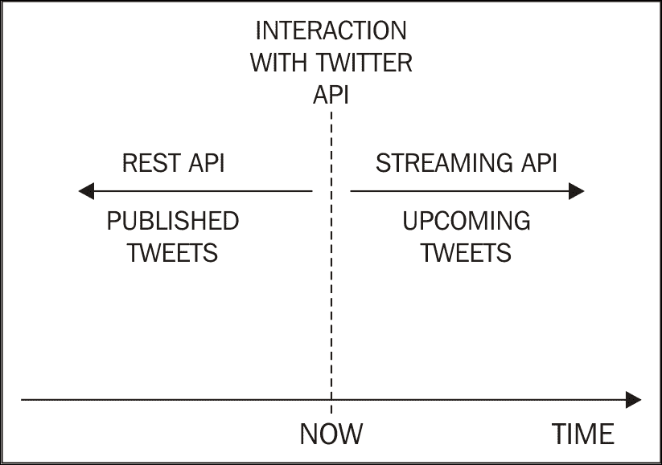
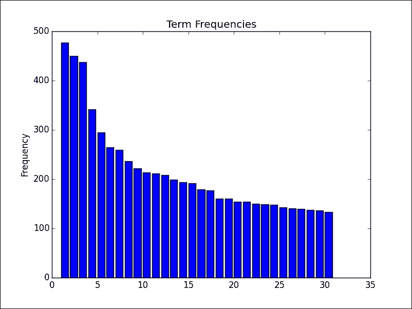
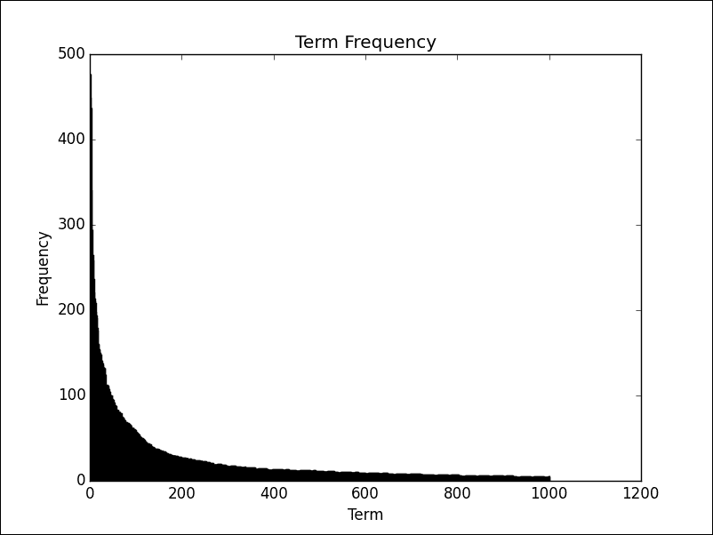
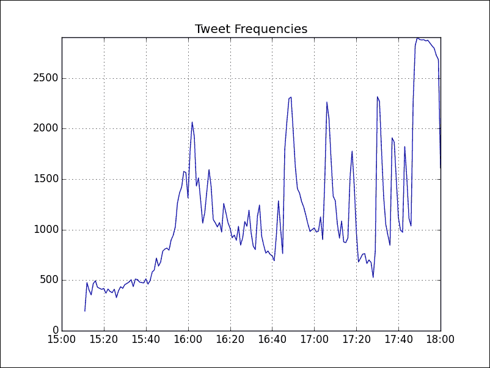

# 第二章。# miningtwetter–标签、主题和时间序列

这一章是关于推特上的数据挖掘。本章涵盖的主题包括以下内容:

*   使用 Tweepy 与推特应用编程接口交互
*   推特数据——推特的剖析
*   标记化和频率分析
*   推文中的标签和用户提及
*   时间序列分析

# 开始

推特是近年来最受欢迎的在线社交网络之一。他们提供的服务被称为*微博*，这是博客的一种变体，内容片段非常短——在推特的情况下，每条*推文*有 140 个字符的限制。与脸书等其他社交媒体平台不同，推特网络不是双向的，这意味着连接不必是相互的:你可以跟踪不跟着你回来的用户，反之亦然。

传统媒体正在采用社交媒体作为接触更广泛受众的方式，大多数名人都有一个推特账户与粉丝保持联系。用户实时讨论正在发生的事件，包括庆典、电视节目、体育赛事、政治选举等等。

Twitter 还负责推广使用 hashtag 这个术语，作为一种将对话分组并允许用户关注特定主题的方式。标签是以`#`符号为前缀的单个关键词，例如`#halloween`(用于展示万圣节服装的图片)或`#WaterOnMars`(在美国宇航局宣布他们在火星上发现水的证据后，这是一种趋势)。

考虑到用途的多样性，推特是数据挖掘者的潜在金矿，所以让我们开始吧。

# 推特应用编程接口

Twitter 提供了一系列 API 来提供对 Twitter 数据的编程访问，包括阅读推文、访问用户配置文件以及代表用户发布内容。

为了设置我们的项目来访问 Twitter 数据，有两个初步步骤，如下所示:

*   注册我们的应用程序
*   选择推特应用编程接口客户端

注册步骤需要几分钟时间。假设我们已经登录了我们的推特账户，我们所需要做的就是将浏览器指向位于[http://apps.twitter.com](http://apps.twitter.com)的应用程序管理页面，并创建新的应用程序。

应用注册后，在**密钥和访问令牌**选项卡下，我们可以找到验证应用所需的信息。**消费密钥**和**消费密钥**(也分别称为 **API 密钥**和 **API 密钥**)是您的应用程序的一个设置。**访问令牌**和**访问令牌密码**是您的用户帐户设置。您的应用程序可能会通过多个用户的访问令牌请求访问。这些设置的**访问级别**定义了应用程序在代表用户与推特交互时可以做什么:只读是更保守的选择，因为应用程序不允许发布任何内容或通过直接消息与其他用户交互。

## 费率限制

推特应用编程接口限制对应用程序的访问。这些限制是基于每个用户设置的，或者更准确地说，是基于每个访问令牌设置的。这意味着，当应用程序使用仅应用程序身份验证时，会对整个应用程序全局考虑速率限制；而使用每用户身份验证方法，应用程序可以提高对 API 的全局请求数量。

熟悉利率限制的概念很重要，在官方文档中有描述([https://dev.twitter.com/rest/public/rate-limiting](https://dev.twitter.com/rest/public/rate-limiting))。同样重要的是要考虑到不同的原料药有不同的速率限制([https://dev.twitter.com/rest/public/rate-limits](https://dev.twitter.com/rest/public/rate-limits))。

达到应用编程接口限制的含义是，推特将返回一条错误消息，而不是我们要求的数据。此外，如果我们继续对应用编程接口执行更多的请求，再次获得定期访问所需的时间将会增加，因为推特可能会将我们标记为潜在的滥用者。当我们的应用程序需要许多应用编程接口请求时，我们需要一种方法来避免这种情况。在 Python 中，`time`模块是标准库的一部分，它允许我们使用`time.sleep()`函数任意暂停代码执行。例如，伪代码如下:

```py
# Assume first_request() and second_request() are defined. 
# They are meant to perform an API request. 
import time 

first_request() 
time.sleep(10) 
second_request() 

```

在这种情况下，第二个请求将在第一个请求之后 10 秒执行(由`sleep()`参数指定)。

## 搜索与流

推特提供了不止一个应用编程接口。事实上，下一节将解释访问推特数据的方式不止一种。为了简单起见，我们可以将我们的选项分为两类:REST APIs 和 Streaming API:



图 2.1:搜索相对于流的时间维度

区别，总结在*图 2.1* 中，相当简单:所有的 REST APIs 只允许你回到时间。当通过 REST API 与 Twitter 交互时，我们可以搜索现有的推文事实上，也就是已经发布并可供搜索的推文。这些 API 通常会限制您可以检索的推文数量，不仅仅是上一节讨论的速率限制，还包括时间跨度。事实上，通常可以追溯到大约一周前，这意味着旧的推文不可检索。关于 REST API 要考虑的第二个方面是，这些通常是尽力而为，但它们不能保证提供在 Twitter 上发布的所有推文，因为一些推文可能无法搜索，或者只是稍微延迟就被索引了。

另一方面，流媒体应用编程接口着眼于未来。一旦我们打开一个连接，我们就可以保持它的打开，并及时前进。通过保持 HTTP 连接打开，我们可以检索所有符合我们过滤标准的推文，因为它们已经发布了。

一般来说，流媒体应用编程接口是下载大量推文的首选方式，因为与平台的交互仅限于保持其中一个连接打开。不利的一面是，以这种方式收集推文可能会更耗时，因为我们需要等待推文发布后才能收集。

总而言之，当我们想要搜索由特定用户创作的推文或者我们想要访问我们自己的时间线时，REST APIs 是有用的，而当我们想要过滤特定的关键词并下载大量关于它的推文(例如，直播事件)时，Streaming API 是有用的。

# 从推特收集数据

为了与推特应用编程接口交互，我们需要一个 Python 客户端来实现对应用编程接口本身的不同调用。从官方文档中我们可以看到有几个选项([https://dev.twitter.com/overview/api/twitter-libraries](https://dev.twitter.com/overview/api/twitter-libraries))。没有一个是由推特官方维护的，它们得到了开源社区的支持。虽然有几个选项可供选择，但其中一些几乎是等效的，因此我们将选择在这里使用 **Tweepy** ，因为它为不同的功能提供了更广泛的支持，并且得到了积极的维护。

可通过`pip`安装库:

```py
$ pip install tweepy==3.3.0 

```

### 型式

**Python 3 兼容性**

我们专门安装了 Tweepy 的 3.3 版本，因为 Tweepy 和 Python 3 的最新版本有一个问题，这阻止了在我们的 Python 3.4 环境中运行这些示例。在撰写本文时，该问题仍未解决，但很可能很快就会得到解决。

与推特应用编程接口交互的第一部分包括设置认证，如前一节所述。注册应用程序后，此时，您应该有一个消费者密钥、消费者秘密、访问令牌和访问令牌秘密。

为了促进应用程序逻辑和配置之间的分离，我们将凭证存储在环境变量中。为什么不把这些值硬编码成 Python 变量呢？这有几个原因，在十二因素应用宣言([http://12factor.net/config](http://12factor.net/config))中有很好的总结。使用环境存储配置细节与语言和操作系统无关。在不同部署之间更改配置(例如，使用个人凭据进行本地测试，使用公司帐户进行生产)不需要对代码库进行任何更改。此外，环境变量不会被意外地检查到您的源代码控制系统中，让每个人都看到。

在 Unix 环境中，如 Linux 或 macOS，如果您的 shell 是 Bash，您可以如下设置环境变量:

```py
$ export TWITTER_CONSUMER_KEY="your-consumer-key"

```

在 Windows 环境中，您可以从命令行设置变量，如下所示:

```py
$ set TWITTER_CONSUMER_KEY="your-consumer-key"

```

对于我们需要的所有四个变量，应该重复该命令。

一旦设置好环境，我们将把创建 Twitter 客户端的 Tweepy 调用包装成两个函数:一个函数读取环境变量并执行身份验证，另一个函数创建与 Twitter 接口所需的 API 对象:

```py
# Chap02-03/twitter_client.py 
import os 
import sys 
from tweepy import API 
from tweepy import OAuthHandler 

def get_twitter_auth(): 
  """Setup Twitter authentication. 

  Return: tweepy.OAuthHandler object 
  """ 
  try: 
    consumer_key = os.environ['TWITTER_CONSUMER_KEY'] 
    consumer_secret = os.environ['TWITTER_CONSUMER_SECRET'] 
    access_token = os.environ['TWITTER_ACCESS_TOKEN'] 
    access_secret = os.environ['TWITTER_ACCESS_SECRET'] 
  except KeyError: 
    sys.stderr.write("TWITTER_* environment variables not set\n") 
    sys.exit(1) 
  auth = OAuthHandler(consumer_key, consumer_secret) 
  auth.set_access_token(access_token, access_secret) 
  return auth 

def get_twitter_client(): 
  """Setup Twitter API client. 

  Return: tweepy.API object 
  """ 
  auth = get_twitter_auth() 
  client = API(auth) 
  return client 

```

`get_twitter_auth()`功能负责认证。`try/except`块显示了如何读取环境变量。`os`模块包含一个名为`os.environ`的字典，可以通过按键访问，就像普通字典一样。如果其中一个`TWITTER_*`环境变量丢失，试图访问密钥将引发`KeyError`异常，我们将捕获该异常以显示错误消息并退出应用程序。

这个函数由`get_twitter_client()`调用，用于创建`tweepy.API`的一个实例，用于与 Twitter 进行多种不同类型的交互。将逻辑分解为两个独立函数的原因是，身份验证代码也可以在流应用编程接口中重用，我们将在下面的章节中讨论。

## 从时间线获取推文

一旦客户端验证到位，我们就可以开始使用它来下载推文。

我们先来考虑一个简单的场景:如何获取自己家时间线的前十条推文:

```py
from tweepy import Cursor 
from twitter_client import get_twitter_client 

if __name__ == '__main__': 
  client = get_twitter_client() 

  for status in Cursor(client.home_timeline).items(10): 
    # Process a single status 
    print(status.text) 

```

作为推特用户，你的家庭时间线就是你登录推特时看到的屏幕。它包含一系列来自你选择关注的账户的推文，最近和有趣的推文在顶部。

前面的片段展示了如何使用`tweepy.Cursor`循环浏览你的家庭时间线的前十项。首先，我们需要导入先前定义的`Cursor`和`get_twitter_client`函数。在主模块中，我们将使用这个函数来创建客户端，它提供了对推特应用编程接口的访问。特别是`home_timeline`属性是我们访问自己家的时间线所需要的，这将是传递给`Cursor`的论点。

`tweepy.Cursor`是一个*可迭代的*对象，这意味着它提供了一个易于使用的接口来对不同的对象执行迭代和分页。在前面的例子中，它提供了一个最小的抽象，允许开发人员循环访问对象本身，而不用担心如何向推特应用编程接口发出请求。

### 型式

可重复

Python 中的 iterable 是一个能够一次返回一个成员的对象。Iterables 包括内置数据类型，如列表或字典，以及实现`__iter__()`或`__getitem__()`方法的任何类的对象。

迭代中使用的`status`变量代表`tweepy.Status`的一个实例，这是 Tweepy 用来包装状态(即推文)的模型。在前面的代码片段中，我们只使用了它的文本，但是这个对象有许多属性。这些都在*推文的结构*部分有描述。

不仅仅是在屏幕上打印文本，我们更希望存储我们从应用编程接口中检索到的推文，以便我们以后可以进行一些分析。

我们将重构前面的片段，从我们自己的主页时间线获取推文，这样我们就可以将 JSON 信息存储在一个文件中:

```py
# Chap02-03/twitter_get_home_timeline.py 
import json 
from tweepy import Cursor 
from twitter_client import get_twitter_client 

if __name__ == '__main__': 
  client = get_twitter_client() 

  with open('home_timeline.jsonl', 'w') as f: 
    for page in Cursor(client.home_timeline, count=200).pages(4): 
      for status in page: 
        f.write(json.dumps(status._json)+"\n") 

```

运行该代码将在几分钟内生成一个`home_timeline.jsonl`文件。

### 型式

**JSON 线路格式**

上例中的文件扩展名为`.jsonl`，而不仅仅是`.json`。事实上，该文件采用的是 **JSON Lines** 格式([http://jsonlines.org/](http://jsonlines.org/)，这意味着该文件的每一行都是有效的 JSON 文档。例如，试图用`json.loads()`加载该文件的全部内容将会引发`ValueError`，因为全部内容不是有效的 JSON 文档。相反，如果我们使用的函数期望有效的 JSON 文档，我们需要一次处理一行。

JSON Lines 格式特别适合大规模处理:许多大数据框架允许开发人员轻松地将输入文件分割成可以由不同工作人员并行处理的块。

在这段代码中，我们遍历了四个页面，包含 200 条推文，每个都在光标的`count`参数中声明。这样做的原因是推特给出的一个限制:我们只能从我们的主页时间表中检索最近的 800 条推文。

如果我们从特定的用户时间线检索推文，即使用`user_timeline`方法而不是`home_timeline`，则该限制增加到 3200 条。

让我们考虑以下脚本来获取特定的用户时间表:

```py
# Chap02-03/twitter_get_user_timeline.py 
import sys 
import json 
from tweepy import Cursor 
from twitter_client import get_twitter_client 

if __name__ == '__main__': 
  user = sys.argv[1] 
  client = get_twitter_client() 

  fname = "user_timeline_{}.jsonl".format(user) 

  with open(fname, 'w') as f: 
    for page in Cursor(client.user_timeline, screen_name=user,  
                       count=200).pages(16): 
      for status in page: 
        f.write(json.dumps(status._json)+"\n") 

```

要运行脚本，我们需要为用户的屏幕名称提供一个命令行参数。例如，要检索我的整个时间线(目前远低于 3200 条推文的限制)，我们将使用以下命令:

```py
$ python twitter_get_user_timeline.py marcobonzanini

```

由于我的时间线的流量相对较低，我们可以从 Packt Publishing 帐户中检索到更多的推文，`@PacktPub`:

```py
$ python twitter_get_user_timeline.py PacktPub

```

与我们在主页时间线中看到的类似，脚本将创建一个`.jsonl`文件，每行都有一个 JSON 文档。当我们达到 3200 的限制时，文件的大小大约是 10 Mb。

从概念上讲，获取用户时间线的代码与检索主时间线的代码非常相似。唯一的区别是用于指定我们感兴趣的用户的推特句柄的单一命令行参数。

到目前为止，我们通过 Tweepy 接口使用的单个推文的唯一属性是`_json`，它已经被用来存储原始的 JSON 响应。下一节讨论了推文的结构细节，然后继续讨论从推特获取数据的其他方法。

## 推文的结构

推文是一个复杂的对象。下表提供了其所有属性的列表及其含义的简要描述。特别是，特定推文的 API 响应内容完全包含在`_json`属性中，该属性被加载到 Python 字典中:

<colgroup><col> <col></colgroup> 
| **属性名称** | **描述** |
| `_json` | 这是一个状态为 JSON 响应的字典 |
| `author` | 这是推文作者的`tweepy.models.User`实例 |
| `contributors` | 如果启用了该功能，这是一个贡献者列表 |
| `coordinates` | 这是 GeoJSON 格式的坐标字典 |
| `created_at` | 这是推文创建时间的`datetime.datetime`实例 |
| `entities` | 这是一个关于网址、标签和推文中提及的词典 |
| `favorite_count` | 这是推文被支持的次数 |
| `favorited` | 这标志着经过身份验证的用户是否喜欢这条推文 |
| `geo` | 这些是坐标(不推荐使用，用`coordinates`代替) |
| `id` | 这是推文作为大整数的唯一标识 |
| `id_str` | 这是作为字符串的推文的唯一标识 |
| `in_reply_to_screen_name` | 这是推文回复状态的用户名 |
| `in_reply_to_status_id` | 这是推文回复状态的状态标识，大整数 |
| `in_reply_to_status_id_str` | 这是推文回复状态的状态标识，字符串形式 |
| `in_reply_to_user_id` | 这是推文回复状态的用户标识，大整数 |
| `in_reply_to_user_id_str` | 这是推文回复状态的用户标识，字符串形式 |
| `is_quote_status` | 这会标记该推文是否是引用(即包含另一条推文) |
| `lang` | 这是带有推文语言代码的字符串 |
| `place` | 这是推文所附地点的`tweepy.models.Place`实例 |
| `possibly_sensitive` | 这标志着推文是否包含可能含有敏感材料的网址 |
| `retweet_count` | 这是状态被转发的次数 |
| `retweeted` | 这标志着状态是否为转发 |
| `source` | 这是描述用于发布状态的工具的字符串 |
| `text` | 这是包含状态内容的字符串 |
| `truncated` | 这标志着状态是否被截断(例如，转发超过 140 个字符) |
| `user` | 这是推文作者的`tweepy.models.User`实例(已弃用，改用`author` |

持有一个标识的属性(例如，用户标识或推文标识)有一个对应的属性，相同的值作为一个字符串重复出现。这是必要的，因为一些编程语言(最著名的是 JavaScript)不能支持超过 53 位的数字，而 Twitter 使用 64 位数字。为了避免数字问题，推特推荐使用`*_str`属性。

我们可以看到，并非所有的属性都被转换成 Python 内置类型，如字符串或布尔值。事实上，一些复杂的对象，如用户配置文件，完全包含在应用编程接口响应中，Tweepy 负责将这些对象转换成合适的模型。

以下示例展示了 Packt Publishing 以原始 JSON 格式发布的推文示例，该格式由应用编程接口给出，可通过`_json`属性访问(为了简洁起见，省略了几个字段)。

首先，预期格式的创建日期如下:

```py
{ 
  "created_at": "Fri Oct 30 05:26:05 +0000 2015", 

```

`entities`属性是一个包含不同标签实体列表的字典。例如，`hashtags`元素显示给定推文中存在`#Python`标签。同样，我们有照片、网址和用户提及:

```py
  "entities": { 
    "hashtags": [ 
      { 
        "indices": [ 
          72, 
          79 
        ], 
        "text": "Python" 
      } 
    ], 
    "media": [ 
      { 
        "display_url": "pic.twitter.com/muZlMreJNk", 
        "id": 659964467430735872, 
        "id_str": "659964467430735872", 
        "indices": [ 
          80, 
          103 
        ], 
        "type": "photo", 
        "url": "https://t.co/muZlMreJNk" 
      } 
    ], 
    "symbols": [], 
    "urls": [ 
      { 
        "indices": [ 
          48, 
          71 
        ], 
        "url": "https://t.co/NaBNan3iVt" 
      } 
    ], 
    "user_mentions": [ 
      { 
        "id": 80589255, 
        "id_str": "80589255", 
        "indices": [ 
          33, 
          47 
        ], 
        "name": "Open Source Way", 
        "screen_name": "opensourceway" 
      } 
    ] 
  }, 

```

上表中很好地描述了以下属性，不需要太多信息就能理解。我们可以注意到这条推文的地理信息丢失了。我们还可以将之前关于实体的信息与`text`属性中存储的实际推文进行比较:

```py
  "favorite_count": 4, 
  "favorited": false, 
  "geo": null, 
  "id": 659964467539779584, 
  "id_str": "659964467539779584", 
  "lang": "en", 
  "retweet_count": 1, 
  "retweeted": false, 
  "text": "Top 3 open source Python IDEs by @opensourceway  
    https://t.co/NaBNan3iVt #Python https://t.co/muZlMreJNk", 

```

`user`属性是一个字典，表示发送推文的用户，在本例中为`@PacktPub`。如前所述，这是一个复杂的对象，所有与用户相关的信息都嵌入在推文中:

```py
  "user": { 
    "created_at": "Mon Dec 01 13:16:47 +0000 2008", 
    "description": "Providing books, eBooks, video tutorials, and  
      articles for IT developers, administrators, and users.", 
    "entities": { 
      "description": { 
        "urls": [] 
      }, 
      "url": { 
        "urls": [ 
          { 
            "display_url": "PacktPub.com", 
            "expanded_url": "http://www.PacktPub.com", 
            "indices": [ 
              0, 
              22 
            ], 
            "url": "http://t.co/vEPCgOu235" 
          } 
        ] 
      } 
    }, 
    "favourites_count": 548, 
    "followers_count": 10090, 
    "following": true, 
    "friends_count": 3578, 
    "id": 17778401, 
    "id_str": "17778401", 
    "lang": "en", 
    "location": "Birmingham, UK", 
    "name": "Packt Publishing", 
    "screen_name": "PacktPub", 
    "statuses_count": 10561, 
    "time_zone": "London", 
    "url": "http://t.co/vEPCgOu235", 
    "utc_offset": 0, 
    "verified": false 
  } 
} 

```

这个例子展示了分析推文时需要考虑的两个有趣的方面，如下所示:

*   实体已经被标记
*   用户配置文件是完全嵌入的

第一点意味着简化了实体分析，因为我们不需要显式搜索诸如哈希表、用户提及、嵌入的 URL 或媒体等实体，因为这些都是由 Twitter API 连同它们在文本中的偏移量(称为`indices`的属性)一起提供的。

第二点意味着我们不需要将用户配置文件信息存储在其他地方，然后通过例如外键来连接/合并数据。事实上，用户档案在每条推文中都会被重复复制。

### 型式

**处理非规范化数据**

嵌入冗余数据的方法与反规格化的概念有关。虽然规范化被认为是关系数据库设计中的良好实践，但是反规范化在大规模处理和属于宽 NoSQL 族的数据库中找到了它的作用。

这种方法背后的基本原理是，冗余存储用户配置文件所需的额外磁盘空间仅具有边际成本，而通过消除对连接/合并操作的需求而获得的收益(在性能方面)是可观的。

## 使用流应用编程接口

流式应用编程接口是在不超过速率限制的情况下获取大量数据的最受欢迎的方法之一。我们已经讨论了这个应用编程接口与其他 REST 应用编程接口的区别，特别是搜索应用编程接口，以及我们可能需要如何重新思考我们的应用程序与用户交互的方式。

在深入了解细节之前，值得看一下 Streaming API 的文档，了解它的特性([https://dev.twitter.com/streaming/overview](https://dev.twitter.com/streaming/overview))。

在本节中，我们将通过扩展 Tweepy 提供的默认`StreamListener`类来实现一个定制的流侦听器:

```py
# Chap02-03/twitter_streaming.py 
import sys 
import string 
import time 
from tweepy import Stream 
from tweepy.streaming import StreamListener 
from twitter_client import get_twitter_auth 

class CustomListener(StreamListener): 
  """Custom StreamListener for streaming Twitter data.""" 

  def __init__(self, fname): 
    safe_fname = format_filename(fname) 
    self.outfile = "stream_%s.jsonl" % safe_fname 

  def on_data(self, data): 
    try: 
      with open(self.outfile, 'a') as f: 
        f.write(data) 
        return True 
    except BaseException as e: 
      sys.stderr.write("Error on_data: {}\n".format(e)) 
      time.sleep(5) 
    return True 

  def on_error(self, status): 
    if status == 420: 
      sys.stderr.write("Rate limit exceeded\n") 
      return False 
    else: 
      sys.stderr.write("Error {}\n".format(status)) 
      return True 

def format_filename(fname): 
  """Convert fname into a safe string for a file name. 

  Return: string 
  """ 
  return ''.join(convert_valid(one_char) for one_char in fname) 

def convert_valid(one_char): 
  """Convert a character into '_' if "invalid". 

  Return: string 
  """ 
  valid_chars = "-_.%s%s" % (string.ascii_letters, string.digits) 
  if one_char in valid_chars: 
    return one_char 
  else: 
    return '_' 

if __name__ == '__main__': 
  query = sys.argv[1:] # list of CLI arguments 
  query_fname = ' '.join(query) # string 
  auth = get_twitter_auth() 
  twitter_stream = Stream(auth, CustomListener(query_fname)) 
  twitter_stream.filter(track=query, async=True) 

```

流逻辑的核心在`CustomListener`类中实现，扩展`StreamListener`并覆盖两个方法:`on_data()`和`on_error()`。这些是当数据通过并且应用编程接口给出错误时触发的处理程序。

这两种方法的返回类型都是布尔值:`True`继续流，而`False`停止执行。因此，仅在出现致命错误时返回`False`非常重要，这样应用程序就可以继续下载数据。这样，如果出现暂时的错误，比如我们这边的网络打嗝，或者来自 Twitter 的 HTTP 503 错误，这意味着服务暂时不可用(但很可能很快就会回来)，我们就可以避免杀死应用程序。

`on_error()`方法尤其会处理来自 Twitter 的显式错误。有关推特应用编程接口状态代码的完整列表，我们可以查看文档([https://dev.twitter.com/overview/api/response-codes](https://dev.twitter.com/overview/api/response-codes))。我们对`on_error()`方法的实现只有在出现错误 420 时才会停止执行，这意味着我们受到了 Twitter API 的速率限制。我们越是超过费率限制，就越需要等待才能再次使用该服务。因此，出于这个原因，最好停止下载并调查问题。其他所有错误都将简单地打印在`stderr`界面上。总的来说，这比只使用`print()`要好，所以如果需要，我们可以将错误输出重定向到特定的文件。更好的是，我们可以使用`logging`模块来构建一个适当的日志处理机制，但是这超出了本章的范围。

当数据通过时，调用`on_data()`方法。该功能只是将收到的数据存储在`.jsonl`文件中。该文件的每一行都将包含一条 JSON 格式的推文。一旦写入数据，我们将返回`True`继续执行。如果在这个过程中出现任何问题，我们将捕捉到任何异常，在`stderr`上打印一条消息，让应用程序休眠五秒钟，然后再次返回`True`继续执行。在异常情况下，短暂的睡眠只是为了防止偶尔的网络故障导致应用程序卡住。

`CustomListener`类使用一个助手来清理查询，并将其用于文件名。事实上，`format_filename()`函数遍历给定的字符串，一次一个字符，并使用`convert_valid()`函数将无效字符转换为下划线。在本文中，有效字符是三个符号-破折号、下划线和点(`-`、`_`和`.` )-ASCII 字母和数字。

当我们运行`twitter_streaming.py`脚本时，我们必须从命令行提供参数。这些参数由一个空格隔开，将是收听者下载推文时使用的关键词。

举个例子，我运行了脚本来捕捉关于 2015 年新西兰和澳大利亚之间的橄榄球世界杯决赛的推文([https://en.wikipedia.org/wiki/2015_Rugby_World_Cup](https://en.wikipedia.org/wiki/2015_Rugby_World_Cup))。推特上关注该事件的粉丝大多使用`#RWC2015`(在整个比赛中使用)和`#RWCFinal`(用于关注关于最后一天的对话)标签。我将这两个标签和术语`rugby`一起用作流监听器的搜索关键词:

```py
$ python twitter_streaming.py \#RWC2015 \#RWCFinal rugby

```

哈希符号`#`前的反斜杠是转义该字符所必需的，因为 shell 使用哈希来表示注释的开头。对字符进行转义可确保字符串正确传递给脚本。

赛事开球时间定于 2015 年 10 月 31 日<sup>日</sup>格林尼治标准时间 ( **格林尼治标准时间**)下午 4 点。在下午 3 点到 6 点之间运行脚本三个小时，已经产生了近 800 MB 的数据，总共有 20 多万条推文。事件发生后，推特上的讨论持续了一段时间，但在此期间收集的数据量足以进行一些有趣的分析。

# 分析推文-实体分析

这一部分是关于分析推文中的实体。我们将使用上一节收集的数据进行一些频率分析。对这些数据进行切片和切割将允许用户产生一些有趣的统计数据，这些数据可以用来获得对数据的一些见解并回答一些问题。

分析像标签这样的实体很有趣，因为这些注释是作者标记推文主题的明确方式。

我们从分析帕克特出版公司的推文开始。随着 Packt Publishing 对开源软件的支持和推广，我们有兴趣找到 Packt Publishing 经常提到的是什么样的技术。

以下脚本从用户时间线中提取标签，生成最常见标签的列表:

```py
# Chap02-03/twitter_hashtag_frequency.py 
import sys 
from collections import Counter 
import json 

def get_hashtags(tweet): 
  entities = tweet.get('entities', {}) 
  hashtags = entities.get('hashtags', []) 
  return [tag['text'].lower() for tag in hashtags] 

if __name__ == '__main__': 
  fname = sys.argv[1] 
  with open(fname, 'r') as f: 
    hashtags = Counter() 
    for line in f: 
      tweet = json.loads(line) 
      hashtags_in_tweet = get_hashtags(tweet) 
      hashtags.update(hashtags_in_tweet) 
    for tag, count in hashtags.most_common(20): 
      print("{}: {}".format(tag, count)) 

```

可以使用以下命令运行此代码:

```py
$ python twitter_hashtag_frequency.py user_timeline_PacktPub.jsonl

```

这里，`user_timeline_PacktPub.jsonl`是我们之前收集的 JSON Lines 文件。

这个脚本从命令行中获取一个`.jsonl`文件的名称作为参数，并一次一行地读取它的内容。由于每一行都包含一个 JSON 文档，它将文档加载到`tweet`变量中，并使用`get_hashtags()`助手函数提取一个标签列表。这些类型的实体存储在`hashtags`变量中，该变量被声明为`collections.Counter`，这是一种特殊类型的字典，用于计数可散列的对象——在我们的例子中是字符串。计数器将字符串作为字典的键，将它们各自的频率作为值。

作为`dict`的子类，`Counter`对象本身就是一个无序的集合。`most_common()`方法负责根据关键字的值(最频繁的第一个)对关键字进行排序，并返回一个`(key, value)`元组列表。

`get_hashtags()`助手功能负责从推文中检索标签列表。加载到字典中的整个推文是这个函数的唯一参数。如果推文中存在实体，字典将有一个`entities`键。由于这是可选的，我们不能直接访问`tweet['entities']`，因为这可能会引发`KeyError`，所以我们将使用`get()`函数，如果实体不存在，则指定一个空字典作为默认值。第二步包括从实体中获取标签。由于`entities`也是字典，`hashtags`键也是可选的，所以我们再次使用`get()`功能，但是这一次，如果没有 hashtag，我们会指定一个空列表作为默认值。最后，我们将使用列表理解来遍历标签，以便提取它们的文本。使用`lower()`将标签规范化，以强制文本小写，因此像`#Python`或`#PYTHON`这样的提及都将被分组到`#python`中。

运行脚本来分析 PacktPub 推文会产生以下输出:

```py
packt5dollar: 217
python: 138
skillup: 132
freelearning: 107
gamedev: 99
webdev: 96
angularjs: 83
bigdata: 73
javascript: 69
unity: 65
hadoop: 46
raspberrypi: 43
js: 37
pythonweek: 36
levelup: 35
r: 29
html5: 28
arduino: 27
node: 27
nationalcodingweek: 26

```

我们可以看到，PacktPub(比如`#packt5dollar`)有关于事件和促销的参考，但是大多数哈希表都提到了一种特定的技术，其中 Python 和 JavaScript 是推文最多的。

前面的脚本给出了 PacktPub 最常用的 hashtags 的概述，但是我们想深入一点。事实上，我们可以生成更多的描述性统计数据，让我们了解 Packt Publishing 是如何使用哈希表的:

```py
# Chap02-03/twitter_hashtag_stats.py 
import sys 
from collections import defaultdict 
import json 

def get_hashtags(tweet): 
  entities = tweet.get('entities', {}) 
  hashtags = entities.get('hashtags', []) 
  return [tag['text'].lower() for tag in hashtags] 

def usage(): 
  print("Usage:") 
  print("python {} <filename.jsonl>".format(sys.argv[0])) 

if __name__ == '__main__': 
  if len(sys.argv) != 2: 
    usage() 
    sys.exit(1) 
  fname = sys.argv[1] 
  with open(fname, 'r') as f: 
    hashtag_count = defaultdict(int) 
    for line in f: 
      tweet = json.loads(line) 
      hashtags_in_tweet = get_hashtags(tweet) 
      n_of_hashtags = len(hashtags_in_tweet) 
      hashtag_count[n_of_hashtags] += 1 

    tweets_with_hashtags = sum([count for n_of_tags, count in  
                               hashtag_count.items() if n_of_tags > 0]) 
    tweets_no_hashtags = hashtag_count[0] 
    tweets_total = tweets_no_hashtags + tweets_with_hashtags 
    tweets_with_hashtags_percent = "%.2f" % (tweets_with_hashtags  
                                             / tweets_total * 100) 
    tweets_no_hashtags_percent = "%.2f" % (tweets_no_hashtags /  
                                           tweets_total * 100) 
    print("{} tweets without hashtags  
          ({}%)".format(tweets_no_hashtags,  
          tweets_no_hashtags_percent)) 
    print("{} tweets with at least one hashtag  
          ({}%)".format(tweets_with_hashtags,  
          tweets_with_hashtags_percent)) 

    for tag_count, tweet_count in hashtag_count.items(): 
      if tag_count > 0: 
        percent_total = "%.2f" % (tweet_count / tweets_total *  
                                  100) 
        percent_elite = "%.2f" % (tweet_count /  
                                  tweets_with_hashtags * 100) 
        print("{} tweets with {} hashtags ({}% total, {}%  
              elite)".format(tweet_count, tag_count,  
              percent_total, percent_elite)) 

```

我们可以使用以下命令运行前面的脚本:

```py
$ python twitter_hashtag_stats.py user_timeline_PacktPub.jsonl

```

使用收集的数据，前一个命令将产生以下输出:

```py
1373 tweets without hashtags (42.91%)
1827 tweets with at least one hashtag (57.09%)
1029 tweets with 1 hashtags (32.16% total, 56.32% elite)
585 tweets with 2 hashtags (18.28% total, 32.02% elite)
181 tweets with 3 hashtags (5.66% total, 9.91% elite)
29 tweets with 4 hashtags (0.91% total, 1.59% elite)
2 tweets with 5 hashtags (0.06% total, 0.11% elite)
1 tweets with 7 hashtags (0.03% total, 0.05% elite)

```

我们可以看到，PacktPub 的大部分推文中至少有一个 hashtag，这证实了这类实体在人们通过 Twitter 交流方式中的重要性。

另一方面，hashtag 计数的细分显示，每条推文的 hashtag 数量并不大。大约 1%的推文有四个或更多的标签。对于这个细分，我们将观察到两个不同的百分比:第一个是根据推文总数计算的，而第二个是根据至少有一条推文的推文数量计算的(称为精英集)。

以类似的方式，我们可以观察到用户提及，如下所示:

```py
# Chap02-03/twitter_mention_frequency.py 
import sys 
from collections import Counter 
import json 

def get_mentions(tweet): 
  entities = tweet.get('entities', {}) 
  hashtags = entities.get('user_mentions', []) 
  return [tag['screen_name'] for tag in hashtags] 

if __name__ == '__main__': 
  fname = sys.argv[1] 
  with open(fname, 'r') as f: 
    users = Counter() 
    for line in f: 
      tweet = json.loads(line) 
      mentions_in_tweet = get_mentions(tweet) 
      users.update(mentions_in_tweet) 
    for user, count in users.most_common(20): 
      print("{}: {}".format(user, count)) 

```

可以使用以下命令运行该脚本:

```py
$ python twitter_mention_frequency.py user_timeline_PacktPub.jsonl

```

这将产生以下输出:

```py
PacktPub: 145
De_Mote: 15
antoniogarcia78: 11
dptech23: 10
platinumshore: 10
packtauthors: 9
neo4j: 9
Raspberry_Pi: 9
LucasUnplugged: 9
ccaraus: 8
gregturn: 8
ayayalar: 7
rvprasadTweet: 7
triqui: 7
rukku: 7
gileadslostson: 7
gringer_t: 7
kript: 7
zaherg: 6
otisg: 6

```

# 分析推文-文本分析

上一节分析了推文的实体字段。这为推文提供了有用的知识，因为这些实体是由推文作者明确策划的。这一部分将关注非结构化数据，即推文的原始文本。我们将讨论文本分析的各个方面，例如文本预处理和规范化，我们将对推文进行一些统计分析。在挖掘细节之前，我们将介绍一些术语。

**标记化**是预处理阶段的重要步骤之一。给定一个文本流(如推文状态)，标记化是将文本分解成称为标记的单个单元的过程。最简单的形式是，这些单位是单词，但我们也可以进行更复杂的标记化，处理短语、符号等。

标记化听起来是一项微不足道的任务，自然语言处理社区已经对其进行了广泛的研究。[第 1 章](1.html "Chapter 1.  Social Media, Social Data, and Python")、*社交媒体、社交数据、Python* 提供了这一领域的简介，并提到了 Twitter 是如何改变标记化规则的，因为一条推文的内容包括表情符号、标签、用户提及、URL，与标准英语有很大不同。为此，在使用**自然语言工具包** ( **NLTK** )库时，我们展示了`TweetTokenizer`类作为标记 Twitter 内容的工具。我们将在本章中再次使用这个工具。

另一个值得考虑的预处理步骤是**停词去除**。停止语是孤立地看待时不满足的词。这类词包括文章、命题、副词等。频率分析将显示这些词在任何数据集中通常是最常见的。虽然可以通过分析数据(例如，通过包含出现在超过任意百分比的文档中的单词，如 95%)来自动编译停止词列表，但通常情况下，更保守且仅使用常见的英语停止词是有好处的。NLTK 通过`nltk.corpus.stopwords`模块提供了一个常见的英语停止词列表。

停止词删除可以扩展到包括符号(如标点符号)或特定领域的词。在我们的推特上下文中，常见的停止词是术语**RT**(Retweet 的缩写)和 **via** ，通常用于提及被分享内容的作者。

最后，另一个重要的预处理步骤是归一化。这是一个总括术语，可以由几种类型的处理组成。一般来说，当我们需要在同一个单元中聚合不同的术语时，使用规范化。这里考虑的规范化的特例是**用例规范化**，其中每个术语都是小写的，这样原本大小写不同的字符串就会匹配(例如`'python' == 'Python'.lower()`)。执行案例规范化的优势在于，给定术语的频率将自动聚合，而不是分散到同一术语的不同变体中。

我们将使用以下脚本进行第一学期频率分析:

```py
# Chap02-03/twitter_term_frequency.py 
import sys 
import string 
import json 
from collections import Counter 
from nltk.tokenize import TweetTokenizer 
from nltk.corpus import stopwords 

def process(text, tokenizer=TweetTokenizer(), stopwords=[]): 
  """Process the text of a tweet: 
  - Lowercase 
  - Tokenize 
  - Stopword removal 
  - Digits removal 

  Return: list of strings 
  """ 
  text = text.lower() 
  tokens = tokenizer.tokenize(text) 
  return [tok for tok in tokens if tok not in stopwords and not  
          tok.isdigit()] 

if __name__ == '__main__': 
  fname = sys.argv[1] 
  tweet_tokenizer = TweetTokenizer() 
  punct = list(string.punctuation) 
  stopword_list = stopwords.words('english') + punct + ['rt',  
                                                        'via', '...'] 

  tf = Counter() 
  with open(fname, 'r') as f: 
    for line in f: 
      tweet = json.loads(line) 
      tokens = process(text=tweet['text'], 
               tokenizer=tweet_tokenizer, 
               stopwords=stopword_list) 
      tf.update(tokens) 
    for tag, count in tf.most_common(20): 
      print("{}: {}".format(tag, count)) 

```

预处理逻辑的核心由`process()`函数实现。该函数将字符串作为输入，并返回字符串列表作为输出。前面提到的所有预处理步骤，大小写规范化、标记化和停止词删除都在这里用几行代码实现。

该函数还接受两个可选参数:一个标记器，即实现`tokenize()`方法的对象和一个停止词列表，因此可以自定义停止词移除过程。当应用停止词移除时，该函数还会在字符串上使用`isdigit()`函数移除数字标记(例如，`'5'`或`'42'`)。

该脚本采用命令行参数对`.jsonl`文件进行分析。它初始化用于标记化的`TweetTokenizer`，然后定义一个停止词列表。这样的列表是由来自 NLTK 的常见英语终止词以及`string.punctuation`中定义的标点符号组成的。为了完成停止词列表，我们还包括`'rt'`、`'via'`和`'...'`标记(一个单字符的 Unicode 符号，代表一个水平省略号)。

可以使用以下命令运行该脚本:

```py
$ python twitter_term_frequency.py filename.jsonl

```

输出如下:

```py
free: 477
get: 450
today: 437
ebook: 342
http://t.co/wrmxoton95: 295
-: 265
save: 259
ebooks: 236
us: 222
http://t.co/ocxvjqbbiw: 214
#packt5dollar: 211
new: 208
data: 199
@packtpub: 194
': 192
hi: 179
titles: 177
we'll: 160
find: 160
guides: 154
videos: 154
sorry: 150
books: 149
thanks: 148
know: 143
book: 141
we're: 140
#python: 137
grab: 136
#skillup: 133

```

如我们所见，输出包含单词、标签、用户提及、网址和`string.punctuation`未捕获的 Unicode 符号的混合。关于额外的符号，我们可以简单地扩展停止词的列表来捕获这种类型的标点符号。关于标签和用户提及，这正是我们对`TweetTokenizer`的期望，因为所有这些标记都是有效的。也许我们没有预料到的是像`we're`和`we'll`这样的代币的存在，因为这些是两个独立代币的收缩形式，而不是单独的代币。如果缩略形式展开，在这两种情况下(*我们是*和*我们将*，我们所拥有的只是一系列的停止词，因为这些缩略形式通常是代词和常用动词。例如，维基百科上给出了英文缩写的完整列表。

处理英语这一方面的一种方法是将这些缩略词规范化为它们的扩展形式。例如，下面的函数获取一个令牌列表，并返回一个规范化的令牌列表(更准确地说，是一个生成器，因为我们正在使用`yield`关键字):

```py
def normalize_contractions(tokens): 
  token_map = { 
    "i'm": "i am", 
    "you're": "you are", 
    "it's": "it is", 
    "we're": "we are", 
    "we'll": "we will", 
  } 
  for tok in tokens: 
    if tok in token_map.keys(): 
      for item in token_map[tok].split(): 
        yield item 
    else: 
      yield tok 

```

让我们考虑来自交互式解释器的以下示例:

```py
>>> tokens = tokens = ["we're", "trying", "something"]
>>> list(normalize_contractions(tokens))
['we', 'are', 'trying', 'something']

```

这种方法的主要问题是需要手动指定我们正在处理的所有收缩。虽然这种缩写的数量有限，但将所有内容翻译成字典将是一项乏味的工作。此外，还有一些不容易处理的歧义，例如我们之前遇到的*we will*的情况:这种收缩可以映射到 *we will* 以及*we will*中，当然这个列表更长。

一种不同的方法是将这些标记视为停止词，因为在规范化之后，它们的所有组成部分似乎都是停止词。

最佳行动方案可能取决于您的应用程序，因此关键问题是在`process()`函数中形式化的预处理步骤之后会发生什么。目前，我们还可以保持预处理不变，不需要明确处理收缩。

### 型式

**产量和发电机**

`normalize_contractions()`功能使用`yield`关键字代替`return`。这个关键字用来产生一个*生成器*，这是一个你只能迭代一次的迭代器，因为它不把它的项目存储在内存中，而是动态生成它们。优点之一是减少内存消耗，因此建议在大对象上迭代。关键字还允许在同一个函数调用中生成多个项目，而`return`将在调用后立即关闭计算(例如，`normalize_contractions()`中的`for`循环将仅在第一个令牌上运行)。

最后，我们将从不同的角度来分析术语和实体频率。

给定在`twitter_hashtag_frequency.py`和`twitter_term_frequency.py`中显示的源代码，我们可以通过实现一个简单的图来扩展这些脚本，而不是打印出最常见术语的频率:

```py
# Chap02-03/twitter_term_frequency_graph.py 
y = [count for tag, count in tf.most_common(30)] 
x = range(1, len(y)+1) 

plt.bar(x, y) 
plt.title("Term Frequencies") 
plt.ylabel("Frequency") 
plt.savefig('term_distribution.png') 

```

前面的片段展示了如何从`twitter_term_frequency.py`开始绘制术语频率；也很容易将其应用于 hashtag 频率。在`@PacktPub`对推文运行脚本后，您将创建看起来像*图 2.2* 的`term_distribution.png`文件:



图 2.2:最近@PacktPub 推文中术语的出现频率

上图没有报告术语本身，因为最后一个分析的重点是频率分布。从图中我们可以看到，左边有几个出现频率非常高的词条，比如最频繁的词条比位置 **10** 左右之后的词条出现频率高出一倍。当我们向图的右侧移动时，曲线变得不那么陡峭，这意味着右侧的术语共享相似的频率。

稍加修改，如果我们使用`most_common(1000)`(即最频繁出现的 1000 个术语)重新运行相同的代码，我们可以更清晰地观察到这一现象，如图*图 2.3* :



图 2.3:1000 个最常见术语在@PacktPub 推文中出现的频率

我们可以在*图 2.3* 中观察到的曲线代表了一个**幂律**([https://en.wikipedia.org/wiki/Power_law](https://en.wikipedia.org/wiki/Power_law))的近似值。在统计学中，幂律是两个量之间的函数关系；在这种情况下，术语的频率及其在按频率排列的术语排名中的位置。这种类型的分布总是呈现出**长尾**([https://en.wikipedia.org/wiki/Long_tail](https://en.wikipedia.org/wiki/Long_tail))，也就是说有一小部分频繁项主导分布，而有大量频率较小的项。这种现象的另一个名称是 **80-20 规则**或**帕累托原则**([https://en.wikipedia.org/wiki/Pareto_principle](https://en.wikipedia.org/wiki/Pareto_principle))，它指出大约 80%的影响来自 20%的原因(在我们的上下文中，20%的独特术语占所有术语出现的 80%)。

几十年前，美国语言学家乔治·齐夫推广了如今被称为**齐夫定律**([https://en.wikipedia.org/wiki/Zipf%27s_law](https://en.wikipedia.org/wiki/Zipf%27s_law))。这个经验定律指出，给定一组文档，任何单词的出现频率都与其在频率表中的排名成反比。换句话说，最频繁出现的单词将是第二频繁出现的单词的两倍，第三频繁出现的单词的三倍，以此类推。实际上，这个定律描述的是一种趋势，而不是精确的频率。有趣的是，齐夫定律可以推广到许多不同的自然语言，以及许多与语言无关的社会科学排名研究。

# 分析推文-时间序列分析

前面几节分析了推文的内容。在本节中，我们将讨论分析推特数据的另一个有趣的方面——推特随时间的分布。

一般来说，时间序列是由给定时间间隔内的连续观测值组成的数据点序列。由于推特提供了一个带有推文精确时间戳的`created_at`字段，我们可以将推文重新排列成时间桶，这样我们就可以检查用户对实时事件的反应。我们感兴趣的是观察用户群是如何发推的，而不仅仅是单个用户，因此通过流应用编程接口收集的数据最适合这种类型的分析。

本节的分析使用了 2015 年橄榄球世界杯决赛的数据集。这是一个很好的例子，说明了用户对实时事件的反应，如体育赛事、音乐会、政治选举以及从重大灾难到电视节目的一切。推特数据时间序列分析的其他应用是在线声誉管理。事实上，一家公司可能有兴趣监控用户(可能是客户)在社交媒体上对他们的评论，推特的动态特性似乎非常适合跟踪对产品新闻发布的反应。

我们将利用熊猫的能力来操纵时间序列，我们将再次使用 matplotlib 对该序列进行可视化解释:

```py
# Chap02-03/twitter_time_series.py 
import sys 
import json 
from datetime import datetime 
import matplotlib.pyplot as plt 
import matplotlib.dates as mdates 

import pandas as pd 
import numpy as np 
import pickle 

if __name__ == '__main__': 
  fname = sys.argv[1] 

  with open(fname, 'r') as f: 
    all_dates = [] 
    for line in f: 
      tweet = json.loads(line) 
      all_dates.append(tweet.get('created_at')) 
    idx = pd.DatetimeIndex(all_dates) 
    ones = np.ones(len(all_dates)) 
    # the actual series (at series of 1s for the moment) 
    my_series = pd.Series(ones, index=idx) 

    # Resampling / bucketing into 1-minute buckets 
    per_minute = my_series.resample('1Min', how='sum').fillna(0) 

    # Plotting the series 
    fig, ax = plt.subplots() 
    ax.grid(True) 
    ax.set_title("Tweet Frequencies") 

    hours = mdates.MinuteLocator(interval=20) 
    date_formatter = mdates.DateFormatter('%H:%M') 

    datemin = datetime(2015, 10, 31, 15, 0) 
    datemax = datetime(2015, 10, 31, 18, 0) 

    ax.xaxis.set_major_locator(hours) 
    ax.xaxis.set_major_formatter(date_formatter) 
    ax.set_xlim(datemin, datemax) 
    max_freq = per_minute.max() 
    ax.set_ylim(0, max_freq) 
    ax.plot(per_minute.index, per_minute) 

    plt.savefig('tweet_time_series.png') 

```

可以使用以下命令运行代码:

```py
$ python twitter_time_series.py stream__RWC2015__RWCFinal_Rugby.jsonl

```

该脚本读取作为命令行参数给出的`.jsonl`文件，按照前面脚本中的讨论，一次加载一行推文。因为我们只对推文的发布日期感兴趣，所以我们构建了一个列表`all_dates`，它只包含每条推文的`created_at`属性。

熊猫系列由创建时间索引，创建时间在`idx`变量中表示为之前收集的日期的`pd.DatetimeIndex`。这些日期的粒度可以追溯到第二个。然后，我们使用`ones()`功能创建`np.array`1，该功能将用于聚合推文频率。

一旦系列被创建，我们使用一种称为分时段或重采样的技术，这基本上改变了我们索引系列的方式，在这种情况下，每分钟将推文分组。当我们指定通过`sum`重新采样时，每个桶将包含在该特定分钟发布的推文计数。重采样结束时追加的`fillna(0)`调用只是一个预防措施，以防某个桶没有任何推文；在这种情况下，桶不会被丢弃，而是包含 0 作为频率。考虑到我们数据集的大小，这不太可能发生，但对于较小的数据来说，这是一个真正的可能性。

为了阐明重采样会发生什么，我们可以观察下面的例子，通过打印`my_series.head()`和`per_minute.head()`获得:

```py
# Before resampling 
# my_series.head() 
2015-10-31 15:11:32  1 
2015-10-31 15:11:32  1 
2015-10-31 15:11:32  1 
2015-10-31 15:11:32  1 
2015-10-31 15:11:32  1 
dtype: float64 
# After resampling 
# per_minute.head() 
2015-10-31 15:11:00  195 
2015-10-31 15:12:00  476 
2015-10-31 15:13:00  402 
2015-10-31 15:14:00  355 
2015-10-31 15:15:00  466 
dtype: float64

```

输出的第一列包含序列索引，它是`datetime`对象(时间精度低至秒)，而第二列是与该索引相关联的值(频率)。

由于每秒钟有大量的推文，原始系列`my_series`多次显示相同的索引(在示例中为`15:11:32`)。一旦序列被重新采样，序列索引的粒度就下降到一分钟。

下面的代码使用 matplotlib 库来创建时间序列的可视化。Matplotlib 通常比其他数据分析库更详细，但并不复杂。这个例子中有趣的部分是使用`MinuteLocator`和`DateFormatter`来正确标注 *x* 轴上的时间间隔。在这种情况下，使用 20 分钟的时间间隔。

剧情保存在`tweet_time_series.png`中，我们可以在*图 2.4* 中观察到:



图 2.4:2015 年橄榄球世界杯决赛期间的推文频率

*图 2.4* 中时间戳的时区为 GMT，即英国时间。决赛的开球时间定在下午 4 点。正如我们所看到的，随着我们越来越接近开球时间，用户活动有所增加，比赛开始后不久就出现了一个高峰。很少有超过每分钟 2000 条推文的高峰是这场比赛的一些热门时刻——首先，新西兰遥遥领先，澳大利亚接近复出(对中立球迷来说，这是一场有趣的比赛)。最后一个巨大的高峰与比赛结束、颁奖仪式和持续了一段时间的庆祝活动相一致(尽管人流在下午 6 点左右停止)。

# 总结

本章介绍了一些使用推特数据的数据挖掘应用。我们讨论了如何向推特平台注册一个应用程序，以便获得凭证并与推特应用程序接口进行交互。我们考虑了下载推文的不同方式，特别是使用 REST 端点搜索已发布的推文，以及使用 Streaming API 保持连接打开并收集即将发布的推文。

在观察一条推文的解剖结构时，我们发现一条推文要比 140 个字符多得多。事实上，它是一个复杂的物体，里面有很多信息。

我们分析的起点开启了基于实体的频率分析的讨论。我们的重点一直放在 hashtags 上，这是 Twitter 的特性之一，被用户广泛采用来跟踪特定的主题。我们还讨论了**自然语言处理** ( **自然语言处理**)的一些方面，例如标记化和标记规范化。正如我们所看到的，推特上的语言没有遵循标准英语的惯例，有特定的特征，如标签、用户提及、网址、表情符号等。另一方面，我们发现推特上的语言遵循一个被称为齐夫定律的统计规则，就像任何其他大小合适的自然语言语料库一样。

为了总结我们的分析，我们看了看时间序列。观察用户对实时事件的反应非常有趣，时间序列分析可以成为分析大型数据集的强大工具。

下一章也是关于推特的，但重点是用户。特别是，我们想了解连接到这个社交网络的用户。