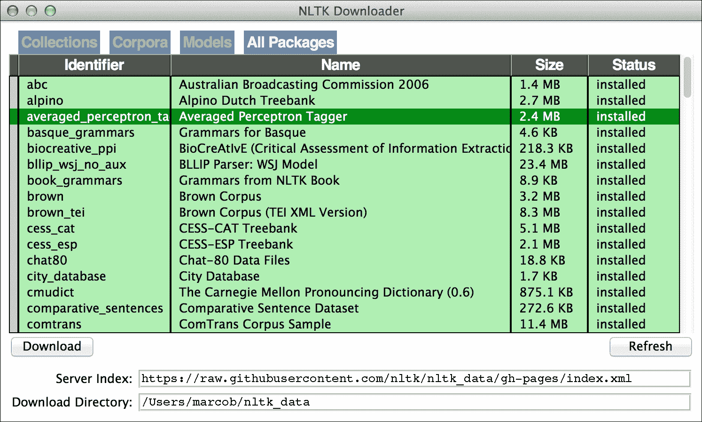
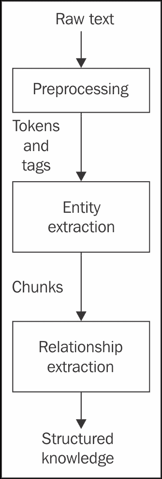
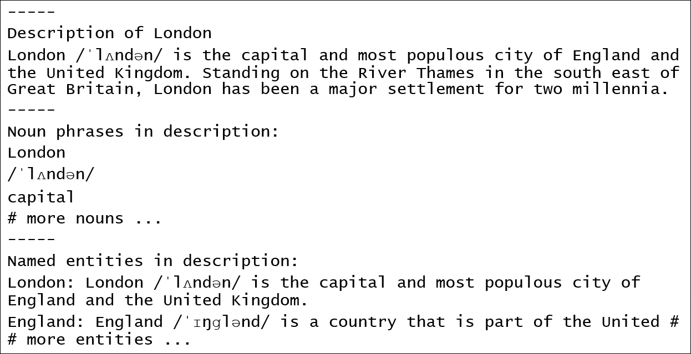

# 第七章。博客、RSS、维基百科和自然语言处理

本章重点介绍自然语言处理领域**自然语言处理** ( **自然语言处理**)。在深入了解 NLP 的细节之前，我们将分析一些从 Web 下载文本数据的选项。

在本章中，我们将讨论以下主题:

*   如何与 WordPress.com 和博主互动
*   网页提要格式(RSS 和 Atom)及其使用
*   如何以 JSON 格式存储来自博客的数据
*   如何与维基百科应用编程接口交互来搜索实体信息
*   自然语言处理的核心概念，特别是关于文本预处理
*   如何处理文本数据以识别文本中提到的实体

# 博客和 NLP

博客(博客的简称)如今是网络的重要组成部分，也是一个极具吸引力的社交媒体平台。博客被公司、专业人士和业余爱好者用来接触观众，推广产品和服务，或者只是讨论一个有趣的话题。由于网络出版工具和服务的丰富，使得非技术用户很容易发布他们的内容，建立个人博客只需几分钟。

从数据挖掘者的角度来看，博客是实践文本挖掘的完美平台。本章主要关注两个主题:如何从博客中获取文本数据，以及如何对这些数据应用自然语言处理。

虽然自然语言处理是一个复杂的领域，不仅仅是一本入门的书，我们正在采取务实的方法，用实际的例子介绍基本理论。

# 从博客和网站获取数据

考虑到有大量有趣文章的网站，找到文本数据来挖掘应该不是一个大问题。手动地，一次保存一篇文章显然不能很好地扩展，所以在这一节中，我们将讨论一些机会来自动化从网站获取数据的过程。

首先，我们将讨论两个流行的免费博客服务，WordPress.com 和博主，它们提供了一个方便的应用编程接口来与他们的平台交互。其次，我们将介绍 RSS 和 Atom 网络标准，许多博客和新闻出版商使用这些标准以一种易于电脑阅读的格式广播他们的内容。最后，我们将简要讨论更多可能的选择，例如连接到维基百科，或者在没有其他选择的情况下，将网页抓取作为最后手段。

## 使用 WordPress.com 空气污染指数

WordPress 是一家博客和网络托管提供商，由开源 WordPress 软件提供支持。该服务为注册用户提供免费博客托管，以及付费升级和额外付费服务。对于只想阅读和评论博客文章的用户，不需要注册，除非博客所有者另有规定(这意味着博客可以被其所有者标记为私有)。

### 型式

**WordPress.com 和 WordPress.org**

新的 WordPress 用户经常被这种差异所迷惑。开源 WordPress 软件是通过 WordPress 开发和发布的；您可以下载软件的副本，并将其安装在自己的服务器上。另一方面，WordPress.com 是一家主机提供商，为不想自己安装软件和处理服务器配置方面问题的用户提供现成的解决方案。WordPress.com 博客的域名通常是`blog-name.wordpress.com`形式，除非博客所有者为域名付费。

本节中讨论的 API 是由 WordPress.com 提供的，因此我们可以通过它访问的数据是由该提供商托管的数据。

Python 客户端对 WordPress.com 应用编程接口的支持并不是特别完善。这给我们留下了直接与 API 交互的选项([https://developer.wordpress.com/docs/api](https://developer.wordpress.com/docs/api))，或者换句话说，编写我们自己的客户端。

幸运的是，这项任务所需的努力并不是压倒性的，而**请求** Python 库通过提供一个简单的接口来处理 HTTP 端，让我们的生活稍微轻松了一点。我们将使用它来设置对 WordPress.com API 的一系列调用，目的是从特定的域下载一些博客文章。

第一步是在我们的虚拟环境中安装库:

```py
$ pip install requests

```

第二步是查看文档，尤其是`/sites/$site/posts`端点的文档。

以下脚本定义了`get_posts()`函数，该函数旨在查询 WordPress.com 应用编程接口并根据需要处理分页:

```py
# Chap07/blogs_wp_get_posts.py 
import json 
from argparse import ArgumentParser 
import requests 

API_BASE_URL = 'https://public-api.wordpress.com/rest/v1.1' 

def get_parser(): 
  parser = ArgumentParser() 
  parser.add_argument('--domain') 
  parser.add_argument('--posts', type=int, default=20) 
  parser.add_argument('--output') 
  return parser 

def get_posts(domain, n_posts=20): 
  url = "{}/sites/{}/posts".format(API_BASE_URL, domain) 
  next_page = None 
  posts = [] 
  while len(posts) <= n_posts: 
    payload = {'page_handle': next_page} 
    response = requests.get(url, params=payload) 
    response_data = response.json() 
    for post in response_data['posts']: 
      posts.append(post) 
    next_page = response_data['meta'].get('next_page', None) 
    if not next_page: 
      break 
  return posts[:n_posts] 

if __name__ == '__main__': 
  parser = get_parser() 
  args = parser.parse_args() 

  posts = get_posts(args.domain, args.posts) 

  with open(args.output, 'w') as f: 
    for i, post in enumerate(posts): 
      f.write(json.dumps(post)+"\n") 

```

脚本使用`ArgumentParser`接受命令行参数。它需要两个强制参数:`--domain`设置我们从中检索数据的博客，`--output`设置 JSON Lines 文件的名称。可选地，我们可以提供一个`--posts`参数，默认设置为`20`，来决定我们从给定的域中检索的帖子数量。

域是给定博客的完整网址，例如`your-blog-name.wordpress.com`。

例如，我们可以使用以下命令运行脚本:

```py
$ python blogs_wp_get_posts.py \
 --domain marcobonzanini.com \
 --output posts.marcobonzanini.com.jsonl \
 --posts 100

```

几秒钟后，脚本生成一个每行一篇文章的 JSON Lines 文件，该文件以 JSON 格式表示。

在描述输出的格式之前，我们先详细分析一下`get_posts()`函数，这是我们脚本的核心。该函数接受两个参数:博客的`domain`和我们想要检索的帖子数量`n_posts`，默认为`20`。

首先，该函数为相关的 API 端点定义了 URL，并初始化了`next_page`变量，这对于遍历多页结果非常有用。默认情况下，应用编程接口每页返回 20 个结果(20 篇博客文章)，因此如果博客包含的内容超过这个数量，我们将需要遍历几个页面。

该函数的核心是`while`循环，用于一次检索一页结果。使用 GET 方法调用 API 端点，它接受文档中定义的几个参数。`page_handle`参数是我们可以用来指定我们感兴趣的结果页面。在第一次迭代时，这个变量的值是`None`，所以检索从头开始。使用`response.json()`方法以 JSON 格式返回的响应数据包含一个帖子列表`response_data['posts']`，以及一些关于请求的元数据，存储在`response_data['meta']`中。如果下一页结果可用，元数据字典将包含一个`next_page`键。如果该键不存在，我们将设置为`None`。

循环要么在没有`next_page`时停止，这意味着我们已经下载了所有可用的帖子，要么在我们已经达到足够的帖子时停止，如`n_posts`中所声明的。最后，我们将返回帖子的切片列表。如果期望的帖子数量`n_posts`不是页面大小的倍数，切片是必要的。例如，如果我们指定 30 作为期望的帖子数量，脚本将下载两个页面，每个页面有 20 个帖子，因此需要切片来删除最后 10 个没有被请求的条目。

每个 post 对象由下表中列出的属性定义:

<colgroup><col> <col></colgroup> 
| **属性** | **描述** |
| `ID` | 这是博客中帖子的标识 |
| `URL` | 这是文章的完整网址 |
| `attachment_count` | 这是附件(例如，媒体文件等)的数量 |
| `attachments` | 这是附件对象的列表 |
| `author` | 这是作者的简介对象，包括全名、登录名、头像、gravatar 简介 URL 等等 |
| `categories` | 这是分配给此帖子的类别列表 |
| `content` | 这是帖子的全部内容，包括 HTML 标记 |
| `date` | 这是 ISO 8601 格式的出版日期 |
| `discussion` | 这是关于评论、pings 等的信息 |
| `excerpt` | 这是对帖子的简短总结，通常是前几个句子 |
| `feature_image` | 这是要素图像的网址(如果有) |
| `global_ID` | 这是这个帖子的全局 ID |
| `guid` | 这是博客域和帖子标识组合成一个有效的网址 |
| `i_like` | 这将通知登录用户是否喜欢这篇文章 |
| `is_following` | 这将通知登录用户是否在关注博客 |
| `is_reblogged` | 这将通知登录用户是否已重新登录此帖子 |
| `like_count` | 这是喜欢这篇文章的用户数量 |
| `meta` | 这是来自 API 的元数据，例如，用于自动 API 发现的超媒体链接，等等 |
| `modified` | 这是 ISO 8601 格式的最后一次修改日期 |
| `short_url` | 这是社交媒体和移动分享的短 URL ( [http://wp.me](http://wp.me) |
| `site_ID` | 这是博客的 ID |
| `slug` | 这是这篇文章的要点 |
| `status` | 这是此帖子的当前状态，例如，已发布、草稿、待定等 |
| `sticky` | 这将告知帖子是否有粘性(无论发布日期如何，都显示在顶部) |
| `tags` | 这是与帖子相关的标签列表 |
| `title` | 这是帖子的标题 |

我们可以看到，博客文章的结构比内容复杂得多，但就本章而言，我们将主要关注文本内容，包括标题和摘录。

## 使用博主 API

Blogger 是另一种流行的博客发布服务，早在 2003 年就被谷歌收购了。Blogger 托管的博客一般都在`blogspot.com`的一个子域，例如`your-blog-name.blogspot.com`。特定国家/地区域也适用于多个国家/地区(例如，英国的`blogspot.co.uk`，这意味着来自特定国家/地区的用户会以透明的方式被重定向到指定的域。

作为谷歌的一部分，账户管理是集中的，这意味着一旦用户注册了他们的谷歌账户，他们就可以自动访问博客。博主 API 也是如此；作为开发人员，我们可以通过谷歌开发人员控制台([https://console.developers.google.com/start](https://console.developers.google.com/start))访问它，就像我们在[第 5 章](5.html "Chapter 5.  Topic Analysis on Google+")、*关于谷歌+* 的主题分析中为谷歌+所做的那样，我们已经看到了创建一个需要访问(任何)谷歌 API 的项目的过程。我们可以重用同一个项目，并从开发人员控制台启用博客应用编程接口，或者我们可以从头开始创建一个新项目。这些步骤可以参考[第五章](5.html "Chapter 5.  Topic Analysis on Google+")、*谷歌+* 上的话题分析中给出的描述。不管怎样，重要的部分是*为我们的项目*启用博主应用编程接口，否则我们将无法编程访问它。

在处理谷歌 Plus 应用编程接口时，我们还讨论了访问密钥的创建，特别是服务器密钥，这也是我们访问博客应用编程接口所需的。如果我们按照从[第 5 章](5.html "Chapter 5.  Topic Analysis on Google+")、*谷歌+* 上的主题分析开始的步骤，我们应该已经有了一个可用的服务器密钥，可以存储为环境变量:

```py
$ export GOOGLE_API_KEY="your-api-key-here"

```

就客户端库而言，我们使用的客户端库与我们在[第 5 章](5.html "Chapter 5.  Topic Analysis on Google+")、*谷歌+* 上的主题分析中使用的客户端库相同，因为它是所有谷歌应用编程接口的通用接口。如果我们还没有安装，我们可以使用`pip`将其添加到我们的虚拟环境中:

```py
$ pip install google-api-python-client

```

一旦环境都设置好了，我们就可以开始编写与 Blogger API 交互的脚本，以便从给定的博客下载一些帖子:

```py
# Chap07/blogs_blogger_get_posts.py 
import os 
import json 
from argparse import ArgumentParser 
from apiclient.discovery import build 

def get_parser(): 
  parser = ArgumentParser() 
  parser.add_argument('--url') 
  parser.add_argument('--posts', type=int, default=20) 
  parser.add_argument('--output') 
  return parser 

class BloggerClient(object): 

  def __init__(self, api_key): 
    self.service = build('blogger', 
                         'v3', 
                         developerKey=api_key) 

  def get_posts(self, blog_url, n_posts): 
    blog_service = self.service.blogs() 
    blog = blog_service.getByUrl(url=blog_url).execute() 
    posts = self.service.posts() 
    request = posts.list(blogId=blog['id']) 
    all_posts = [] 
    while request and len(all_posts) <= n_posts: 
      posts_doc = request.execute() 
      try: 
        for post in posts_doc['items']: 
          all_posts.append(post) 
      except KeyError: 
        break 
      request = posts.list_next(request, posts_doc) 
    return all_posts[:n_posts] 

if __name__ == '__main__': 
  api_key = os.environ.get('GOOGLE_API_KEY') 
  parser = get_parser() 
  args = parser.parse_args() 

  blogger = BloggerClient(api_key) 

  posts = blogger.get_posts(args.url, args.posts) 

  with open(args.output, 'w') as f: 
    for post in posts: 
      f.write(json.dumps(post)+"\n") 

```

协调与所有谷歌应用编程接口交互的谷歌应用编程接口客户端有一个服务构建器的概念，一种用于构建服务对象的工厂方法，我们将使用它来查询应用编程接口。为了提供一个易于使用的接口，我们将创建一个`BloggerClient`类，处理持有 API 键、设置服务对象和提供`get_posts()`函数，非常类似于我们为 WordPress.com API 定义的函数。

该脚本像往常一样使用`ArgumentParser`，可以通过三个参数从命令行调用，如下所示:

```py
$ python blogs_blogger_get_posts.py \
 --url http://googleresearch.blogspot.co.uk \
 --posts 50 \
 --output posts.googleresearch.jsonl

```

类似于 WordPress.com 的例子，我们使用`--posts`和`--output`参数分别定义期望的帖子数量和输出文件的名称。与前面的例子不同，`--url`参数要求给定的字符串是博客的完整网址，而不仅仅是域名(这意味着它包括首字母`http://`)。使用前面的命令，几分钟后，我们将从谷歌研究博客获得最后 50 篇文章。

深入查看`BloggerClient`类，构造函数只接受一个参数，这是在 Google Developers Console 上注册我们的应用程序时获得的开发者的 API 密钥。用于设置具有`build()`工厂功能的`service`对象。值得注意的是，我们使用的是 API 的第三个版本`v3`，所以在参考文档时，这个细节很重要。

`get_posts()`方法做艰苦的工作。布局非常类似于为 WordPress.com 应用编程接口定义的`get_posts()`函数，有两个参数，博客网址和期望的文章数量。

与 WordPress.com 应用编程接口不同，博客应用编程接口首先需要一个博客对象，所以我们需要将网址转换成数字标识。这是通过使用`self.service.blogs()`创建的对象的`getByUrl()`方法来执行的。

另一个有趣的区别是，对大多数服务函数的调用不会直接触发 API 调用，类似于延迟评估的函数，因此我们需要显式调用一个`execute()`方法来执行 API 请求并获得响应。

`request.execute()`调用创建`posts_doc`对象，该对象可能包含也可能不包含`items`键(帖子列表)。将其包装到`try/except`块中可以确保，如果某个特定的调用没有帖子，迭代会随着中断调用而停止，而不会产生任何错误。

一旦达到期望的帖子数量，或者没有其他页面可用，就使用切片技术返回帖子列表。

Blogger API 返回的 JSON 文档比 WordPress.com 的文档简单，但是所有的关键属性都存在。下表总结了每个帖子的主要属性:

<colgroup><col> <col></colgroup> 
| **属性** | **描述** |
| `author` | 这是代表文章作者的对象，带有显示名称、用户标识、个人资料图像和网址 |
| `blog` | 这是表示博客本身的对象(例如，带有标识) |
| `content` | 这是帖子的完整内容，包括 HTML 格式 |
| `id` | 这是帖子的 ID |
| `labels` | 这是与帖子相关联的标签列表 |
| `published` | 这是 ISO 8601 格式的出版日期 |
| `replies` | 这是代表帖子上的评论/回复的对象 |
| `selfLink` | 这是基于 API 的帖子链接 |
| `title` | 这是帖子的标题 |
| `updated` | 这是上次以 ISO 8601 格式更新的日期 |
| `url` | 这是文章的网址 |

同样在这种情况下，有比帖子内容更有趣的信息，但文本数据是我们在这一章的重点。

## 解析 RSS 和 Atom 提要

许多博客，一般来说，许多网站，以标准格式提供内容，这些内容不是供最终用户在屏幕上可视化的，而是供第三方出版商消费的。**丰富站点摘要** ( **RSS** )、([https://en.wikipedia.org/wiki/RSS](https://en.wikipedia.org/wiki/RSS))和**Atom**([https://en . Wikipedia . org/wiki/Atom _(standard)](https://en.wikipedia.org/wiki/Atom_(standard)))就是这种情况，这是两种基于 XML 的格式，我们可以使用它们从实现此功能的网站快速访问各种信息。

RSS 和 Atom 属于通常称为 web feeds 的格式家族，通常用于为用户提供常用的更新内容。提要提供商联合提要，这意味着用户可以通过应用程序订阅特定的提要，并在发布新内容时接收更新。包括邮件阅读器在内的一些应用程序提供了将 web 提要集成到其工作流中的功能。

在挖掘博客和文章的背景下，提要非常有趣，因为它们为以机器可读格式提供内容的给定网站提供了单一入口点。

例如，**英国广播公司** ( **英国广播公司**)提供各种各样的新闻提要，这些提要按照世界新闻、技术、体育等一般主题进行分组。例如，顶级新闻的提要可在[http://feeds.bbci.co.uk/news/rss.xml](http://feeds.bbci.co.uk/news/rss.xml)获得(并且在浏览器中可读)。

Python 对读取网络提要的支持非常简单。我们需要做的就是安装 feedparser 库，它负责下载 feed 并将原始的 XML 解析成 Python 对象。

首先，我们需要将库安装到我们的虚拟环境中:

```py
$ pip install feedparser

```

以下脚本用于从给定的网址下载提要，并以常用的 JSON Lines 格式保存新闻条目:

```py
# Chap07/blogs_rss_get_posts.py 
import json 
from argparse import ArgumentParser 
import feedparser 

def get_parser(): 
  parser = ArgumentParser() 
  parser.add_argument('--rss-url') 
  parser.add_argument('--json') 
  return parser 

if __name__ == '__main__': 
  parser = get_parser() 
  args = parser.parse_args() 

  feed = feedparser.parse(args.rss_url) 
  if feed.entries: 
    with open(args.json, 'w') as f: 
      for item in feed.entries: 
        f.write(json.dumps(item)+"\n") 

```

该脚本采用通过`ArgumentParser`定义的两个参数:`--rss-url`用于传递提要的 URL，而`--json`用于指定我们用来以 JSON Lines 格式保存提要的文件名。

例如，为了从 BBC 顶级新闻下载 RSS 提要，我们可以使用以下命令:

```py
$ python blogs_rss_get_posts.py \
 --rss-url http://feeds.bbci.co.uk/news/rss.xml \
 --json rss.bbc.jsonl

```

这个剧本不言自明。这项艰苦的工作是由 feedparser 库的`parse()`函数完成的。该函数识别格式并将 XML 解析为一个对象，该对象包含一个`entries`属性(新闻项目列表)。通过迭代这个列表，我们可以简单地将单个项目转储为我们想要的 JSON Lines 格式，并且只需几行代码就可以完成这项工作。

这些新闻条目的有趣属性如下:

*   `id`:这是新闻条目的 URL
*   `published`:这是出版日期
*   `title`:这是新闻的标题
*   `summary`:这是新闻的简短总结

## 从维基百科获取数据

作为最受欢迎的网站和参考作品之一，维基百科可能不需要任何扩展的展示。2015 年底，英文维基百科的文章达到了 500 万篇左右，不同语言的文章总数超过了 3800 万篇。

维基百科通过应用编程接口提供对其内容的访问。还定期提供完整的数据转储。

几个项目为维基百科应用编程接口提供了 Python 包装。一个特别有用的实现是由一个名为**维基百科**的库提供的。从我们的虚拟环境中，我们可以用通常的方式安装它:

```py
$ pip install wikipedia

```

这个库的接口很简单；因此，正如其文档所说，我们可以专注于使用维基百科的数据，而不是获取数据。

除了访问页面的全部内容，维基百科应用编程接口还提供搜索和摘要等功能。让我们考虑以下示例:

```py
>>> import wikipedia 
# Access a Wikipedia page 
>>> packt = wikipedia.page('Packt') 
>>> packt.title 
'Packt' 
>>> packt.url 
'https://en.wikipedia.org/wiki/Packt' 
# Getting the summary of a page 
>>> wikipedia.summary('Packt') 
"Packt, pronounced Packed, is a print on demand publishing company based in Birmingham and Mumbai." # longer description

```

在前面的例子中，我们直接访问关于 Packt Publishing 的页面，知道名称`Packt`是唯一的。

当我们不确定我们感兴趣的实体的精确页面句柄时，维基百科应用编程接口的搜索和歧义消除功能是有用的。

例如，术语`London`可以与至少两个城市(一个在英国，另一个在加拿大)和几个实体或事件(例如，伦敦塔、伦敦大火等)相关联:

```py
>>> wikipedia.search('London') 
['London', 'List of bus routes in London', 'Tower of London', 'London, Ontario', 'SE postcode area', 'List of public art in London', 'Bateaux London', 'London Assembly', 'Great Fire of London', 'N postcode area']

```

如果出现拼写错误，结果会出乎意料:

```py
>>> wikipedia.search('Londn') 
['Ralph Venning', 'Gladys Reynell', 'GestiFute', 'Delphi in the Ottoman period'] 

```

上述问题的解决方法是向维基百科寻求一些建议:

```py
>>> wikipedia.suggest('Londn') 
'london' 

```

由于我们已经介绍了一个关于伦敦的例子，我们还会注意到这个实体的摘要特别长。如果我们需要一个更短的总结，我们可以向 API 指定句子的数量，如图*图 7.1* :


图 7.1:简短的总结

最后，让我们考虑一个触发歧义消除问题的同名例子。当访问维基百科页面时，如果一个特定的名称引用了许多不同的实体，而没有一个实体是明确的候选实体，则会显示一个歧义消除页面。

从 API 的角度来看，结果是一个例外，如下所示:

```py
>>> wikipedia.summary('Mercury') 
Traceback (most recent call last): 
   # long error 
wikipedia.exceptions.DisambiguationError: "Mercury" may refer to: 
Mercury (element) 
Mercury (planet) 
Mercury (mythology) 
# ... long list of "Mercury" suggestions

```

为了避免歧义消除的问题，我们可以将请求包装在一个`try/except`块中:

```py
>>> try: 
...   wikipedia.summary('Mercury') 
... except wikipedia.exceptions.DisambiguationError as e: 
...   print("Many options available: {}".format(e.options)) 
... 
Many options available: ['Mercury (element)', 'Mercury (planet)', 'Mercury (mythology)', ...] # long list 

```

访问维基百科可以用来下载完整的文章，但这不是唯一有用的应用程序。我们还将看到如何从一段文本中提取名词和命名实体。在这种情况下，我们可以通过增加命名实体提取的结果来利用维基百科，借助简短的摘要来解释所识别的实体是什么。

## 关于刮网的几句话

网页抓取是从网站上自动下载和提取信息的过程。网页抓取软件基本上模拟了人类在网站上浏览(和保存)信息，目的是获取大量数据或执行一些需要自动交互的任务。

构建一个网络抓取器(也称为网络爬虫或简单的机器人)有时可以解决网络服务不提供 API 或提要来下载数据的情况。

虽然网页抓取器是一个合法的应用程序，但重要的是要记住，自动抓取可能会明显违背您打算抓取的特定网站的使用条款。此外，还有一些道德和法律问题(可能因国家而异)需要考虑，如下所示:

*   我们有权访问和下载数据吗？
*   我们是不是让网站服务器超载了？

第一个问题通常由网站的使用条款来回答。第二个问题更难回答。原则上，如果我们与网站进行大量交互(例如，在很短的时间内访问许多页面)，我们肯定超出了用户会话的模拟范围，并且可能导致网站性能下降。如果我们连接的网站无法处理大量请求，这甚至可能构成拒绝服务攻击。

考虑到可用数据的丰富性，以及以某种易于访问的方式提供此类数据的服务的数量，构建一个 web 刮板应该是这些特定情况下不可用 API 的最后手段。

这个话题相当复杂。定制的解决方案可以用诸如请求和**美人汤**之类的库来构建，尽管有一个特别为这份工作量身定制的工具——Scrapy([http://scrapy.org](http://scrapy.org))。由于本主题超出了本书的范围，对本主题感兴趣的读者可以找到各种出版物，例如:*Python 网页抓取*、by *理查德·劳森*、 *2015* 、 *Packt Publishing* 。

# 自然语言处理基础

本节试图触及自然语言处理复杂领域的表面。前面几章已经提到了处理文本数据(例如，标记化)所必需的一些基础知识，但没有过多讨论细节。在这里，我们将尝试更深入地了解这门学科的基本知识。由于它的复杂性和许多方面，我们采取了务实的方法，只抓理论基础的表面，而倾向于实际例子。

## 文本预处理

任何自然语言处理系统的一个重要部分是预处理管道。在我们可以对一段文本执行任何有趣的任务之前，我们必须首先将其转换为有用的表示形式。

在前面的章节中，我们已经对文本数据进行了一些分析，但没有深入挖掘文本预处理的细节，而是使用了实用的常用工具。在这一节中，我们将重点介绍一些常见的预处理步骤，并讨论它们在构建自然语言处理系统的大环境中的作用。

### 句子边界检测

给定一段文本(换句话说，一个字符串)，将它分解成句子列表的任务称为**句子边界检测**(也称*句末检测*或简称为*句子标记化*)。

句子是语言单位，它有意义地和语法地组合单词来表达一个完整的思想。从语言学(对语言的科学研究)的角度来看，一次彻底的讨论来定义一个句子的所有可能的方面将花费几页的时间。从实用主义和建立自然语言处理系统的角度来看，语言单位的这个一般概念已经足够开始了。

值得注意的是，虽然句子可以孤立地有意义，但有时它们需要成为更大背景的一部分(例如，一个段落或部分)。这是因为一个句子中的一些词可能指的是其他句子中表达的概念。让我们考虑一下这个例子，伊丽莎白二世是英国的女王。她 1926 年出生于伦敦，1952 年开始执政。

这篇简单的课文包含两个句子。第二句使用代词*she**her*。如果把句子单独来看，这两个词并不能告诉我们这个句子的主语是谁。从上下文来看，人类读者很容易将这两个词与前一句的主题*伊丽莎白二世*联系起来。这个挑战被称为*回指解析*，并且已经被认为是一个非常困难的自然语言处理问题。一般来说，链接到其他句子的句子通常使用本地上下文，这意味着链接指向前一个/下一个句子，而不是文本中很远的一个句子。在某些应用程序中，识别更大上下文的边界(例如，文本的段落和部分)可能很有用，但句子是通常的起点。

实际上，拆分句子似乎不是一个大问题，因为我们可以使用标点符号(例如句号、感叹号等)来识别句子边界。这种过于简单化会导致一些错误，如下例所示:

```py
>>> text = "Mr. Cameron is the Prime Minister of the UK. He serves since 2010." 
>>> sentences = text.split('.') 
>>> sentences 
['Mr', ' Cameron is the Prime Minister of the UK', ' He serves since 2010', '']

```

我们可以看到，将每个*点*解释为句号会将短语*卡梅隆先生*分成两部分，留给我们的是无意义的句子*先生*(以及一个空的最后一句话)。可以提供许多其他有问题的例子，主要是关于缩写(例如，博士、博士、美国等等)。

幸运的是，**自然语言工具包** ( **NLTK** )提供了一个简单的解决方法，如下所示:

```py
>>> from nltk.tokenize import sent_tokenize 
>>> sentences = sent_tokenize(text) 
>>> sentences 
['Mr. Cameron is the Prime Minister of the UK.', 'He serves since 2010.']

```

这些句子现在被正确地识别出来了。这个例子非常简单，会有 NLTK 不执行正确句子识别的情况。总的来说，该库开箱即用，性能良好，因此我们可以将其用于各种应用程序，而无需过多担心。

### 单词标记化

给定一个句子(即一个字符串)，将其分解成一个单词列表的任务称为**单词标记化**，有时也简称为*标记化*。在这种情况下，单词通常被称为*代币*。

一般来说，对于大多数欧洲语言，包括英语，标记化似乎是一项直观的任务，因为单个单词由空格分隔。这种过于简单化很快就暴露了它的缺点:

```py
>>> s = "This sentence is short, nice and to the point." 
>>> wrong_tokens = s.split() 
>>> wrong_tokens 
['This', 'sentence', 'is', 'short,', 'nice', 'and', 'to', 'the', 'point.'] 

```

标记`short,`和`point.`(注意后面的标点符号)显然是不正确的:标记化失败，因为分割空白没有考虑标点符号。构建一个考虑到语言所有细微差别的标记器可能会很棘手。对于一些使用大量复合词的欧洲语言(如德语或芬兰语)来说，事情变得更加复杂，例如，两个或多个单词连接在一起形成一个更长的单词，其含义可能与单独的单个组成部分的原始含义相似或不同。更大的挑战来自于一些亚洲语言，比如汉语，它的标准写法是字与字之间没有空格。处理特定语言时可能需要专门的库，例如，**揭巴**([https://github.com/fxsjy/jieba](https://github.com/fxsjy/jieba))是一个专门用于中文分词的 Python 库。

读者不需要担心语言处理的这些方面，因为我们关注的是英语。此外，NLTK 软件包已经配备了标准英语:

```py
>>> from nltk.tokenize import word_tokenize 
>>> s = "This sentence is short, nice and to the point." 
>>> correct_tokens = word_tokenize(s) 
>>> correct_tokens 
['This', 'sentence', 'is', 'short', ',', 'nice', 'and', 'to', 'the', 'point', '.'] 

```

标记也包含在输出中，因为它们被认为是标记，可以在以后用于处理。

从这个例子中我们可以看到，单个单词被正确识别。标点符号也被包含在输出中，因为它们被认为是标记，并且在以后的处理中会很有用。NLTK 中的 word_tokenize()函数需要安装一个 punkt 包，它是一个 NLTK 资源。如果此函数引发异常，请参考第 1 章“社交媒体、社交数据和 Python”，其中提供了解决此问题的配置。

### 词性标注

一旦我们有了一个单词序列，我们就可以给每个单词分配一个语法类别。这个过程叫做**词性** ( **词性** ) **标注**，在不同的文本分析任务中有着有用的应用。

常见的语法类别包括名词、动词或形容词，每个类别都由不同的标记符号标识。不同的标记器可以基于不同的标记集，这意味着可用标记的列表可能因标记器而异，但是各个标记器的输出也可能相当不同。默认情况下，NLTK 库使用来自佩恩树库项目([https://www.cis.upenn.edu/~treebank](https://www.cis.upenn.edu/~treebank))的标签集。

有关可用标签及其含义的完整列表，我们可以参考在线帮助:

```py
>>> nltk.help.upenn_tagset()

```

这将产生一个长输出，包括所有的标签，它们的描述，和一些例子。最常见的标签有`NN`(普通名词)、`NNP`(专有名词)、`JJ`(形容词)和`V*`(几个以 V 开头的标签，表示不同时态的动词)。

为了将令牌列表与相关标签相关联，我们可以使用`nltk.pos_tag()`函数提供的简单界面。NLTK 提供了几种词性标记器实现。在工具包的最新版本中，默认标记器是平均感知器。如[第一章](1.html "Chapter 1.  Social Media, Social Data, and Python")、*社交媒体、社交数据、Python* 所述，NLTK 中的部分机型需要通过`nltk.download()`界面下载额外数据；这也是图 7.2 中*所示的平均感知器模型的情况:*



图 7.2:NLTK 下载界面突出显示了用于词性标注的平均感知器模型

在我们确定安装了相关的模型之后，我们可以在一个样例句子上测试`pos_tag()`功能:

```py
>>> from nltk import pos_tag 
>>> tokens = word_tokenize("This sentence is short, nice and to the point") 
>>> pos_tag(tokens) 
[('This', 'DT'), ('sentence', 'NN'), ('is', 'VBZ'), ('short', 'JJ'), (',', ','), ('nice', 'JJ'), ('and', 'CC'), ('to', 'TO'), ('the', 'DT'), ('point', 'NN')]

```

`pos_tag()`函数的输出是元组列表，其中每个元组都是`(token, tag)`格式。比如第一个令牌`This`，是行列式(`DT`)；第二个 token，`sentence`，是普通名词(`NN`)；等等。

词性标注的一个常见问题是，虽然研究人员对基本类别有一些共识，但没有一套正确的标签，因此使用不同的标签会产生不同的结果。由于自然语言的模糊性和细微差别，同一个单词可以根据上下文进行不同的标记；事实上，英语中的许多单词可以被分为不同的类别。例如，像鱼、散步和风景这样的词可以是动词，也可以是名词。

词性标注通常被用作达到目的的一种手段。特别是，利用 POS 标签信息至少在两种情况下是有用的:当找到单词的原始引理时(参见*单词规范化*部分)和当试图从非结构化文本中提取结构化信息时(参见本章后面的*信息提取*部分)。

### 单词规范化

标记化和词性标注是许多应用程序通用的基本预处理步骤。根据任务的不同，我们可能需要应用一些对整个应用程序的准确性有用的附加步骤。

在这里，我们将使用短语**单词规范化**作为总括术语来捕获我们希望对单个术语执行的所有附加操作。

#### 病例归一化

为了强调文本规范化的必要性，我们从下面这个简单的例子开始:

```py
>>> "president" == "President" 
False

```

虽然前面的内容对大多数程序员来说可能是显而易见的，因为`president`和`President`实际上是两个不同的字符串，但是从语言学的角度来看，我们经常需要将这两个单词视为相同的。例如，当我们计算频率时，我们不想为两个相同的单词分别计数。

满足这一需求的一种方法是执行大小写转换，将整个文本映射为小写或大写:

```py
>>> "president".lower() == "President".lower() 
True

```

在这个例子中，我们将通过 lowercasing 转换所有的单词，以便原始术语可以被视为相同的。

重要的是要记住，这种转变是不可逆的。如果我们用较低版本覆盖文本，原始文本将无法复制。在许多应用程序中，我们可能需要向用户显示原始文本，同时对规范化文本进行一些处理。在这种情况下，保留原始文本的副本并将其视为不可变数据非常重要。

还值得注意的是，文本规范化并不总是能带来预期的结果。一个经典的例子是*美国*、*美国*的首字母缩略词，一旦正常化就映射成*美国*，一个客观的人称代词。一些尝试和错误可能是必要的，以抓住一些其他的边缘情况。

#### 堵塞

在英语和其他语言中，有些词略有不同，但意义相同，例如 *fish* 、*fish*、*fish*。将这些单词映射到一个普通的*概念*类中，在某些情况下会很有帮助，因为我们感兴趣的是匹配单词的相关度，而不是它们的精确拼写。

这个映射过程叫做*词干*，一个词的根(基)形叫做*词干*。词干的一种常见方法是*后缀剥离*，这是一种去除单词尾部字母直到达到词根形式的方法。仍被广泛使用的后缀剥离算法的一个经典例子是波特斯特梅尔(一种后缀剥离算法，M.F .波特，1980)。

NLTK 实现了波特斯特梅尔和各种其他词干分析器，如下所示:

```py
>>> from nltk.stem import PorterStemmer 
>>> stemmer = PorterStemmer() 
>>> stemmer.stem('fish') 
'fish' 
>>> stemmer.stem('fishes') 
'fish' 
>>> stemmer.stem('fishing') 
'fish'

```

词干，像案例规范化一样，是不可逆的。如果我们处理词干，最好保留原文的副本，以防我们需要复制它。

与大小写规范化不同，词干也依赖于语言。另一个词干分析器是雪球词干分析器，它支持多种语言，因此如果我们处理多语言数据，它会很有用:

```py
>>> from nltk.stem import SnowballStemmer 
>>> SnowballStemmer.languages 
('danish', 'dutch', 'english', 'finnish', 'french', 'german', 'hungarian', 'italian', 'norwegian', 'porter', 'portuguese', 'romanian', 'russian', 'spanish', 'swedish') 
>>> stemmer = SnowballStemmer('italian') 
>>> stemmer.stem('pesce') # fish (noun) 
'pesc 
>>> stemmer.stem('pesci') # fishes 
'pesc' 
>>> stemmer.stem('pescare') # fishing 
'pesc'

```

最后要记住的一个细节是，词干并不总是一个恰当的词，而只是一个词的词根。

#### 引理化

与词干相似，引理化也将一个词的不同屈折形式组合在一起，这样它们就可以作为同一个词来分析。

与词干不同，这个过程更复杂，需要一些额外的知识，例如与每个单词相关联的正确的词性标签来引理。引理化的输出称为*引理*，实际上是一个专有词。简单的后缀剥离方法对引理化不起作用，因为，例如，一些不规则动词形式与它们的引理有完全不同的形态。例如，围棋、围棋、围棋和围棋应该都映射到围棋中，但是词干分析器无法识别围棋的引理:

```py
>>> from nltk.stem import PorterStemmer 
>>> stemmer = PorterStemmer() 
>>> stemmer.stem('go') 
'go' 
>>> stemmer.stem('went') 
'went'

```

NLTK 中的引理化是通过使用 WordNet([https://wordnet.princeton.edu](https://wordnet.princeton.edu))来实现的，WordNet 是一种将英语单词分组为同义词集(也称为*同义词集*)的词汇资源，并提供与单词相关的定义和其他信息:

```py
>>> from nltk.stem import WordNetLemmatizer 
>>> lemmatizer = WordNetLemmatizer() 
>>> lemmatizer.lemmatize('go', pos='v') 
'go' 
>>> lemmatizer.lemmatize('went') 
'went' 
>>> lemmatizer.lemmatize('went', pos='v') 
'go'

```

`lemmatize()`函数接受第二个可选参数，即 POS 标签。如果没有 POS 标签信息，引理器很可能会失败，如下所示:

```py
>>> lemmatizer.lemmatize('am') 
'am' 
>>> lemmatizer.lemmatize('am', pos='v') 
'be' 
>>> lemmatizer.lemmatize('is') 
'is' 
>>> lemmatizer.lemmatize('is', pos='v') 
'be' 
>>> lemmatizer.lemmatize('are') 
'are' 
>>> lemmatizer.lemmatize('are', pos='v') 
'be'

```

基于 WordNet 的引理器的可用位置标签被分组到宏类别中:形容词(`a`)、名词(`n`)、动词(`v`)和副词(`r`)。

#### 停止单词删除

停止词是不特别承载内容的术语，至少在孤立使用时不会，例如冠词和连词，但在大多数自然语言中非常常用。信息检索领域的早期研究(例如，Luhn，1958)表明，一个集合中最重要的单词不是最频繁的(也不是最罕见的)。这方面工作的进一步发展表明，如何在不损失重要内容的情况下删除这些词是可能的。在磁盘空间和内存昂贵得多的年代，删除停止字的好处是减少了数据的整体大小，因此在从文档集合中构建索引时可以节省一些空间。

如今，在太字节便宜很多的情况下，磁盘空间的动机比以前弱了很多，但仍然存在一个问题:去掉*不感兴趣的*字是否对手头的具体应用仍然有利。

很容易找到反例，在反例中，停止词删除是有害的。想象一下，一个搜索引擎不索引停止词。我们如何找到关于“谁”的网页(一个英国摇滚乐队)或莎士比亚的著名诗句“T2 生存还是毁灭:这是个问题？”乐队名称和诗句中的所有术语(除了问题)都是常见的英语终止词。停止词删除不受欢迎的例子可能数不胜数，现代搜索引擎，如谷歌或必应，确实会在索引中保留停止词。

去除不感兴趣术语的另一种方法是频率分析。通过观察一个单词的全局文档频率(它出现在文档中的比例)，我们可以定义一个任意的阈值来切断过于频繁或过于罕见的术语。这也在 scikit-learn 这样的库中实现，其中不同向量器的构造函数(例如`TfidfVectorizer`类)允许定义参数，例如`max_df`和`min_df`。

在特定领域的集合中，有些术语比普通英语中的术语更常见。例如，在电影评论的集合中，术语电影或演员可能出现在几乎每个文档中。尽管这些术语本身并不是终止词(事实上，它们确实有一些含义，甚至是孤立的)，人们可能会倾向于这样看待它们。因为词语的频率而自动删除它们会带来更多的问题:如何捕捉语言的某些方面，比如*烂片*或者*了不起的演员*？

在讨论了这些例子之后，这个关于停止词删除这样一个简单问题的长时间研究可以总结如下:停止词删除是否有益高度依赖于应用程序。重要的是要测试不同的选项，并评估我们的算法在有和没有这个预处理步骤的情况下的表现。

网上有几个常用英语单词的列表，所以想出一个自定义列表是很简单的。NLTK 已经配备了自己的停止词列表，如下例所示:

```py
>>> from nltk.corpus import stopwords 
>>> stop_list = stopwords.words('english') 
>>> len(stop_list) 
127 
>>> stop_list[:10]  # first 10 words 
['i', 'me', 'my', 'myself', 'we', 'our', 'ours', 'ourselves', 'you', 'your'] 

```

#### 同义词映射

我们将在本节中讨论的最后一个规范化步骤是将一组同义词映射到一个项目中的机会。动机与大小写规范化非常相似，唯一的区别是同义词不是完全相同的单词，因此对于这些根据上下文具有不同含义的术语，映射可能是不明确的。

一种简单的方法可以利用受控词汇，即提供映射的词汇资源。在 Python 中，它采用字典的形式:

```py
>>> synonyms = {'big': 'large', 'purchase': 'buy'}

```

在示例中，我们可以使用`synonyms`将单词`big`翻译成`large`，将单词`purchase`翻译成`buy`。替换就像在字典中访问所需的键一样简单，例如，`synonyms['big']`将返回`large`。字典也有一个`get(key, default=None)`方法，它试图访问一个特定的键。该方法接受第二个参数，如果找不到键，该参数将用作默认值:

```py
>>> text = "I want to purchase a book on Big Data".lower().split() 
>>> text 
['i', 'want', 'to', 'purchase', 'a', 'book', 'on', 'big', 'data'] 
>>> new_text = [synonyms.get(word, word) for word in text] 
>>> new_text 
['i', 'want', 'to', 'buy', 'a', 'book', 'on', 'large', 'data']

```

前面的片段使用列表理解来遍历`text`列表。这个列表中的每个`word`然后被用来从`synonyms`字典中检索一个潜在的同义词。如果同义词不可用，使用带有第二个参数的`get()`方法将阻止任何`KeyError`并保持原始单词在输出中的原样。

像往常一样，在处理自然语言时，最简单的情况也会产生歧义。一方面，将*购买*映射为*购买*似乎非常明智，但鉴于前面的例子，存在一个问题，即*大数据*到底意味着什么。这里的问题是，我们没有考虑使用*大*这个词的背景，相反，它不应该被孤立地考虑，而是作为短语*大数据*的一部分。除了这个特例之外，在自然语言中，我们很容易找到无数具有多重含义的单词的例子([https://en.wikipedia.org/wiki/Polysemy](https://en.wikipedia.org/wiki/Polysemy))。

像前面提到的 WordNet 这样的资源提供了关于一个单词的所有潜在语义组的丰富信息。为了突出这个问题如何不容易用简单的字典来表示，让我们考虑下面的例子:

```py
>>> from nltk.corpus import wordnet 
>>> syns = wordnet.synsets('big', pos='a') 
>>> for syn in syns: 
...   print(syn.lemma_names()) 
... 
['large', 'big'] 
['big'] 
['bad', 'big'] 
['big'] 
['big', 'large', 'prominent'] 
['big', 'heavy'] 
['boastful', 'braggart', 'bragging', 'braggy', 'big', 'cock-a-hoop', 'crowing', 'self-aggrandizing', 'self-aggrandising'] 
['big', 'swelled', 'vainglorious'] 
['adult', 'big', 'full-grown', 'fully_grown', 'grown', 'grownup'] 
['big'] 
['big', 'large', 'magnanimous'] 
['big', 'bighearted', 'bounteous', 'bountiful', 'freehanded', 'handsome', 'giving', 'liberal', 'openhanded'] 
['big', 'enceinte', 'expectant', 'gravid', 'great', 'large', 'heavy', 'with_child']

```

正如我们所看到的，单词`big`被用在大约十几个不同的 synsets 中。虽然它们都以某种方式围绕着“大 T2”的概念，但语言的细微差别要求恰当地捕捉这种多样性。

换句话说，这不是一个容易的问题。词义消歧是一个活跃的研究领域，对多种语言相关应用产生了影响。明确指定的数据域上的一些应用程序将受益于小的受控词汇表的使用，但是对于普通英语的一般情况，应该小心处理同义词。

## 信息提取

自然语言处理最有趣和最困难的方面之一是从非结构化文本中提取结构化信息的任务。这个过程一般称为**信息抽取**，它包括各种子任务，最流行的可能是**命名实体识别** ( **NER** )。

NER 的目的是在一段文字中识别对实体的提及，例如个人或公司，并将它们分配到正确的标签。常见的实体类型包括人员、组织、位置、数值、时间表达式和货币。例如，让我们考虑以下文本:

> *“福特汽车公司(通常简称福特)是一家美国跨国汽车制造商，总部位于底特律郊区密歇根州迪尔伯恩。它由亨利·福特创立，并于 1903 年 6 月 16 日注册成立。”*

前面的片段(取自福特汽车公司的维基百科页面)包含了许多对命名实体的引用。下表总结了这些内容:

<colgroup><col> <col></colgroup> 
| **实体引用** | **实体类型** |
| 福特汽车公司 | 组织 |
| 密歇根州迪尔伯恩 | 位置 |
| 底特律 | 位置 |
| 亨利福特 | 人 |
| 1903 年 6 月 16 日 | 时间 |

从提取结构化信息的角度来看，同一段文本还描述了实体之间的一些关系，如下所示:

<colgroup><col> <col> <col></colgroup> 
| **主题** | **关系** | **物体** |
| 福特汽车公司 | 位于 | 底特律 |
| 福特汽车公司 | 创建者 | 亨利福特 |

通常可以从文本中推断出一些额外的关系。例如，如果福特是一家位于底特律的美国公司，我们可以推断底特律位于美国。

### 型式

**知识表示和推理**

福特的例子被简化以提供更清晰的展示。重要的是要记住，表示知识本身是一个复杂的主题和研究领域，它涉及几个学科，包括人工智能、信息检索、自然语言处理、数据库和语义网。

虽然存在表示知识的标准(例如，RDF 格式)，但是当我们设计知识存储库的结构时，理解应用程序的业务领域以及我们将如何使用这些知识是很重要的。

一般来说，信息提取系统的体系结构遵循图 7.3 中描述的结构:



图 7.3:信息提取系统概述

第一个构建块简单地标记为**预处理**，但是它可以包括几个步骤，如*文本预处理*部分所述。输入被假定为原始文本，因此它是一个字符串。这个假设意味着我们已经从相关的数据格式中提取了文本(例如，从一个 JSON 文件中，从一个数据库条目中，等等)。预处理阶段的精确输出取决于所选择的步骤。出于提取实体的目的，不执行停止词移除、词干和规范化，因为改变词的原始序列可能会排除多术语实体的正确识别。例如，如果短语*美国银行*转换为*美国银行*，就不可能识别正确的实体。由于这个原因，通常在这个阶段只应用标记化和词性标注，因此输出由元组列表`(term, pos_tag)`形成。

这个管道的第二步是实体的**识别。从标记列表中，实体被分段，并根据它们的类型进行标记。根据应用的不同，我们可能只对专有名词感兴趣，或者我们也可能希望包含不定名词或名词短语。这个阶段的输出是一个简短且不重叠的短语的组块列表，这些短语可以被组织在树中。分块也称为浅层解析或部分解析，与完整解析相反，完整解析的目的是生成完整的解析树。**

最后一步是识别实体之间的关系。关系是有趣的，因为它们允许我们推理出文中提到的实体。这一步往往是最难的一步，因为处理语言的难度很大。它还取决于前面步骤的输出质量，例如，如果实体提取器遗漏了一个实体，那么所有相关的关系也将被遗漏。最终输出可以表示为元组列表`(subject, relation, object)`，如*福特汽车*示例中所述，或者可以对其进行定制以更好地适应应用需求。

NLTK 的现成实现允许我们非常容易地执行命名实体提取。`nltk.chunk.ne_chunk()`函数采用`(term, pos_tag)`格式的元组列表，并返回组块树。如果识别正确，每个命名实体都与相关的实体类型(如人员、位置等)相关联。该函数还接受第二个可选参数`binary`，默认为`False`。当`True`时，该参数关闭实体类型识别，因此实体被简单地标记为`NE`(命名实体)，并且它们的类型被省略。

下面的例子使用维基百科的应用编程接口把所有的东西放在一起，得到被识别实体的简短摘要。

我们将照常定义进口和`ArgumentParser`定义:

```py
# Chap07/blogs_entities.py 
from argparse import ArgumentParser 
from nltk.tokenize import word_tokenize 
from nltk import pos_tag 
from nltk.chunk import ne_chunk 
import wikipedia 

def get_parser(): 
  parser = ArgumentParser() 
  parser.add_argument('--entity') 
  return parser 

```

然后，我们将定义一个函数，该函数迭代一系列带有位置标记的标记，并返回一系列名词短语。名词短语是用相同的名词相关标记(例如`NN`或`NNP`)标记的标记序列。名词列表可以与 NLTK 识别的实际命名实体进行比较:

```py
def get_noun_phrases(pos_tagged_tokens): 
  all_nouns = [] 
  previous_pos = None 
  current_chunk = [] 
  for (token, pos) in pos_tagged_tokens: 
    if pos.startswith('NN'): 
      if pos == previous_pos: 
        current_chunk.append(token) 
      else: 
        if current_chunk: 
          all_nouns.append((' '.join(current_chunk), 
                           previous_pos)) 
        current_chunk = [token] 
    else: 
      if current_chunk: 
        all_nouns.append((' '.join(current_chunk), 
                         previous_pos)) 
      current_chunk = [] 
    previous_pos = pos 
  if current_chunk: 
    all_nouns.append((' '.join(current_chunk), pos)) 
  return all_nouns 

```

然后，我们将定义一个函数，该函数获取一个块树和一个实体类型，并根据指定的实体类型从给定的树返回实体列表:

```py
def get_entities(tree, entity_type): 
  for ne in tree.subtrees(): 
    if ne.label() == entity_type: 
      tokens = [t[0] for t in ne.leaves()] 
      yield ' '.join(tokens) 

```

最后，脚本的核心逻辑:我们将在维基百科上查询特定的实体，检索它的简短摘要。然后对摘要进行标记和位置标记。名词短语和命名实体在简短摘要中标识。然后，每个命名实体旁边都会显示一个简短的摘要(同样来自维基百科):

```py
if __name__ == '__main__': 
  parser = get_parser() 
  args = parser.parse_args() 

  entity = wikipedia.summary(args.entity, sentences=2) 

  tokens = word_tokenize(entity) 
  tagged_tokens = pos_tag(tokens) 
  chunks = ne_chunk(tagged_tokens, binary=True) 

  print("-----") 
  print("Description of {}".format(args.entity)) 
  print(entity) 
  print("-----") 
  print("Noun phrases in description:") 
  for noun in get_noun_phrases(tagged_tokens): 
    print(noun[0])  # tuple (noun, pos_tag) 
  print("-----") 
  print("Named entities in description:") 
  for ne in get_entities(chunks, entity_type='NE'): 
    summary = wikipedia.summary(ne, sentences=1) 
    print("{}: {}".format(ne, summary)) 

```

例如，我们可以使用以下命令运行前面的脚本:

```py
$ python blogs_entities.py --entity London

```

脚本的输出部分显示在*图 7.4* 中:



图 7.4:脚本的输出

识别出的名词短语完整列表见*图 7.5* :


图 7.5:识别的名词短语

在这种情况下，只有术语`Standing`被错误地标记为名词，可能是因为大写`S`，因为它是句子开头的单词。是否所有的名词都有意思(例如`standing`、`settlement`、`millennia`)值得怀疑，但是所有的名词都有。另一方面，已识别的命名实体列表似乎相当不错:`London`、`England`、`United Kingdom`、`River Thames`、`Great Britain`和`London`。

# 总结

在这一章中，我们介绍了自然语言处理领域，这是一个复杂的研究领域，具有许多挑战和机遇。

这一章的第一部分着重于如何从网络上获取文本数据。鉴于大量的文本数据，博客是文本挖掘的天然候选者。在处理了两个最受欢迎的免费博客平台，WordPress.com 和博主之后，我们通过引入网络提要的 XML 标准来概括这个问题，特别是 RSS 和 Atom。鉴于维基百科在网络上的强大影响力，或许在许多互联网用户的日常生活中，它也值得在关于文本内容的讨论中被提及。我们看到了如何通过使用可用的库或快速实现我们自己的功能来轻松地与 Python 中的所有这些服务进行交互。

本章的第二部分是关于自然语言处理的。我们已经在整本书中介绍了一些 NLP 概念，但这是我们第一次花时间提供更正式的介绍。我们描述了一个从原始文本到命名实体识别的 NLP 管道，遍历所有必要的预处理步骤，使高级应用成为可能。

下一章将关注其他社交媒体 API，以便在数据挖掘可能性方面提供更广阔的视野。