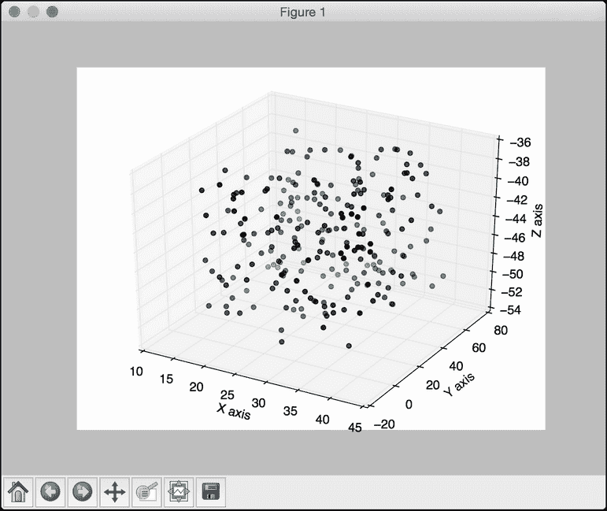
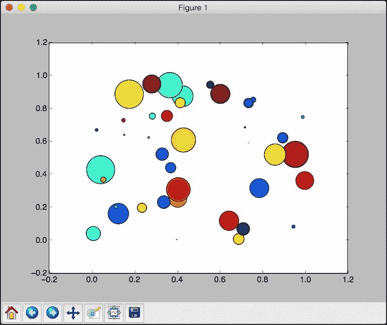
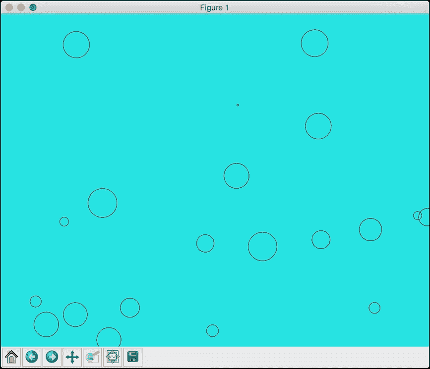
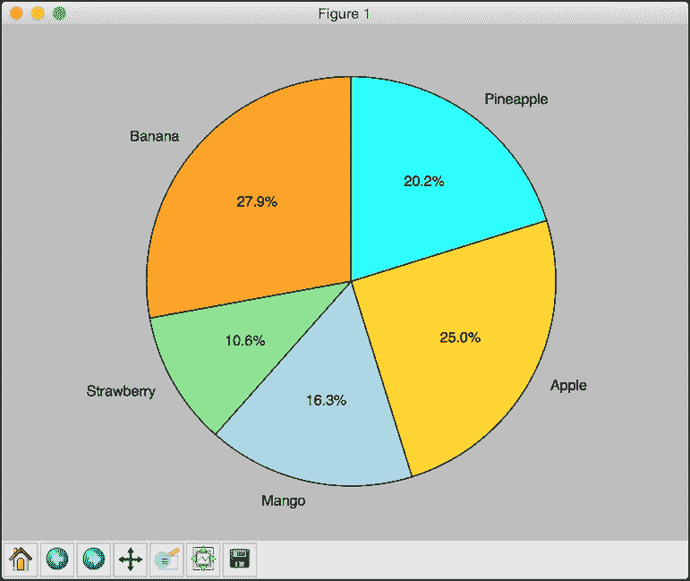
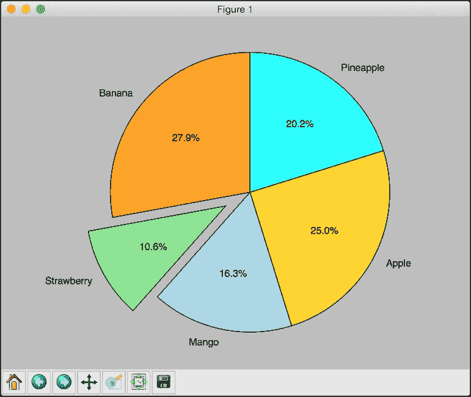
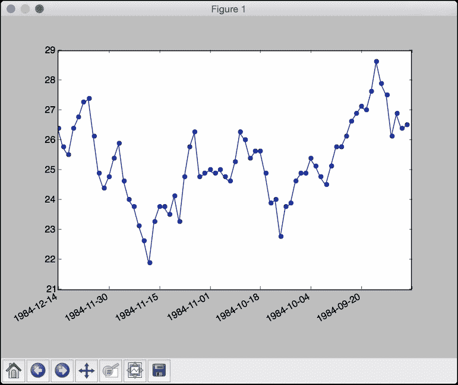
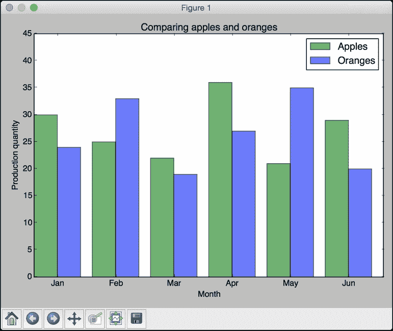
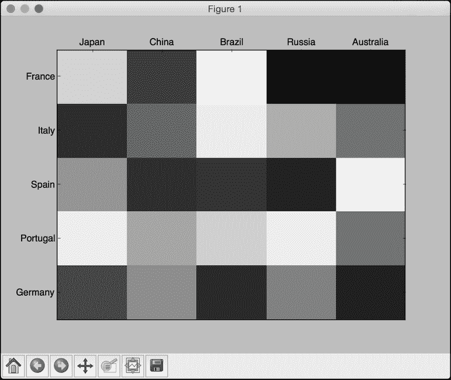
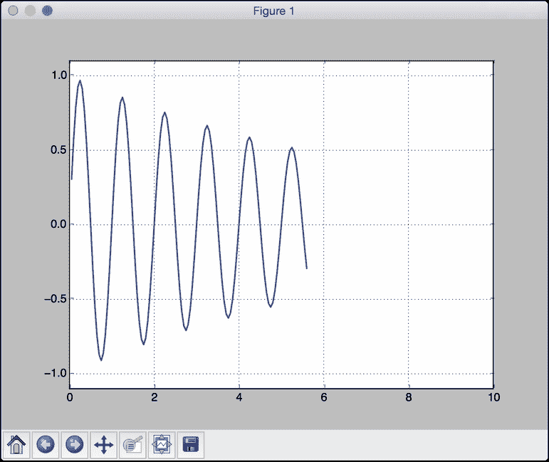

# 第十二章。可视化数据

在本章中，我们将介绍以下食谱:

*   绘制三维散点图
*   绘制气泡图
*   动画气泡图
*   绘制饼图
*   绘制日期格式的时间序列数据
*   绘制直方图
*   可视化热图
*   动态信号动画

# 简介

**数据可视化**是机器学习的重要支柱。它帮助我们制定正确的策略来理解数据。数据的可视化表示帮助我们选择正确的算法。数据可视化的主要目标之一是使用图形和图表清晰地交流。这些图表帮助我们清晰有效地交流信息。

在现实世界中，我们总是会遇到数字数据。我们希望使用图形、线条、点、条等对这些数字数据进行编码，以直观地显示这些数字中包含的信息。这使得复杂的数据分布更加易于理解和使用。这一过程用于各种情况，包括比较分析、跟踪增长、市场分布、民意调查和许多其他情况。

我们使用不同的图表来显示变量之间的模式或关系。我们使用直方图来显示数据的分布。当我们想要查找特定的测量值时，我们使用表格。在本章中，我们将查看各种场景，并讨论在这些情况下我们可以使用什么可视化。

# 绘制三维散点图

在这个食谱中，我们将学习如何绘制三维散点图并在三维空间中可视化它们。

## 怎么做…

1.  新建一个 Python 文件，导入以下包:

    ```py
    import numpy as np
    import matplotlib.pyplot as plt
    from mpl_toolkits.mplot3d import Axes3D
    ```

2.  创建空图形:

    ```py
    # Create the figure
    fig = plt.figure()
    ax = fig.add_subplot(111, projection='3d')
    ```

3.  定义我们应该生成的值的数量:

    ```py
    # Define the number of values
    n = 250
    ```

4.  创建一个`lambda`函数来生成给定范围内的值:

    ```py
    # Create a lambda function to generate the random values in the given range
    f = lambda minval, maxval, n: minval + (maxval - minval) * np.random.rand(n)
    ```

5.  使用此函数生成 X、Y 和 Z 值:

    ```py
    # Generate the values
    x_vals = f(15, 41, n)
    y_vals = f(-10, 70, n)
    z_vals = f(-52, -37, n)
    ```

6.  绘制这些值:

    ```py
    # Plot the values
    ax.scatter(x_vals, y_vals, z_vals, c='k', marker='o')
    ax.set_xlabel('X axis')
    ax.set_ylabel('Y axis')
    ax.set_zlabel('Z axis')

    plt.show()
    ```

7.  The full code is in the `scatter_3d.py` file that's already provided to you. If you run this code, you will see the following figure:

    

# 绘制气泡图

我们来看看如何绘制泡泡图。2D 气泡图中每个圆的大小代表该特定点的振幅。

## 怎么做…

1.  新建一个 Python 文件，导入以下包:

    ```py
    import numpy as np
    import matplotlib.pyplot as plt 
    ```

2.  定义我们应该生成的值的数量:

    ```py
    # Define the number of values
    num_vals = 40
    ```

3.  为`x`和`y`生成随机值:

    ```py
    # Generate random values
    x = np.random.rand(num_vals)
    y = np.random.rand(num_vals)
    ```

4.  定义气泡图中每个点的面积值:

    ```py
    # Define area for each bubble
    # Max radius is set to a specified value
    max_radius = 25
    area = np.pi * (max_radius * np.random.rand(num_vals)) ** 2  
    ```

5.  定义颜色:

    ```py
    # Generate colors
    colors = np.random.rand(num_vals)
    ```

6.  绘制这些值:

    ```py
    # Plot the points
    plt.scatter(x, y, s=area, c=colors, alpha=1.0)

    plt.show()
    ```

7.  The full code is in the `bubble_plot.py` file that's already provided to you. If you run this code, you will see the following figure:

    

# 制作气泡图动画

让我们看看如何制作气泡图的动画。当您想要可视化瞬态和动态数据时，这非常有用。

## 怎么做…

1.  新建一个 Python 文件，导入以下包:

    ```py
    import numpy as np
    import matplotlib.pyplot as plt
    from matplotlib.animation import FuncAnimation 
    ```

2.  让我们定义一个`tracker`函数来动态更新气泡图:

    ```py
    def tracker(cur_num):
        # Get the current index 
        cur_index = cur_num % num_points
    ```

3.  定义颜色:

    ```py
        # Set the color of the datapoints 
        datapoints['color'][:, 3] = 1.0
    ```

4.  更新圆的大小:

    ```py
        # Update the size of the circles 
        datapoints['size'] += datapoints['growth']
    ```

5.  更新集合中最早数据点的位置:

    ```py
        # Update the position of the oldest datapoint 
        datapoints['position'][cur_index] = np.random.uniform(0, 1, 2)
        datapoints['size'][cur_index] = 7
        datapoints['color'][cur_index] = (0, 0, 0, 1)
        datapoints['growth'][cur_index] = np.random.uniform(40, 150)
    ```

6.  更新散点图的参数:

    ```py
        # Update the parameters of the scatter plot 
        scatter_plot.set_edgecolors(datapoints['color'])
        scatter_plot.set_sizes(datapoints['size'])
        scatter_plot.set_offsets(datapoints['position'])
    ```

7.  定义`main`功能，创建一个空图形:

    ```py
    if __name__=='__main__':
        # Create a figure 
        fig = plt.figure(figsize=(9, 7), facecolor=(0,0.9,0.9))
        ax = fig.add_axes([0, 0, 1, 1], frameon=False)
        ax.set_xlim(0, 1), ax.set_xticks([])
        ax.set_ylim(0, 1), ax.set_yticks([])
    ```

8.  定义在任何给定时间点将出现在图上的点数:

    ```py
        # Create and initialize the datapoints in random positions 
        # and with random growth rates.
        num_points = 20
    ```

9.  使用随机值定义数据点:

    ```py
        datapoints = np.zeros(num_points, dtype=[('position', float, 2),
                ('size', float, 1), ('growth', float, 1), ('color', float, 4)])
        datapoints['position'] = np.random.uniform(0, 1, (num_points, 2))
        datapoints['growth'] = np.random.uniform(40, 150, num_points)
    ```

10.  创建散点图，每帧更新一次:

    ```py
        # Construct the scatter plot that will be updated every frame
        scatter_plot = ax.scatter(datapoints['position'][:, 0], datapoints['position'][:, 1],
                          s=datapoints['size'], lw=0.7, edgecolors=datapoints['color'],
                          facecolors='none')
    ```

11.  使用`tracker`功能启动动画:

    ```py
        # Start the animation using the 'tracker' function 
        animation = FuncAnimation(fig, tracker, interval=10)

        plt.show()
    ```

12.  The full code is in the `dynamic_bubble_plot.py` file that's already provided to you. If you run this code, you will see the following figure:

    

# 绘制饼图

让我们看看如何绘制饼图。当您想要可视化组中一组标签的百分比时，这很有用。

## 怎么做…

1.  新建一个 Python 文件，导入以下包:

    ```py
    import numpy as np
    import matplotlib.pyplot as plt 
    ```

2.  定义标签和值:

    ```py
    # Labels and corresponding values in counter clockwise direction
    data = {'Apple': 26, 
            'Mango': 17,
            'Pineapple': 21, 
            'Banana': 29, 
            'Strawberry': 11}
    ```

3.  定义可视化的颜色:

    ```py
    # List of corresponding colors
    colors = ['orange', 'lightgreen', 'lightblue', 'gold', 'cyan']
    ```

4.  定义一个变量，通过将饼图的一部分与其他部分分开来突出显示该部分。如果不想突出显示任何部分，请将所有值设置为`0` :

    ```py
    # Needed if we want to highlight a section
    explode = (0, 0, 0, 0, 0)  
    ```

5.  绘制饼图。注意，如果使用 Python 3，应该在下面的函数调用中使用`list(data.values())`:

    ```py
    # Plot the pie chart
    plt.pie(data.values(), explode=explode, labels=data.keys(), 
            colors=colors, autopct='%1.1f%%', shadow=False, startangle=90)

    # Aspect ratio of the pie chart, 'equal' indicates tht we 
    # want it to be a circle
    plt.axis('equal')

    plt.show()
    ```

6.  The full code is in the `pie_chart.py` file that's already provided to you. If you run this code, you will see the following figure:

    

    如果您将爆炸阵列更改为(`0, 0.2, 0, 0, 0`，则它将突出显示**草莓**部分。您将看到下图:

    

# 绘制日期格式的时间序列数据

让我们看看如何使用日期格式绘制时间序列数据。这在随时间可视化股票数据时非常有用。

## 怎么做…

1.  新建一个 Python 文件，导入以下包:

    ```py
    import numpy
    import matplotlib.pyplot as plt
    from matplotlib.mlab import csv2rec
    import matplotlib.cbook as cbook
    from matplotlib.ticker import Formatter
    ```

2.  定义一个函数来格式化日期。`__init__`功能设置类变量:

    ```py
    # Define a class for formatting
    class DataFormatter(Formatter):
        def __init__(self, dates, date_format='%Y-%m-%d'):
            self.dates = dates
            self.date_format = date_format
    ```

3.  在任何给定时间提取值，并以以下格式返回:

    ```py
        # Extact the value at time t at position 'position'
        def __call__(self, t, position=0):
            index = int(round(t))
            if index >= len(self.dates) or index < 0:
                return ''

            return self.dates[index].strftime(self.date_format)
    ```

4.  定义`main`功能。我们将使用 matplotlib 中提供的苹果股票报价 CSV 文件:

    ```py
    if __name__=='__main__':
        # CSV file containing the stock quotes 
        input_file = cbook.get_sample_data('aapl.csv', asfileobj=False)
    ```

5.  加载 CSV 文件:

    ```py
        # Load csv file into numpy record array
        data = csv2rec(input_file)
    ```

6.  提取这些值的子集来绘制它们:

    ```py
        # Take a subset for plotting
        data = data[-70:]
    ```

7.  创建格式化程序对象，并用日期初始化它:

    ```py
        # Create the date formatter object
        formatter = DataFormatter(data.date)
    ```

8.  定义 X 轴和 Y 轴:

    ```py
        # X axis
        x_vals = numpy.arange(len(data))

        # Y axis values are the closing stock quotes
        y_vals = data.close 
    ```

9.  绘制数据:

    ```py
        # Plot data
        fig, ax = plt.subplots()
        ax.xaxis.set_major_formatter(formatter)
        ax.plot(x_vals, y_vals, 'o-')
        fig.autofmt_xdate()
        plt.show()
    ```

10.  The full code is in the `time_series.py` file that's already provided to you. If you run this code, you will see the following figure:

    

# 绘制直方图

让我们看看如何在这个食谱中绘制直方图。我们将比较两组数据，并建立一个比较直方图。

## 怎么做…

1.  新建一个 Python 文件，导入以下包:

    ```py
    import numpy as np
    import matplotlib.pyplot as plt 
    ```

2.  我们来对比一下这个食谱中苹果和橘子的产量。让我们定义一些值:

    ```py
    # Input data
    apples = [30, 25, 22, 36, 21, 29]
    oranges = [24, 33, 19, 27, 35, 20]

    # Number of groups
    num_groups = len(apples)
    ```

3.  创建图形并定义其参数:

    ```py
    # Create the figure
    fig, ax = plt.subplots()

    # Define the X axis
    indices = np.arange(num_groups)

    # Width and opacity of histogram bars
    bar_width = 0.4
    opacity = 0.6
    ```

4.  绘制直方图:

    ```py
    # Plot the values
    hist_apples = plt.bar(indices, apples, bar_width, 
            alpha=opacity, color='g', label='Apples')

    hist_oranges = plt.bar(indices + bar_width, oranges, bar_width,
            alpha=opacity, color='b', label='Oranges')
    ```

5.  设置绘图参数:

    ```py
    plt.xlabel('Month')
    plt.ylabel('Production quantity')
    plt.title('Comparing apples and oranges')
    plt.xticks(indices + bar_width, ('Jan', 'Feb', 'Mar', 'Apr', 'May', 'Jun'))
    plt.ylim([0, 45])
    plt.legend()
    plt.tight_layout()

    plt.show()
    ```

6.  The full code is in the `histogram.py` file that's already provided to you. If you run this code, you will see the following figure:

    

# 可视化热图

让我们看看如何在这个食谱中可视化热图。这是数据的图形表示，其中两个组是逐点关联的。矩阵中包含的单个值在图中表示为颜色值。

## 怎么做…

1.  新建一个 Python 文件，导入以下包:

    ```py
    import numpy as np
    import matplotlib.pyplot as plt
    ```

2.  定义两组:

    ```py
    # Define the two groups 
    group1 = ['France', 'Italy', 'Spain', 'Portugal', 'Germany'] 
    group2 = ['Japan', 'China', 'Brazil', 'Russia', 'Australia']
    ```

3.  生成随机 2D 矩阵:

    ```py
    # Generate some random values
    data = np.random.rand(5, 5)
    ```

4.  创建图形:

    ```py
    # Create a figure
    fig, ax = plt.subplots()
    ```

5.  创建热图:

    ```py
    # Create the heat map
    heatmap = ax.pcolor(data, cmap=plt.cm.gray)
    ```

6.  绘制这些值:

    ```py
    # Add major ticks at the middle of each cell
    ax.set_xticks(np.arange(data.shape[0]) + 0.5, minor=False)
    ax.set_yticks(np.arange(data.shape[1]) + 0.5, minor=False)

    # Make it look like a table 
    ax.invert_yaxis()
    ax.xaxis.tick_top()

    # Add tick labels
    ax.set_xticklabels(group2, minor=False)
    ax.set_yticklabels(group1, minor=False)

    plt.show()
    ```

7.  The full code is in the `heatmap.py` file that's provided to you. If you run this code, you will see the following figure:

    

# 动态信号动画

当我们可视化实时信号时，很高兴看到波形是如何建立的。在这个食谱中，我们将看到如何制作动态信号的动画，并在实时遇到它们时可视化它们。

## 怎么做…

1.  新建一个 Python 文件，导入以下包:

    ```py
    import numpy as np
    import matplotlib.pyplot as plt
    import matplotlib.animation as animation 
    ```

2.  创建一个生成阻尼正弦信号的函数:

    ```py
    # Generate the signal
    def generate_data(length=2500, t=0, step_size=0.05):
        for count in range(length):
            t += step_size
            signal = np.sin(2*np.pi*t)
            damper = np.exp(-t/8.0)
            yield t, signal * damper 
    ```

3.  定义一个 `initializer`函数来初始化图的参数:

    ```py
    # Initializer function
    def initializer():
        peak_val = 1.0
        buffer_val = 0.1
    ```

4.  设置这些参数:

    ```py
        ax.set_ylim(-peak_val * (1 + buffer_val), peak_val * (1 + buffer_val))
        ax.set_xlim(0, 10)
        del x_vals[:]
        del y_vals[:]
        line.set_data(x_vals, y_vals)
        return line
    ```

5.  定义一个函数来绘制值:

    ```py
    def draw(data):
        # update the data
        t, signal = data
        x_vals.append(t)
        y_vals.append(signal)
        x_min, x_max = ax.get_xlim()
    ```

6.  如果这些值超过了当前的 X 轴限制，则更新并扩展图表:

    ```py
        if t >= x_max:
            ax.set_xlim(x_min, 2 * x_max)
            ax.figure.canvas.draw()

        line.set_data(x_vals, y_vals)

        return line
    ```

7.  定义`main`功能:

    ```py
    if __name__=='__main__':
        # Create the figure
        fig, ax = plt.subplots()
        ax.grid()
    ```

8.  提取行:

    ```py
        # Extract the line
        line, = ax.plot([], [], lw=1.5)
    ```

9.  创建变量并将其初始化为空列表:

    ```py
        # Create the variables
        x_vals, y_vals = [], []
    ```

10.  使用动画师对象

    ```py
        # Define the animator object
        animator = animation.FuncAnimation(fig, draw, generate_data, 
                blit=False, interval=10, repeat=False, init_func=initializer)

        plt.show()
    ```

    定义并开始动画
11.  The full code is in the `moving_wave_variable.py` file that's already provided to you. If you run this code, you will see the following figure:

    