# 四、使用基于树的算法预测在线广告点击率

上一章我们构建了一个人脸图像分类器。在这一章和下一章中，我们将解决数字广告中最受数据驱动的问题之一:广告点击率预测——给定用户和他们正在访问的页面，这将预测他们点击给定广告的可能性有多大。我们将专注于学习基于树的算法(包括决策树、随机森林和增强树)，并利用它们来解决这个价值数十亿美元的问题。我们将探索从根到叶的决策树，以及聚合版本，一个树的森林。这不会是一个理论的章节，因为有很多手工计算和从头开始的树模型的实现。我们将使用 scikit-learn 和 XGBoost，这是一个流行的基于树的算法的 Python 包。

我们将在本章中讨论以下主题:

*   两种类型的特征:数量和类别
*   决策树分类器的机制
*   决策树的实现
*   广告点击率预测
*   集合方法和装袋技术
*   随机森林的力学
*   具有随机森林的点进预测
*   **坡度提升树** ( **GBT** )模型
*   使用 XGBoost 实现 GBT

# 广告点击率预测概述

在线展示广告是一个价值数十亿美元的行业。它有不同的格式，包括由文本、图像和 flash 组成的横幅广告，以及音频和视频等富媒体。广告商或他们的代理在互联网上的各种网站，甚至移动应用上投放广告，以接触潜在客户并传递广告信息。

在线展示广告已经成为机器学习应用的最大例子之一。显然，广告商和消费者对目标明确的广告非常感兴趣。在过去的 20 年里，这个行业严重依赖机器学习模型的能力来预测广告定位的有效性:某个年龄组的受众对这个产品感兴趣的可能性有多大，有一定家庭收入的客户看到广告后会购买这个产品，经常访问体育网站的人会花更多的时间阅读这个广告，等等。最常见的有效性衡量标准是**点击率** ( **点击率**)，即特定广告的点击量与其总浏览量之比。总的来说，点击率越高，广告的针对性就越好，在线广告活动就越成功。

点击率预测包含了机器学习的希望和挑战。它主要涉及给定页面(或 app)上的给定广告是否会被给定用户点击的二元分类，具有来自以下三个方面的预测特征:

*   广告内容和信息(类别、位置、文本、格式等)
*   页面内容和发布者信息(类别、上下文、域等)
*   用户信息(年龄、性别、位置、收入、兴趣、搜索历史、浏览历史、设备等)

假设我们作为一个代理机构，代表几个广告商运营广告，我们的工作是为合适的受众投放合适的广告。假设我们手头有一个现有的数据集(下面的小块是一个例子；从一个月前运行的数百万条活动记录中，预测功能的数量很容易达到数千个，我们需要开发一个分类模型来学习和预测未来的广告投放结果:

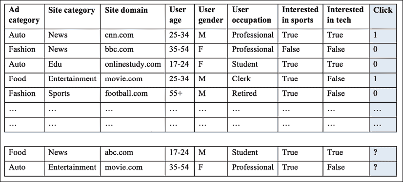

图 4.1:用于训练和预测的广告样本

在*图 4.1* 中可以看到，特征大多是分类的。事实上，数据可以是数字的，也可以是分类的。让我们在下一节更详细地探讨这一点。

# 开始使用两种类型的数据——数字和分类

乍一看，前面数据集中的特征是**分类**，例如，男性或女性，四个年龄组之一，预定义的网站类别之一，或者用户是否对运动感兴趣。这样的数据不同于我们目前使用的**数值**特征数据。

分类(也称为**定性**)特征代表特征、不同的组和可数数量的选项。分类特征可能有逻辑顺序，也可能没有。例如，家庭收入从低到中到高是**的序数**特征，而广告的类别不是序数。

另一方面，数值(也称为**定量**)特征具有数学意义作为度量，当然是有序的。例如，术语频率和 tf-idf 变量分别是离散和连续的数字特征；上一章的心电描记数据集([https://archive.ics.uci.edu/ml/datasets/Cardiotocography](https://archive.ics.uci.edu/ml/datasets/Cardiotocography))既包含离散的(如每秒的加速度数或每秒的胎动数)又包含连续的(如长期变异性的平均值)数值特征。

分类特征也可以采用数值。例如，1 到 12 可以表示一年中的月份，1 和 0 可以表示男性和女性。尽管如此，这些值并没有数学含义。

在您之前学习的两种分类算法中，朴素贝叶斯和 SVM，朴素贝叶斯分类器对数值和分类特征都有效，因为可能性、 *P* ( *x* | *y* )或 *P* ( *特征* | *类*)是以相同的方式计算的，而 SVM 要求特征是数值的，以便计算和最大化距离余量。

现在，我们正在考虑使用朴素的贝叶斯来预测点击率，并试图向我们的广告客户解释这个模型。然而，我们的客户可能会发现很难理解个体属性及其倍增的先验和可能性。有没有一个分类器可以很容易地解释给客户，并且能够直接处理分类数据？决策树就是答案！

# 从根到叶探索决策树

决策树是一个树状图，也就是一个顺序图，说明所有可能的决策方案及其相应的结果。从一棵树的**根**开始，每一个内部**节点**都代表着做决定的基础。节点的每个分支代表一个选择如何通向下一个节点。最后，每个**终端节点****叶子**代表产生的结果。

例如，我们刚刚做了几个决定，让我们使用决策树来解决我们的广告问题:

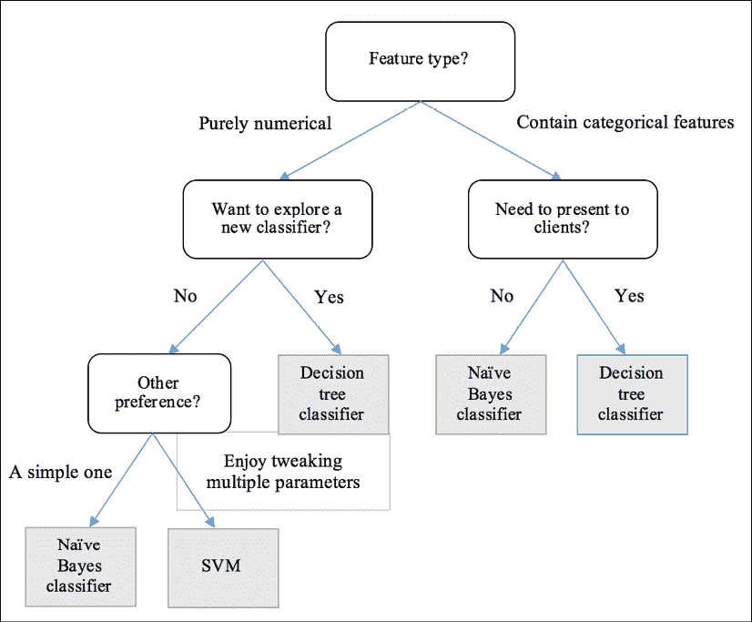

图 4.2:使用决策树找到正确的算法

第一个条件，或者说根，是特征类型是数值型还是分类型。广告点击流数据包含大部分分类特征，因此它流向正确的分支。在下一个节点中，我们的工作需要能够被非技术客户解释。因此，它会转到正确的分支，并到达用于选择决策树分类器的叶子。

你也可以看看路径，看看它们能适应什么样的问题。决策树分类器以决策树的形式运行。它通过一系列基于特征值和相应条件(表示为分支)的测试(表示为内部节点)，将观测值映射到类赋值(表示为叶节点)。在每个节点中，会询问一个关于特征的值和特征的问题；根据问题的答案，观察结果被分成子集。进行连续测试，直到得出关于观测目标标签的结论。从根到末端叶子的路径代表决策过程和分类规则。

在更简化的场景中，如图 4.3 中的*所示，我们想要预测自动驾驶汽车广告上的**点击**或**不点击**，我们可以手动构建一个决策树分类器，该分类器适用于可用的数据集。例如，如果一个用户对技术感兴趣，并且有一辆车，他们会倾向于点击广告；这个子集之外的人，例如高收入女性，不太可能点击广告。然后我们使用训练好的树来预测两个新的输入，它们的结果分别是**点击**和**不点击**:*

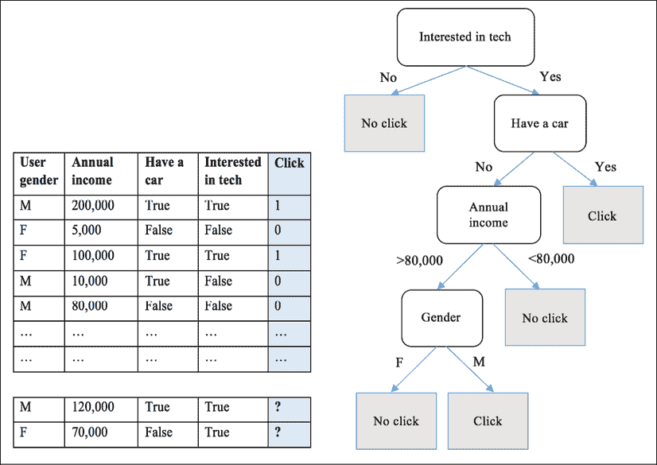

图 4.3:使用经过训练的决策树预测点击/不点击

在构建了决策树之后，对新样本进行分类就很简单了，正如您刚刚看到的:从根开始，应用测试条件并相应地跟随分支，直到到达一个叶节点，关联的类标签将被分配给新样本。

那么，如何才能构建一个合适的决策树呢？

## 构建决策树

决策树通过将训练样本划分为连续的子集来构建。在每个子集上以递归方式重复划分过程。对于节点处的每个划分，基于子集的特征的值进行条件测试。当子集共享相同的类标签时，或者当没有进一步的拆分可以提高这个子集的类纯度时，这个节点上的递归分区就完成了。

理论上，用 *n* 个不同的值来划分一个特征(数值或范畴)，有 *n* 种不同的二进制拆分方法(**是**或**否**到条件测试，如图*图 4.4* 所示)，更不用说其他的拆分方式了(例如*图 4.4* 中的三向和四向拆分):

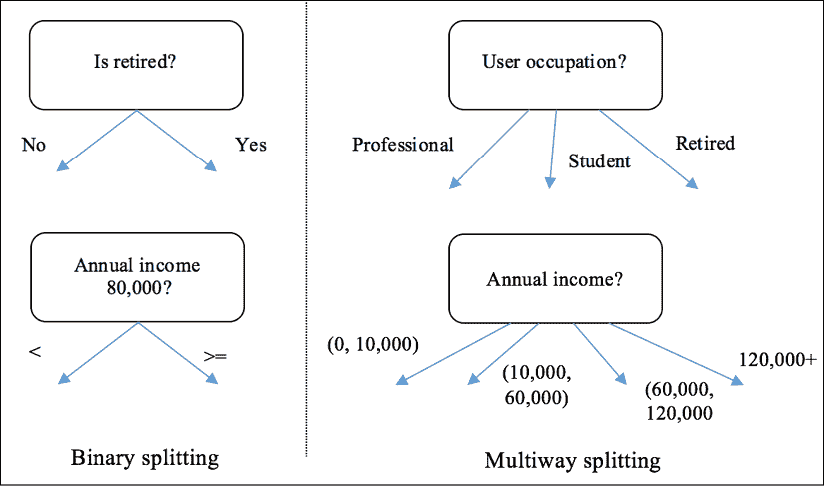

图 4.4:二进制分裂和多路分裂的例子

不考虑正在进行分区的要素的顺序，对于一个 *m* 维数据集，已经有 *n* <sup class="" style="font-style: italic;">m</sup> 个可能的树。

已经开发了许多算法来有效地构建精确的决策树。流行的包括以下内容:

*   **迭代二分器 3** ( **ID3** ):该算法以自上而下的方式使用贪婪搜索，通过选择最佳属性在每次迭代中分割数据集，无需回溯。
*   **C4.5** :这是引入回溯的 ID3 改进版。如果纯度以这种方式提高，它会遍历构建的树并用叶节点替换分支。
*   **分类回归树** ( **CART** ):这是使用二元分裂构建的树，稍后我们将更详细地讨论。
*   **卡方自动交互检测器** ( **CHAID** ):这个算法常用于直销。它涉及复杂的统计概念，但基本上，它确定了合并预测变量的最佳方式，以便最好地解释结果。

这些算法的基本思想是，在选择最显著的特征用于分割数据时，通过进行一系列局部优化，贪婪地生长树。然后根据该要素的最佳值分割数据集。我们将在下一节讨论重要特征的测量和特征的最佳分割值。

首先，我们将更详细地研究 CART 算法，并将其实现为之后最引人注目的决策树算法。它使用二进制拆分构建树，并将每个节点分成左右子节点。在每个分区中，它贪婪地搜索一个特征及其值的最重要组合；使用测量功能尝试和测试所有不同的可能组合。将选定的要素和值作为分割点，算法然后按如下方式分割数据集:

*   具有该值(对于分类特征)或更大值(对于数字特征)的特征的样本成为正确的子样本
*   剩余的样本成为左边的子样本

这个划分过程重复进行，并递归地将输入样本分成两个子组。当数据集变为未混合时，拆分过程在满足以下两个标准之一的子组停止:

*   **新节点的最小样本数**:当样本数不大于进一步分割所需的最小样本数时，分割停止，以防止树过度定制训练集，从而过度拟合。
*   **树的最大深度**:当一个节点的深度不小于树的最大深度时，该节点停止生长，该深度被定义为从根节点开始到终端节点结束的自上而下发生的分区数量。更深的树对训练集来说更具体，会导致过度拟合。

一个没有分支的节点变成一片叶子，这个节点上样本的优势类就是预测。一旦所有分割过程完成，就构建树，并在终端节点用分配的标签和上面所有内部节点的分割点(特征+值)描绘树。

我们将按照承诺，在研究了选择最佳分割特征和值的指标后，从头开始实现 CART 决策树算法。

## 衡量分裂的标准

当选择一个特征和一个值的最佳组合作为分割点时，可以使用**基尼杂质**和**信息增益**两个标准来衡量分离的质量。

### 基尼杂质

基尼不纯，顾名思义，衡量数据点的类分布的不纯率，或类混合率。对于具有 *K* 类的数据集，假设来自类 *k(1 ≤ k ≤ K)* 的数据占整个数据集的一小部分*f*<sub class="" style="font-style: italic;">K</sub>*(0≤f*<sub class="" style="font-style: italic;">K</sub>*≤1)*；那么这个数据集的*基尼杂质*写如下:


基尼系数越低，表明数据集越纯净。例如，当数据集只包含一个类时，比如说这个类的分数为`1`，其他类的分数为`0`，则其基尼杂质变为 1–(1<sup class="Superscript--PACKT-">2</sup>+0<sup class="Superscript--PACKT-">2</sup>)= 0。在另一个例子中，数据集记录了大量硬币翻转，正面和反面各占一半样本。基尼系数为 1 –( 0.5<sup class="Superscript--PACKT-">2</sup>+0.5<sup class="Superscript--PACKT-">2</sup>)= 0.5。

在二进制情况下，在正类分数的不同值下，基尼杂质可以通过以下代码块可视化:

```py
>>> import matplotlib.pyplot as plt
>>> import numpy as np 
```

正类的分数从`0`到`1`不等:

```py
>>> pos_fraction = np.linspace(0.00, 1.00, 1000) 
```

相应地计算基尼系数，然后是**基尼系数**与**正分数**的关系图:

```py
>>> gini = 1 – pos_fraction**2 – (1-pos_fraction)**2 
```

这里，`1-pos_fraction`为负分数:

```py
>>> plt.plot(pos_fraction, gini)
>>> plt.ylim(0, 1)
>>> plt.xlabel('Positive fraction')
>>> plt.ylabel('Gini Impurity')
>>> plt.show() 
```

最终结果见*图 4.5* :

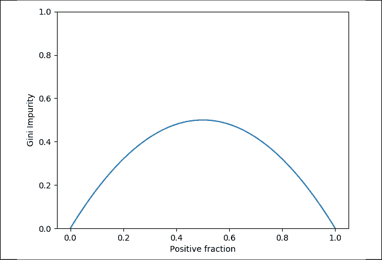

图 4.5:基尼系数与正分数的关系

可以看到，在二元情况下，如果正分数为 50%，杂质在 0.5 时最高；如果正分数为 100%或 0%，它将达到 0 杂质。

给定数据集的标签，我们可以如下实现基尼杂质计算函数:

```py
>>> def gini_impurity(labels):
...     # When the set is empty, it is also pure
...     if not labels:
...         return 0
...     # Count the occurrences of each label
...     counts = np.unique(labels, return_counts=True)[1]
...     fractions = counts / float(len(labels))
...     return 1 - np.sum(fractions ** 2) 
```

用一些例子来测试一下:

```py
>>> print(f'{gini_impurity([1, 1, 0, 1, 0]):.4f}')
0.4800
>>> print(f'{gini_impurity([1, 1, 0, 1, 0, 0]):.4f}')
0.5000
>>> print(f'{gini_impurity([1, 1, 1, 1]):.4f}')
0.0000 
```

为了评估分割的质量，我们简单地将所有结果子组的基尼杂质相加，将每个子组的比例组合为相应的权重因子。同样，基尼系数的加权和越小，分割越好。

看看下面的自动驾驶汽车广告例子。在这里，我们分别根据用户的性别和对技术的兴趣来划分数据:

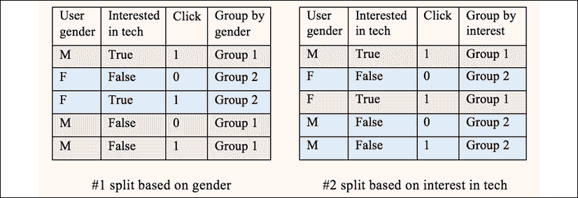

图 4.6:根据性别或对技术的兴趣划分数据

第一次分割的加权基尼系数可以计算如下:


第二部分如下:


因此，根据用户对技术的兴趣来拆分数据是比性别更好的策略。

### 信息增益

另一个指标**信息增益**衡量分裂后纯度的提高，换句话说，就是分裂导致的不确定性的降低。更高的信息增益意味着更好的分裂。我们通过比较分裂前后的**熵**来获得分裂的信息增益。

**熵**是不确定性的概率度量。给定一个 *K* 类数据集，*fk(0≤**f*<sub class="" style="font-style: italic;">K</sub>*≤1)*表示为来自类 *k (1 ≤ k ≤ K)* 的数据的分数，数据集的*熵*定义如下:


熵越低意味着数据集越纯净，模糊性越小。在数据集只包含一个类的完美情况下，熵为。在抛硬币的例子中，熵变成了。

类似地，我们可以使用以下代码行来可视化熵如何随着二进制情况下正类分数的不同值而变化:

```py
>>> pos_fraction = np.linspace(0.00, 1.00, 1000)
>>> ent = - (pos_fraction * np.log2(pos_fraction) +
...         (1 - pos_fraction) * np.log2(1 - pos_fraction))
>>> plt.plot(pos_fraction, ent)
>>> plt.xlabel('Positive fraction')
>>> plt.ylabel('Entropy')
>>> plt.ylim(0, 1)
>>> plt.show() 
```

这将为我们提供以下输出:

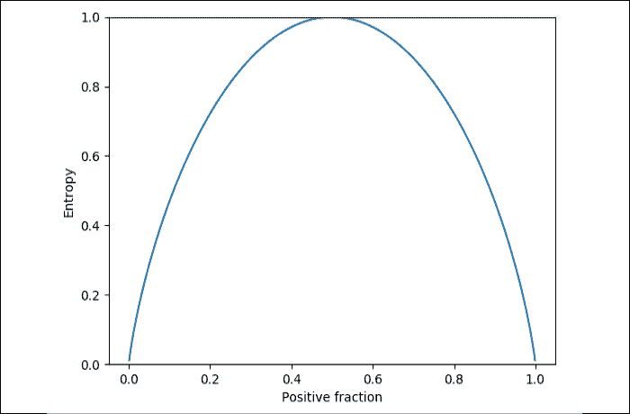

图 4.7:熵与正分数

如你所见，在二元情况下，如果正分数为 50%，熵将在`1`最高；如果正分数为 100%或 0%，则达到`0`熵。

给定数据集的标签，`entropy`计算函数可以如下实现:

```py
>>> def entropy(labels):
...     if not labels:
...         return 0
...     counts = np.unique(labels, return_counts=True)[1]
...     fractions = counts / float(len(labels))
...     return - np.sum(fractions * np.log2(fractions)) 
```

用一些例子来测试一下:

```py
>>> print(f'{entropy([1, 1, 0, 1, 0]):.4f}')
0.9710
>>> print(f'{entropy([1, 1, 0, 1, 0, 0]):.4f}')
1.0000
>>> print(f'{entropy([1, 1, 1, 1]):.4f}')
-0.0000 
```

现在你已经完全理解了熵，我们可以看看 Information Gain 是如何衡量分裂后减少了多少不确定性的，它被定义为分裂前(父)和分裂后(子)的熵差:


分割后的熵计算为每个孩子熵的加权和，类似于加权基尼杂质。

在一棵树上构造一个节点的过程中，我们的目标是寻找获得最大信息增益的分裂点。由于父节点的熵不变，我们只需要测量由于分裂而产生的子节点的熵。最佳分割是其结果子代的熵最低的分割。

为了更好地理解这一点，让我们再来看看自动驾驶汽车广告的例子。

对于第一个选项，分割后的熵可以计算如下:


第二种拆分方式如下:


出于探索目的，我们还可以通过以下方式计算信息增益:


根据**信息增益=基于熵的评估**，第二次分裂更可取，这是基尼杂质标准的结论。

一般来说，基尼不纯和信息增益这两个指标的选择对训练好的决策树的性能影响不大。他们都测量分裂后孩子的加权杂质。我们可以将它们组合成一个函数来计算加权杂质:

```py
>>> criterion_function = {'gini': gini_impurity,
...                       'entropy': entropy}
>>> def weighted_impurity(groups, criterion='gini'):
...     """
...     Calculate weighted impurity of children after a split
...     @param groups: list of children, and a child consists a
...                    list of class labels
...     @param criterion: metric to measure the quality of a split,
...                       'gini' for Gini Impurity or 'entropy' for 
...                           Information Gain
...     @return: float, weighted impurity
...     """
...     total = sum(len(group) for group in groups)
...     weighted_sum = 0.0
...     for group in groups:
...         weighted_sum += len(group) / float(total) *
...                           criterion_function[criterion](group)
...     return weighted_sum 
```

用我们刚刚手工计算的例子进行测试，如下所示:

```py
>>> children_1 = [[1, 0, 1], [0, 1]]
>>> children_2 = [[1, 1], [0, 0, 1]]
>>> print(f"Entropy of #1 split: {weighted_impurity(children_1,
...       'entropy'):.4f}")
Entropy of #1 split: 0.9510
>>> print(f"Entropy of #2 split: {weighted_impurity(children_2,
...       'entropy'):.4f}")
Entropy of #2 split: 0.5510 
```

既然您已经对分区评估指标有了坚实的理解，让我们在下一节从头开始实现 CART 树算法。

# 从头开始实现决策树

我们在`toy`数据集上手动开发 CART 树算法，如下所示:

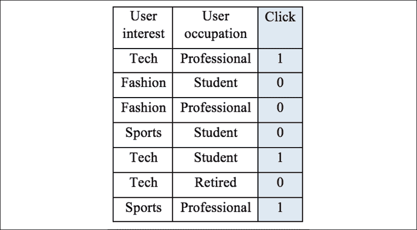

图 4.8:广告数据示例

首先，我们通过尝试两个特征的所有可能值来决定第一个分裂点，即根。我们利用刚刚定义的`weighted_impurity`函数计算每个可能组合的加权基尼系数，如下所示:

```py
Gini(interest, tech) = weighted_impurity([[1, 1, 0],
    [0, 0, 0, 1]]) = 0.405 
```

在这里，如果我们按照用户兴趣是否是 tech 来划分，则一组有第 1 <sup class="Superscript--PACKT-">st</sup> ，第 5 <sup class="Superscript--PACKT-">th</sup> ，第 6 <sup class="Superscript--PACKT-">th</sup> 个样本，另一组有剩余样本。那么第一组的班级为`[1, 1, 0]`，第二组的班级为`[0, 0, 0, 1]`:

```py
Gini(interest, Fashion) = weighted_impurity([[0, 0],
    [1, 0, 1, 0, 1]]) = 0.343 
```

在这里，如果我们按照用户的兴趣是否是时尚来划分，我们有一组的 2 <sup class="Superscript--PACKT-">nd</sup> 和 3 <sup class="Superscript--PACKT-">rd</sup> 样本，另一组的剩余样本。那么第一组的班级为`[0, 0]`，第二组的班级为`[1, 0, 1, 0, 1]`:

```py
Gini(interest, Sports) = weighted_impurity([[0, 1],
    [1, 0, 0, 1, 0]]) = 0.486
Gini(occupation, professional) = weighted_impurity([[0, 0, 1, 0],
    [1, 0, 1]]) = 0.405
Gini(occupation, student) = weighted_impurity([[0, 0, 1, 0],
    [1, 0, 1]]) = 0.405
Gini(occupation, retired) = weighted_impurity([[1, 0, 0, 0, 1, 1],
    [1]]) = 0.429 
```

根以时尚值到达用户兴趣特征，因为该组合实现了最低加权杂质或最高信息增益。我们现在可以构建树的第一层，如下所示:

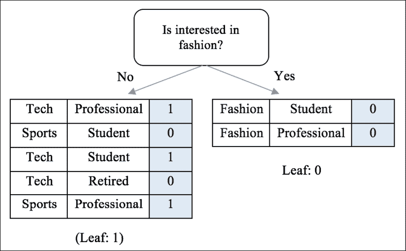

图 4.9:根据对时尚感兴趣的程度划分数据？

如果我们对一级深的树感到满意，我们可以在这里停下来，将右边的分支标签 **0** 和左边的分支标签 **1** 指定为多数类。

或者，我们可以沿着这条路走得更远，从左分支构建第二层(右分支不能进一步拆分):

```py
Gini(interest, tech) = weighted_impurity([[0, 1],
    [1, 1, 0]]) = 0.467
Gini(interest, Sports) = weighted_impurity([[1, 1, 0],
    [0, 1]]) = 0.467
Gini(occupation, professional) = weighted_impurity([[0, 1, 0],
    [1, 1]]) = 0.267
Gini(occupation, student) = weighted_impurity([[1, 0, 1],
    [0, 1]]) = 0.467
Gini(occupation, retired) = weighted_impurity([[1, 0, 1, 1],
    [0]]) = 0.300 
```

吉尼不纯度最低的`(occupation, professional)`指定的第二个分裂点，我们的树变成这样:

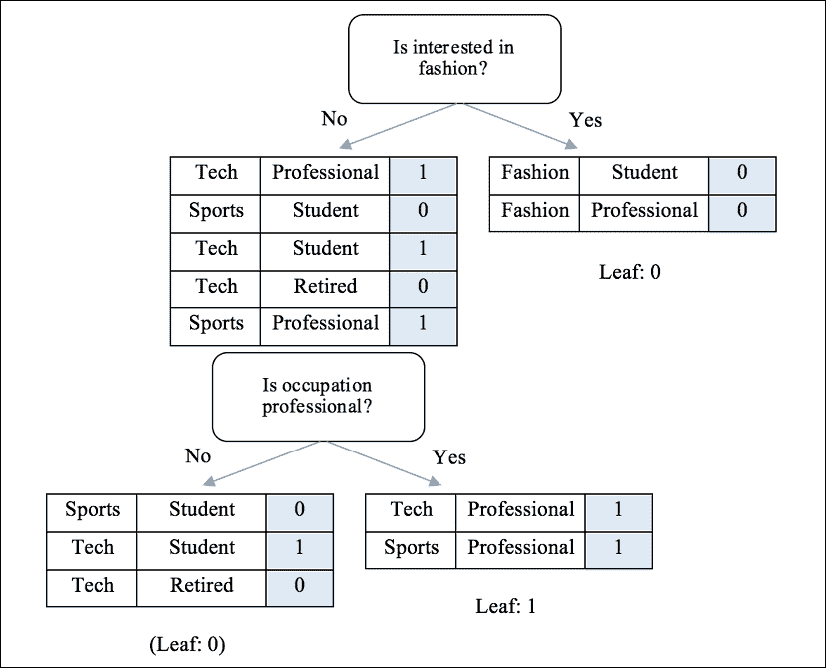

图 4.10:根据“职业是专业的吗？”

只要树没有超过最大深度，节点包含足够的样本，我们就可以重复分裂过程。

现在树的构建过程已经明确，是时候编码了。

我们从最佳分裂点的标准开始；两个潜在子代的加权杂质的计算是我们之前定义的，而两个度量的计算略有不同。为了提高计算效率，输入现在变成了 NumPy 数组。对于基尼杂质，我们有以下几点:

```py
>>> def gini_impurity_np(labels):
...     # When the set is empty, it is also pure
...     if labels.size == 0:
...         return 0
...     # Count the occurrences of each label
...     counts = np.unique(labels, return_counts=True)[1]
...     fractions = counts / float(len(labels))
...     return 1 - np.sum(fractions ** 2) 
```

对于熵，我们有以下公式:

```py
>>> def entropy_np(labels):
...     # When the set is empty, it is also pure
...     if labels.size == 0:
...         return 0
...     counts = np.unique(labels, return_counts=True)[1]
...     fractions = counts / float(len(labels))
...     return - np.sum(fractions * np.log2(fractions)) 
```

另外，我们更新`weighted_impurity`功能，如下所示:

```py
>>> def weighted_impurity(groups, criterion='gini'):
...     """
...     Calculate weighted impurity of children after a split
...     @param groups: list of children, and a child consists a list
...                    of class labels
...     @param criterion: metric to measure the quality of a split,
...                       'gini' for Gini Impurity or
...                       'entropy' for Information Gain
...     @return: float, weighted impurity
...     """
...     total = sum(len(group) for group in groups)
...     weighted_sum = 0.0
...     for group in groups:
...         weighted_sum += len(group) / float(total) *
...                          criterion_function_np[criterion](group)
...     return weighted_sum 
```

接下来，我们定义一个实用工具函数，根据一个特征和值将一个节点分成左右两个子节点:

```py
>>> def split_node(X, y, index, value):
...     """
...     Split dataset X, y based on a feature and a value
...     @param X: numpy.ndarray, dataset feature
...     @param y: numpy.ndarray, dataset target
...     @param index: int, index of the feature used for splitting
...     @param value: value of the feature used for splitting
...     @return: list, list, left and right child, a child is in 
...              the format of [X, y]
...     """
...     x_index = X[:, index]
...     # if this feature is numerical
...     if X[0, index].dtype.kind in ['i', 'f']:
...         mask = x_index >= value
...     # if this feature is categorical
...     else:
...         mask = x_index == value
...     # split into left and right child
...     left = [X[~mask, :], y[~mask]]
...     right = [X[mask, :], y[mask]]
...     return left, right 
```

我们检查特征是数字的还是分类的，并相应地分割数据。

有了可用的分割测量和生成函数，我们现在定义贪婪搜索函数，该函数尝试所有可能的分割，并返回给定选择标准的最佳分割，以及由此产生的子分割:

```py
>>> def get_best_split(X, y, criterion):
...     """
...     Obtain the best splitting point and resulting children for
...                                               the dataset X, y
...     @param X: numpy.ndarray, dataset feature
...     @param y: numpy.ndarray, dataset target
...     @param criterion: gini or entropy
...     @return: dict {index: index of the feature, value: feature  
...                    value, children: left and right children}
...     """
...     best_index, best_value, best_score, children =
...                                        None, None, 1, None
...     for index in range(len(X[0])):
...         for value in np.sort(np.unique(X[:, index])):
...             groups = split_node(X, y, index, value)
...             impurity = weighted_impurity(
...                         [groups[0][1], groups[1][1]], criterion)
...             if impurity < best_score:
...                 best_index, best_value, best_score, children =
...                                index, value, impurity, groups
...     return {'index': best_index, 'value': best_value,
...             'children': children} 
```

选择和拆分过程以递归方式在每个后续子对象上进行。当满足停止标准时，进程在一个节点停止，主标签被分配给该叶节点:

```py
>>> def get_leaf(labels):
...     # Obtain the leaf as the majority of the labels
...     return np.bincount(labels).argmax() 
```

最后，递归函数将它们连接在一起:

*   如果两个子节点中的一个为空，它将分配一个叶节点。
*   如果当前分支深度超过允许的最大深度，它将分配一个叶节点。
*   如果叶节点不包含进一步分割所需的足够样本，它将分配一个叶节点。
*   否则，它将使用最佳分割点进行进一步分割。

这是通过以下功能完成的:

```py
>>> def split(node, max_depth, min_size, depth, criterion):
...     """
...     Split children of a node to construct new nodes or assign
...     them terminals
...     @param node: dict, with children info
...     @param max_depth: int, maximal depth of the tree
...     @param min_size: int, minimal samples required to further
...                      split a child
...     @param depth: int, current depth of the node
...     @param criterion: gini or entropy
...     """
...     left, right = node['children']
...     del (node['children'])
...     if left[1].size == 0:
...         node['right'] = get_leaf(right[1])
...         return
...     if right[1].size == 0:
...         node['left'] = get_leaf(left[1])
...         return
...     # Check if the current depth exceeds the maximal depth
...     if depth >= max_depth:
...         node['left'], node['right'] =
...                         get_leaf(left[1]), get_leaf(right[1])
...         return
...     # Check if the left child has enough samples
...     if left[1].size <= min_size:
...         node['left'] = get_leaf(left[1])
...     else:
...         # It has enough samples, we further split it
...         result = get_best_split(left[0], left[1], criterion)
...         result_left, result_right = result['children']
...         if result_left[1].size == 0:
...             node['left'] = get_leaf(result_right[1])
...         elif result_right[1].size == 0:
...             node['left'] = get_leaf(result_left[1])
...         else:
...             node['left'] = result
...             split(node['left'], max_depth, min_size,
...                                       depth + 1, criterion)
...     # Check if the right child has enough samples
...     if right[1].size <= min_size:
...         node['right'] = get_leaf(right[1])
...     else:
...         # It has enough samples, we further split it
...         result = get_best_split(right[0], right[1], criterion)
...         result_left, result_right = result['children']
...         if result_left[1].size == 0:
...             node['right'] = get_leaf(result_right[1])
...         elif result_right[1].size == 0:
...             node['right'] = get_leaf(result_left[1])
...         else:
...             node['right'] = result
...             split(node['right'], max_depth, min_size,
...                                         depth + 1, criterion) 
```

最后，树的构造的入口点如下:

```py
>>> def train_tree(X_train, y_train, max_depth, min_size,
...                criterion='gini'):
...     """
...     Construction of a tree starts here
...     @param X_train: list of training samples (feature)
...     @param y_train: list of training samples (target)
...     @param max_depth: int, maximal depth of the tree
...     @param min_size: int, minimal samples required to further
                         split a child
...     @param criterion: gini or entropy
...     """
...     X = np.array(X_train)
...     y = np.array(y_train)
...     root = get_best_split(X, y, criterion)
...     split(root, max_depth, min_size, 1, criterion)
...     return root 
```

现在，让我们用前面的手算例子来测试一下:

```py
>>> X_train = [['tech', 'professional'],
...            ['fashion', 'student'],
...            ['fashion', 'professional'],
...            ['sports', 'student'],
...            ['tech', 'student'],
...            ['tech', 'retired'],
...            ['sports', 'professional']]
>>> y_train = [1, 0, 0, 0, 1, 0, 1]
>>> tree = train_tree(X_train, y_train, 2, 2) 
```

为了验证模型生成的树与我们手工构建的树是否相同，我们编写了一个显示树的函数:

```py
>>> CONDITION = {'numerical': {'yes': '>=', 'no': '<'},
...              'categorical': {'yes': 'is', 'no': 'is not'}}
>>> def visualize_tree(node, depth=0):
...     if isinstance(node, dict):
...         if node['value'].dtype.kind in ['i', 'f']:
...             condition = CONDITION['numerical']
...         else:
...             condition = CONDITION['categorical']
...         print('{}|- X{} {} {}'.format(depth * '  ',
...             node['index'] + 1, condition['no'], node['value']))
...         if 'left' in node:
...             visualize_tree(node['left'], depth + 1)
...         print('{}|- X{} {} {}'.format(depth * '  ',
...             node['index'] + 1, condition['yes'], node['value']))
...         if 'right' in node:
...             visualize_tree(node['right'], depth + 1)
...     else:
...         print(f"{depth * '  '}[{node}]")
>>> visualize_tree(tree)
|- X1 is not fashion
 |- X2 is not professional
   [0]
 |- X2 is professional
   [1]
|- X1 is fashion
 [0] 
```

我们可以用一个数值例子进行测试，如下所示:

```py
>>> X_train_n = [[6, 7],
...             [2, 4],
...             [7, 2],
...             [3, 6],
...             [4, 7],
...             [5, 2],
...             [1, 6],
...             [2, 0],
...             [6, 3],
...             [4, 1]]
>>> y_train_n = [0, 0, 0, 0, 0, 1, 1, 1, 1, 1]
>>> tree = train_tree(X_train_n, y_train_n, 2, 2)
>>> visualize_tree(tree)
|- X2 < 4
 |- X1 < 7
   [1]
 |- X1 >= 7
   [0]
|- X2 >= 4
 |- X1 < 2
   [1]
 |- X1 >= 2
   [0] 
```

决策树模型生成的树与我们手工制作的树相同。

现在，在从头开始实现决策树之后，您对决策树有了更深入的了解，我们可以继续使用 scikit-learn 实现决策树。

# 用 scikit-learn 实现决策树

这里我们使用决策树模块([https://sci kit-learn . org/stable/modules/generated/sklearn . tree . decision tree classifier . html](https://scikit-learn.org/stable/modules/generated/sklearn.tree.DecisionTreeClassifier.html)，这是已经很好开发和优化的:

```py
>>> from sklearn.tree import DecisionTreeClassifier
>>> tree_sk = DecisionTreeClassifier(criterion='gini',
...                                max_depth=2, min_samples_split=2)
>>> tree_sk.fit(X_train_n, y_train_n) 
```

为了可视化我们刚刚构建的树，我们使用了内置的`export_graphviz`函数，如下所示:

```py
>>> export_graphviz(tree_sk, out_file='tree.dot',
...                 feature_names=['X1', 'X2'], impurity=False,
...                 filled=True, class_names=['0', '1']) 
```

运行这个会生成一个名为`tree.dot`的文件，可以使用 **Graphviz** 转换成 PNG 图像文件(介绍和安装说明可以在[http://www.graphviz.org](http://www.graphviz.org)找到)在终端运行以下命令:

```py
dot -Tpng tree.dot -o tree.png 
```

结果见*图 4.11* :

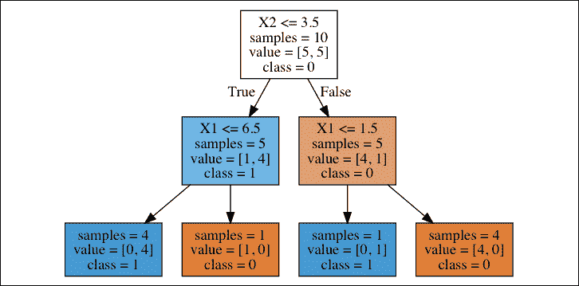

图 4.11:树的可视化

生成的树与我们之前的树基本相同。

我知道你迫不及待地想用决策树来预测广告点击率。让我们进入下一部分。

# 用决策树预测广告点击率

在几个例子之后，现在是时候使用您刚刚彻底学习和实践的决策树算法来预测广告点击率了。我们将使用来自卡格尔机器学习竞赛的数据集，*点击率预测*([https://www.kaggle.com/c/avazu-ctr-prediction](https://www.kaggle.com/c/avazu-ctr-prediction))。数据集可以从[https://www.kaggle.com/c/avazu-ctr-prediction/data](https://www.kaggle.com/c/avazu-ctr-prediction/data)下载。

只有`train.gz`文件包含标签样本，所以我们只需要下载这个并解压(需要一段时间)。在本章中，我们将只关注从`train.gz`解压缩的`train`文件中的前 300，000 个样本。

原始文件中的字段如下:

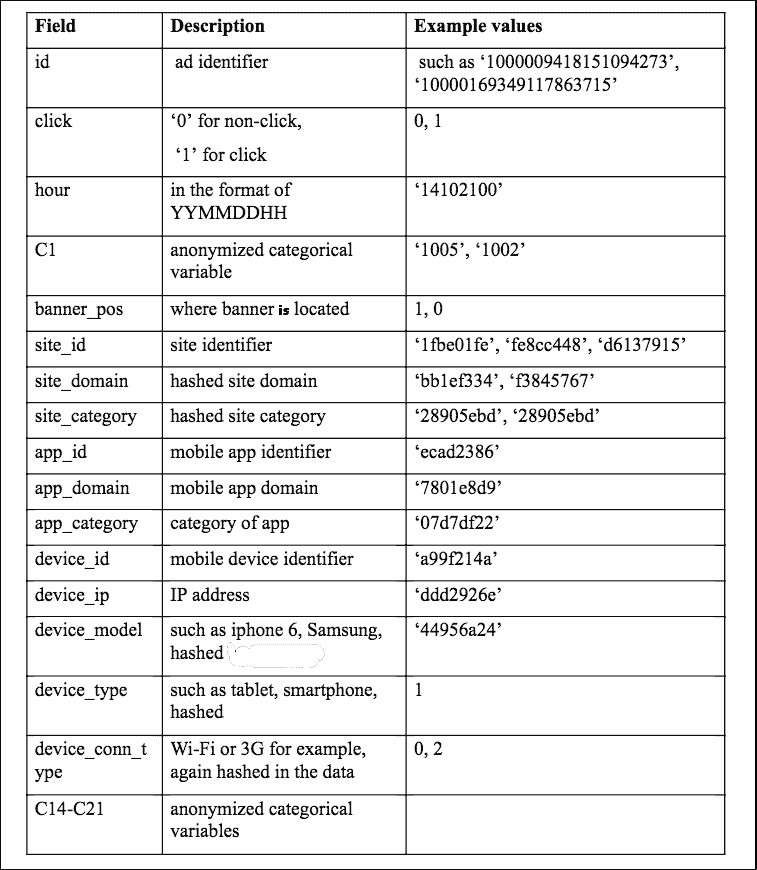

图 4.12:数据集的描述和示例值

我们通过运行以下命令来浏览文件的头部:

```py
head train | sed 's/,,/, ,/g;s/,,/, ,/g' | column -s, -t 
```

与简单的`head train`不同，输出更加清晰，因为所有的列都对齐了:

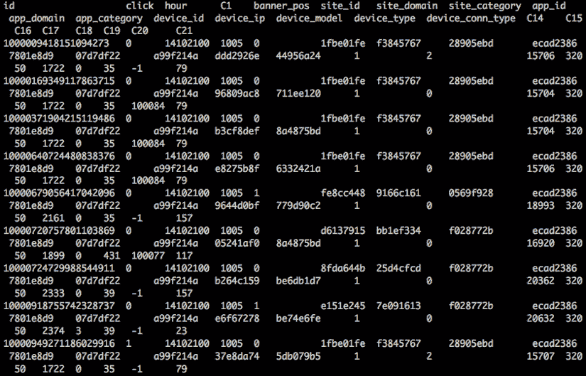

图 4.13:数据的前几行

不要被匿名和 T4 散列的值吓到。它们是分类特征，它们的每一个可能的值都对应一个真实且有意义的值，但由于隐私政策，它是以这种方式呈现的。可能，`C1`表示用户性别，`1005`和`1002`分别代表男性和女性。

现在，让我们从使用`pandas`读取数据集开始。没错，`pandas`非常擅长处理表格格式的数据:

```py
>>> import pandas as pd
>>> n_rows = 300000
>>> df = pd.read_csv("train.csv", nrows=n_rows) 
```

文件的前 300，000 行被加载并存储在数据帧中。快速查看数据框的前五行:

```py
>>> print(df.head(5))
id  click      hour C1 banner_pos   site_id ... C16 C17 C18 C19     C20 C21
0  1.000009e+18      0 14102100 1005          0 1fbe01fe ... 50 1722 0  35 -1 79
1  1.000017e+19      0 14102100 1005          0 1fbe01fe ... 50 1722 0  35 100084 79
2  1.000037e+19      0 14102100 1005          0 1fbe01fe ... 50 1722 0  35 100084 79
3  1.000064e+19      0 14102100 1005          0 1fbe01fe ... 50 1722 0  35 100084 79
4  1.000068e+19      0 14102100 1005          1 fe8cc448 ... 50 2161 0  35 -1 157 
```

目标变量是`click`列:

```py
>>> Y = df['click'].values 
```

对于其余的列，有几个列应该从特征中删除(`id`、`hour`、`device_id`和`device_ip`)，因为它们不包含太多有用的信息:

```py
>>> X = df.drop(['click', 'id', 'hour', 'device_id', 'device_ip'],  
                axis=1).values
>>> print(X.shape)
(300000, 19) 
```

每个样本都有`19`预测属性。

接下来，我们需要将数据分成训练集和 T2 测试集。通常，我们通过随机挑选样本来做到这一点。然而，在我们的例子中，样本是按时间顺序排列的，如`hour`字段所示。显然，我们不能用未来的样本来预测过去的样本。因此，我们将前 90%作为训练样本，其余的作为测试样本:

```py
>>> n_train = int(n_rows * 0.9)
>>> X_train = X[:n_train]
>>> Y_train = Y[:n_train]
>>> X_test = X[n_train:]
>>> Y_test = Y[n_train:] 
```

如前所述，决策树模型可以采用分类特征。然而，由于 scikit-learn 中基于树的算法(当前版本为 2020 年的 0.22.0)只允许数字输入，因此我们需要将分类特征转换为数字特征。但是请注意，一般来说，我们不需要这样做；例如，我们之前从头开发的决策树分类器可以直接接受分类特征。

我们现在将使用 scikit-learn 的`OneHotEncoder`模块将基于字符串的分类特征转换为单热编码向量。*第 1 章*、*机器学习入门和 Python* 中简单提到了一热编码。概括地说，它基本上将一个具有 *k* 可能值的分类特征转换为 *k* 二进制特征。例如，具有三个可能值的站点类别特征:`news`、`education`和`sports`，将被编码为三个二进制特征，如`is_news`、`is_education`和`is_sports`，其值为`1`或`0`。

我们初始化一个`OneHotEncoder`对象如下:

```py
>>> from sklearn.preprocessing import OneHotEncoder
>>> enc = OneHotEncoder(handle_unknown='ignore') 
```

我们将其安装在训练集上，如下所示:

```py
>>> X_train_enc = enc.fit_transform(X_train)
>>> X_train_enc[0]
<1x8385 sparse matrix of type '<class 'numpy.float64'>'
with 19 stored elements in Compressed Sparse Row format>
>>> print(X_train_enc[0])
 (0, 2) 1.0
 (0, 6) 1.0
 (0, 30) 1.0
 (0, 1471) 1.0
 (0, 2743) 1.0
 (0, 3878) 1.0
 (0, 4000) 1.0
 (0, 4048) 1.0
 (0, 6663) 1.0
 (0, 7491) 1.0
 (0, 7494) 1.0
 (0, 7861) 1.0
 (0, 8004) 1.
 (0, 8008) 1.0
 (0, 8085) 1.0
 (0, 8158) 1.0
 (0, 8163) 1.0
 (0, 8202) 1.0
 (0, 8383) 1.0 
```

每个转换后的样本都是一个稀疏向量。

我们使用训练好的单热编码器对测试集进行如下转换:

```py
>>> X_test_enc = enc.transform(X_test) 
```

记住，我们之前在一热编码器中指定了`handle_unknown='ignore'`参数。这是为了防止由于任何看不见的分类值而导致的错误。使用前面的站点类别示例，如果有一个值为`movie`的样本，所有三个转换后的二进制特征(`is_news`、`is_education`和`is_sports`)都将成为`0`。如果我们不指定`ignore`，将会出现错误。

接下来，我们将使用网格搜索来训练决策树模型，这是您在*第 3 章*、*使用支持向量机*识别人脸时了解到的。出于演示目的，我们将只调整`max_depth`超参数。其他超参数，如`min_samples_split`和`class_weight`，也是非常推荐的。分类度量应该是 ROC 的 AUC，因为它是一个不平衡的二进制情况(30 万个训练样本中只有 51211 个是点击，这是 17%的正 CTR 我鼓励你自己搞清楚班级分布):

```py
>>> from sklearn.tree import DecisionTreeClassifier
>>> parameters = {'max_depth': [3, 10, None]} 
```

我们为最大深度选择三个选项:`3`、`10`和无界。我们初始化了一个决策树模型，以基尼不纯作为度量，以`30`作为进一步分割所需的最小样本数:

```py
>>> decision_tree = DecisionTreeClassifier(criterion='gini',
...                                        min_samples_split=30)
>>> from sklearn.model_selection import GridSearchCV 
```

至于网格搜索，我们使用三重(因为有足够的训练样本)交叉验证，并选择由 AUC 测量的最佳性能超参数:

```py
>>> grid_search = GridSearchCV(decision_tree, parameters,
...                            n_jobs=-1, cv=3, scoring='roc_auc') 
```

注意`n_jobs=-1`意味着我们使用所有可用的 CPU 处理器:

```py
>>> grid_search.fit(X_train, y_train)
>>> print(grid_search.best_params_)
{'max_depth': 10} 
```

我们使用具有最佳参数的模型来预测任何未来的测试用例，如下所示:

```py
>>> decision_tree_best = grid_search.bestestimator
>>> pos_prob = decision_tree_best.predict_proba(X_test)[:, 1]
>>> from sklearn.metrics import roc_auc_score
>>> print(f'The ROC AUC on testing set is: {roc_auc_score(Y_test,
...           pos_prob):.3f}')
The ROC AUC on testing set is: 0.719 
```

用最优决策树模型得到的 AUC 为 0.72。这似乎不是很高，但点进涉及许多错综复杂的人为因素，这就是为什么预测它不是一件容易的事情。虽然我们可以进一步优化超参数，但 0.72 的 AUC 实际上是相当好的。随机选择 17%的样本点击将产生`0.496`的 AUC:

```py
>>> pos_prob = np.zeros(len(Y_test))
>>> click_index = np.random.choice(len(Y_test),
...                   int(len(Y_test) * 51211.0/300000), 
...                   replace=False)
>>> pos_prob[click_index] = 1
>>> print(f'The ROC AUC on testing set is: {roc_auc_score(Y_test,
...           pos_prob):.3f}')
The ROC AUC on testing set is: 0.496 
```

回顾过去，我们可以看到决策树是基于训练数据集在每一步贪婪搜索最佳分裂点的序列。然而，这往往会导致过拟合，因为最佳点很可能只对训练样本有效。幸运的是，集成是纠正这一点的技术，随机森林是一种集成树模型，通常优于简单的决策树。

# 集合决策树-随机森林

我在*第 1 章*、*机器学习入门和 Python* 中简单提到的**装袋**(代表 **bootstrap 聚合**)的**集成**手法可以有效克服过拟合。概括地说，从原始训练数据中随机抽取不同的训练样本集进行替换；每个结果集用于拟合一个单独的分类模型。这些单独训练的模型的结果然后通过**多数票**组合在一起，以做出最终决定。

如前一段所述的树打包减少了决策树模型遭受的高方差，因此，一般来说，比单个树表现更好。然而，在一些情况下，当一个或多个特征是强指标时，个体树主要基于这些特征构建，因此变得高度相关。聚合多个相关的树不会有太大的不同。为了强制每棵树变得不相关，随机森林在每个节点搜索最佳分割点时只考虑特征的随机子集。现在，基于不同的连续特征集训练单个树，这保证了更多的多样性和更好的性能。随机森林是树木套袋模型的一个变种，增加了**基于特征的套袋**。

为了在我们的点进预测项目中使用随机森林，我们可以使用 scikit-learn 的包。类似于我们在前面部分实现决策树的方式，我们只调整`max_depth`参数:

```py
>>> from sklearn.ensemble import RandomForestClassifier
>>> random_forest = RandomForestClassifier(n_estimators=100,
...                     criterion='gini', min_samples_split=30,
...                     n_jobs=-1) 
```

除了与单个决策树相关的重要超参数`max_depth`、`min_samples_split`、`class_weight`之外，还强烈推荐与随机森林(一组树)相关的超参数，如`n_estimators`。我们对`max_depth`进行如下微调:

```py
>>> grid_search = GridSearchCV(random_forest, parameters,
...                            n_jobs=-1, cv=3, scoring='roc_auc')
>>> grid_search.fit(X_train, y_train)
>>> print(grid_search.best_params_)
{'max_depth': None} 
```

我们使用具有最佳参数`None`的模型来预测任何未来看不见的情况(节点被扩展，直到满足另一个停止标准):

```py
>>> random_forest_best = grid_search.bestestimator
>>> pos_prob = random_forest_best.predict_proba(X_test)[:, 1]
>>> print('The ROC AUC on testing set is:
...           {0:.3f}'.format(roc_auc_score(y_test, pos_prob)))
The ROC AUC on testing set is: 0.759 
```

事实证明随机森林模型对性能有很大提升。

让我们总结几个需要调整的关键超参数:

*   `max_depth`:这是最深的个体树。如果太深，它往往会溢出；如果太浅，它往往会溢出。
*   `min_samples_split`:这个超参数代表在一个节点进一步分裂所需的最小样本数。太小的值会导致过拟合，而太大的值可能会导致欠拟合。`10`、`30`和`50`可能是不错的选择。

前面两个超参数一般与单个决策树相关。以下两个参数与随机森林或树木集合更相关:

*   `max_features`:该参数表示每次最佳分割点搜索需要考虑的特征数量。通常，对于 *m* 维数据集，(四舍五入)是`max_features`的推荐值。这可以在 scikit-learn 中指定为`max_features="sqrt"`。其他选项包括`log2`、20%和 50%的原始功能。
*   `n_estimators`:此参数表示考虑多数投票的树数。一般来说，树越多，性能越好，但计算时间越长。通常设置为`100`、`200`、`500`等。

接下来，我们将讨论渐变增强树。

# 集合决策树–梯度增强树

**Boosting** ，这是的另一种集成技术，采用迭代的方法，而不是并行组合多个学习者。在增强树中，不再单独训练单棵树。具体来说，在**梯度增强树** ( **GBT** )(也称为**梯度增强机**)中，单个树被连续训练，其中一棵树瞄准以纠正前一棵树所犯的错误。下面两张图说明了随机森林和 GBT 之间的区别:

随机森林使用数据集的不同子集独立构建每棵树，然后通过多数票或平均在末尾组合结果:

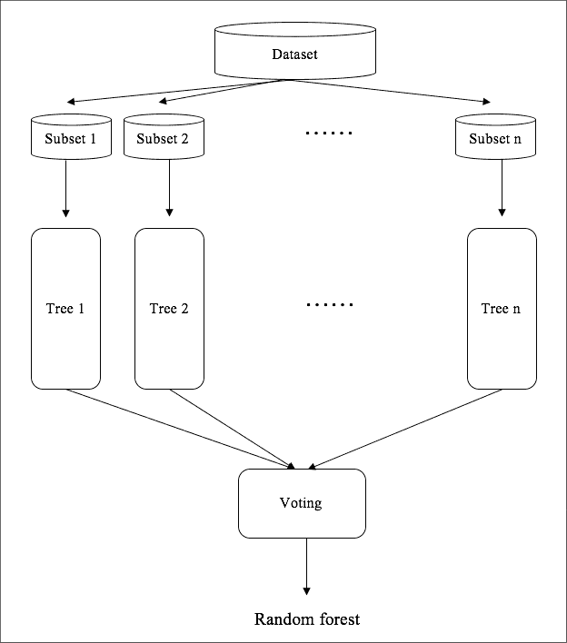

图 4.14:随机森林工作流

GBT 模型一次构建一棵树，并结合沿途的结果:

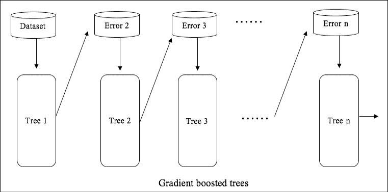

图 4.15:GBT 工作流程

我们将使用xboost 包([https://xgboost.readthedocs.io/en/latest/](https://xgboost.readthedocs.io/en/latest/))实现 GBT。我们首先通过以下命令安装 XGBoost Python 应用编程接口:

```py
pip install xgboost 
```

如果遇到问题，请安装或升级 CMake，如下:

```py
pip install CMake 
```

现在让我们看看下面的步骤。您将看到我们如何使用 GBT 预测点击量:

1.  首先，我们将标签变量转换为二维，这意味着 0 将变成[1，0]，1 将变成[0，1]:

    ```py
    >>> from sklearn.preprocessing import LabelEncoder
    >>> le = LabelEncoder()
    >>> Y_train_enc = le.fit_transform(Y_train) 
    ```

2.  We import XGBoost and initialize a GBT model:

    ```py
    >>> import xgboost as xgb
    >>> model = xgb.XGBClassifier(learning_rate=0.1, max_depth=10,
    ...                           n_estimators=1000) 
    ```

    我们将学习速率设置为 0.1，这决定了我们希望在每一步(在 GBT 的每棵树上)进行学习的速度有多快或多慢。我们将在*第 5 章*、*用逻辑回归预测在线广告点击率*中更详细地讨论学习率。`max_depth`对于单棵树设置为 10。此外，在我们的 GBT 模型中，将依次训练 1000 棵树。

3.  接下来，我们在之前准备的训练集上训练 GBT 模型:

    ```py
    >>> model.fit(X_train_enc, Y_train) 
    ```

4.  我们使用训练的模型对测试集进行预测，并相应地计算 ROC AUC】

使用 XGBoost GBT 模型，我们能够实现 0.77 AUC 。

在本节中，您了解了另一种类型的树集合，GBT，并将其应用于我们的广告点击率预测。

# 摘要

在这一章中，我们首先介绍了一个典型的机器学习问题，在线广告点击率预测，及其固有的挑战，包括分类特征。然后，我们研究了基于树的算法，该算法既可以采用数字特征，也可以采用分类特征。

接下来，我们对决策树算法进行了深入的讨论:它的机制、它的不同类型、如何构建树，以及两个度量标准(基尼杂质和熵)来衡量节点上拆分的有效性。手工构造树后，我们从头开始实现算法。

您还学习了如何使用 scikit-learn 中的决策树包，并将其应用于预测 CTR。我们继续通过采用基于特征的随机森林套袋算法来提高性能。最后，这一章以几种调整随机森林模型的方法结束，还有一个额外的部分，我们用 XGBoost 实现了一个 GBT 模型。打包和增强是两种可以提高学习成绩的模型集成方法。

多练习对磨练你的技能总是有好处的。我建议您在进入下一章之前完成以下练习，我们将使用另一种算法解决广告点击率预测:**逻辑回归**。

# 练习

1.  在决策树点进预测项目中，是否还可以对其他超参数进行微调，如`min_samples_split`、`class_weight`？你能达到的最高 AUC 是多少？
2.  在基于随机森林的点进预测项目中，是否也可以在 scikit-learn 中调整其他超参数，如`min_samples_split`、`max_features`、`n_estimators`？你能达到的最高 AUC 是多少？
3.  在基于 GBT 的点进预测项目中，你可以调整哪些超参数？你能达到的最高 AUC 是多少？可以阅读[https://xboost . read the docs . io/en/latest/python/python _ API . html # module-xboost . sklearn](https://xgboost.readthedocs.io/en/latest/python/python_api.html#module-xgboost.sklearn)来搞清楚。