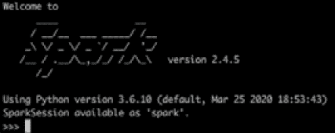
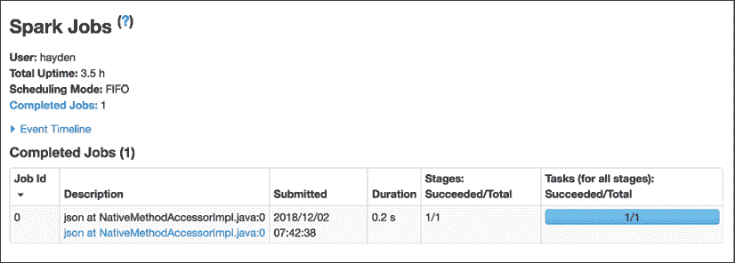
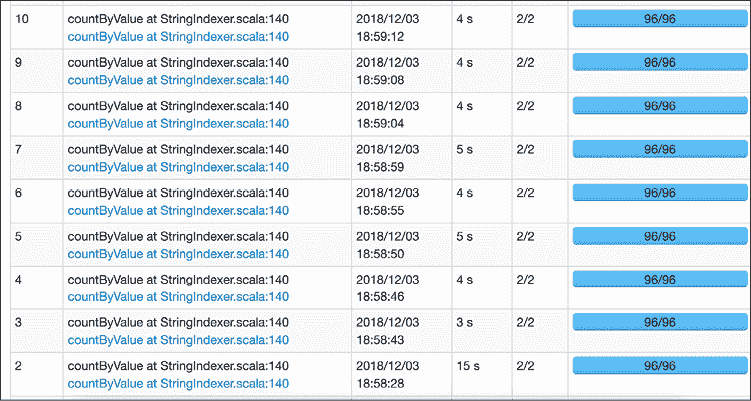
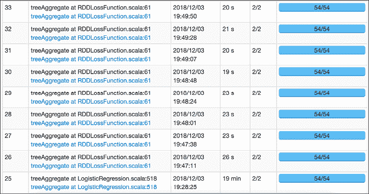

# 六、将预测扩展到万亿字节的点击日志

在前一章中，我们使用逻辑回归分类器开发了一个广告点击率预测器。我们通过对多达 100 万个点击日志样本进行高效训练，证明了该算法的高度可扩展性。在这一章中，我们将通过利用强大的并行计算(或者更具体地说，分布式计算)工具 Apache Spark 来进一步提高广告点击预测器的可扩展性。

本章将揭开 Apache Spark 如何用于在海量数据上扩展学习的神秘面纱，而不是将模型学习限制在一台机器上。我们还将使用 Python API`PySpark`，探索点击日志数据，基于整个点击日志数据集开发分类解决方案，并评估性能，所有这些都以分布式方式进行。除此之外，我将介绍两种处理分类特征的方法:一种与计算机科学中的散列相关，而另一种融合了多种特征。它们也将在 Spark 中实现。

在本章中，我们将涵盖以下主题:

*   Apache Spark 的主要组件
*   Spark装置
*   部署 Spark 应用
*   PySpark 中的基本数据结构
*   PySpark 中的核心编程
*   广告点击率预测在 PySpark 中的实现
*   PySpark 中的数据探索性分析
*   Spark 中的缓存和持久性
*   特征哈希及其在 PySpark 中的实现
*   PySpark 中的特征交互及其实现

# 学习 Apache Spark 的基本知识

Apache Spark 是一个分布式集群计算框架，设计用于快速和通用的计算。这是一项开源技术，最初由加州大学伯克利分校的 AMPLab 开发。它为交互式查询和流处理数据编程提供了一个易于使用的界面。它之所以成为受欢迎的大数据分析工具，是因为其隐含的数据并行性，即它跨计算集群中的处理器并行自动化数据操作。用户只需要关注他们想要如何操作数据，而不用担心数据如何在所有计算节点之间分布，或者一个节点负责哪部分数据。

记住，这本书主要是关于机器学习的。因此，我们将只简单介绍 Spark 的基础知识，包括它的组件、安装、部署、数据结构和核心编程。

## 分解Spark

我们将从 Spark 的主要组件开始，如下图所示:


图 6.1:Spark 的主要组件

让我们更详细地讨论它们:

*   **星火核心**:这是整个平台的基础和执行引擎。它提供任务分配、调度和内存计算。顾名思义，Spark核心是所有其他功能的基础。它也可以通过多种语言的 API 公开，包括 Python、Java、Scala 和 r。
*   **Spark SQL** :这是一个建立在 Spark Core 之上的组件，它引入了一个名为**数据框架**的高级数据抽象。稍后我们将在 Spark 中讨论数据结构。Spark SQL 支持 Python、Java 和 Scala 中类似 SQL 的数据操作，非常适合结构化和半结构化数据。在本章中，我们将使用 Spark SQL 中的模块。
*   **Spark Streaming** :通过利用 Spark Core 的快速调度和内存计算能力，执行实时(或接近实时)数据分析。
*   **MLlib** :简称**机器学习库**，这是建立在之上的 Spark Core 的分布式机器学习框架。得益于其分布式架构和内存计算能力，它允许对大规模数据进行高效学习。在内存计算中，如果**随机存取存储器** ( **随机存取存储器**)有足够的容量，数据将保存在其中，而不是保存在磁盘上。这降低了内存成本以及在迭代过程中前后重新加载数据的成本。训练机器学习模型基本上是一个迭代学习过程。因此，Spark 的内存计算能力使其非常适用于机器学习建模。根据主要的性能基准，使用 MLlib 学习的速度是基于磁盘的解决方案的近 10 倍。在本章中，我们将使用 Spark MLlib 中的模块。
*   **GraphX**: This is another functionality built on top of Spark Core that focuses on distributed graph-based processing. PageRank and Pregel abstraction are two typical use cases.

    本节的主要目标是将 Spark 理解为一个为快速计算而设计的分布式集群计算框架，它促进了数据分析和迭代学习。如果你正在寻找更多关于 Spark 的详细信息，在线上有很多有用的文档和教程，比如[https://spark.apache.org/docs/latest/quick-start.html](https://spark.apache.org/docs/latest/quick-start.html)。

## 安装Spark

出于学习的目的，现在让我们在本地计算机上安装 Spark(尽管它在服务器集群中更频繁地使用)。完整的说明可以在[https://spark.apache.org/downloads.html](https://spark.apache.org/downloads.html)找到。有好几个版本，我们就以预建了 Apache Hadoop 2.7 的 2.4.5 版本(2020 年 2 月 05 日)为例。

在撰写本文时，最新的稳定版本是 2.4.5。虽然有一个预览版，3.0.0，但我觉得最新的稳定版已经足够入手了。看完这一章，你不会注意到 3.0 和 2.4.5 有什么不同。请注意，模块 `pyspark.ml.feature.OneHotEncoderEstimator`已被弃用，并在预览版(v 3.0.0 及以上版本)中删除。它的功能已经被 `pyspark.ml.feature.OneHotEncoder`完善了。

如下图截图所示，在*第一步*中选择 **2.4.5** 后，我们在*第二步*中选择**预建的 Apache Hadoop 2.7** 选项。然后，我们点击*步骤 3* 中的链接下载**spark-2 . 4 . 5-bin-Hadoop 2 . 7 . tgz**文件:


图 6.2:下载 Spark 的步骤

解压缩下载的文件。生成的文件夹包含一个完整的 Spark 包；您不需要做任何额外的安装。

在运行任何 Spark 程序之前，我们需要确保安装了以下依赖项:

*   Java 8+，它包含在系统环境变量中
*   Scala 版

为了检查 Spark 是否安装正确，我们运行了以下测试:

1.  首先，我们通过在终端中键入以下命令，使用 Spark 近似计算 *π* 的值(注意`bin`是`spark-2.4.5-bin-hadoop2.7`中的一个文件夹，所以记得在这个文件夹中运行以下命令):

    ```py
    ./bin/run-example SparkPi 10 
    ```

2.  It should print out something similar to the following (the values may differ):

    ```py
    Pi is roughly 3.141851141851142 
    ```

    该测试实际上类似于以下测试:

    ```py
    ./bin/spark-submit examples/src/main/python/pi.py 10 
    ```

3.  Next, we test the interactive shell with the following command:

    ```py
    ./bin/pyspark --master local[2] 
    ```

    这应该会打开一个 Python 解释器，如下图所示:

    

图 6.3:外壳中运行的Spark

到目前为止，应该已经正确安装了 Spark 程序。我们将在接下来的章节中讨论命令(`pyspark`和`spark-submit`)。

## 启动和部署Spark计划

一个 Spark 程序可以自己运行，也可以在集群管理器上运行。第一个选项类似于用多个线程在本地运行一个程序，一个线程被认为是一个 Spark 作业工作者。当然，根本没有并行性，但这是一种快速简单的启动 Spark 应用的方法，我们将在本章中通过演示的方式以这种模式部署它。例如，我们可以运行以下脚本来启动 Spark 应用:

```py
 ./bin/spark-submit examples/src/main/python/pi.py 
```

这正是我们在上一节中所做的。或者，我们可以指定线程数:

```py
 ./bin/spark-submit --master local[4] examples/src/main/python/pi.py 
```

在前面的代码中，我们通过使用以下命令，使用四个工作线程(或者机器上有多少个内核)在本地运行 Spark:

```py
 ./bin/spark-submit --master local[*] examples/src/main/python/pi.py 
```

同样，我们可以通过将`spark-submit`替换为`pyspark`来启动交互外壳:

```py
 ./bin/pyspark --master local[2] examples/src/main/python/pi.py 
```

至于集群模式，它(版本 2.4.5)目前支持以下方法:

*   **独立**:这是启动 Spark 应用最简单的模式。意思是师傅和工人在同一台机器上。有关如何在独立集群模式下启动 Spark 应用的详细信息，请访问以下链接:[https://spark.apache.org/docs/latest/spark-standalone.html](https://spark.apache.org/docs/latest/spark-standalone.html)。
*   **Apache Mesos** :作为一个集中式的容错集群管理器，Mesos 是为管理分布式计算环境而设计的。在 Spark 中，当驱动程序提交任务进行调度时，Mesos 会确定哪些机器处理哪些任务。详见[https://spark.apache.org/docs/latest/running-on-mesos.html](https://spark.apache.org/docs/latest/running-on-mesos.html)。
*   **Apache Hadoop 纱**:这种方法中的任务调度器变成了纱，与前一种方法中的 Mesos 相反。**纱**，是**的缩写。另一个资源协商者**是 Hadoop 中的资源管理器。有了纱，Spark可以更容易地集成到 Hadoop 生态系统(如 MapReduce、Hive 和文件系统)中。更多信息请访问以下链接:[https://spark.apache.org/docs/latest/running-on-yarn.html](https://spark.apache.org/docs/latest/running-on-yarn.html)。
*   **Kubernetes** :这是一个开源系统，提供以容器为中心的基础设施。它有助于自动化工作部署和管理，近年来越来越受欢迎。Spark 的 Kubernetes 还是很新的，但是如果你感兴趣的话，可以在下面的链接中阅读更多内容:[https://Spark . Apache . org/docs/latest/running-on-kubernetes . html](https://spark.apache.org/docs/latest/running-on-kubernetes.html)。

启动和部署 Spark 应用很容易。用 PySpark 编码怎么样？让我们在下一节看到。

# PySpark 中的编程

本节提供了在 Spark 中使用 Python 编程的快速介绍。我们将从 Spark 中的基本数据结构开始。

**弹性分布式数据集** ( **RDD** )是 Spark 中的主数据结构。它是对象的分布式集合，具有以下三个主要特征:

*   **弹性**:当任何节点出现故障时，受影响的分区将被重新分配到健康的节点，这使得 Spark 具有容错性
*   **分布式**:数据驻留在集群中的一个或多个节点上，可以并行操作
*   **数据集**:包含分区数据及其值或元数据的集合

在 2.0 版本之前，RDD 是 Spark 的主要数据结构。之后，它被 DataFrame 取代，data frame 也是一个分布式数据集合，但被组织成命名列。数据帧利用了 Spark SQL 的优化执行引擎。因此，它们在概念上类似于关系数据库中的表或 Python `pandas`库中的`DataFrame`对象。

尽管当前版本的 Spark 仍然支持 RDD，但强烈建议使用数据框编程。因此，我们不会花太多时间和 RDD 一起编程。感兴趣的话可以参考[https://spark . Apache . org/docs/latest/rdd-programming-guide . html](https://spark.apache.org/docs/latest/rdd-programming-guide.html)。

Spark程序的入口点是创建Spark会话，这可以通过使用以下几行来完成:

```py
>>> from pyspark.sql import SparkSession
>>> spark = SparkSession \
...     .builder \
...     .appName("test") \
...     .getOrCreate() 
```

请注意，如果我们在 PySpark shell 中运行它，则不需要这样做。就在我们旋转一个 PySpark 外壳(带`./bin/pyspark`)之后，一个 Spark 会话被自动创建。我们可以在以下链接查看正在运行的 Spark 应用:`localhost:4040/jobs/`。有关结果页面，请参考以下屏幕截图:


图 6.4:Spark应用用户界面

通过Spark会话`spark`，可以通过读取文件(通常是这种情况)或手动输入来创建数据框对象。在以下示例中，我们将从 CSV 文件创建一个数据框对象`df`:

```py
>>> df = spark.read.csv("examples/src/main/resources/people.csv", 
                                           header=True, sep=';') 
```

CSV 文件`people.csv`中的列用`;`隔开。

一旦完成，我们将在`localhost:4040/jobs/`中看到完成的工作:



图 6.5:Spark 应用中已完成的作业列表

我们可以使用以下命令显示`df`对象的内容:

```py
>>> df.show()
+-----+---+---------+
| name|age|      job|
+-----+---+---------+
|Jorge| 30|Developer|
|  Bob| 32|Developer|
+-----+---+---------+ 
```

我们可以使用以下命令计算的行数:

```py
>>> df.count()
2 
```

使用以下命令可以显示`df`对象的模式:

```py
>>> df.printSchema()
root
 |-- name: string (nullable = true)
 |-- age: string (nullable = true)
 |-- job: string (nullable = true) 
```

可以按如下方式选择一列或多列:

```py
>>> df.select("name").show()
+-----+
| name|
+-----+
|Jorge|
|  Bob|
+-----+
>>> df.select(["name", "job"]).show()
+-----+---------+
| name|      job|
+-----+---------+
|Jorge|Developer|
|  Bob|Developer|
+-----+---------+ 
```

我们可以通过条件过滤行，例如，通过一列的值，使用以下命令:

```py
>>> df.filter(df['age'] > 31).show()
+----+---+---------+
|name|age|      job|
+----+---+---------+
| Bob| 32|Developer|
+----+---+---------+ 
```

我们将在下一节继续在 PySpark 中编程，在这里我们将使用 Spark 来解决广告点击率问题。

# 使用 Spark 学习海量点击日志

通常情况下，为了利用 Spark，数据是使用 **Hadoop 分布式文件系统** ( **HDFS** )进行存储的，这是一个分布式文件系统，旨在存储大量数据，计算发生在集群上的多个节点上。出于演示目的，我们将把数据保存在本地机器上，并在本地运行 Spark。这与在分布式计算集群上运行它没有什么不同。

## 正在加载点击日志

为了在海量点击日志上训练模型，我们首先需要在 Spark 中加载数据。为此，我们采取了以下步骤:

1.  We spin up the PySpark shell by using the following command:

    ```py
    ./bin/pyspark --master local[*]  --driver-memory 20G 
    ```

    这里，我们指定了一个大的驱动程序内存，因为我们处理的数据集超过 6 GB。

    驱动程序负责收集和存储来自执行者的处理结果。因此，大的驱动程序内存有助于完成处理大量数据的任务。

2.  接下来，我们使用名为`CTR` :

    ```py
    >>> spark = SparkSession\
    ...     .builder\
    ...     .appName("CTR")\
    ...     .getOrCreate() 
    ```

    的应用启动 Spark 会话
3.  Then, we load the click log data from the `train` file into a DataFrame object. Note that the data load function `spark.read.csv` allows custom schemas, which guarantees data is loaded as expected, as opposed to automatically inferring schemas. So, first, we define the schema:

    ```py
    >>> from pyspark.sql.types import StructField, StringType, 
             StructType, IntegerType
    >>> schema = StructType([
    ...     StructField("id", StringType(), True),
    ...     StructField("click", IntegerType(), True),
    ...     StructField("hour", IntegerType(), True),
    ...     StructField("C1", StringType(), True),
    ...     StructField("banner_pos", StringType(), True),
    ...     StructField("site_id", StringType(), True),
    ...     StructField("site_domain", StringType(), True),
    ...     StructField("site_category", StringType(), True),
    ...     StructField("app_id", StringType(), True),
    ...     StructField("app_domain", StringType(), True),
    ...     StructField("app_category", StringType(), True),
    ...     StructField("device_id", StringType(), True),
    ...     StructField("device_ip", StringType(), True),
    ...     StructField("device_model", StringType(), True),
    ...     StructField("device_type", StringType(), True),
    ...     StructField("device_conn_type", StringType(), True),
    ...     StructField("C14", StringType(), True),
    ...     StructField("C15", StringType(), True),
    ...     StructField("C16", StringType(), True),
    ...     StructField("C17", StringType(), True),
    ...     StructField("C18", StringType(), True),
    ...     StructField("C19", StringType(), True),
    ...     StructField("C20", StringType(), True),
    ...     StructField("C21", StringType(), True),
    ... ]) 
    ```

    模式的每个字段包含列名(如`id`、`click`或`hour`)、数据类型(如`integer`或`string`)以及是否允许缺失值(在本例中是允许的)。

4.  With the defined schema, we create a DataFrame object, `df`:

    ```py
    >>> df = spark.read.csv("file://path_to_file/train", schema=schema, 
                                                          header=True) 
    ```

    记得用`train` 数据文件所在的绝对路径替换`path_to_file`。`file://`前缀表示从本地文件中读取数据。另一个前缀`dbfs://`用于存储在 HDFS 的数据。

5.  我们现在按照如下方式再次检查模式:

    ```py
    >>> df.printSchema()
    root
     |-- id: string (nullable = true)
     |-- click: integer (nullable = true)
     |-- hour: integer (nullable = true)
     |-- C1: string (nullable = true)
     |-- banner_pos: string (nullable = true)
     |-- site_id: string (nullable = true)
     |-- site_domain: string (nullable = true)
     |-- site_category: string (nullable = true)
     |-- app_id: string (nullable = true)
     |-- app_domain: string (nullable = true)
     |-- app_category: string (nullable = true)
     |-- device_id: string (nullable = true)
     |-- device_ip: string (nullable = true)
     |-- device_model: string (nullable = true)
     |-- device_type: string (nullable = true)
     |-- device_conn_type: string (nullable = true)
     |-- C14: string (nullable = true)
     |-- C15: string (nullable = true)
     |-- C16: string (nullable = true)
     |-- C17: string (nullable = true)
     |-- C18: string (nullable = true)
     |-- C19: string (nullable = true)
     |-- C20: string (nullable = true)
     |-- C21: string (nullable = true) 
    ```

6.  数据大小检查如下:

    ```py
    >>> df.count()
    40428967 
    ```

7.  此外，我们需要删除几个几乎不提供信息的列。我们使用以下代码来实现:

    ```py
    >>> df = 
        df.drop('id').drop('hour').drop('device_id').drop('device_ip') 
    ```

8.  我们将该列从`click`重命名为`label`，因为这将在下游操作中更频繁地消耗:

    ```py
    >>> df = df.withColumnRenamed("click", "label") 
    ```

9.  让我们看看 DataFrame 对象中的当前列:

    ```py
    >>> df.columns
    ['label', 'C1', 'banner_pos', 'site_id', 'site_domain', 'site_category', 'app_id', 'app_domain', 'app_category', 'device_model', 'device_type', 'device_conn_type', 'C14', 'C15', 'C16', 'C17', 'C18', 'C19', 'C20', 'C21'] 
    ```

检查完输入数据后，我们需要对数据进行拆分和缓存。

## 拆分和缓存数据

在这里，我们将数据分为训练集和测试集，如下所示:

```py
>>> df_train, df_test = df.randomSplit([0.7, 0.3], 42) 
```

在这种情况下，70%的样本用于训练，剩余的样本用于测试，随机种子一如既往地用于繁殖。

在我们对训练集`df_train`执行任何繁重的提升(如模型学习)之前，最好先缓存对象。在 Spark 中，**缓存**和**持久性**是降低计算开销的优化技术。这将 RDD 或数据帧操作的中间结果保存在内存和/或磁盘上。如果没有缓存或持久性，每当需要一个中间数据帧时，它将根据最初的创建方式再次被重新计算。根据存储级别的不同，持久性的表现也不同:

*   `MEMORY_ONLY`:对象只存储在内存中。如果它不适合内存，剩余部分将在每次需要时重新计算。
*   `DISK_ONLY`:对象只保存在磁盘上。持久化对象可以直接从存储中提取，而无需重新计算。
*   `MEMORY_AND_DISK`:对象存储在内存中，也可能在磁盘上。如果整个对象不适合内存，剩余的分区将存储在磁盘上，而不是每次需要时都重新计算。这是 Spark 中缓存和持久性的默认模式。它利用了内存存储的快速检索和磁盘存储的高可访问性和容量。

在 PySpark 中，缓存很简单。所需要的只是一个缓存方法。

让我们缓存训练和测试数据帧:

```py
>>> df_train.cache()
DataFrame[label: int, C1: string, banner_pos: string, site_id: string, site_domain: string, site_category: string, app_id: string, app_domain: string, app_category: string, device_model: string, device_type: string, device_conn_type: string, C14: string, C15: string, C16: string, C17: string, C18: string, C19: string, C20: string, C21: string]
>>> df_train.count()
28297027
>>> df_test.cache()
DataFrame[label: int, C1: string, banner_pos: string, site_id: string, site_domain: string, site_category: string, app_id: string, app_domain: string, app_category: string, device_model: string, device_type: string, device_conn_type: string, C14: string, C15: string, C16: string, C17: string, C18: string, C19: string, C20: string, C21: string]
>>> df_test.count()
12131940 
```

现在，我们已经为下游分析准备好了培训和测试数据。

## 热门编码分类特征

与前一章类似，我们需要通过执行以下步骤将分类特征编码成多组二进制特征:

1.  In our case, the categorical features include the following:

    ```py
    >>> categorical = df_train.columns
    >>> categorical.remove('label')
    >>> print(categorical)
    ['C1', 'banner_pos', 'site_id', 'site_domain', 'site_category', 'app_id', 'app_domain', 'app_category', 'device_model', 'device_type', 'device_conn_type', 'C14', 'C15', 'C16', 'C17', 'C18', 'C19', 'C20', 'C21'] 
    ```

    在 PySpark 中，一键编码不像 scikit-learn 中那样直接(特别是`OneHotEncoder`模块)。

2.  We need to index each categorical column using the `StringIndexer` module:

    ```py
    >>> from pyspark.ml.feature import StringIndexer
    >>> indexers = [
    ...       StringIndexer(inputCol=c, outputCol=
                 "{0}_indexed".format(c)).setHandleInvalid("keep")
    ...                                     for c in categorical
    ... ] 
    ```

    `setHandleInvalid("keep")`句柄确保如果出现任何新的分类值，应用不会崩溃。尽量省略；您将看到与未知值相关的错误消息。

3.  然后，我们使用`OneHotEncoderEstimator`模块对每个单独的索引分类列执行一次热编码:

    ```py
    >>> from pyspark.ml.feature import OneHotEncoderEstimator
    >>> encoder = OneHotEncoderEstimator(
    ...     inputCols=[indexer.getOutputCol() for indexer in indexers],
    ...     outputCols=["{0}_encoded".format(indexer.getOutputCol()) 
                                              for indexer in indexers]
    ... ) 
    ```

4.  Next, we concatenate all sets of generated binary vectors into a single one using the `VectorAssembler` module:

    ```py
    >>> from pyspark.ml.feature import VectorAssembler
    >>> assembler = VectorAssembler(
    ...                     inputCols=encoder.getOutputCols(),
    ...                     outputCol="features"
    ... ) 
    ```

    这将创建名为`features.`的最终编码向量列

5.  We chain all these three stages together into a pipeline with the `Pipeline` module in PySpark, which better organizes our one-hot encoding workflow:

    ```py
    >>> stages = indexers + [encoder, assembler]
    >>> from pyspark.ml import Pipeline
    >>> pipeline = Pipeline(stages=stages) 
    ```

    变量`stages`是编码所需的操作列表。

6.  最后，我们可以将`pipeline`单热编码模型拟合到训练集:

    ```py
    >>> one_hot_encoder = pipeline.fit(df_train) 
    ```

7.  完成后，我们使用训练好的编码器来转换训练集和测试集。对于训练集，我们使用以下代码:

    ```py
    >>> df_train_encoded = one_hot_encoder.transform(df_train)
    >>> df_train_encoded.show() 
    ```

8.  At this point, we skip displaying the results as there are dozens of columns with several additional ones added on top of `df_train`. However, we can see the one we are looking for, the `features` column, which contains the one-hot encoded results. Hence, we only select this column, along with the target variable:

    ```py
    >>> df_train_encoded = df_train_encoded.select(
                                    ["label", "features"])
    >>> df_train_encoded.show()
    +-----+--------------------+
    |label|            features|
    +-----+--------------------+
    |    0|(31458,[5,7,3527,...|
    |    0|(31458,[5,7,788,4...|
    |    0|(31458,[5,7,788,4...|
    |    0|(31458,[5,7,788,4...|
    |    0|(31458,[5,7,788,4...|
    |    0|(31458,[5,7,788,4...|
    |    0|(31458,[5,7,788,4...|
    |    0|(31458,[5,7,788,4...|
    |    0|(31458,[5,7,788,4...|
    |    0|(31458,[5,7,788,4...|
    |    0|(31458,[5,7,788,4...|
    |    0|(31458,[5,7,788,4...|
    |    0|(31458,[5,7,788,4...|
    |    0|(31458,[5,7,1271,...|
    |    0|(31458,[5,7,1271,...|
    |    0|(31458,[5,7,1271,...|
    |    0|(31458,[5,7,1271,...|
    |    0|(31458,[5,7,1532,...|
    |    0|(31458,[5,7,4366,...|
    |    0|(31458,[5,7,14,45...|
    +-----+--------------------+
    only showing top 20 rows 
    ```

    特征列包含大小为`31458`的稀疏向量。

9.  不要忘记缓存`df_train_encoded`，因为我们将使用它来迭代训练我们的分类模型:

    ```py
    >>> df_train_encoded.cache()
    DataFrame[label: int, features: vector] 
    ```

10.  为了释放一些空间，我们打开`df_train`，因为我们将不再需要它:

    ```py
    >>> df_train.unpersist()
    DataFrame[label: int, C1: string, banner_pos: string, site_id: string, site_domain: string, site_category: string, app_id: string, app_domain: string, app_category: string, device_model: string, device_type: string, device_conn_type: string, C14: string, C15: string, C16: string, C17: string, C18: string, C19: string, C20: string, C21: string] 
    ```

11.  现在，我们对测试集重复前面的步骤:

    ```py
    >>> df_test_encoded = one_hot_encoder.transform(df_test)
    >>> df_test_encoded = df_test_encoded.select(["label", "features"])
    >>> df_test_encoded.show()
    +-----+--------------------+
    |label|            features|
    +-----+--------------------+
    |    0|(31458,[5,7,788,4...|
    |    0|(31458,[5,7,788,4...|
    |    0|(31458,[5,7,788,4...|
    |    0|(31458,[5,7,788,4...|
    |    0|(31458,[5,7,788,4...|
    |    0|(31458,[5,7,14,45...|
    |    0|(31458,[5,7,14,45...|
    |    0|(31458,[5,7,14,45...|
    |    0|(31458,[5,7,14,45...|
    |    0|(31458,[5,7,14,45...|
    |    0|(31458,[5,7,14,45...|
    |    0|(31458,[5,7,14,45...|
    |    0|(31458,[5,7,14,45...|
    |    0|(31458,[5,7,14,45...|
    |    0|(31458,[5,7,14,45...|
    |    0|(31458,[5,7,14,45...|
    |    0|(31458,[5,7,14,45...|
    |    0|(31458,[5,7,14,45...|
    |    0|(31458,[5,7,2859,...|
    |    0|(31458,[1,7,651,4...|
    +-----+--------------------+
    only showing top 20 rows
    >>> df_test_encoded.cache()
    DataFrame[label: int, features: vector]
    >>> df_test.unpersist()
    DataFrame[label: int, C1: string, banner_pos: string, site_id: string, site_domain: string, site_category: string, app_id: string, app_domain: string, app_category: string, device_model: string, device_type: string, device_conn_type: string, C14: string, C15: string, C16: string, C17: string, C18: string, C19: string, C20: string, C21: string] 
    ```

12.  如果你在浏览器中查看 Spark UI `localhost:4040/jobs/`，你会看到几个已经完成的作业，比如如下:

    

图 6.6:编码后完成的作业列表

有了编码的训练和测试集，我们现在可以训练我们的分类模型了。

## 训练和测试逻辑回归模型

我们将使用逻辑回归作为我们的例子，但是 PySpark 中还支持许多其他的分类模型，例如决策树分类器、随机森林、神经网络(我们将在*第 8 章*、*使用人工神经网络*预测股票价格)、线性 SVM 和朴素贝叶斯。详情请参考以下链接:[https://spark . Apache . org/docs/latest/ml-classification-revolution . html # classification](https://spark.apache.org/docs/latest/ml-classification-regression.html#classification)。

我们可以通过以下步骤训练和测试逻辑回归模型:

1.  We first import the logistic regression module and initialize a model:

    ```py
    >>> from pyspark.ml.classification import LogisticRegression
    >>> classifier = LogisticRegression(maxIter=20, regParam=0.001, 
                                        elasticNetParam=0.001) 
    ```

    这里，我们将最大迭代次数设置为`20`，正则化参数设置为`0.001`。

2.  Now, we fit the model on the encoded training set:

    ```py
    >>> lr_model = classifier.fit(df_train_encoded) 
    ```

    请注意这可能需要一段时间。您可以同时在Spark界面检查正在运行或已完成的作业。有关一些已完成的作业，请参考以下屏幕截图:

    

    图 6.7:培训后完成的工作列表

    注意，每个 **RDDLossFunction** 代表优化逻辑回归分类器的迭代。

3.  在所有迭代之后，我们将训练好的模型应用于测试集:

    ```py
    >>> predictions = lr_model.transform(df_test_encoded) 
    ```

4.  We cache the prediction results, as we will compute the prediction's performance:

    ```py
    >>> predictions.cache()
    DataFrame[label: int, features: vector, rawPrediction: vector, probability: vector, prediction: double]
    Take a look at the prediction DataFrame:
    >>> predictions.show()
    +-----+--------------------+--------------------+--------------------+----------+
    |label|            features|       rawPrediction|         probability|prediction|
    +-----+--------------------+--------------------+--------------------+----------+
    |    0|(31458,[5,7,788,4...|[2.80267740289335...|[0.94282033454271...|       0.0|
    |    0|(31458,[5,7,788,4...|[2.72243908463177...|[0.93833781006061...|       0.0|
    |    0|(31458,[5,7,788,4...|[2.72243908463177...|[0.93833781006061...|       0.0|
    |    0|(31458,[5,7,788,4...|[2.82083664358057...|[0.94379146612755...|       0.0|
    |    0|(31458,[5,7,788,4...|[2.82083664358057...|[0.94379146612755...|       0.0|
    |    0|(31458,[5,7,14,45...|[4.44920221201642...|[0.98844714081261...|       0.0|
    |    0|(31458,[5,7,14,45...|[4.44920221201642...|[0.98844714081261...|       0.0|
    |    0|(31458,[5,7,14,45...|[4.44920221201642...|[0.98844714081261...|       0.0|
    |    0|(31458,[5,7,14,45...|[4.54759977096521...|[0.98951842852058...|       0.0|
    |    0|(31458,[5,7,14,45...|[4.54759977096521...|[0.98951842852058...|       0.0|
    |    0|(31458,[5,7,14,45...|[4.38991492595212...|[0.98775013592573...|       0.0|
    |    0|(31458,[5,7,14,45...|[4.38991492595212...|[0.98775013592573...|       0.0|
    |    0|(31458,[5,7,14,45...|[4.38991492595212...|[0.98775013592573...|       0.0|
    |    0|(31458,[5,7,14,45...|[4.38991492595212...|[0.98775013592573...|       0.0|
    |    0|(31458,[5,7,14,45...|[5.58870435258071...|[0.99627406423617...|       0.0|
    |    0|(31458,[5,7,14,45...|[5.66066729150822...|[0.99653187592454...|       0.0|
    |    0|(31458,[5,7,14,45...|[5.66066729150822...|[0.99653187592454...|       0.0|
    |    0|(31458,[5,7,14,45...|[5.61336061100621...|[0.99636447866332...|       0.0|
    |    0|(31458,[5,7,2859,...|[5.47553763410082...|[0.99582948965297...|       0.0|
    |    0|(31458,[1,7,651,4...|[1.33424801682849...|[0.79154243844810...|       0.0|
    +-----+--------------------+--------------------+--------------------+----------+
    only showing top 20 rows 
    ```

    该包含预测特征、地面真实情况、两类概率和最终预测(决策阈值为 0.5)。

5.  我们使用带有`areaUnderROC`评估指标的`BinaryClassificationEvaluator`功能评估测试装置上**接收器操作特性** ( **ROC** )的**曲线下面积** ( **AUC** )

我们因此能够获得 74.89%的 AUC。我们能做得更好吗？让我们在下一节看到。

# 基于 Spark 的分类变量特征工程

在本章中，我已经演示了如何使用 Spark 构建一个从海量点击日志中学习的广告点击预测器。到目前为止，我们一直在使用单热编码来使用分类输入。在本节中，我们将讨论两种流行的特征工程技术:特征散列和特征交互。

特征哈希是一热编码的替代方案，而特征交互是一热编码的变体。**特征工程**是指基于领域知识或定义的规则生成新的特征，以提高利用现有特征空间实现的学习性能。

## 散列分类特征

在机器学习中，**特征哈希**(也称为**哈希技巧**)是一种高效的方式来编码分类特征。它基于计算机科学中的散列函数，将可变大小的数据映射到固定(通常更小)大小的数据。通过一个例子更容易理解特征散列。

假设我们有三个特性:**性别**、**站点 _ 域**、**设备 _ 型号**:

<colgroup><col> <col> <col></colgroup> 
| 性别 | 站点 _ 域 | 设备模型 |
| 男性的 | 美国有线新闻网 | 三星电子 |
| 女性的 | 字母表 | 苹果手机 |
| 男性的 | 美国全国广播公司 | 华为 |
| 男性的 | 脸谱网 | 小米 |
| 女性的 | 字母表 | 苹果手机 |

表 6.1:三个分类特征的示例数据

通过一热编码，这些将成为大小为 9 的特征向量，其来自 2(来自**性别** ) + 4(来自**站点 _ 域** ) + 3(来自**设备 _ 模型**)。通过特征散列，我们希望获得大小为 4 的特征向量。我们将散列函数定义为每个字符的 Unicode 代码点之和，然后将结果除以 4，并将余数作为散列输出。以第一行为例；我们有以下内容:

*单词（m） + 单词（a） + 单词（l） + 单词+++ 单词（s） + 单词（u） + 单词（n） + 单词（g） =*

*109+97+108+101+……+115+117+110+103 = 1500*

1500 % 4 = 0，也就是说我们可以将这个样本编码到**【1 0 0 0】**中。类似地，如果余数为 1，样本被散列成**【0，1，0，0】**；**【0，0，1，0】**为样本，2 为余数；**【0，0，0，1】**为 3 为余数的样品；等等。

同样，对于其他行，我们有以下内容:

<colgroup><col> <col> <col> <col></colgroup> 
| 性别 | 站点 _ 域 | 设备模型 | 散列结果 |
| 男性的 | 美国有线新闻网 | 三星电子 | [1 0 0 0] |
| 女性的 | 字母表 | 苹果手机 | [0 0 0 1] |
| 男性的 | 美国全国广播公司 | 华为 | [0 1 0 0] |
| 男性的 | 脸谱网 | 小米 | [1 0 0 0] |
| 女性的 | 字母表 | 苹果手机 | [0 0 0 1] |

表 6.2:示例数据的散列结果

最后，我们使用四维散列向量来表示原始数据，而不是九维一维热编码向量。

关于功能散列，有几点需要注意:

*   相同的输入将始终转换为相同的输出；例如，第二行和第五行。
*   两个不同的输入可能会转换为相同的输出，例如第一行和第四行。这个现象叫做**哈希碰撞**。
*   因此，选择最终的固定尺寸很重要。如果尺寸太小，会导致严重的碰撞和信息丢失。如果太大，基本上是冗余的一热编码。有了正确的大小，它将使哈希节省空间，同时保留重要信息，这将进一步有利于下游任务。
*   哈希是单向的，这意味着我们不能将输出转换为输入，而单向编码是双向映射。

现在让我们在点击预测项目中采用特征散列法。回想一下，一次性编码向量的大小是 31，458。如果我们选择 10，000 作为固定的散列大小，我们将能够将空间减少到三分之一以下，并减少训练分类模型所消耗的内存。此外，我们将看到与一次编码相比，执行特征散列的速度有多快，因为不需要跟踪所有列中的所有唯一值。

它只是通过内部散列函数将字符串值的每一行映射到一个稀疏向量，如下所示:

1.  我们从开始从 PySpark 导入特征散列模块，并初始化一个输出大小为`10000` :

    ```py
    >>> from pyspark.ml.feature import FeatureHasher
    >>> hasher = FeatureHasher(numFeatures=10000, 
                    inputCols=categorical, outputCol="features") 
    ```

    的特征散列器
2.  We use the defined hasher to convert the input DataFrame:

    ```py
    >>> hasher.transform(df_train).select("features").show()
    +--------------------+
    |            features|
    +--------------------+
    |(10000,[1228,1289...|
    |(10000,[1228,1289...|
    |(10000,[1228,1289...|
    |(10000,[1228,1289...|
    |(10000,[1228,1289...|
    |(10000,[1228,1289...|
    |(10000,[29,1228,1...|
    |(10000,[1228,1289...|
    |(10000,[1228,1289...|
    |(10000,[1228,1289...|
    |(10000,[1228,1289...|
    |(10000,[1228,1289...|
    |(10000,[1228,1289...|
    |(10000,[1228,1289...|
    |(10000,[1228,1289...|
    |(10000,[1228,1289...|
    |(10000,[1228,1289...|
    |(10000,[746,1060,...|
    |(10000,[675,1228,...|
    |(10000,[1289,1695...|
    +--------------------+
    only showing top 20 rows 
    ```

    如你所见，得到的列 f `eatures`的大小是`10000`。同样，在特征散列中没有训练或拟合。哈希器是预定义的映射。

3.  为了更好地组织整个工作流，我们将散列器和分类模型链接到一个管道中:

    ```py
    >>> classifier = LogisticRegression(maxIter=20, regParam=0.000, 
                                        elasticNetParam=0.000)
    >>> stages = [hasher, classifier]
    >>> pipeline = Pipeline(stages=stages) 
    ```

4.  我们在训练集上拟合流水线模型如下:

    ```py
    >>> model = pipeline.fit(df_train) 
    ```

5.  我们将训练好的模型应用于测试集，并记录预测结果:

    ```py
    >>> predictions = model.transform(df_test)
    >>> predictions.cache() 
    ```

6.  我们根据 ROC 的 AUC 来评估其性能:

    ```py
    >>> ev = BinaryClassificationEvaluator(rawPredictionCol = 
                       "rawPrediction", metricName = "areaUnderROC")
    >>> print(ev.evaluate(predictions))
    0.7448097180769776 
    ```

我们能够实现 74.48%的 AUC，这接近于之前一次热编码的 74.89%。最终，我们节省了大量的计算资源，并获得了相当的预测精度。这是一个胜利。

使用特征哈希，我们失去了可解释性，但获得了计算优势。

## 组合多个变量–功能交互

在点击日志数据的所有特征中，有些本身就是非常微弱的信号。比如关于是否有人会点击广告，性别本身并没有告诉我们太多，设备型号本身也没有提供太多信息。

然而，通过组合多个特征，我们将能够创建更强的合成信号。**特征交互**(也称**特征穿越**)将为此引入。对于数值特征，它通常通过乘以它们的倍数来生成新特征。

我们还可以定义任何我们想要的集成规则。例如，我们可以从两个原始特征**家庭收入**和**家庭规模**生成一个附加特征**收入/人**:

<colgroup><col> <col> <col></colgroup> 
| 家庭收入 | 家庭规模 | 收入/人 |
| Three hundred thousand | Two | One hundred and fifty thousand |
| One hundred thousand | one | One hundred thousand |
| Four hundred thousand | four | One hundred thousand |
| Three hundred thousand | five | Sixty thousand |
| Two hundred thousand | Two | One hundred thousand |

表 6.3:基于现有数字特征生成新数字特征的示例

对于分类特征，特征交互成为对两个或更多特征的**和**操作。在下面的示例中，我们正在从两个原始特征**性别**和**站点域**生成一个附加特征**性别:站点域**:

<colgroup><col> <col> <col></colgroup> 
| 性别 | 站点 _ 域 | 性别:站点 _ 域 |
| 男性的 | 美国有线新闻网 | 男:美国有线电视新闻网 |
| 女性的 | 字母表 | 女:abc |
| 男性的 | 美国全国广播公司 | 男:全国广播公司 |
| 男性的 | 脸谱网 | 男:脸书 |
| 女性的 | 字母表 | 女:abc |

表 6.4:基于现有特征生成新分类特征的示例

然后，我们使用一次性编码来转换字符串值。在六个一热编码特征(两个来自**性别**和四个来自**站点 _ 域**)的基础上，**性别**和**站点 _ 域**之间的特征交互增加了八个进一步的特征(二乘四)。

现在让我们在点击预测项目中采用特征交互。我们将以`C14`和`C15`这两个特性作为**和**交互的例子:

1.  First, we import the feature interaction module, `RFormula`, from PySpark:

    ```py
    >>> from pyspark.ml.feature import RFormula 
    ```

    `RFormula`模型采用了描述特征如何相互作用的公式。例如， *y ~ a + b* 表示它接收特征 *a* 和 *b* ，并基于它们预测*y*； *y ~ a + b + a:b* 表示其基于特征 *a* 、 *b* 以及迭代项、 *a* **和** *b* 预测*y*； *y ~ a + b + c + a:b* 表示基于特征 *a* 、 *b* 、 *c* 以及迭代项 *a* **和**b 来预测 *y* 。

2.  我们需要相应地定义一个交互公式:

    ```py
    >>> cat_inter = ['C14', 'C15']
    >>> cat_no_inter = [c for c in categorical if c not in cat_inter]
    >>> concat = '+'.join(categorical)
    >>> interaction = ':'.join(cat_inter)
    >>> formula = "label ~ " + concat + '+' + interaction
    >>> print(formula)
    label ~ C1+banner_pos+site_id+site_domain+site_category+app_id+app_domain+app_category+device_model+device_type+device_conn_type+C14+C15+C16+C17+C18+C19+C20+C21+C14:C15 
    ```

3.  Now, we can initialize a feature interactor with this formula:

    ```py
    >>> interactor = RFormula(
    ...     formula=formula,
    ...     featuresCol="features",
    ...     labelCol="label").setHandleInvalid("keep") 
    ```

    同样，这里的`setHandleInvalid("keep")`手柄确保如果出现任何新的分类值，它不会崩溃。

4.  We use the defined feature interactor to fit and transform the input DataFrame:

    ```py
    >>> interactor.fit(df_train).transform(df_train).select("features").
                                                                   show()
    +--------------------+
    |            features|
    +--------------------+
    |(54930,[5,7,3527,...|
    |(54930,[5,7,788,4...|
    |(54930,[5,7,788,4...|
    |(54930,[5,7,788,4...|
    |(54930,[5,7,788,4...|
    |(54930,[5,7,788,4...|
    |(54930,[5,7,788,4...|
    |(54930,[5,7,788,4...|
    |(54930,[5,7,788,4...|
    |(54930,[5,7,788,4...|
    |(54930,[5,7,788,4...|
    |(54930,[5,7,788,4...|
    |(54930,[5,7,788,4...|
    |(54930,[5,7,1271,...|
    |(54930,[5,7,1271,...|
    |(54930,[5,7,1271,...|
    |(54930,[5,7,1271,...|
    |(54930,[5,7,1532,...|
    |(54930,[5,7,4366,...|
    |(54930,[5,7,14,45...|
    +--------------------+
    only showing top 20 rows 
    ```

    由于`C14`和`C15`的交互项，特征空间增加了 2 万多个特征。

5.  同样，我们将特征交互器和分类模型链接到一个管道中，以组织整个工作流:

    ```py
    >>> classifier = LogisticRegression(maxIter=20, regParam=0.000, 
                                        elasticNetParam=0.000)
    >>> stages = [interactor, classifier]
    >>> pipeline = Pipeline(stages=stages)
    >>> model = pipeline.fit(df_train)
    >>> predictions = model.transform(df_test)
    >>> predictions.cache()
    >>> from pyspark.ml.evaluation import BinaryClassificationEvaluator
    >>> ev = BinaryClassificationEvaluator(rawPredictionCol = 
                         "rawPrediction", metricName = "areaUnderROC")
    >>> print(ev.evaluate(predictions))
    0.7490392990518315 
    ```

74.90%的 AUC，加上特征`C14`和`C15`之间的额外交互，比没有任何交互时的 74.89%有所提高。因此，特征交互略微提升了模型的性能。

# 摘要

在本章中，我们继续研究在线广告点击率预测项目。这一次，在并行计算工具 Apache Spark 的帮助下，我们能够在拥有数百万条记录的整个数据集上训练分类器。我们讨论了 Spark 的基础知识，包括它的主要组件、Spark 程序的部署、PySpark 的编程要点以及 Spark 的 Python 接口。然后，我们使用 PySpark 编程来探索点击日志数据。

您学习了如何执行一次性编码、缓存中间结果、基于整个点击日志数据集开发分类解决方案以及评估性能。此外，为了提高预测性能，我引入了两种特征工程技术:特征哈希和特征交互。我们在 PySpark 中实现它们也很有趣。

回顾我们的学习历程，从*第二章**开始，我们就一直在研究分类问题，用朴素贝叶斯*构建电影推荐引擎。实际上，我们已经涵盖了机器学习中所有强大且流行的分类模型。我们将在下一章继续解决回归问题；回归是监督学习中分类的兄弟。您将学习回归模型，包括线性回归、回归决策树和支持向量回归。

# 练习

1.  在 one-hot 编码解决方案中，您能否使用 PySpark 中支持的不同分类器来代替逻辑回归，例如决策树、随机森林或线性 SVM？
2.  在功能哈希解决方案中，您可以尝试其他哈希大小，如 5，000 或 20，000 吗？你观察到了什么？
3.  在功能交互解决方案中，是否可以尝试其他交互，如`C1`、`C20`？
4.  为了降低扩展维度，可以先使用特征交互，然后使用特征哈希吗？你能获得更高的 AUC 吗？