# k 近邻和朴素贝叶斯

在前一章中，我们已经学习了计算密集型方法。相比之下，本章讨论了平衡它的简单方法！我们将在这里介绍两种技术，称为 **k 近邻** ( **KNN** )和朴素贝叶斯。在谈到 KNN 之前，我们用一个模拟的例子解释了维数灾难的问题。随后，乳腺癌医学实例被用于使用 KNN 预测癌症是恶性还是良性。在这一章的最后一节中，已经用垃圾邮件/火腿分类解释了朴素贝叶斯，这还涉及到应用由以下基本预处理和建模步骤组成的**自然语言处理** ( **NLP** )技术:

*   标点符号删除
*   单词标记化和小写转换
*   停止词删除
*   堵塞物
*   词性标注的词汇化
*   将单词转换为 TF-IDF 以创建单词的数字表示
*   朴素贝叶斯模型在 TF-IDF 向量上的应用，用于预测邮件是垃圾邮件还是垃圾邮件

# k 近邻

k 近邻是一种非参数机器学习模型，该模型存储训练观察，用于对看不见的测试数据进行分类。也可以称之为基于实例的学习。这种模型通常被称为懒惰学习，因为它在训练阶段不会学习任何东西，比如回归、随机森林等等。相反，它仅在测试/评估阶段开始工作，将给定的测试观察值与最近的训练观察值进行比较，这将花费大量时间来比较每个测试数据点。因此，这种技术在大数据上效率不高；此外，由于维度的**诅咒**，当变量数量较高时，性能确实会下降。

# KNN 选民的例子

用下面这个小例子可以更好地解释 KNN。目标是根据他们的邻居，准确地说是地理位置(纬度和经度)，预测选民将投票给哪个政党。在这里，我们假设我们可以根据大多数选民是否投票给附近的特定政党来确定他们将投票给哪个政党的潜在选民，这样他们就有很大的概率投票给多数党。然而，调整 k 值(要考虑的数字，其中大多数应该被计算在内)是一个百万美元的问题(与任何机器学习算法相同):

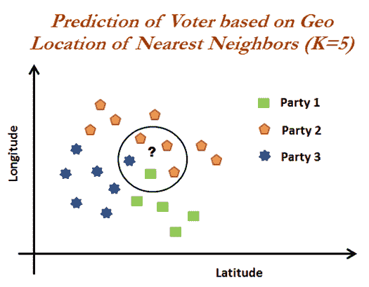

在上图中，我们可以看到研究的投票人将投票给**党 2** 。就在附近，一个邻居投了**党 1** 的票，另一个选民投了**党 3** 的票。但是三名选民投票给了第二党。事实上，通过这种方式，KNN 解决了任何给定的分类问题。回归问题是通过取给定圆或邻域或 k 值内的邻居的平均值来解决的。

# 维度的诅咒

KNN 完全取决于距离。因此，当 KNN 随着预测所需变量数量的增加而降低其预测能力时，关于维数灾难的研究是值得的。这是一个显而易见的事实，高维空间是巨大的。与低维空间中的点相比，高维空间中的点更倾向于彼此分散。虽然有许多方法可以检查维度曲线，但这里我们使用为 1D、2D 和 3D 空间生成的零到一之间的均匀随机值来验证这一假设。

在下面的代码行中，1000 个观测值之间的平均距离是随着维度的变化而计算的。很明显，随着维数的增加，点与点之间的距离以对数方式增加，这给了我们一个提示，即为了使机器学习算法正确工作，我们需要数据点随着维数的增加呈指数增长:

```py
>>> import numpy as np 
>>> import pandas as pd 

# KNN Curse of Dimensionality 
>>> import random,math 

```

下面的代码从给定维数的均匀分布中生成介于 0 和 1 之间的随机数，这相当于数组或列表的长度:

```py
>>> def random_point_gen(dimension): 
...     return [random.random() for _ in range(dimension)] 

```

以下函数通过取点与点之间的差和平方和来计算点与点之间欧氏距离(2-范数)平方和的均方根，最后取总距离的平方根:

```py
>>> def distance(v,w): 
...     vec_sub = [v_i-w_i for v_i,w_i in zip(v,w)] 
...     sum_of_sqrs = sum(v_i*v_i for v_i in vec_sub) 
...     return math.sqrt(sum_of_sqrs) 

```

尺寸和对数都用于计算距离，代码如下:

```py
>>> def random_distances_comparison(dimension,number_pairs): 
...     return [distance(random_point_gen(dimension),random_point_gen(dimension)) 
            for _ in range(number_pairs)] 

>>> def mean(x): 
...     return sum(x) / len(x) 

```

实验通过将尺寸从 1 改变为 201，增加 5 个尺寸来检查距离的增加:

```py
>>> dimensions = range(1, 201, 5)

```

已经计算了最小和平均距离来检验，但是，两者都说明了类似的情况:

```py
>>> avg_distances = [] 
>>> min_distances = [] 

>>> dummyarray = np.empty((20,4)) 
>>> dist_vals = pd.DataFrame(dummyarray) 
>>> dist_vals.columns = ["Dimension","Min_Distance","Avg_Distance","Min/Avg_Distance"] 

>>> random.seed(34) 
>>> i = 0 
>>> for dims in dimensions: 
...     distances = random_distances_comparison(dims, 1000)   
...     avg_distances.append(mean(distances))     
...     min_distances.append(min(distances))      

...     dist_vals.loc[i,"Dimension"] = dims 
...     dist_vals.loc[i,"Min_Distance"] = min(distances) 
...     dist_vals.loc[i,"Avg_Distance"] = mean(distances) 
...     dist_vals.loc[i,"Min/Avg_Distance"] = min(distances)/mean(distances) 

...     print(dims, min(distances), mean(distances), min(distances)*1.0 / mean( distances)) 
...     i = i+1 

# Plotting Average distances for Various Dimensions 
>>> import matplotlib.pyplot as plt 
>>> plt.figure() 
>>> plt.xlabel('Dimensions') 
>>> plt.ylabel('Avg. Distance') 
>>> plt.plot(dist_vals["Dimension"],dist_vals["Avg_Distance"]) 
>>> plt.legend(loc='best') 

>>> plt.show() 

```

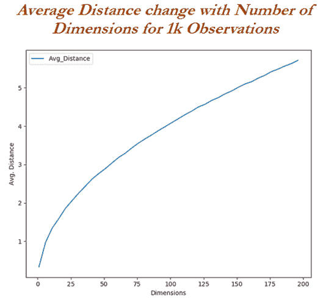

From the preceding graph, it is proved that with the increase in dimensions, mean distance increases logarithmically. Hence the higher the dimensions, the more data is needed to overcome the curse of dimensionality!

# 1D、2D 和三维例子的维度诅咒

已经进行了快速分析，以了解距离 60 随机点是如何随着维度的增加而扩展的。最初为一维绘制随机点:

```py
# 1-Dimension Plot 
>>> import numpy as np 
>>> import pandas as pd 
>>> import matplotlib.pyplot as plt 

>>> one_d_data = np.random.rand(60,1) 
>>> one_d_data_df = pd.DataFrame(one_d_data) 
>>> one_d_data_df.columns = ["1D_Data"] 
>>> one_d_data_df["height"] = 1 

>>> plt.figure() 
>>> plt.scatter(one_d_data_df['1D_Data'],one_d_data_df["height"]) 
>>> plt.yticks([]) 
>>> plt.xlabel("1-D points") 
>>> plt.show()

```

如果我们观察下图，所有 60 个数据点在一维上都非常接近:

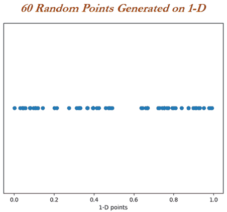

在这里，我们在 2D 空间中重复同样的实验，取 60 个随机数，在坐标空间中取 *x* 和 *y* 并直观地绘制出来:

```py
# 2- Dimensions Plot 
>>> two_d_data = np.random.rand(60,2) 
>>> two_d_data_df = pd.DataFrame(two_d_data) 
>>> two_d_data_df.columns = ["x_axis","y_axis"] 

>>> plt.figure() 
>>> plt.scatter(two_d_data_df['x_axis'],two_d_data_df["y_axis"]) 
>>> plt.xlabel("x_axis");plt.ylabel("y_axis") 
>>> plt.show()  

```

通过观察 2D 图，我们可以看到相同的 60 个数据点出现了更多的差距:

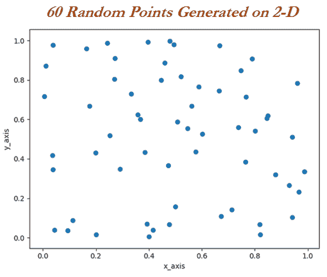

最后，为三维空间绘制 60 个数据点。我们可以看到空间的进一步增加，这是非常明显的。这已经从视觉上向我们证明了，随着维数的增加，它会产生大量的空间，这使得分类器很难检测到信号:

```py
# 3- Dimensions Plot 
>>> three_d_data = np.random.rand(60,3) 
>>> three_d_data_df = pd.DataFrame(three_d_data) 
>>> three_d_data_df.columns = ["x_axis","y_axis","z_axis"] 

>>> from mpl_toolkits.mplot3d import Axes3D 
>>> fig = plt.figure() 
>>> ax = fig.add_subplot(111, projection='3d') 
>>> ax.scatter(three_d_data_df['x_axis'],three_d_data_df["y_axis"],three_d_data_df ["z_axis"]) 
>>> plt.show() 

```

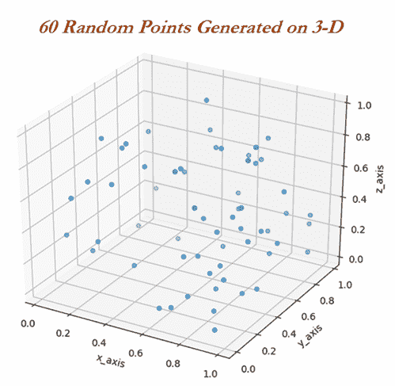

# KNN 分类器与乳腺癌威斯康星数据示例

乳腺癌数据已从 UCI 机器学习知识库[中获得，用于说明目的。这里的任务是使用 KNN 分类器基于各种收集的特征，例如团块厚度等，来发现癌症是恶性的还是良性的:](http://archive.ics.uci.edu/ml/datasets/Breast+Cancer+Wisconsin+%28Diagnostic%29)

```py
# KNN Classifier - Breast Cancer 
>>> import numpy as np 
>>> import pandas as pd 
>>> from sklearn.metrics import accuracy_score,classification_report 
>>> breast_cancer = pd.read_csv("Breast_Cancer_Wisconsin.csv") 

```

以下是显示数据外观的前几行。`Class`值有类`2`和`4`。值`2`和`4`分别代表良性和恶性等级。而所有其他变量在数值`1`和`10`之间变化，本质上非常明确:


只有`Bare_Nuclei`变量有一些缺失的值，这里我们用下面代码中最频繁的值(类别值`1`)来替换它们:

```py
>>> breast_cancer['Bare_Nuclei'] = breast_cancer['Bare_Nuclei'].replace('?', np.NAN) 
>>> breast_cancer['Bare_Nuclei'] = breast_cancer['Bare_Nuclei'].fillna(breast_cancer[ 'Bare_Nuclei'].value_counts().index[0]) 

```

使用以下代码将类别转换为`0`和`1`指示器，用于分类器:

```py
>>> breast_cancer['Cancer_Ind'] = 0 
>>> breast_cancer.loc[breast_cancer['Class']==4,'Cancer_Ind'] = 1

```

在下面的代码中，我们从分析中删除了非增值变量:

```py
>>> x_vars = breast_cancer.drop(['ID_Number','Class','Cancer_Ind'],axis=1) 
>>> y_var = breast_cancer['Cancer_Ind'] 
>>> from sklearn.preprocessing import StandardScaler 
>>> x_vars_stdscle = StandardScaler().fit_transform(x_vars.values) 
>>> from sklearn.model_selection import train_test_split 

```

由于 KNN 对距离非常敏感，因此在应用算法之前，我们将对所有列进行标准化:

```py
>>> x_vars_stdscle_df = pd.DataFrame(x_vars_stdscle, index=x_vars.index, columns=x_vars.columns) 
>>> x_train,x_test,y_train,y_test = train_test_split(x_vars_stdscle_df,y_var, train_size = 0.7,random_state=42)

```

KNN 分类器正在应用邻居值`3`，`p`值表示它是 2-范数，也称为欧几里德距离，用于计算类:

```py
>>> from sklearn.neighbors import KNeighborsClassifier 
>>> knn_fit = KNeighborsClassifier(n_neighbors=3,p=2,metric='minkowski') 
>>> knn_fit.fit(x_train,y_train) 

>>> print ("\nK-Nearest Neighbors - Train Confusion Matrix\n\n",pd.crosstab(y_train, knn_fit.predict(x_train),rownames = ["Actuall"],colnames = ["Predicted"]) )      
>>> print ("\nK-Nearest Neighbors - Train accuracy:",round(accuracy_score(y_train, knn_fit.predict(x_train)),3)) 
>>> print ("\nK-Nearest Neighbors - Train Classification Report\n", classification_report( y_train,knn_fit.predict(x_train))) 

>>> print ("\n\nK-Nearest Neighbors - Test Confusion Matrix\n\n",pd.crosstab(y_test, knn_fit.predict(x_test),rownames = ["Actuall"],colnames = ["Predicted"]))       
>>> print ("\nK-Nearest Neighbors - Test accuracy:",round(accuracy_score( y_test,knn_fit.predict(x_test)),3)) 
>>> print ("\nK-Nearest Neighbors - Test Classification Report\n", classification_report(y_test,knn_fit.predict(x_test))) 

```

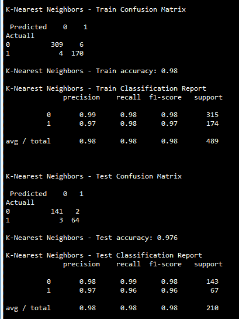

从结果来看，似乎 KNN 在恶性和良性分类方面做得很好，获得了 97.6%的测试准确率和 96%的恶性分类召回率。KNN 分类器的唯一不足是，它在测试阶段是计算密集型的，因为每个测试观测值将与训练数据中的所有可用观测值进行比较，而实际上 KNN 并没有从训练数据中学到什么。因此，我们也称它为懒惰分类器！

KNN 分类器的 R 码如下:

```py
# KNN Classifier 
setwd("D:\\Book writing\\Codes\\Chapter 5") 
breast_cancer = read.csv("Breast_Cancer_Wisconsin.csv") 

# Column Bare_Nuclei have some missing values with "?" in place, we are replacing with median values 
# As Bare_Nuclei is discrete variable 
breast_cancer$Bare_Nuclei = as.character(breast_cancer$Bare_Nuclei)
breast_cancer$Bare_Nuclei[breast_cancer$Bare_Nuclei=="?"] = median(breast_cancer$Bare_Nuclei,na.rm = TRUE)
breast_cancer$Bare_Nuclei = as.integer(breast_cancer$Bare_Nuclei)
# Classes are 2 & 4 for benign & malignant respectively, we # have converted # 
to zero-one problem, as it is easy to convert to work # around with models 
breast_cancer$Cancer_Ind = 0
breast_cancer$Cancer_Ind[breast_cancer$Class==4]=1
breast_cancer$Cancer_Ind = as.factor( breast_cancer$Cancer_Ind) 

# We have removed unique id number from modeling as unique # numbers does not provide value in modeling 
# In addition, original class variable also will be removed # as the same has been replaced with derived variable 

remove_cols = c("ID_Number","Class") 
breast_cancer_new = breast_cancer[,!(names(breast_cancer) %in% remove_cols)] 

# Setting seed value for producing repetitive results 
# 70-30 split has been made on the data 

set.seed(123) 
numrow = nrow(breast_cancer_new) 
trnind = sample(1:numrow,size = as.integer(0.7*numrow)) 
train_data = breast_cancer_new[trnind,] 
test_data = breast_cancer_new[-trnind,] 

# Following is classical code for computing accuracy, # precision & recall 

frac_trzero = (table(train_data$Cancer_Ind)[[1]])/nrow(train_data)
frac_trone = (table(train_data$Cancer_Ind)[[2]])/nrow(train_data)

frac_tszero = (table(test_data$Cancer_Ind)[[1]])/nrow(test_data)
frac_tsone = (table(test_data$Cancer_Ind)[[2]])/nrow(test_data)

prec_zero <- function(act,pred){ tble = table(act,pred)
return( round( tble[1,1]/(tble[1,1]+tble[2,1]),4) ) } 

prec_one <- function(act,pred){ tble = table(act,pred)
return( round( tble[2,2]/(tble[2,2]+tble[1,2]),4) ) } 

recl_zero <- function(act,pred){tble = table(act,pred) 
return( round( tble[1,1]/(tble[1,1]+tble[1,2]),4) ) } 

recl_one <- function(act,pred){ tble = table(act,pred) 
return( round( tble[2,2]/(tble[2,2]+tble[2,1]),4) ) } 

accrcy <- function(act,pred){ tble = table(act,pred) 
return( round((tble[1,1]+tble[2,2])/sum(tble),4)) } 

# Importing Class package in which KNN function do present library(class) 

# Choosing sample k-value as 3 & apply on train & test data # respectively 

k_value = 3 
tr_y_pred = knn(train_data,train_data,train_data$Cancer_Ind,k=k_value)
ts_y_pred = knn(train_data,test_data,train_data$Cancer_Ind,k=k_value) 

# Calculating confusion matrix, accuracy, precision & # recall on train data 

tr_y_act = train_data$Cancer_Ind;ts_y_act = test_data$Cancer_Ind
tr_tble = table(tr_y_act,tr_y_pred) 
print(paste("Train Confusion Matrix")) 
print(tr_tble) 

tr_acc = accrcy(tr_y_act,tr_y_pred) 
trprec_zero = prec_zero(tr_y_act,tr_y_pred); trrecl_zero = recl_zero(tr_y_act,tr_y_pred) 
trprec_one = prec_one(tr_y_act,tr_y_pred); trrecl_one = recl_one(tr_y_act,tr_y_pred) 
trprec_ovll = trprec_zero *frac_trzero + trprec_one*frac_trone
trrecl_ovll = trrecl_zero *frac_trzero + trrecl_one*frac_trone

print(paste("KNN Train accuracy:",tr_acc)) 
print(paste("KNN - Train Classification Report"))
print(paste("Zero_Precision",trprec_zero,"Zero_Recall",trrecl_zero))
print(paste("One_Precision",trprec_one,"One_Recall",trrecl_one))
print(paste("Overall_Precision",round(trprec_ovll,4),"Overall_Recall",round(trrecl_ovll,4))) 

# Calculating confusion matrix, accuracy, precision & # recall on test data 

ts_tble = table(ts_y_act, ts_y_pred) 
print(paste("Test Confusion Matrix")) 
print(ts_tble) 

ts_acc = accrcy(ts_y_act,ts_y_pred) 
tsprec_zero = prec_zero(ts_y_act,ts_y_pred); tsrecl_zero = recl_zero(ts_y_act,ts_y_pred) 
tsprec_one = prec_one(ts_y_act,ts_y_pred); tsrecl_one = recl_one(ts_y_act,ts_y_pred) 

tsprec_ovll = tsprec_zero *frac_tszero + tsprec_one*frac_tsone
tsrecl_ovll = tsrecl_zero *frac_tszero + tsrecl_one*frac_tsone

print(paste("KNN Test accuracy:",ts_acc)) 
print(paste("KNN - Test Classification Report"))
print(paste("Zero_Precision",tsprec_zero,"Zero_Recall",tsrecl_zero))
print(paste("One_Precision",tsprec_one,"One_Recall",tsrecl_one))
print(paste("Overall_Precision",round(tsprec_ovll,4),"Overall_Recall",round(tsrecl_ovll,4))) 

```

# KNN 分类器中 k 值的调整

在前一节中，我们只检查了 k 值为 3 的情况。实际上，在任何机器学习算法中，我们都需要调整旋钮来检查哪里可以获得更好的性能。在 KNN 的情况下，唯一的调谐参数是 k 值。因此，在下面的代码中，我们使用网格搜索来确定最佳 k 值:

```py
# Tuning of K- value for Train & Test data 
>>> dummyarray = np.empty((5,3)) 
>>> k_valchart = pd.DataFrame(dummyarray) 
>>> k_valchart.columns = ["K_value","Train_acc","Test_acc"] 

>>> k_vals = [1,2,3,4,5] 

>>> for i in range(len(k_vals)): 
...     knn_fit = KNeighborsClassifier(n_neighbors=k_vals[i],p=2,metric='minkowski') 
...     knn_fit.fit(x_train,y_train) 

...     print ("\nK-value",k_vals[i]) 

...     tr_accscore = round(accuracy_score(y_train,knn_fit.predict(x_train)),3) 
...     print ("\nK-Nearest Neighbors - Train Confusion Matrix\n\n",pd.crosstab( y_train, knn_fit.predict(x_train),rownames = ["Actuall"],colnames = ["Predicted"]) )      
...     print ("\nK-Nearest Neighbors - Train accuracy:",tr_accscore) 
...     print ("\nK-Nearest Neighbors - Train Classification Report\n", classification_report(y_train,knn_fit.predict(x_train))) 

...     ts_accscore = round(accuracy_score(y_test,knn_fit.predict(x_test)),3)     
...     print ("\n\nK-Nearest Neighbors - Test Confusion Matrix\n\n",pd.crosstab( y_test,knn_fit.predict(x_test),rownames = ["Actuall"],colnames = ["Predicted"]))       
...     print ("\nK-Nearest Neighbors - Test accuracy:",ts_accscore) 
...     print ("\nK-Nearest Neighbors - Test Classification Report\n",classification_report(y_test,knn_fit.predict(x_test))) 

...     k_valchart.loc[i, 'K_value'] = k_vals[i]       
...     k_valchart.loc[i, 'Train_acc'] = tr_accscore      
...     k_valchart.loc[i, 'Test_acc'] = ts_accscore                

# Ploting accuracies over varied K-values 
>>> import matplotlib.pyplot as plt 
>>> plt.figure() 
>>> plt.xlabel('K-value') 
>>> plt.ylabel('Accuracy') 
>>> plt.plot(k_valchart["K_value"],k_valchart["Train_acc"]) 
>>> plt.plot(k_valchart["K_value"],k_valchart["Test_acc"]) 

>>> plt.axis([0.9,5, 0.92, 1.005]) 
>>> plt.xticks([1,2,3,4,5]) 

>>> for a,b in zip(k_valchart["K_value"],k_valchart["Train_acc"]): 
...     plt.text(a, b, str(b),fontsize=10) 

>>> for a,b in zip(k_valchart["K_value"],k_valchart["Test_acc"]): 
...     plt.text(a, b, str(b),fontsize=10) 

>>> plt.legend(loc='upper right')     
>>> plt.show() 

```

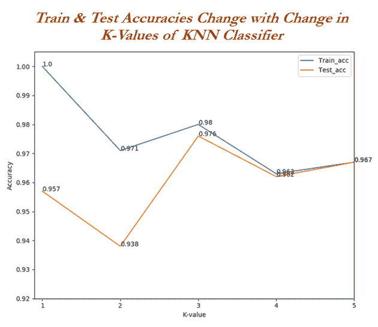

k 值越小，由于列车数据的精度值非常高，而测试数据的精度值越小，因此出现越多的过拟合问题，随着 k 值的增加，列车和测试精度越来越收敛，变得越来越稳健。这个现象说明了典型的机器学习现象。至于进一步的分析，鼓励读者尝试高于 5 的 k 值，看看训练和测试精度是如何变化的。KNN 分类器中用于调整 k 值的 R 码如下:

```py
# Tuning of K-value on Train & Test Data 
k_valchart = data.frame(matrix( nrow=5, ncol=3)) 
colnames(k_valchart) = c("K_value","Train_acc","Test_acc") 
k_vals = c(1,2,3,4,5) 

i = 1
for (kv in k_vals) { 
 tr_y_pred = knn(train_data,train_data,train_data$Cancer_Ind,k=kv)
 ts_y_pred = knn(train_data,test_data,train_data$Cancer_Ind,k=kv)
 tr_y_act = train_data$Cancer_Ind;ts_y_act = test_data$Cancer_Ind
 tr_tble = table(tr_y_act,tr_y_pred) 
 print(paste("Train Confusion Matrix")) 
 print(tr_tble) 
 tr_acc = accrcy(tr_y_act,tr_y_pred) 
 trprec_zero = prec_zero(tr_y_act,tr_y_pred); trrecl_zero = recl_zero(tr_y_act, tr_y_pred) 
 trprec_one = prec_one(tr_y_act,tr_y_pred); trrecl_one = recl_one(tr_y_act,tr_y_pred) 
 trprec_ovll = trprec_zero *frac_trzero + trprec_one*frac_trone
 trrecl_ovll = trrecl_zero *frac_trzero + trrecl_one*frac_trone
 print(paste("KNN Train accuracy:",tr_acc)) 
 print(paste("KNN - Train Classification Report"))

print(paste("Zero_Precision",trprec_zero,"Zero_Recall",trrecl_zero))
print(paste("One_Precision",trprec_one,"One_Recall",trrecl_one))
print(paste("Overall_Precision",round(trprec_ovll,4),"Overall_Recall",round(trrecl_ovll,4))) 
 ts_tble = table(ts_y_act,ts_y_pred) 
 print(paste("Test Confusion Matrix")) 
 print(ts_tble)
 ts_acc = accrcy(ts_y_act,ts_y_pred) 
 tsprec_zero = prec_zero(ts_y_act,ts_y_pred); tsrecl_zero = recl_zero(ts_y_act,ts_y_pred) 
 tsprec_one = prec_one(ts_y_act,ts_y_pred); tsrecl_one = recl_one(ts_y_act,ts_y_pred) 
 tsprec_ovll = tsprec_zero *frac_tszero + tsprec_one*frac_tsone
 tsrecl_ovll = tsrecl_zero *frac_tszero + tsrecl_one*frac_tsone

 print(paste("KNN Test accuracy:",ts_acc)) 
 print(paste("KNN - Test Classification Report"))

print(paste("Zero_Precision",tsprec_zero,"Zero_Recall",tsrecl_zero))
print(paste("One_Precision",tsprec_one,"One_Recall",tsrecl_one))
print(paste("Overall_Precision",round(tsprec_ovll,4),"Overall_Recall",round(tsrecl_ovll,4)))

 k_valchart[i,1] =kv 
 k_valchart[i,2] =tr_acc 
 k_valchart[i,3] =ts_acc i = i+1 } 
# Plotting the graph 
library(ggplot2) 
library(grid) 
ggplot(k_valchart, aes(K_value)) 
+ geom_line(aes(y = Train_acc, colour = "Train_Acc")) + 
geom_line(aes(y = Test_acc, colour = "Test_Acc"))+
labs(x="K_value",y="Accuracy") + 
geom_text(aes(label = Train_acc, y = Train_acc), size = 3)+
geom_text(aes(label = Test_acc, y = Test_acc), size = 3) 

```

# 朴素贝叶斯

贝叶斯算法的概念相当古老，从 18 世纪托马斯·贝叶斯开始就存在了。托马斯发展了从已知事件中确定未知事件概率的基本数学原理。例如，如果所有的苹果都是红色的，平均直径约为 4 英寸，那么，如果从篮子中随机选择一个红色、直径为 3.7 英寸的水果，那么该水果是苹果的概率是多少？幼稚术语确实假定了一个类中特定特征相对于其他特征的独立性。在这种情况下，颜色和直径之间没有相关性。这种独立性假设使得朴素贝叶斯分类器在计算便利性方面对特定任务最有效，例如基于单词的电子邮件分类，其中确实存在高维 vocab，即使在假设特征之间的独立性之后。朴素贝叶斯分类器在实际应用中表现得出奇的好。

贝叶斯分类器最适用于需要同时考虑大量属性信息来估计最终结果概率的问题。贝叶斯方法利用所有可用的证据来考虑预测，即使特征对预测的最终结果影响很小。然而，我们不应忽视这样一个事实，即大量影响相对较小的特征，加上其综合影响，将形成强大的分类器。

# 概率基础

在深入探讨朴素贝叶斯之前，最好重申一下基本原理。通过将事件发生的轨迹数除以轨迹总数，可以从观察到的数据中估计事件发生的概率。例如，如果一个包里有红蓝球，随机抽取 *10 个*球，逐一替换并带出 *10 个*、 *3 个*红球出现在步道中，我们可以说红色的概率为 *0.3* 、 *p <sub>红色</sub> = 3/10 = 0.3* 。所有可能结果的总概率必须是 100%。

如果跟踪有两种结果，如电子邮件分类，要么是垃圾邮件，要么是垃圾邮件，并且两者不能同时发生，则这些事件被认为是相互排斥的。此外，如果这些结果涵盖了所有可能的事件，它将被称为**穷尽事件**。比如在邮件分类中如果 *P(垃圾邮件)= 0.1* ，我们就能够计算出 *P(火腿)= 1- 0.1 = 0.9* ，这两个事件是互斥的。在下面的文氏图中，所有可能的电子邮件类别都用结果类型表示(整个宇宙):

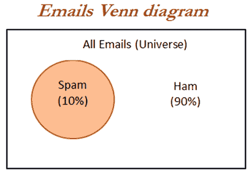

# 联合概率

尽管互斥案例很容易处理，但大多数实际问题确实属于非互斥事件的范畴。通过使用联合外观，我们可以预测事件结果。例如，如果电子邮件信息中出现像*彩票*这样的词，这很可能是垃圾邮件，而不是火腿。下图显示了垃圾邮件与*彩票*的联合概率。但是，如果您详细注意到，彩票圈并不完全包含在垃圾邮件圈内。这意味着并非所有垃圾邮件都包含“T4”彩票“T5”字样，也并非每封带有“T6”彩票“T7”字样的电子邮件都是垃圾邮件。

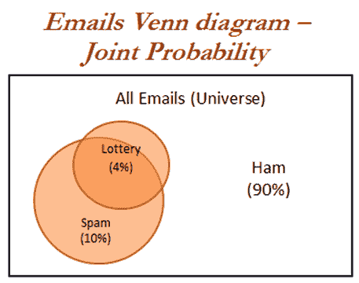

在下图中，除了 Venn 图表示中的*彩票*单词之外，我们还扩展了垃圾邮件和火腿类别:

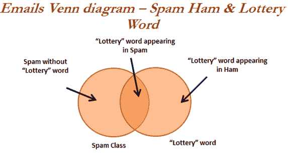

我们已经看到，10%的电子邮件是垃圾邮件，4%的电子邮件有单词*彩票*，我们的任务是量化这两个比例之间的重叠程度。换句话说，我们需要识别 *p(垃圾邮件)*和 *p(彩票)*两者出现的联合概率，可以写成 *p(垃圾邮件∪彩票)*。如果这两个事件完全不相关，则称为**独立事件**，它们各自的值为 *p(垃圾邮件∪彩票)= p(垃圾邮件)* p(彩票)= 0.1 * 0.04 = 0.004* ，这是所有包含彩票一词的垃圾邮件的 0.4%。一般来说，对于独立事件*P(A∪B)= P(A)* P(B)*。

# 用条件概率理解贝叶斯定理

条件概率提供了一种使用贝叶斯定理计算相关事件之间关系的方法。例如 *A* 和 *B* 是两个事件，我们想计算 *P(A\B)* 可以理解为事件发生的概率 *A* 给定事件 *B* 已经发生的事实，实际上这被称为**条件概率**，等式可以写成:


为了更好地理解，我们现在将讨论电子邮件分类示例。我们的目标是预测电子邮件是否是垃圾邮件，给出单词彩票和一些其他线索。在这种情况下，我们已经知道了垃圾邮件的总体概率，即 10%也称为**先验概率**。现在假设你已经获得了一条额外的信息，即所有信息中单词彩票的概率为 4%，也被称为**边际可能性**。现在，我们知道了*彩票*在之前的垃圾邮件中被使用的概率，被称为**可能性**。

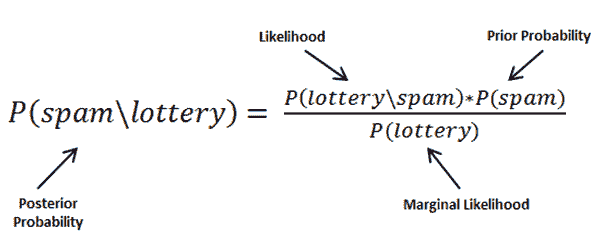

通过将贝叶斯定理应用于证据，我们可以计算后验概率，该概率计算消息是垃圾邮件的概率；鉴于彩票出现在消息中。平均而言，如果概率大于 50%，则表明该邮件是垃圾邮件，而不是火腿。

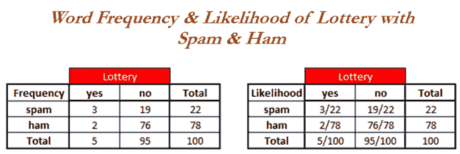

在上表中，已经显示了记录*抽奖*在垃圾邮件和 ham 消息中出现的次数及其各自可能性的样本频率表。可能性表显示 *P(彩票\垃圾邮件)= 3/22 = 0.13* ，表明垃圾邮件包含术语*彩票*的概率为 13%。随后我们可以计算出 *P(垃圾邮件∪彩票)= P(彩票\垃圾邮件)* P(垃圾邮件)= (3/22) * (22/100) = 0.03* 。为了计算后验概率，我们把*P(Spam∪彩票)*和 *P(彩票)*分开，意思是*(3/22)*(22/100)/(4/100)= 0.75*。因此，考虑到一条消息包含单词*彩票*，该消息是垃圾邮件的概率为 75%。因此，不要相信急功近利的家伙！

# 朴素贝叶斯分类

在过去的例子中，我们已经看到了一个名为*彩票*的单词，然而，在这种情况下，我们将讨论一些额外的单词，如*百万*和*取消订阅*来展示实际的分类器是如何工作的。让我们为这三个单词( *W1* 、 *W2* 、 *W3* )的出现构建一个似然表，如下表所示为 *100* 封邮件:


当收到新邮件时，将计算后验概率以确定该电子邮件是垃圾邮件还是火腿。假设我们有一封邮件，里面有条款*抽奖**退订*，但是里面没有文字*百万*，有了这个细节，垃圾邮件的概率是多少？

利用贝叶斯定理，我们可以将问题定义为*彩票=是*、*百万=否*和*退订=是*:


由于单词之间的依赖性，求解前面的方程将具有很高的计算复杂度。随着单词数量的增加，这甚至会爆炸，并且需要巨大的内存来处理所有可能的交叉事件。这最终导致了单词独立性的直观转变(**交叉条件独立性**)，为此它获得了贝叶斯分类器的朴素前缀名称。当两个事件独立时，我们可以写出*P(A∪B)= P(A)* P(B)*。事实上，这种等价性更容易计算，内存需求更少:


同样，我们也将计算 ham 消息的概率，如下所示:


通过在等式中替换前面的似然表，由于垃圾邮件/火腿的比率，我们可以简单地忽略两个等式中的分母项。垃圾邮件的总体可能性是:


计算比值后， *0.008864/0.004349 = 2.03* ，这意味着这条消息是垃圾邮件的可能性是 ham 的两倍。但是我们可以如下计算概率:

*P(垃圾邮件)= 0.008864/(0.008864+0.004349)= 0.67*

*P（He） = 0.004349/（0.008864+0.004349） = 0.33*

通过将似然值转换为概率，我们可以用一种形象的方式来展示两者中的任何一个来设定一些阈值，等等。

# 拉普拉斯估计量

在前面的计算中，所有的值都是非零的，这使得计算很好。然而在实践中，有些词从来不会出现在过去的特定类别中，而是突然出现在后面的阶段，这使得整个计算为零。

例如，在前面的等式中 *W <sub>3</sub>* 确实有一个 *0* 值，而不是 *13* ，它会将整个等式一起转换为 *0* :


为了避免这种情况，拉普拉斯估计器本质上在频率表中的每个计数上增加了一个小数字，这确保了每个特征在每个类中都有非零的出现概率。通常拉普拉斯估计器设置为 *1* ，保证每个类-特征组合在数据中至少被发现一次:


If you observe the equation carefully, value *1* is added to all three words in numerator and at the same time three has been added to all denominators to provide equivalence.

# 朴素贝叶斯垃圾短信分类示例

朴素贝叶斯分类器是使用在[http://www.dt.fee.unicamp.br/~tiago/smsspamcollection/](http://www.dt.fee.unicamp.br/~tiago/smsspamcollection/)获得的垃圾短信收集数据开发的。在本章中，已经讨论了在构建朴素贝叶斯模型之前，在自然语言处理技术中可用的各种预处理技术:

```py
>>> import csv 

>>> smsdata = open('SMSSpamCollection.txt','r') 
>>> csv_reader = csv.reader(smsdata,delimiter='\t') 

```

如果在使用旧版 Python 时遇到任何`utf-8`错误，可以使用以下`sys`包行代码，否则最新版本的 Python 3.6 不需要使用这些代码:

```py
>>> import sys 
>>> reload (sys) 
>>> sys.setdefaultendocing('utf-8') 

```

正常编码通常从这里开始:

```py
>>> smsdata_data = [] 
>>> smsdata_labels = [] 

>>> for line in csv_reader: 
...     smsdata_labels.append(line[0]) 
...     smsdata_data.append(line[1]) 

>>> smsdata.close() 

```

以下代码打印前 5 行:

```py
>>> for i in range(5): 
...     print (smsdata_data[i],smsdata_labels[i])

```


获得前面的输出后，运行以下代码:

```py
>>> from collections import Counter 
>>> c = Counter( smsdata_labels ) 
>>> print(c) 

```


在 5572 条观察结果中，4825 条是垃圾邮件，约占 86.5%，747 条垃圾邮件约占 13.4%。

使用自然语言处理技术，我们对数据进行了预处理，以获得最终的单词向量，并将其与最终的垃圾邮件或火腿结果进行映射。主要的预处理阶段包括:

*   **去除标点符号**:在进行任何进一步处理之前，需要去除标点符号。`string`库的标点符号是*！" #$% & \'()*+，-。/:;< = >？@[\\]^_`{|}~* ，从所有消息中删除。
*   **单词标记化**:单词是根据空格从句子中分块出来的，以便进一步处理。
*   **将单词转换为小写**:转换为所有小写提供了去除重复项的功能，比如 *Run* 和 *run* ，其中第一个出现在句子的开头，后一个出现在句子的中间，以此类推，这些都需要统一起来去除重复项，就像我们在做包词技术一样。
*   **停词去除**:停词是在文献中重复出现这么多次的词，但在句子的解释力上并没有太大的区别。比如:*我*、*我*、*你*、*这个*、*那个*等等，需要去掉后再进一步处理。
*   长度至少为三的**:这里我们去掉了长度小于三的单词。**
***   保持单词长度至少为三个:这里我们删除了长度小于三个的单词。词干:词干处理将单词词干到各自的词根。堵塞的例子是停止运行或停止运行。通过词干，我们减少了重复，提高了模型的准确性。*   **词性标注**:将词性标注应用到单词上，如名词、动词、形容词等。例如，*跑步*的词性标注是动词，而*跑步*的词性标注是名词。在某些情况下 *running* 是名词，引理化并不会把这个词归结为词根 *run* ，相反它只是让*保持原样运行*。因此，词性标注是一个非常关键的步骤，需要在应用词条化操作之前执行，以将单词归结为其词根。*   **词的引理化**:引理化是另一个不同的降维过程。在词汇化过程中，它将单词分解为词根，而不仅仅是截断单词。例如，当我们将 *ate* 单词传入以词性标记为动词的引理词时，将 *ate* 带到其词根单词中作为 *eat* 。**

 **`nltk`包已用于所有预处理步骤，因为它在一个单一的屋顶中包含所有必要的自然语言处理功能:

```py
>>> import nltk 
>>> from nltk.corpus import stopwords 
>>> from nltk.stem import WordNetLemmatizer 
>>> import string 
>>> import pandas as pd 
>>> from nltk import pos_tag 
>>> from nltk.stem import PorterStemmer  

```

函数已经写好(预处理)由所有步骤组成，以方便使用。但是，我们将解释每个部分中的所有步骤:

```py
>>> def preprocessing(text): 

```

下面一行代码将单词拆分，并检查每个字符是否在标准标点符号中，如果是，它将被替换为空格，否则它不会被空格替换:

```py
...     text2 = " ".join("".join([" " if ch in string.punctuation else ch for ch in text]).split()) 

```

以下代码将句子标记为基于空格的单词，并将它们放在一起作为应用进一步步骤的列表:

```py
...     tokens = [word for sent in nltk.sent_tokenize(text2) for word in 
              nltk.word_tokenize(sent)] 

```

将所有大小写(大写、小写和正确)转换为小写可以减少语料库中的重复:

```py
...     tokens = [word.lower() for word in tokens] 

```

如前所述，停止词是在理解句子时没有太大分量的词；它们用于连接单词，等等。我们用下面一行代码删除了它们:

```py
...     stopwds = stopwords.words('english') 
...     tokens = [token for token in tokens if token not in stopwds]  

```

在下面的代码中，只保留长度大于`3`的单词来删除小单词，这几乎不包含太多要表达的意思:

```py
...     tokens = [word for word in tokens if len(word)>=3] 

```

使用`PorterStemmer`函数对单词应用词干，该函数从单词中提取额外的后缀:

```py
...     stemmer = PorterStemmer() 
...     tokens = [stemmer.stem(word) for word in tokens]  

```

词性标注是词条化的先决条件，基于这个词是名词还是动词等等，它会将其简化为词根:

```py
...     tagged_corpus = pos_tag(tokens)     

```

`pos_tag`函数返回速度的一部分，四种格式表示名词，六种格式表示动词。`NN`(名词，普通，单数)`NNP`(名词，专有，单数)`NNPS`(名词，专有，复数)`NNS`(名词，普通，复数)`VB`(动词，基本形式)`VBD`(动词，过去时)`VBG`(动词，现在分词)`VBN`(动词，过去分词)`VBP`(动词，现在时，非第三人称单数)`VBZ`(动词，现在时，第三人称单数):

```py
...    Noun_tags = ['NN','NNP','NNPS','NNS'] 
...    Verb_tags = ['VB','VBD','VBG','VBN','VBP','VBZ'] 
...    lemmatizer = WordNetLemmatizer()

```

`prat_lemmatize`函数的创建仅仅是因为`pos_tag`函数和引理函数的输入值不匹配。如果任何单词的标签属于相应的名词或动词标签类别，`n`或`v`将相应地应用于引理功能:

```py
...     def prat_lemmatize(token,tag): 
...         if tag in Noun_tags: 
...             return lemmatizer.lemmatize(token,'n') 
...         elif tag in Verb_tags: 
...             return lemmatizer.lemmatize(token,'v') 
...         else: 
...             return lemmatizer.lemmatize(token,'n') 

```

在执行标记化并应用了所有各种操作之后，我们需要将它重新连接起来以形成标记，下面的函数执行相同的操作:

```py
...     pre_proc_text =  " ".join([prat_lemmatize(token,tag) for token,tag in tagged_corpus])              
...     return pre_proc_text 

```

以下步骤将预处理功能应用于数据并生成新的语料库:

```py
>>> smsdata_data_2 = [] 
>>> for i in smsdata_data: 
...     smsdata_data_2.append(preprocessing(i))  

```

基于 70-30 的分割，数据将被分割成训练和测试数据，并转换成用于应用机器学习算法的 NumPy 数组:

```py
>>> import numpy as np 
>>> trainset_size = int(round(len(smsdata_data_2)*0.70)) 
>>> print ('The training set size for this classifier is ' + str(trainset_size) + '\n') 
>>> x_train = np.array([''.join(rec) for rec in smsdata_data_2[0:trainset_size]]) 
>>> y_train = np.array([rec for rec in smsdata_labels[0:trainset_size]]) 
>>> x_test = np.array([''.join(rec) for rec in smsdata_data_2[trainset_size+1:len( smsdata_data_2)]]) 
>>> y_test = np.array([rec for rec in smsdata_labels[trainset_size+1:len( smsdata_labels)]]) 

```

下面的代码将单词转换为矢量格式，并应用**术语频率-逆文档频率** ( **TF-IDF** )权重，这是一种增加高频单词权重的方法，同时惩罚通用术语，如*、*他*、 *at* 等等。在下面的代码中，我们限制了词汇中最常见的 4，000 个单词，但是我们也可以调整该参数，以检查哪里可以获得更好的准确性:*

```py
# building TFIDF vectorizer  
>>> from sklearn.feature_extraction.text import TfidfVectorizer 
>>> vectorizer = TfidfVectorizer(min_df=2, ngram_range=(1, 2),  stop_words='english',  
    max_features= 4000,strip_accents='unicode',  norm='l2') 

```

在列车和测试数据中，TF-IDF 转换如下所示。`todense`功能用于创建数据以可视化内容:

```py
>>> x_train_2 = vectorizer.fit_transform(x_train).todense() 
>>> x_test_2 = vectorizer.transform(x_test).todense() 

```

多项式朴素贝叶斯分类器适用于具有离散特征(例如字数)的分类，这通常需要大量的特征数。然而，在实践中，分数计数(如 TF-IDF)也能很好地工作。如果我们没有提到任何拉普拉斯估计量，它会取 *1.0* 的平均值，并将 *1.0* 与分子中的每个项和分母的总和相加:

```py
>>> from sklearn.naive_bayes import MultinomialNB 
>>> clf = MultinomialNB().fit(x_train_2, y_train) 

>>> ytrain_nb_predicted = clf.predict(x_train_2) 
>>> ytest_nb_predicted = clf.predict(x_test_2) 

>>> from sklearn.metrics import classification_report,accuracy_score 

>>> print ("\nNaive Bayes - Train Confusion Matrix\n\n",pd.crosstab(y_train, ytrain_nb_predicted,rownames = ["Actuall"],colnames = ["Predicted"]))       
>>> print ("\nNaive Bayes- Train accuracy",round(accuracy_score(y_train, ytrain_nb_predicted),3)) 
>>> print ("\nNaive Bayes  - Train Classification Report\n",classification_report(y_train, ytrain_nb_predicted)) 

>>> print ("\nNaive Bayes - Test Confusion Matrix\n\n",pd.crosstab(y_test, ytest_nb_predicted,rownames = ["Actuall"],colnames = ["Predicted"]))       
>>> print ("\nNaive Bayes- Test accuracy",round(accuracy_score(y_test, ytest_nb_predicted),3)) 
>>> print ("\nNaive Bayes  - Test Classification Report\n",classification_report( y_test, ytest_nb_predicted)) 

```


从之前的结果来看，朴素贝叶斯已经产生了 96.6%的测试准确率的优秀结果，对于垃圾邮件的显著召回值为 76%，对于火腿的显著召回值几乎为 100%。

但是，如果我们想根据朴素贝叶斯的系数来检查前 10 个特征是什么，下面的代码会很方便:

```py
# printing top features  
>>> feature_names = vectorizer.get_feature_names() 
>>> coefs = clf.coef_ 
>>> intercept = clf.intercept_ 
>>> coefs_with_fns = sorted(zip(clf.coef_[0], feature_names)) 

>>> print ("\n\nTop 10 features - both first & last\n") 
>>> n=10 
>>> top_n_coefs = zip(coefs_with_fns[:n], coefs_with_fns[:-(n + 1):-1]) 
>>> for (coef_1, fn_1), (coef_2, fn_2) in top_n_coefs: 
...     print('\t%.4f\t%-15s\t\t%.4f\t%-15s' % (coef_1, fn_1, coef_2, fn_2)) 

```


虽然 R 语言并不是 NLP 处理的流行选择，但这里我们已经展示了代码。我们鼓励读者修改代码，看看准确性如何变化，以便更好地理解概念。短信垃圾邮件/可疑邮件数据的朴素贝叶斯分类器的代码如下:

```py
# Naive Bayes 
smsdata = read.csv("SMSSpamCollection.csv",stringsAsFactors = FALSE) 
# Try the following code for reading in case if you have 
#issues while reading regularly with above code 
#smsdata = read.csv("SMSSpamCollection.csv", 
#stringsAsFactors = FALSE,fileEncoding="latin1") 
str(smsdata) 
smsdata$Type = as.factor(smsdata$Type) 
table(smsdata$Type) 

library(tm) 
library(SnowballC) 
# NLP Processing 
sms_corpus <- Corpus(VectorSource(smsdata$SMS_Details)) 
corpus_clean_v1 <- tm_map(sms_corpus, removePunctuation)
corpus_clean_v2 <- tm_map(corpus_clean_v1, tolower) 
corpus_clean_v3 <- tm_map(corpus_clean_v2, stripWhitespace)
corpus_clean_v4 <- tm_map(corpus_clean_v3, removeWords, stopwords())
corpus_clean_v5 <- tm_map(corpus_clean_v4, removeNumbers)
corpus_clean_v6 <- tm_map(corpus_clean_v5, stemDocument) 

# Check the change in corpus 
inspect(sms_corpus[1:3]) 
inspect(corpus_clean_v6[1:3]) 

sms_dtm <- DocumentTermMatrix(corpus_clean_v6) 

smsdata_train <- smsdata[1:4169, ] 
smsdata_test <- smsdata[4170:5572, ] 

sms_dtm_train <- sms_dtm[1:4169, ] 
sms_dtm_test <- sms_dtm[4170:5572, ] 

sms_corpus_train <- corpus_clean_v6[1:4169] 
sms_corpus_test <- corpus_clean_v6[4170:5572]

prop.table(table(smsdata_train$Type))
prop.table(table(smsdata_test$Type)) 
frac_trzero = (table(smsdata_train$Type)[[1]])/nrow(smsdata_train)
frac_trone = (table(smsdata_train$Type)[[2]])/nrow(smsdata_train)
frac_tszero = (table(smsdata_test$Type)[[1]])/nrow(smsdata_test)
frac_tsone = (table(smsdata_test$Type)[[2]])/nrow(smsdata_test)

Dictionary <- function(x) { 
 if( is.character(x) ) { 
 return (x) 
 } 
 stop('x is not a character vector') 
} 
# Create the dictionary with at least word appears 1 time 
sms_dict <- Dictionary(findFreqTerms(sms_dtm_train, 1)) 
sms_train <- DocumentTermMatrix(sms_corpus_train,list(dictionary = sms_dict)) 
sms_test <- DocumentTermMatrix(sms_corpus_test,list(dictionary = sms_dict)) 
convert_tofactrs <- function(x) { 
 x <- ifelse(x > 0, 1, 0) 
 x <- factor(x, levels = c(0, 1), labels = c("No", "Yes")) 
 return(x) 
} 
sms_train <- apply(sms_train, MARGIN = 2, convert_tofactrs) 
sms_test <- apply(sms_test, MARGIN = 2, convert_tofactrs) 

# Application of Naïve Bayes Classifier with laplace Estimator
library(e1071) 
nb_fit <- naiveBayes(sms_train, smsdata_train$Type,laplace = 1.0)

tr_y_pred = predict(nb_fit, sms_train) 
ts_y_pred = predict(nb_fit,sms_test) 
tr_y_act = smsdata_train$Type;ts_y_act = smsdata_test$Type 

tr_tble = table(tr_y_act,tr_y_pred) 
print(paste("Train Confusion Matrix")) 
print(tr_tble) 

tr_acc = accrcy(tr_y_act,tr_y_pred) 
trprec_zero = prec_zero(tr_y_act,tr_y_pred);  trrecl_zero = recl_zero(tr_y_act,tr_y_pred) 
trprec_one = prec_one(tr_y_act,tr_y_pred); trrecl_one = recl_one(tr_y_act,tr_y_pred) 
trprec_ovll = trprec_zero *frac_trzero + trprec_one*frac_trone
trrecl_ovll = trrecl_zero *frac_trzero + trrecl_one*frac_trone

print(paste("Naive Bayes Train accuracy:",tr_acc)) 
print(paste("Naive Bayes - Train Classification Report"))
print(paste("Zero_Precision",trprec_zero,"Zero_Recall",trrecl_zero))
print(paste("One_Precision",trprec_one,"One_Recall",trrecl_one))
print(paste("Overall_Precision",round(trprec_ovll,4),"Overall_Recall",round(trrecl_ovll,4))) 

ts_tble = table(ts_y_act,ts_y_pred) 
print(paste("Test Confusion Matrix")) 
print(ts_tble) 

ts_acc = accrcy(ts_y_act,ts_y_pred) 
tsprec_zero = prec_zero(ts_y_act,ts_y_pred); tsrecl_zero = recl_zero(ts_y_act,ts_y_pred) 
tsprec_one = prec_one(ts_y_act,ts_y_pred); tsrecl_one = recl_one(ts_y_act,ts_y_pred) 
tsprec_ovll = tsprec_zero *frac_tszero + tsprec_one*frac_tsone
tsrecl_ovll = tsrecl_zero *frac_tszero + tsrecl_one*frac_tsone

print(paste("Naive Bayes Test accuracy:",ts_acc)) 
print(paste("Naive Bayes - Test Classification Report"))
print(paste("Zero_Precision",tsprec_zero,"Zero_Recall",tsrecl_zero))
print(paste("One_Precision",tsprec_one,"One_Recall",tsrecl_one))
print(paste("Overall_Precision",round(tsprec_ovll,4),"Overall_Recall",round(tsrecl_ovll,4))) 

```

# 摘要

在这一章中，您已经学习了 KNN 和朴素贝叶斯技术，它们需要稍微少一点的计算能力。事实上，KNN 被称为懒惰的学习者，因为除了与训练数据点进行比较以将其分类之外，它什么也学不到。另外，您已经看到了如何使用网格搜索技术来调整 k 值。虽然已经为朴素贝叶斯分类器提供了解释，但是已经为自然语言处理示例提供了所有著名的自然语言处理技术，以非常简洁的方式向您展示了该领域的特色。虽然在文本处理中，可以使用朴素贝叶斯或 SVM 技术，因为这两种技术可以处理高维数据，这在自然语言处理中非常相关，因为单词向量的数量在维度上相对较高，同时又很稀疏。

在下一章中，我们将讨论 SVM 和神经网络，并介绍深度学习模型，因为深度学习正在成为实现人工智能的下一代技术，最近这也受到了数据科学界的极大关注！***